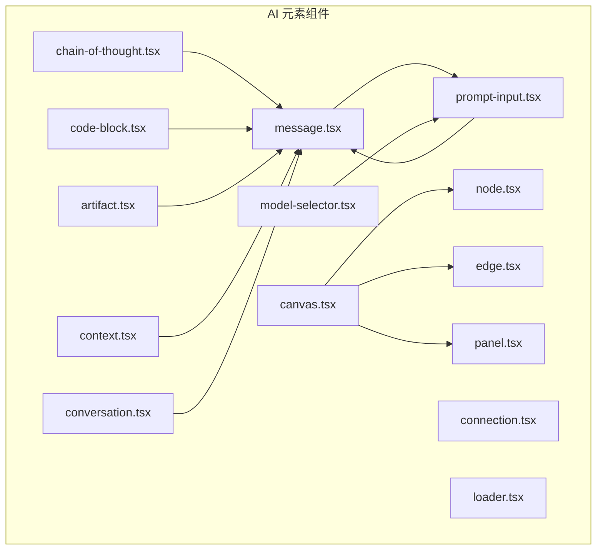
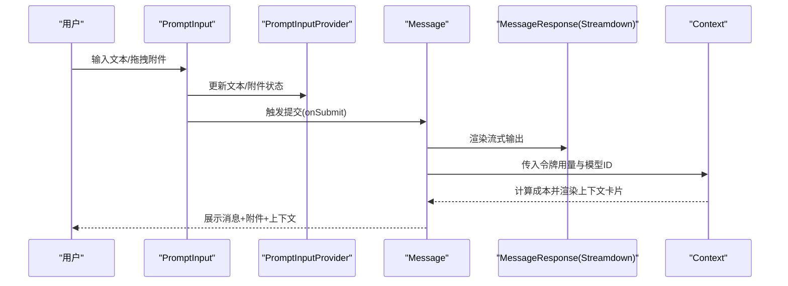
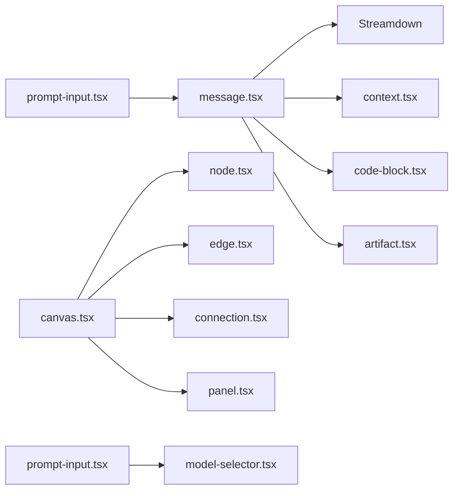

# AI 元素组件

<cite>
**本文引用的文件**
- [message.tsx](file://frontend/src/components/ai-elements/message.tsx)
- [chain-of-thought.tsx](file://frontend/src/components/ai-elements/chain-of-thought.tsx)
- [code-block.tsx](file://frontend/src/components/ai-elements/code-block.tsx)
- [artifact.tsx](file://frontend/src/components/ai-elements/artifact.tsx)
- [canvas.tsx](file://frontend/src/components/ai-elements/canvas.tsx)
- [context.tsx](file://frontend/src/components/ai-elements/context.tsx)
- [conversation.tsx](file://frontend/src/components/ai-elements/conversation.tsx)
- [node.tsx](file://frontend/src/components/ai-elements/node.tsx)
- [panel.tsx](file://frontend/src/components/ai-elements/panel.tsx)
- [edge.tsx](file://frontend/src/components/ai-elements/edge.tsx)
- [connection.tsx](file://frontend/src/components/ai-elements/connection.tsx)
- [loader.tsx](file://frontend/src/components/ai-elements/loader.tsx)
- [model-selector.tsx](file://frontend/src/components/ai-elements/model-selector.tsx)
- [prompt-input.tsx](file://frontend/src/components/ai-elements/prompt-input.tsx)
</cite>

## 目录
1. [简介](#简介)
2. [项目结构](#项目结构)
3. [核心组件](#核心组件)
4. [架构总览](#架构总览)
5. [组件详解](#组件详解)
6. [依赖关系分析](#依赖关系分析)
7. [性能考量](#性能考量)
8. [故障排查指南](#故障排查指南)
9. [结论](#结论)
10. [附录](#附录)

## 简介
本文件面向 DeerFlow 前端“AI 元素组件”体系，系统化梳理消息显示、思维链展示、代码块渲染、工件管理、画布与节点/边交互、上下文令牌与成本可视化、输入表单与附件管理、加载指示器与模型选择器等组件的设计理念、接口定义、状态管理与事件处理机制，并给出使用示例、自定义配置、性能优化建议、组件间通信模式与数据流、可访问性与响应式设计实践。

## 项目结构
AI 元素组件集中于前端仓库的 ai-elements 目录，围绕“消息-思维链-代码-工件-画布-上下文-输入-加载-模型选择”等主题模块化组织，采用组合式子组件（如 MessageContent、MessageAction）与上下文/Provider 模式实现跨层级共享状态与行为。

图表来源
- [message.tsx:23-56](file://frontend/src/components/ai-elements/message.tsx#L23-L56)
- [chain-of-thought.tsx:45-79](file://frontend/src/components/ai-elements/chain-of-thought.tsx#L45-L79)
- [code-block.tsx:17-130](file://frontend/src/components/ai-elements/code-block.tsx#L17-L130)
- [artifact.tsx:14-151](file://frontend/src/components/ai-elements/artifact.tsx#L14-L151)
- [canvas.tsx:5-22](file://frontend/src/components/ai-elements/canvas.tsx#L5-L22)
- [context.tsx:42-61](file://frontend/src/components/ai-elements/context.tsx#L42-L61)
- [conversation.tsx:10-20](file://frontend/src/components/ai-elements/conversation.tsx#L10-L20)
- [node.tsx:14-72](file://frontend/src/components/ai-elements/node.tsx#L14-L72)
- [edge.tsx:137-141](file://frontend/src/components/ai-elements/edge.tsx#L137-L141)
- [connection.tsx:5-28](file://frontend/src/components/ai-elements/connection.tsx#L5-L28)
- [panel.tsx:7-15](file://frontend/src/components/ai-elements/panel.tsx#L7-L15)
- [loader.tsx:82-96](file://frontend/src/components/ai-elements/loader.tsx#L82-L96)
- [model-selector.tsx:21-25](file://frontend/src/components/ai-elements/model-selector.tsx#L21-L25)
- [prompt-input.tsx:137-259](file://frontend/src/components/ai-elements/prompt-input.tsx#L137-L259)

章节来源
- [message.tsx:1-447](file://frontend/src/components/ai-elements/message.tsx#L1-L447)
- [chain-of-thought.tsx:1-240](file://frontend/src/components/ai-elements/chain-of-thought.tsx#L1-L240)
- [code-block.tsx:1-179](file://frontend/src/components/ai-elements/code-block.tsx#L1-L179)
- [artifact.tsx:1-151](file://frontend/src/components/ai-elements/artifact.tsx#L1-L151)
- [canvas.tsx:1-23](file://frontend/src/components/ai-elements/canvas.tsx#L1-L23)
- [context.tsx:1-409](file://frontend/src/components/ai-elements/context.tsx#L1-L409)
- [conversation.tsx:1-101](file://frontend/src/components/ai-elements/conversation.tsx#L1-L101)
- [node.tsx:1-72](file://frontend/src/components/ai-elements/node.tsx#L1-L72)
- [panel.tsx:1-16](file://frontend/src/components/ai-elements/panel.tsx#L1-L16)
- [edge.tsx:1-141](file://frontend/src/components/ai-elements/edge.tsx#L1-L141)
- [connection.tsx:1-29](file://frontend/src/components/ai-elements/connection.tsx#L1-L29)
- [loader.tsx:1-97](file://frontend/src/components/ai-elements/loader.tsx#L1-L97)
- [model-selector.tsx:1-209](file://frontend/src/components/ai-elements/model-selector.tsx#L1-L209)
- [prompt-input.tsx:1-800](file://frontend/src/components/ai-elements/prompt-input.tsx#L1-L800)

## 核心组件
- 消息与分支：Message、MessageContent、MessageActions、MessageAction；MessageBranch 及其子组件用于多分支内容切换与导航。
- 思维链：ChainOfThought、ChainOfThoughtHeader、ChainOfThoughtStep、ChainOfThoughtContent、ChainOfThoughtSearchResults、ChainOfThoughtSearchResult、ChainOfThoughtImage。
- 代码块：CodeBlock、CodeBlockCopyButton，支持高亮与复制。
- 工件：Artifact、ArtifactHeader、ArtifactTitle、ArtifactDescription、ArtifactActions、ArtifactAction、ArtifactContent、ArtifactClose。
- 画布与图元：Canvas（ReactFlow 容器）、Node（含 Handle）、Edge（临时/动画）、Connection（连接线）、Panel（面板容器）。
- 上下文与成本：Context、ContextTrigger、ContextContent、ContextContentHeader、ContextContentBody、ContextContentFooter、各类 Usage 组件。
- 会话与滚动：Conversation、ConversationContent、ConversationEmptyState、ConversationScrollButton。
- 输入与附件：PromptInputProvider、PromptInput、PromptInputAttachments、PromptInputAttachment、ModelSelector 系列。
- 加载：Loader。

章节来源
- [message.tsx:23-447](file://frontend/src/components/ai-elements/message.tsx#L23-L447)
- [chain-of-thought.tsx:45-240](file://frontend/src/components/ai-elements/chain-of-thought.tsx#L45-L240)
- [code-block.tsx:17-179](file://frontend/src/components/ai-elements/code-block.tsx#L17-L179)
- [artifact.tsx:14-151](file://frontend/src/components/ai-elements/artifact.tsx#L14-L151)
- [canvas.tsx:5-22](file://frontend/src/components/ai-elements/canvas.tsx#L5-L22)
- [context.tsx:42-409](file://frontend/src/components/ai-elements/context.tsx#L42-L409)
- [conversation.tsx:10-101](file://frontend/src/components/ai-elements/conversation.tsx#L10-L101)
- [node.tsx:14-72](file://frontend/src/components/ai-elements/node.tsx#L14-L72)
- [edge.tsx:137-141](file://frontend/src/components/ai-elements/edge.tsx#L137-L141)
- [connection.tsx:5-28](file://frontend/src/components/ai-elements/connection.tsx#L5-L28)
- [panel.tsx:7-15](file://frontend/src/components/ai-elements/panel.tsx#L7-L15)
- [loader.tsx:82-96](file://frontend/src/components/ai-elements/loader.tsx#L82-L96)
- [model-selector.tsx:21-209](file://frontend/src/components/ai-elements/model-selector.tsx#L21-L209)
- [prompt-input.tsx:137-800](file://frontend/src/components/ai-elements/prompt-input.tsx#L137-L800)

## 架构总览
AI 元素组件通过 React 上下文与 Provider 实现跨层级状态共享，典型模式如下：
- 控制器/上下文：如 PromptInputController、MessageBranchContext、CodeBlockContext、ContextContext。
- 子组件：在各自作用域内消费上下文，暴露统一的 Props 接口与事件回调。
- 外观与布局：通过 cn 组合工具类与 Tailwind 类名实现一致的视觉与交互风格。
- 数据流：从 PromptInput 收集文本与附件，经消息容器渲染，配合上下文展示令牌用量与成本，最终在画布中以节点/边呈现。

图表来源
- [prompt-input.tsx:438-776](file://frontend/src/components/ai-elements/prompt-input.tsx#L438-L776)
- [message.tsx:305-320](file://frontend/src/components/ai-elements/message.tsx#L305-L320)
- [context.tsx:42-229](file://frontend/src/components/ai-elements/context.tsx#L42-L229)

## 组件详解

### 消息与附件（Message）
- 设计理念：区分用户与助手角色，支持附件预览、移除、分支切换与工具栏。
- Props 接口
  - MessageProps: from（角色）、HTMLAttributes
  - MessageContentProps: HTMLAttributes
  - MessageActionsProps: 组件属性
  - MessageActionProps: 继承 Button，支持 tooltip/label
  - MessageBranchProps: defaultBranch、onBranchChange、HTMLAttributes
  - MessageBranchContentProps: HTMLAttributes
  - MessageBranchSelectorProps: from（角色）
  - MessageBranchPrevious/Next/PageProps: 导航与页码
  - MessageResponseProps: 继承 Streamdown
  - MessageAttachmentProps: data（文件信息）、onRemove
  - MessageAttachmentsProps: 子元素集合
  - MessageToolbarProps: 工具栏容器
- 状态与事件
  - 分支切换：useEffect 同步分支列表，memo 包裹减少重渲染
  - 附件：根据媒体类型渲染图片或文件图标，悬停显示删除按钮
  - 流式响应：Streamdown 包装，按 children 引用相等性进行浅比较
- 可访问性与响应式
  - sr-only 文本用于屏幕阅读器
  - 悬停/焦点态通过 Tooltip/HoverCard 提供辅助信息
  - 响应式布局随容器宽度变化自动换行

章节来源
- [message.tsx:23-447](file://frontend/src/components/ai-elements/message.tsx#L23-L447)

### 思维链（ChainOfThought）
- 设计理念：折叠/展开的思维链步骤展示，支持步骤状态（完成/进行中/待定）与搜索结果标签。
- Props 接口
  - ChainOfThoughtProps: open/defaultOpen/onOpenChange、HTMLAttributes
  - ChainOfThoughtHeaderProps: 自定义图标
  - ChainOfThoughtStepProps: icon/label/description/status、children
  - ChainOfThoughtSearchResultsProps: 容器
  - ChainOfThoughtSearchResultProps: Badge
  - ChainOfThoughtContentProps: 折叠内容
  - ChainOfThoughtImageProps: 图片容器与可选标题
- 状态与事件
  - 使用受控/非受控状态组合，通过 useControllableState 管理打开状态
  - 步骤状态样式随状态切换，动画入场
- 可访问性与响应式
  - 使用 Collapsible 与图标旋转表达展开状态
  - 响应式换行与最小字体适配

章节来源
- [chain-of-thought.tsx:45-240](file://frontend/src/components/ai-elements/chain-of-thought.tsx#L45-L240)

### 代码块（CodeBlock）
- 设计理念：基于 Shiki 的语法高亮，同时生成明暗两套 HTML，支持行号与复制。
- Props 接口
  - CodeBlockProps: code、language、showLineNumbers、HTMLAttributes
  - CodeBlockCopyButtonProps: onCopy/onError/timeout、Button 属性
- 状态与事件
  - 首次挂载异步高亮，缓存两套 HTML，避免重复计算
  - 复制到剪贴板，成功后短暂提示并回调
- 性能优化
  - highlightCode 并行生成明暗主题，useMemo 降低上下文重建
  - dangerouslySetInnerHTML 直接注入，减少 DOM 节点层级

章节来源
- [code-block.tsx:17-179](file://frontend/src/components/ai-elements/code-block.tsx#L17-L179)

### 工件（Artifact）
- 设计理念：可关闭的工件容器，包含头部、标题、描述、操作区与内容区。
- Props 接口
  - ArtifactProps/ArtifactHeader/ArtifactTitle/ArtifactDescription/ArtifactActions/ArtifactAction/ArtifactContent/ArtifactClose
- 交互
  - Action 支持 Tooltip，图标可替换
  - Close 按钮提供无障碍标签
- 可访问性
  - sr-only 文本与语义化标签

章节来源
- [artifact.tsx:14-151](file://frontend/src/components/ai-elements/artifact.tsx#L14-L151)

### 画布与图元（Canvas/Node/Edge/Connection/Panel）
- 设计理念：基于 @xyflow/react 的可交互画布，支持拖拽、缩放、连线与动画效果。
- Props 接口
  - CanvasProps: ReactFlowProps 扩展，支持 children
  - NodeProps: handles（target/source）、Card 扩展
  - Edge 辅助函数：Temporary、Animated
  - Connection: 自定义连接线组件
  - PanelProps: 面板容器
- 行为
  - Canvas 默认禁用删除键、禁用 panOnDrag、启用 panOnScroll、启用框选、禁用双击缩放
  - Node 自动注入 Handle（左/右），便于连接
  - Edge.Animated 使用贝塞尔曲线与动画小球
  - Connection 提供自绘路径与终点圆点
- 可访问性与响应式
  - 通过 Handle 与边样式表达连接方向
  - 响应式容器适配不同尺寸

章节来源
- [canvas.tsx:5-22](file://frontend/src/components/ai-elements/canvas.tsx#L5-L22)
- [node.tsx:14-72](file://frontend/src/components/ai-elements/node.tsx#L14-L72)
- [edge.tsx:137-141](file://frontend/src/components/ai-elements/edge.tsx#L137-L141)
- [connection.tsx:5-28](file://frontend/src/components/ai-elements/connection.tsx#L5-L28)
- [panel.tsx:7-15](file://frontend/src/components/ai-elements/panel.tsx#L7-L15)

### 上下文与成本（Context）
- 设计理念：悬浮卡片展示令牌用量与成本估算，支持输入/输出/推理/缓存细项。
- Props 接口
  - ContextProps: usedTokens/maxTokens/usage/modelId、HoverCard 扩展
  - ContextTriggerProps/ContextContentProps/ContextContentHeader/ContextContentBody/ContextContentFooter
  - ContextInputUsage/ContextOutputUsage/ContextReasoningUsage/ContextCacheUsage
- 行为
  - SVG 圆环进度条表示使用率
  - tokenlens 计算成本 USD
  - 数字格式化与紧凑记数
- 可访问性
  - 图标具备 aria-label
  - 卡片结构清晰分节

章节来源
- [context.tsx:42-409](file://frontend/src/components/ai-elements/context.tsx#L42-L409)

### 会话与滚动（Conversation）
- 设计理念：粘底滚动容器，自动定位到底部，提供“回到底部”按钮。
- Props 接口
  - ConversationProps: StickToBottom 扩展
  - ConversationContentProps: 内容容器
  - ConversationEmptyStateProps: 标题/描述/图标
  - ConversationScrollButtonProps: 滚动按钮
- 行为
  - 初始与调整均平滑滚动
  - 当不在底部时显示按钮
- 可访问性
  - role="log" 提供语义化角色

章节来源
- [conversation.tsx:10-101](file://frontend/src/components/ai-elements/conversation.tsx#L10-L101)

### 输入与附件（PromptInput）
- 设计理念：可选全局 Provider 提升状态外置能力，支持拖拽/粘贴/文件选择、附件预览与移除、错误约束与异步提交。
- Props 接口
  - PromptInputProviderProps: initialInput
  - PromptInputProps: accept/multiple/globalDrop/syncHiddenInput/maxFiles/maxFileSize/onError/onSubmit、HTMLAttributes
  - PromptInputAttachmentsProps: children 回调
  - PromptInputAttachmentProps: data（含 id/url/mediaType/filename）
  - ModelSelector 系列：对话框、触发器、内容、输入、列表、空状态、分组、条目、快捷键、分隔符、Logo、LogoGroup、名称
- 状态与事件
  - Provider 模式：统一文本与附件状态，支持注册隐藏文件输入
  - 本地模式：组件内部维护附件列表，清理 Blob URL
  - 文件校验：accept 模式匹配、maxFileSize、maxFiles
  - 提交：异步转换 blob URL 为 data URL，调用 onSubmit 并清空附件
  - 错误回调：max_files/max_file_size/accept
- 可访问性与响应式
  - sr-only 文本与 aria-label
  - 响应式换行与紧凑布局

章节来源
- [prompt-input.tsx:137-800](file://frontend/src/components/ai-elements/prompt-input.tsx#L137-L800)
- [model-selector.tsx:21-209](file://frontend/src/components/ai-elements/model-selector.tsx#L21-L209)

### 加载指示器（Loader）
- 设计理念：自绘旋转图标，支持尺寸定制。
- Props 接口
  - LoaderProps: size、HTMLAttributes
- 行为
  - 动画旋转，SVG 路径绘制多段弧线
- 可访问性
  - title 标签提供语义

章节来源
- [loader.tsx:82-96](file://frontend/src/components/ai-elements/loader.tsx#L82-L96)

## 依赖关系分析

图表来源
- [prompt-input.tsx:438-776](file://frontend/src/components/ai-elements/prompt-input.tsx#L438-L776)
- [message.tsx:305-320](file://frontend/src/components/ai-elements/message.tsx#L305-L320)
- [context.tsx:42-229](file://frontend/src/components/ai-elements/context.tsx#L42-L229)
- [code-block.tsx:17-130](file://frontend/src/components/ai-elements/code-block.tsx#L17-L130)
- [artifact.tsx:14-151](file://frontend/src/components/ai-elements/artifact.tsx#L14-L151)
- [canvas.tsx:5-22](file://frontend/src/components/ai-elements/canvas.tsx#L5-L22)
- [node.tsx:14-72](file://frontend/src/components/ai-elements/node.tsx#L14-L72)
- [edge.tsx:137-141](file://frontend/src/components/ai-elements/edge.tsx#L137-L141)
- [connection.tsx:5-28](file://frontend/src/components/ai-elements/connection.tsx#L5-L28)
- [panel.tsx:7-15](file://frontend/src/components/ai-elements/panel.tsx#L7-L15)
- [model-selector.tsx:21-209](file://frontend/src/components/ai-elements/model-selector.tsx#L21-L209)

## 性能考量
- 代码高亮
  - 并行生成明暗主题 HTML，避免重复计算
  - 使用 memo 包裹响应组件，按 children 引用相等性短路
- 附件与 Blob URL
  - 组件卸载时统一回收 URL.createObjectURL，防止内存泄漏
  - 提交前异步转换 blob 为 data URL，保证服务端可用
- 画布交互
  - Canvas 默认禁用 panOnDrag 与双击缩放，降低不必要的重绘
  - Edge.Animated 使用动画小球与贝塞尔路径，注意在大量节点场景下的性能
- 文本与布局
  - 使用 cn 组合类名，减少内联样式的复杂度
  - 响应式断点与紧凑数字格式化，提升移动端体验

## 故障排查指南
- 附件无法上传/超出限制
  - 检查 accept 模式是否正确，maxFileSize 与 maxFiles 是否设置合理
  - onError 回调返回的 code 与 message 用于定位问题
- 提交后附件未清空
  - 确认 onSubmit 返回值是否为 Promise，Promise 拒绝不会清空附件
- 画布连线异常
  - 确认 Node 的 handles 配置（target/source）与 Edge 参数一致
  - 检查 Handle 的位置与坐标偏移逻辑
- 上下文卡片不显示成本
  - 确保传入 modelId 与 usage（input/output/reasoning/cachedInput）
- 代码块复制失败
  - 检查浏览器 Clipboard API 可用性与权限
- 消息分支不更新
  - 确认 MessageBranchContent 的 childrenArray 长度与 setBranches 同步

章节来源
- [prompt-input.tsx:518-567](file://frontend/src/components/ai-elements/prompt-input.tsx#L518-L567)
- [prompt-input.tsx:715-776](file://frontend/src/components/ai-elements/prompt-input.tsx#L715-L776)
- [edge.tsx:42-103](file://frontend/src/components/ai-elements/edge.tsx#L42-L103)
- [context.tsx:198-228](file://frontend/src/components/ai-elements/context.tsx#L198-L228)
- [code-block.tsx:149-163](file://frontend/src/components/ai-elements/code-block.tsx#L149-L163)
- [message.tsx:191-196](file://frontend/src/components/ai-elements/message.tsx#L191-L196)

## 结论
DeerFlow 的 AI 元素组件以“可组合、可扩展、可访问”为核心目标，通过上下文与 Provider 将状态与行为下沉至子组件，既满足复杂场景下的灵活配置，又保持了统一的外观与交互体验。在实际使用中，建议优先采用 Provider 模式管理输入与附件，结合 Context 展示令牌与成本，利用 Canvas 构建可视化流程，并通过 Loader 与 ModelSelector 提升用户体验。

## 附录
- 使用示例（路径指引）
  - 在会话中渲染消息与附件：[message.tsx:27-56](file://frontend/src/components/ai-elements/message.tsx#L27-L56)
  - 展示思维链步骤：[chain-of-thought.tsx:123-162](file://frontend/src/components/ai-elements/chain-of-thought.tsx#L123-L162)
  - 渲染代码块并添加复制按钮：[code-block.tsx:75-130](file://frontend/src/components/ai-elements/code-block.tsx#L75-L130)
  - 创建工件容器与操作区：[artifact.tsx:16-90](file://frontend/src/components/ai-elements/artifact.tsx#L16-L90)
  - 初始化画布与节点/边：[canvas.tsx:9-22](file://frontend/src/components/ai-elements/canvas.tsx#L9-L22)
  - 展示上下文与成本：[context.tsx:130-229](file://frontend/src/components/ai-elements/context.tsx#L130-L229)
  - 构建输入表单与附件：[prompt-input.tsx:438-776](file://frontend/src/components/ai-elements/prompt-input.tsx#L438-L776)
  - 显示加载指示器：[loader.tsx:86-96](file://frontend/src/components/ai-elements/loader.tsx#L86-L96)
  - 打开模型选择器：[model-selector.tsx:23-49](file://frontend/src/components/ai-elements/model-selector.tsx#L23-L49)