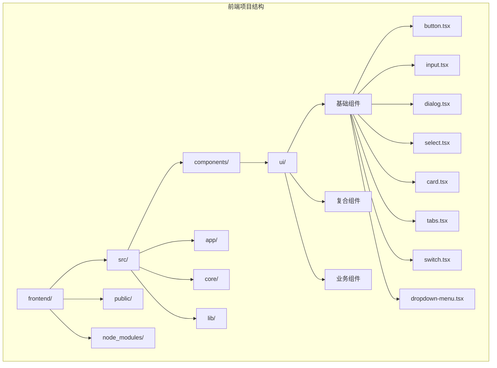
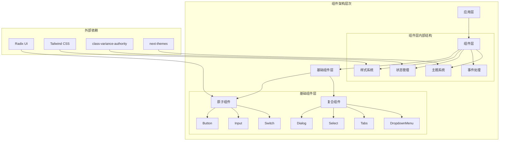
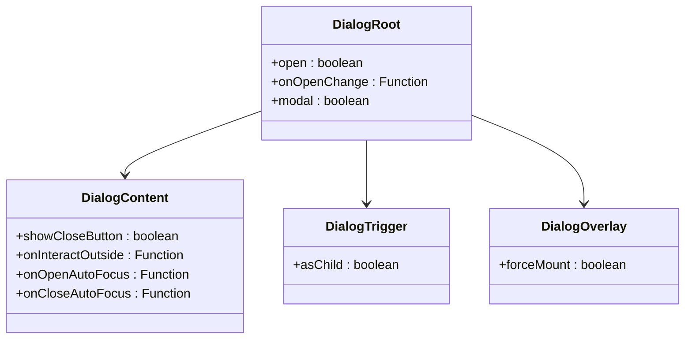
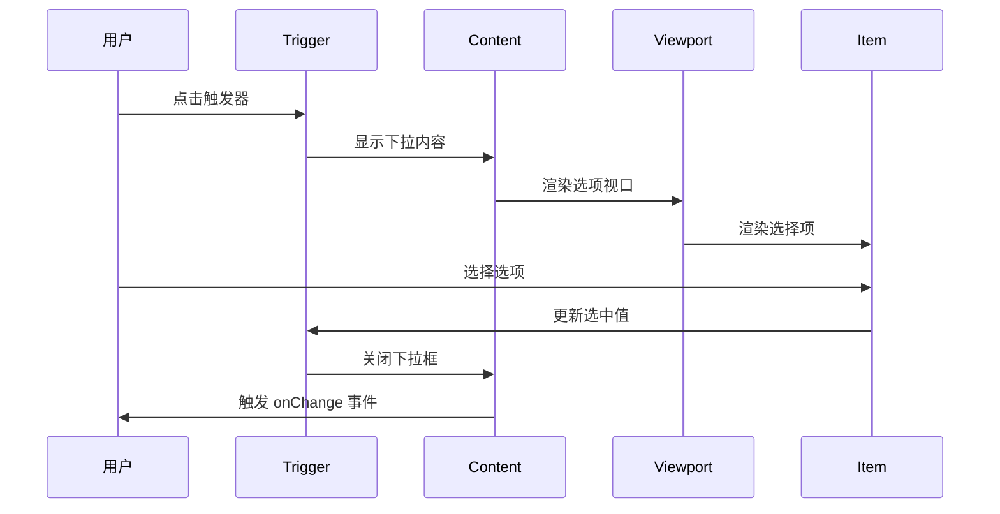
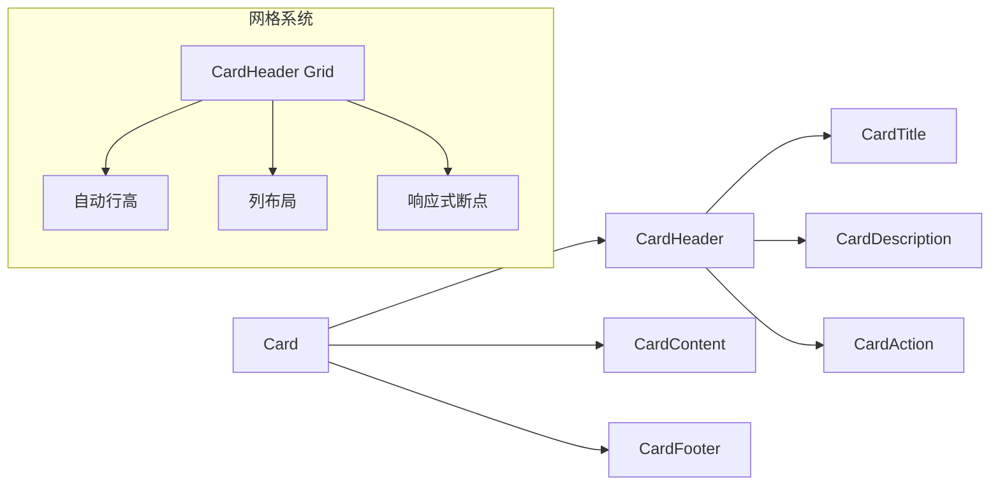
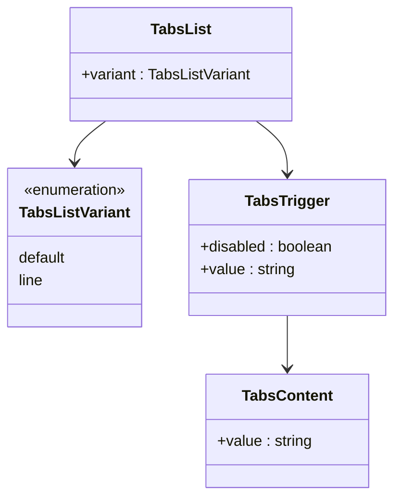
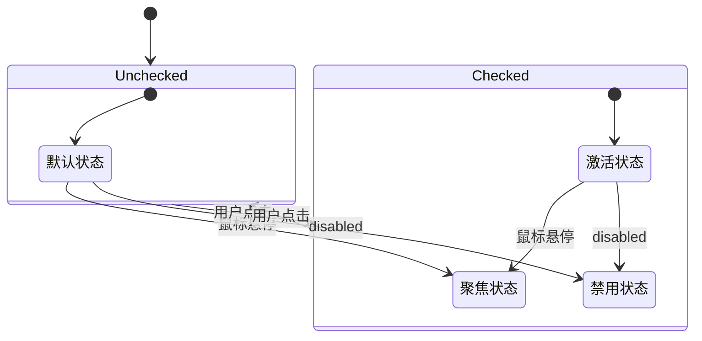
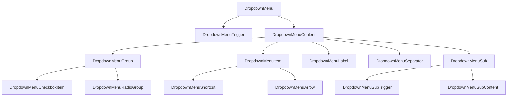
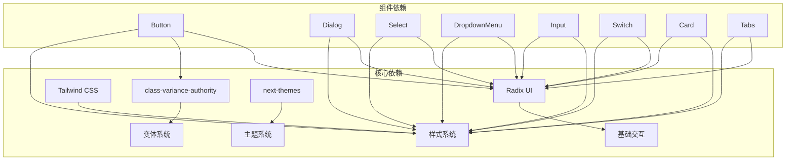
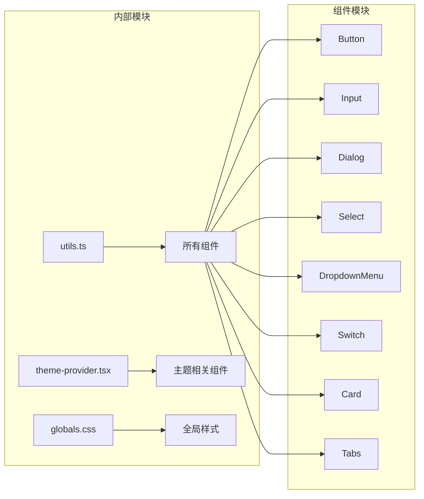

# UI 基础组件

<cite>
**本文档引用的文件**
- [frontend/src/components/ui/button.tsx](file://frontend/src/components/ui/button.tsx)
- [frontend/src/components/ui/input.tsx](file://frontend/src/components/ui/input.tsx)
- [frontend/src/components/ui/dialog.tsx](file://frontend/src/components/ui/dialog.tsx)
- [frontend/src/components/ui/select.tsx](file://frontend/src/components/ui/select.tsx)
- [frontend/src/components/ui/card.tsx](file://frontend/src/components/ui/card.tsx)
- [frontend/src/components/ui/tabs.tsx](file://frontend/src/components/ui/tabs.tsx)
- [frontend/src/components/ui/switch.tsx](file://frontend/src/components/ui/switch.tsx)
- [frontend/src/components/ui/dropdown-menu.tsx](file://frontend/src/components/ui/dropdown-menu.tsx)
- [frontend/package.json](file://frontend/package.json)
- [frontend/src/lib/utils.ts](file://frontend/src/lib/utils.ts)
- [frontend/src/theme-provider.tsx](file://frontend/src/theme-provider.tsx)
- [frontend/src/styles/globals.css](file://frontend/src/styles/globals.css)
</cite>

## 目录
1. [简介](#简介)
2. [项目结构](#项目结构)
3. [核心组件](#核心组件)
4. [架构概览](#架构概览)
5. [详细组件分析](#详细组件分析)
6. [依赖关系分析](#依赖关系分析)
7. [性能考虑](#性能考虑)
8. [故障排除指南](#故障排除指南)
9. [结论](#结论)
10. [附录](#附录)

## 简介

DeerFlow 的 UI 基础组件库基于 Radix UI 构建，采用原子级设计原则，提供了完整的用户界面组件生态系统。该组件库专注于可访问性、主题一致性和开发体验，为构建复杂的 AI 应用界面提供了坚实的基础。

组件库的核心特性包括：
- 基于 Radix UI 的语义化组件
- 原子级设计模式，支持灵活组合
- 完善的可访问性支持
- 主题系统集成
- 响应式设计优化
- 类型安全的 TypeScript 实现

## 项目结构

前端项目采用模块化的组织方式，UI 组件位于 `frontend/src/components/ui/` 目录下，每个组件都是独立的模块，可以单独导入和使用。



**图表来源**
- [frontend/package.json:1-111](file://frontend/package.json#L1-L111)

**章节来源**
- [frontend/package.json:1-111](file://frontend/package.json#L1-L111)

## 核心组件

### 组件分类与职责

UI 组件库按照功能和复杂度分为以下几类：

1. **基础原子组件**：提供最小可用功能，如按钮、输入框、开关等
2. **复合容器组件**：包含多个基础组件，如对话框、选择器、标签页等
3. **布局组件**：用于页面结构组织，如卡片、侧边栏等
4. **交互组件**：提供复杂交互功能，如下拉菜单、工具提示等

### 设计原则

- **原子级设计**：每个组件只负责单一功能
- **可组合性**：组件可以灵活组合形成复杂界面
- **可访问性优先**：内置无障碍支持
- **主题一致性**：统一的设计语言和视觉风格
- **类型安全**：完整的 TypeScript 类型定义

**章节来源**
- [frontend/src/components/ui/button.tsx:1-64](file://frontend/src/components/ui/button.tsx#L1-L64)
- [frontend/src/components/ui/input.tsx:1-22](file://frontend/src/components/ui/input.tsx#L1-L22)

## 架构概览

组件库采用分层架构设计，确保了良好的可维护性和扩展性。



**图表来源**
- [frontend/src/components/ui/button.tsx:1-64](file://frontend/src/components/ui/button.tsx#L1-L64)
- [frontend/src/components/ui/dialog.tsx:1-144](file://frontend/src/components/ui/dialog.tsx#L1-L144)
- [frontend/src/components/ui/select.tsx:1-191](file://frontend/src/components/ui/select.tsx#L1-L191)

## 详细组件分析

### 按钮组件 (Button)

按钮组件是 UI 库中最基础且最重要的组件之一，提供了丰富的变体和尺寸选项。

#### API 接口定义

```mermaid
classDiagram
class ButtonProps {
+className : string
+variant : ButtonVariant
+size : ButtonSize
+asChild : boolean
+onClick : Function
+disabled : boolean
}
class ButtonVariant {
<<enumeration>>
default
destructive
outline
secondary
ghost
link
}
class ButtonSize {
<<enumeration>>
default
sm
lg
icon
"icon-sm"
"icon-lg"
}
ButtonProps --> ButtonVariant
ButtonProps --> ButtonSize
```

**图表来源**
- [frontend/src/components/ui/button.tsx:40-64](file://frontend/src/components/ui/button.tsx#L40-L64)

#### 变体配置详解

| 变体类型 | 颜色方案 | 使用场景 |
|---------|---------|---------|
| default | 主色调背景，白色文字 | 主要操作按钮 |
| destructive | 红色调背景 | 危险操作（删除、移除） |
| outline | 边框样式，透明背景 | 次要操作或取消按钮 |
| secondary | 次要背景色 | 非主要操作 |
| ghost | 透明背景 | 工具栏按钮 |
| link | 文本样式 | 导航链接 |

#### 尺寸规格

| 尺寸 | 高度 | 内边距 | 图标尺寸 |
|------|------|--------|----------|
| default | 36px | 16px 8px | 16px |
| sm | 32px | 12px 6px | 14px |
| lg | 40px | 24px 10px | 18px |
| icon | 36px | - | 16px |
| icon-sm | 32px | - | 14px |
| icon-lg | 40px | - | 18px |

**章节来源**
- [frontend/src/components/ui/button.tsx:7-38](file://frontend/src/components/ui/button.tsx#L7-L38)

### 输入框组件 (Input)

输入框组件提供了统一的表单输入体验，支持多种输入类型和状态反馈。

#### 样式系统架构

```mermaid
flowchart TD
A[Input 组件] --> B[基础样式]
B --> C[焦点状态]
B --> D[禁用状态]
B --> E[错误状态]
B --> F[选中状态]
C --> G[ring-ring/50 3px]
D --> H[opacity-50]
E --> I[destructive 配色]
F --> J[primary 配色]
K[数据属性] --> L[data-slot="input"]
K --> M[aria-invalid]
K --> N[data-state]
```

**图表来源**
- [frontend/src/components/ui/input.tsx:5-19](file://frontend/src/components/ui/input.tsx#L5-L19)

#### 状态管理机制

输入框组件通过多种数据属性来标识不同的状态：

- `data-slot="input"`: 组件标识符
- `aria-invalid`: 无障碍错误状态
- `data-state`: Radix UI 状态同步

**章节来源**
- [frontend/src/components/ui/input.tsx:1-22](file://frontend/src/components/ui/input.tsx#L1-L22)

### 对话框组件 (Dialog)

对话框组件提供了模态对话框的完整解决方案，支持多种打开方式和自定义选项。

#### 组件结构设计



**图表来源**
- [frontend/src/components/ui/dialog.tsx:9-144](file://frontend/src/components/ui/dialog.tsx#L9-L144)

#### 动画系统

对话框组件集成了完整的动画系统，提供流畅的开合效果：

- `animate-in`: 打开时的进入动画
- `animate-out`: 关闭时的退出动画
- `fade-in/out`: 淡入淡出效果
- `zoom-in/out`: 缩放效果
- `slide-in-from-*`: 从不同方向滑入

**章节来源**
- [frontend/src/components/ui/dialog.tsx:33-81](file://frontend/src/components/ui/dialog.tsx#L33-L81)

### 选择器组件 (Select)

选择器组件提供了增强的下拉选择功能，支持搜索、分组和多选等高级特性。

#### 复杂交互流程



**图表来源**
- [frontend/src/components/ui/select.tsx:9-191](file://frontend/src/components/ui/select.tsx#L9-L191)

#### 选项管理机制

选择器组件支持多种选项类型：

- `SelectItem`: 基础选项
- `SelectLabel`: 分组标签
- `SelectSeparator`: 分隔线
- `SelectGroup`: 选项分组

**章节来源**
- [frontend/src/components/ui/select.tsx:103-128](file://frontend/src/components/ui/select.tsx#L103-L128)

### 卡片组件 (Card)

卡片组件提供了灵活的内容容器，支持头部、标题、描述、内容和底部等区域的组合。

#### 布局系统



**图表来源**
- [frontend/src/components/ui/card.tsx:5-93](file://frontend/src/components/ui/card.tsx#L5-L93)

#### 自适应布局

卡片组件采用了现代化的 CSS Grid 和 @container 查询技术：

- `@container/card-header`: 容器查询
- `grid-auto-rows`: 自动行高
- `grid-template-rows`: 灵活的网格布局
- `has-data-[slot=card-action]`: 条件布局

**章节来源**
- [frontend/src/components/ui/card.tsx:18-39](file://frontend/src/components/ui/card.tsx#L18-L39)

### 标签组件 (Tabs)

标签组件提供了标签页切换功能，支持水平和垂直两种布局模式。

#### 变体系统



**图表来源**
- [frontend/src/components/ui/tabs.tsx:28-92](file://frontend/src/components/ui/tabs.tsx#L28-L92)

#### 状态指示器

标签组件内置了智能的状态指示器：

- `data-[state=active]`: 激活状态
- `after` 伪元素: 下划线指示器
- 支持水平和垂直两种指示器方向

**章节来源**
- [frontend/src/components/ui/tabs.tsx:59-76](file://frontend/src/components/ui/tabs.tsx#L59-L76)

### 开关组件 (Switch)

开关组件提供了二进制状态切换功能，具有直观的视觉反馈。

#### 状态管理



**图表来源**
- [frontend/src/components/ui/switch.tsx:8-32](file://frontend/src/components/ui/switch.tsx#L8-L32)

#### 动画过渡

开关组件实现了平滑的动画过渡效果：

- `transition-transform`: 拇指移动动画
- `data-[state=checked]`: 激活状态样式
- `data-[state=unchecked]`: 未激活状态样式

**章节来源**
- [frontend/src/components/ui/switch.tsx:12-28](file://frontend/src/components/ui/switch.tsx#L12-L28)

### 下拉菜单组件 (DropdownMenu)

下拉菜单组件提供了完整的上下文菜单解决方案，支持嵌套菜单和复杂交互。

#### 复杂菜单结构



**图表来源**
- [frontend/src/components/ui/dropdown-menu.tsx:9-258](file://frontend/src/components/ui/dropdown-menu.tsx#L9-L258)

#### 交互模式

下拉菜单支持多种交互模式：

- **基础菜单项**: 简单的点击操作
- **复选框菜单项**: 多选状态管理
- **单选菜单组**: 互斥选择
- **嵌套子菜单**: 层级菜单结构
- **快捷键显示**: 键盘快捷键提示

**章节来源**
- [frontend/src/components/ui/dropdown-menu.tsx:85-144](file://frontend/src/components/ui/dropdown-menu.tsx#L85-L144)

## 依赖关系分析

### 外部依赖架构

组件库的依赖关系清晰明确，每个组件都依赖于特定的外部库来实现其功能。



**图表来源**
- [frontend/package.json:27-42](file://frontend/package.json#L27-L42)

### 内部依赖关系

组件之间的依赖关系遵循单一职责原则，避免了循环依赖。



**图表来源**
- [frontend/src/lib/utils.ts](file://frontend/src/lib/utils.ts)
- [frontend/src/theme-provider.tsx](file://frontend/src/theme-provider.tsx)

**章节来源**
- [frontend/package.json:17-87](file://frontend/package.json#L17-L87)

## 性能考虑

### 渲染优化策略

组件库在设计时充分考虑了性能优化：

1. **懒加载 Portal**: 对话框和下拉菜单使用 Portal 模式，避免 DOM 树过深
2. **条件渲染**: 复杂组件根据状态动态渲染子元素
3. **CSS 变量**: 使用 CSS 变量减少样式计算开销
4. **事件委托**: 合理使用事件委托减少事件处理器数量

### 内存管理

- **组件卸载清理**: 确保组件卸载时清理事件监听器
- **状态重置**: 对话框关闭时重置内部状态
- **资源释放**: 下拉菜单隐藏时释放不必要的资源

## 故障排除指南

### 常见问题诊断

#### 可访问性问题

**症状**: 屏幕阅读器无法正确读取组件状态

**解决方案**:
1. 检查 `aria-*` 属性是否正确设置
2. 确认键盘导航是否正常工作
3. 验证焦点管理逻辑

#### 样式冲突问题

**症状**: 组件样式与其他样式库冲突

**解决方案**:
1. 检查 Tailwind CSS 的重要性标记
2. 确认 CSS 作用域隔离
3. 验证组件样式优先级

#### 交互异常问题

**症状**: 组件交互不符合预期

**解决方案**:
1. 检查事件处理器绑定
2. 验证状态更新逻辑
3. 确认组件生命周期管理

**章节来源**
- [frontend/src/components/ui/dialog.tsx:33-81](file://frontend/src/components/ui/dialog.tsx#L33-L81)
- [frontend/src/components/ui/select.tsx:53-88](file://frontend/src/components/ui/select.tsx#L53-L88)

## 结论

DeerFlow 的 UI 基础组件库展现了现代前端组件设计的最佳实践。通过基于 Radix UI 的架构设计、完善的可访问性支持和灵活的主题系统，为构建高质量的 AI 应用界面提供了坚实的基础。

组件库的主要优势包括：
- **原子级设计**: 提供最小可用功能，支持灵活组合
- **可访问性优先**: 内置无障碍支持，符合 WCAG 标准
- **主题一致性**: 统一的设计语言和视觉风格
- **类型安全**: 完整的 TypeScript 类型定义
- **性能优化**: 经过精心设计的渲染和内存管理策略

未来的发展方向包括：
- 扩展组件生态系统的覆盖范围
- 进一步优化性能表现
- 增强主题系统的灵活性
- 完善测试覆盖率和文档质量

## 附录

### 组件使用示例

#### 基础按钮使用
```typescript
// 基础按钮
<Button>点击我</Button>

// 带图标的按钮
<Button variant="outline" size="icon">
  <Icon />
</Button>
```

#### 表单组件组合
```typescript
// 输入框与按钮组合
<div className="flex gap-2">
  <Input placeholder="请输入内容" />
  <Button type="submit">提交</Button>
</div>
```

#### 复杂交互组件
```typescript
// 下拉菜单
<DropdownMenu>
  <DropdownMenuTrigger>菜单</DropdownMenuTrigger>
  <DropdownMenuContent>
    <DropdownMenuItem>选项1</DropdownMenuItem>
    <DropdownMenuItem>选项2</DropdownMenuItem>
  </DropdownMenuContent>
</DropdownMenu>
```

### 最佳实践建议

1. **组件选择**: 根据具体需求选择合适的组件变体
2. **样式定制**: 通过 className 和变体参数进行样式定制
3. **状态管理**: 合理管理组件状态，避免不必要的重新渲染
4. **可访问性**: 确保组件具备完整的可访问性支持
5. **性能优化**: 注意组件的渲染性能和内存使用