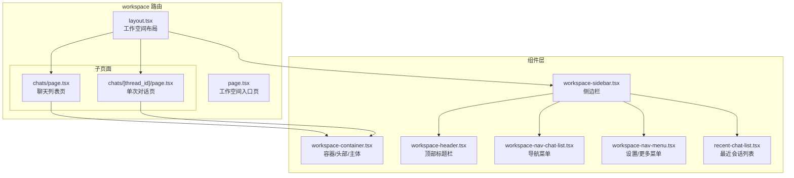
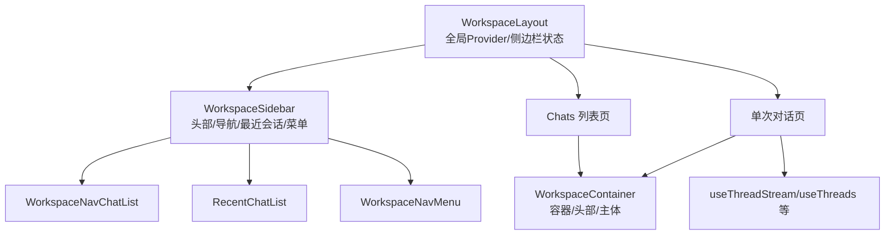
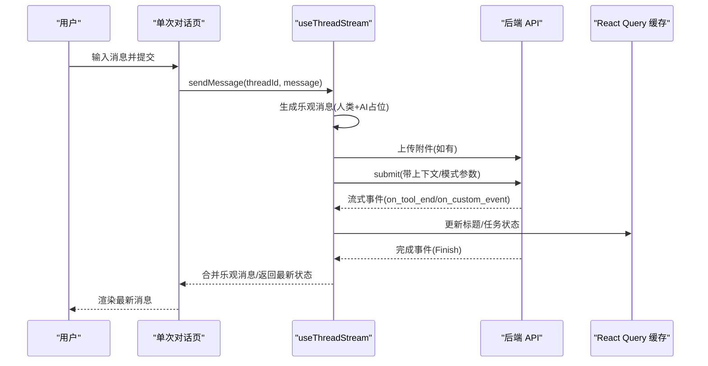
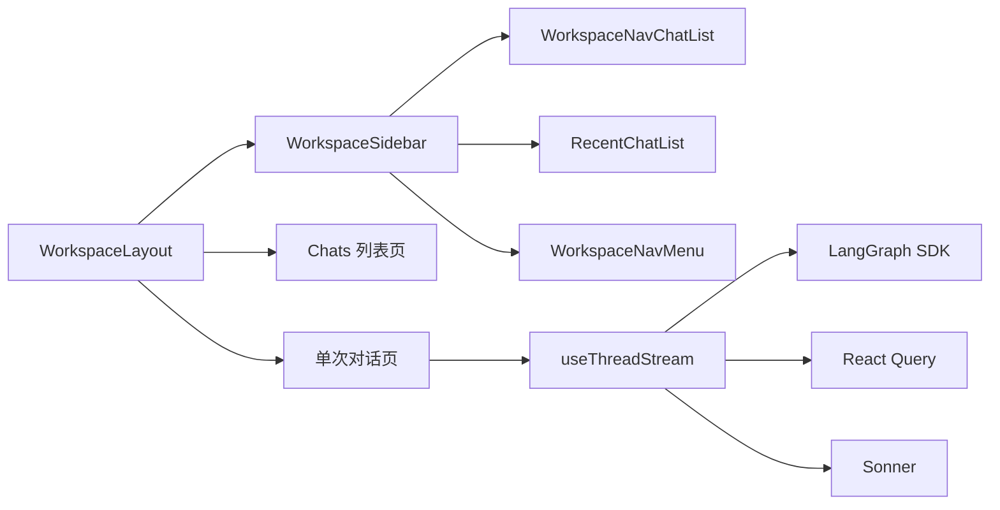

# 工作空间组件

<cite>
**本文引用的文件**
- [frontend/src/app/workspace/layout.tsx](file://frontend/src/app/workspace/layout.tsx)
- [frontend/src/app/workspace/page.tsx](file://frontend/src/app/workspace/page.tsx)
- [frontend/src/components/workspace/workspace-container.tsx](file://frontend/src/components/workspace/workspace-container.tsx)
- [frontend/src/components/workspace/workspace-header.tsx](file://frontend/src/components/workspace/workspace-header.tsx)
- [frontend/src/components/workspace/workspace-sidebar.tsx](file://frontend/src/components/workspace/workspace-sidebar.tsx)
- [frontend/src/components/workspace/workspace-nav-chat-list.tsx](file://frontend/src/components/workspace/workspace-nav-chat-list.tsx)
- [frontend/src/components/workspace/workspace-nav-menu.tsx](file://frontend/src/components/workspace/workspace-nav-menu.tsx)
- [frontend/src/components/workspace/recent-chat-list.tsx](file://frontend/src/components/workspace/recent-chat-list.tsx)
- [frontend/src/app/workspace/chats/page.tsx](file://frontend/src/app/workspace/chats/page.tsx)
- [frontend/src/app/workspace/chats/[thread_id]/page.tsx](file://frontend/src/app/workspace/chats/[thread_id]/page.tsx)
- [frontend/src/components/workspace/chats/index.ts](file://frontend/src/components/workspace/chats/index.ts)
- [frontend/src/components/workspace/messages/index.ts](file://frontend/src/components/workspace/messages/index.ts)
- [frontend/src/components/workspace/artifacts/index.ts](file://frontend/src/components/workspace/artifacts/index.ts)
- [frontend/src/components/workspace/settings/index.ts](file://frontend/src/components/workspace/settings/index.ts)
- [frontend/src/core/threads/hooks.ts](file://frontend/src/core/threads/hooks.ts)
</cite>

## 目录
1. [简介](#简介)
2. [项目结构](#项目结构)
3. [核心组件](#核心组件)
4. [架构总览](#架构总览)
5. [组件详解](#组件详解)
6. [依赖关系分析](#依赖关系分析)
7. [性能与体验优化](#性能与体验优化)
8. [故障排查指南](#故障排查指南)
9. [结论](#结论)
10. [附录](#附录)

## 简介
本文件面向 DeerFlow 的“工作空间”前端组件体系，系统性梳理其整体架构、布局组件（容器、头部、侧边栏、导航菜单）、聊天界面、消息列表、工件管理、设置页面等核心功能，并解释组件间状态共享、路由集成与数据流管理方式。同时给出工作空间的定制化配置与主题切换实现思路、用户体验优化建议以及性能考量。

## 项目结构
工作空间位于前端 Next.js 应用的 workspace 路由下，采用“布局 + 页面”的组织方式：顶层布局负责全局容器、侧边栏与命令面板；各子页面承载具体业务视图（如聊天列表、单次对话）；组件层封装可复用 UI 与业务逻辑钩子。

图表来源
- [frontend/src/app/workspace/layout.tsx:14-47](file://frontend/src/app/workspace/layout.tsx#L14-L47)
- [frontend/src/app/workspace/page.tsx:8-20](file://frontend/src/app/workspace/page.tsx#L8-L20)
- [frontend/src/app/workspace/chats/page.tsx:18-74](file://frontend/src/app/workspace/chats/page.tsx#L18-L74)
- [frontend/src/app/workspace/chats/[thread_id]/page.tsx](file://frontend/src/app/workspace/chats/[thread_id]/page.tsx#L28-L157)
- [frontend/src/components/workspace/workspace-container.tsx:21-125](file://frontend/src/components/workspace/workspace-container.tsx#L21-L125)
- [frontend/src/components/workspace/workspace-sidebar.tsx:17-38](file://frontend/src/components/workspace/workspace-sidebar.tsx#L17-L38)
- [frontend/src/components/workspace/workspace-header.tsx:18-67](file://frontend/src/components/workspace/workspace-header.tsx#L18-L67)
- [frontend/src/components/workspace/workspace-nav-chat-list.tsx:15-43](file://frontend/src/components/workspace/workspace-nav-chat-list.tsx#L15-L43)
- [frontend/src/components/workspace/workspace-nav-menu.tsx:53-160](file://frontend/src/components/workspace/workspace-nav-menu.tsx#L53-L160)
- [frontend/src/components/workspace/recent-chat-list.tsx:60-293](file://frontend/src/components/workspace/recent-chat-list.tsx#L60-L293)

章节来源
- [frontend/src/app/workspace/layout.tsx:1-48](file://frontend/src/app/workspace/layout.tsx#L1-L48)
- [frontend/src/app/workspace/page.tsx:1-21](file://frontend/src/app/workspace/page.tsx#L1-L21)

## 核心组件
- 布局与容器
  - 工作空间布局：提供全局状态（侧边栏展开/收起）、命令面板与通知提示。
  - 容器组件：统一的 WorkspaceContainer/WorkspaceHeader/WorkspaceBody 结构化布局。
- 导航与侧边栏
  - WorkspaceSidebar：整合头部、导航菜单、最近会话、底部菜单。
  - WorkspaceNavChatList：聊天与智能体入口导航。
  - WorkspaceNavMenu：设置、官网、GitHub、问题反馈、联系支持等入口。
  - RecentChatList：最近会话列表，支持重命名、分享、导出、删除。
- 聊天与消息
  - Chats 列表页：搜索、滚动展示历史会话。
  - 单次对话页：消息列表、输入框、待办清单、令牌用量、导出与工件触发。
  - 消息流钩子：useThreadStream 提供流式状态更新、乐观消息、文件上传、上下文注入。
- 设置与主题
  - SettingsDialog：外观、记忆、工具、技能、通知、关于等设置项。
  - 主题切换：通过本地设置持久化与 UI 组件联动实现。

章节来源
- [frontend/src/components/workspace/workspace-container.tsx:21-136](file://frontend/src/components/workspace/workspace-container.tsx#L21-L136)
- [frontend/src/components/workspace/workspace-sidebar.tsx:17-38](file://frontend/src/components/workspace/workspace-sidebar.tsx#L17-L38)
- [frontend/src/components/workspace/workspace-nav-chat-list.tsx:15-43](file://frontend/src/components/workspace/workspace-nav-chat-list.tsx#L15-L43)
- [frontend/src/components/workspace/workspace-nav-menu.tsx:53-160](file://frontend/src/components/workspace/workspace-nav-menu.tsx#L53-L160)
- [frontend/src/components/workspace/recent-chat-list.tsx:60-293](file://frontend/src/components/workspace/recent-chat-list.tsx#L60-L293)
- [frontend/src/app/workspace/chats/page.tsx:18-74](file://frontend/src/app/workspace/chats/page.tsx#L18-L74)
- [frontend/src/app/workspace/chats/[thread_id]/page.tsx](file://frontend/src/app/workspace/chats/[thread_id]/page.tsx#L28-L157)
- [frontend/src/core/threads/hooks.ts:58-411](file://frontend/src/core/threads/hooks.ts#L58-L411)

## 架构总览
工作空间采用“布局-容器-组件-钩子”的分层设计：
- 布局层：WorkspaceLayout 管理全局状态（侧边栏开合）与全局 Provider（查询客户端、命令面板、通知）。
- 容器层：WorkspaceContainer/WorkspaceHeader/WorkspaceBody 提供一致的页面骨架。
- 组件层：导航、菜单、最近会话、聊天输入、消息列表、工件触发、导出触发、设置对话框等。
- 钩子层：useThreadStream、useThreads、useDeleteThread、useRenameThread 等提供数据流与 CRUD 能力。

图表来源
- [frontend/src/app/workspace/layout.tsx:14-47](file://frontend/src/app/workspace/layout.tsx#L14-L47)
- [frontend/src/components/workspace/workspace-sidebar.tsx:17-38](file://frontend/src/components/workspace/workspace-sidebar.tsx#L17-L38)
- [frontend/src/components/workspace/workspace-nav-chat-list.tsx:15-43](file://frontend/src/components/workspace/workspace-nav-chat-list.tsx#L15-L43)
- [frontend/src/components/workspace/recent-chat-list.tsx:60-293](file://frontend/src/components/workspace/recent-chat-list.tsx#L60-L293)
- [frontend/src/components/workspace/workspace-nav-menu.tsx:53-160](file://frontend/src/components/workspace/workspace-nav-menu.tsx#L53-L160)
- [frontend/src/app/workspace/chats/page.tsx:18-74](file://frontend/src/app/workspace/chats/page.tsx#L18-L74)
- [frontend/src/app/workspace/chats/[thread_id]/page.tsx](file://frontend/src/app/workspace/chats/[thread_id]/page.tsx#L28-L157)
- [frontend/src/core/threads/hooks.ts:58-411](file://frontend/src/core/threads/hooks.ts#L58-L411)

## 组件详解

### 布局与容器
- WorkspaceLayout
  - 使用 QueryClientProvider 提供 React Query 能力。
  - 通过 useLocalSettings 读取/写入本地设置，控制侧边栏是否折叠。
  - 使用 useLayoutEffect 在首屏前同步侧边栏状态，避免闪烁。
  - 将命令面板与通知提示置于根部，确保全局可用。
- WorkspaceContainer/WorkspaceHeader/WorkspaceBody
  - WorkspaceHeader 动态生成面包屑，根据路径段映射到多语言文案。
  - 支持在折叠状态下显示简化的触发器，便于展开侧边栏。

章节来源
- [frontend/src/app/workspace/layout.tsx:14-47](file://frontend/src/app/workspace/layout.tsx#L14-L47)
- [frontend/src/components/workspace/workspace-container.tsx:21-136](file://frontend/src/components/workspace/workspace-container.tsx#L21-L136)
- [frontend/src/components/workspace/workspace-header.tsx:18-67](file://frontend/src/components/workspace/workspace-header.tsx#L18-L67)

### 侧边栏与导航
- WorkspaceSidebar
  - 整合 WorkspaceHeader、WorkspaceNavChatList、RecentChatList、WorkspaceNavMenu。
  - 根据侧边栏开合状态决定是否渲染“最近会话”列表。
- WorkspaceNavChatList
  - 提供“聊天”“智能体”入口，基于当前路径高亮对应菜单。
- WorkspaceNavMenu
  - 下拉菜单包含“设置”“官网”“GitHub”“问题反馈”“联系支持”“关于”等。
  - “设置”打开 SettingsDialog，并支持默认打开的分组（外观/记忆/工具/技能/通知/关于）。

章节来源
- [frontend/src/components/workspace/workspace-sidebar.tsx:17-38](file://frontend/src/components/workspace/workspace-sidebar.tsx#L17-L38)
- [frontend/src/components/workspace/workspace-nav-chat-list.tsx:15-43](file://frontend/src/components/workspace/workspace-nav-chat-list.tsx#L15-L43)
- [frontend/src/components/workspace/workspace-nav-menu.tsx:53-160](file://frontend/src/components/workspace/workspace-nav-menu.tsx#L53-L160)

### 最近会话列表
- 支持对会话进行重命名、分享、导出 Markdown/JSON、删除。
- 分享时根据环境选择目标 URL（本地回环或生产域名），复制链接到剪贴板并提示。
- 删除会话后自动跳转到相邻会话或新建会话，保证交互连续性。
- 导出前校验消息数量，避免空对话导出。

章节来源
- [frontend/src/components/workspace/recent-chat-list.tsx:60-293](file://frontend/src/components/workspace/recent-chat-list.tsx#L60-L293)

### 聊天列表页
- 展示所有会话，支持关键词搜索过滤。
- 使用滚动区域与时间格式化工具，提升长列表可读性。
- 点击进入对应会话详情页。

章节来源
- [frontend/src/app/workspace/chats/page.tsx:18-74](file://frontend/src/app/workspace/chats/page.tsx#L18-L74)

### 单次对话页
- 通过 useThreadChat 初始化线程，useThreadStream 订阅流式状态。
- 头部展示会话标题、令牌用量、导出与工件触发。
- 中部为消息列表，底部为输入框，支持待办清单、欢迎提示、流式状态与停止。
- 支持静态演示模式下的功能限制提示。

章节来源
- [frontend/src/app/workspace/chats/[thread_id]/page.tsx](file://frontend/src/app/workspace/chats/[thread_id]/page.tsx#L28-L157)

### 消息流与数据流
- useThreadStream
  - 流式订阅：基于 LangGraph SDK 的流式事件，支持标题变更、工具结束事件、自定义任务事件。
  - 乐观消息：发送消息时立即显示人类消息与 AI 任务占位，等待服务器响应后合并。
  - 文件上传：在提交前将 Blob URL 转换为 File 并上传，更新乐观消息中的文件状态。
  - 上下文注入：根据当前模式（闪念/思考/专业/超能）动态注入推理强度、计划模式、子代理开关等。
  - 错误处理：统一解析错误消息并提示。
- useThreads/useDeleteThread/useRenameThread
  - useThreads：分页搜索会话，避免一次性加载过多数据。
  - useDeleteThread：删除本地与远端会话，并同步更新缓存。
  - useRenameThread：更新会话标题并同步缓存。

图表来源
- [frontend/src/app/workspace/chats/[thread_id]/page.tsx](file://frontend/src/app/workspace/chats/[thread_id]/page.tsx#L37-L72)
- [frontend/src/core/threads/hooks.ts:58-411](file://frontend/src/core/threads/hooks.ts#L58-L411)

章节来源
- [frontend/src/core/threads/hooks.ts:58-411](file://frontend/src/core/threads/hooks.ts#L58-L411)

### 工件管理与导出
- 工件触发器：在输入框上方提供触发按钮，用于打开工件文件列表与详情。
- 导出触发器：支持将当前会话导出为 Markdown 或 JSON，导出前校验消息数量。
- 文件导出：通过 API 获取会话状态并提取消息，再调用导出函数生成文件。

章节来源
- [frontend/src/app/workspace/chats/[thread_id]/page.tsx](file://frontend/src/app/workspace/chats/[thread_id]/page.tsx#L12-L18)
- [frontend/src/components/workspace/artifacts/index.ts:1-5](file://frontend/src/components/workspace/artifacts/index.ts#L1-L5)
- [frontend/src/components/workspace/settings/index.ts:1-2](file://frontend/src/components/workspace/settings/index.ts#L1-L2)

### 设置页面与主题切换
- SettingsDialog：按分组展示外观、记忆、工具、技能、通知、关于等设置项。
- 主题切换：通过本地设置持久化，结合 UI 组件的外观属性实现明暗主题切换。
- 语言与国际化：面包屑与菜单文案来自多语言钩子，确保不同语言环境一致呈现。

章节来源
- [frontend/src/components/workspace/workspace-nav-menu.tsx:68-72](file://frontend/src/components/workspace/workspace-nav-menu.tsx#L68-L72)
- [frontend/src/components/workspace/workspace-container.tsx:38-45](file://frontend/src/components/workspace/workspace-container.tsx#L38-L45)

## 依赖关系分析
- 组件耦合
  - WorkspaceLayout 依赖 SidebarProvider 与本地设置钩子，耦合度低，职责清晰。
  - WorkspaceSidebar 作为组合容器，内部组件通过 props 传递状态，保持松耦合。
  - 单次对话页依赖 useThreadStream 与多个业务组件（消息列表、输入框、工件、导出），但通过上下文与钩子解耦。
- 数据流
  - useThreadStream 作为数据流中枢，向上游提供合并后的线程状态，向下游组件推送最新消息与元数据。
  - React Query 负责缓存与失效策略，确保会话列表与标题变更的一致性。
- 外部依赖
  - LangGraph SDK：提供流式事件与状态订阅能力。
  - TanStack React Query：提供查询、缓存、失效与乐观更新。
  - Sonner：全局通知提示。

图表来源
- [frontend/src/app/workspace/layout.tsx:14-47](file://frontend/src/app/workspace/layout.tsx#L14-L47)
- [frontend/src/components/workspace/workspace-sidebar.tsx:17-38](file://frontend/src/components/workspace/workspace-sidebar.tsx#L17-L38)
- [frontend/src/components/workspace/workspace-nav-chat-list.tsx:15-43](file://frontend/src/components/workspace/workspace-nav-chat-list.tsx#L15-L43)
- [frontend/src/components/workspace/recent-chat-list.tsx:60-293](file://frontend/src/components/workspace/recent-chat-list.tsx#L60-L293)
- [frontend/src/components/workspace/workspace-nav-menu.tsx:53-160](file://frontend/src/components/workspace/workspace-nav-menu.tsx#L53-L160)
- [frontend/src/app/workspace/chats/page.tsx:18-74](file://frontend/src/app/workspace/chats/page.tsx#L18-L74)
- [frontend/src/app/workspace/chats/[thread_id]/page.tsx](file://frontend/src/app/workspace/chats/[thread_id]/page.tsx#L28-L157)
- [frontend/src/core/threads/hooks.ts:58-411](file://frontend/src/core/threads/hooks.ts#L58-L411)

## 性能与体验优化
- 首屏渲染
  - 使用 useLayoutEffect 在客户端同步侧边栏状态，避免首次绘制闪烁。
- 列表性能
  - useThreads 采用分页搜索，避免一次性加载大量会话导致卡顿。
  - 滚动区域仅渲染可视内容，提升长列表体验。
- 乐观更新
  - 发送消息时立即显示乐观消息与上传占位，减少感知延迟。
- 流式渲染
  - useThreadStream 基于流式事件增量更新，避免全量重绘。
- 通知与提示
  - 使用 Sonner 全局提示，避免阻塞主流程。
- 静态演示模式
  - 在演示模式下禁用部分功能并提示，避免无效操作。

章节来源
- [frontend/src/app/workspace/layout.tsx:19-25](file://frontend/src/app/workspace/layout.tsx#L19-L25)
- [frontend/src/core/threads/hooks.ts:413-477](file://frontend/src/core/threads/hooks.ts#L413-L477)
- [frontend/src/app/workspace/chats/page.tsx:48-68](file://frontend/src/app/workspace/chats/page.tsx#L48-L68)
- [frontend/src/app/workspace/chats/[thread_id]/page.tsx](file://frontend/src/app/workspace/chats/[thread_id]/page.tsx#L145-L149)

## 故障排查指南
- 无法连接后端或流中断
  - 检查 getAPIClient 与 getBackendBaseURL 的配置，确认网络连通性。
  - 查看 useThreadStream 的 onError 回调，定位错误消息来源。
- 会话标题未更新
  - 确认流事件中包含标题字段，检查 React Query 缓存键是否正确失效与更新。
- 文件上传失败
  - 检查 Blob URL 转 File 的过程与 uploadFiles 的调用链，关注错误提示与日志。
- 侧边栏状态异常
  - 确认 useLocalSettings 的写入与读取逻辑，检查 Layout 中的同步初始化。

章节来源
- [frontend/src/core/threads/hooks.ts:35-56](file://frontend/src/core/threads/hooks.ts#L35-L56)
- [frontend/src/core/threads/hooks.ts:175-182](file://frontend/src/core/threads/hooks.ts#L175-L182)
- [frontend/src/core/threads/hooks.ts:250-335](file://frontend/src/core/threads/hooks.ts#L250-L335)
- [frontend/src/app/workspace/layout.tsx:17-32](file://frontend/src/app/workspace/layout.tsx#L17-L32)

## 结论
工作空间组件以“布局-容器-组件-钩子”分层设计，配合流式数据与乐观更新机制，实现了高效、顺滑的聊天体验。通过本地设置持久化与多语言支持，兼顾了个性化与国际化需求。建议后续进一步完善主题切换的深度集成与缓存策略，持续优化长列表与大消息场景的渲染性能。

## 附录
- 路由与页面
  - 入口页：根据环境变量重定向至首个会话或新建会话。
  - 聊天列表：支持搜索与滚动浏览。
  - 单次对话：消息流、输入框、待办、令牌用量、导出与工件。
- 组件索引
  - 聊天组件：chat-box、use-chat-mode、use-thread-chat。
  - 消息组件：message-list。
  - 工件组件：artifact-file-detail、artifact-file-list、artifact-trigger、artifact-context。
  - 设置组件：settings-dialog。

章节来源
- [frontend/src/app/workspace/page.tsx:8-20](file://frontend/src/app/workspace/page.tsx#L8-L20)
- [frontend/src/app/workspace/chats/page.tsx:18-74](file://frontend/src/app/workspace/chats/page.tsx#L18-L74)
- [frontend/src/app/workspace/chats/[thread_id]/page.tsx](file://frontend/src/app/workspace/chats/[thread_id]/page.tsx#L28-L157)
- [frontend/src/components/workspace/chats/index.ts:1-4](file://frontend/src/components/workspace/chats/index.ts#L1-L4)
- [frontend/src/components/workspace/messages/index.ts:1-2](file://frontend/src/components/workspace/messages/index.ts#L1-L2)
- [frontend/src/components/workspace/artifacts/index.ts:1-5](file://frontend/src/components/workspace/artifacts/index.ts#L1-L5)
- [frontend/src/components/workspace/settings/index.ts:1-2](file://frontend/src/components/workspace/settings/index.ts#L1-L2)