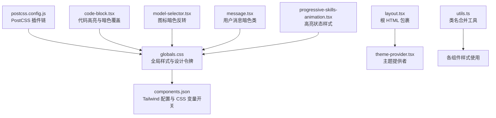
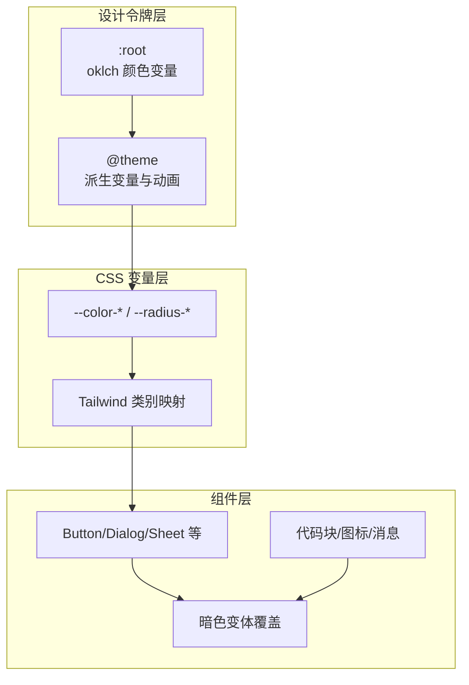
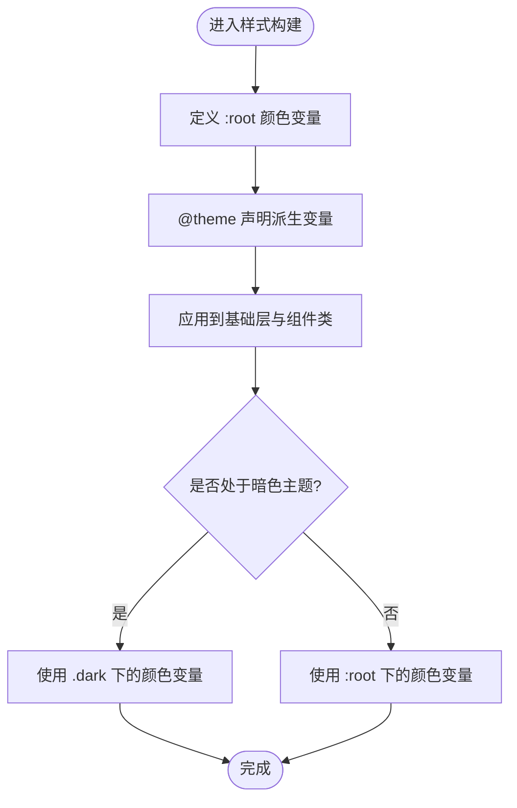
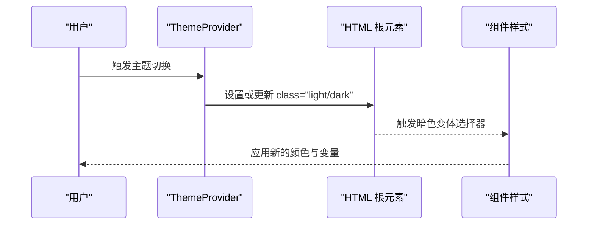
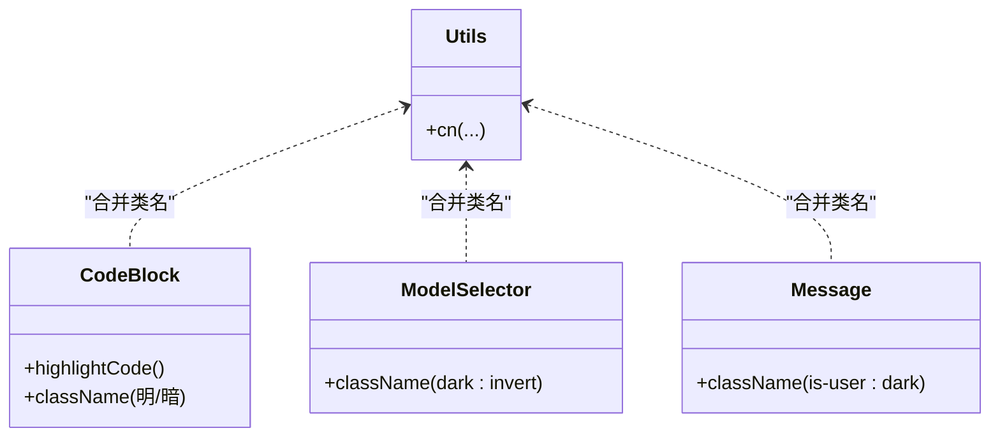
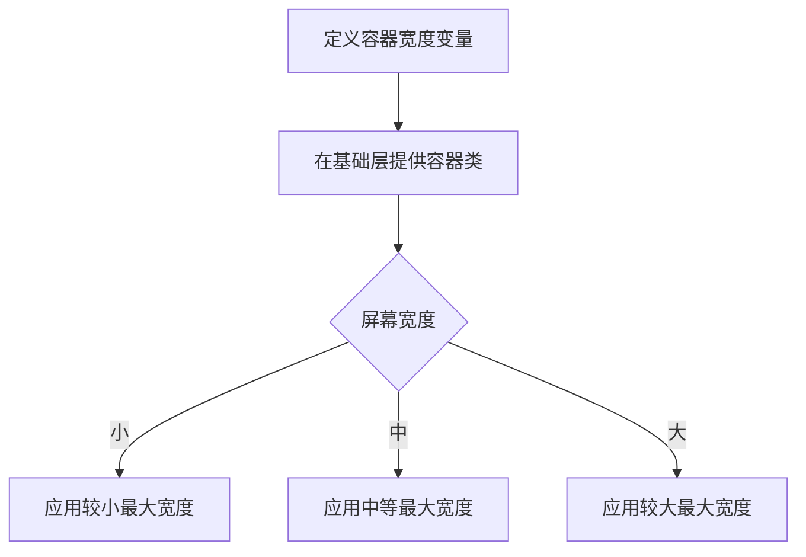
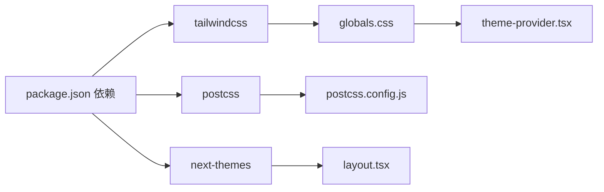

# 组件定制与主题

<cite>
**本文引用的文件**
- [globals.css](file://frontend/src/styles/globals.css)
- [components.json](file://frontend/components.json)
- [postcss.config.js](file://frontend/postcss.config.js)
- [package.json](file://frontend/package.json)
- [theme-provider.tsx](file://frontend/src/components/theme-provider.tsx)
- [layout.tsx](file://frontend/src/app/layout.tsx)
- [utils.ts](file://frontend/src/lib/utils.ts)
- [code-block.tsx](file://frontend/src/components/ai-elements/code-block.tsx)
- [model-selector.tsx](file://frontend/src/components/ai-elements/model-selector.tsx)
- [message.tsx](file://frontend/src/components/ai-elements/message.tsx)
- [progressive-skills-animation.tsx](file://frontend/src/components/landing/progressive-skills-animation.tsx)
</cite>

## 目录
1. [简介](#简介)
2. [项目结构](#项目结构)
3. [核心组件](#核心组件)
4. [架构总览](#架构总览)
5. [详细组件分析](#详细组件分析)
6. [依赖关系分析](#依赖关系分析)
7. [性能考量](#性能考量)
8. [故障排查指南](#故障排查指南)
9. [结论](#结论)
10. [附录](#附录)

## 简介
本文件面向 DeerFlow 前端的组件定制与主题系统，围绕基于 Tailwind CSS v4 的样式架构与设计令牌体系进行深入解析。内容涵盖：
- 设计令牌与 CSS 变量的组织方式
- 组件主题定制方法与覆盖策略
- 暗色模式支持与主题切换机制
- 响应式设计与容器宽度变量
- 样式隔离与 CSS-in-JS 的结合实践
- 调试工具、性能优化与浏览器兼容性建议

## 项目结构
前端样式与主题相关的核心位置如下：
- 全局样式入口：frontend/src/styles/globals.css
- Tailwind 配置与生成器：frontend/components.json（包含 tailwind.css、cssVariables 等）
- PostCSS 插件链：frontend/postcss.config.js
- 主题提供者与根布局：frontend/src/components/theme-provider.tsx、frontend/src/app/layout.tsx
- 工具函数：frontend/src/lib/utils.ts
- 组件内样式示例：frontend/src/components/ai-elements/*.tsx（如 code-block、model-selector、message）

**图表来源**
- [globals.css:1-393](file://frontend/src/styles/globals.css#L1-L393)
- [components.json:1-27](file://frontend/components.json#L1-L27)
- [postcss.config.js:1-6](file://frontend/postcss.config.js#L1-L6)
- [layout.tsx:1-29](file://frontend/src/app/layout.tsx#L1-L29)
- [theme-provider.tsx:1-20](file://frontend/src/components/theme-provider.tsx#L1-L20)
- [utils.ts:1-13](file://frontend/src/lib/utils.ts#L1-L13)
- [code-block.tsx:51-118](file://frontend/src/components/ai-elements/code-block.tsx#L51-L118)
- [model-selector.tsx:175-190](file://frontend/src/components/ai-elements/model-selector.tsx#L175-L190)
- [message.tsx:46-46](file://frontend/src/components/ai-elements/message.tsx#L46-L46)
- [progressive-skills-animation.tsx:35-309](file://frontend/src/components/landing/progressive-skills-animation.tsx#L35-L309)

**章节来源**
- [globals.css:1-393](file://frontend/src/styles/globals.css#L1-L393)
- [components.json:1-27](file://frontend/components.json#L1-L27)
- [postcss.config.js:1-6](file://frontend/postcss.config.js#L1-L6)
- [layout.tsx:1-29](file://frontend/src/app/layout.tsx#L1-L29)
- [theme-provider.tsx:1-20](file://frontend/src/components/theme-provider.tsx#L1-L20)
- [utils.ts:1-13](file://frontend/src/lib/utils.ts#L1-L13)

## 核心组件
- 设计令牌与 CSS 变量
  - 在全局样式中定义了以 oklch 表示的颜色空间变量，并在明/暗两套主题下分别赋值，形成统一的设计令牌体系。
  - 使用 @theme 声明派生变量（如圆角半径、颜色族），并通过 CSS 变量桥接到 Tailwind 类别。
- 主题提供者与切换
  - 通过 next-themes 提供主题上下文，默认启用系统主题检测；在首页强制使用暗色主题，其余页面按系统或用户偏好。
- 响应式与容器宽度
  - 定义了容器最大宽度变量，配合媒体查询实现不同断点下的最大宽度控制。
- 样式覆盖与隔离
  - 组件内部通过类名优先级与暗色变体选择器实现覆盖；同时在特定场景下使用内联样式或动态类名组合。

**章节来源**
- [globals.css:73-293](file://frontend/src/styles/globals.css#L73-L293)
- [theme-provider.tsx:6-19](file://frontend/src/components/theme-provider.tsx#L6-L19)
- [layout.tsx:20-26](file://frontend/src/app/layout.tsx#L20-L26)
- [utils.ts:4-6](file://frontend/src/lib/utils.ts#L4-L6)

## 架构总览
Tailwind v4 在 DeerFlow 中采用“设计令牌 + CSS 变量 + 暗色变体”的三层架构：
- 设计令牌层：集中于 :root 与 @theme，提供颜色、圆角、动画等基础变量。
- CSS 变量层：将设计令牌映射为 --color-* 与 --radius-* 等变量，供 Tailwind 类与组件使用。
- 组件层：通过类名、暗色变体与局部覆盖实现主题化与响应式。

**图表来源**
- [globals.css:73-223](file://frontend/src/styles/globals.css#L73-L223)
- [globals.css:225-293](file://frontend/src/styles/globals.css#L225-L293)

## 详细组件分析

### 设计令牌与 CSS 变量系统
- 颜色体系
  - 使用 oklch 表达色相、彩度、亮度，保证跨明暗主题的一致观感与对比度。
  - 明/暗两套主题分别在 :root 与 .dark 下重定义颜色变量，确保一致的视觉语义。
- 圆角与尺寸
  - 通过 --radius-* 与 @theme 计算派生变量，形成 sm/md/lg/xl/2xl 等层级。
- 动画与装饰
  - 内置多段动画变量与渐变背景，用于加载态、高光与装饰效果。
- 暗色变体
  - 自定义 dark 变体选择器，使组件在 .dark 上下文中自动应用对应样式。

**图表来源**
- [globals.css:225-293](file://frontend/src/styles/globals.css#L225-L293)
- [globals.css:73-223](file://frontend/src/styles/globals.css#L73-L223)

**章节来源**
- [globals.css:73-293](file://frontend/src/styles/globals.css#L73-L293)

### 主题提供者与主题切换
- 主题提供者
  - 在根布局中包裹 ThemeProvider，设置 attribute 为 class，禁用过渡闪烁，启用系统主题检测。
  - 在首页路径下强制使用暗色主题，其余页面遵循系统或用户偏好。
- 切换流程
  - 用户切换主题时，next-themes 更新 html 或根元素的 class，从而触发动态选择器与 CSS 变量切换。

**图表来源**
- [layout.tsx:20-26](file://frontend/src/app/layout.tsx#L20-L26)
- [theme-provider.tsx:6-19](file://frontend/src/components/theme-provider.tsx#L6-L19)

**章节来源**
- [layout.tsx:20-26](file://frontend/src/app/layout.tsx#L20-L26)
- [theme-provider.tsx:6-19](file://frontend/src/components/theme-provider.tsx#L6-L19)

### 组件主题定制与覆盖策略
- 类名合并工具
  - 使用 cn(...) 合并多个类名，避免冲突并保持可读性。
- 暗色覆盖
  - 通过 dark: 前缀或暗色变体选择器对组件进行局部覆盖，例如按钮悬停、图标反色等。
- 内联样式与动态类
  - 在需要强约束的场景（如代码块）使用内联样式或动态类名组合，确保在明/暗主题下呈现一致的对比度与可读性。

**图表来源**
- [utils.ts:4-6](file://frontend/src/lib/utils.ts#L4-L6)
- [code-block.tsx:51-118](file://frontend/src/components/ai-elements/code-block.tsx#L51-L118)
- [model-selector.tsx:175-190](file://frontend/src/components/ai-elements/model-selector.tsx#L175-L190)
- [message.tsx:46-46](file://frontend/src/components/ai-elements/message.tsx#L46-L46)

**章节来源**
- [utils.ts:4-6](file://frontend/src/lib/utils.ts#L4-L6)
- [code-block.tsx:51-118](file://frontend/src/components/ai-elements/code-block.tsx#L51-L118)
- [model-selector.tsx:175-190](file://frontend/src/components/ai-elements/model-selector.tsx#L175-L190)
- [message.tsx:46-46](file://frontend/src/components/ai-elements/message.tsx#L46-L46)

### 响应式设计与容器宽度
- 容器宽度变量
  - 在 :root 中定义不同断点下的容器宽度变量，便于组件在不同屏幕尺寸下保持合适的最大宽度。
- 基础层容器类
  - 提供 container-md 等类，结合媒体查询实现自适应最大宽度。

**图表来源**
- [globals.css:387-393](file://frontend/src/styles/globals.css#L387-L393)
- [globals.css:303-317](file://frontend/src/styles/globals.css#L303-L317)

**章节来源**
- [globals.css:303-393](file://frontend/src/styles/globals.css#L303-L393)

### CSS-in-JS 与样式隔离
- CSS-in-JS 实践
  - 在代码块组件中，通过动态计算明/暗两套高亮方案并注入内联样式，确保在不同主题下具备最佳可读性。
- 样式隔离
  - 使用作用域类名与暗色变体限定样式影响范围，避免全局污染。
  - 对外部依赖样式（如 XYFlow）通过引入其样式文件实现隔离管理。

**章节来源**
- [code-block.tsx:51-118](file://frontend/src/components/ai-elements/code-block.tsx#L51-L118)
- [code-block.tsx:111-118](file://frontend/src/components/ai-elements/code-block.tsx#L111-L118)

### 品牌定制指南
- 颜色定制
  - 修改 :root 与 .dark 下的颜色变量，即可完成品牌主色与辅助色的统一替换。
- 圆角与尺寸
  - 调整 --radius-* 与容器宽度变量，适配品牌视觉规范。
- 动画与装饰
  - 通过 @theme 注入品牌专属动画变量，保持交互一致性。

**章节来源**
- [globals.css:225-293](file://frontend/src/styles/globals.css#L225-L293)
- [globals.css:73-223](file://frontend/src/styles/globals.css#L73-L223)

## 依赖关系分析
- Tailwind v4 与 PostCSS
  - 通过 @tailwindcss/postcss 插件链生成样式，确保 @theme 与 @custom-variant 正常工作。
- 组件库与图标
  - shadcn/ui 风格与 lucide 图标库配合使用，借助 CSS 变量实现主题一致。
- 主题系统
  - next-themes 提供主题切换能力，与 CSS 变量联动实现即时主题切换。

**图表来源**
- [package.json:17-87](file://frontend/package.json#L17-L87)
- [postcss.config.js:1-6](file://frontend/postcss.config.js#L1-L6)
- [layout.tsx:20-26](file://frontend/src/app/layout.tsx#L20-L26)
- [globals.css:1-393](file://frontend/src/styles/globals.css#L1-L393)
- [theme-provider.tsx:6-19](file://frontend/src/components/theme-provider.tsx#L6-L19)

**章节来源**
- [package.json:17-87](file://frontend/package.json#L17-L87)
- [postcss.config.js:1-6](file://frontend/postcss.config.js#L1-L6)
- [layout.tsx:20-26](file://frontend/src/app/layout.tsx#L20-L26)
- [globals.css:1-393](file://frontend/src/styles/globals.css#L1-L393)
- [theme-provider.tsx:6-19](file://frontend/src/components/theme-provider.tsx#L6-L19)

## 性能考量
- 样式体积控制
  - 使用 @source inline 仅生成所需 Tailwind 类，减少未使用样式的打包体积。
- 动画与渐变
  - 将复杂动画与渐变定义为变量，避免重复声明，提升复用效率。
- 主题切换
  - 通过 CSS 变量与暗色变体切换，避免运行时重排与闪烁，提升交互流畅度。
- 代码高亮
  - 在代码块组件中预生成明/暗两套高亮方案，减少渲染时计算开销。

**章节来源**
- [globals.css:4-71](file://frontend/src/styles/globals.css#L4-L71)
- [globals.css:78-223](file://frontend/src/styles/globals.css#L78-L223)
- [code-block.tsx:51-118](file://frontend/src/components/ai-elements/code-block.tsx#L51-L118)

## 故障排查指南
- 暗色主题不生效
  - 检查根元素是否正确设置 class="dark"，确认 .dark 选择器与颜色变量是否被覆盖。
- 类名冲突
  - 使用 cn(...) 合并类名，避免重复覆盖导致样式异常。
- 动画或渐变不显示
  - 确认 @theme 中的动画变量已正确定义，且组件中正确引用。
- 代码块主题错乱
  - 检查代码块组件的明/暗高亮方案生成逻辑与内联样式应用顺序。

**章节来源**
- [theme-provider.tsx:6-19](file://frontend/src/components/theme-provider.tsx#L6-L19)
- [utils.ts:4-6](file://frontend/src/lib/utils.ts#L4-L6)
- [globals.css:78-223](file://frontend/src/styles/globals.css#L78-L223)
- [code-block.tsx:51-118](file://frontend/src/components/ai-elements/code-block.tsx#L51-L118)

## 结论
DeerFlow 的主题系统以 Tailwind v4 的设计令牌为核心，结合 CSS 变量与暗色变体，实现了统一、可扩展且高性能的主题体验。通过组件层的局部覆盖与 CSS-in-JS 的精准控制，既能满足品牌定制需求，又能保障在多场景下的稳定性与可维护性。

## 附录
- Tailwind 配置要点
  - tailwind.css 指向 src/styles/globals.css
  - cssVariables=true 开启 CSS 变量映射
  - baseColor=neutral 作为基础色板
- PostCSS 插件链
  - 使用 @tailwindcss/postcss 生成器，确保 @theme 与 @custom-variant 生效

**章节来源**
- [components.json:6-12](file://frontend/components.json#L6-L12)
- [postcss.config.js:1-6](file://frontend/postcss.config.js#L1-L6)