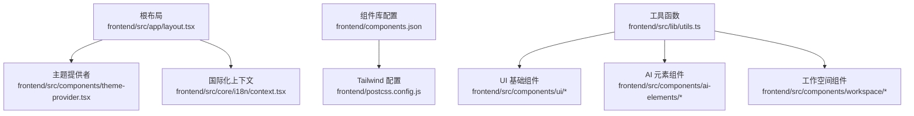
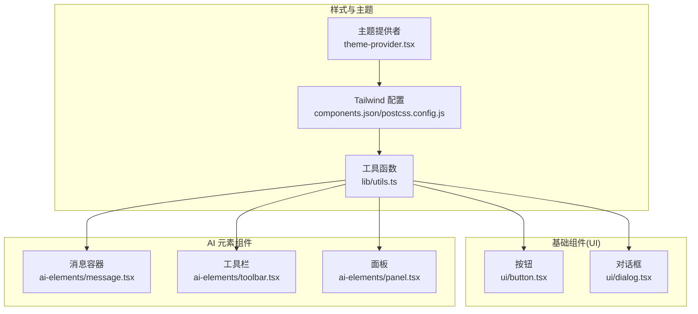
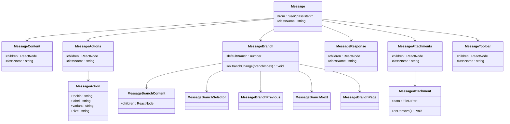
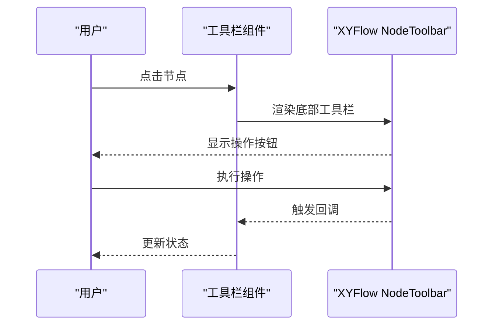
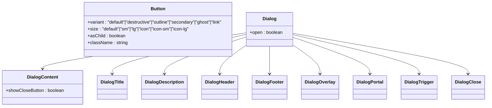
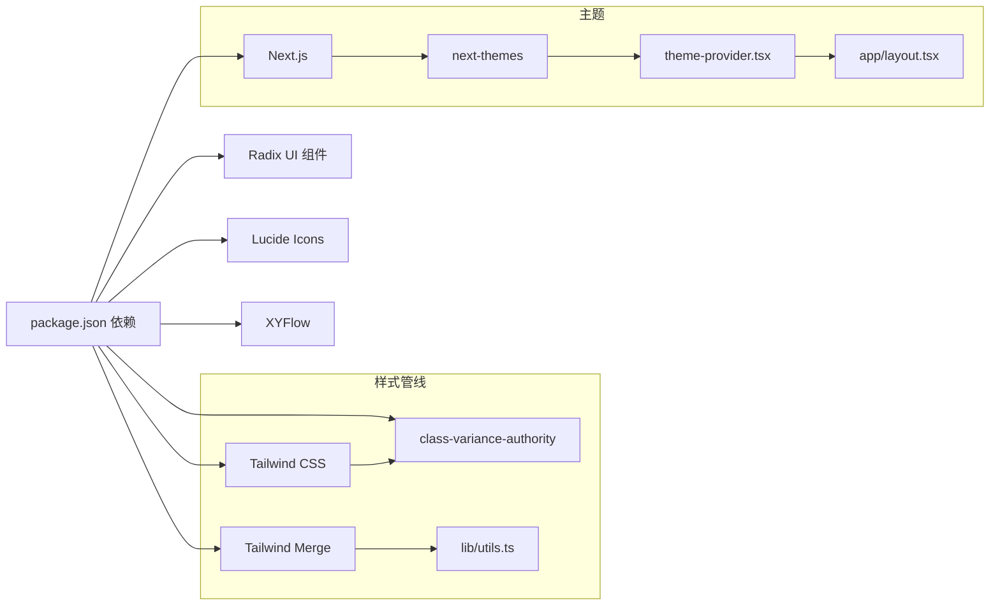

# 组件设计系统

<cite>
**本文引用的文件**
- [frontend/src/app/layout.tsx](file://frontend/src/app/layout.tsx)
- [frontend/src/components/theme-provider.tsx](file://frontend/src/components/theme-provider.tsx)
- [frontend/components.json](file://frontend/components.json)
- [frontend/package.json](file://frontend/package.json)
- [frontend/postcss.config.js](file://frontend/postcss.config.js)
- [frontend/src/lib/utils.ts](file://frontend/src/lib/utils.ts)
- [frontend/src/components/ai-elements/message.tsx](file://frontend/src/components/ai-elements/message.tsx)
- [frontend/src/components/ai-elements/toolbar.tsx](file://frontend/src/components/ai-elements/toolbar.tsx)
- [frontend/src/components/ai-elements/panel.tsx](file://frontend/src/components/ai-elements/panel.tsx)
- [frontend/src/components/ui/button.tsx](file://frontend/src/components/ui/button.tsx)
- [frontend/src/components/ui/dialog.tsx](file://frontend/src/components/ui/dialog.tsx)
</cite>

## 目录
1. [引言](#引言)
2. [项目结构](#项目结构)
3. [核心组件](#核心组件)
4. [架构总览](#架构总览)
5. [组件详解](#组件详解)
6. [依赖关系分析](#依赖关系分析)
7. [性能考量](#性能考量)
8. [故障排查指南](#故障排查指南)
9. [结论](#结论)
10. [附录](#附录)

## 引言
本文件面向 DeerFlow 的组件设计系统，聚焦于基于 Radix UI 与 Tailwind CSS 的组件架构、设计令牌与样式管理策略，以及 AI 元素组件（消息、工具栏、面板等）、UI 基础组件（按钮、对话框、输入框等）与工作空间组件的设计模式。文档同时覆盖组件 API 规范、属性配置、事件处理、复用策略、主题定制与响应式设计，并提供测试与可访问性建议。

## 项目结构
前端采用 Next.js 应用程序，组件按功能域分层组织：
- 根布局负责全局样式注入、主题提供者与国际化上下文挂载
- 组件层分为三类：AI 元素组件、UI 基础组件、工作空间组件
- 工具函数集中于通用工具模块，样式通过 Tailwind 与 CSS 变量统一管理

**图表来源**
- [frontend/src/app/layout.tsx:15-28](file://frontend/src/app/layout.tsx#L15-L28)
- [frontend/src/components/theme-provider.tsx:6-19](file://frontend/src/components/theme-provider.tsx#L6-L19)
- [frontend/components.json:6-12](file://frontend/components.json#L6-L12)
- [frontend/postcss.config.js:1-5](file://frontend/postcss.config.js#L1-L5)
- [frontend/src/lib/utils.ts:1-13](file://frontend/src/lib/utils.ts#L1-L13)

**章节来源**
- [frontend/src/app/layout.tsx:15-28](file://frontend/src/app/layout.tsx#L15-L28)
- [frontend/src/components/theme-provider.tsx:6-19](file://frontend/src/components/theme-provider.tsx#L6-L19)
- [frontend/components.json:1-27](file://frontend/components.json#L1-L27)
- [frontend/postcss.config.js:1-5](file://frontend/postcss.config.js#L1-L5)
- [frontend/src/lib/utils.ts:1-13](file://frontend/src/lib/utils.ts#L1-L13)

## 核心组件
- 主题提供者：基于 next-themes 实现明暗主题切换与首页强制深色模式
- 组件库配置：定义 Tailwind、颜色基底、CSS 变量开关、图标库与别名映射
- 工具函数：cn 合并工具与外链样式常量，统一类名拼接与默认链接风格
- UI 基础组件：以 Radix UI 为基础，结合 class-variance-authority 提供变体与尺寸
- AI 元素组件：围绕消息流、分支切换、附件、工具栏与画布面板构建

**章节来源**
- [frontend/src/components/theme-provider.tsx:6-19](file://frontend/src/components/theme-provider.tsx#L6-L19)
- [frontend/components.json:6-12](file://frontend/components.json#L6-L12)
- [frontend/src/lib/utils.ts:1-13](file://frontend/src/lib/utils.ts#L1-L13)
- [frontend/src/components/ui/button.tsx:7-38](file://frontend/src/components/ui/button.tsx#L7-L38)
- [frontend/src/components/ai-elements/message.tsx:23-36](file://frontend/src/components/ai-elements/message.tsx#L23-L36)

## 架构总览
组件系统遵循“基础组件 + 业务元素组件”的分层设计：
- 基础组件（UI）：按钮、对话框、输入框等，提供一致的视觉与交互语义
- AI 元素组件：消息、工具栏、面板等，承载 AI 流程与可视化
- 工作空间组件：聊天、代理、工件等，支撑具体业务场景
- 样式与主题：Tailwind + CSS 变量 + next-themes，确保一致性与可扩展性

**图表来源**
- [frontend/src/components/theme-provider.tsx:6-19](file://frontend/src/components/theme-provider.tsx#L6-L19)
- [frontend/components.json:6-12](file://frontend/components.json#L6-L12)
- [frontend/postcss.config.js:1-5](file://frontend/postcss.config.js#L1-L5)
- [frontend/src/lib/utils.ts:1-13](file://frontend/src/lib/utils.ts#L1-L13)
- [frontend/src/components/ui/button.tsx:40-61](file://frontend/src/components/ui/button.tsx#L40-L61)
- [frontend/src/components/ui/dialog.tsx:9-81](file://frontend/src/components/ui/dialog.tsx#L9-L81)
- [frontend/src/components/ai-elements/message.tsx:27-57](file://frontend/src/components/ai-elements/message.tsx#L27-L57)
- [frontend/src/components/ai-elements/toolbar.tsx:7-16](file://frontend/src/components/ai-elements/toolbar.tsx#L7-L16)
- [frontend/src/components/ai-elements/panel.tsx:7-15](file://frontend/src/components/ai-elements/panel.tsx#L7-L15)

## 组件详解

### 消息组件体系（AI 元素）
消息组件围绕角色区分、内容展示、动作区、附件与分支切换展开，支持流式渲染与交互反馈。

**图表来源**
- [frontend/src/components/ai-elements/message.tsx:23-36](file://frontend/src/components/ai-elements/message.tsx#L23-L36)
- [frontend/src/components/ai-elements/message.tsx:38-57](file://frontend/src/components/ai-elements/message.tsx#L38-L57)
- [frontend/src/components/ai-elements/message.tsx:59-69](file://frontend/src/components/ai-elements/message.tsx#L59-L69)
- [frontend/src/components/ai-elements/message.tsx:71-105](file://frontend/src/components/ai-elements/message.tsx#L71-L105)
- [frontend/src/components/ai-elements/message.tsx:132-180](file://frontend/src/components/ai-elements/message.tsx#L132-L180)
- [frontend/src/components/ai-elements/message.tsx:182-210](file://frontend/src/components/ai-elements/message.tsx#L182-L210)
- [frontend/src/components/ai-elements/message.tsx:212-235](file://frontend/src/components/ai-elements/message.tsx#L212-L235)
- [frontend/src/components/ai-elements/message.tsx:237-282](file://frontend/src/components/ai-elements/message.tsx#L237-L282)
- [frontend/src/components/ai-elements/message.tsx:284-303](file://frontend/src/components/ai-elements/message.tsx#L284-L303)
- [frontend/src/components/ai-elements/message.tsx:305-320](file://frontend/src/components/ai-elements/message.tsx#L305-L320)
- [frontend/src/components/ai-elements/message.tsx:322-404](file://frontend/src/components/ai-elements/message.tsx#L322-L404)
- [frontend/src/components/ai-elements/message.tsx:406-428](file://frontend/src/components/ai-elements/message.tsx#L406-L428)
- [frontend/src/components/ai-elements/message.tsx:430-447](file://frontend/src/components/ai-elements/message.tsx#L430-L447)

API 规范与行为要点
- 角色与布局：通过 from 属性区分用户与助手，自动应用对齐与背景
- 分支导航：支持多分支内容的上一条/下一条与页码显示
- 附件交互：图片与文件附件支持悬停移除与可访问性标签
- 流式渲染：使用流式渲染器包裹响应内容，避免重复渲染
- 可访问性：所有交互元素提供 sr-only 文本或 aria-label

**章节来源**
- [frontend/src/components/ai-elements/message.tsx:23-36](file://frontend/src/components/ai-elements/message.tsx#L23-L36)
- [frontend/src/components/ai-elements/message.tsx:132-180](file://frontend/src/components/ai-elements/message.tsx#L132-L180)
- [frontend/src/components/ai-elements/message.tsx:237-282](file://frontend/src/components/ai-elements/message.tsx#L237-L282)
- [frontend/src/components/ai-elements/message.tsx:322-404](file://frontend/src/components/ai-elements/message.tsx#L322-L404)
- [frontend/src/components/ai-elements/message.tsx:305-320](file://frontend/src/components/ai-elements/message.tsx#L305-L320)

### 工具栏与面板（AI 元素）
- 工具栏：基于 XYFlow 的 NodeToolbar，提供底部弹出式操作区
- 面板：XYFlow Panel 容器，用于放置侧边或悬浮面板

**图表来源**
- [frontend/src/components/ai-elements/toolbar.tsx:7-16](file://frontend/src/components/ai-elements/toolbar.tsx#L7-L16)
- [frontend/src/components/ai-elements/panel.tsx:7-15](file://frontend/src/components/ai-elements/panel.tsx#L7-L15)

**章节来源**
- [frontend/src/components/ai-elements/toolbar.tsx:7-16](file://frontend/src/components/ai-elements/toolbar.tsx#L7-L16)
- [frontend/src/components/ai-elements/panel.tsx:7-15](file://frontend/src/components/ai-elements/panel.tsx#L7-L15)

### UI 基础组件（按钮、对话框）
- 按钮：通过变体与尺寸组合提供统一风格；支持 asChild 透传与数据槽位
- 对话框：基于 Radix UI，提供覆盖层、内容区、标题与描述、关闭按钮等

**图表来源**
- [frontend/src/components/ui/button.tsx:40-61](file://frontend/src/components/ui/button.tsx#L40-L61)
- [frontend/src/components/ui/dialog.tsx:9-81](file://frontend/src/components/ui/dialog.tsx#L9-L81)
- [frontend/src/components/ui/dialog.tsx:106-130](file://frontend/src/components/ui/dialog.tsx#L106-L130)

**章节来源**
- [frontend/src/components/ui/button.tsx:7-38](file://frontend/src/components/ui/button.tsx#L7-L38)
- [frontend/src/components/ui/button.tsx:40-61](file://frontend/src/components/ui/button.tsx#L40-L61)
- [frontend/src/components/ui/dialog.tsx:9-81](file://frontend/src/components/ui/dialog.tsx#L9-L81)

### 工作空间组件（概念性概述）
工作空间组件围绕聊天、代理、工件与设置等场景构建，遵循与 AI 元素与 UI 基础组件一致的样式与交互规范。典型组件包括：
- 聊天列表、消息流、输入框与流式指示器
- 代理卡片与画廊
- 工件预览与导出触发器
- 设置与本地化钩子

这些组件在布局与交互上复用上述基础组件，保证一致性与可维护性。

[本节为概念性说明，不直接分析具体文件，故无“章节来源”]

## 依赖关系分析
- 组件库配置：components.json 指定 Tailwind、颜色基底与 CSS 变量开关，启用 CSS 变量以支持主题切换
- 样式合并：lib/utils.ts 的 cn 工具统一类名合并，避免冲突
- 主题提供：layout.tsx 注入主题提供者，theme-provider.tsx 控制首页强制深色与系统偏好
- UI 原语：UI 组件基于 Radix UI，对话框与按钮等提供可访问性与动画支持
- 图标与第三方：Lucide React 提供图标，XYFlow 提供画布与工具栏能力

**图表来源**
- [frontend/package.json:17-87](file://frontend/package.json#L17-L87)
- [frontend/components.json:6-12](file://frontend/components.json#L6-L12)
- [frontend/src/lib/utils.ts:1-6](file://frontend/src/lib/utils.ts#L1-L6)
- [frontend/src/components/theme-provider.tsx:6-19](file://frontend/src/components/theme-provider.tsx#L6-L19)
- [frontend/src/app/layout.tsx:22-24](file://frontend/src/app/layout.tsx#L22-L24)

**章节来源**
- [frontend/package.json:17-87](file://frontend/package.json#L17-L87)
- [frontend/components.json:6-12](file://frontend/components.json#L6-L12)
- [frontend/src/lib/utils.ts:1-6](file://frontend/src/lib/utils.ts#L1-L6)
- [frontend/src/components/theme-provider.tsx:6-19](file://frontend/src/components/theme-provider.tsx#L6-L19)
- [frontend/src/app/layout.tsx:22-24](file://frontend/src/app/layout.tsx#L22-L24)

## 性能考量
- 类名合并：优先使用工具函数进行类名合并，减少无效样式叠加
- 组件记忆：消息响应组件使用记忆化避免重复渲染
- 动画与过渡：对话框与提示框使用轻量动画，避免复杂滤镜
- 主题切换：CSS 变量与系统主题配合，降低重绘成本
- 图标与第三方：按需引入图标与组件，避免全量打包

[本节为通用指导，不直接分析具体文件，故无“章节来源”]

## 故障排查指南
- 主题异常
  - 确认根布局已注入主题提供者与国际化上下文
  - 检查主题提供者是否正确传递属性
- 样式冲突
  - 使用工具函数合并类名，避免重复覆盖
  - 检查 Tailwind 配置与 CSS 变量开关
- 可访问性问题
  - 为按钮与工具栏提供 sr-only 或 aria-label
  - 对话框关闭按钮包含可读文本
- 动画与交互
  - 确保 Radix UI 组件的 Portal 与 Trigger 正确使用
  - 检查流式渲染器的 children 是否稳定

**章节来源**
- [frontend/src/app/layout.tsx:22-24](file://frontend/src/app/layout.tsx#L22-L24)
- [frontend/src/components/theme-provider.tsx:6-19](file://frontend/src/components/theme-provider.tsx#L6-L19)
- [frontend/src/lib/utils.ts:1-6](file://frontend/src/lib/utils.ts#L1-L6)
- [frontend/src/components/ai-elements/message.tsx:83-105](file://frontend/src/components/ai-elements/message.tsx#L83-L105)
- [frontend/src/components/ui/dialog.tsx:69-77](file://frontend/src/components/ui/dialog.tsx#L69-L77)

## 结论
DeerFlow 的组件设计系统以 Radix UI 与 Tailwind CSS 为核心，通过组件库配置、工具函数与主题提供者形成统一的样式与交互基线。AI 元素组件围绕消息流与画布交互，UI 基础组件提供一致的语义与可访问性，工作空间组件在此基础上扩展业务场景。该架构具备良好的可复用性、可扩展性与可维护性，适合在多场景中持续演进。

## 附录
- 组件 API 速查
  - 消息组件：角色、分支导航、附件、动作区、流式响应
  - 工具栏与面板：XYFlow 集成、位置与样式定制
  - 基础组件：变体与尺寸、可访问性属性、数据槽位
- 测试与可访问性建议
  - 单元测试：针对 props 与状态变更进行断言
  - 可访问性测试：键盘导航、屏幕阅读器支持、对比度检查
  - 回归测试：主题切换、响应式断点与第三方集成稳定性

[本节为概览性补充，不直接分析具体文件，故无“章节来源”]