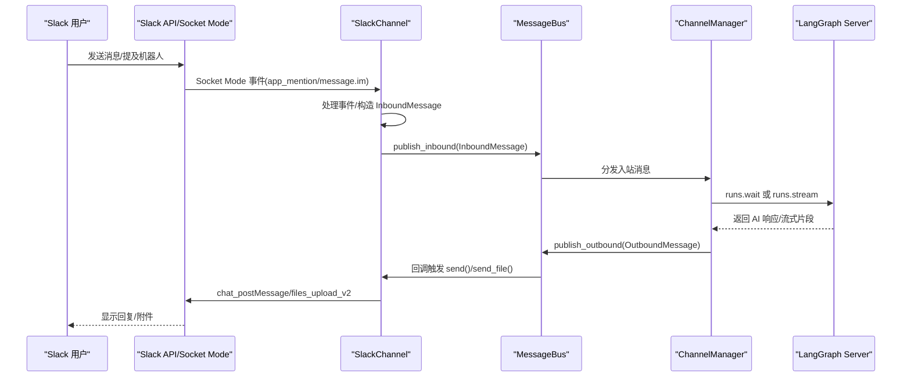
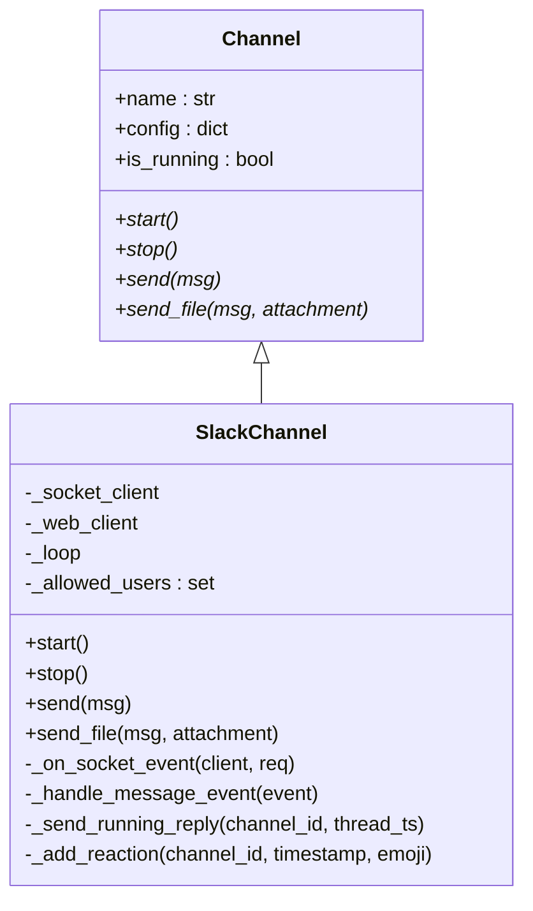
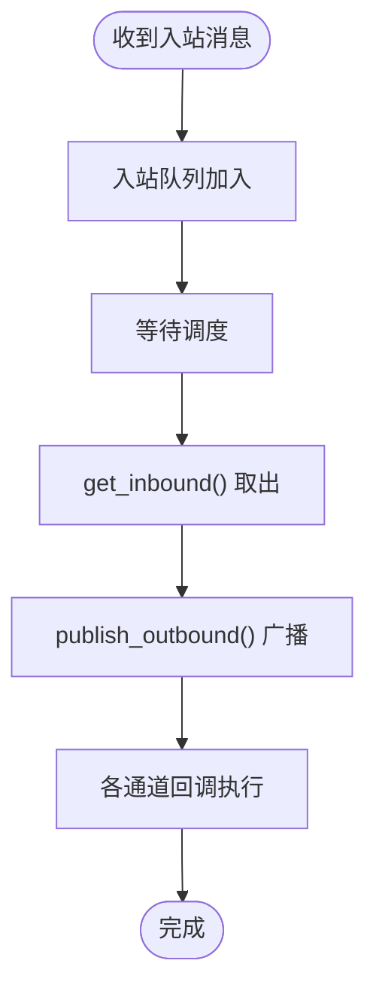
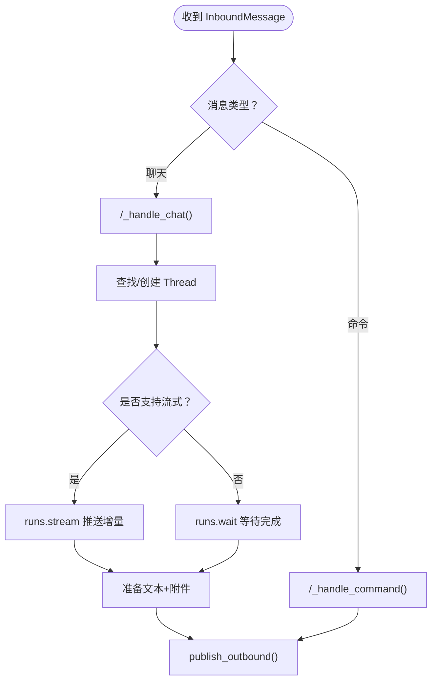
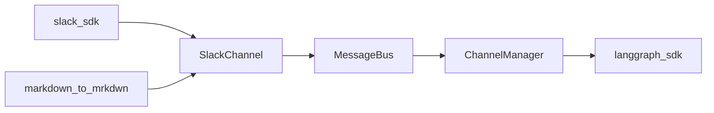

# Slack 集成

<cite>
**本文档引用的文件**
- [backend/app/channels/slack.py](file://backend/app/channels/slack.py)
- [backend/app/channels/base.py](file://backend/app/channels/base.py)
- [backend/app/channels/service.py](file://backend/app/channels/service.py)
- [backend/app/channels/manager.py](file://backend/app/channels/manager.py)
- [backend/app/channels/message_bus.py](file://backend/app/channels/message_bus.py)
- [backend/app/gateway/routers/channels.py](file://backend/app/gateway/routers/channels.py)
- [config.example.yaml](file://config.example.yaml)
- [backend/docs/SETUP.md](file://backend/docs/SETUP.md)
- [backend/docs/CONFIGURATION.md](file://backend/docs/CONFIGURATION.md)
- [docker/docker-compose.yaml](file://docker/docker-compose.yaml)
- [docker/docker-compose-dev.yaml](file://docker/docker-compose-dev.yaml)
- [scripts/deploy.sh](file://scripts/deploy.sh)
- [backend/tests/test_channels.py](file://backend/tests/test_channels.py)
</cite>

## 目录
1. [简介](#简介)
2. [项目结构](#项目结构)
3. [核心组件](#核心组件)
4. [架构总览](#架构总览)
5. [详细组件分析](#详细组件分析)
6. [依赖关系分析](#依赖关系分析)
7. [性能考虑](#性能考虑)
8. [故障排除指南](#故障排除指南)
9. [结论](#结论)
10. [附录](#附录)

## 简介
本文件面向 DeerFlow Slack 集成的技术文档，系统性阐述基于 Slack Socket Mode 的连接实现、事件订阅与实时消息处理机制。文档覆盖应用创建、OAuth 配置与事件订阅设置、消息事件处理、命令解析与响应机制，以及与智能体的协作模式。同时提供 Slack 配置示例、权限设置与部署指南，帮助开发者快速完成集成与上线。

## 项目结构
DeerFlow 的 Slack 集成位于后端子系统中，采用“通道-总线-管理器”的解耦架构：
- 通道层：负责与外部平台交互（如 Slack），接收消息并转发到消息总线
- 消息总线：异步发布/订阅中枢，连接各通道与智能体调度器
- 管理器层：消费入站消息，调用 LangGraph Server 执行智能体逻辑，并将结果回传通道

```mermaid
graph TB
subgraph "通道层"
Slack["SlackChannel<br/>Socket Mode 连接"]
end
subgraph "消息总线"
Bus["MessageBus<br/>入站/出站队列"]
end
subgraph "管理器层"
Manager["ChannelManager<br/>LangGraph 调度"]
end
subgraph "外部服务"
LangGraph["LangGraph Server"]
SlackAPI["Slack API/WebSocket"]
end
Slack --> Bus
Bus --> Manager
Manager --> LangGraph
SlackAPI <- --> Slack
```

图表来源
- [backend/app/channels/slack.py:19-78](file://backend/app/channels/slack.py#L19-L78)
- [backend/app/channels/message_bus.py:117-174](file://backend/app/channels/message_bus.py#L117-L174)
- [backend/app/channels/manager.py:317-416](file://backend/app/channels/manager.py#L317-L416)

章节来源
- [backend/app/channels/slack.py:1-245](file://backend/app/channels/slack.py#L1-L245)
- [backend/app/channels/message_bus.py:1-174](file://backend/app/channels/message_bus.py#L1-L174)
- [backend/app/channels/manager.py:1-732](file://backend/app/channels/manager.py#L1-L732)

## 核心组件
- SlackChannel：实现 Slack Socket Mode 的通道类，负责事件监听、消息发送与重试、文件上传等
- MessageBus：异步消息总线，提供入站/出站发布订阅能力
- ChannelManager：智能体调度器，对接 LangGraph Server，处理聊天与命令消息
- ChannelService：通道生命周期管理器，按配置启动/停止各通道实例
- FastAPI 路由：提供通道状态查询与重启接口

章节来源
- [backend/app/channels/slack.py:19-245](file://backend/app/channels/slack.py#L19-L245)
- [backend/app/channels/message_bus.py:117-174](file://backend/app/channels/message_bus.py#L117-L174)
- [backend/app/channels/manager.py:317-732](file://backend/app/channels/manager.py#L317-L732)
- [backend/app/channels/service.py:22-179](file://backend/app/channels/service.py#L22-L179)
- [backend/app/gateway/routers/channels.py:12-53](file://backend/app/gateway/routers/channels.py#L12-L53)

## 架构总览
下图展示从 Slack 事件到智能体响应的完整链路：



图表来源
- [backend/app/channels/slack.py:182-245](file://backend/app/channels/slack.py#L182-L245)
- [backend/app/channels/message_bus.py:131-174](file://backend/app/channels/message_bus.py#L131-L174)
- [backend/app/channels/manager.py:448-641](file://backend/app/channels/manager.py#L448-L641)

## 详细组件分析

### SlackChannel 组件
- 连接建立：使用 Slack SDK 的 SocketModeClient 与 App-Level Token 建立 WebSocket 连接；同时初始化 WebClient 用于消息发送与文件上传
- 事件处理：在 _on_socket_event 中确认事件并仅处理 events_api 类型；对 message 与 app_mention 两类事件进行消息分发
- 入站消息：_handle_message_event 将 Slack 文本消息封装为 InboundMessage，区分命令与普通聊天；支持 thread_ts 作为话题标识
- 出站消息：send 方法支持 Markdown 到 Slack mrkdwn 的转换、重试机制与反应标记；send_file 支持文件上传
- 安全控制：支持 allowed_users 白名单过滤；忽略 bot 自身消息与 subtype 消息



图表来源
- [backend/app/channels/base.py:14-109](file://backend/app/channels/base.py#L14-L109)
- [backend/app/channels/slack.py:19-245](file://backend/app/channels/slack.py#L19-L245)

章节来源
- [backend/app/channels/slack.py:19-245](file://backend/app/channels/slack.py#L19-L245)
- [backend/app/channels/base.py:14-109](file://backend/app/channels/base.py#L14-L109)

### MessageBus 组件
- 入站队列：publish_inbound 将通道入站消息入队；get_inbound 提供阻塞式获取
- 出站回调：subscribe_outbound 注册通道回调；publish_outbound 广播给所有监听者
- 数据模型：InboundMessage/OutboundMessage 描述消息结构，包含 thread_ts、topic_id 等关键字段



图表来源
- [backend/app/channels/message_bus.py:117-174](file://backend/app/channels/message_bus.py#L117-L174)

章节来源
- [backend/app/channels/message_bus.py:1-174](file://backend/app/channels/message_bus.py#L1-L174)

### ChannelManager 组件
- 会话映射：根据 channel_name/chat_id/topic_id 查找或创建 LangGraph Thread
- 命令处理：/_new、/_status、/_models、/_memory、/_help 等命令路由
- 聊天处理：非流式模式直接 runs.wait 获取最终文本；流式模式 runs.stream 持续推送增量文本
- 产物交付：自动解析 agent 产出的文件路径，安全地转换为可上传附件并补充文本提示



图表来源
- [backend/app/channels/manager.py:448-732](file://backend/app/channels/manager.py#L448-L732)

章节来源
- [backend/app/channels/manager.py:1-732](file://backend/app/channels/manager.py#L1-L732)

### ChannelService 组件
- 通道注册：通过 _CHANNEL_REGISTRY 将通道名映射到具体类路径
- 生命周期：按配置启用通道，延迟加载类，统一启动/停止
- 状态查询：对外暴露通道运行状态与重启接口

章节来源
- [backend/app/channels/service.py:14-179](file://backend/app/channels/service.py#L14-L179)
- [backend/app/gateway/routers/channels.py:12-53](file://backend/app/gateway/routers/channels.py#L12-L53)

## 依赖关系分析
- 外部依赖：slack_sdk（Socket Mode 与 WebClient）、markdown_to_mrkdwn（Markdown 转换）
- 内部依赖：Channel 抽象基类约束通道实现；MessageBus 解耦通道与调度器；ChannelManager 依赖 LangGraph SDK
- 配置依赖：config.yaml 中 channels.slack.* 字段驱动通道初始化



图表来源
- [backend/app/channels/slack.py:39-47](file://backend/app/channels/slack.py#L39-L47)
- [backend/app/channels/manager.py:386-392](file://backend/app/channels/manager.py#L386-L392)

章节来源
- [backend/app/channels/slack.py:1-245](file://backend/app/channels/slack.py#L1-L245)
- [backend/app/channels/manager.py:1-732](file://backend/app/channels/manager.py#L1-L732)

## 性能考虑
- 流式输出：当前 Slack 不支持流式推送（supports_streaming=False），因此使用 runs.wait 获取完整响应，避免频繁中断
- 重试策略：发送消息时采用指数退避重试，降低网络抖动影响
- 并发限制：ChannelManager 使用信号量限制最大并发任务数，防止资源争用
- 文件上传：先发送文本，再逐个上传附件，失败时不产生部分交付

章节来源
- [backend/app/channels/manager.py:29-33](file://backend/app/channels/manager.py#L29-L33)
- [backend/app/channels/slack.py:80-129](file://backend/app/channels/slack.py#L80-L129)
- [backend/app/channels/manager.py:401-403](file://backend/app/channels/manager.py#L401-L403)

## 故障排除指南
- Slack SDK 缺失：若未安装 slack_sdk，通道启动会记录错误日志并退出
- 认证失败：缺少 bot_token 或 app_token 会导致启动失败
- 事件未触发：检查 Event Subscriptions 是否订阅了 app_mention 与 message.im
- 权限不足：确保 Bot Token Scopes 包含 app_mentions:read、chat:write、im:history、im:read、im:write、files:write
- 重试失败：观察重试日志与 reaction 标记，定位网络或权限问题
- 命令无效：确认命令前缀与大小写，使用 /help 查看可用命令列表

章节来源
- [backend/app/channels/slack.py:43-54](file://backend/app/channels/slack.py#L43-L54)
- [backend/tests/test_channels.py:1685-1716](file://backend/tests/test_channels.py#L1685-L1716)
- [backend/tests/test_channels.py:1717-1732](file://backend/tests/test_channels.py#L1717-L1732)

## 结论
DeerFlow 的 Slack 集成以 Socket Mode 实现免公网 IP 的实时通信，结合消息总线与智能体调度器，形成清晰的解耦架构。通过严格的事件过滤、白名单控制与重试机制，保证了稳定性与安全性。当前版本针对 Slack 的非流式特性进行了优化，后续可根据需要扩展流式支持。

## 附录

### Slack 应用创建与配置步骤
- 在 [api.slack.com/apps](https://api.slack.com/apps) 创建新应用 → 从零开始
- OAuth & Permissions：添加 Bot Token Scopes：app_mentions:read、chat:write、im:history、im:read、im:write、files:write
- Socket Mode：启用并生成 App-Level Token（xapp-…），scope 为 connections:write
- Event Subscriptions：订阅 bot 事件：app_mention、message.im
- 将 SLACK_BOT_TOKEN 与 SLACK_APP_TOKEN 设置到环境变量或 .env，并在 config.yaml 中启用 channels.slack

章节来源
- [config.example.yaml:563-568](file://config.example.yaml#L563-L568)
- [backend/docs/SETUP.md:1-93](file://backend/docs/SETUP.md#L1-L93)

### 配置示例与最佳实践
- 在 config.yaml 的 channels 节点下启用 slack 并填写 bot_token、app_token、allowed_users
- 使用环境变量注入敏感信息，避免硬编码
- 建议为不同用户或频道设置会话覆盖（assistant_id、config、context）

章节来源
- [config.example.yaml:537-589](file://config.example.yaml#L537-L589)
- [backend/docs/CONFIGURATION.md:287-325](file://backend/docs/CONFIGURATION.md#L287-L325)

### 部署指南
- 开发环境：使用 docker-compose-dev.yaml 启动前端、网关、LangGraph 与可选的 provisioner
- 生产环境：使用 docker-compose.yaml 部署 Nginx、前端、网关、LangGraph 与可选的 provisioner
- 通过 scripts/deploy.sh 进行一键部署与日志查看

章节来源
- [docker/docker-compose.yaml:1-183](file://docker/docker-compose.yaml#L1-L183)
- [docker/docker-compose-dev.yaml:1-216](file://docker/docker-compose-dev.yaml#L1-L216)
- [scripts/deploy.sh:140-212](file://scripts/deploy.sh#L140-L212)