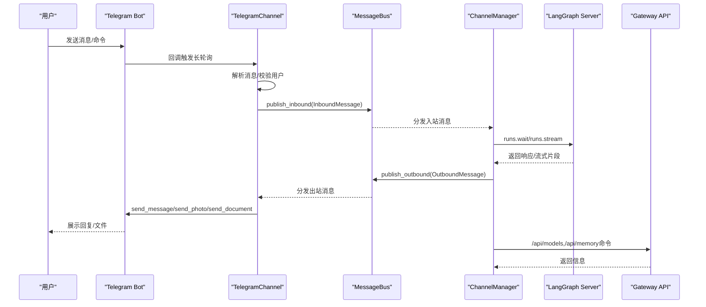
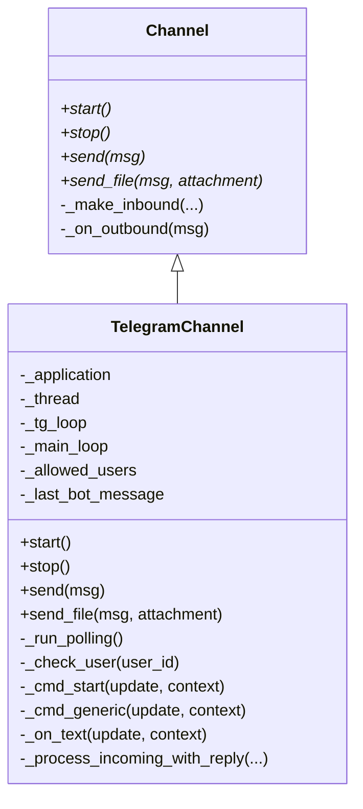
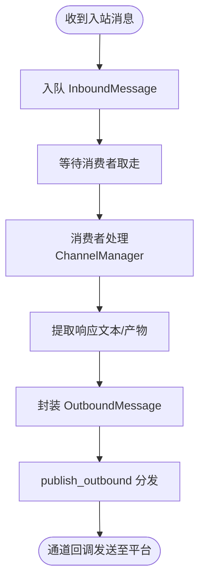
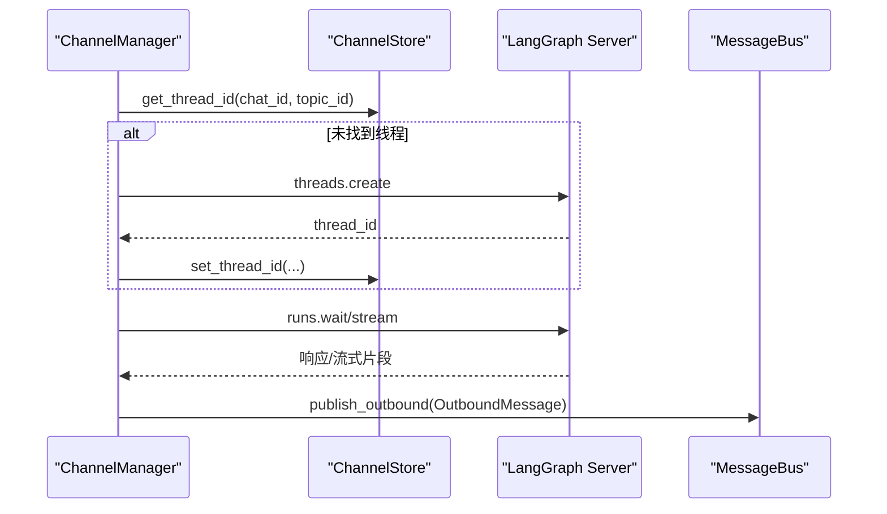
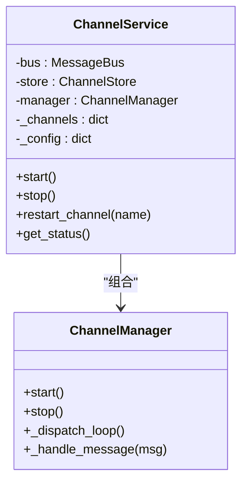
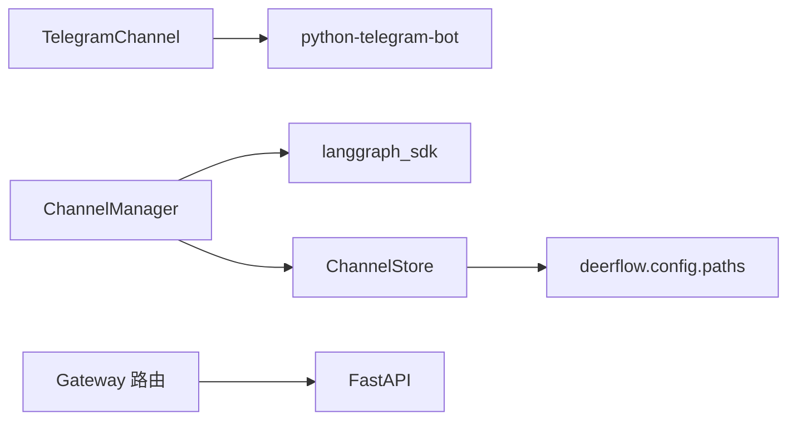

# Telegram 集成

<cite>
**本文引用的文件**
- [telegram.py](file://backend/app/channels/telegram.py)
- [base.py](file://backend/app/channels/base.py)
- [message_bus.py](file://backend/app/channels/message_bus.py)
- [manager.py](file://backend/app/channels/manager.py)
- [service.py](file://backend/app/channels/service.py)
- [channels.py](file://backend/app/gateway/routers/channels.py)
- [app.py](file://backend/app/gateway/app.py)
- [config.py](file://backend/app/gateway/config.py)
- [store.py](file://backend/app/channels/store.py)
- [config.example.yaml](file://config.example.yaml)
- [README.md](file://README.md)
- [backend/README.md](file://backend/README.md)
</cite>

## 目录
1. [简介](#简介)
2. [项目结构](#项目结构)
3. [核心组件](#核心组件)
4. [架构总览](#架构总览)
5. [详细组件分析](#详细组件分析)
6. [依赖关系分析](#依赖关系分析)
7. [性能考量](#性能考量)
8. [故障排查指南](#故障排查指南)
9. [结论](#结论)
10. [附录](#附录)

## 简介
本文件面向 DeerFlow 的 Telegram 集成，系统性阐述如何通过 Telegram Bot API 实现消息接收、解析与响应，以及与智能体系统的交互模式。内容涵盖：
- 机器人创建与令牌配置
- 配置文件与环境变量设置
- 长轮询（Polling）模式下的消息处理流程
- 与消息总线、通道管理器、LangGraph 服务的交互
- 常见问题与部署建议

## 项目结构
Telegram 集成位于后端子系统中，采用“通道（Channel）+ 消息总线（MessageBus）+ 管理器（ChannelManager）”的解耦架构。关键模块如下：
- 渠道层：TelegramChannel 实现 Telegram Bot API 的接入与消息收发
- 总线层：MessageBus 提供异步发布/订阅，解耦渠道与智能体
- 管理层：ChannelManager 将入站消息路由到 LangGraph Server 并回传出站消息
- 网关层：FastAPI 路由提供状态查询与重启接口；应用生命周期中启动/停止通道服务

```mermaid
graph TB
subgraph "后端"
TG["TelegramChannel<br/>Telegram Bot 接入"]
MB["MessageBus<br/>异步发布/订阅"]
CM["ChannelManager<br/>LangGraph 交互"]
CS["ChannelService<br/>通道生命周期管理"]
ST["ChannelStore<br/>会话映射持久化"]
end
subgraph "外部系统"
BOT["Telegram Bot API"]
LG["LangGraph Server"]
GW["Gateway API"]
end
TG --> MB
MB --> CM
CM --> LG
CM --> GW
CS --> TG
CS --> CM
CM --> ST
BOT <- --> TG
```

图表来源
- [telegram.py:16-316](file://backend/app/channels/telegram.py#L16-L316)
- [message_bus.py:117-174](file://backend/app/channels/message_bus.py#L117-L174)
- [manager.py:317-732](file://backend/app/channels/manager.py#L317-L732)
- [service.py:22-179](file://backend/app/channels/service.py#L22-L179)
- [store.py:16-154](file://backend/app/channels/store.py#L16-L154)

章节来源
- [backend/README.md:1-377](file://backend/README.md#L1-L377)

## 核心组件
- TelegramChannel：基于 python-telegram-bot 的长轮询实现，负责接收 Telegram 消息、构造入站消息并通过消息总线发布，同时订阅出站消息并发送给 Telegram
- MessageBus：异步队列与回调分发，承载入站/出站消息
- ChannelManager：从消息总线取入站消息，调用 LangGraph Server 的 runs.wait 或 runs.stream，提取响应文本与产物，封装为出站消息并发布
- ChannelService：根据配置实例化并启动各通道，提供状态查询与重启能力
- ChannelStore：将 IM 会话（chat_id + topic_id）映射到 DeerFlow 线程（thread_id），支持并发安全的 JSON 文件存储
- Gateway 路由：提供 /api/channels 状态查询与重启接口

章节来源
- [telegram.py:16-316](file://backend/app/channels/telegram.py#L16-L316)
- [message_bus.py:117-174](file://backend/app/channels/message_bus.py#L117-L174)
- [manager.py:317-732](file://backend/app/channels/manager.py#L317-L732)
- [service.py:22-179](file://backend/app/channels/service.py#L22-L179)
- [store.py:16-154](file://backend/app/channels/store.py#L16-L154)
- [channels.py:12-53](file://backend/app/gateway/routers/channels.py#L12-L53)

## 架构总览
下图展示 Telegram 集成在整体系统中的位置与数据流：



图表来源
- [telegram.py:275-316](file://backend/app/channels/telegram.py#L275-L316)
- [message_bus.py:131-174](file://backend/app/channels/message_bus.py#L131-L174)
- [manager.py:479-641](file://backend/app/channels/manager.py#L479-L641)
- [channels.py:25-53](file://backend/app/gateway/routers/channels.py#L25-L53)

## 详细组件分析

### TelegramChannel 组件
- 配置项
  - bot_token：来自 @BotFather 的 HTTP API 令牌
  - allowed_users：可选，限制特定用户访问
- 生命周期
  - start：初始化 ApplicationBuilder，注册命令与文本处理器，启动长轮询线程
  - stop：停止轮询、关闭应用、清理资源
- 消息处理
  - 文本消息：解析 chat_id、user_id、msg_id，确定 topic_id（私聊为 None，群组优先 reply_to，否则使用当前消息）
  - 命令消息：/start、/new、/status、/models、/memory、/help，构造 InboundMessage 并发布
  - 出站发送：send 支持重试与回复到上次 bot 消息；send_file 支持图片与文档上传
- 用户校验：_check_user 支持白名单控制



图表来源
- [base.py:14-109](file://backend/app/channels/base.py#L14-L109)
- [telegram.py:16-316](file://backend/app/channels/telegram.py#L16-L316)

章节来源
- [telegram.py:16-316](file://backend/app/channels/telegram.py#L16-L316)

### MessageBus 组件
- 入站：publish_inbound 将 InboundMessage 入队；get_inbound 阻塞取队列
- 出站：subscribe_outbound 注册回调；publish_outbound 并发分发给所有监听者
- 数据结构：InboundMessage、OutboundMessage、ResolvedAttachment



图表来源
- [message_bus.py:117-174](file://backend/app/channels/message_bus.py#L117-L174)

章节来源
- [message_bus.py:22-174](file://backend/app/channels/message_bus.py#L22-L174)

### ChannelManager 组件
- 会话映射：通过 ChannelStore 将 chat_id/topic_id 映射到 thread_id
- 命令处理：/new 创建新线程；/status 查询当前线程；/models、/memory 通过 Gateway 获取信息；/help 展示帮助
- 聊天处理：runs.wait（非流式）或 runs.stream（流式）调用 LangGraph Server，提取文本与产物，准备附件，发布出站消息
- 流式更新：最小间隔控制，避免频繁更新



图表来源
- [manager.py:465-641](file://backend/app/channels/manager.py#L465-L641)
- [store.py:82-107](file://backend/app/channels/store.py#L82-L107)

章节来源
- [manager.py:317-732](file://backend/app/channels/manager.py#L317-L732)
- [store.py:16-154](file://backend/app/channels/store.py#L16-L154)

### ChannelService 组件
- 通道注册表：包含 telegram、slack、feishu
- 启动/停止：按配置逐个启动通道实例；提供重启指定通道的能力
- 状态查询：返回服务运行状态与各通道启用/运行状态



图表来源
- [service.py:22-179](file://backend/app/channels/service.py#L22-L179)

章节来源
- [service.py:22-179](file://backend/app/channels/service.py#L22-L179)

### Gateway 路由与应用
- /api/channels：GET 查询通道状态；POST /{name}/restart 重启指定通道
- 应用生命周期：lifespan 中加载配置、启动通道服务；关闭时停止通道服务

章节来源
- [channels.py:12-53](file://backend/app/gateway/routers/channels.py#L12-L53)
- [app.py:32-71](file://backend/app/gateway/app.py#L32-L71)

## 依赖关系分析
- TelegramChannel 依赖 python-telegram-bot（长轮询）
- ChannelManager 依赖 langgraph_sdk（与 LangGraph Server 通信）
- Gateway 路由依赖 FastAPI（提供 REST 接口）
- ChannelStore 依赖 deerflow.config.paths（路径解析）



图表来源
- [telegram.py:44-47](file://backend/app/channels/telegram.py#L44-L47)
- [manager.py:386-392](file://backend/app/channels/manager.py#L386-L392)
- [app.py:1-201](file://backend/app/gateway/app.py#L1-L201)
- [store.py:36-44](file://backend/app/channels/store.py#L36-L44)

章节来源
- [telegram.py:44-47](file://backend/app/channels/telegram.py#L44-L47)
- [manager.py:386-392](file://backend/app/channels/manager.py#L386-L392)
- [app.py:1-201](file://backend/app/gateway/app.py#L1-L201)
- [store.py:36-44](file://backend/app/channels/store.py#L36-L44)

## 性能考量
- 长轮询线程与事件循环分离：TelegramChannel 在独立线程中运行自己的事件循环，避免阻塞主事件循环
- 出站发送重试：send 支持指数退避重试，提升网络抖动场景下的稳定性
- 流式更新节流：ChannelManager 对流式更新设置最小间隔，降低频繁更新带来的压力
- 并发控制：ChannelManager 使用信号量限制最大并发任务数
- 附件上传限制：Telegram 文件大小限制与类型判断，避免超限与不支持类型

章节来源
- [telegram.py:90-128](file://backend/app/channels/telegram.py#L90-L128)
- [manager.py:27-403](file://backend/app/channels/manager.py#L27-L403)

## 故障排查指南
- 缺少依赖
  - 现象：启动时报错提示缺少 python-telegram-bot
  - 处理：安装依赖后重启服务
- 无效 chat_id
  - 现象：发送失败日志显示无效 chat_id
  - 处理：检查 chat_id 类型转换逻辑与上游传参
- 用户未授权
  - 现象：消息被忽略
  - 处理：确认 allowed_users 配置是否正确
- 轮询异常
  - 现象：Telegram polling error 日志
  - 处理：检查网络连通性、代理设置与令牌有效性
- 出站回调异常
  - 现象：publish_outbound 回调抛出异常
  - 处理：查看回调实现与通道 send/send_file 的错误日志
- 通道重启失败
  - 现象：/api/channels/{name}/restart 返回失败
  - 处理：查看服务日志，确认通道配置与依赖可用

章节来源
- [telegram.py:44-47](file://backend/app/channels/telegram.py#L44-L47)
- [telegram.py:94-98](file://backend/app/channels/telegram.py#L94-L98)
- [telegram.py:224-227](file://backend/app/channels/telegram.py#L224-L227)
- [telegram.py:211-213](file://backend/app/channels/telegram.py#L211-L213)
- [message_bus.py:169-174](file://backend/app/channels/message_bus.py#L169-L174)
- [channels.py:37-52](file://backend/app/gateway/routers/channels.py#L37-L52)

## 结论
DeerFlow 的 Telegram 集成通过长轮询与消息总线实现了稳定的消息流转，结合 ChannelManager 与 LangGraph Server 完成智能体交互。其设计具备良好的扩展性与可观测性，适合在生产环境中部署与运维。建议在上线前完成令牌配置、用户白名单与网络连通性验证，并结合监控与日志进行持续优化。

## 附录

### 配置与部署指南
- 机器人创建与令牌配置
  - 步骤：与 @BotFather 会话，创建机器人并复制 HTTP API 令牌
  - 环境变量：在 .env 中设置 TELEGRAM_BOT_TOKEN
  - 配置文件：在 config.yaml 的 channels.telegram 中启用并填写 bot_token
- 用户白名单（可选）
  - 在 config.yaml 的 channels.telegram.allowed_users 中添加允许的用户 ID
- 启动与验证
  - 启动后端服务，确保 Gateway 与 LangGraph Server 正常运行
  - 通过 /api/channels 查询通道状态，确认 Telegram 已启动
  - 通过 /api/channels/{name}/restart 重启通道（如需）
- 常用命令
  - /new：开启新对话
  - /status：查看当前线程信息
  - /models：列出可用模型
  - /memory：查看内存状态
  - /help：显示帮助

章节来源
- [config.example.yaml:569-589](file://config.example.yaml#L569-L589)
- [README.md:348-368](file://README.md#L348-L368)
- [channels.py:25-53](file://backend/app/gateway/routers/channels.py#L25-L53)