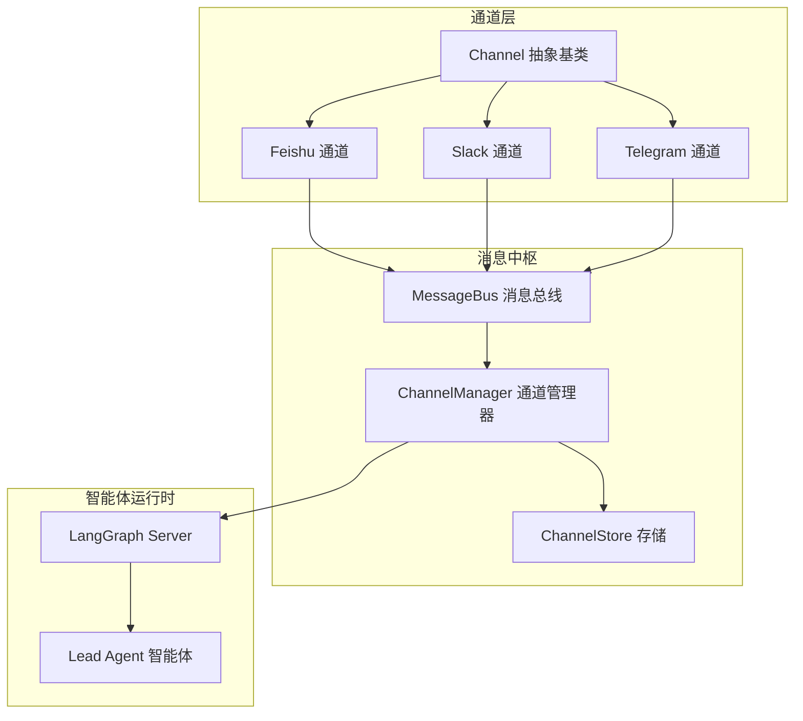
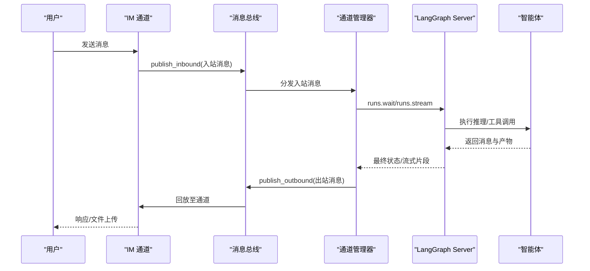
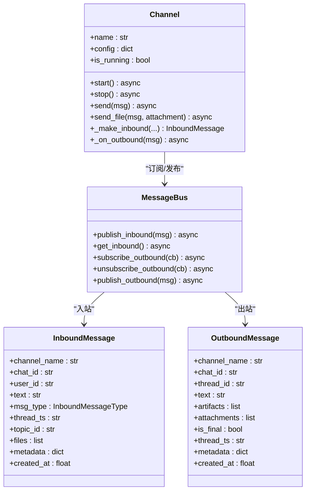
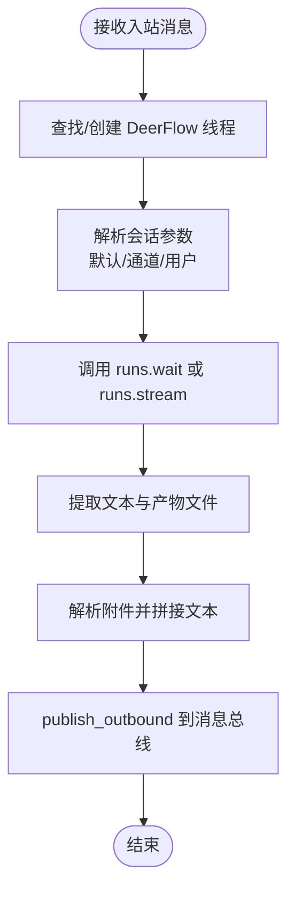
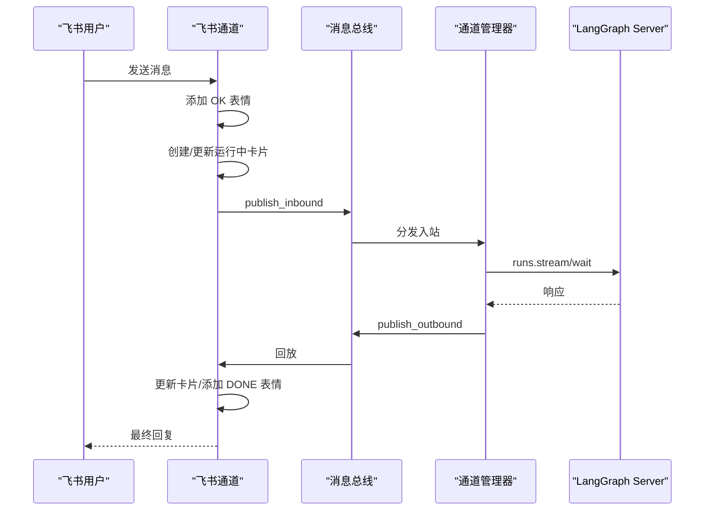
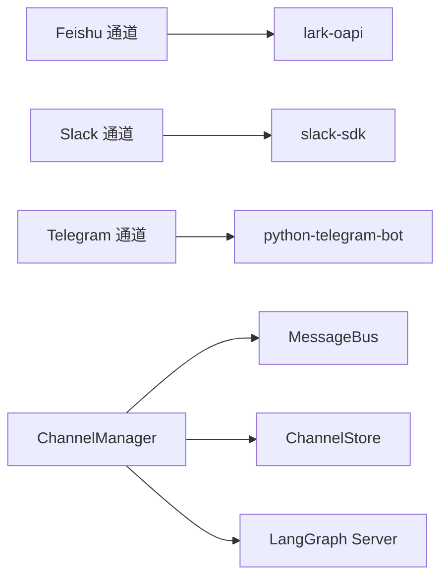

# 即时通讯集成

<cite>
**本文档引用的文件**
- [backend/app/channels/base.py](file://backend/app/channels/base.py)
- [backend/app/channels/message_bus.py](file://backend/app/channels/message_bus.py)
- [backend/app/channels/manager.py](file://backend/app/channels/manager.py)
- [backend/app/channels/service.py](file://backend/app/channels/service.py)
- [backend/app/channels/store.py](file://backend/app/channels/store.py)
- [backend/app/channels/feishu.py](file://backend/app/channels/feishu.py)
- [backend/app/channels/slack.py](file://backend/app/channels/slack.py)
- [backend/app/channels/telegram.py](file://backend/app/channels/telegram.py)
- [backend/app/gateway/routers/channels.py](file://backend/app/gateway/routers/channels.py)
- [config.example.yaml](file://config.example.yaml)
- [backend/docs/CONFIGURATION.md](file://backend/docs/CONFIGURATION.md)
- [backend/docs/ARCHITECTURE.md](file://backend/docs/ARCHITECTURE.md)
- [backend/tests/test_channels.py](file://backend/tests/test_channels.py)
</cite>

## 目录
1. [简介](#简介)
2. [项目结构](#项目结构)
3. [核心组件](#核心组件)
4. [架构总览](#架构总览)
5. [详细组件分析](#详细组件分析)
6. [依赖关系分析](#依赖关系分析)
7. [性能考虑](#性能考虑)
8. [故障排除指南](#故障排除指南)
9. [结论](#结论)
10. [附录](#附录)

## 简介
本文件面向 DeerFlow 即时通讯集成系统，系统性阐述通道架构设计、消息路由机制与多平台支持策略。文档覆盖 Telegram、Slack、飞书（Feishu）三大平台的集成实现与配置方法，解释消息处理流程、事件订阅机制与认证授权流程，并提供各平台的配置示例、部署指南与故障排除方法。同时说明通道系统与智能体、会话管理的集成关系，帮助开发者快速理解并扩展新的即时通讯平台。

## 项目结构
即时通讯集成位于后端模块 `backend/app/channels/` 下，采用“抽象基类 + 平台适配器 + 总线解耦 + 会话管理”的分层设计：

- 抽象基类：定义统一的通道生命周期与发送接口，屏蔽平台差异
- 消息总线：异步发布/订阅，解耦通道与智能体调度器
- 通道管理器：桥接消息总线与 LangGraph Server，负责会话创建与消息转发
- 存储：持久化 IM 聊天到 DeerFlow 线程的映射
- 平台适配器：分别实现 Telegram、Slack、飞书的接入与消息解析
- 网关路由：对外暴露通道状态查询与重启能力

**图表来源**
- [backend/app/channels/base.py:14-109](file://backend/app/channels/base.py#L14-L109)
- [backend/app/channels/message_bus.py:117-174](file://backend/app/channels/message_bus.py#L117-L174)
- [backend/app/channels/manager.py:317-732](file://backend/app/channels/manager.py#L317-L732)
- [backend/app/channels/store.py:16-154](file://backend/app/channels/store.py#L16-L154)
- [backend/app/channels/feishu.py:17-537](file://backend/app/channels/feishu.py#L17-L537)
- [backend/app/channels/slack.py:19-245](file://backend/app/channels/slack.py#L19-L245)
- [backend/app/channels/telegram.py:16-316](file://backend/app/channels/telegram.py#L16-L316)

**章节来源**
- [backend/app/channels/base.py:14-109](file://backend/app/channels/base.py#L14-L109)
- [backend/app/channels/message_bus.py:117-174](file://backend/app/channels/message_bus.py#L117-L174)
- [backend/app/channels/manager.py:317-732](file://backend/app/channels/manager.py#L317-L732)
- [backend/app/channels/store.py:16-154](file://backend/app/channels/store.py#L16-L154)
- [backend/app/channels/feishu.py:17-537](file://backend/app/channels/feishu.py#L17-L537)
- [backend/app/channels/slack.py:19-245](file://backend/app/channels/slack.py#L19-L245)
- [backend/app/channels/telegram.py:16-316](file://backend/app/channels/telegram.py#L16-L316)

## 核心组件
- Channel 抽象基类：定义通道生命周期（start/stop）、发送接口（send/send_file），以及入站消息工厂与出站回调
- MessageBus 消息总线：提供入站/出站队列与监听器注册，确保通道与调度器解耦
- ChannelManager 通道管理器：消费入站消息、创建/复用 DeerFlow 线程、调用 LangGraph Server、处理流式响应与附件交付
- ChannelStore 存储：以 JSON 文件持久化 IM 聊天到线程 ID 的映射，支持按聊天与话题维度查找
- 平台通道：Feishu（WebSocket）、Slack（Socket Mode）、Telegram（长轮询），均继承自 Channel 并实现各自事件解析与发送逻辑

**章节来源**
- [backend/app/channels/base.py:14-109](file://backend/app/channels/base.py#L14-L109)
- [backend/app/channels/message_bus.py:117-174](file://backend/app/channels/message_bus.py#L117-L174)
- [backend/app/channels/manager.py:317-732](file://backend/app/channels/manager.py#L317-L732)
- [backend/app/channels/store.py:16-154](file://backend/app/channels/store.py#L16-L154)

## 架构总览
系统通过消息总线实现“通道 → 管理器 → LangGraph Server → 智能体”的单向数据流；管理器负责：
- 将入站消息转换为 DeerFlow 线程上下文
- 调用 runs.wait 或 runs.stream 获取智能体响应
- 解析响应文本与产物文件，准备附件列表
- 通过总线将出站消息回传给目标通道

**图表来源**
- [backend/app/channels/message_bus.py:131-173](file://backend/app/channels/message_bus.py#L131-L173)
- [backend/app/channels/manager.py:419-641](file://backend/app/channels/manager.py#L419-L641)
- [backend/app/channels/feishu.py:168-234](file://backend/app/channels/feishu.py#L168-L234)
- [backend/app/channels/slack.py:80-129](file://backend/app/channels/slack.py#L80-L129)
- [backend/app/channels/telegram.py:90-128](file://backend/app/channels/telegram.py#L90-L128)

**章节来源**
- [backend/app/channels/manager.py:419-641](file://backend/app/channels/manager.py#L419-L641)
- [backend/docs/ARCHITECTURE.md:344-380](file://backend/docs/ARCHITECTURE.md#L344-L380)

## 详细组件分析

### 抽象通道与消息模型
- Channel 抽象类定义了通道的生命周期与发送接口，提供通用的入站消息工厂与出站回调，确保不同平台的消息格式被统一封装
- MessageBus 定义了入站/出站消息类型与附件结构，保证跨平台的一致性
- InboundMessage/OutboundMessage 提供统一字段：平台标识、聊天/线程标识、话题标识、文本内容、附件集合、元数据等

**图表来源**
- [backend/app/channels/base.py:14-109](file://backend/app/channels/base.py#L14-L109)
- [backend/app/channels/message_bus.py:22-107](file://backend/app/channels/message_bus.py#L22-L107)

**章节来源**
- [backend/app/channels/base.py:14-109](file://backend/app/channels/base.py#L14-L109)
- [backend/app/channels/message_bus.py:22-107](file://backend/app/channels/message_bus.py#L22-L107)

### 通道管理器与会话管理
- ChannelManager 负责：
  - 从消息总线获取入站消息
  - 通过 ChannelStore 查找或创建 DeerFlow 线程
  - 调用 LangGraph Server 的 runs.wait 或 runs.stream
  - 解析 AI 文本与产物文件，生成附件列表
  - 通过总线发布出站消息
- 支持会话参数分层：默认会话、通道级会话、用户级会话，按优先级合并
- 流式输出：对支持流式的通道（如飞书）进行增量推送，限制最小更新间隔

**图表来源**
- [backend/app/channels/manager.py:479-641](file://backend/app/channels/manager.py#L479-L641)

**章节来源**
- [backend/app/channels/manager.py:317-732](file://backend/app/channels/manager.py#L317-L732)

### 存储与线程映射
- ChannelStore 使用 JSON 文件存储 IM 聊天到 DeerFlow 线程的映射，键格式为 “channel:chat_id” 或 “channel:chat_id:topic_id”
- 提供增删查改操作，支持批量列出与按通道过滤
- 写入采用临时文件+原子替换，保证并发安全

**章节来源**
- [backend/app/channels/store.py:16-154](file://backend/app/channels/store.py#L16-L154)

### 飞书（Feishu）集成
- 连接方式：使用 lark-oapi 的 WebSocket 客户端，无需公网 IP
- 事件处理：解析富文本消息内容，支持命令消息与普通聊天消息
- 交互体验：收到消息后先添加 OK 表情，再在原消息线程中更新“工作中...”卡片，最终完成时添加 DONE 表情
- 文件上传：根据文件类型选择 image/file 接口，支持大小限制与错误处理
- 配置项：app_id、app_secret、verification_token（可选）

**图表来源**
- [backend/app/channels/feishu.py:454-537](file://backend/app/channels/feishu.py#L454-L537)
- [backend/app/channels/manager.py:546-641](file://backend/app/channels/manager.py#L546-L641)

**章节来源**
- [backend/app/channels/feishu.py:17-537](file://backend/app/channels/feishu.py#L17-L537)

### Slack 集成
- 连接方式：Socket Mode（WebSocket），无需公网 IP
- 事件处理：识别 events_api 类型事件，处理 message 与 app_mention，支持 allowed_users 白名单
- 交互体验：收到消息后添加 eyes 表情，发送“Working on it...”回复，完成后添加勾选表情
- 文件上传：使用 files_upload_v2，支持线程内回复
- 配置项：bot_token、app_token、allowed_users（可选）

**章节来源**
- [backend/app/channels/slack.py:19-245](file://backend/app/channels/slack.py#L19-L245)

### Telegram 集成
- 连接方式：长轮询（polling），无需公网 IP
- 事件处理：区分命令与普通文本，支持 allowed_users 白名单
- 交互体验：发送“Working on it...”回复，基于上次机器人消息进行回复以保持线程
- 文件上传：根据文件类型选择 send_photo 或 send_document，支持大小限制
- 配置项：bot_token、allowed_users（可选）

**章节来源**
- [backend/app/channels/telegram.py:16-316](file://backend/app/channels/telegram.py#L16-L316)

### 通道服务与生命周期管理
- ChannelService 负责：
  - 从应用配置读取通道配置
  - 注册通道类路径，按需实例化并启动
  - 启动 ChannelManager 并注册所有启用的通道
  - 提供状态查询与通道重启能力（通过网关路由）
- 通道注册表：feishu、slack、telegram 对应具体实现类

**章节来源**
- [backend/app/channels/service.py:22-179](file://backend/app/channels/service.py#L22-L179)
- [backend/app/gateway/routers/channels.py:25-52](file://backend/app/gateway/routers/channels.py#L25-L52)

## 依赖关系分析
- 组件耦合度低：通道仅依赖 MessageBus，管理器仅依赖总线与存储，智能体通过 LangGraph Server 解耦
- 外部依赖：
  - Feishu：lark-oapi（WebSocket 客户端）
  - Slack：slack-sdk（Socket Mode/Web API）
  - Telegram：python-telegram-bot（长轮询）
- 通道能力矩阵：
  - Feishu：支持流式输出
  - Slack：不支持流式输出
  - Telegram：不支持流式输出

**图表来源**
- [backend/app/channels/feishu.py:58-91](file://backend/app/channels/feishu.py#L58-L91)
- [backend/app/channels/slack.py:39-45](file://backend/app/channels/slack.py#L39-L45)
- [backend/app/channels/telegram.py:43-47](file://backend/app/channels/telegram.py#L43-L47)
- [backend/app/channels/manager.py:384-392](file://backend/app/channels/manager.py#L384-L392)

**章节来源**
- [backend/app/channels/manager.py:29-33](file://backend/app/channels/manager.py#L29-L33)

## 性能考虑
- 并发控制：ChannelManager 使用信号量限制最大并发任务数，避免资源争用
- 流式输出节流：对流式通道设置最小更新间隔，减少频繁 UI 刷新
- 附件安全：仅允许输出目录内的虚拟路径解析为真实路径，防止路径穿越与敏感文件泄露
- 重试机制：通道发送失败时按指数退避重试，提升网络抖动下的稳定性

**章节来源**
- [backend/app/channels/manager.py:401-403](file://backend/app/channels/manager.py#L401-L403)
- [backend/app/channels/manager.py:590-593](file://backend/app/channels/manager.py#L590-L593)
- [backend/app/channels/manager.py:241-287](file://backend/app/channels/manager.py#L241-L287)
- [backend/app/channels/feishu.py:181-199](file://backend/app/channels/feishu.py#L181-L199)
- [backend/app/channels/slack.py:92-116](file://backend/app/channels/slack.py#L92-L116)
- [backend/app/channels/telegram.py:109-126](file://backend/app/channels/telegram.py#L109-L126)

## 故障排除指南
- 通道未启动
  - 检查配置文件中的 enabled 字段与必要参数是否正确
  - 通过网关查询通道状态，确认服务已启动
- 发送失败
  - 查看通道日志中的异常堆栈，关注网络超时与权限问题
  - 对于文件上传，检查大小限制与 MIME 类型判断
- 流式输出异常
  - 确认通道是否声明支持流式输出
  - 检查最小更新间隔设置与 LangGraph Server 的流式返回
- 会话参数不生效
  - 检查默认会话、通道级会话与用户级会话的合并顺序
  - 确保会话字段名称与类型正确
- 线程映射异常
  - 检查 ChannelStore 的 JSON 文件是否损坏或被外部修改
  - 确认 topic_id 的解析逻辑是否符合预期（飞书使用 root_id，Slack/Telegram 使用 thread_ts）

**章节来源**
- [backend/app/gateway/routers/channels.py:25-52](file://backend/app/gateway/routers/channels.py#L25-L52)
- [backend/tests/test_channels.py:416-800](file://backend/tests/test_channels.py#L416-L800)

## 结论
DeerFlow 的即时通讯集成通过抽象通道、消息总线与通道管理器实现了高内聚、低耦合的架构设计。三大平台以统一接口接入，既保证了平台特性（如飞书卡片与表情反馈），又通过会话管理与线程映射实现了跨平台一致的对话体验。结合流式输出、附件安全与重试机制，系统在易用性与可靠性之间取得良好平衡。未来扩展新平台时，只需实现 Channel 抽象类并注册到服务即可无缝接入。

## 附录

### 配置示例与部署指南
- 配置文件位置与加载顺序：项目根目录的 config.yaml，支持环境变量注入
- 通道配置模板（启用示例）：
  - Feishu：需要 app_id 与 app_secret
  - Slack：需要 bot_token 与 app_token，可选 allowed_users
  - Telegram：需要 bot_token，可选 allowed_users
- 会话配置：支持默认会话、通道级会话与用户级会话的分层覆盖
- 部署建议：
  - 使用 Nginx 反向代理统一入口，将 /api/langgraph 与 /api 路由到 LangGraph Server 与 Gateway
  - Docker 环境下通过 docker-compose 启动各服务组件

**章节来源**
- [config.example.yaml:537-589](file://config.example.yaml#L537-L589)
- [backend/docs/CONFIGURATION.md:286-350](file://backend/docs/CONFIGURATION.md#L286-L350)
- [backend/docs/ARCHITECTURE.md:1-51](file://backend/docs/ARCHITECTURE.md#L1-L51)

### API 路由与运维
- 查询通道状态：GET /api/channels
- 重启指定通道：POST /api/channels/{name}/restart

**章节来源**
- [backend/app/gateway/routers/channels.py:25-52](file://backend/app/gateway/routers/channels.py#L25-L52)

### 测试参考
- 单元测试覆盖消息总线、存储、通道基类与管理器的关键行为，可作为新增平台适配的参考样例

**章节来源**
- [backend/tests/test_channels.py:45-142](file://backend/tests/test_channels.py#L45-L142)
- [backend/tests/test_channels.py:149-206](file://backend/tests/test_channels.py#L149-L206)
- [backend/tests/test_channels.py:213-271](file://backend/tests/test_channels.py#L213-L271)
- [backend/tests/test_channels.py:416-800](file://backend/tests/test_channels.py#L416-L800)