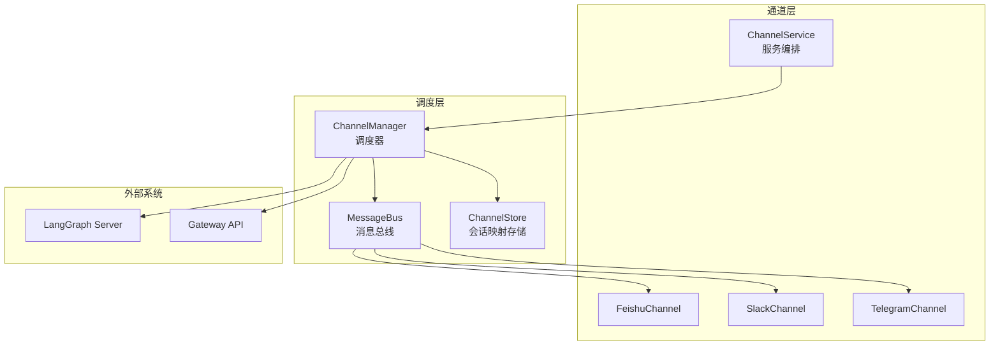
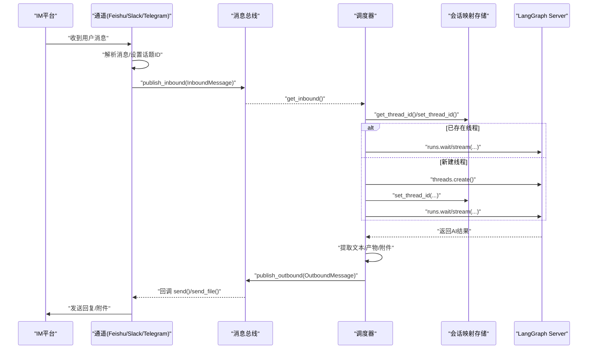
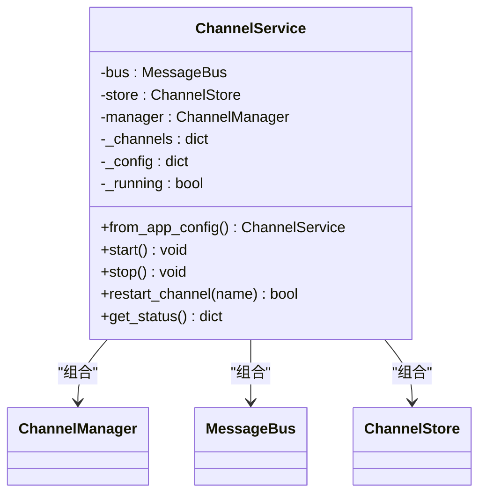
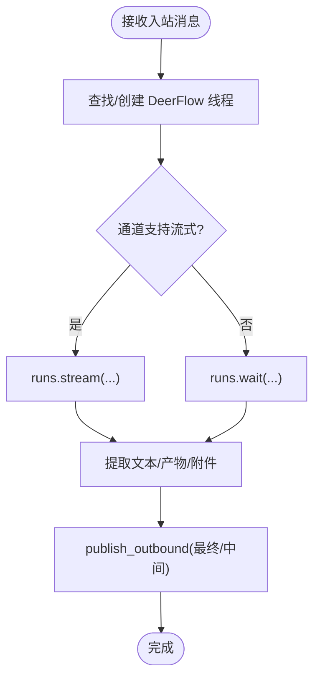
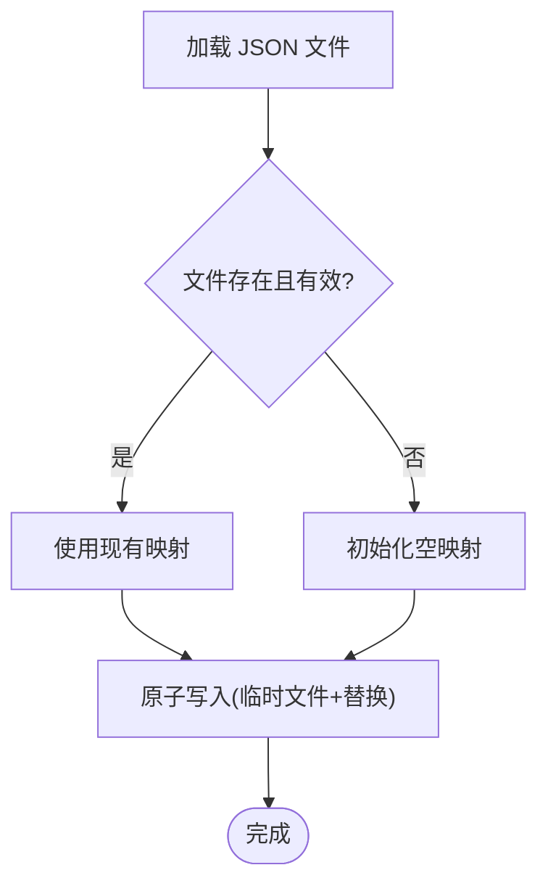
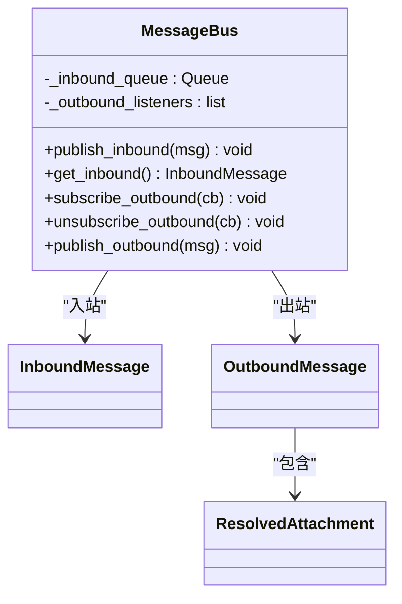
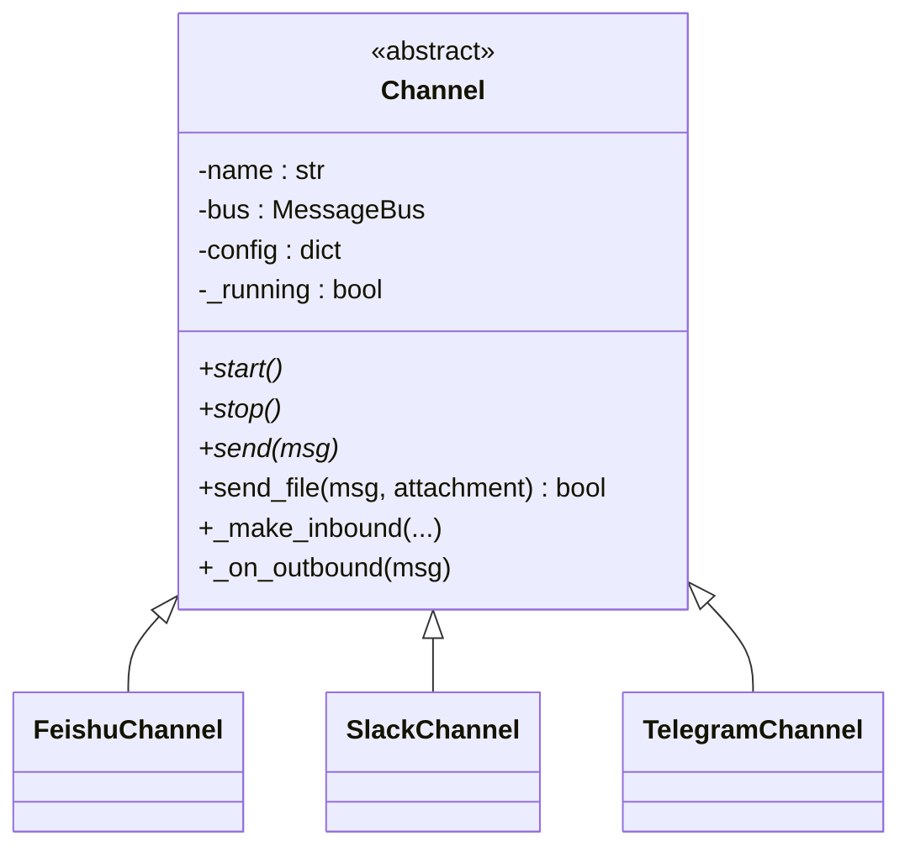
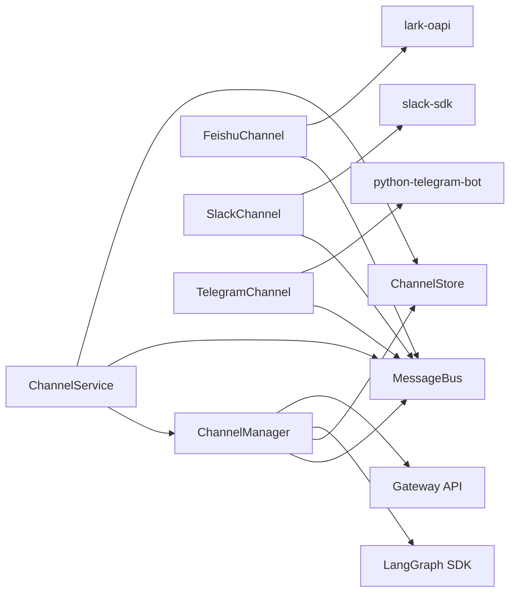

# 服务通道

<cite>
**本文引用的文件列表**
- [service.py](file://backend/app/channels/service.py)
- [manager.py](file://backend/app/channels/manager.py)
- [store.py](file://backend/app/channels/store.py)
- [message_bus.py](file://backend/app/channels/message_bus.py)
- [base.py](file://backend/app/channels/base.py)
- [feishu.py](file://backend/app/channels/feishu.py)
- [slack.py](file://backend/app/channels/slack.py)
- [telegram.py](file://backend/app/channels/telegram.py)
- [config.example.yaml](file://config.example.yaml)
- [test_channels.py](file://backend/tests/test_channels.py)
</cite>

## 目录
1. [简介](#简介)
2. [项目结构](#项目结构)
3. [核心组件](#核心组件)
4. [架构总览](#架构总览)
5. [详细组件分析](#详细组件分析)
6. [依赖关系分析](#依赖关系分析)
7. [性能考量](#性能考量)
8. [故障排查指南](#故障排查指南)
9. [结论](#结论)
10. [附录](#附录)

## 简介
本技术文档面向 DeerFlow 的“服务通道”系统，系统性阐述其设计理念、存储与持久化策略、消息格式与检索机制、数据清理策略，以及与传统通道（如直接连接模型或网关）的区别、适用场景与配置方法。文档同时提供使用示例、性能优化建议与维护指南，帮助开发者与运维人员高效部署与稳定运行。

## 项目结构
服务通道位于后端应用的 channels 子模块中，围绕以下关键文件组织：
- 服务编排：service.py（生命周期管理、注册与启动）
- 消息总线：message_bus.py（异步发布/订阅，解耦通道与调度器）
- 调度器：manager.py（桥接通道与 LangGraph Server，处理入站消息并派发出站消息）
- 存储：store.py（IM 会话到 DeerFlow 线程的映射持久化）
- 抽象基类：base.py（统一通道接口与通用行为）
- 平台通道：feishu.py、slack.py、telegram.py（各平台接入实现）

图表来源
- [service.py:22-150](file://backend/app/channels/service.py#L22-L150)
- [manager.py:317-416](file://backend/app/channels/manager.py#L317-L416)
- [message_bus.py:117-174](file://backend/app/channels/message_bus.py#L117-L174)
- [store.py:16-71](file://backend/app/channels/store.py#L16-L71)
- [feishu.py:17-537](file://backend/app/channels/feishu.py#L17-L537)
- [slack.py:19-245](file://backend/app/channels/slack.py#L19-L245)
- [telegram.py:16-316](file://backend/app/channels/telegram.py#L16-L316)

章节来源
- [service.py:1-179](file://backend/app/channels/service.py#L1-L179)
- [manager.py:1-732](file://backend/app/channels/manager.py#L1-L732)
- [store.py:1-154](file://backend/app/channels/store.py#L1-L154)
- [message_bus.py:1-174](file://backend/app/channels/message_bus.py#L1-L174)
- [base.py:1-109](file://backend/app/channels/base.py#L1-L109)
- [feishu.py:1-537](file://backend/app/channels/feishu.py#L1-L537)
- [slack.py:1-245](file://backend/app/channels/slack.py#L1-L245)
- [telegram.py:1-316](file://backend/app/channels/telegram.py#L1-L316)

## 核心组件
- ChannelService：从应用配置读取 channels 配置，实例化启用的通道，启动 ChannelManager，并统一管理通道生命周期。
- ChannelManager：消费消息总线的入站消息，基于 ChannelStore 查找或创建 DeerFlow 线程，调用 LangGraph Server 执行推理，处理流式/非流式响应，并通过消息总线分发出站消息。
- ChannelStore：以 JSON 文件持久化“平台通道名:聊天ID:话题ID”到 DeerFlow 线程ID的映射，支持原子写入与并发锁保护。
- MessageBus：异步队列承载入站消息；出站消息广播给已订阅的通道回调。
- Channel 抽象基类：定义通道生命周期与发送接口，提供通用入站消息构造与出站回调封装。
- 平台通道实现：Feishu、Slack、Telegram 分别对接相应平台的 WebSocket/Socket Mode/长轮询，解析消息、设置话题ID、回传入站消息至总线。

章节来源
- [service.py:22-150](file://backend/app/channels/service.py#L22-L150)
- [manager.py:317-732](file://backend/app/channels/manager.py#L317-L732)
- [store.py:16-154](file://backend/app/channels/store.py#L16-L154)
- [message_bus.py:117-174](file://backend/app/channels/message_bus.py#L117-L174)
- [base.py:14-109](file://backend/app/channels/base.py#L14-L109)
- [feishu.py:17-537](file://backend/app/channels/feishu.py#L17-L537)
- [slack.py:19-245](file://backend/app/channels/slack.py#L19-L245)
- [telegram.py:16-316](file://backend/app/channels/telegram.py#L16-L316)

## 架构总览
服务通道采用“通道-调度器-总线-存储-外部系统”的分层架构：
- 通道层负责与外部 IM 平台交互，将平台消息转换为 InboundMessage 并发布到总线。
- 调度器从总线获取入站消息，结合存储查找/创建线程，调用 LangGraph Server 执行推理，提取文本与产物，组装 OutboundMessage 并发布到总线。
- 通道层监听总线的出站消息，调用平台 API 发送回复与附件。
- 存储持久化会话映射，确保多轮对话与话题隔离。

图表来源
- [manager.py:419-641](file://backend/app/channels/manager.py#L419-L641)
- [message_bus.py:131-173](file://backend/app/channels/message_bus.py#L131-L173)
- [store.py:82-137](file://backend/app/channels/store.py#L82-L137)
- [feishu.py:168-234](file://backend/app/channels/feishu.py#L168-L234)
- [slack.py:80-150](file://backend/app/channels/slack.py#L80-L150)
- [telegram.py:90-170](file://backend/app/channels/telegram.py#L90-L170)

## 详细组件分析

### 组件A：ChannelService（服务编排）
- 职责：从应用配置加载 channels 配置，按需实例化启用的通道，启动 ChannelManager，并提供状态查询与重启能力。
- 关键点：
  - 通过反射解析通道类路径，延迟导入，避免不必要的依赖。
  - 支持全局与通道级会话配置转发至调度器。
  - 提供单例访问与生命周期管理。

图表来源
- [service.py:22-150](file://backend/app/channels/service.py#L22-L150)

章节来源
- [service.py:22-179](file://backend/app/channels/service.py#L22-L179)

### 组件B：ChannelManager（调度器）
- 职责：消费入站消息，管理并发，调用 LangGraph Server，处理流式/非流式响应，准备产物附件，发布出站消息。
- 关键点：
  - 基于通道能力表决定是否使用流式模式。
  - 合并默认/通道/用户会话配置，形成运行参数与上下文。
  - 流式更新最小间隔控制，避免频繁出站。
  - 命令处理：/bootstrap、/new、/status、/models、/memory、/help。
  - 安全附件解析：仅允许输出目录下的虚拟路径，防止路径逃逸与敏感文件泄露。

图表来源
- [manager.py:419-641](file://backend/app/channels/manager.py#L419-L641)

章节来源
- [manager.py:317-732](file://backend/app/channels/manager.py#L317-L732)

### 组件C：ChannelStore（会话映射存储）
- 职责：持久化“平台通道名:聊天ID:话题ID”到 DeerFlow 线程ID的映射，支持查询、创建/更新、删除与列举。
- 存储格式：JSON 文件，键为复合键，值包含线程ID、用户ID与时间戳。
- 并发与可靠性：写入采用临时文件+替换的原子写法，配合线程锁，保证一致性。
- 清理策略：提供按聊天或按话题粒度的删除接口，便于在平台侧清理会话时同步清理映射。

图表来源
- [store.py:48-70](file://backend/app/channels/store.py#L48-L70)

章节来源
- [store.py:16-154](file://backend/app/channels/store.py#L16-L154)

### 组件D：MessageBus（消息总线）
- 职责：入站消息队列、出站消息广播、回调注册/注销。
- 设计要点：异步队列保证 FIFO；出站回调异常不影响其他监听者；日志记录入/出站统计信息。

图表来源
- [message_bus.py:117-174](file://backend/app/channels/message_bus.py#L117-L174)

章节来源
- [message_bus.py:1-174](file://backend/app/channels/message_bus.py#L1-L174)

### 组件E：抽象通道 Channel 与平台通道
- Channel 抽象类：定义 start/stop/send 接口，提供入站消息工厂与出站回调封装，确保文本优先、附件次之、失败不半发。
- 平台通道：
  - Feishu：WebSocket，支持运行中卡片更新、反应标记、文件/图片上传、大小限制与类型映射。
  - Slack：Socket Mode，支持运行中“正在处理”提示、反应标记、文件上传、可选用户白名单。
  - Telegram：长轮询，支持回复消息链路、文件上传、大小限制与类型区分。

图表来源
- [base.py:14-109](file://backend/app/channels/base.py#L14-L109)
- [feishu.py:17-537](file://backend/app/channels/feishu.py#L17-L537)
- [slack.py:19-245](file://backend/app/channels/slack.py#L19-L245)
- [telegram.py:16-316](file://backend/app/channels/telegram.py#L16-L316)

章节来源
- [base.py:14-109](file://backend/app/channels/base.py#L14-L109)
- [feishu.py:17-537](file://backend/app/channels/feishu.py#L17-L537)
- [slack.py:19-245](file://backend/app/channels/slack.py#L19-L245)
- [telegram.py:16-316](file://backend/app/channels/telegram.py#L16-L316)

## 依赖关系分析
- 服务层依赖：ChannelService 依赖 ChannelManager、MessageBus、ChannelStore。
- 调度层依赖：ChannelManager 依赖 MessageBus、ChannelStore、LangGraph SDK、Gateway API。
- 通道层依赖：各平台通道依赖对应 SDK（lark-oapi、slack-sdk、python-telegram-bot），并通过 MessageBus 与调度器通信。
- 存储层依赖：ChannelStore 依赖 JSON 序列化与文件系统，使用线程锁与原子写入保障一致性。

图表来源
- [service.py:22-47](file://backend/app/channels/service.py#L22-L47)
- [manager.py:384-392](file://backend/app/channels/manager.py#L384-L392)
- [feishu.py:58-91](file://backend/app/channels/feishu.py#L58-L91)
- [slack.py:39-45](file://backend/app/channels/slack.py#L39-L45)
- [telegram.py:43-47](file://backend/app/channels/telegram.py#L43-L47)

章节来源
- [service.py:1-179](file://backend/app/channels/service.py#L1-L179)
- [manager.py:1-732](file://backend/app/channels/manager.py#L1-L732)

## 性能考量
- 并发控制：调度器使用信号量限制最大并发，避免对 LangGraph Server 造成瞬时压力。
- 流式更新节流：流式响应最小更新间隔控制，减少总线与平台的发送频率。
- 附件安全与体积：通道实现对文件大小进行限制，避免超大文件导致平台或网络问题。
- 存储写入：ChannelStore 使用原子写入与锁，降低高并发下的竞争风险。
- 日志与可观测性：总线与调度器均记录入/出站统计与错误，便于定位瓶颈与异常。

[本节为通用性能建议，无需特定文件引用]

## 故障排查指南
- 通道未启动：检查配置中的 enabled 字段与平台密钥；确认通道类路径正确；查看服务状态与日志。
- 无法连接平台：核对 SDK 依赖是否安装；检查网络连通性与令牌权限。
- 线程映射异常：检查 ChannelStore 文件是否存在损坏；必要时重建映射或清理无效键。
- 出站消息未送达：确认通道回调已注册；检查平台 API 返回码与速率限制；关注总线回调异常日志。
- 流式响应卡顿：调整最小更新间隔或降低并发；检查 LangGraph Server 响应时间。
- 附件上传失败：确认文件大小与类型限制；检查输出目录路径与权限；验证虚拟路径解析逻辑。

章节来源
- [service.py:62-93](file://backend/app/channels/service.py#L62-L93)
- [manager.py:419-462](file://backend/app/channels/manager.py#L419-L462)
- [store.py:48-70](file://backend/app/channels/store.py#L48-L70)
- [message_bus.py:160-173](file://backend/app/channels/message_bus.py#L160-L173)
- [feishu.py:168-234](file://backend/app/channels/feishu.py#L168-L234)
- [slack.py:80-150](file://backend/app/channels/slack.py#L80-L150)
- [telegram.py:90-170](file://backend/app/channels/telegram.py#L90-L170)

## 结论
服务通道通过“通道-总线-调度器-存储-外部系统”的清晰分层，实现了与多平台 IM 的解耦集成，具备良好的扩展性与稳定性。其以 JSON 文件持久化的会话映射与原子写入策略，兼顾了简单性与可靠性；调度器对流式与非流式的统一处理，满足不同平台特性。结合合理的并发控制与日志监控，可在生产环境中稳定运行。

[本节为总结性内容，无需特定文件引用]

## 附录

### 服务通道与传统通道的区别
- 传统通道：通常指直接连接模型或网关的通道，侧重于推理与工具调用，较少涉及多平台 IM 的会话映射与话题隔离。
- 服务通道：专门用于 IM 平台接入，强调“会话映射”“话题ID”“平台特性适配”，并通过 LangGraph Server 实现多轮对话与状态管理。

[本小节为概念性说明，无需特定文件引用]

### 适用场景
- 多平台 IM 入口：需要在 Feishu、Slack、Telegram 等平台提供一致的对话体验。
- 多轮对话与话题隔离：通过话题ID将不同子话题映射到独立 DeerFlow 线程。
- 产物与附件交付：Agent 生成文件或图片，通过通道上传至平台。

[本小节为概念性说明，无需特定文件引用]

### 配置方法
- 在配置文件中启用 channels，并设置各平台的认证信息与可选参数（如 allowed_users、session 等）。
- 通过 ChannelService.from_app_config() 读取配置并启动服务。
- 可通过命令前缀触发管理功能：/bootstrap、/new、/status、/models、/memory、/help。

章节来源
- [config.example.yaml:537-589](file://config.example.yaml#L537-L589)
- [service.py:49-60](file://backend/app/channels/service.py#L49-L60)
- [manager.py:645-698](file://backend/app/channels/manager.py#L645-L698)

### 消息存储格式与检索机制
- 存储键：由通道名、聊天ID与可选话题ID组成复合键，确保同一聊天内的不同话题映射到不同线程。
- 值字段：包含线程ID、用户ID与创建/更新时间戳。
- 检索：根据复合键查询；删除支持按聊天或按话题粒度清理；列举支持按通道过滤。

章节来源
- [store.py:16-154](file://backend/app/channels/store.py#L16-L154)

### 数据清理策略
- 单条删除：按复合键删除指定映射。
- 批量删除：按聊天ID前缀删除该聊天下所有映射（含话题）。
- 外部清理：当平台侧删除群组或私聊时，应同步调用删除接口清理映射，避免悬挂键。

章节来源
- [store.py:109-137](file://backend/app/channels/store.py#L109-L137)

### 使用示例（步骤）
- 启动服务：从应用配置创建 ChannelService 并 start。
- 发送消息：任一通道收到平台消息后，解析为 InboundMessage 并发布到总线。
- 调度执行：ChannelManager 获取消息，查找/创建线程，调用 LangGraph Server。
- 回复通道：调度器将 OutboundMessage 发布到总线，通道回调发送文本与附件。
- 查询状态：通过服务状态接口查看各通道启停状态与运行情况。

章节来源
- [service.py:62-79](file://backend/app/channels/service.py#L62-L79)
- [manager.py:419-544](file://backend/app/channels/manager.py#L419-L544)
- [message_bus.py:131-173](file://backend/app/channels/message_bus.py#L131-L173)

### 性能优化建议
- 合理设置最大并发，避免对 LangGraph Server 与平台 API 造成过载。
- 对流式响应设置合适的最小更新间隔，平衡实时性与带宽消耗。
- 控制附件大小与类型，减少上传失败与平台限流风险。
- 定期检查与清理 ChannelStore，避免键数量膨胀影响查询性能。

[本小节为通用建议，无需特定文件引用]

### 维护指南
- 监控日志：关注总线与调度器的日志，及时发现异常。
- 健康检查：定期调用 /status、/models、/memory 等命令验证服务状态。
- 配置升级：使用配置升级脚本合并新字段，避免版本不兼容。
- 备份存储：定期备份 ChannelStore 文件，防止意外丢失。

章节来源
- [manager.py:645-698](file://backend/app/channels/manager.py#L645-L698)
- [config.example.yaml:1-15](file://config.example.yaml#L1-L15)