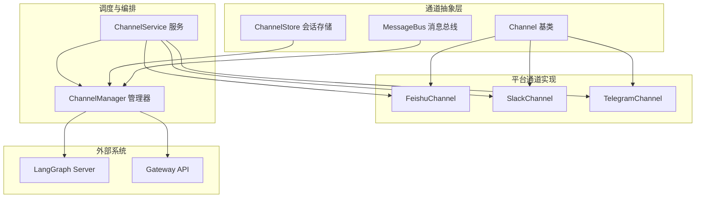
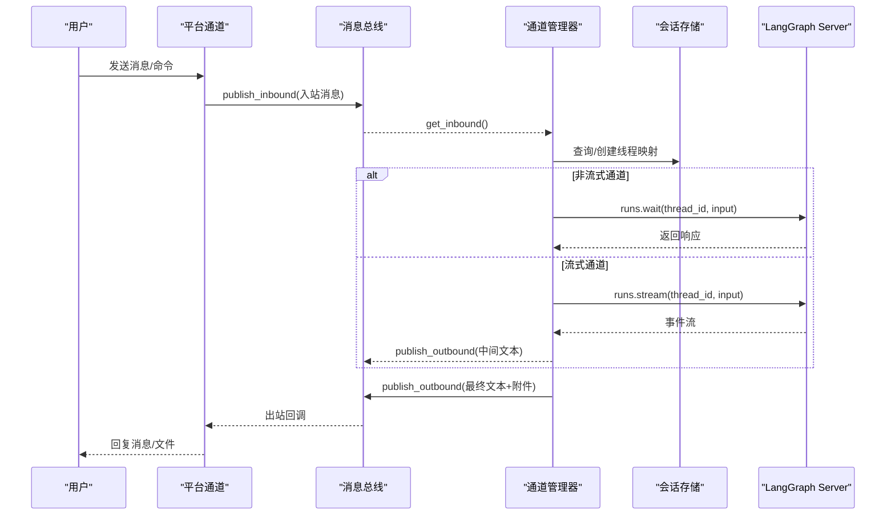
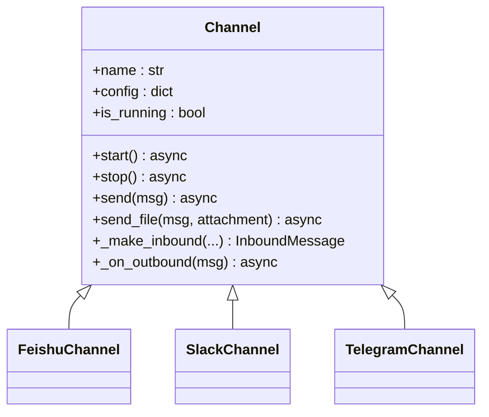
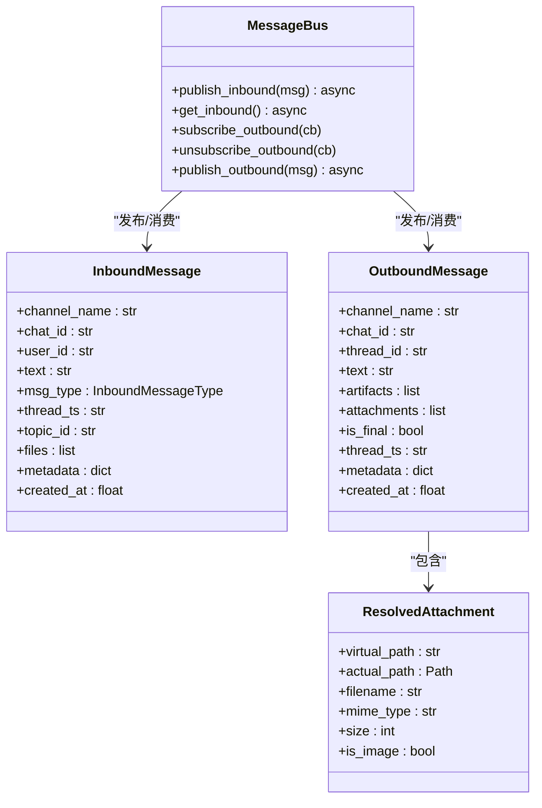
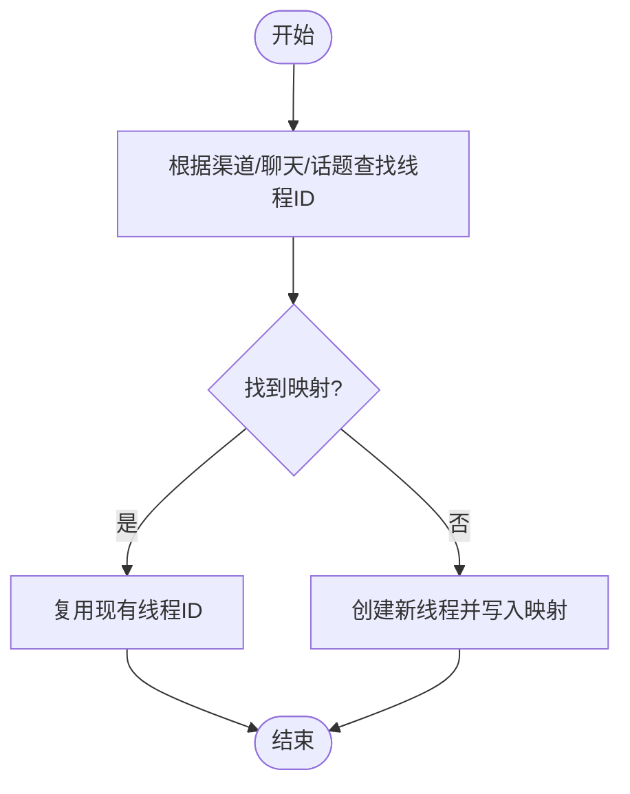
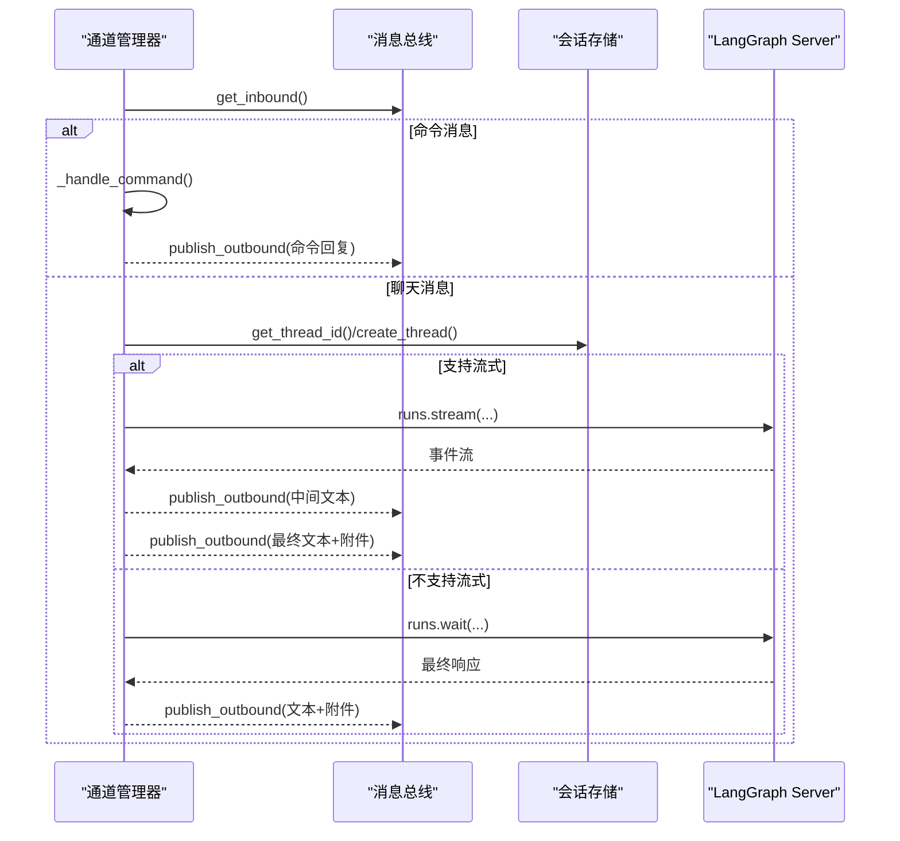
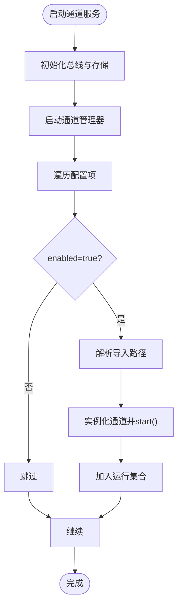
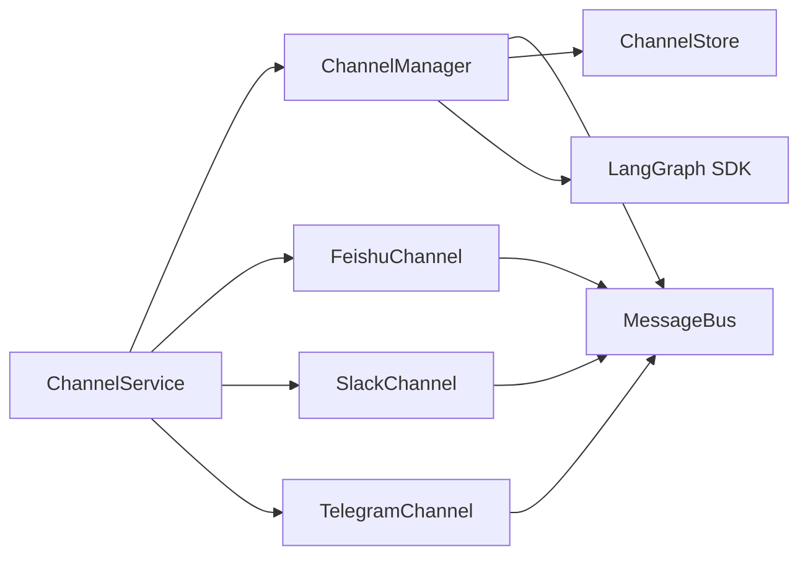

# 通道管理器

<cite>
**本文档引用的文件**
- [backend/app/channels/__init__.py](file://backend/app/channels/__init__.py)
- [backend/app/channels/base.py](file://backend/app/channels/base.py)
- [backend/app/channels/message_bus.py](file://backend/app/channels/message_bus.py)
- [backend/app/channels/store.py](file://backend/app/channels/store.py)
- [backend/app/channels/manager.py](file://backend/app/channels/manager.py)
- [backend/app/channels/service.py](file://backend/app/channels/service.py)
- [backend/app/channels/feishu.py](file://backend/app/channels/feishu.py)
- [backend/app/channels/slack.py](file://backend/app/channels/slack.py)
- [backend/app/channels/telegram.py](file://backend/app/channels/telegram.py)
- [backend/app/gateway/routers/channels.py](file://backend/app/gateway/routers/channels.py)
- [backend/tests/test_channels.py](file://backend/tests/test_channels.py)
</cite>

## 目录
1. [简介](#简介)
2. [项目结构](#项目结构)
3. [核心组件](#核心组件)
4. [架构总览](#架构总览)
5. [详细组件分析](#详细组件分析)
6. [依赖关系分析](#依赖关系分析)
7. [性能考量](#性能考量)
8. [故障排查指南](#故障排查指南)
9. [结论](#结论)
10. [附录](#附录)

## 简介
本文件为 DeerFlow 通道管理器的详细技术文档，聚焦于通道管理器的核心架构设计、消息总线机制与多通道协调策略。文档将深入解释通道注册、生命周期管理、事件分发机制、初始化流程、连接状态监控与错误恢复策略，并给出与智能体系统、会话管理的集成接口与使用示例。

## 项目结构
通道管理器位于后端应用的通道子系统中，采用“抽象基类 + 多平台适配 + 总线解耦 + 服务编排”的分层设计：
- 抽象与通用：定义通道抽象基类、消息模型、消息总线与会话存储
- 平台适配：Feishu、Slack、Telegram 三大通道的具体实现
- 调度与编排：通道服务负责生命周期管理与启动顺序控制；通道管理器负责消息调度、线程映射、LangGraph 交互与流式输出
- 网关集成：提供通道状态查询与重启的 HTTP 接口

图表来源
- [backend/app/channels/base.py:14-109](file://backend/app/channels/base.py#L14-L109)
- [backend/app/channels/message_bus.py:117-174](file://backend/app/channels/message_bus.py#L117-L174)
- [backend/app/channels/store.py:16-154](file://backend/app/channels/store.py#L16-L154)
- [backend/app/channels/feishu.py:17-537](file://backend/app/channels/feishu.py#L17-L537)
- [backend/app/channels/slack.py:19-245](file://backend/app/channels/slack.py#L19-L245)
- [backend/app/channels/telegram.py:16-316](file://backend/app/channels/telegram.py#L16-L316)
- [backend/app/channels/service.py:22-179](file://backend/app/channels/service.py#L22-L179)
- [backend/app/channels/manager.py:317-732](file://backend/app/channels/manager.py#L317-L732)

章节来源
- [backend/app/channels/__init__.py:1-17](file://backend/app/channels/__init__.py#L1-L17)
- [backend/app/channels/base.py:14-109](file://backend/app/channels/base.py#L14-L109)
- [backend/app/channels/message_bus.py:117-174](file://backend/app/channels/message_bus.py#L117-L174)
- [backend/app/channels/store.py:16-154](file://backend/app/channels/store.py#L16-L154)
- [backend/app/channels/feishu.py:17-537](file://backend/app/channels/feishu.py#L17-L537)
- [backend/app/channels/slack.py:19-245](file://backend/app/channels/slack.py#L19-L245)
- [backend/app/channels/telegram.py:16-316](file://backend/app/channels/telegram.py#L16-L316)
- [backend/app/channels/service.py:22-179](file://backend/app/channels/service.py#L22-L179)
- [backend/app/channels/manager.py:317-732](file://backend/app/channels/manager.py#L317-L732)

## 核心组件
- 通道抽象基类（Channel）：统一通道生命周期（start/stop）、出站发送（send/send_file）与入站封装（_make_inbound），并提供总线回调（_on_outbound）用于转发出站消息
- 消息总线（MessageBus）：异步发布/订阅，入站队列与出站监听器列表，支持并发安全的消息分发
- 会话存储（ChannelStore）：基于 JSON 文件的键值映射，持久化 IM 会话到 DeerFlow 线程的对应关系
- 通道管理器（ChannelManager）：消息调度中枢，负责线程创建/复用、LangGraph 运行调用、流式输出、命令处理与错误兜底
- 通道服务（ChannelService）：从应用配置读取通道配置，按序实例化并启动通道，管理全局运行状态与重启能力
- 平台通道实现：Feishu（WebSocket）、Slack（Socket Mode）、Telegram（长轮询），均继承自 Channel 并实现 start/stop/send/send_file

章节来源
- [backend/app/channels/base.py:14-109](file://backend/app/channels/base.py#L14-L109)
- [backend/app/channels/message_bus.py:117-174](file://backend/app/channels/message_bus.py#L117-L174)
- [backend/app/channels/store.py:16-154](file://backend/app/channels/store.py#L16-L154)
- [backend/app/channels/manager.py:317-732](file://backend/app/channels/manager.py#L317-L732)
- [backend/app/channels/service.py:22-179](file://backend/app/channels/service.py#L22-L179)
- [backend/app/channels/feishu.py:17-537](file://backend/app/channels/feishu.py#L17-L537)
- [backend/app/channels/slack.py:19-245](file://backend/app/channels/slack.py#L19-L245)
- [backend/app/channels/telegram.py:16-316](file://backend/app/channels/telegram.py#L16-L316)

## 架构总览
通道管理器通过消息总线解耦各平台通道与调度器，形成“多通道输入、统一调度、LangGraph 执行、通道回传”的闭环。通道服务负责从配置加载与启动顺序控制，通道管理器负责消息处理、线程映射与 LangGraph 交互，平台通道负责解析平台事件并转换为统一消息格式。

图表来源
- [backend/app/channels/message_bus.py:131-174](file://backend/app/channels/message_bus.py#L131-L174)
- [backend/app/channels/manager.py:419-642](file://backend/app/channels/manager.py#L419-L642)
- [backend/app/channels/store.py:82-107](file://backend/app/channels/store.py#L82-L107)
- [backend/app/channels/feishu.py:454-537](file://backend/app/channels/feishu.py#L454-L537)
- [backend/app/channels/slack.py:182-245](file://backend/app/channels/slack.py#L182-L245)
- [backend/app/channels/telegram.py:275-316](file://backend/app/channels/telegram.py#L275-L316)

## 详细组件分析

### 通道抽象与生命周期
- 统一接口：start/stop/send/send_file，确保各平台通道行为一致
- 入站封装：_make_inbound 将平台消息标准化为 InboundMessage，包含渠道名、聊天ID、用户ID、文本、类型、线程标识等
- 出站回调：_on_outbound 仅转发目标通道的消息，先发送文本，再上传附件，失败时避免部分投递

图表来源
- [backend/app/channels/base.py:14-109](file://backend/app/channels/base.py#L14-L109)
- [backend/app/channels/feishu.py:17-537](file://backend/app/channels/feishu.py#L17-L537)
- [backend/app/channels/slack.py:19-245](file://backend/app/channels/slack.py#L19-L245)
- [backend/app/channels/telegram.py:16-316](file://backend/app/channels/telegram.py#L16-L316)

章节来源
- [backend/app/channels/base.py:14-109](file://backend/app/channels/base.py#L14-L109)

### 消息总线与数据模型
- 入站消息：包含渠道名、聊天ID、用户ID、文本、消息类型（聊天/命令）、线程TS、话题ID、文件列表、元数据、时间戳
- 出站消息：包含目标渠道、聊天ID、DeerFlow 线程ID、文本、产物路径列表、是否最终消息、线程TS、元数据、时间戳
- 附件模型：虚拟路径、实际路径、文件名、MIME类型、大小、是否图片
- 总线特性：入站队列阻塞获取、出站监听器广播、异常日志记录

图表来源
- [backend/app/channels/message_bus.py:22-174](file://backend/app/channels/message_bus.py#L22-L174)

章节来源
- [backend/app/channels/message_bus.py:22-174](file://backend/app/channels/message_bus.py#L22-L174)

### 会话存储与线程映射
- 存储结构：以“渠道:聊天ID(:话题ID)”为键，保存线程ID、用户ID、创建/更新时间
- 键生成：支持带话题ID与不带话题ID两种键形式
- 并发安全：写操作使用锁与临时文件原子替换，保证一致性
- 清理策略：支持删除特定键或批量删除同一聊天下的所有键

图表来源
- [backend/app/channels/store.py:82-107](file://backend/app/channels/store.py#L82-L107)

章节来源
- [backend/app/channels/store.py:16-154](file://backend/app/channels/store.py#L16-L154)

### 通道管理器：调度与执行
- 生命周期：start 启动调度循环，stop 停止并取消任务
- 调度循环：从总线入站队列取出消息，按消息类型分派至命令或聊天处理
- 聊天处理：
  - 查找/创建线程映射
  - 解析运行参数（助手ID、运行配置、上下文）
  - 非流式：调用 runs.wait 获取最终响应
  - 流式：runs.stream 持续接收事件，合并增量文本，按最小间隔发布中间结果，最后发布最终结果
- 命令处理：/bootstrap、/new、/status、/models、/memory、/help
- 错误兜底：捕获异常并发布错误消息，避免中断循环

图表来源
- [backend/app/channels/manager.py:419-642](file://backend/app/channels/manager.py#L419-L642)
- [backend/app/channels/store.py:82-107](file://backend/app/channels/store.py#L82-L107)

章节来源
- [backend/app/channels/manager.py:317-732](file://backend/app/channels/manager.py#L317-L732)

### 通道服务：注册与启动
- 配置来源：从应用配置读取 channels 下的各通道配置
- 注册表：feishu、slack、telegram 的延迟导入路径
- 启动顺序：先启动管理器，再逐个启动启用的通道
- 状态查询：返回服务运行状态与各通道启用/运行状态
- 重启能力：支持按名称重启指定通道

图表来源
- [backend/app/channels/service.py:62-93](file://backend/app/channels/service.py#L62-L93)
- [backend/app/channels/service.py:111-134](file://backend/app/channels/service.py#L111-L134)

章节来源
- [backend/app/channels/service.py:22-179](file://backend/app/channels/service.py#L22-L179)

### 平台通道实现要点
- Feishu（WebSocket）：
  - 使用 lark-oapi，专用线程+事件循环，避免与主循环冲突
  - 支持卡片富文本、运行中卡片、反应标记、文件上传（图片/文件）
  - 文本发送重试与失败日志
- Slack（Socket Mode）：
  - 使用 slack-sdk Socket Mode，后台线程运行
  - Markdown 转换、反应标记、文件上传
  - 可配置允许用户白名单
- Telegram（长轮询）：
  - 使用 python-telegram-bot，专用线程+事件循环
  - 私聊/群聊线程上下文区分，回复消息保持线程
  - 文件上传限制与失败重试

章节来源
- [backend/app/channels/feishu.py:17-537](file://backend/app/channels/feishu.py#L17-L537)
- [backend/app/channels/slack.py:19-245](file://backend/app/channels/slack.py#L19-L245)
- [backend/app/channels/telegram.py:16-316](file://backend/app/channels/telegram.py#L16-L316)

### 与智能体系统、会话管理的集成
- 与 LangGraph 的集成：通过 langgraph_sdk 客户端创建线程、等待/流式运行，传递 assistant_id、config、context
- 与 Gateway 的集成：命令 /models、/memory 通过 HTTP 访问 Gateway 获取信息
- 会话覆盖策略：默认会话、通道级会话、用户级会话三层合并，支持助手ID、运行配置、上下文覆盖

章节来源
- [backend/app/channels/manager.py:354-382](file://backend/app/channels/manager.py#L354-L382)
- [backend/app/channels/manager.py:700-720](file://backend/app/channels/manager.py#L700-L720)
- [backend/app/gateway/routers/channels.py:25-52](file://backend/app/gateway/routers/channels.py#L25-L52)

## 依赖关系分析
- 组件内聚：通道抽象、消息模型、总线、存储各自职责清晰
- 组件耦合：通道服务依赖通道抽象与管理器；管理器依赖总线、存储与 LangGraph SDK；平台通道依赖各自 SDK
- 外部依赖：langgraph_sdk、lark-oapi、slack-sdk、python-telegram-bot
- 循环依赖：未见直接循环；平台通道通过总线回调反向依赖通道管理器，属于单向解耦

图表来源
- [backend/app/channels/service.py:22-179](file://backend/app/channels/service.py#L22-L179)
- [backend/app/channels/manager.py:317-732](file://backend/app/channels/manager.py#L317-L732)
- [backend/app/channels/feishu.py:17-537](file://backend/app/channels/feishu.py#L17-L537)
- [backend/app/channels/slack.py:19-245](file://backend/app/channels/slack.py#L19-L245)
- [backend/app/channels/telegram.py:16-316](file://backend/app/channels/telegram.py#L16-L316)

章节来源
- [backend/app/channels/service.py:22-179](file://backend/app/channels/service.py#L22-L179)
- [backend/app/channels/manager.py:317-732](file://backend/app/channels/manager.py#L317-L732)

## 性能考量
- 并发控制：管理器使用信号量限制最大并发，避免对 LangGraph 与平台 API 造成瞬时压力
- 流式输出节流：流式通道最小更新间隔常量，减少频繁出站消息
- 附件安全与降级：仅允许输出目录内的虚拟路径解析为真实文件，失败时保留文本回退
- 重试策略：平台通道发送消息具备指数退避重试，提升弱网络环境下的成功率

章节来源
- [backend/app/channels/manager.py:27-27](file://backend/app/channels/manager.py#L27-L27)
- [backend/app/channels/manager.py:590-593](file://backend/app/channels/manager.py#L590-L593)
- [backend/app/channels/manager.py:241-287](file://backend/app/channels/manager.py#L241-L287)
- [backend/app/channels/feishu.py:181-199](file://backend/app/channels/feishu.py#L181-L199)
- [backend/app/channels/slack.py:92-116](file://backend/app/channels/slack.py#L92-L116)
- [backend/app/channels/telegram.py:109-126](file://backend/app/channels/telegram.py#L109-L126)

## 故障排查指南
- 通道无法启动
  - 检查依赖安装：lark-oapi、slack-sdk、python-telegram-bot
  - 检查配置项：app_id/app_secret、bot_token、app_token 等
  - 查看日志：通道服务与通道实现的异常堆栈
- 消息未送达或部分投递
  - 管理器在文本发送失败时不会尝试上传附件，检查文本发送错误
  - 平台通道发送失败会进行重试，确认重试次数与网络状况
- 线程映射异常
  - 检查会话存储文件是否存在、可写、内容是否被破坏
  - 确认 topic_id 与 thread_ts 的使用是否符合预期（私聊/群聊/回复场景）
- 流式输出不连续
  - 检查最小更新间隔设置与平台事件到达频率
  - 确认中间文本合并逻辑未被上游变更影响

章节来源
- [backend/app/channels/feishu.py:74-76](file://backend/app/channels/feishu.py#L74-L76)
- [backend/app/channels/slack.py:43-45](file://backend/app/channels/slack.py#L43-L45)
- [backend/app/channels/telegram.py:44-47](file://backend/app/channels/telegram.py#L44-L47)
- [backend/app/channels/base.py:96-108](file://backend/app/channels/base.py#L96-L108)
- [backend/app/channels/store.py:48-70](file://backend/app/channels/store.py#L48-L70)

## 结论
通道管理器通过抽象基类、消息总线与服务编排，实现了对多平台 IM 的统一接入与调度。其核心优势在于：
- 强解耦：通道与调度器通过总线通信，便于扩展新通道
- 可靠性：完善的生命周期管理、错误恢复与重试策略
- 可观测性：命令系统、状态接口与日志记录
- 可扩展性：会话覆盖策略支持按通道/用户维度定制运行参数

## 附录

### 使用示例与集成步骤
- 启动通道服务
  - 从应用配置读取 channels 配置，启动 ChannelService
  - 服务将自动启动 ChannelManager，并按 enabled 字段启动已注册通道
- 通道注册与扩展
  - 在注册表中添加新通道的导入路径
  - 实现 Channel 抽象方法并接入消息总线
- 会话与运行参数
  - 通过 default_session、channel_sessions、users 层级合并运行参数
  - 命令 /bootstrap 可触发引导会话
- 网关集成
  - 通过 /api/channels 查询状态，/api/channels/{name}/restart 重启通道

章节来源
- [backend/app/channels/service.py:62-93](file://backend/app/channels/service.py#L62-L93)
- [backend/app/channels/service.py:111-134](file://backend/app/channels/service.py#L111-L134)
- [backend/app/channels/manager.py:645-698](file://backend/app/channels/manager.py#L645-L698)
- [backend/app/gateway/routers/channels.py:25-52](file://backend/app/gateway/routers/channels.py#L25-L52)