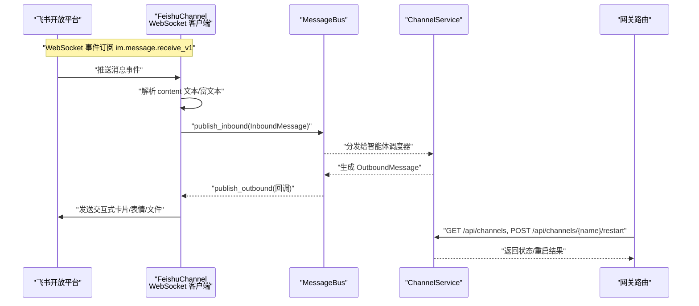
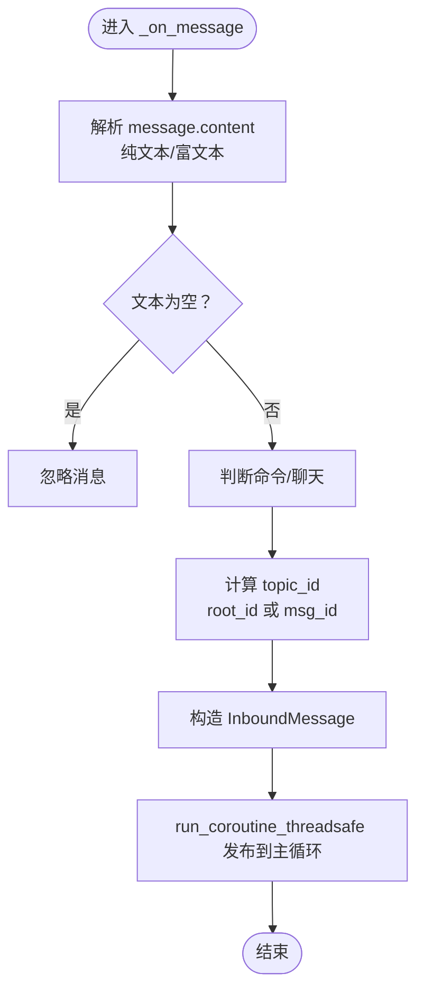
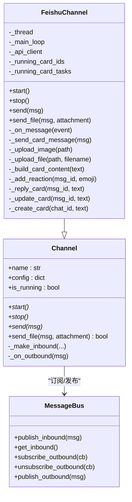
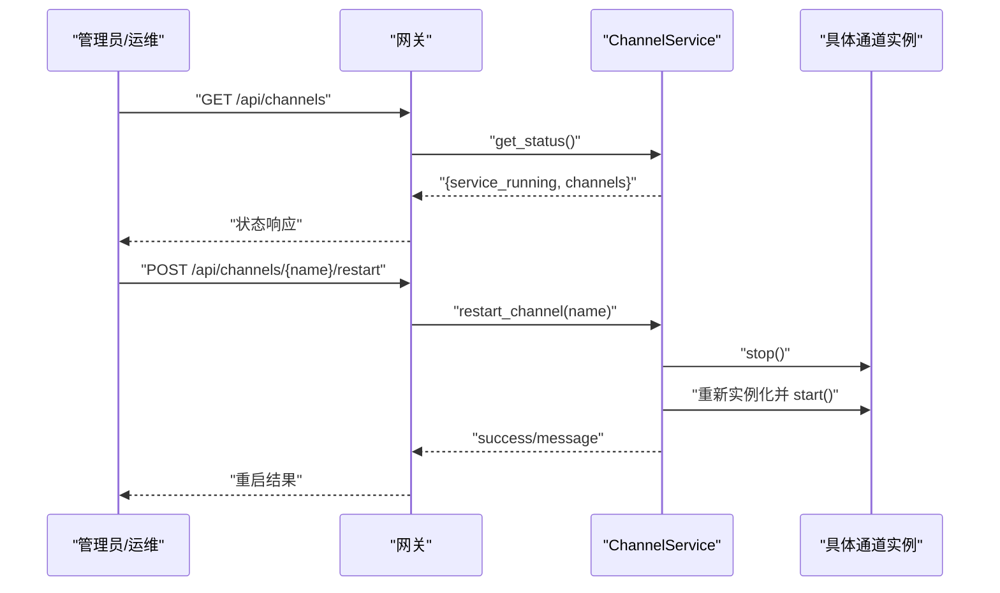
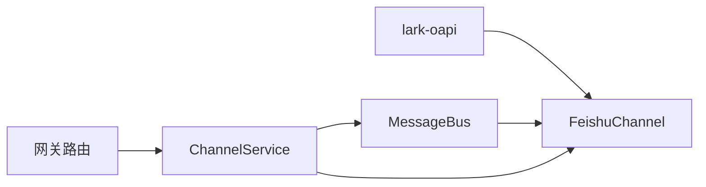

# 飞书集成

<cite>
**本文引用的文件**
- [feishu.py](file://backend/app/channels/feishu.py)
- [base.py](file://backend/app/channels/base.py)
- [message_bus.py](file://backend/app/channels/message_bus.py)
- [service.py](file://backend/app/channels/service.py)
- [channels.py](file://backend/app/gateway/routers/channels.py)
- [test_feishu_parser.py](file://backend/tests/test_feishu_parser.py)
- [test_channels.py](file://backend/tests/test_channels.py)
- [README.md](file://README.md)
- [README_zh.md](file://README_zh.md)
</cite>

## 目录
1. [简介](#简介)
2. [项目结构](#项目结构)
3. [核心组件](#核心组件)
4. [架构总览](#架构总览)
5. [详细组件分析](#详细组件分析)
6. [依赖关系分析](#依赖关系分析)
7. [性能考量](#性能考量)
8. [故障排除指南](#故障排除指南)
9. [结论](#结论)
10. [附录](#附录)

## 简介
本文件面向 DeerFlow 的飞书集成，系统性阐述飞书开放平台的接入实现、WebSocket 连接与消息处理机制、事件订阅配置、消息解析流程、飞书消息格式与事件类型处理、以及与智能体系统的交互模式。同时提供飞书配置示例、部署步骤与常见问题排查方法，帮助开发者快速完成从“应用创建”到“消息流转”的全链路落地。

## 项目结构
飞书通道位于后端通道模块中，采用统一的通道抽象与消息总线解耦设计，配合服务层进行生命周期管理与状态暴露。关键文件与职责如下：
- 通道实现：backend/app/channels/feishu.py
- 通道基类与消息总线：backend/app/channels/base.py、backend/app/channels/message_bus.py
- 通道服务与注册：backend/app/channels/service.py
- 网关路由（通道状态与重启）：backend/app/gateway/routers/channels.py
- 单元测试：backend/tests/test_feishu_parser.py、backend/tests/test_channels.py
- 文档与配置示例：README.md、README_zh.md

```mermaid
graph TB
subgraph "通道层"
F["FeishuChannel<br/>WebSocket 接入与消息处理"]
B["Channel 抽象基类"]
MB["MessageBus<br/>异步发布/订阅"]
end
subgraph "服务层"
S["ChannelService<br/>通道生命周期管理"]
REG["通道注册表<br/>feishu/slack/telegram"]
end
subgraph "网关"
R["/api/channels 路由<br/>状态查询/重启"]
end
subgraph "外部平台"
FS["飞书开放平台<br/>WebSocket 事件流"]
end
F --> MB
B --> F
S --> F
S --> REG
R --> S
F <- --> FS
```

图表来源
- [feishu.py:17-116](file://backend/app/channels/feishu.py#L17-L116)
- [base.py:14-86](file://backend/app/channels/base.py#L14-L86)
- [message_bus.py:117-174](file://backend/app/channels/message_bus.py#L117-L174)
- [service.py:22-150](file://backend/app/channels/service.py#L22-L150)
- [channels.py:25-52](file://backend/app/gateway/routers/channels.py#L25-L52)

章节来源
- [feishu.py:17-116](file://backend/app/channels/feishu.py#L17-L116)
- [base.py:14-86](file://backend/app/channels/base.py#L14-L86)
- [message_bus.py:117-174](file://backend/app/channels/message_bus.py#L117-L174)
- [service.py:22-150](file://backend/app/channels/service.py#L22-L150)
- [channels.py:25-52](file://backend/app/gateway/routers/channels.py#L25-L52)

## 核心组件
- FeishuChannel：基于 lark-oapi 的 WebSocket 客户端，负责接收飞书事件、解析消息内容、向消息总线发布入站消息；同时处理出站消息的卡片渲染、文件上传与表情反馈。
- Channel 抽象基类：定义通道生命周期与消息收发接口，提供通用的入站消息工厂方法。
- MessageBus：异步发布/订阅中枢，连接各通道与智能体调度器，维护入站队列与出站回调列表。
- ChannelService：从应用配置读取通道配置，按需实例化并启动通道，提供通道状态查询与单通道重启能力。
- 网关路由：提供通道状态查询与重启接口，便于运维与自动化控制。

章节来源
- [feishu.py:17-116](file://backend/app/channels/feishu.py#L17-L116)
- [base.py:14-86](file://backend/app/channels/base.py#L14-L86)
- [message_bus.py:117-174](file://backend/app/channels/message_bus.py#L117-L174)
- [service.py:22-150](file://backend/app/channels/service.py#L22-L150)
- [channels.py:25-52](file://backend/app/gateway/routers/channels.py#L25-L52)

## 架构总览
下图展示飞书通道从事件接入到智能体处理再到结果回传的关键路径，以及与消息总线、服务层和网关的关系。



图表来源
- [feishu.py:454-536](file://backend/app/channels/feishu.py#L454-L536)
- [message_bus.py:131-174](file://backend/app/channels/message_bus.py#L131-L174)
- [service.py:62-150](file://backend/app/channels/service.py#L62-L150)
- [channels.py:25-52](file://backend/app/gateway/routers/channels.py#L25-L52)

## 详细组件分析

### 飞书通道（FeishuChannel）
- 初始化与配置
  - 从配置读取 app_id 与 app_secret，校验必填项。
  - 构建 lark 客户端，订阅出站消息回调，启动专用线程与事件循环以避免与主 uvloop 冲突。
- WebSocket 运行机制
  - 在独立线程中替换 SDK 的模块级事件循环引用，构造事件处理器并启动 WebSocket 客户端。
  - 注册事件回调 p2_im_message_receive_v1，接收飞书消息事件。
- 入站消息解析
  - 从事件提取 chat_id、message_id、sender_id、root_id（用于线程话题映射）。
  - 解析 message.content：
    - 纯文本：直接取 text 字段。
    - 富文本：遍历 content 数组，拼接 tag 为 text/at 的元素，保留段落边界。
  - 判断是否为命令：以“/”开头视为 COMMAND，否则为 CHAT。
  - topic_id：回复场景使用 root_id，新对话使用 msg_id。
  - 将解析后的字段封装为 InboundMessage，通过消息总线发布。
- 出站消息发送
  - 发送策略：先尝试更新“运行中卡片”，若失败且非最终消息则跳过；最终消息回退为在原消息内回复卡片。
  - 表情反馈：收到消息即添加 OK 表情；最终回复后添加 DONE 表情。
  - 文件上传：支持图片与多种文档类型，按大小限制与类型映射上传，再以文件/图片消息形式回复。
- 运行中卡片与并发控制
  - 使用字典缓存 source_message_id → running_card_id，避免重复创建。
  - 使用任务集合跟踪运行中卡片创建任务，确保异常可捕获与日志记录。



图表来源
- [feishu.py:454-536](file://backend/app/channels/feishu.py#L454-L536)

章节来源
- [feishu.py:53-116](file://backend/app/channels/feishu.py#L53-L116)
- [feishu.py:118-166](file://backend/app/channels/feishu.py#L118-L166)
- [feishu.py:454-536](file://backend/app/channels/feishu.py#L454-L536)
- [feishu.py:168-281](file://backend/app/channels/feishu.py#L168-L281)

### 通道基类与消息总线
- Channel 抽象基类
  - 定义 start/stop/send 抽象方法，提供 _make_inbound 工厂方法与 _on_outbound 统一出站处理逻辑。
  - 出站流程：先发送文本，再逐个上传附件；文本发送失败时跳过文件上传，保证一致性。
- MessageBus
  - 入站：publish_inbound 将消息入队，get_inbound 阻塞取出。
  - 出站：publish_outbound 广播至所有已注册监听者，异常被统一捕获并记录。



图表来源
- [base.py:14-86](file://backend/app/channels/base.py#L14-L86)
- [message_bus.py:117-174](file://backend/app/channels/message_bus.py#L117-L174)
- [feishu.py:17-116](file://backend/app/channels/feishu.py#L17-L116)

章节来源
- [base.py:14-86](file://backend/app/channels/base.py#L14-L86)
- [message_bus.py:117-174](file://backend/app/channels/message_bus.py#L117-L174)

### 通道服务与网关路由
- ChannelService
  - 从应用配置读取 channels.* 配置，按通道类型注册表动态加载类，实例化并启动。
  - 提供 get_status 查询所有通道的启用/运行状态，支持按名称重启单通道。
- 网关路由
  - GET /api/channels 返回服务运行状态与各通道状态。
  - POST /api/channels/{name}/restart 触发指定通道重启。



图表来源
- [service.py:136-150](file://backend/app/channels/service.py#L136-L150)
- [channels.py:25-52](file://backend/app/gateway/routers/channels.py#L25-L52)

章节来源
- [service.py:22-150](file://backend/app/channels/service.py#L22-L150)
- [channels.py:25-52](file://backend/app/gateway/routers/channels.py#L25-L52)

### 飞书消息格式与事件类型处理
- 事件订阅
  - 飞书开放平台事件订阅需订阅 im.message.receive_v1，并选择“长连接”模式。
- 消息内容解析
  - 纯文本：content.text。
  - 富文本：content.content 为段落数组，每段为元素数组，仅拼接 tag 为 text/at 的元素，段间以空行分隔。
- 命令识别
  - 以“/”开头的消息视为命令，其余为普通聊天消息。
- 线程话题映射
  - 回复消息使用 root_id 作为 topic_id，新消息使用 msg_id。

章节来源
- [feishu.py:467-516](file://backend/app/channels/feishu.py#L467-L516)
- [README_zh.md:300-306](file://README_zh.md#L300-L306)

### 与智能体系统的交互模式
- 入站：FeishuChannel 将解析后的 InboundMessage 通过消息总线发布，交由智能体调度器处理。
- 出站：消息总线回调通道的 send/send_file，通道以交互式卡片、表情与文件形式回传。
- 流式输出：通道优先更新“运行中卡片”，最终消息完成后添加 DONE 表情，确保用户体验连续性。

章节来源
- [feishu.py:87-109](file://backend/app/channels/feishu.py#L87-L109)
- [message_bus.py:160-174](file://backend/app/channels/message_bus.py#L160-L174)

## 依赖关系分析
- 外部依赖
  - lark-oapi：飞书 WebSocket 客户端与 API 调用。
- 内部依赖
  - Channel 抽象基类 → FeishuChannel 实现。
  - MessageBus → Channel 与智能体调度器之间的桥接。
  - ChannelService → ChannelManager/Store/MessageBus，负责通道生命周期与状态。
  - 网关路由 → ChannelService，提供运维接口。



图表来源
- [feishu.py:57-91](file://backend/app/channels/feishu.py#L57-L91)
- [service.py:29-44](file://backend/app/channels/service.py#L29-L44)
- [channels.py:25-52](file://backend/app/gateway/routers/channels.py#L25-L52)

章节来源
- [feishu.py:57-91](file://backend/app/channels/feishu.py#L57-L91)
- [service.py:29-44](file://backend/app/channels/service.py#L29-L44)
- [channels.py:25-52](file://backend/app/gateway/routers/channels.py#L25-L52)

## 性能考量
- 事件循环隔离：在独立线程中替换 SDK 的模块级事件循环，避免与主 uvloop 冲突，提升稳定性。
- 运行中卡片去重：通过字典缓存与任务集合避免重复创建，降低 API 调用与网络开销。
- 重试与幂等：发送卡片消息具备指数退避重试，最终消息失败时回退为回复卡片，保证一致性。
- 文件上传限制：对图片与文件大小进行限制，避免超限请求导致失败与资源浪费。

章节来源
- [feishu.py:118-166](file://backend/app/channels/feishu.py#L118-L166)
- [feishu.py:168-200](file://backend/app/channels/feishu.py#L168-L200)
- [feishu.py:201-264](file://backend/app/channels/feishu.py#L201-L264)

## 故障排除指南
- 缺少 lark-oapi
  - 现象：启动时报错提示未安装 lark-oapi。
  - 处理：按照错误提示安装 lark-oapi。
  - 参考：[feishu.py:74-76](file://backend/app/channels/feishu.py#L74-L76)
- 未配置 app_id/app_secret
  - 现象：启动时记录错误并退出。
  - 处理：在 config.yaml 的 channels.feishu 下填写 app_id 与 app_secret，并在 .env 设置对应环境变量。
  - 参考：[feishu.py:96-98](file://backend/app/channels/feishu.py#L96-L98)、[README_zh.md:282-285](file://README_zh.md#L282-L285)
- WebSocket 启动异常
  - 现象：记录 Feishu WebSocket error。
  - 处理：检查飞书事件订阅配置（im.message.receive_v1）、长连接模式、网络可达性与防火墙设置。
  - 参考：[feishu.py:150-152](file://backend/app/channels/feishu.py#L150-L152)、[README_zh.md:304-305](file://README_zh.md#L304-L305)
- 主循环未运行
  - 现象：无法发布入站消息，记录警告。
  - 处理：确认服务已正确启动，主事件循环处于运行状态。
  - 参考：[feishu.py:533-534](file://backend/app/channels/feishu.py#L533-L534)
- 文件上传失败
  - 现象：图片/文件过大或上传接口失败。
  - 处理：检查大小限制与文件类型映射，查看日志中的错误码与错误信息。
  - 参考：[feishu.py:205-211](file://backend/app/channels/feishu.py#L205-L211)、[feishu.py:242-243](file://backend/app/channels/feishu.py#L242-L243)、[feishu.py:263-264](file://backend/app/channels/feishu.py#L263-L264)
- 通道状态与重启
  - 现象：需要查看通道状态或重启特定通道。
  - 处理：调用 /api/channels 获取状态；调用 /api/channels/{name}/restart 触发重启。
  - 参考：[channels.py:25-52](file://backend/app/gateway/routers/channels.py#L25-L52)、[service.py:95-109](file://backend/app/channels/service.py#L95-L109)

章节来源
- [feishu.py:74-76](file://backend/app/channels/feishu.py#L74-L76)
- [feishu.py:96-98](file://backend/app/channels/feishu.py#L96-L98)
- [feishu.py:150-152](file://backend/app/channels/feishu.py#L150-L152)
- [feishu.py:533-534](file://backend/app/channels/feishu.py#L533-L534)
- [feishu.py:205-211](file://backend/app/channels/feishu.py#L205-L211)
- [feishu.py:242-243](file://backend/app/channels/feishu.py#L242-L243)
- [feishu.py:263-264](file://backend/app/channels/feishu.py#L263-L264)
- [channels.py:25-52](file://backend/app/gateway/routers/channels.py#L25-L52)
- [service.py:95-109](file://backend/app/channels/service.py#L95-L109)

## 结论
飞书集成通过 WebSocket 与消息总线实现低耦合、高可靠的消息流转，结合运行中卡片与表情反馈优化用户体验。通道服务与网关路由提供了完善的运维能力，配合清晰的配置与事件订阅指引，可快速完成从“应用创建”到“消息处理”的端到端落地。

## 附录

### 飞书配置示例
- config.yaml 示例（节选）
  - channels.feishu.enabled: true
  - channels.feishu.app_id: $FEISHU_APP_ID
  - channels.feishu.app_secret: $FEISHU_APP_SECRET
- .env 示例（节选）
  - FEISHU_APP_ID=cli_xxxx
  - FEISHU_APP_SECRET=your_app_secret

章节来源
- [README_zh.md:241-285](file://README_zh.md#L241-L285)

### 部署步骤
- Docker（推荐）
  - make docker-init（仅首次或镜像更新时）
  - make docker-start（自动检测沙箱模式）
- 本地开发
  - make check（前置条件检查）
  - make install（安装依赖）
  - make dev（启动服务）

章节来源
- [README.md:196-254](file://README.md#L196-L254)

### 飞书事件订阅与权限
- 事件订阅：im.message.receive_v1（长连接）
- 权限：im:message、im:message.p2p_msg:readonly、im:resource

章节来源
- [README_zh.md:300-306](file://README_zh.md#L300-L306)

### 单元测试要点
- 测试纯文本与富文本解析：验证 content.text 与 content.content 的拼接逻辑。
- 测试运行中卡片与并发行为：验证 _prepare_inbound 不等待运行中卡片创建即可发布入站消息，且后续任务异常可被记录。

章节来源
- [test_feishu_parser.py:10-71](file://backend/tests/test_feishu_parser.py#L10-L71)
- [test_channels.py:1453-1488](file://backend/tests/test_channels.py#L1453-L1488)
- [test_channels.py:1529-1570](file://backend/tests/test_channels.py#L1529-L1570)