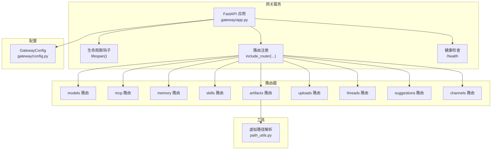
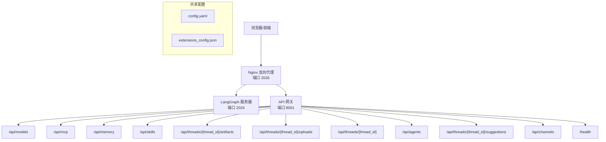
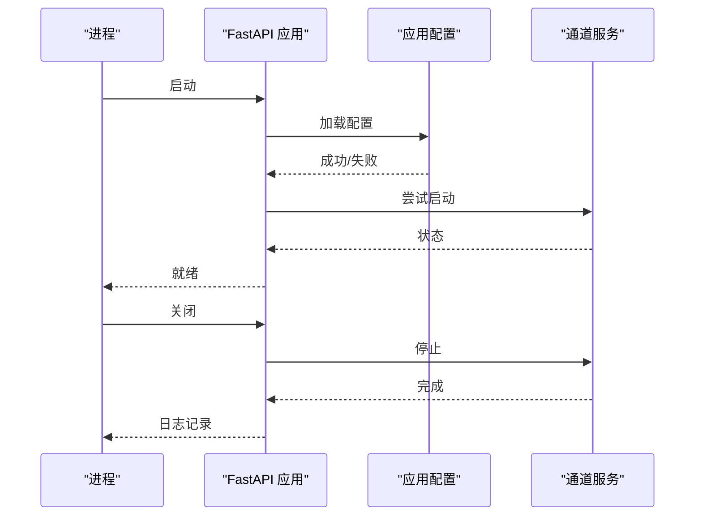
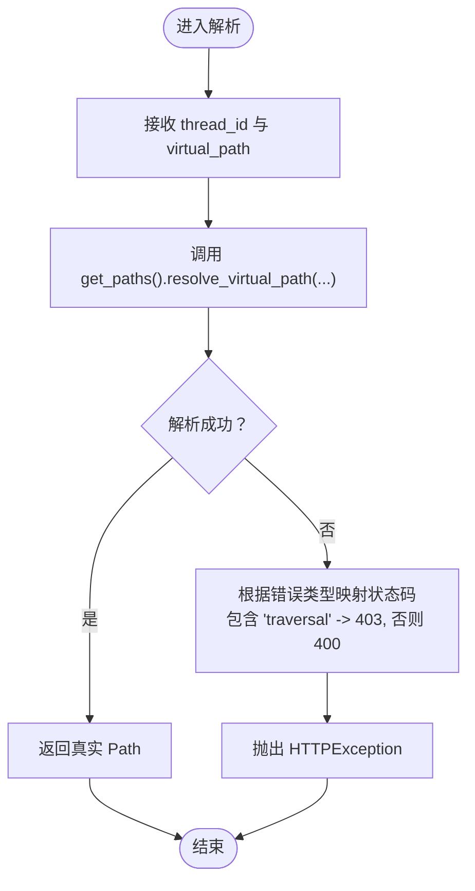
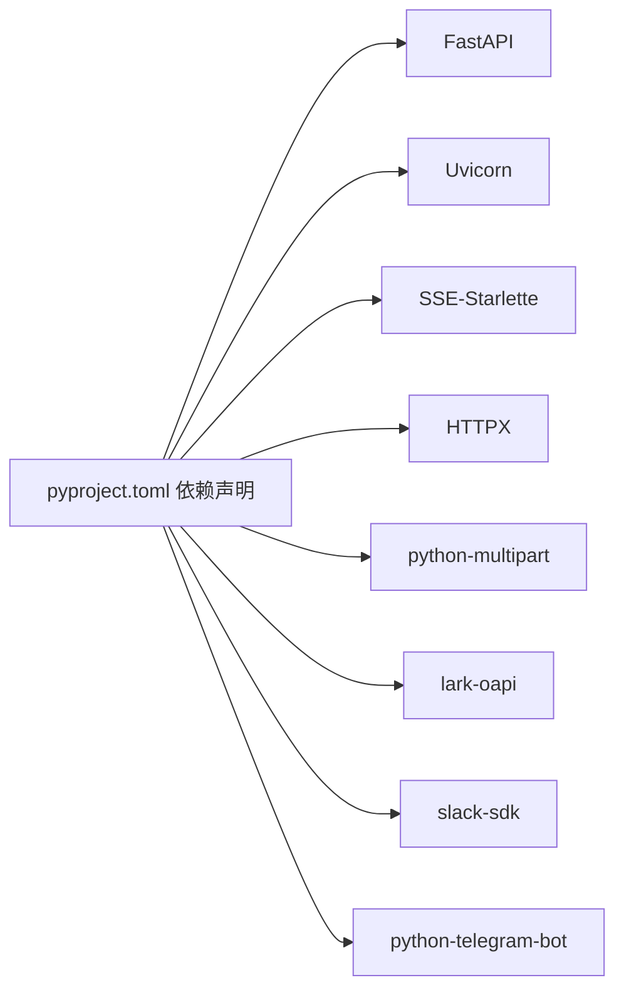

# API 网关

<cite>
**本文引用的文件**
- [backend/app/gateway/app.py](file://backend/app/gateway/app.py)
- [backend/app/gateway/config.py](file://backend/app/gateway/config.py)
- [backend/app/gateway/path_utils.py](file://backend/app/gateway/path_utils.py)
- [backend/app/gateway/__init__.py](file://backend/app/gateway/__init__.py)
- [backend/app/gateway/routers/__init__.py](file://backend/app/gateway/routers/__init__.py)
- [backend/packages/harness/deerflow/client.py](file://backend/packages/harness/deerflow/client.py)
- [backend/pyproject.toml](file://backend/pyproject.toml)
- [backend/docs/ARCHITECTURE.md](file://backend/docs/ARCHITECTURE.md)
- [frontend/src/core/mcp/api.ts](file://frontend/src/core/mcp/api.ts)
</cite>

## 目录
1. [简介](#简介)
2. [项目结构](#项目结构)
3. [核心组件](#核心组件)
4. [架构总览](#架构总览)
5. [详细组件分析](#详细组件分析)
6. [依赖分析](#依赖分析)
7. [性能考虑](#性能考虑)
8. [故障排查指南](#故障排查指南)
9. [结论](#结论)
10. [附录](#附录)

## 简介
本文件为 DeerFlow API 网关的技术文档，基于 FastAPI 构建，作为统一入口处理模型管理、MCP 配置、内存管理、技能管理、产物与上传访问、线程清理、建议生成、通道集成等 API 请求。文档覆盖应用生命周期管理（启动/关闭）、健康检查、CORS 配置、中间件集成与错误处理策略，并提供路由组织结构说明与最佳实践。

## 项目结构
网关位于后端子项目中，采用“按功能域分层”的组织方式：
- 应用入口与生命周期：gateway/app.py
- 配置模型与加载：gateway/config.py
- 路由器聚合：gateway/routers/__init__.py
- 虚拟路径解析工具：gateway/path_utils.py
- 包导出：gateway/__init__.py
- 外部依赖与运行时：pyproject.toml
- 架构与部署说明：docs/ARCHITECTURE.md
- 前端调用示例：frontend/src/core/mcp/api.ts

图表来源
- [backend/app/gateway/app.py:73-196](file://backend/app/gateway/app.py#L73-L196)
- [backend/app/gateway/config.py:6-27](file://backend/app/gateway/config.py#L6-L27)
- [backend/app/gateway/routers/__init__.py:1-3](file://backend/app/gateway/routers/__init__.py#L1-L3)
- [backend/app/gateway/path_utils.py:10-28](file://backend/app/gateway/path_utils.py#L10-L28)

章节来源
- [backend/app/gateway/app.py:1-201](file://backend/app/gateway/app.py#L1-L201)
- [backend/app/gateway/config.py:1-28](file://backend/app/gateway/config.py#L1-L28)
- [backend/app/gateway/routers/__init__.py:1-3](file://backend/app/gateway/routers/__init__.py#L1-L3)
- [backend/app/gateway/path_utils.py:1-29](file://backend/app/gateway/path_utils.py#L1-L29)

## 核心组件
- 应用工厂与生命周期
  - 工厂函数负责创建 FastAPI 实例并挂载所有路由器；生命周期钩子在启动时加载应用配置、尝试启动即时通讯通道服务，在关闭时优雅停止。
  - 健康检查端点提供服务状态信息。
- 配置系统
  - GatewayConfig 提供主机、端口、CORS 允许源等参数，默认值来自环境变量。
- 路由器聚合
  - 路由器按功能域划分，统一通过聚合导出，便于集中注册。
- 虚拟路径解析
  - 将沙箱内虚拟路径解析到线程用户数据目录的真实路径，并进行安全校验与异常转换。

章节来源
- [backend/app/gateway/app.py:32-71](file://backend/app/gateway/app.py#L32-L71)
- [backend/app/gateway/app.py:73-196](file://backend/app/gateway/app.py#L73-L196)
- [backend/app/gateway/config.py:6-27](file://backend/app/gateway/config.py#L6-L27)
- [backend/app/gateway/routers/__init__.py:1-3](file://backend/app/gateway/routers/__init__.py#L1-L3)
- [backend/app/gateway/path_utils.py:10-28](file://backend/app/gateway/path_utils.py#L10-L28)

## 架构总览
网关作为统一入口，与前端、Nginx 反向代理、LangGraph 服务器协同工作。Nginx 将 /api/langgraph/* 转发至 LangGraph 服务器，/api/* 转发至网关。网关内部按模块组织路由，提供模型、MCP、内存、技能、产物、上传、线程、建议、通道等接口，并内置健康检查。

图表来源
- [backend/docs/ARCHITECTURE.md:5-50](file://backend/docs/ARCHITECTURE.md#L5-L50)
- [backend/app/gateway/app.py:156-196](file://backend/app/gateway/app.py#L156-L196)

章节来源
- [backend/docs/ARCHITECTURE.md:5-50](file://backend/docs/ARCHITECTURE.md#L5-L50)
- [backend/app/gateway/app.py:156-196](file://backend/app/gateway/app.py#L156-L196)

## 详细组件分析

### 应用生命周期与健康检查
- 启动阶段
  - 加载应用配置并记录日志；尝试启动即时通讯通道服务（若已配置）。
- 关闭阶段
  - 优雅停止通道服务并记录日志。
- 健康检查
  - 提供 /health 端点返回服务状态。

图表来源
- [backend/app/gateway/app.py:32-71](file://backend/app/gateway/app.py#L32-L71)

章节来源
- [backend/app/gateway/app.py:32-71](file://backend/app/gateway/app.py#L32-L71)
- [backend/app/gateway/app.py:187-195](file://backend/app/gateway/app.py#L187-L195)

### 路由组织与模块职责
- 模型管理（/api/models）
  - 查询可用模型及其配置。
- MCP 配置（/api/mcp）
  - 获取与更新 MCP 服务器配置。
- 内存管理（/api/memory）
  - 获取全局记忆配置与数据。
- 技能管理（/api/skills）
  - 列表查询、启用/禁用与安装技能。
- 产物访问（/api/threads/{thread_id}/artifacts）
  - 访问线程生成的产物与文件。
- 文件上传（/api/threads/{thread_id}/uploads）
  - 上传本地文件到线程上传目录。
- 线程清理（/api/threads/{thread_id}）
  - 清理线程本地文件系统数据。
- 建议生成（/api/threads/{thread_id}/suggestions）
  - 生成后续问题建议。
- 通道集成（/api/channels）
  - 管理即时通讯渠道（飞书、Slack、Telegram）。
- 健康检查（/health）
  - 返回服务健康状态。

章节来源
- [backend/app/gateway/app.py:156-185](file://backend/app/gateway/app.py#L156-L185)
- [backend/app/gateway/app.py:187-195](file://backend/app/gateway/app.py#L187-L195)

### 虚拟路径解析与安全
- 功能
  - 将沙箱内虚拟路径解析为线程用户数据目录下的真实路径。
  - 对越权或非法路径抛出 HTTP 异常（403/400）。
- 安全
  - 防止路径遍历攻击；异常映射到合适的 HTTP 状态码。

图表来源
- [backend/app/gateway/path_utils.py:10-28](file://backend/app/gateway/path_utils.py#L10-L28)

章节来源
- [backend/app/gateway/path_utils.py:10-28](file://backend/app/gateway/path_utils.py#L10-L28)

### 前端集成示例（MCP 配置）
- 前端通过基础地址拼接 /api/mcp/config 进行读取与更新。
- 示例请求：
  - GET /api/mcp/config
  - PUT /api/mcp/config（JSON 正文）

章节来源
- [frontend/src/core/mcp/api.ts:5-20](file://frontend/src/core/mcp/api.ts#L5-L20)

## 依赖分析
- 运行时依赖
  - FastAPI、Uvicorn、SSE-Starlette、HTTPX、多部分上传支持等。
- 第三方 SDK
  - 飞书、Slack、Telegram SDK 用于通道集成。
- 组件耦合
  - 网关应用与路由器松耦合，通过 include_router 注册；生命周期钩子仅依赖配置与通道服务。
  - 虚拟路径解析依赖共享路径配置模块。

图表来源
- [backend/pyproject.toml:7-19](file://backend/pyproject.toml#L7-L19)

章节来源
- [backend/pyproject.toml:1-29](file://backend/pyproject.toml#L1-L29)

## 性能考虑
- 缓存策略
  - MCP 工具基于文件修改时间失效；配置文件变更时自动重载；技能在启动时解析并缓存。
- 流式传输
  - 使用 SSE 提升首 Token 时间与长任务进度可见性。
- 上下文管理
  - 在接近上下文限制时使用摘要中间件降低开销，保留近期消息并摘要历史。

章节来源
- [backend/docs/ARCHITECTURE.md:466-484](file://backend/docs/ARCHITECTURE.md#L466-L484)

## 故障排查指南
- 启动失败
  - 检查应用配置加载是否成功；查看启动日志中的异常堆栈。
  - 若通道服务未配置或启动失败，不影响网关其他功能，但会记录异常日志。
- 路径访问异常
  - 虚拟路径解析失败通常由路径遍历或越权导致；确认 virtual_path 是否位于允许范围。
- 健康检查
  - /health 返回 healthy 表示服务就绪；若不健康，检查最近日志与依赖服务状态。

章节来源
- [backend/app/gateway/app.py:36-43](file://backend/app/gateway/app.py#L36-L43)
- [backend/app/gateway/app.py:52-69](file://backend/app/gateway/app.py#L52-L69)
- [backend/app/gateway/path_utils.py:24-28](file://backend/app/gateway/path_utils.py#L24-L28)
- [backend/app/gateway/app.py:187-195](file://backend/app/gateway/app.py#L187-L195)

## 结论
DeerFlow API 网关以 FastAPI 为基础，采用清晰的功能域路由与生命周期管理，结合虚拟路径解析与健康检查机制，为前端与 LangGraph 服务器提供稳定、可扩展的统一入口。通过合理的缓存与流式传输策略，兼顾性能与可观测性；通过明确的错误处理与日志记录，提升可维护性与可诊断性。

## 附录
- 最佳实践
  - 明确区分网关与 LangGraph 服务器职责：网关负责配置与文件/产物访问，LangGraph 负责推理与流式输出。
  - 使用 /health 作为探活端点；在 Nginx 中统一转发 /api/* 到网关。
  - 严格控制虚拟路径访问，避免路径遍历风险。
  - 在生产环境设置 CORS_ORIGINS、GATEWAY_HOST、GATEWAY_PORT 等环境变量。
  - 对上传与产物访问进行权限与大小限制，必要时引入速率限制与配额控制。