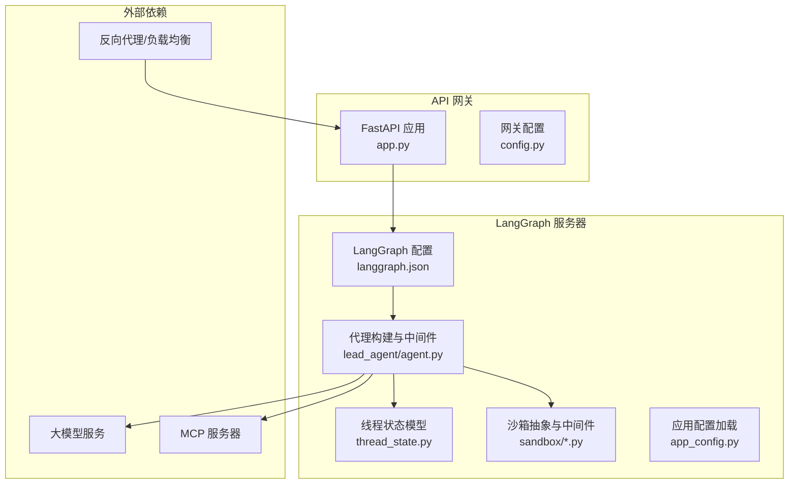
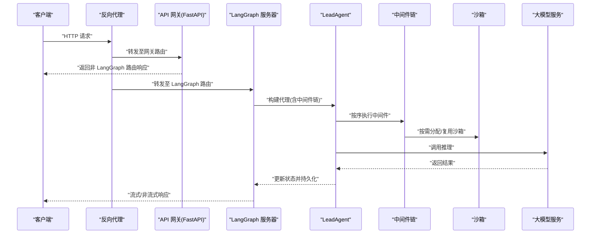
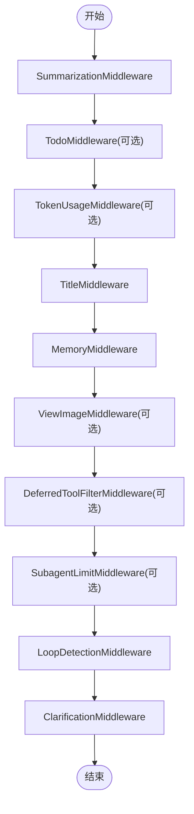
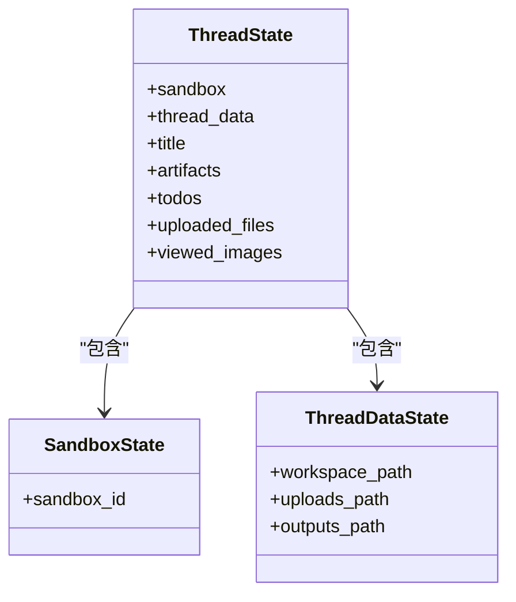
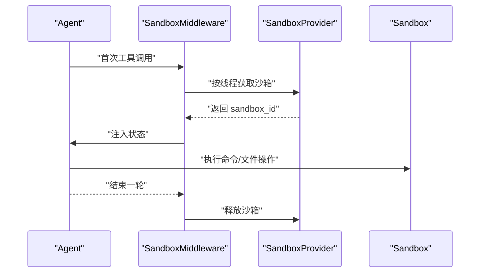
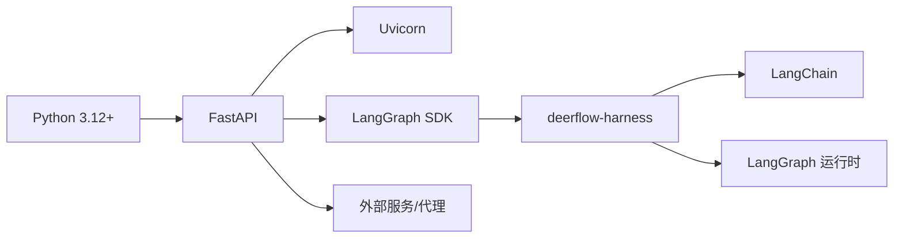

# LangGraph 服务器

<cite>
**本文引用的文件**
- [langgraph.json](file://backend/langgraph.json)
- [pyproject.toml](file://backend/pyproject.toml)
- [app.py](file://backend/app/gateway/app.py)
- [config.py](file://backend/app/gateway/config.py)
- [app_config.py](file://backend/packages/harness/deerflow/config/app_config.py)
- [agent.py](file://backend/packages/harness/deerflow/agents/lead_agent/agent.py)
- [thread_state.py](file://backend/packages/harness/deerflow/agents/thread_state.py)
- [sandbox.py](file://backend/packages/harness/deerflow/sandbox/sandbox.py)
- [middleware.py](file://backend/packages/harness/deerflow/sandbox/middleware.py)
- [sandbox_config.py](file://backend/packages/harness/deerflow/config/sandbox_config.py)
- [config.example.yaml](file://config.example.yaml)
</cite>

## 目录
1. [简介](#简介)
2. [项目结构](#项目结构)
3. [核心组件](#核心组件)
4. [架构总览](#架构总览)
5. [详细组件分析](#详细组件分析)
6. [依赖分析](#依赖分析)
7. [性能考虑](#性能考虑)
8. [故障排查指南](#故障排查指南)
9. [结论](#结论)
10. [附录](#附录)

## 简介
本文件面向 DeerFlow LangGraph 服务器，系统性阐述其在整体架构中的定位、与 API 网关的协作关系、配置文件结构、服务器启动流程、代理执行机制与状态管理，并覆盖中间件链执行、沙箱集成与并发控制等关键主题。文档同时提供服务器配置示例与性能优化建议，帮助读者快速理解并高效部署。

## 项目结构
从仓库结构可见，后端包含两部分：
- API 网关：基于 FastAPI 提供模型、MCP、技能、记忆、工件、上传、线程、代理、建议、通道等接口，负责对外服务与健康检查。
- LangGraph 服务器：通过 langgraph.json 指定图入口与检查点器，由 harness 包提供代理构建、中间件链、沙箱与工具生态等能力。

图表来源
- [app.py:73-196](file://backend/app/gateway/app.py#L73-L196)
- [config.py:17-27](file://backend/app/gateway/config.py#L17-L27)
- [langgraph.json:1-15](file://backend/langgraph.json#L1-L15)
- [agent.py:268-344](file://backend/packages/harness/deerflow/agents/lead_agent/agent.py#L268-L344)
- [thread_state.py:48-56](file://backend/packages/harness/deerflow/agents/thread_state.py#L48-L56)
- [sandbox.py:4-73](file://backend/packages/harness/deerflow/sandbox/sandbox.py#L4-L73)
- [middleware.py:21-84](file://backend/packages/harness/deerflow/sandbox/middleware.py#L21-L84)

章节来源
- [app.py:73-196](file://backend/app/gateway/app.py#L73-L196)
- [config.py:17-27](file://backend/app/gateway/config.py#L17-L27)
- [langgraph.json:1-15](file://backend/langgraph.json#L1-L15)

## 核心组件
- LangGraph 图与入口
  - 通过 langgraph.json 声明 Python 版本、依赖路径、环境变量文件以及图入口函数与检查点器路径，确保服务器启动时可解析到 lead_agent 的构建工厂与异步检查点器。
- 应用配置加载
  - 通过 app_config.py 提供统一的配置解析、环境变量替换、版本校验与缓存重载机制，支持从默认路径或环境变量指定路径加载 config.yaml。
- 代理与中间件链
  - lead_agent/agent.py 负责根据运行时参数与全局配置动态装配代理、工具集与中间件链；中间件顺序严格控制以保证上下文注入、图像处理、计划模式、记忆更新、循环检测与错误处理等逻辑正确性。
- 线程状态与持久化
  - thread_state.py 定义 ThreadState 结构，包含标题、待办、工件列表、已查看图片等字段，并提供合并策略；LangGraph 检查点器用于跨轮次状态持久化。
- 沙箱与并发控制
  - sandbox.py 抽象沙箱接口；sandbox 中间件在首次工具调用时按线程惰性分配沙箱，复用多轮对话，避免频繁创建销毁；sandbox_config.py 描述容器化沙箱的镜像、端口、副本数、挂载与环境变量等参数。

章节来源
- [langgraph.json:1-15](file://backend/langgraph.json#L1-L15)
- [app_config.py:45-131](file://backend/packages/harness/deerflow/config/app_config.py#L45-L131)
- [agent.py:208-265](file://backend/packages/harness/deerflow/agents/lead_agent/agent.py#L208-L265)
- [thread_state.py:48-56](file://backend/packages/harness/deerflow/agents/thread_state.py#L48-L56)
- [sandbox.py:4-73](file://backend/packages/harness/deerflow/sandbox/sandbox.py#L4-L73)
- [middleware.py:21-84](file://backend/packages/harness/deerflow/sandbox/middleware.py#L21-L84)
- [sandbox_config.py:12-61](file://backend/packages/harness/deerflow/config/sandbox_config.py#L12-L61)

## 架构总览
LangGraph 服务器在整体架构中承担“智能体执行引擎”角色，接收来自 API 网关的路由转发（通过反向代理），完成代理构建、中间件链执行、工具调用与状态持久化。API 网关提供模型、MCP、技能、记忆、工件、上传、线程、代理、建议、通道等通用接口，LangGraph 服务器专注于对话与任务执行。

图表来源
- [app.py:73-196](file://backend/app/gateway/app.py#L73-L196)
- [agent.py:268-344](file://backend/packages/harness/deerflow/agents/lead_agent/agent.py#L268-L344)
- [middleware.py:21-84](file://backend/packages/harness/deerflow/sandbox/middleware.py#L21-L84)

## 详细组件分析

### 组件一：LangGraph 服务器启动与路由
- 启动流程
  - API 网关通过 lifespan 在启动阶段加载应用配置并记录日志；LangGraph 服务器由独立进程运行并通过反向代理暴露端口。
  - 反向代理将特定路由转发给 LangGraph 服务器，其余路由由网关直接处理。
- 路由与标签
  - 网关定义了模型、MCP、记忆、技能、工件、上传、线程、代理、建议、通道等标签与路由前缀，便于统一管理与文档生成。

章节来源
- [app.py:32-71](file://backend/app/gateway/app.py#L32-L71)
- [app.py:156-196](file://backend/app/gateway/app.py#L156-L196)

### 组件二：配置文件结构与加载
- 配置文件结构
  - config.example.yaml 提供完整的配置模板，包括模型、工具组、工具、沙箱、子代理、ACP 代理、技能、标题生成、摘要、记忆、检查点、IM 通道、守卫等模块。
  - 关键字段如 models、tools、tool_groups、sandbox、skills、title、summarization、memory、checkpointer、channels、guardrails 等均有明确用途与示例。
- 加载与缓存
  - app_config.py 支持从当前目录或父目录查找 config.yaml，允许通过环境变量覆盖路径；内置配置版本校验与过期提示；提供环境变量解析、缓存与自动重载能力。

章节来源
- [config.example.yaml:1-624](file://config.example.yaml#L1-L624)
- [app_config.py:45-131](file://backend/packages/harness/deerflow/config/app_config.py#L45-L131)
- [app_config.py:263-288](file://backend/packages/harness/deerflow/config/app_config.py#L263-L288)

### 组件三：代理执行机制与中间件链
- 代理构建
  - lead_agent/agent.py 根据运行时参数（如是否启用思考、推理强度、模型名、计划模式、子代理并发限制等）解析最终模型名，并注入运行元数据。
  - 工具集按模型能力与分组筛选，系统提示词根据 agent 名称与功能动态拼装。
- 中间件链顺序
  - 中间件顺序严格控制：摘要中间件、计划模式中间件、令牌用量中间件、标题中间件、记忆中间件、图像查看中间件、延迟工具过滤中间件、子代理并发限制中间件、循环检测中间件、澄清中间件。
  - 该顺序确保上下文压缩、任务管理、记忆注入、图像信息前置、工具发现与安全控制等逻辑正确执行。

图表来源
- [agent.py:208-265](file://backend/packages/harness/deerflow/agents/lead_agent/agent.py#L208-L265)

章节来源
- [agent.py:268-344](file://backend/packages/harness/deerflow/agents/lead_agent/agent.py#L268-L344)

### 组件四：状态管理与持久化
- 状态模型
  - ThreadState 扩展自 AgentState，包含沙箱、线程数据、标题、工件列表、待办、上传文件、已查看图片等字段；提供合并策略以去重与覆盖。
- 检查点器
  - langgraph.json 指定异步检查点器路径，配合 LangGraph 运行时实现跨轮次状态持久化；app_config.py 中也支持独立的检查点器配置（不影响 LangGraph 服务器内部状态）。

图表来源
- [thread_state.py:48-56](file://backend/packages/harness/deerflow/agents/thread_state.py#L48-L56)

章节来源
- [thread_state.py:48-56](file://backend/packages/harness/deerflow/agents/thread_state.py#L48-L56)
- [langgraph.json:11-13](file://backend/langgraph.json#L11-L13)
- [app_config.py:513-535](file://backend/packages/harness/deerflow/config/app_config.py#L513-L535)

### 组件五：沙箱集成与并发控制
- 沙箱抽象
  - sandbox.py 定义统一的沙箱接口，包括命令执行、文件读写、目录列举、二进制更新等方法，屏蔽本地与容器化差异。
- 沙箱中间件
  - sandbox 中间件在首次工具调用时按线程惰性分配沙箱，复用多轮对话，避免频繁创建销毁；在代理调用结束后释放沙箱；生命周期管理由提供者统一调度。
- 并发与资源
  - sandbox_config.py 支持镜像、端口、副本数、空闲超时、挂载与环境变量等参数；副本数限制与最近最少使用淘汰策略保障并发稳定性。

图表来源
- [middleware.py:45-83](file://backend/packages/harness/deerflow/sandbox/middleware.py#L45-L83)
- [sandbox.py:4-73](file://backend/packages/harness/deerflow/sandbox/sandbox.py#L4-L73)
- [sandbox_config.py:12-61](file://backend/packages/harness/deerflow/config/sandbox_config.py#L12-L61)

章节来源
- [sandbox.py:4-73](file://backend/packages/harness/deerflow/sandbox/sandbox.py#L4-L73)
- [middleware.py:21-84](file://backend/packages/harness/deerflow/sandbox/middleware.py#L21-L84)
- [sandbox_config.py:12-61](file://backend/packages/harness/deerflow/config/sandbox_config.py#L12-L61)

### 组件六：与 API 网关的协作关系
- 路由分离
  - 网关提供模型、MCP、记忆、技能、工件、上传、线程、代理、建议、通道等路由；LangGraph 服务器通过反向代理承接对话与任务执行相关流量。
- 生命周期与健康检查
  - 网关在 lifespan 中加载配置并启动 IM 通道服务；提供 /health 健康检查端点；LangGraph 服务器由独立进程管理，通过反向代理暴露端口。

章节来源
- [app.py:32-71](file://backend/app/gateway/app.py#L32-L71)
- [app.py:187-194](file://backend/app/gateway/app.py#L187-L194)

## 依赖分析
- 语言与框架
  - Python 3.12+，FastAPI、Uvicorn、LangGraph SDK、LangChain 等。
- 内部依赖
  - LangGraph 服务器依赖 harness 包提供的代理、中间件、沙箱、工具与配置模块；网关依赖 LangGraph SDK 与 FastAPI。
- 外部依赖
  - 大模型服务（OpenAI、Anthropic、Gemini 等）、MCP 服务器、反向代理（Nginx）等。

图表来源
- [pyproject.toml:7-19](file://backend/pyproject.toml#L7-L19)

章节来源
- [pyproject.toml:1-29](file://backend/pyproject.toml#L1-L29)

## 性能考虑
- 中间件顺序优化
  - 将摘要中间件置于靠前位置以降低后续处理的上下文开销；将循环检测与工具错误处理中间件置于靠近模型调用之前，减少无效调用。
- 沙箱并发控制
  - 合理设置副本数与空闲超时，避免过度占用资源；对高并发场景启用惰性初始化，仅在首次工具调用时分配沙箱。
- 工具与模型选择
  - 对于摘要与轻量任务使用低成本模型；根据模型能力启用视觉/思考模式，避免不必要的计算。
- 配置热加载
  - 利用 app_config 的缓存与重载机制，在不重启服务的情况下应用配置变更。

## 故障排查指南
- 启动失败
  - 检查网关 lifespan 中的配置加载日志与异常堆栈；确认 DEER_FLOW_CONFIG_PATH 或默认路径存在且格式正确。
- 模型不可用
  - 核对 models 配置项与环境变量解析；确认 requested_model_name 与 agent_config.model 是否匹配。
- 沙箱分配失败
  - 查看沙箱中间件日志，确认提供者实现与副本上限设置；检查容器镜像、端口与挂载配置。
- 中间件冲突
  - 按中间件顺序逐项排查，优先验证循环检测与工具错误处理中间件是否正确拦截异常。
- 状态未持久化
  - 确认 langgraph.json 中检查点器路径有效；检查 LangGraph 运行时权限与存储路径。

章节来源
- [app.py:36-43](file://backend/app/gateway/app.py#L36-L43)
- [app_config.py:178-201](file://backend/packages/harness/deerflow/config/app_config.py#L178-L201)
- [middleware.py:45-83](file://backend/packages/harness/deerflow/sandbox/middleware.py#L45-L83)
- [langgraph.json:11-13](file://backend/langgraph.json#L11-L13)

## 结论
LangGraph 服务器在 DeerFlow 中扮演“智能体执行引擎”的核心角色，通过严格的中间件链、完善的线程状态与检查点器、以及可扩展的沙箱机制，实现稳定高效的对话与任务执行。API 网关负责统一入口与辅助能力，二者通过反向代理协同工作，形成清晰的职责边界与可扩展架构。

## 附录
- 配置示例要点
  - 模型：参考 config.example.yaml 中 models 示例，按需启用思考/视觉能力并设置温度、最大令牌等参数。
  - 工具与分组：按 web、file:read、file:write、bash 等分组组织工具，结合 tool_search 控制上下文规模。
  - 沙箱：本地沙箱默认启用；容器化沙箱可配置镜像、端口、副本数、挂载与环境变量。
  - 记忆与摘要：开启 memory 与 summarization 以提升长对话稳定性；合理设置触发阈值与保留策略。
  - 检查点器：LangGraph 服务器使用 langgraph.json 指定的检查点器；独立客户端可配置内存/SQLite/PostgreSQL 类型。

章节来源
- [config.example.yaml:36-204](file://config.example.yaml#L36-L204)
- [config.example.yaml:233-302](file://config.example.yaml#L233-L302)
- [config.example.yaml:322-363](file://config.example.yaml#L322-L363)
- [config.example.yaml:493-501](file://config.example.yaml#L493-L501)
- [config.example.yaml:446-486](file://config.example.yaml#L446-L486)
- [config.example.yaml:520-535](file://config.example.yaml#L520-L535)
- [langgraph.json:8-13](file://backend/langgraph.json#L8-L13)