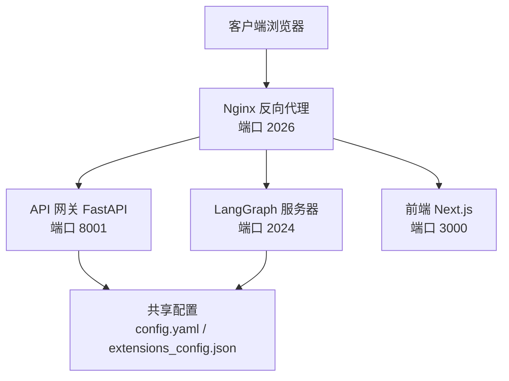
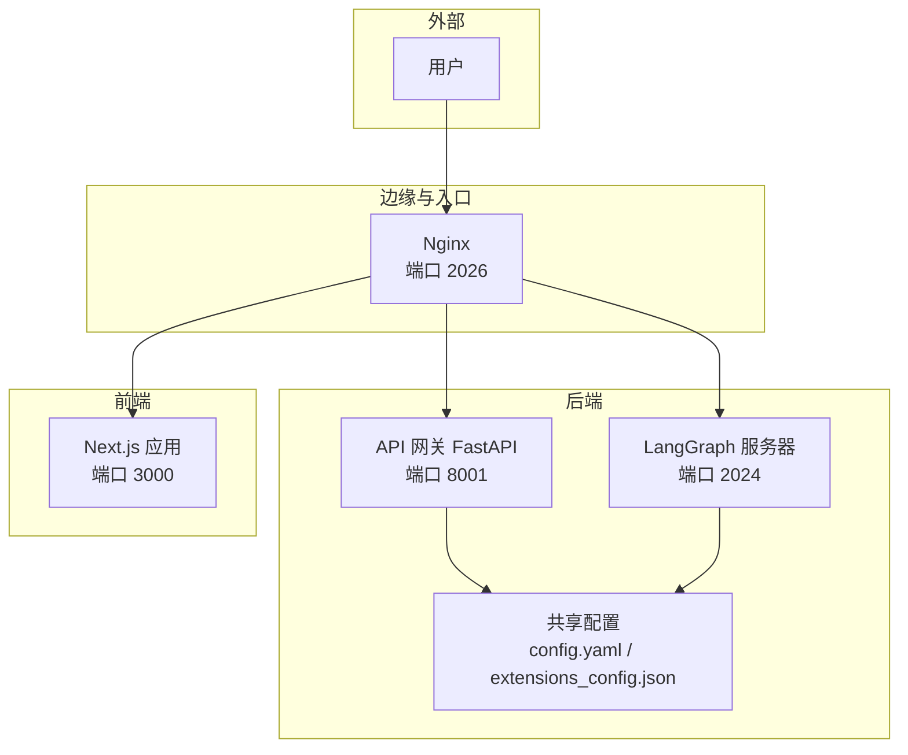
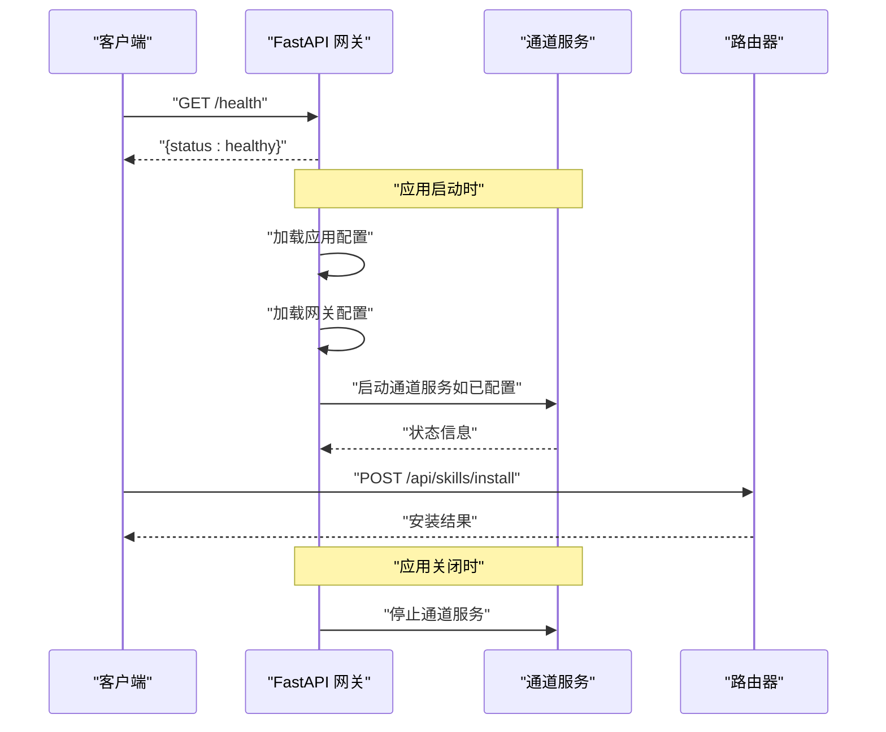
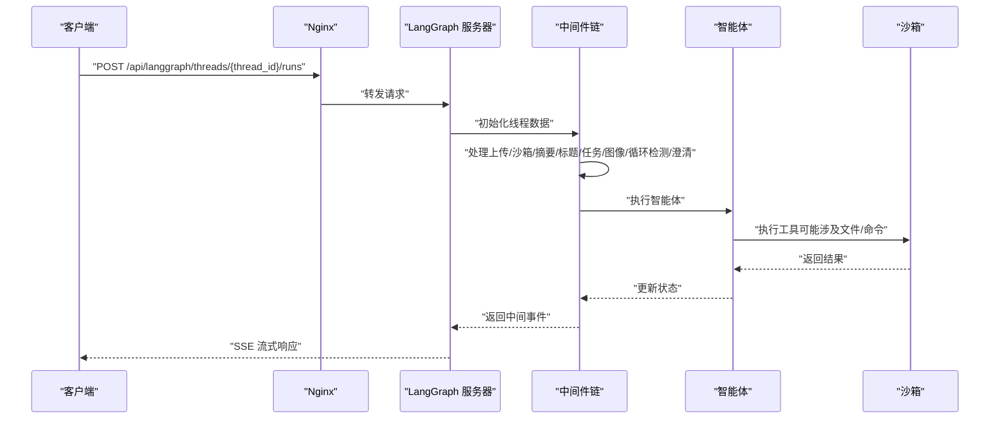
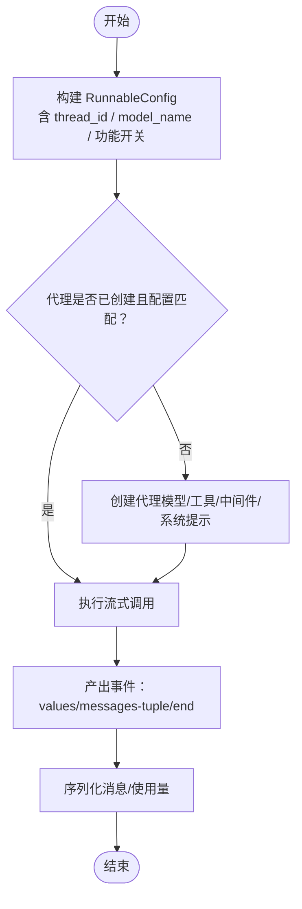
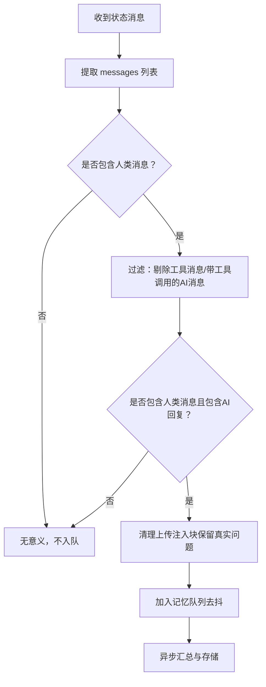
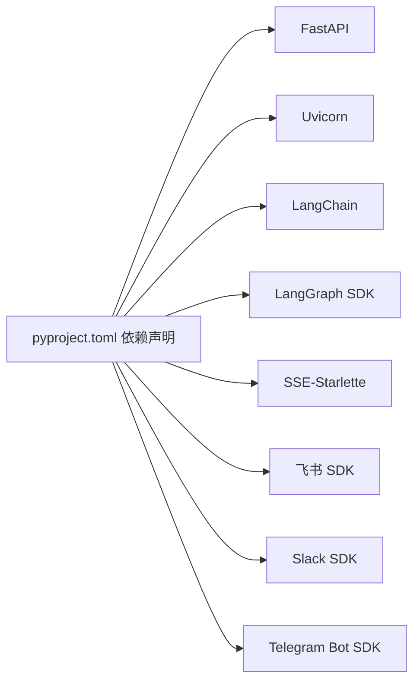

# 后端架构

<cite>
**本文引用的文件**
- [backend/app/gateway/app.py](file://backend/app/gateway/app.py)
- [backend/app/gateway/config.py](file://backend/app/gateway/config.py)
- [backend/app/gateway/routers/models.py](file://backend/app/gateway/routers/models.py)
- [backend/app/gateway/routers/memory.py](file://backend/app/gateway/routers/memory.py)
- [backend/app/gateway/routers/skills.py](file://backend/app/gateway/routers/skills.py)
- [backend/app/gateway/routers/agents.py](file://backend/app/gateway/routers/agents.py)
- [backend/packages/harness/deerflow/client.py](file://backend/packages/harness/deerflow/client.py)
- [backend/packages/harness/deerflow/agents/lead_agent/agent.py](file://backend/packages/harness/deerflow/agents/lead_agent/agent.py)
- [backend/packages/harness/deerflow/config/app_config.py](file://backend/packages/harness/deerflow/config/app_config.py)
- [backend/packages/harness/deerflow/agents/middlewares/memory_middleware.py](file://backend/packages/harness/deerflow/agents/middlewares/memory_middleware.py)
- [backend/langgraph.json](file://backend/langgraph.json)
- [backend/pyproject.toml](file://backend/pyproject.toml)
- [backend/docs/ARCHITECTURE.md](file://backend/docs/ARCHITECTURE.md)
</cite>

## 目录
1. [引言](#引言)
2. [项目结构](#项目结构)
3. [核心组件](#核心组件)
4. [架构总览](#架构总览)
5. [详细组件分析](#详细组件分析)
6. [依赖分析](#依赖分析)
7. [性能考量](#性能考量)
8. [故障排查指南](#故障排查指南)
9. [结论](#结论)
10. [附录](#附录)

## 引言
本文件面向 DeerFlow 后端架构，聚焦于基于 FastAPI 的 API 网关设计、LangGraph 服务器集成与应用生命周期管理。文档解释后端组件之间的交互关系、数据流向与集成模式，阐述技术决策、权衡与约束，并给出基础设施要求、可扩展性考虑与部署拓扑建议。同时覆盖安全、监控与灾难恢复等横切关注点。

## 项目结构
后端采用“网关 + LangGraph 服务器”的双层架构：Nginx 作为统一反向代理入口，将 /api/langgraph/* 路由至 LangGraph 服务器（端口 2024），将 /api/* 路由至 FastAPI 网关（端口 8001）。前端 Next.js 应用运行在 3000 端口。共享配置通过 config.yaml 与 extensions_config.json 提供给两端。

图表来源
- [backend/docs/ARCHITECTURE.md](file://backend/docs/ARCHITECTURE.md)
- [backend/app/gateway/app.py](file://backend/app/gateway/app.py)

章节来源
- [backend/docs/ARCHITECTURE.md](file://backend/docs/ARCHITECTURE.md)
- [backend/app/gateway/app.py](file://backend/app/gateway/app.py)

## 核心组件
- API 网关（FastAPI）
  - 负责非代理类操作：模型查询、MCP 配置、技能管理、文件上传、线程清理、工件访问、建议生成、通道集成等。
  - 生命周期：启动时加载应用配置与网关配置；启动通道服务；关闭时停止通道服务。
- LangGraph 服务器
  - 基于 LangGraph 的智能体运行时，负责线程状态管理、中间件链执行、工具调用与实时流式响应。
  - 通过 langgraph.json 指定入口函数与检查点提供者。
- 客户端库（deerflow.client）
  - 提供嵌入式 Python 客户端，无需 LangGraph 或网关进程即可直接调用 DeerFlow 的代理能力，支持流式事件与多轮对话。
- 中间件与配置
  - 中间件链包含标题生成、记忆注入、任务跟踪、循环检测、图像处理、工具错误处理等。
  - 应用配置集中管理模型、工具、沙箱、技能、扩展、摘要、令牌用量等。

章节来源
- [backend/app/gateway/app.py](file://backend/app/gateway/app.py)
- [backend/app/gateway/routers/models.py](file://backend/app/gateway/routers/models.py)
- [backend/app/gateway/routers/memory.py](file://backend/app/gateway/routers/memory.py)
- [backend/app/gateway/routers/skills.py](file://backend/app/gateway/routers/skills.py)
- [backend/app/gateway/routers/agents.py](file://backend/app/gateway/routers/agents.py)
- [backend/packages/harness/deerflow/client.py](file://backend/packages/harness/deerflow/client.py)
- [backend/packages/harness/deerflow/agents/lead_agent/agent.py](file://backend/packages/harness/deerflow/agents/lead_agent/agent.py)
- [backend/packages/harness/deerflow/config/app_config.py](file://backend/packages/harness/deerflow/config/app_config.py)
- [backend/packages/harness/deerflow/agents/middlewares/memory_middleware.py](file://backend/packages/harness/deerflow/agents/middlewares/memory_middleware.py)
- [backend/langgraph.json](file://backend/langgraph.json)

## 架构总览
下图展示系统上下文与组件交互：Nginx 作为统一入口，将请求分发到 LangGraph 服务器或 API 网关；网关与 LangGraph 共享配置；前端通过网关与 LangGraph 协作完成对话与文件处理。

图表来源
- [backend/docs/ARCHITECTURE.md](file://backend/docs/ARCHITECTURE.md)
- [backend/app/gateway/app.py](file://backend/app/gateway/app.py)

## 详细组件分析

### API 网关（FastAPI）生命周期与路由
- 生命周期
  - 启动阶段：加载应用配置与网关配置；尝试启动即时通讯（IM）通道服务（若已配置）。
  - 运行阶段：提供健康检查与各业务路由。
  - 关闭阶段：优雅停止通道服务。
- 路由组织
  - 模型管理：/api/models
  - 记忆管理：/api/memory
  - 技能管理：/api/skills
  - 工件与上传：/api/threads/{thread_id}/artifacts, /api/threads/{thread_id}/uploads
  - 线程清理：/api/threads/{thread_id}
  - 自定义代理与用户档案：/api/agents, /api/user-profile
  - 健康检查：/health
- 配置
  - 支持从环境变量读取主机、端口与 CORS 来源。

图表来源
- [backend/app/gateway/app.py](file://backend/app/gateway/app.py)
- [backend/app/gateway/routers/skills.py](file://backend/app/gateway/routers/skills.py)

章节来源
- [backend/app/gateway/app.py](file://backend/app/gateway/app.py)
- [backend/app/gateway/config.py](file://backend/app/gateway/config.py)
- [backend/app/gateway/routers/models.py](file://backend/app/gateway/routers/models.py)
- [backend/app/gateway/routers/memory.py](file://backend/app/gateway/routers/memory.py)
- [backend/app/gateway/routers/skills.py](file://backend/app/gateway/routers/skills.py)
- [backend/app/gateway/routers/agents.py](file://backend/app/gateway/routers/agents.py)

### LangGraph 服务器与智能体执行
- 入口与配置
  - 通过 langgraph.json 指定智能体入口函数与检查点提供者。
  - 入口函数负责构建模型、工具与中间件链，返回可执行的代理对象。
- 中间件链
  - 执行顺序与职责明确：线程数据初始化、上传处理、沙箱获取、摘要、标题生成、任务跟踪（计划模式）、图像处理、循环检测、澄清请求等。
- 线程状态
  - 扩展自 LangGraph 的 AgentState，包含消息、工件、工作区路径、标题、待办事项、已查看图像等字段。

图表来源
- [backend/langgraph.json](file://backend/langgraph.json)
- [backend/packages/harness/deerflow/agents/lead_agent/agent.py](file://backend/packages/harness/deerflow/agents/lead_agent/agent.py)
- [backend/packages/harness/deerflow/agents/middlewares/memory_middleware.py](file://backend/packages/harness/deerflow/agents/middlewares/memory_middleware.py)

章节来源
- [backend/langgraph.json](file://backend/langgraph.json)
- [backend/packages/harness/deerflow/agents/lead_agent/agent.py](file://backend/packages/harness/deerflow/agents/lead_agent/agent.py)
- [backend/packages/harness/deerflow/agents/middlewares/memory_middleware.py](file://backend/packages/harness/deerflow/agents/middlewares/memory_middleware.py)

### 客户端库（deerflow.client）
- 能力概览
  - 支持聊天与流式事件；可按需传入检查点以实现多轮对话；支持模型选择、思维模式、子代理、计划模式等参数。
  - 提供模型列表、技能列表、记忆数据、MCP 配置查询与更新、技能启用状态更新、技能安装等接口。
- 数据流
  - 通过内部 RunnableConfig 传递线程 ID、模型名、功能开关等；惰性创建代理；序列化事件以兼容 SSE 协议。

图表来源
- [backend/packages/harness/deerflow/client.py](file://backend/packages/harness/deerflow/client.py)

章节来源
- [backend/packages/harness/deerflow/client.py](file://backend/packages/harness/deerflow/client.py)

### 配置与缓存机制
- 应用配置（AppConfig）
  - 支持从多个位置解析 config.yaml；自动检测并警告配置版本落后；递归解析环境变量；提供模型/工具/沙箱/技能/扩展/摘要/令牌用量等配置项。
  - 缓存策略：基于文件路径与修改时间判断是否需要重载；支持强制重载与重置缓存。
- 网关配置（GatewayConfig）
  - 从环境变量读取主机、端口与 CORS 来源，避免硬编码。

章节来源
- [backend/packages/harness/deerflow/config/app_config.py](file://backend/packages/harness/deerflow/config/app_config.py)
- [backend/app/gateway/config.py](file://backend/app/gateway/config.py)

### 记忆中间件与数据过滤
- 记忆中间件职责
  - 在每次智能体执行后，对对话进行过滤与去噪（仅保留用户输入与最终 AI 回复，剔除工具消息与上传注入块），并按去抖策略异步写入记忆队列。
- 过滤规则
  - 剔除工具消息与带工具调用的 AI 消息；
  - 清理上传注入块，仅保留用户真实问题；
  - 若整轮对话仅为上传书目，则连同配对的 AI 回复一并跳过。

图表来源
- [backend/packages/harness/deerflow/agents/middlewares/memory_middleware.py](file://backend/packages/harness/deerflow/agents/middlewares/memory_middleware.py)

章节来源
- [backend/packages/harness/deerflow/agents/middlewares/memory_middleware.py](file://backend/packages/harness/deerflow/agents/middlewares/memory_middleware.py)

## 依赖分析
- 组件耦合
  - 网关与 LangGraph 服务器通过 Nginx 解耦，各自独立进程，避免共享内存与缓存污染。
  - 共享配置通过文件系统提供，LangGraph 侧通过 MCP 管理器监听变更以热更新工具集。
- 外部依赖
  - FastAPI、Uvicorn、SSE-Starlette、LangGraph SDK、LangChain、第三方 IM SDK（飞书、Slack、Telegram）等。

图表来源
- [backend/pyproject.toml](file://backend/pyproject.toml)

章节来源
- [backend/pyproject.toml](file://backend/pyproject.toml)

## 性能考量
- 缓存与重载
  - MCP 工具与配置基于文件 mtime 缓存，文件变更触发热重载，避免重启。
  - 应用配置按路径与修改时间缓存，减少 IO 开销。
- 流式传输
  - 使用 SSE 实现实时流式响应，降低首 token 延迟，提升长任务体验。
- 上下文管理
  - 摘要中间件在接近上下文限制时进行压缩，保留近期消息，平衡成本与效果。

章节来源
- [backend/docs/ARCHITECTURE.md](file://backend/docs/ARCHITECTURE.md)
- [backend/packages/harness/deerflow/config/app_config.py](file://backend/packages/harness/deerflow/config/app_config.py)

## 故障排查指南
- 启动失败
  - 网关启动阶段会加载应用配置与网关配置，失败时记录异常并抛出运行时错误。检查环境变量与配置文件路径。
- 通道服务
  - 启动/停止通道服务时捕获异常并记录日志，确认 IM 通道配置正确。
- 路由错误
  - 各路由对异常进行捕获并返回 HTTP 错误码（如 404/409/400/500），结合日志定位具体原因。
- 记忆中间件
  - 当缺少 thread_id 或消息为空时，中间件会跳过入队；检查运行时上下文与消息序列。

章节来源
- [backend/app/gateway/app.py](file://backend/app/gateway/app.py)
- [backend/app/gateway/routers/skills.py](file://backend/app/gateway/routers/skills.py)
- [backend/packages/harness/deerflow/agents/middlewares/memory_middleware.py](file://backend/packages/harness/deerflow/agents/middlewares/memory_middleware.py)

## 结论
DeerFlow 后端采用清晰的分层架构：Nginx 作为统一入口，LangGraph 服务器专注智能体执行，API 网关负责非代理类业务与配置管理。通过共享配置与中间件链实现高内聚、低耦合，具备良好的可扩展性与可维护性。结合流式传输、缓存与摘要机制，系统在性能与用户体验上取得平衡。

## 附录
- 部署拓扑建议
  - 生产环境推荐将 LangGraph 与网关分别容器化并独立扩缩容；Nginx 作为入口暴露 2026 端口；LangGraph 与网关分别监听 2024 与 8001 端口；前端独立部署。
- 安全与合规
  - 沙箱隔离（本地/容器）；环境变量解析避免明文密钥；路径校验防止目录穿越；通道服务按需启用。
- 监控与可观测性
  - 建议接入日志聚合与指标采集；LangGraph 侧可利用 LangSmith 进行追踪；网关暴露健康检查端点便于探活。
- 灾难恢复
  - 配置文件与线程数据持久化；定期备份；通过检查点实现会话恢复；删除线程时先清空 LangGraph 状态再清理本地文件。