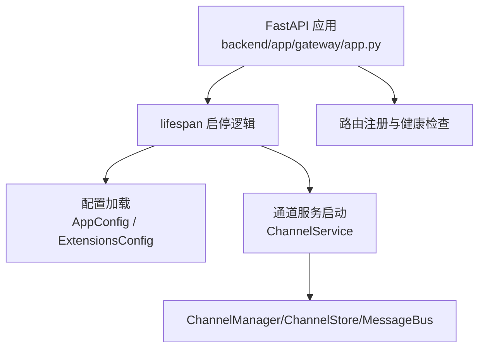
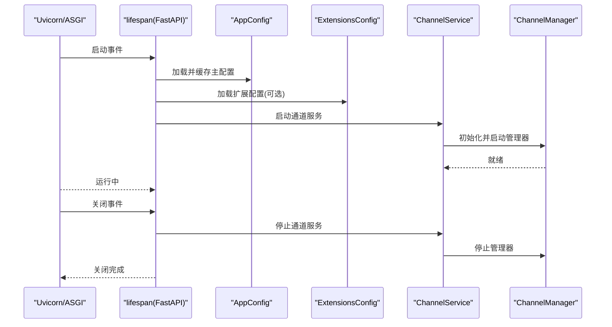
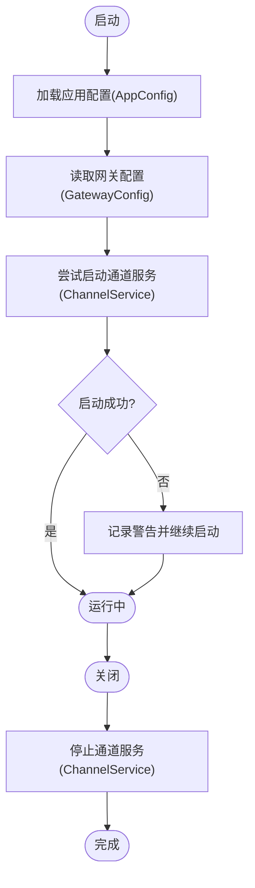
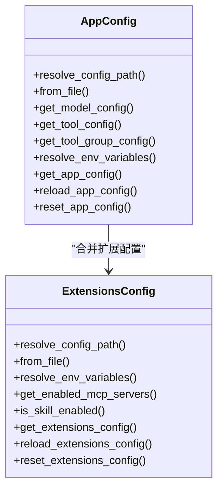
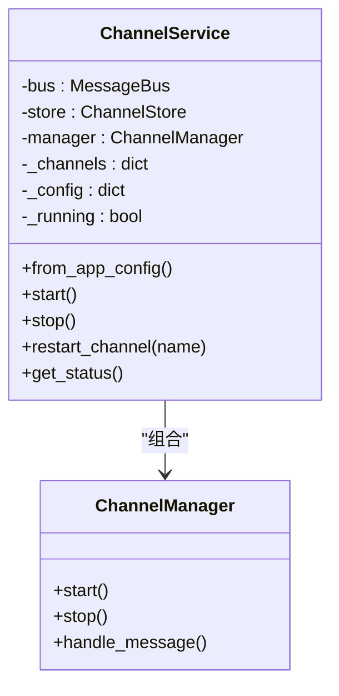
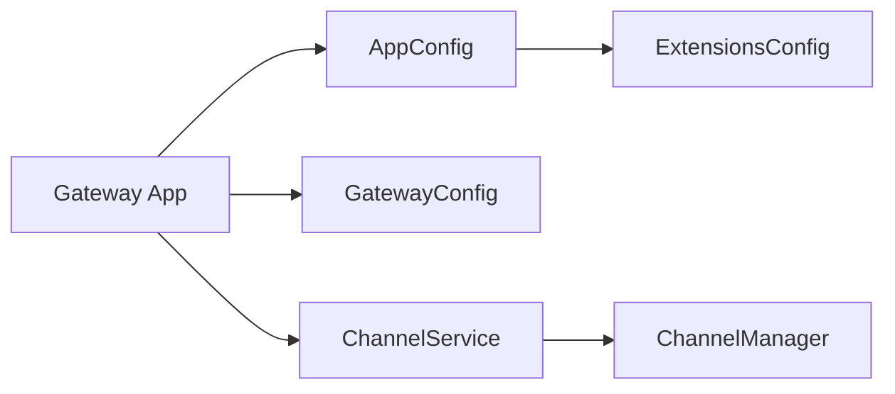

# 应用生命周期管理

<cite>
**本文引用的文件列表**
- [backend/app/gateway/app.py](file://backend/app/gateway/app.py)
- [backend/app/gateway/config.py](file://backend/app/gateway/config.py)
- [backend/app/channels/service.py](file://backend/app/channels/service.py)
- [backend/app/channels/manager.py](file://backend/app/channels/manager.py)
- [backend/packages/harness/deerflow/config/app_config.py](file://backend/packages/harness/deerflow/config/app_config.py)
- [backend/packages/harness/deerflow/config/extensions_config.py](file://backend/packages/harness/deerflow/config/extensions_config.py)
- [backend/packages/harness/deerflow/client.py](file://backend/packages/harness/deerflow/client.py)
- [skills/public/claude-to-deerflow/scripts/status.sh](file://skills/public/claude-to-deerflow/scripts/status.sh)
</cite>

## 目录
1. [简介](#简介)
2. [项目结构与入口](#项目结构与入口)
3. [核心组件](#核心组件)
4. [架构总览](#架构总览)
5. [详细组件分析](#详细组件分析)
6. [依赖关系分析](#依赖关系分析)
7. [性能考量](#性能考量)
8. [故障排除指南](#故障排除指南)
9. [结论](#结论)
10. [附录：健康监控与运维脚本](#附录健康监控与运维脚本)

## 简介
本文件系统性阐述 DeerFlow 的应用生命周期管理，覆盖从启动到关闭的完整流程，重点包括：
- 配置加载与校验（应用配置与扩展配置）
- 服务初始化与资源分配（通道服务 ChannelService）
- 异步上下文管理与优雅关闭策略
- 错误处理与日志记录
- 健康监控与运维脚本

目标是帮助开发者与运维人员理解各模块在生命周期中的职责、交互方式与最佳实践，并提供可操作的排障建议与性能优化建议。

## 项目结构与入口
- 后端网关使用 FastAPI，通过 lifespan 生命周期钩子统一管理启动与关闭阶段。
- 通道服务作为独立子系统，在网关启动时按需启动，关闭时优雅停止。
- 客户端模块提供嵌入式调用能力，内部同样遵循配置加载与缓存策略。

图表来源
- [backend/app/gateway/app.py:32-71](file://backend/app/gateway/app.py#L32-L71)
- [backend/app/channels/service.py:22-94](file://backend/app/channels/service.py#L22-L94)
- [backend/packages/harness/deerflow/config/app_config.py:263-289](file://backend/packages/harness/deerflow/config/app_config.py#L263-L289)
- [backend/packages/harness/deerflow/config/extensions_config.py:205-218](file://backend/packages/harness/deerflow/config/extensions_config.py#L205-L218)

章节来源
- [backend/app/gateway/app.py:73-196](file://backend/app/gateway/app.py#L73-L196)

## 核心组件
- 应用生命周期管理器（lifespan）：负责启动前配置加载、通道服务启动；关闭时优雅停止通道服务。
- 配置系统：AppConfig 负责主配置解析与缓存，ExtensionsConfig 负责 MCP 与技能状态配置。
- 通道服务（ChannelService）：统一管理消息总线、存储与多渠道接入，支持启停与状态查询。
- 客户端（DeerFlowClient）：提供嵌入式调用能力，内部复用相同的配置加载与工具集。

章节来源
- [backend/app/gateway/app.py:32-71](file://backend/app/gateway/app.py#L32-L71)
- [backend/packages/harness/deerflow/config/app_config.py:263-289](file://backend/packages/harness/deerflow/config/app_config.py#L263-L289)
- [backend/packages/harness/deerflow/config/extensions_config.py:205-218](file://backend/packages/harness/deerflow/config/extensions_config.py#L205-L218)
- [backend/app/channels/service.py:22-94](file://backend/app/channels/service.py#L22-L94)
- [backend/packages/harness/deerflow/client.py:109-152](file://backend/packages/harness/deerflow/client.py#L109-L152)

## 架构总览
下图展示应用启动与关闭的关键路径，以及配置与通道服务的交互。

图表来源
- [backend/app/gateway/app.py:32-71](file://backend/app/gateway/app.py#L32-L71)
- [backend/packages/harness/deerflow/config/app_config.py:263-289](file://backend/packages/harness/deerflow/config/app_config.py#L263-L289)
- [backend/packages/harness/deerflow/config/extensions_config.py:205-218](file://backend/packages/harness/deerflow/config/extensions_config.py#L205-L218)
- [backend/app/channels/service.py:62-94](file://backend/app/channels/service.py#L62-L94)

## 详细组件分析

### 组件一：应用生命周期管理器（lifespan）
- 启动阶段：
  - 加载应用配置（AppConfig），失败则抛出运行时异常并阻止启动。
  - 读取网关配置（GatewayConfig），用于绑定主机与端口。
  - 按需启动通道服务（ChannelService），若未配置或启动失败则记录警告但不阻断网关启动。
- 关闭阶段：
  - 优雅停止通道服务，捕获异常并记录日志，确保资源回收。

图表来源
- [backend/app/gateway/app.py:32-71](file://backend/app/gateway/app.py#L32-L71)

章节来源
- [backend/app/gateway/app.py:32-71](file://backend/app/gateway/app.py#L32-L71)

### 组件二：配置加载与验证
- 应用配置（AppConfig）：
  - 支持环境变量注入与版本校验，自动检测过期配置并给出升级提示。
  - 提供缓存与热重载：基于文件路径与修改时间判断是否需要重新加载。
- 扩展配置（ExtensionsConfig）：
  - 支持 MCP 服务器与技能状态配置，提供从文件加载、环境变量解析与缓存。
  - 兼容旧版 MCP 配置文件名，且扩展配置为可选。

图表来源
- [backend/packages/harness/deerflow/config/app_config.py:46-131](file://backend/packages/harness/deerflow/config/app_config.py#L46-L131)
- [backend/packages/harness/deerflow/config/app_config.py:263-334](file://backend/packages/harness/deerflow/config/app_config.py#L263-L334)
- [backend/packages/harness/deerflow/config/extensions_config.py:70-144](file://backend/packages/harness/deerflow/config/extensions_config.py#L70-L144)
- [backend/packages/harness/deerflow/config/extensions_config.py:205-259](file://backend/packages/harness/deerflow/config/extensions_config.py#L205-L259)

章节来源
- [backend/packages/harness/deerflow/config/app_config.py:263-334](file://backend/packages/harness/deerflow/config/app_config.py#L263-L334)
- [backend/packages/harness/deerflow/config/extensions_config.py:205-259](file://backend/packages/harness/deerflow/config/extensions_config.py#L205-L259)

### 组件三：通道服务（ChannelService）
- 职责：
  - 从应用配置读取通道配置，实例化启用的渠道并启动 ChannelManager。
  - 提供状态查询接口，便于健康检查与运维观察。
- 启停流程：
  - start：启动管理器，逐个启动启用的渠道。
  - stop：依次停止所有渠道与管理器，清空状态。
- 状态查询：
  - 返回服务运行态与各渠道的启用/运行状态。

图表来源
- [backend/app/channels/service.py:22-151](file://backend/app/channels/service.py#L22-L151)

章节来源
- [backend/app/channels/service.py:22-151](file://backend/app/channels/service.py#L22-L151)

### 组件四：通道管理器与后台任务错误处理
- ChannelManager 在处理消息时使用并发信号量与后台任务，对未处理异常进行统一记录，避免崩溃传播。
- 对于消息处理异常，会发送通用错误提示，保证对话连续性。

章节来源
- [backend/app/channels/manager.py:429-463](file://backend/app/channels/manager.py#L429-L463)

### 组件五：客户端（DeerFlowClient）与配置缓存
- 客户端在初始化时加载应用配置，支持按需重载与重置缓存。
- 通过惰性代理工具集与中间件构建，首次调用时创建代理，后续根据配置变化重建。

章节来源
- [backend/packages/harness/deerflow/client.py:109-152](file://backend/packages/harness/deerflow/client.py#L109-L152)
- [backend/packages/harness/deerflow/client.py:199-246](file://backend/packages/harness/deerflow/client.py#L199-L246)

## 依赖关系分析
- 网关应用依赖：
  - AppConfig：启动时强制加载，失败即终止。
  - GatewayConfig：读取网关运行参数。
  - ChannelService：按需启动，失败不影响网关可用性。
- 配置系统：
  - AppConfig 与 ExtensionsConfig 独立存在，但运行时会合并扩展配置。
- 通道服务：
  - 依赖 ChannelManager/ChannelStore/MessageBus，形成松耦合的事件驱动架构。

图表来源
- [backend/app/gateway/app.py:32-71](file://backend/app/gateway/app.py#L32-L71)
- [backend/packages/harness/deerflow/config/app_config.py:263-289](file://backend/packages/harness/deerflow/config/app_config.py#L263-L289)
- [backend/packages/harness/deerflow/config/extensions_config.py:205-218](file://backend/packages/harness/deerflow/config/extensions_config.py#L205-L218)
- [backend/app/channels/service.py:22-94](file://backend/app/channels/service.py#L22-L94)

章节来源
- [backend/app/gateway/app.py:32-71](file://backend/app/gateway/app.py#L32-L71)
- [backend/packages/harness/deerflow/config/app_config.py:263-289](file://backend/packages/harness/deerflow/config/app_config.py#L263-L289)
- [backend/packages/harness/deerflow/config/extensions_config.py:205-218](file://backend/packages/harness/deerflow/config/extensions_config.py#L205-L218)
- [backend/app/channels/service.py:22-94](file://backend/app/channels/service.py#L22-L94)

## 性能考量
- 配置缓存与热重载：
  - AppConfig 基于文件修改时间判断是否重载，避免频繁 IO。
  - ExtensionsConfig 提供独立缓存与重载，适合动态调整 MCP/技能状态。
- 通道服务并发：
  - ChannelManager 使用信号量限制并发，后台任务异常记录避免阻塞。
- 日志级别与开销：
  - 建议生产环境使用 info 或更高日志级别，减少调试日志开销。
- 资源池与线程：
  - 文件转换等 CPU 密集型任务在事件循环内谨慎使用线程池，避免阻塞。

章节来源
- [backend/packages/harness/deerflow/config/app_config.py:271-289](file://backend/packages/harness/deerflow/config/app_config.py#L271-L289)
- [backend/packages/harness/deerflow/config/extensions_config.py:220-236](file://backend/packages/harness/deerflow/config/extensions_config.py#L220-L236)
- [backend/app/channels/manager.py:429-463](file://backend/app/channels/manager.py#L429-L463)

## 故障排除指南
- 启动失败（配置加载）：
  - 现象：启动即报错，无法进入服务。
  - 排查：确认配置文件路径与权限；检查环境变量是否正确；查看版本提示并执行升级。
  - 参考：[backend/packages/harness/deerflow/config/app_config.py:134-177](file://backend/packages/harness/deerflow/config/app_config.py#L134-L177)
- 通道服务未启动：
  - 现象：网关启动成功，但通道不可用。
  - 排查：检查通道配置是否启用；查看日志中“通道启动失败”警告；确认第三方服务可达。
  - 参考：[backend/app/gateway/app.py:52-69](file://backend/app/gateway/app.py#L52-L69)，[backend/app/channels/service.py:111-135](file://backend/app/channels/service.py#L111-L135)
- 后台任务异常：
  - 现象：消息处理出现内部错误提示。
  - 排查：查看 ChannelManager 中的异常日志；确认工具链路与外部服务稳定性。
  - 参考：[backend/app/channels/manager.py:448-463](file://backend/app/channels/manager.py#L448-L463)
- 健康检查：
  - 使用健康端点快速判断服务状态；结合运维脚本进行自动化巡检。
  - 参考：[backend/app/gateway/app.py:187-195](file://backend/app/gateway/app.py#L187-L195)，[skills/public/claude-to-deerflow/scripts/status.sh:26-39](file://skills/public/claude-to-deerflow/scripts/status.sh#L26-L39)

章节来源
- [backend/packages/harness/deerflow/config/app_config.py:134-177](file://backend/packages/harness/deerflow/config/app_config.py#L134-L177)
- [backend/app/gateway/app.py:52-69](file://backend/app/gateway/app.py#L52-L69)
- [backend/app/channels/service.py:111-135](file://backend/app/channels/service.py#L111-L135)
- [backend/app/channels/manager.py:448-463](file://backend/app/channels/manager.py#L448-L463)
- [backend/app/gateway/app.py:187-195](file://backend/app/gateway/app.py#L187-L195)
- [skills/public/claude-to-deerflow/scripts/status.sh:26-39](file://skills/public/claude-to-deerflow/scripts/status.sh#L26-L39)

## 结论
DeerFlow 的生命周期管理以 FastAPI 的 lifespan 为核心，结合配置系统的缓存与热重载、通道服务的按需启动与优雅关闭，形成了稳定可靠的运行时框架。通过明确的错误处理与日志策略，以及配套的健康检查与运维脚本，能够有效支撑生产环境的持续交付与运维。

## 附录：健康监控与运维脚本
- 网关健康端点：提供基础健康状态返回，便于探活与编排系统集成。
- 运维脚本：通过 curl 访问健康端点与模型/技能等接口，实现自动化巡检与状态展示。

章节来源
- [backend/app/gateway/app.py:187-195](file://backend/app/gateway/app.py#L187-L195)
- [skills/public/claude-to-deerflow/scripts/status.sh:26-98](file://skills/public/claude-to-deerflow/scripts/status.sh#L26-L98)