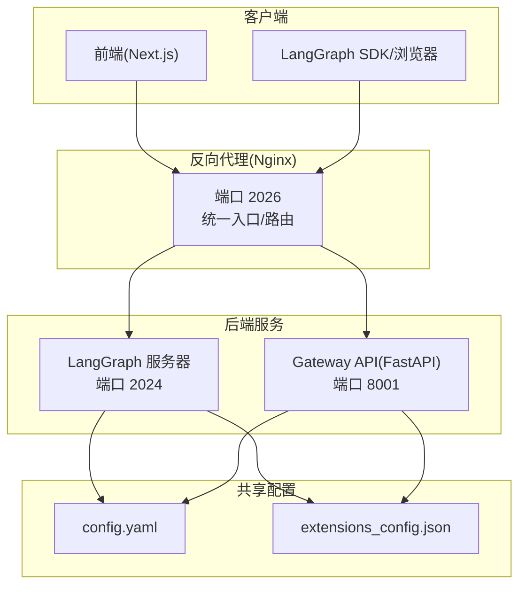
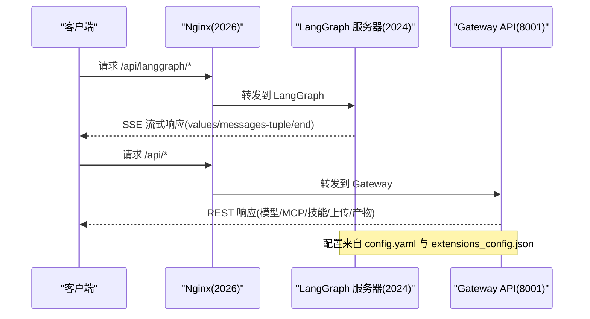
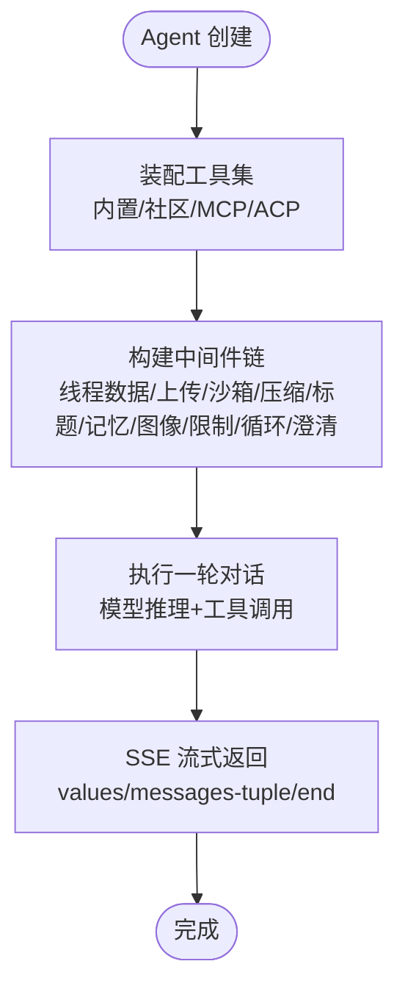
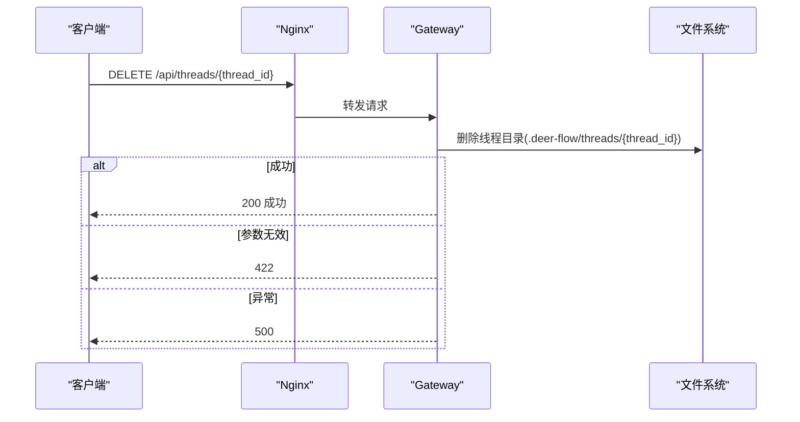
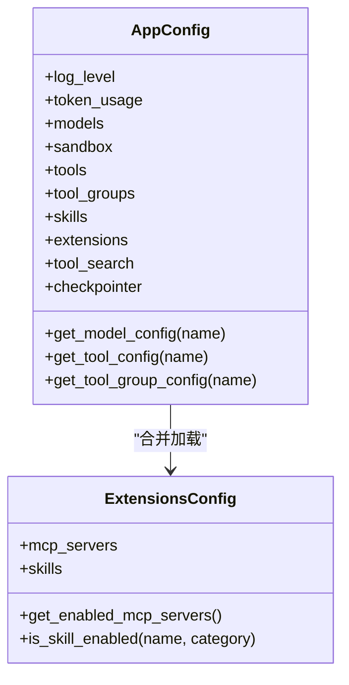
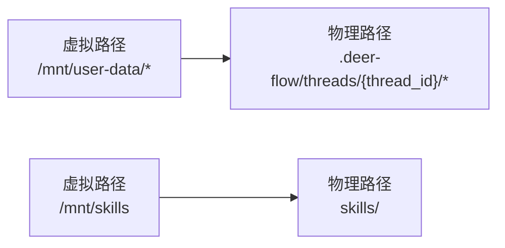
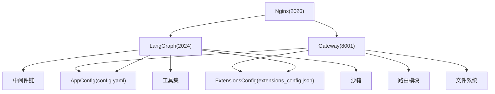

# 组件集成架构

<cite>
**本文档引用的文件**
- [backend/README.md](file://backend/README.md)
- [backend/docs/ARCHITECTURE.md](file://backend/docs/ARCHITECTURE.md)
- [backend/docs/API.md](file://backend/docs/API.md)
- [backend/docs/CONFIGURATION.md](file://backend/docs/CONFIGURATION.md)
- [backend/app/gateway/app.py](file://backend/app/gateway/app.py)
- [backend/app/gateway/routers/threads.py](file://backend/app/gateway/routers/threads.py)
- [backend/app/gateway/routers/artifacts.py](file://backend/app/gateway/routers/artifacts.py)
- [backend/langgraph.json](file://backend/langgraph.json)
- [backend/packages/harness/deerflow/client.py](file://backend/packages/harness/deerflow/client.py)
- [backend/packages/harness/deerflow/agents/lead_agent/agent.py](file://backend/packages/harness/deerflow/agents/lead_agent/agent.py)
- [backend/packages/harness/deerflow/agents/middlewares/thread_data_middleware.py](file://backend/packages/harness/deerflow/agents/middlewares/thread_data_middleware.py)
- [backend/packages/harness/deerflow/tools/tools.py](file://backend/packages/harness/deerflow/tools/tools.py)
- [backend/packages/harness/deerflow/config/app_config.py](file://backend/packages/harness/deerflow/config/app_config.py)
- [backend/packages/harness/deerflow/config/extensions_config.py](file://backend/packages/harness/deerflow/config/extensions_config.py)
- [backend/packages/harness/deerflow/sandbox/sandbox.py](file://backend/packages/harness/deerflow/sandbox/sandbox.py)
- [docker/docker-compose.yaml](file://docker/docker-compose.yaml)
</cite>

## 目录
1. [简介](#简介)
2. [项目结构](#项目结构)
3. [核心组件](#核心组件)
4. [架构总览](#架构总览)
5. [详细组件分析](#详细组件分析)
6. [依赖关系分析](#依赖关系分析)
7. [性能考量](#性能考量)
8. [故障排查指南](#故障排查指南)
9. [结论](#结论)
10. [附录](#附录)

## 简介
本文件面向 DeerFlow 后端组件集成架构，系统性阐述各后端组件（API 网关、LangGraph 服务器、配置系统、通道服务等）之间的交互关系、数据流向与集成模式。重点覆盖以下方面：
- 请求路由与反向代理（Nginx）如何将请求分发至 LangGraph 与 Gateway
- LangGraph 服务器中的 Agent 运行时、中间件链、工具系统与沙箱执行
- Gateway 的 REST API 路由与非 Agent 相关能力（模型、MCP、技能、上传、产物）
- 配置系统（config.yaml 与 extensions_config.json）的加载、缓存与热重载
- 错误传播、状态同步与线程隔离
- 微服务架构设计原则与实现细节
- 系统架构图、组件依赖关系图与集成测试策略

## 项目结构
后端采用“LangGraph 服务器 + FastAPI 网关 + 反向代理”的微服务架构，结合容器化部署与 Docker Compose 编排，形成统一入口与职责分离的体系。

图表来源
- [backend/docs/ARCHITECTURE.md:7-51](file://backend/docs/ARCHITECTURE.md#L7-L51)
- [docker/docker-compose.yaml:24-148](file://docker/docker-compose.yaml#L24-L148)

章节来源
- [backend/README.md:7-41](file://backend/README.md#L7-L41)
- [backend/docs/ARCHITECTURE.md:7-51](file://backend/docs/ARCHITECTURE.md#L7-L51)
- [docker/docker-compose.yaml:24-148](file://docker/docker-compose.yaml#L24-L148)

## 核心组件
- LangGraph 服务器：基于 LangGraph 的多智能体运行时，负责对话、线程管理、SSE 流式输出与检查点持久化。
- API 网关（Gateway）：基于 FastAPI 提供模型、MCP、技能、上传、产物、线程清理等 REST 接口。
- 配置系统：AppConfig（config.yaml）与 ExtensionsConfig（extensions_config.json），支持环境变量解析与热重载。
- 沙箱系统：抽象 Sandbox 接口与本地/AIO 提供者，提供命令执行、文件读写与目录遍历能力。
- 中间件链：在 Agent 执行前按序处理线程数据、上传注入、沙箱获取、上下文压缩、标题生成、记忆队列、图像注入、澄清拦截等。
- 工具系统：内置工具、社区工具、MCP 工具与 ACP 工具的动态装配与延迟注册。

章节来源
- [backend/README.md:46-136](file://backend/README.md#L46-L136)
- [backend/docs/ARCHITECTURE.md:55-127](file://backend/docs/ARCHITECTURE.md#L55-L127)
- [backend/packages/harness/deerflow/config/app_config.py:30-44](file://backend/packages/harness/deerflow/config/app_config.py#L30-L44)
- [backend/packages/harness/deerflow/config/extensions_config.py:55-67](file://backend/packages/harness/deerflow/config/extensions_config.py#L55-L67)
- [backend/packages/harness/deerflow/sandbox/sandbox.py:4-73](file://backend/packages/harness/deerflow/sandbox/sandbox.py#L4-L73)

## 架构总览
下图展示从客户端到后端服务的完整调用路径与组件交互：

图表来源
- [backend/docs/ARCHITECTURE.md:344-380](file://backend/docs/ARCHITECTURE.md#L344-L380)
- [backend/docs/API.md:9-12](file://backend/docs/API.md#L9-L12)

章节来源
- [backend/docs/ARCHITECTURE.md:344-380](file://backend/docs/ARCHITECTURE.md#L344-L380)
- [backend/docs/API.md:9-12](file://backend/docs/API.md#L9-L12)

## 详细组件分析

### LangGraph 服务器
- 入口与配置：通过 langgraph.json 指定 agent 实现与检查点提供者。
- Agent 创建：make_lead_agent 动态构建 Agent，包含模型、工具、中间件链与系统提示词模板。
- 中间件链：严格顺序执行，覆盖线程数据初始化、上传注入、沙箱获取、上下文压缩、标题生成、任务跟踪、图像注入、循环检测与澄清拦截。
- 工具装配：从配置加载工具，按模型能力与运行时参数动态启用视图工具与子代理工具；MCP 工具通过缓存与延迟注册机制注入。
- 沙箱执行：中间件确保线程隔离目录与虚拟路径映射，工具在沙箱内执行命令与文件操作。

图表来源
- [backend/packages/harness/deerflow/agents/lead_agent/agent.py:268-344](file://backend/packages/harness/deerflow/agents/lead_agent/agent.py#L268-L344)
- [backend/packages/harness/deerflow/tools/tools.py:23-115](file://backend/packages/harness/deerflow/tools/tools.py#L23-L115)
- [backend/packages/harness/deerflow/agents/middlewares/thread_data_middleware.py:18-97](file://backend/packages/harness/deerflow/agents/middlewares/thread_data_middleware.py#L18-L97)

章节来源
- [backend/langgraph.json:1-15](file://backend/langgraph.json#L1-L15)
- [backend/packages/harness/deerflow/agents/lead_agent/agent.py:268-344](file://backend/packages/harness/deerflow/agents/lead_agent/agent.py#L268-L344)
- [backend/packages/harness/deerflow/tools/tools.py:23-115](file://backend/packages/harness/deerflow/tools/tools.py#L23-L115)
- [backend/packages/harness/deerflow/agents/middlewares/thread_data_middleware.py:18-97](file://backend/packages/harness/deerflow/agents/middlewares/thread_data_middleware.py#L18-L97)

### API 网关（Gateway）
- 应用生命周期：启动时加载应用配置，惰性初始化 MCP 工具；可选启动 IM 渠道服务；关闭时停止服务。
- 路由模块：模型、MCP、内存、技能、产物、上传、线程清理、自定义代理、建议、渠道、健康检查等。
- 线程清理：删除 DeerFlow 管理的本地线程目录，LangGraph 线程删除由 LangGraph API 处理，网关仅清理本地数据。
- 产物访问：支持文本、HTML、二进制文件自动识别与下载；对 .skill 归档内的文件进行解压读取。

图表来源
- [backend/app/gateway/app.py:32-71](file://backend/app/gateway/app.py#L32-L71)
- [backend/app/gateway/routers/threads.py:19-31](file://backend/app/gateway/routers/threads.py#L19-L31)

章节来源
- [backend/app/gateway/app.py:32-71](file://backend/app/gateway/app.py#L32-L71)
- [backend/app/gateway/routers/threads.py:19-31](file://backend/app/gateway/routers/threads.py#L19-L31)
- [backend/app/gateway/routers/artifacts.py:66-159](file://backend/app/gateway/routers/artifacts.py#L66-L159)

### 配置系统
- AppConfig（config.yaml）：日志级别、令牌统计、模型、沙箱、工具、工具组、技能、扩展、工具搜索、检查点等。
- ExtensionsConfig（extensions_config.json）：MCP 服务器与技能状态，支持环境变量解析与热重载。
- 加载与缓存：按修改时间判断是否重载，避免频繁 IO；支持强制重载与自定义注入。
- 环境变量：$VAR 形式解析，缺失时抛出明确错误。

图表来源
- [backend/packages/harness/deerflow/config/app_config.py:30-44](file://backend/packages/harness/deerflow/config/app_config.py#L30-L44)
- [backend/packages/harness/deerflow/config/extensions_config.py:55-67](file://backend/packages/harness/deerflow/config/extensions_config.py#L55-L67)

章节来源
- [backend/packages/harness/deerflow/config/app_config.py:45-131](file://backend/packages/harness/deerflow/config/app_config.py#L45-L131)
- [backend/packages/harness/deerflow/config/extensions_config.py:69-144](file://backend/packages/harness/deerflow/config/extensions_config.py#L69-L144)

### 沙箱系统
- 抽象接口：提供 execute_command、read_file、write_file、list_dir、update_file 等方法。
- 提供者：本地（LocalSandboxProvider）与 AIO（AioSandboxProvider，Docker/K8s）。
- 虚拟路径映射：/mnt/user-data/{workspace,uploads,outputs} 映射到线程隔离目录；/mnt/skills 映射到 skills 目录。
- 安全与隔离：路径遍历防护、容器隔离（生产推荐）、DooD（Daemon-outside-Docker）模式。

图表来源
- [backend/packages/harness/deerflow/sandbox/sandbox.py:4-73](file://backend/packages/harness/deerflow/sandbox/sandbox.py#L4-L73)
- [backend/docs/ARCHITECTURE.md:182-189](file://backend/docs/ARCHITECTURE.md#L182-L189)

章节来源
- [backend/packages/harness/deerflow/sandbox/sandbox.py:4-73](file://backend/packages/harness/deerflow/sandbox/sandbox.py#L4-L73)
- [backend/docs/ARCHITECTURE.md:182-189](file://backend/docs/ARCHITECTURE.md#L182-L189)

### 工具系统
- 工具来源：配置工具、内置工具（present_file、ask_clarification、view_image）、MCP 工具、ACP 工具。
- 条件启用：根据模型能力启用 view_image_tool；根据运行时参数启用子代理工具；根据配置启用 ACP 工具。
- MCP 注册：延迟注册与延迟工具过滤器配合，减少绑定开销；当启用工具搜索时，将 MCP 工具注册到延迟注册表。

章节来源
- [backend/packages/harness/deerflow/tools/tools.py:23-115](file://backend/packages/harness/deerflow/tools/tools.py#L23-L115)

### 客户端集成（Embedded Python 客户端）
- 用途：无需独立 LangGraph/Gateway 进程即可直接调用 DeerFlow 的 Agent 能力。
- 特性：支持流式事件（values/messages-tuple/end）、系统提示词模板注入、配置查询、MCP/技能/内存/上传等管理接口。
- 注意：无检查点时每次调用为无状态；长进程需显式 reset_agent 或使用 checkpointer。

章节来源
- [backend/packages/harness/deerflow/client.py:75-107](file://backend/packages/harness/deerflow/client.py#L75-L107)

## 依赖关系分析
- LangGraph 与 Gateway 分离部署，通过 Nginx 统一入口路由，降低耦合度。
- 配置系统被 LangGraph 与 Gateway 共享，LangGraph 使用 AppConfig 与 ExtensionsConfig；Gateway 在启动时加载 AppConfig，并惰性初始化 MCP 工具。
- 中间件链与工具装配在 LangGraph 侧完成，Gateway 侧重非 Agent 的业务接口。
- 沙箱系统在 LangGraph 侧通过中间件与工具链路使用，Gateway 通过路径解析与文件服务间接参与产物访问。

图表来源
- [backend/docs/ARCHITECTURE.md:7-51](file://backend/docs/ARCHITECTURE.md#L7-L51)
- [backend/app/gateway/app.py:32-71](file://backend/app/gateway/app.py#L32-L71)
- [backend/packages/harness/deerflow/config/app_config.py:263-288](file://backend/packages/harness/deerflow/config/app_config.py#L263-L288)
- [backend/packages/harness/deerflow/config/extensions_config.py:205-217](file://backend/packages/harness/deerflow/config/extensions_config.py#L205-L217)

章节来源
- [backend/docs/ARCHITECTURE.md:7-51](file://backend/docs/ARCHITECTURE.md#L7-L51)
- [backend/app/gateway/app.py:32-71](file://backend/app/gateway/app.py#L32-L71)

## 性能考量
- 缓存与热重载：AppConfig 与 ExtensionsConfig 基于文件修改时间缓存，变更时自动重载，避免重复解析。
- 流式传输：LangGraph 使用 SSE，降低首 token 时间，提升用户体验。
- 上下文管理：SummarizationMiddleware 在接近阈值时压缩历史，减少 token 使用。
- 工具延迟注册：MCP 工具延迟注册与延迟工具过滤器减少绑定与序列化开销。
- 沙箱隔离：生产环境推荐 Docker/K8s 沙箱，提升隔离性与安全性。

章节来源
- [backend/docs/ARCHITECTURE.md:466-484](file://backend/docs/ARCHITECTURE.md#L466-L484)
- [backend/packages/harness/deerflow/config/app_config.py:263-288](file://backend/packages/harness/deerflow/config/app_config.py#L263-L288)
- [backend/packages/harness/deerflow/config/extensions_config.py:205-217](file://backend/packages/harness/deerflow/config/extensions_config.py#L205-L217)
- [backend/packages/harness/deerflow/tools/tools.py:83-94](file://backend/packages/harness/deerflow/tools/tools.py#L83-L94)

## 故障排查指南
- 配置问题
  - config.yaml 未找到：确认位于项目根目录或设置 DEER_FLOW_CONFIG_PATH。
  - extensions_config.json 未找到：可选配置，LangGraph 侧会回退；如需 MCP，请确保文件存在或使用 Gateway 更新。
  - 环境变量未解析：检查 $VAR 是否正确设置，缺失时会报错。
- 线程清理失败
  - 422：线程 ID 无效；请确认 LangGraph 线程已创建且有效。
  - 500：服务器内部异常，查看日志但返回通用错误信息。
- 产物访问异常
  - 400/404：路径非法或文件不存在；确认虚拟路径与实际路径映射。
  - .skill 内文件：确认归档结构与内部路径。
- MCP 工具不可用
  - 确认 MCP 服务器已启用且可访问；检查 OAuth 配置与令牌刷新。
- 安全与隔离
  - 生产环境务必使用 Docker 沙箱；避免路径穿越与权限泄露。

章节来源
- [backend/docs/API.md:483-486](file://backend/docs/API.md#L483-L486)
- [backend/app/gateway/routers/threads.py:24-28](file://backend/app/gateway/routers/threads.py#L24-L28)
- [backend/app/gateway/routers/artifacts.py:134-138](file://backend/app/gateway/routers/artifacts.py#L134-L138)
- [backend/packages/harness/deerflow/config/extensions_config.py:146-175](file://backend/packages/harness/deerflow/config/extensions_config.py#L146-L175)

## 结论
DeerFlow 采用清晰的微服务架构：LangGraph 专注 Agent 运行时与流式交互，Gateway 负责非 Agent 的业务接口与资源管理。通过统一的配置系统与严格的中间件链，系统实现了高内聚、低耦合与良好的可扩展性。生产部署建议使用 Nginx 统一入口、Docker 沙箱与容器编排，以获得更好的隔离性与可观测性。

## 附录

### API 参考要点
- LangGraph API：线程创建/状态/运行/历史/流式；支持 SSE 与 WebSocket。
- Gateway API：模型列表/详情、MCP 配置、技能管理、文件上传/列表/删除、线程清理、产物获取、健康检查。
- 错误格式：统一 detail 字段；常见状态码 400/404/422/500。

章节来源
- [backend/docs/API.md:9-12](file://backend/docs/API.md#L9-L12)
- [backend/docs/API.md:14-151](file://backend/docs/API.md#L14-L151)
- [backend/docs/API.md:153-506](file://backend/docs/API.md#L153-L506)

### 集成测试策略
- 单元测试：针对配置加载、中间件链、工具装配、沙箱接口与路由模块进行单元测试。
- 集成测试：通过 docker-compose 启动完整栈，验证 Nginx 路由、LangGraph SSE、Gateway REST、产物访问与线程清理。
- 场景测试：模拟 MCP 服务器变更触发缓存失效与重新加载；验证工具延迟注册与工具搜索行为。
- 安全测试：验证路径解析、权限控制与沙箱隔离边界。

章节来源
- [docker/docker-compose.yaml:24-148](file://docker/docker-compose.yaml#L24-L148)
- [backend/packages/harness/deerflow/config/app_config.py:263-288](file://backend/packages/harness/deerflow/config/app_config.py#L263-L288)
- [backend/packages/harness/deerflow/config/extensions_config.py:205-217](file://backend/packages/harness/deerflow/config/extensions_config.py#L205-L217)