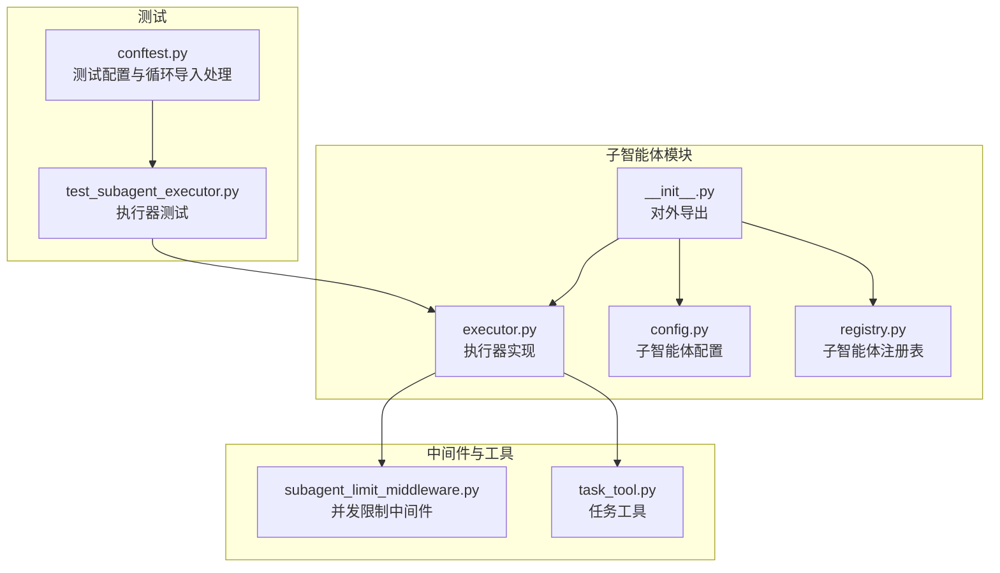
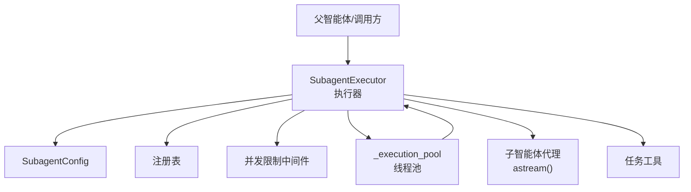
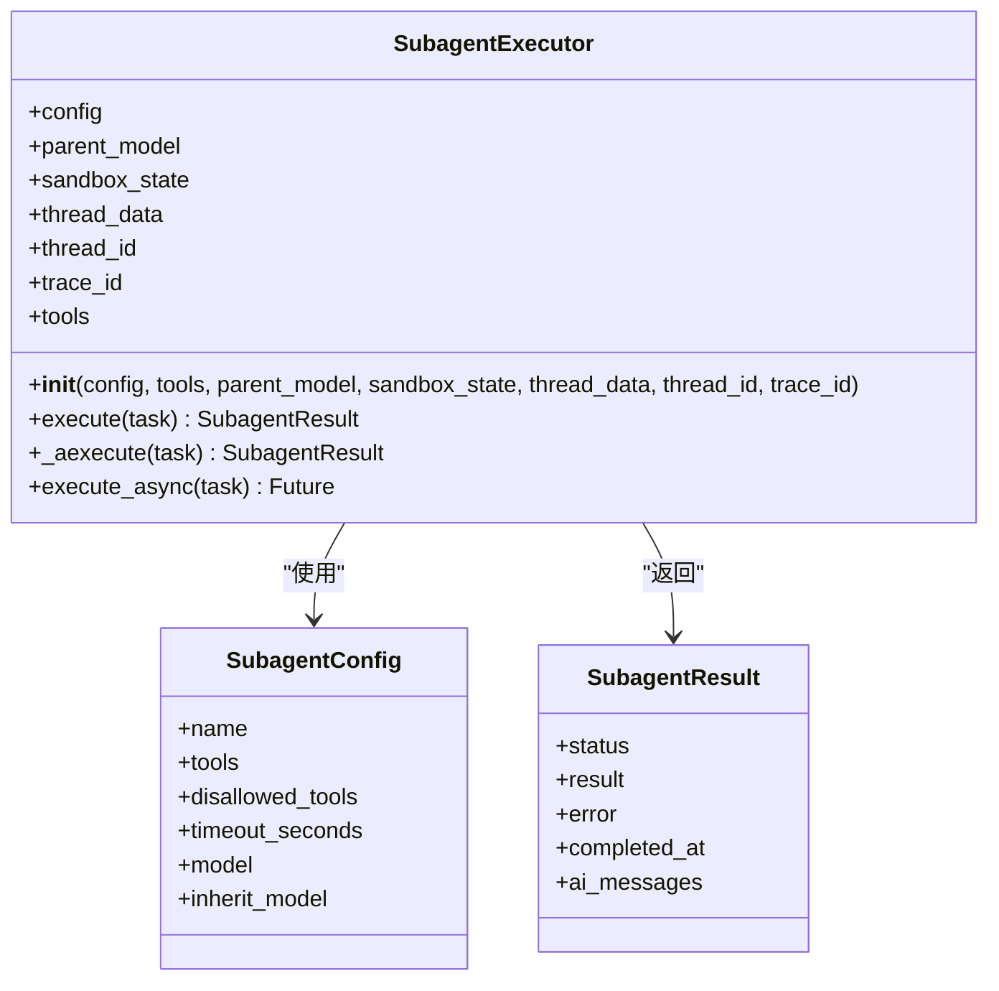
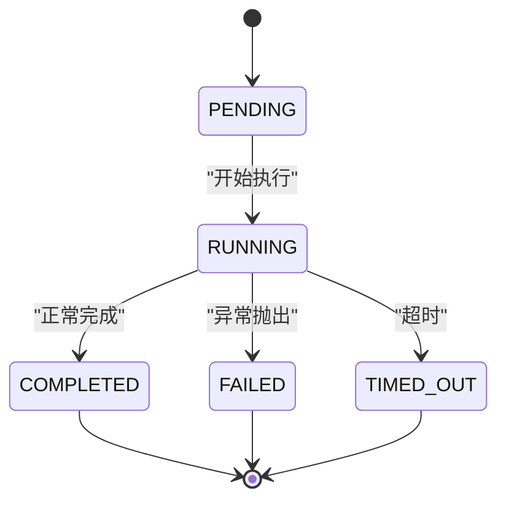
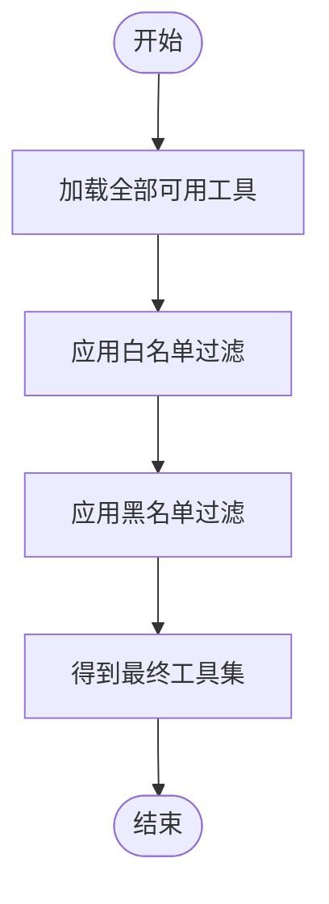
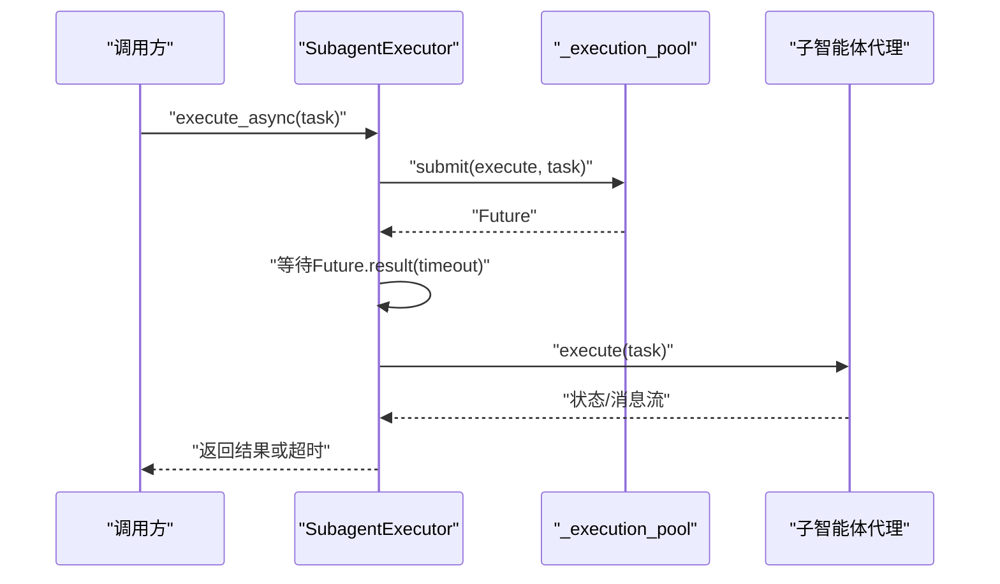
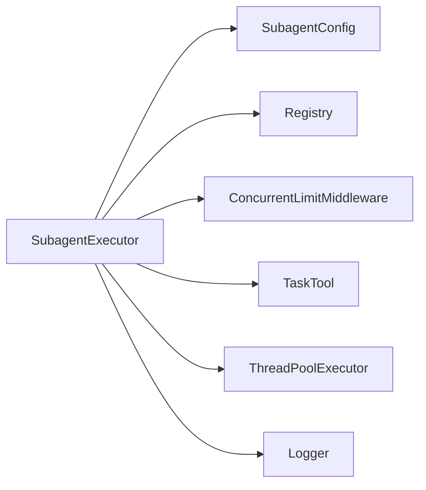

# 子智能体执行器

<cite>
**本文引用的文件**
- [executor.py](file://backend/packages/harness/deerflow/subagents/executor.py)
- [__init__.py](file://backend/packages/harness/deerflow/subagents/__init__.py)
- [config.py](file://backend/packages/harness/deerflow/subagents/config.py)
- [registry.py](file://backend/packages/harness/deerflow/subagents/registry.py)
- [subagent_limit_middleware.py](file://backend/packages/harness/deerflow/agents/middlewares/subagent_limit_middleware.py)
- [task_tool.py](file://backend/packages/harness/deerflow/tools/builtins/task_tool.py)
- [test_subagent_executor.py](file://backend/tests/test_subagent_executor.py)
- [conftest.py](file://backend/tests/conftest.py)
</cite>

## 目录
1. [简介](#简介)
2. [项目结构](#项目结构)
3. [核心组件](#核心组件)
4. [架构总览](#架构总览)
5. [详细组件分析](#详细组件分析)
6. [依赖关系分析](#依赖关系分析)
7. [性能考量](#性能考量)
8. [故障排查指南](#故障排查指南)
9. [结论](#结论)
10. [附录](#附录)

## 简介
本文件面向 DeerFlow 子智能体执行器 SubagentExecutor 的技术文档，系统阐述其设计架构、异步执行机制、线程池管理策略、状态管理（PENDING/RUNNING/COMPLETED/FAILED/TIMED_OUT）、并发控制与超时处理、工具过滤逻辑、模型继承机制以及中间件集成。文档还提供子智能体执行的完整生命周期说明，并对比异步与同步执行差异，解释事件循环与线程池在执行过程中的协作方式。最后给出实际代码示例的路径指引，帮助读者快速上手创建与执行子智能体任务。

## 项目结构
子智能体相关模块位于后端 harness 包内，核心入口与导出由子包的 __init__.py 提供，执行器主体位于 executor.py，配置与注册表分别在 config.py 与 registry.py 中定义。测试用例集中于 tests/test_subagent_executor.py，用于覆盖异步/同步执行路径、并发限制、超时与异常处理等场景。

**图表来源**
- [executor.py:123-442](file://backend/packages/harness/deerflow/subagents/executor.py#L123-L442)
- [config.py](file://backend/packages/harness/deerflow/subagents/config.py)
- [registry.py](file://backend/packages/harness/deerflow/subagents/registry.py)
- [__init__.py:1-11](file://backend/packages/harness/deerflow/subagents/__init__.py#L1-L11)
- [subagent_limit_middleware.py](file://backend/packages/harness/deerflow/agents/middlewares/subagent_limit_middleware.py#L9)
- [task_tool.py](file://backend/packages/harness/deerflow/tools/builtins/task_tool.py#L15)
- [test_subagent_executor.py:0-643](file://backend/tests/test_subagent_executor.py#L0-L643)
- [conftest.py:20-32](file://backend/tests/conftest.py#L20-L32)

**章节来源**
- [__init__.py:1-11](file://backend/packages/harness/deerflow/subagents/__init__.py#L1-L11)
- [executor.py:123-442](file://backend/packages/harness/deerflow/subagents/executor.py#L123-L442)
- [config.py](file://backend/packages/harness/deerflow/subagents/config.py)
- [registry.py](file://backend/packages/harness/deerflow/subagents/registry.py)
- [test_subagent_executor.py:0-643](file://backend/tests/test_subagent_executor.py#L0-L643)
- [conftest.py:20-32](file://backend/tests/conftest.py#L20-L32)

## 核心组件
- SubagentExecutor：子智能体执行器，负责工具过滤、模型继承、线程池调度、状态流转与结果聚合。
- SubagentConfig：子智能体配置对象，包含工具白名单/黑名单、超时时间、模型选择策略等。
- 注册表：提供子智能体配置获取与列表能力，便于运行时按名称加载。
- 并发限制中间件：限制同一父级上下文下同时运行的子智能体数量，避免资源争用。
- 任务工具：与执行器交互，支持后台任务清理与结果查询。

关键职责与行为：
- 工具过滤：根据配置对可用工具进行白/黑名单筛选，确保安全与可控。
- 模型继承：可从父智能体继承模型信息，保证上下文一致性。
- 异步执行：通过线程池提交同步执行方法，配合超时控制与状态更新。
- 状态管理：维护 PENDING/RUNNING/COMPLETED/FAILED/TIMED_OUT 等状态，记录完成时间与错误信息。
- 结果聚合：从最终状态中提取 AI 消息作为结果输出。

**章节来源**
- [executor.py:123-442](file://backend/packages/harness/deerflow/subagents/executor.py#L123-L442)
- [config.py](file://backend/packages/harness/deerflow/subagents/config.py)
- [registry.py](file://backend/packages/harness/deerflow/subagents/registry.py)
- [subagent_limit_middleware.py](file://backend/packages/harness/deerflow/agents/middlewares/subagent_limit_middleware.py#L9)
- [task_tool.py](file://backend/packages/harness/deerflow/tools/builtins/task_tool.py#L15)

## 架构总览
下图展示了子智能体执行器在整体系统中的位置与交互关系：执行器接收配置与工具，结合父模型信息与线程数据，通过线程池执行同步方法并在超时时间内返回结果；并发限制中间件与任务工具参与生命周期管理。

**图表来源**
- [executor.py:123-442](file://backend/packages/harness/deerflow/subagents/executor.py#L123-L442)
- [subagent_limit_middleware.py](file://backend/packages/harness/deerflow/agents/middlewares/subagent_limit_middleware.py#L9)
- [task_tool.py](file://backend/packages/harness/deerflow/tools/builtins/task_tool.py#L15)
- [config.py](file://backend/packages/harness/deerflow/subagents/config.py)
- [registry.py](file://backend/packages/harness/deerflow/subagents/registry.py)

## 详细组件分析

### SubagentExecutor 类设计与生命周期
- 初始化阶段
  - 接收配置、工具集合、父模型、沙箱状态、线程数据、线程 ID 与追踪 ID。
  - 基于配置进行工具过滤，生成 trace_id 以支持分布式追踪。
  - 记录初始化日志，包含配置名与可用工具数。
- 执行阶段
  - 同步执行 execute(task)：在当前线程内完成工具过滤、代理创建、流式执行与状态收集。
  - 异步执行 _aexecute(task)：基于异步流式接口处理消息与状态，最终聚合结果。
  - execute_async(task)：通过线程池提交 execute(task)，设置超时并更新后台任务状态。
- 结果阶段
  - 将最终 AI 消息作为结果返回，记录完成时间与错误信息（如有）。
  - 支持后台任务清理与结果查询接口。

**图表来源**
- [executor.py:123-442](file://backend/packages/harness/deerflow/subagents/executor.py#L123-L442)
- [config.py](file://backend/packages/harness/deerflow/subagents/config.py)
- [__init__.py:1-11](file://backend/packages/harness/deerflow/subagents/__init__.py#L1-L11)

**章节来源**
- [executor.py:123-442](file://backend/packages/harness/deerflow/subagents/executor.py#L123-L442)
- [__init__.py:1-11](file://backend/packages/harness/deerflow/subagents/__init__.py#L1-L11)

### 状态管理与并发控制
- 状态枚举：PENDING/RUNNING/COMPLETED/FAILED/TIMED_OUT，分别对应不同阶段与失败原因。
- 并发控制：通过并发限制中间件限制同一父级上下文下的子智能体并发数，避免资源争用。
- 背景任务：使用全局后台任务字典与锁维护任务状态与结果，线程池执行完成后回写状态。

**图表来源**
- [executor.py:424-442](file://backend/packages/harness/deerflow/subagents/executor.py#L424-L442)
- [subagent_limit_middleware.py](file://backend/packages/harness/deerflow/agents/middlewares/subagent_limit_middleware.py#L9)

**章节来源**
- [executor.py:424-442](file://backend/packages/harness/deerflow/subagents/executor.py#L424-L442)
- [subagent_limit_middleware.py](file://backend/packages/harness/deerflow/agents/middlewares/subagent_limit_middleware.py#L9)

### 工具过滤逻辑
- 白名单优先：仅允许出现在工具白名单内的工具参与执行。
- 黑名单排除：从可用工具中移除黑名单中的工具。
- 过滤函数：在执行器初始化时调用工具过滤函数，得到最终可用工具集。

**图表来源**
- [executor.py:155-160](file://backend/packages/harness/deerflow/subagents/executor.py#L155-L160)

**章节来源**
- [executor.py:155-160](file://backend/packages/harness/deerflow/subagents/executor.py#L155-L160)

### 模型继承机制
- 继承来源：当父智能体提供模型信息时，子智能体可继承该模型，确保上下文一致。
- 配置优先：若子智能体显式配置了模型，则优先使用子配置，否则回退到父模型。
- 传递路径：执行器在初始化时接收 parent_model 参数，并在代理创建时注入模型信息。

**章节来源**
- [executor.py:136-153](file://backend/packages/harness/deerflow/subagents/executor.py#L136-L153)

### 中间件集成
- 并发限制中间件：限制同一父级上下文下同时运行的子智能体数量，防止资源耗尽。
- 任务工具：提供后台任务清理与结果查询接口，便于外部系统监控与回收。

**章节来源**
- [subagent_limit_middleware.py](file://backend/packages/harness/deerflow/agents/middlewares/subagent_limit_middleware.py#L9)
- [task_tool.py](file://backend/packages/harness/deerflow/tools/builtins/task_tool.py#L15)

### 异步执行与同步执行对比
- 同步执行 execute(task)
  - 在当前线程内完成工具过滤、代理创建、流式执行与状态收集。
  - 适合短时任务或需要严格顺序控制的场景。
- 异步执行 _aexecute(task)
  - 基于异步流式接口处理消息与状态，适合长时任务与高吞吐场景。
- 线程池执行 execute_async(task)
  - 通过线程池提交 execute(task)，设置超时并更新后台任务状态，适合批量调度与资源隔离。

**图表来源**
- [executor.py:424-442](file://backend/packages/harness/deerflow/subagents/executor.py#L424-L442)

**章节来源**
- [executor.py:424-442](file://backend/packages/harness/deerflow/subagents/executor.py#L424-L442)

### 完整生命周期示例（路径指引）
以下示例均来自测试文件，展示从初始化到结果返回的关键步骤与断言：

- 异常处理示例
  - 路径：[test_subagent_executor.py:296-314](file://backend/tests/test_subagent_executor.py#L296-L314)
  - 关键点：捕获代理执行异常，返回 FAILED 状态并记录错误信息。
- 无最终状态处理示例
  - 路径：[test_subagent_executor.py:317-337](file://backend/tests/test_subagent_executor.py#L317-L337)
  - 关键点：当流式迭代器为空时，正确处理无最终状态的情况。
- 线程池同步执行示例
  - 路径：[test_subagent_executor.py:396-431](file://backend/tests/test_subagent_executor.py#L396-L431)
  - 关键点：模拟线程池提交 execute(task)，验证 COMPLETED 状态与结果提取。
- 超时处理示例
  - 路径：[test_subagent_executor.py:432-442](file://backend/tests/test_subagent_executor.py#L432-L442)
  - 关键点：Future.result(timeout) 触发超时，状态更新为 TIMED_OUT。

**章节来源**
- [test_subagent_executor.py:296-314](file://backend/tests/test_subagent_executor.py#L296-L314)
- [test_subagent_executor.py:317-337](file://backend/tests/test_subagent_executor.py#L317-L337)
- [test_subagent_executor.py:396-431](file://backend/tests/test_subagent_executor.py#L396-L431)
- [test_subagent_executor.py:432-442](file://backend/tests/test_subagent_executor.py#L432-L442)

## 依赖关系分析
- 内部依赖
  - 执行器依赖配置与注册表获取子智能体定义，依赖并发限制中间件与任务工具参与生命周期管理。
- 外部依赖
  - 线程池：使用标准库 concurrent.futures.ThreadPoolExecutor 管理并发执行。
  - 日志：使用 logger 记录初始化与超时等关键事件。
- 循环导入处理
  - 测试中通过 sys.modules 模拟执行器模块，避免循环导入问题。

**图表来源**
- [executor.py:123-442](file://backend/packages/harness/deerflow/subagents/executor.py#L123-L442)
- [subagent_limit_middleware.py](file://backend/packages/harness/deerflow/agents/middlewares/subagent_limit_middleware.py#L9)
- [task_tool.py](file://backend/packages/harness/deerflow/tools/builtins/task_tool.py#L15)
- [conftest.py:20-32](file://backend/tests/conftest.py#L20-L32)

**章节来源**
- [executor.py:123-442](file://backend/packages/harness/deerflow/subagents/executor.py#L123-L442)
- [subagent_limit_middleware.py](file://backend/packages/harness/deerflow/agents/middlewares/subagent_limit_middleware.py#L9)
- [task_tool.py](file://backend/packages/harness/deerflow/tools/builtins/task_tool.py#L15)
- [conftest.py:20-32](file://backend/tests/conftest.py#L20-L32)

## 性能考量
- 线程池大小：合理设置线程池容量，避免过多线程导致上下文切换开销增大。
- 超时策略：为每个子智能体任务设置合理的超时时间，防止长时间阻塞影响整体吞吐。
- 工具过滤：在初始化阶段完成工具过滤，减少运行时开销。
- 并发限制：通过中间件限制并发数，平衡资源占用与执行效率。
- 结果聚合：尽量在执行器内部完成结果聚合，减少跨层传输成本。

## 故障排查指南
- 代理异常
  - 现象：执行过程中抛出异常，状态为 FAILED。
  - 排查：检查代理创建与工具过滤逻辑，确认异常是否被捕获并记录。
  - 参考：[test_subagent_executor.py:296-314](file://backend/tests/test_subagent_executor.py#L296-L314)
- 无最终状态
  - 现象：流式迭代器为空，无法确定最终状态。
  - 排查：检查代理实现是否正确产生最终状态，或调整超时策略。
  - 参考：[test_subagent_executor.py:317-337](file://backend/tests/test_subagent_executor.py#L317-L337)
- 线程池同步执行失败
  - 现象：线程池提交 execute(task) 返回异常或超时。
  - 排查：确认线程池容量与任务超时设置，检查代理是否阻塞。
  - 参考：[test_subagent_executor.py:396-431](file://backend/tests/test_subagent_executor.py#L396-L431)
- 超时处理
  - 现象：Future.result(timeout) 抛出超时异常，状态为 TIMED_OUT。
  - 排查：适当增加超时时间或优化代理执行逻辑。
  - 参考：[test_subagent_executor.py:432-442](file://backend/tests/test_subagent_executor.py#L432-L442)
- 循环导入
  - 现象：测试中出现循环导入错误。
  - 排查：使用 sys.modules 模拟模块，避免导入顺序问题。
  - 参考：[conftest.py:20-32](file://backend/tests/conftest.py#L20-L32)

**章节来源**
- [test_subagent_executor.py:296-314](file://backend/tests/test_subagent_executor.py#L296-L314)
- [test_subagent_executor.py:317-337](file://backend/tests/test_subagent_executor.py#L317-L337)
- [test_subagent_executor.py:396-431](file://backend/tests/test_subagent_executor.py#L396-L431)
- [test_subagent_executor.py:432-442](file://backend/tests/test_subagent_executor.py#L432-L442)
- [conftest.py:20-32](file://backend/tests/conftest.py#L20-L32)

## 结论
SubagentExecutor 通过清晰的生命周期设计、严格的工具过滤与模型继承机制、稳健的线程池调度与超时控制，实现了子智能体的高效、可控与可观测执行。配合并发限制中间件与任务工具，系统能够在复杂场景下保持稳定性与可扩展性。建议在生产环境中结合业务特点调整线程池大小、超时阈值与并发上限，并持续完善日志与监控体系以提升可观测性。

## 附录
- 快速上手示例（路径指引）
  - 创建执行器并执行任务：参考 [test_subagent_executor.py:396-431](file://backend/tests/test_subagent_executor.py#L396-L431)
  - 处理异常与超时：参考 [test_subagent_executor.py:296-314](file://backend/tests/test_subagent_executor.py#L296-L314) 与 [test_subagent_executor.py:432-442](file://backend/tests/test_subagent_executor.py#L432-L442)
- 相关配置与注册
  - 子智能体配置：[config.py](file://backend/packages/harness/deerflow/subagents/config.py)
  - 子智能体注册表：[registry.py](file://backend/packages/harness/deerflow/subagents/registry.py)