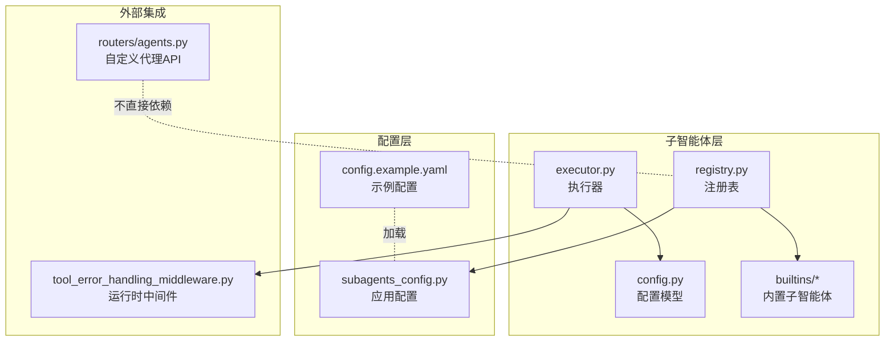
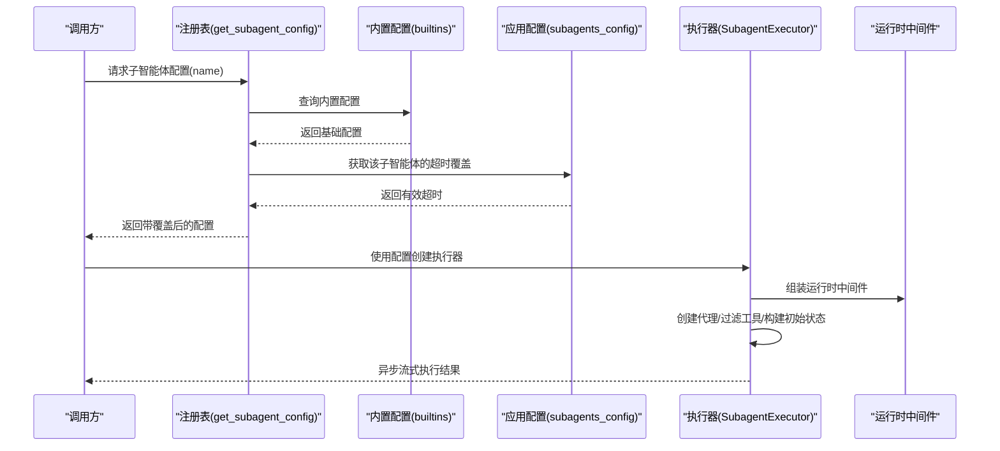
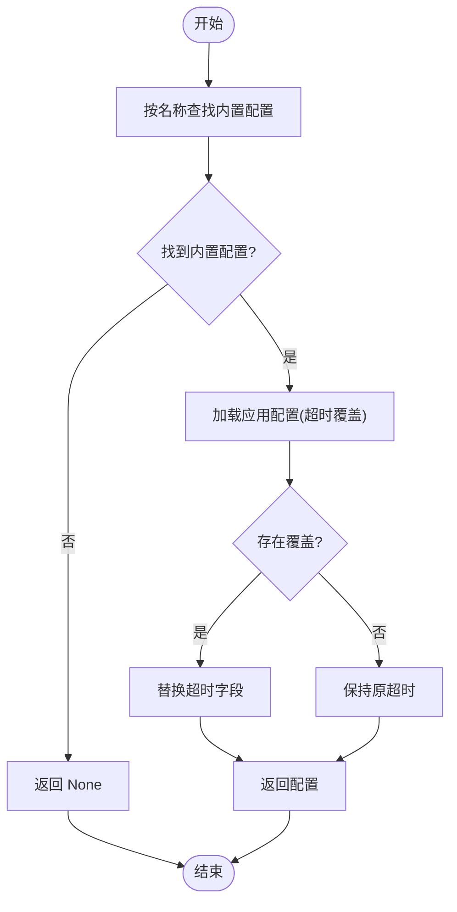
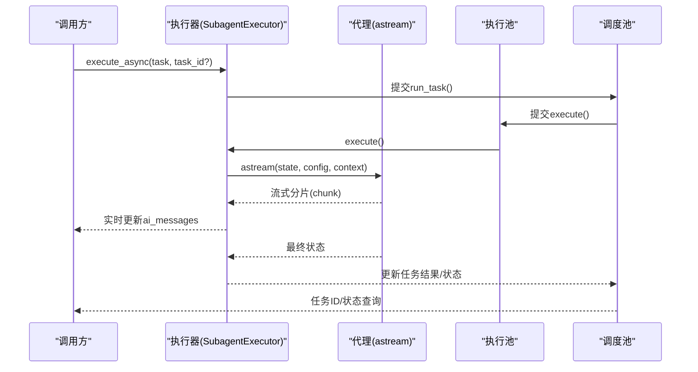
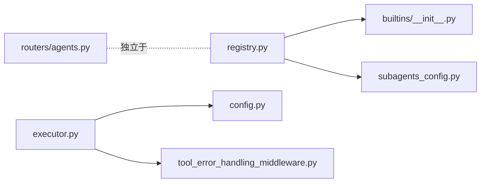

# 子智能体注册表

<cite>
**本文引用的文件**
- [backend/packages/harness/deerflow/subagents/__init__.py](file://backend/packages/harness/deerflow/subagents/__init__.py)
- [backend/packages/harness/deerflow/subagents/registry.py](file://backend/packages/harness/deerflow/subagents/registry.py)
- [backend/packages/harness/deerflow/subagents/config.py](file://backend/packages/harness/deerflow/subagents/config.py)
- [backend/packages/harness/deerflow/subagents/executor.py](file://backend/packages/harness/deerflow/subagents/executor.py)
- [backend/packages/harness/deerflow/subagents/builtins/__init__.py](file://backend/packages/harness/deerflow/subagents/builtins/__init__.py)
- [backend/packages/harness/deerflow/subagents/builtins/bash_agent.py](file://backend/packages/harness/deerflow/subagents/builtins/bash_agent.py)
- [backend/packages/harness/deerflow/subagents/builtins/general_purpose.py](file://backend/packages/harness/deerflow/subagents/builtins/general_purpose.py)
- [backend/packages/harness/deerflow/config/subagents_config.py](file://backend/packages/harness/deerflow/config/subagents_config.py)
- [backend/app/gateway/routers/agents.py](file://backend/app/gateway/routers/agents.py)
- [config.example.yaml](file://config.example.yaml)
- [backend/tests/test_subagent_executor.py](file://backend/tests/test_subagent_executor.py)
- [backend/packages/harness/deerflow/agents/middlewares/tool_error_handling_middleware.py](file://backend/packages/harness/deerflow/agents/middlewares/tool_error_handling_middleware.py)
</cite>

## 目录
1. [引言](#引言)
2. [项目结构](#项目结构)
3. [核心组件](#核心组件)
4. [架构总览](#架构总览)
5. [详细组件分析](#详细组件分析)
6. [依赖分析](#依赖分析)
7. [性能考虑](#性能考虑)
8. [故障排查指南](#故障排查指南)
9. [结论](#结论)
10. [附录：配置与使用示例](#附录配置与使用示例)

## 引言
本文件面向 DeerFlow 的“子智能体注册表”系统，系统性阐述其架构设计、子智能体发现与动态加载策略、配置的存储与检索与验证流程，并深入解析内置子智能体（bash_agent、general_purpose）的实现与使用场景。同时说明子智能体注册表与配置系统的集成关系、如何通过配置文件管理子智能体定义，以及扩展与自定义注册的完整流程。文末提供可操作的配置示例与典型使用场景。

## 项目结构
子智能体相关代码集中在后端 harness 包中，核心模块如下：
- 注册表与导出入口：subagents/__init__.py、subagents/registry.py
- 配置模型：subagents/config.py
- 执行引擎：subagents/executor.py
- 内置子智能体：subagents/builtins/*
- 应用级子智能体配置：deerflow/config/subagents_config.py
- 自定义代理（与子智能体概念不同但同属代理体系）：backend/app/gateway/routers/agents.py
- 示例配置：config.example.yaml
- 测试：backend/tests/test_subagent_executor.py
- 中间件：deerflow/agents/middlewares/tool_error_handling_middleware.py

图表来源
- [backend/packages/harness/deerflow/subagents/registry.py:1-53](file://backend/packages/harness/deerflow/subagents/registry.py#L1-L53)
- [backend/packages/harness/deerflow/subagents/config.py:1-29](file://backend/packages/harness/deerflow/subagents/config.py#L1-L29)
- [backend/packages/harness/deerflow/subagents/executor.py:1-517](file://backend/packages/harness/deerflow/subagents/executor.py#L1-L517)
- [backend/packages/harness/deerflow/subagents/builtins/__init__.py:1-16](file://backend/packages/harness/deerflow/subagents/builtins/__init__.py#L1-L16)
- [backend/packages/harness/deerflow/config/subagents_config.py:1-66](file://backend/packages/harness/deerflow/config/subagents_config.py#L1-L66)
- [backend/app/gateway/routers/agents.py:1-384](file://backend/app/gateway/routers/agents.py#L1-L384)
- [config.example.yaml:373-388](file://config.example.yaml#L373-L388)
- [backend/packages/harness/deerflow/agents/middlewares/tool_error_handling_middleware.py:1-138](file://backend/packages/harness/deerflow/agents/middlewares/tool_error_handling_middleware.py#L1-L138)

章节来源
- [backend/packages/harness/deerflow/subagents/__init__.py:1-12](file://backend/packages/harness/deerflow/subagents/__init__.py#L1-L12)
- [backend/packages/harness/deerflow/subagents/registry.py:1-53](file://backend/packages/harness/deerflow/subagents/registry.py#L1-L53)
- [backend/packages/harness/deerflow/subagents/config.py:1-29](file://backend/packages/harness/deerflow/subagents/config.py#L1-L29)
- [backend/packages/harness/deerflow/subagents/executor.py:1-517](file://backend/packages/harness/deerflow/subagents/executor.py#L1-L517)
- [backend/packages/harness/deerflow/subagents/builtins/__init__.py:1-16](file://backend/packages/harness/deerflow/subagents/builtins/__init__.py#L1-L16)
- [backend/packages/harness/deerflow/config/subagents_config.py:1-66](file://backend/packages/harness/deerflow/config/subagents_config.py#L1-L66)
- [backend/app/gateway/routers/agents.py:1-384](file://backend/app/gateway/routers/agents.py#L1-L384)
- [config.example.yaml:373-388](file://config.example.yaml#L373-L388)
- [backend/tests/test_subagent_executor.py:1-774](file://backend/tests/test_subagent_executor.py#L1-L774)
- [backend/packages/harness/deerflow/agents/middlewares/tool_error_handling_middleware.py:1-138](file://backend/packages/harness/deerflow/agents/middlewares/tool_error_handling_middleware.py#L1-L138)

## 核心组件
- 注册表（registry）
  - 提供按名称查询子智能体配置的能力，并在返回前应用来自应用配置的超时覆盖。
  - 暴露列出所有可用子智能体与仅获取名称列表的接口。
- 配置模型（SubagentConfig）
  - 定义子智能体的关键字段：名称、描述、系统提示词、允许/禁止工具清单、模型继承策略、最大轮次、超时秒数等。
- 执行引擎（SubagentExecutor）
  - 负责创建代理实例、过滤工具、构建初始状态、异步流式执行、收集中间消息、错误处理、并发调度与后台任务管理。
- 内置子智能体（builtins）
  - 提供 bash 与 general-purpose 两类内置配置，分别面向命令执行与通用复杂任务。
- 应用配置（SubagentsAppConfig）
  - 从配置文件加载全局默认超时与按子智能体的覆盖项；提供读取有效超时的便捷方法。
- 运行时中间件
  - 为子智能体运行时注入线程数据、沙箱、守卫等中间件，统一错误处理策略。

章节来源
- [backend/packages/harness/deerflow/subagents/registry.py:12-53](file://backend/packages/harness/deerflow/subagents/registry.py#L12-L53)
- [backend/packages/harness/deerflow/subagents/config.py:6-29](file://backend/packages/harness/deerflow/subagents/config.py#L6-L29)
- [backend/packages/harness/deerflow/subagents/executor.py:123-517](file://backend/packages/harness/deerflow/subagents/executor.py#L123-L517)
- [backend/packages/harness/deerflow/subagents/builtins/bash_agent.py:5-47](file://backend/packages/harness/deerflow/subagents/builtins/bash_agent.py#L5-L47)
- [backend/packages/harness/deerflow/subagents/builtins/general_purpose.py:5-48](file://backend/packages/harness/deerflow/subagents/builtins/general_purpose.py#L5-L48)
- [backend/packages/harness/deerflow/config/subagents_config.py:20-66](file://backend/packages/harness/deerflow/config/subagents_config.py#L20-L66)
- [backend/packages/harness/deerflow/agents/middlewares/tool_error_handling_middleware.py:68-138](file://backend/packages/harness/deerflow/agents/middlewares/tool_error_handling_middleware.py#L68-L138)

## 架构总览
下图展示子智能体注册表与执行引擎、配置系统及中间件之间的交互关系：

图表来源
- [backend/packages/harness/deerflow/subagents/registry.py:12-34](file://backend/packages/harness/deerflow/subagents/registry.py#L12-L34)
- [backend/packages/harness/deerflow/subagents/builtins/__init__.py:12-16](file://backend/packages/harness/deerflow/subagents/builtins/__init__.py#L12-L16)
- [backend/packages/harness/deerflow/config/subagents_config.py:33-46](file://backend/packages/harness/deerflow/config/subagents_config.py#L33-L46)
- [backend/packages/harness/deerflow/subagents/executor.py:164-181](file://backend/packages/harness/deerflow/subagents/executor.py#L164-L181)
- [backend/packages/harness/deerflow/agents/middlewares/tool_error_handling_middleware.py:68-138](file://backend/packages/harness/deerflow/agents/middlewares/tool_error_handling_middleware.py#L68-L138)

## 详细组件分析

### 注册表与发现机制
- 发现路径
  - 通过内置注册表字典映射名称到配置对象。
  - 若未找到内置项则返回空。
- 动态加载与覆盖
  - 在返回配置前，读取应用配置中的 per-agent 覆盖项，若存在则替换超时字段。
  - 日志记录覆盖生效情况，便于调试。
- 列表与名称
  - 提供列出全部配置与仅列出名称的接口，便于 UI 或控制台展示。

图表来源
- [backend/packages/harness/deerflow/subagents/registry.py:12-34](file://backend/packages/harness/deerflow/subagents/registry.py#L12-L34)
- [backend/packages/harness/deerflow/config/subagents_config.py:33-46](file://backend/packages/harness/deerflow/config/subagents_config.py#L33-L46)

章节来源
- [backend/packages/harness/deerflow/subagents/registry.py:12-53](file://backend/packages/harness/deerflow/subagents/registry.py#L12-L53)
- [backend/packages/harness/deerflow/subagents/builtins/__init__.py:12-16](file://backend/packages/harness/deerflow/subagents/builtins/__init__.py#L12-L16)
- [backend/packages/harness/deerflow/config/subagents_config.py:33-46](file://backend/packages/harness/deerflow/config/subagents_config.py#L33-L46)

### 配置模型与存储/检索/验证
- 数据结构
  - SubagentConfig 使用数据类定义，包含名称、描述、系统提示词、工具白/黑名单、模型继承策略、最大轮次、超时秒数等。
- 存储位置
  - 内置配置以常量形式存在于 builtins 模块中。
  - 应用配置（如 per-agent 超时）来源于配置文件，通过应用配置模块加载。
- 检索与合并
  - 注册表在返回配置时合并应用配置的覆盖项。
- 验证
  - 应用配置采用 Pydantic 模型校验字段类型与范围（如超时非负），并在加载时输出日志摘要。

章节来源
- [backend/packages/harness/deerflow/subagents/config.py:6-29](file://backend/packages/harness/deerflow/subagents/config.py#L6-L29)
- [backend/packages/harness/deerflow/subagents/builtins/bash_agent.py:5-47](file://backend/packages/harness/deerflow/subagents/builtins/bash_agent.py#L5-L47)
- [backend/packages/harness/deerflow/subagents/builtins/general_purpose.py:5-48](file://backend/packages/harness/deerflow/subagents/builtins/general_purpose.py#L5-L48)
- [backend/packages/harness/deerflow/config/subagents_config.py:10-66](file://backend/packages/harness/deerflow/config/subagents_config.py#L10-L66)

### 执行引擎与并发策略
- 工具过滤
  - 支持 allowlist 与 denylist 双重过滤，先按 allowlist缩小再按 denylist剔除。
- 模型选择
  - 支持“继承父模型”或显式指定模型名。
- 状态与上下文
  - 将线程 ID、沙箱状态、线程数据透传至执行上下文，确保隔离与一致性。
- 异步流式执行
  - 使用流式 astream 实时捕获 AI 消息，避免阻塞；支持列表型内容拼接。
- 错误处理
  - 捕获异常并标记失败状态；对同步调用通过 asyncio.run 在线程池中安全运行。
- 并发与后台任务
  - 两套线程池：调度池与执行池；支持后台任务提交、定时超时取消、结果查询与清理。
  - 清理策略：仅在终端态（完成/失败/超时）或明确完成时间戳存在时移除，避免竞态。

图表来源
- [backend/packages/harness/deerflow/subagents/executor.py:391-453](file://backend/packages/harness/deerflow/subagents/executor.py#L391-L453)
- [backend/packages/harness/deerflow/subagents/executor.py:203-349](file://backend/packages/harness/deerflow/subagents/executor.py#L203-L349)

章节来源
- [backend/packages/harness/deerflow/subagents/executor.py:78-121](file://backend/packages/harness/deerflow/subagents/executor.py#L78-L121)
- [backend/packages/harness/deerflow/subagents/executor.py:164-181](file://backend/packages/harness/deerflow/subagents/executor.py#L164-L181)
- [backend/packages/harness/deerflow/subagents/executor.py:203-349](file://backend/packages/harness/deerflow/subagents/executor.py#L203-L349)
- [backend/packages/harness/deerflow/subagents/executor.py:391-453](file://backend/packages/harness/deerflow/subagents/executor.py#L391-L453)
- [backend/packages/harness/deerflow/subagents/executor.py:459-517](file://backend/packages/harness/deerflow/subagents/executor.py#L459-L517)

### 内置子智能体：bash_agent
- 角色定位
  - 命令执行专家，适合需要在独立上下文中执行一系列相关命令、构建/测试/部署等场景。
- 工具集
  - 限定为沙箱工具集（如 bash、ls、read_file、write_file、str_replace），避免与主流程混杂。
- 行为约束
  - 明确禁止 task、ask_clarification、present_files 等，防止嵌套与澄清请求。
- 上下文
  - 指定工作目录与用户上传/工作区/输出目录的访问路径。

章节来源
- [backend/packages/harness/deerflow/subagents/builtins/bash_agent.py:5-47](file://backend/packages/harness/deerflow/subagents/builtins/bash_agent.py#L5-L47)

### 内置子智能体：general_purpose
- 角色定位
  - 通用型子智能体，适用于需要探索与行动结合、多步骤依赖、复杂推理的任务。
- 工具集
  - 默认继承父级全部工具，但同样禁止 task、ask_clarification、present_files，避免重复委托与澄清。
- 输出规范
  - 明确输出格式要求，强调摘要、关键发现、文件路径、问题与引用格式。
- 上下文
  - 与父级共享相同的沙箱环境路径。

章节来源
- [backend/packages/harness/deerflow/subagents/builtins/general_purpose.py:5-48](file://backend/packages/harness/deerflow/subagents/builtins/general_purpose.py#L5-L48)

### 与配置系统的集成
- 配置来源
  - config.example.yaml 中提供 subagents 段落示例，包含全局默认超时与 per-agent 超时覆盖。
- 加载与应用
  - 应用配置模块负责解析并缓存配置，提供按子智能体查询有效超时的方法。
  - 注册表在返回配置时应用该超时覆盖，确保运行期行为与配置一致。

章节来源
- [config.example.yaml:373-388](file://config.example.yaml#L373-L388)
- [backend/packages/harness/deerflow/config/subagents_config.py:51-66](file://backend/packages/harness/deerflow/config/subagents_config.py#L51-L66)
- [backend/packages/harness/deerflow/subagents/registry.py:25-34](file://backend/packages/harness/deerflow/subagents/registry.py#L25-L34)

### 与自定义代理的区别与关系
- 自定义代理（agents API）
  - 用于管理“自定义代理”，通过文件系统存储配置与 SOUL.md，提供 CRUD 接口。
  - 与子智能体注册表属于不同维度：前者面向“人设/角色”的自定义，后者面向“任务委派”的子智能体。
- 关系
  - 两者均位于后端网关路由中，但职责分离；子智能体注册表不依赖自定义代理的文件系统。

章节来源
- [backend/app/gateway/routers/agents.py:1-384](file://backend/app/gateway/routers/agents.py#L1-L384)

## 依赖分析
- 组件内聚与耦合
  - 注册表与内置配置强耦合（名称到配置的映射），但通过延迟导入避免循环依赖。
  - 执行引擎依赖配置模型、中间件与模型工厂，耦合度适中。
- 外部依赖
  - 语言模型与工具链由上层模块提供；执行引擎通过中间件注入运行时能力。
- 循环依赖规避
  - 注册表在需要时才导入应用配置模块，避免循环导入。

图表来源
- [backend/packages/harness/deerflow/subagents/registry.py:6-28](file://backend/packages/harness/deerflow/subagents/registry.py#L6-L28)
- [backend/packages/harness/deerflow/subagents/builtins/__init__.py:12-16](file://backend/packages/harness/deerflow/subagents/builtins/__init__.py#L12-L16)
- [backend/packages/harness/deerflow/config/subagents_config.py:51-59](file://backend/packages/harness/deerflow/config/subagents_config.py#L51-L59)
- [backend/packages/harness/deerflow/subagents/executor.py:169-172](file://backend/packages/harness/deerflow/subagents/executor.py#L169-L172)
- [backend/packages/harness/deerflow/agents/middlewares/tool_error_handling_middleware.py:75-81](file://backend/packages/harness/deerflow/agents/middlewares/tool_error_handling_middleware.py#L75-L81)
- [backend/app/gateway/routers/agents.py:1-15](file://backend/app/gateway/routers/agents.py#L1-L15)

章节来源
- [backend/packages/harness/deerflow/subagents/registry.py:6-34](file://backend/packages/harness/deerflow/subagents/registry.py#L6-L34)
- [backend/packages/harness/deerflow/subagents/executor.py:169-172](file://backend/packages/harness/deerflow/subagents/executor.py#L169-L172)
- [backend/packages/harness/deerflow/agents/middlewares/tool_error_handling_middleware.py:75-81](file://backend/packages/harness/deerflow/agents/middlewares/tool_error_handling_middleware.py#L75-L81)
- [backend/app/gateway/routers/agents.py:1-15](file://backend/app/gateway/routers/agents.py#L1-L15)

## 性能考虑
- 并发与资源
  - 两套线程池分离调度与执行，避免阻塞；建议根据任务特性调整池大小。
- 超时控制
  - 通过应用配置为不同子智能体设置合理超时，避免长时间占用资源。
- 流式处理
  - 使用流式 astream 减少等待时间，提升可观测性与实时反馈。
- 清理策略
  - 后台任务清理仅在终端态或明确完成时间戳存在时进行，降低内存泄漏风险。

[本节为通用指导，无需特定文件来源]

## 故障排查指南
- 执行失败
  - 检查中间件是否正确注入，确认工具过滤规则是否导致工具缺失。
  - 查看执行器日志中的异常堆栈与状态码。
- 超时问题
  - 核对应用配置中的 per-agent 超时设置；必要时提高复杂任务的超时值。
- 并发冲突
  - 确认后台任务清理时机，避免在 RUNNING/PENDING 状态时清理。
- 单元测试参考
  - 可参考测试文件中对异步工具支持、同步包装、并发执行与清理逻辑的断言。

章节来源
- [backend/tests/test_subagent_executor.py:181-774](file://backend/tests/test_subagent_executor.py#L181-L774)
- [backend/packages/harness/deerflow/subagents/executor.py:459-517](file://backend/packages/harness/deerflow/subagents/executor.py#L459-L517)

## 结论
子智能体注册表通过“内置配置 + 应用配置覆盖”的双层设计，实现了灵活而可控的子智能体发现与动态加载。执行引擎以流式异步为核心，配合严格的工具过滤、模型继承与并发控制，保障了复杂任务的稳定性与可观测性。内置 bash 与 general-purpose 子智能体分别覆盖了命令执行与通用复杂任务两大场景。通过配置文件即可完成超时等关键参数的集中管理，满足生产环境的可运维性需求。

[本节为总结，无需特定文件来源]

## 附录：配置与使用示例

### 如何通过配置文件管理子智能体定义
- 全局默认超时与 per-agent 覆盖
  - 在配置文件中设置 subagents 段落，定义全局 timeout_seconds 与 agents 下的覆盖项。
  - 应用启动时加载配置，注册表在返回配置时自动应用覆盖。

章节来源
- [config.example.yaml:373-388](file://config.example.yaml#L373-L388)
- [backend/packages/harness/deerflow/config/subagents_config.py:56-66](file://backend/packages/harness/deerflow/config/subagents_config.py#L56-L66)
- [backend/packages/harness/deerflow/subagents/registry.py:25-34](file://backend/packages/harness/deerflow/subagents/registry.py#L25-L34)

### 内置子智能体使用场景
- bash 子智能体
  - 场景：批量命令执行、构建/测试/部署流水线、需要隔离输出的终端操作。
  - 注意：不适合单条简单命令，应优先使用直接工具。
- general-purpose 子智能体
  - 场景：需要探索与修改结合、多步骤依赖、复杂推理与结果汇总的任务。
  - 注意：避免嵌套与澄清请求，确保任务边界清晰。

章节来源
- [backend/packages/harness/deerflow/subagents/builtins/bash_agent.py:7-15](file://backend/packages/harness/deerflow/subagents/builtins/bash_agent.py#L7-L15)
- [backend/packages/harness/deerflow/subagents/builtins/general_purpose.py:7-15](file://backend/packages/harness/deerflow/subagents/builtins/general_purpose.py#L7-L15)

### 扩展与自定义注册流程（基于现有架构）
- 步骤
  - 定义新的 SubagentConfig 实例，放置于内置注册表中（例如在 builtins 目录新增模块并加入 __all__ 与注册字典）。
  - 在应用配置中为新子智能体设置 per-agent 超时（可选）。
  - 通过注册表接口按名称获取配置并创建执行器，即可投入运行。
- 注意事项
  - 确保工具白/黑名单与模型策略符合预期。
  - 对复杂任务适当提高超时，避免过早中断。
  - 如需特殊中间件，可在执行器初始化时扩展中间件组合。

章节来源
- [backend/packages/harness/deerflow/subagents/builtins/__init__.py:12-16](file://backend/packages/harness/deerflow/subagents/builtins/__init__.py#L12-L16)
- [backend/packages/harness/deerflow/config/subagents_config.py:33-46](file://backend/packages/harness/deerflow/config/subagents_config.py#L33-L46)
- [backend/packages/harness/deerflow/subagents/registry.py:12-34](file://backend/packages/harness/deerflow/subagents/registry.py#L12-L34)