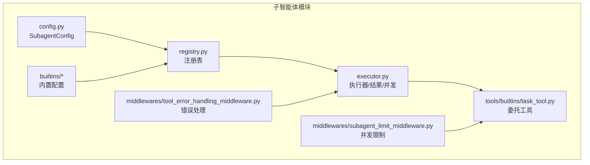
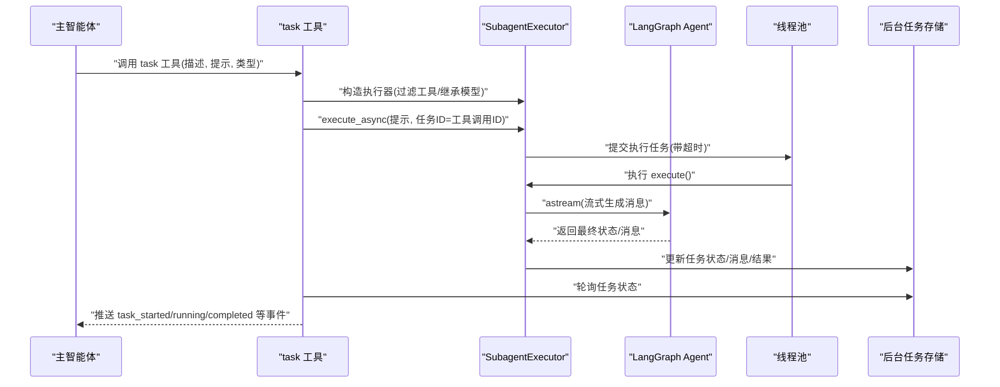
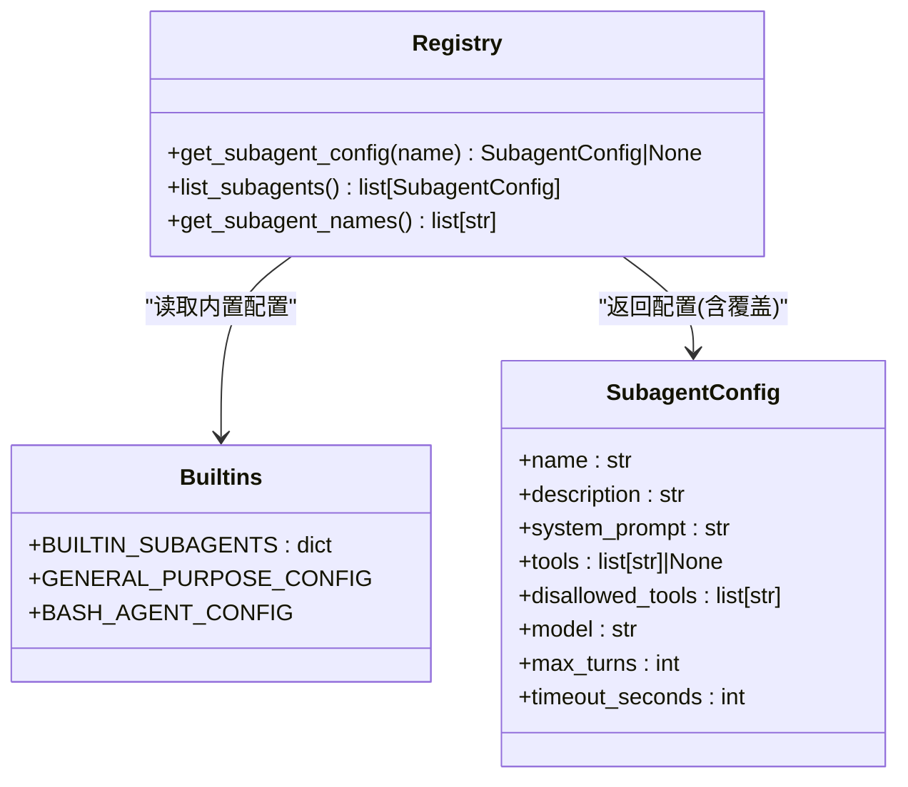
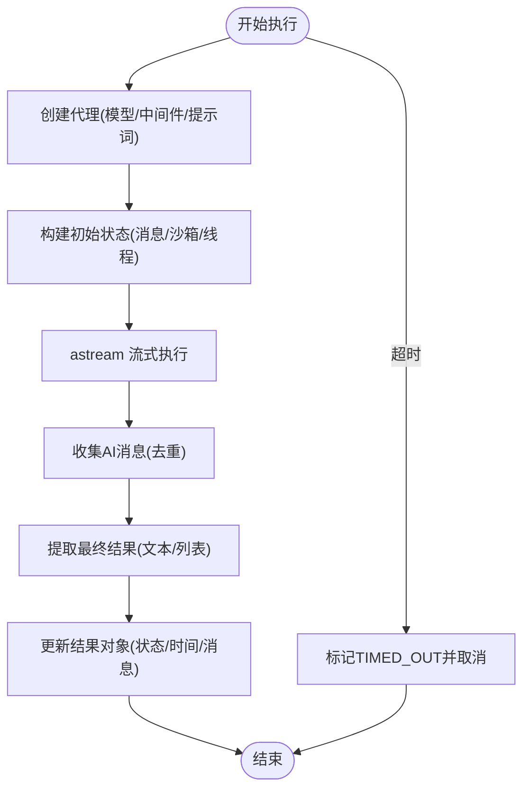
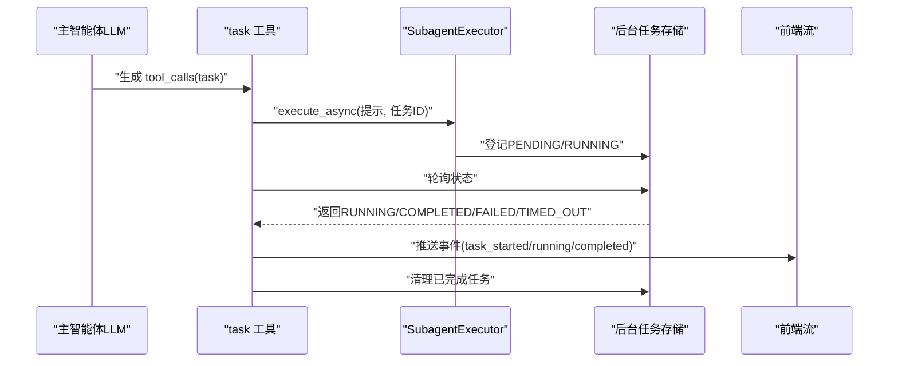
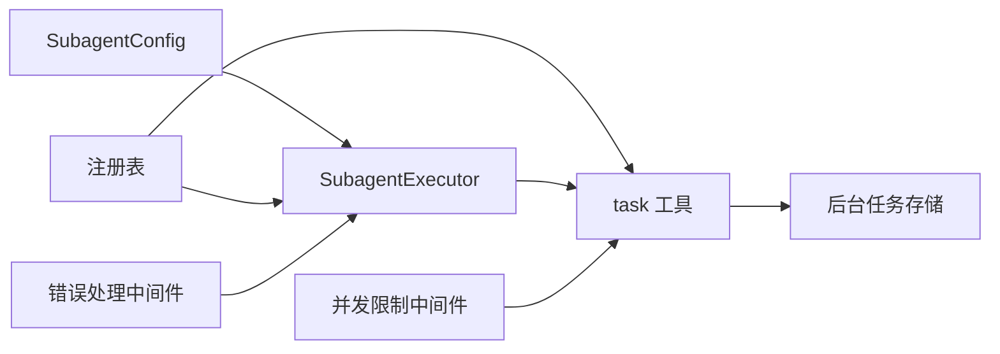

# 子智能体系统

<cite>
**本文引用的文件**
- [backend/packages/harness/deerflow/subagents/__init__.py](file://backend/packages/harness/deerflow/subagents/__init__.py)
- [backend/packages/harness/deerflow/subagents/config.py](file://backend/packages/harness/deerflow/subagents/config.py)
- [backend/packages/harness/deerflow/subagents/executor.py](file://backend/packages/harness/deerflow/subagents/executor.py)
- [backend/packages/harness/deerflow/subagents/registry.py](file://backend/packages/harness/deerflow/subagents/registry.py)
- [backend/packages/harness/deerflow/subagents/builtins/__init__.py](file://backend/packages/harness/deerflow/subagents/builtins/__init__.py)
- [backend/packages/harness/deerflow/subagents/builtins/general_purpose.py](file://backend/packages/harness/deerflow/subagents/builtins/general_purpose.py)
- [backend/packages/harness/deerflow/subagents/builtins/bash_agent.py](file://backend/packages/harness/deerflow/subagents/builtins/bash_agent.py)
- [backend/packages/harness/deerflow/config/subagents_config.py](file://backend/packages/harness/deerflow/config/subagents_config.py)
- [backend/packages/harness/deerflow/tools/builtins/task_tool.py](file://backend/packages/harness/deerflow/tools/builtins/task_tool.py)
- [backend/packages/harness/deerflow/agents/middlewares/subagent_limit_middleware.py](file://backend/packages/harness/deerflow/agents/middlewares/subagent_limit_middleware.py)
- [backend/packages/harness/deerflow/agents/middlewares/tool_error_handling_middleware.py](file://backend/packages/harness/deerflow/agents/middlewares/tool_error_handling_middleware.py)
- [backend/tests/test_subagent_executor.py](file://backend/tests/test_subagent_executor.py)
- [backend/tests/test_subagent_limit_middleware.py](file://backend/tests/test_subagent_limit_middleware.py)
- [backend/tests/test_subagent_timeout_config.py](file://backend/tests/test_subagent_timeout_config.py)
</cite>

## 目录
1. [简介](#简介)
2. [项目结构](#项目结构)
3. [核心组件](#核心组件)
4. [架构总览](#架构总览)
5. [详细组件分析](#详细组件分析)
6. [依赖分析](#依赖分析)
7. [性能考虑](#性能考虑)
8. [故障排查指南](#故障排查指南)
9. [结论](#结论)
10. [附录](#附录)

## 简介
本文件面向 DeerFlow 子智能体系统，提供从架构设计到实现细节的全面技术文档。重点涵盖：
- 子智能体架构设计与职责边界
- 子智能体执行器（同步/异步）实现与并发控制
- 子智能体注册表机制与配置覆盖
- 生命周期管理、超时与结果聚合
- 配置选项、执行策略与性能优化
- 开发示例与自定义子智能体创建指南
- 与主智能体、工具系统的集成关系

## 项目结构
子智能体系统位于后端 harness 包中，核心模块包括：
- 配置定义：SubagentConfig
- 执行引擎：SubagentExecutor、SubagentResult、状态枚举
- 注册表：内置子智能体注册与应用配置覆盖
- 工具：task 工具用于委托子智能体执行
- 中间件：限制并发子智能体调用、错误处理等
- 测试：覆盖执行路径、并发、清理与配置加载

图表来源
- [backend/packages/harness/deerflow/subagents/config.py:6-29](file://backend/packages/harness/deerflow/subagents/config.py#L6-L29)
- [backend/packages/harness/deerflow/subagents/registry.py:12-34](file://backend/packages/harness/deerflow/subagents/registry.py#L12-L34)
- [backend/packages/harness/deerflow/subagents/builtins/__init__.py:11-16](file://backend/packages/harness/deerflow/subagents/builtins/__init__.py#L11-L16)
- [backend/packages/harness/deerflow/subagents/executor.py:123-181](file://backend/packages/harness/deerflow/subagents/executor.py#L123-L181)
- [backend/packages/harness/deerflow/tools/builtins/task_tool.py:21-117](file://backend/packages/harness/deerflow/tools/builtins/task_tool.py#L21-L117)
- [backend/packages/harness/deerflow/agents/middlewares/subagent_limit_middleware.py:24-76](file://backend/packages/harness/deerflow/agents/middlewares/subagent_limit_middleware.py#L24-L76)
- [backend/packages/harness/deerflow/agents/middlewares/tool_error_handling_middleware.py:131-137](file://backend/packages/harness/deerflow/agents/middlewares/tool_error_handling_middleware.py#L131-L137)

章节来源
- [backend/packages/harness/deerflow/subagents/__init__.py:1-12](file://backend/packages/harness/deerflow/subagents/__init__.py#L1-L12)
- [backend/packages/harness/deerflow/subagents/config.py:6-29](file://backend/packages/harness/deerflow/subagents/config.py#L6-L29)
- [backend/packages/harness/deerflow/subagents/registry.py:12-34](file://backend/packages/harness/deerflow/subagents/registry.py#L12-L34)
- [backend/packages/harness/deerflow/subagents/builtins/__init__.py:11-16](file://backend/packages/harness/deerflow/subagents/builtins/__init__.py#L11-L16)
- [backend/packages/harness/deerflow/subagents/executor.py:123-181](file://backend/packages/harness/deerflow/subagents/executor.py#L123-L181)
- [backend/packages/harness/deerflow/tools/builtins/task_tool.py:21-117](file://backend/packages/harness/deerflow/tools/builtins/task_tool.py#L21-L117)
- [backend/packages/harness/deerflow/agents/middlewares/subagent_limit_middleware.py:24-76](file://backend/packages/harness/deerflow/agents/middlewares/subagent_limit_middleware.py#L24-L76)
- [backend/packages/harness/deerflow/agents/middlewares/tool_error_handling_middleware.py:131-137](file://backend/packages/harness/deerflow/agents/middlewares/tool_error_handling_middleware.py#L131-L137)

## 核心组件
- SubagentConfig：定义子智能体名称、描述、系统提示词、工具白/黑名单、模型继承策略、最大轮次与超时秒数。
- SubagentExecutor：封装子智能体创建、状态构建、异步流式执行、结果提取与聚合、并发线程池调度、后台任务存储与清理。
- SubagentResult：承载执行结果、状态、开始/完成时间、AI 消息列表与错误信息。
- 注册表：内置子智能体字典与按名称检索；支持从应用配置读取 per-agent 超时覆盖。
- 应用配置：全局默认超时与 per-agent 覆盖项。
- task 工具：将主智能体的“task”工具调用委托给子智能体，负责后台执行、轮询、事件推送与清理。

章节来源
- [backend/packages/harness/deerflow/subagents/config.py:6-29](file://backend/packages/harness/deerflow/subagents/config.py#L6-L29)
- [backend/packages/harness/deerflow/subagents/executor.py:26-68](file://backend/packages/harness/deerflow/subagents/executor.py#L26-L68)
- [backend/packages/harness/deerflow/subagents/registry.py:12-34](file://backend/packages/harness/deerflow/subagents/registry.py#L12-L34)
- [backend/packages/harness/deerflow/config/subagents_config.py:20-46](file://backend/packages/harness/deerflow/config/subagents_config.py#L20-L46)
- [backend/packages/harness/deerflow/tools/builtins/task_tool.py:21-117](file://backend/packages/harness/deerflow/tools/builtins/task_tool.py#L21-L117)

## 架构总览
子智能体系统围绕“配置—执行—结果”的闭环工作流展开，并通过工具与中间件与主智能体集成：

图表来源
- [backend/packages/harness/deerflow/tools/builtins/task_tool.py:115-196](file://backend/packages/harness/deerflow/tools/builtins/task_tool.py#L115-L196)
- [backend/packages/harness/deerflow/subagents/executor.py:391-453](file://backend/packages/harness/deerflow/subagents/executor.py#L391-L453)
- [backend/packages/harness/deerflow/subagents/executor.py:203-349](file://backend/packages/harness/deerflow/subagents/executor.py#L203-L349)

## 详细组件分析

### 组件一：配置与注册表
- SubagentConfig：包含 name、description、system_prompt、tools（允许）、disallowed_tools（拒绝，默认包含 task）、model（继承父模型）、max_turns、timeout_seconds。
- 内置子智能体：
  - general-purpose：通用型，适合复杂多步骤任务；默认继承工具集，禁用 task/clarification/present_files。
  - bash：命令执行型，仅允许沙箱工具；max_turns 较小，强调隔离与输出清晰性。
- 注册表：
  - get_subagent_config：优先从内置字典获取，再应用来自应用配置的 per-agent 超时覆盖。
  - list_subagents/get_subagent_names：列出可用配置或名称。

图表来源
- [backend/packages/harness/deerflow/subagents/config.py:6-29](file://backend/packages/harness/deerflow/subagents/config.py#L6-L29)
- [backend/packages/harness/deerflow/subagents/registry.py:12-34](file://backend/packages/harness/deerflow/subagents/registry.py#L12-L34)
- [backend/packages/harness/deerflow/subagents/builtins/__init__.py:11-16](file://backend/packages/harness/deerflow/subagents/builtins/__init__.py#L11-L16)
- [backend/packages/harness/deerflow/subagents/builtins/general_purpose.py:5-47](file://backend/packages/harness/deerflow/subagents/builtins/general_purpose.py#L5-L47)
- [backend/packages/harness/deerflow/subagents/builtins/bash_agent.py:5-46](file://backend/packages/harness/deerflow/subagents/builtins/bash_agent.py#L5-L46)

章节来源
- [backend/packages/harness/deerflow/subagents/config.py:6-29](file://backend/packages/harness/deerflow/subagents/config.py#L6-L29)
- [backend/packages/harness/deerflow/subagents/builtins/general_purpose.py:5-47](file://backend/packages/harness/deerflow/subagents/builtins/general_purpose.py#L5-L47)
- [backend/packages/harness/deerflow/subagents/builtins/bash_agent.py:5-46](file://backend/packages/harness/deerflow/subagents/builtins/bash_agent.py#L5-L46)
- [backend/packages/harness/deerflow/subagents/registry.py:12-34](file://backend/packages/harness/deerflow/subagents/registry.py#L12-L34)

### 组件二：执行器与生命周期
- 创建代理：根据父模型名与配置选择模型；注入共享中间件；使用系统提示词与线程状态。
- 初始状态：包含用户输入消息，并透传沙箱与线程数据。
- 异步流式执行：使用 astream 获取增量消息，实时收集 AIMessage 并去重；最终提取最后一个 AI 消息内容作为结果。
- 同步执行：在新事件循环中运行异步流程，兼容异步工具（如 MCP）。
- 并发与超时：
  - 两套线程池：调度池（较小）与执行池（较大），避免阻塞。
  - execute_async：提交任务到调度池，调度池启动执行池任务，设置超时；超时后标记为 TIMED_OUT 并尝试取消。
  - 后台任务存储：全局字典+锁，保存任务状态、结果与 AI 消息；提供查询与清理接口。
- 结果聚合：将消息块中的文本拼接为最终字符串；记录开始/结束时间与状态。

图表来源
- [backend/packages/harness/deerflow/subagents/executor.py:164-181](file://backend/packages/harness/deerflow/subagents/executor.py#L164-L181)
- [backend/packages/harness/deerflow/subagents/executor.py:182-202](file://backend/packages/harness/deerflow/subagents/executor.py#L182-L202)
- [backend/packages/harness/deerflow/subagents/executor.py:203-349](file://backend/packages/harness/deerflow/subagents/executor.py#L203-L349)
- [backend/packages/harness/deerflow/subagents/executor.py:391-453](file://backend/packages/harness/deerflow/subagents/executor.py#L391-L453)

章节来源
- [backend/packages/harness/deerflow/subagents/executor.py:123-181](file://backend/packages/harness/deerflow/subagents/executor.py#L123-L181)
- [backend/packages/harness/deerflow/subagents/executor.py:203-349](file://backend/packages/harness/deerflow/subagents/executor.py#L203-L349)
- [backend/packages/harness/deerflow/subagents/executor.py:391-453](file://backend/packages/harness/deerflow/subagents/executor.py#L391-L453)
- [backend/packages/harness/deerflow/subagents/executor.py:459-517](file://backend/packages/harness/deerflow/subagents/executor.py#L459-L517)

### 组件三：任务工具与主智能体集成
- task 工具：接收描述、提示、类型与可选 max_turns；获取父上下文（沙箱、线程、模型名、trace_id）；构建 SubagentExecutor 并异步执行；轮询后台任务状态，向流写入 task_started/running/completed/failed/timed_out 事件；完成后清理后台任务。
- 与中间件协作：
  - SubagentLimitMiddleware：限制单轮响应中 task 工具调用数量，防止过度并发。
  - ToolErrorHandlingMiddleware：为子智能体运行时提供统一错误处理中间件组合。

图表来源
- [backend/packages/harness/deerflow/tools/builtins/task_tool.py:115-196](file://backend/packages/harness/deerflow/tools/builtins/task_tool.py#L115-L196)
- [backend/packages/harness/deerflow/agents/middlewares/subagent_limit_middleware.py:24-76](file://backend/packages/harness/deerflow/agents/middlewares/subagent_limit_middleware.py#L24-L76)
- [backend/packages/harness/deerflow/agents/middlewares/tool_error_handling_middleware.py:131-137](file://backend/packages/harness/deerflow/agents/middlewares/tool_error_handling_middleware.py#L131-L137)

章节来源
- [backend/packages/harness/deerflow/tools/builtins/task_tool.py:21-196](file://backend/packages/harness/deerflow/tools/builtins/task_tool.py#L21-L196)
- [backend/packages/harness/deerflow/agents/middlewares/subagent_limit_middleware.py:24-76](file://backend/packages/harness/deerflow/agents/middlewares/subagent_limit_middleware.py#L24-L76)
- [backend/packages/harness/deerflow/agents/middlewares/tool_error_handling_middleware.py:131-137](file://backend/packages/harness/deerflow/agents/middlewares/tool_error_handling_middleware.py#L131-L137)

### 组件四：配置覆盖与超时策略
- 应用配置模型：支持全局默认超时与 per-agent 覆盖；提供加载函数与运行时查询。
- 注册表在获取配置时应用 per-agent 覆盖，确保不同子智能体可独立调整超时。
- 测试覆盖：验证默认值、边界值、部分覆盖与替换行为。

章节来源
- [backend/packages/harness/deerflow/config/subagents_config.py:20-66](file://backend/packages/harness/deerflow/config/subagents_config.py#L20-L66)
- [backend/packages/harness/deerflow/subagents/registry.py:25-34](file://backend/packages/harness/deerflow/subagents/registry.py#L25-L34)
- [backend/tests/test_subagent_timeout_config.py:145-181](file://backend/tests/test_subagent_timeout_config.py#L145-L181)

## 依赖分析
- 组件耦合
  - SubagentExecutor 依赖 LangChain Agent 创建与 astream 流式执行，依赖模型工厂与中间件组合。
  - task 工具依赖注册表获取配置、执行器进行后台执行、后台任务存储进行轮询与清理。
  - 注册表依赖内置配置与应用配置加载。
- 外部依赖
  - LangChain Agent、RunnableConfig、消息类型（HumanMessage/AIMessage）
  - concurrent.futures 线程池与超时异常
  - 日志记录与分布式追踪 trace_id

图表来源
- [backend/packages/harness/deerflow/subagents/executor.py:164-181](file://backend/packages/harness/deerflow/subagents/executor.py#L164-L181)
- [backend/packages/harness/deerflow/tools/builtins/task_tool.py:105-117](file://backend/packages/harness/deerflow/tools/builtins/task_tool.py#L105-L117)
- [backend/packages/harness/deerflow/agents/middlewares/subagent_limit_middleware.py:24-76](file://backend/packages/harness/deerflow/agents/middlewares/subagent_limit_middleware.py#L24-L76)
- [backend/packages/harness/deerflow/agents/middlewares/tool_error_handling_middleware.py:131-137](file://backend/packages/harness/deerflow/agents/middlewares/tool_error_handling_middleware.py#L131-L137)

章节来源
- [backend/packages/harness/deerflow/subagents/executor.py:164-181](file://backend/packages/harness/deerflow/subagents/executor.py#L164-L181)
- [backend/packages/harness/deerflow/tools/builtins/task_tool.py:105-117](file://backend/packages/harness/deerflow/tools/builtins/task_tool.py#L105-L117)
- [backend/packages/harness/deerflow/agents/middlewares/subagent_limit_middleware.py:24-76](file://backend/packages/harness/deerflow/agents/middlewares/subagent_limit_middleware.py#L24-L76)
- [backend/packages/harness/deerflow/agents/middlewares/tool_error_handling_middleware.py:131-137](file://backend/packages/harness/deerflow/agents/middlewares/tool_error_handling_middleware.py#L131-L137)

## 性能考虑
- 并发与线程池
  - 调度池较小（固定数量），避免过多并发任务进入执行池造成阻塞。
  - 执行池稍大，保证异步工具（如 MCP）在独立线程中运行且不阻塞调度。
  - 全局并发上限常量与中间件限制共同约束单轮响应中的并发子智能体数量。
- 超时与清理
  - 线程池层超时与轮询层超时双重保障，避免僵尸任务。
  - 清理函数仅对终端态任务进行删除，避免竞态条件。
- 结果聚合
  - 流式收集消息并去重，减少重复事件推送。
  - 对 AIMessage 的内容进行文本拼接，兼顾可读性与性能。

章节来源
- [backend/packages/harness/deerflow/subagents/executor.py:70-76](file://backend/packages/harness/deerflow/subagents/executor.py#L70-L76)
- [backend/packages/harness/deerflow/subagents/executor.py:424-450](file://backend/packages/harness/deerflow/subagents/executor.py#L424-L450)
- [backend/packages/harness/deerflow/subagents/executor.py:482-517](file://backend/packages/harness/deerflow/subagents/executor.py#L482-L517)
- [backend/packages/harness/deerflow/agents/middlewares/subagent_limit_middleware.py:14-22](file://backend/packages/harness/deerflow/agents/middlewares/subagent_limit_middleware.py#L14-L22)

## 故障排查指南
- 常见问题
  - 子智能体未返回最终结果：检查 AIMessage 是否存在，若无则回退为最后一条消息内容。
  - 异步工具未执行：确认在同步 execute 路径中通过 asyncio.run 运行异步流程。
  - 轮询超时：检查线程池超时是否触发；若未触发，轮询层超时会作为安全网。
  - 并发过多导致被截断：检查并发限制中间件是否生效，必要时调整上限。
- 关键日志点
  - 后台任务状态变更、AI 消息捕获、超时与失败事件推送。
- 清理策略
  - 仅对终端态或 completed_at 已设置的任务进行清理，避免竞态。

章节来源
- [backend/packages/harness/deerflow/subagents/executor.py:270-349](file://backend/packages/harness/deerflow/subagents/executor.py#L270-L349)
- [backend/packages/harness/deerflow/subagents/executor.py:437-450](file://backend/packages/harness/deerflow/subagents/executor.py#L437-L450)
- [backend/packages/harness/deerflow/tools/builtins/task_tool.py:164-196](file://backend/packages/harness/deerflow/tools/builtins/task_tool.py#L164-L196)
- [backend/tests/test_subagent_executor.py:648-774](file://backend/tests/test_subagent_executor.py#L648-L774)
- [backend/tests/test_subagent_limit_middleware.py:85-127](file://backend/tests/test_subagent_limit_middleware.py#L85-L127)

## 结论
子智能体系统通过清晰的配置—执行—结果闭环，结合严格的并发控制与超时策略，在主智能体与工具系统之间建立了可靠的委托执行通道。内置配置与应用配置覆盖提供了灵活的定制能力；中间件与错误处理保障了稳定性与可观测性。该设计既满足复杂任务的多步探索与执行需求，又保持了良好的性能与可维护性。

## 附录

### 自定义子智能体创建指南
- 步骤
  - 定义 SubagentConfig：设置 name、description、system_prompt、tools/disallowed_tools、model、max_turns、timeout_seconds。
  - 在内置注册表中注册：将配置加入 BUILTIN_SUBAGENTS 字典。
  - 可选：在应用配置中为该子智能体设置 per-agent 超时覆盖。
  - 使用：通过 task 工具以 subagent_type 指定类型进行委托。
- 注意事项
  - 避免在子智能体中启用 task 工具，防止递归嵌套。
  - 如需工具增强，可在系统提示词中拼接技能段落（由工具侧提供）。
  - 合理设置 max_turns 与 timeout_seconds，平衡任务完整性与资源占用。

章节来源
- [backend/packages/harness/deerflow/subagents/config.py:6-29](file://backend/packages/harness/deerflow/subagents/config.py#L6-L29)
- [backend/packages/harness/deerflow/subagents/builtins/__init__.py:11-16](file://backend/packages/harness/deerflow/subagents/builtins/__init__.py#L11-L16)
- [backend/packages/harness/deerflow/config/subagents_config.py:33-46](file://backend/packages/harness/deerflow/config/subagents_config.py#L33-L46)
- [backend/packages/harness/deerflow/tools/builtins/task_tool.py:60-77](file://backend/packages/harness/deerflow/tools/builtins/task_tool.py#L60-L77)

### 配置选项与执行策略速查
- 配置项
  - name/description/system_prompt：标识与行为约束
  - tools/disallowed_tools：工具白/黑名单
  - model：继承父模型或指定模型
  - max_turns：最大对话轮次
  - timeout_seconds：执行超时（全局默认与 per-agent 覆盖）
- 执行策略
  - 同步执行：execute（内部通过 asyncio.run 运行异步流程）
  - 异步执行：execute_async（后台调度+线程池+超时）
  - 流式结果：astream 实时推送 AI 消息
  - 并发限制：中间件限制单轮 task 调用数量
  - 错误处理：统一中间件与异常捕获

章节来源
- [backend/packages/harness/deerflow/subagents/config.py:6-29](file://backend/packages/harness/deerflow/subagents/config.py#L6-L29)
- [backend/packages/harness/deerflow/subagents/executor.py:351-390](file://backend/packages/harness/deerflow/subagents/executor.py#L351-L390)
- [backend/packages/harness/deerflow/subagents/executor.py:391-453](file://backend/packages/harness/deerflow/subagents/executor.py#L391-L453)
- [backend/packages/harness/deerflow/agents/middlewares/subagent_limit_middleware.py:24-76](file://backend/packages/harness/deerflow/agents/middlewares/subagent_limit_middleware.py#L24-L76)
- [backend/packages/harness/deerflow/agents/middlewares/tool_error_handling_middleware.py:131-137](file://backend/packages/harness/deerflow/agents/middlewares/tool_error_handling_middleware.py#L131-L137)