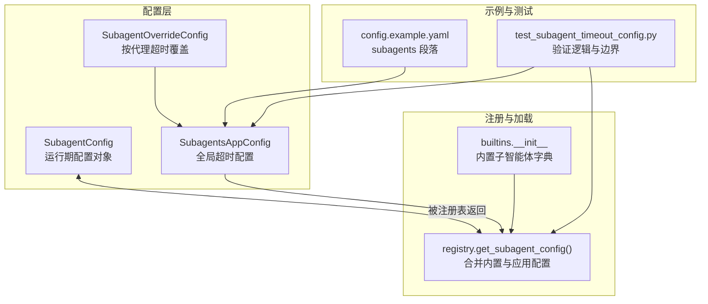
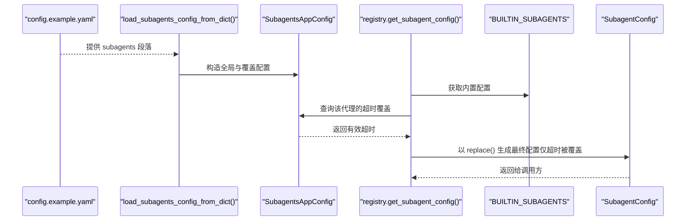
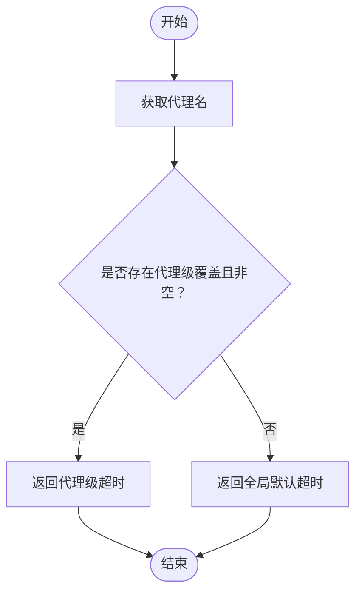
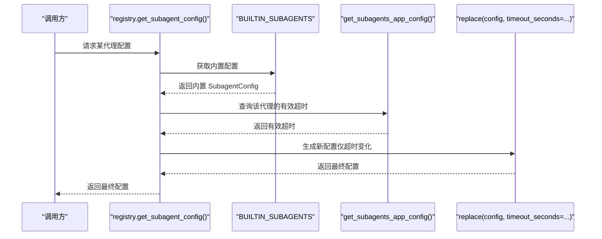
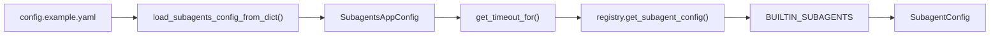

# 子智能体配置

<cite>
**本文引用的文件**
- [subagents_config.py](file://backend/packages/harness/deerflow/config/subagents_config.py)
- [config.py](file://backend/packages/harness/deerflow/subagents/config.py)
- [registry.py](file://backend/packages/harness/deerflow/subagents/registry.py)
- [__init__.py](file://backend/packages/harness/deerflow/subagents/builtins/__init__.py)
- [general_purpose.py](file://backend/packages/harness/deerflow/subagents/builtins/general_purpose.py)
- [bash_agent.py](file://backend/packages/harness/deerflow/subagents/builtins/bash_agent.py)
- [config.example.yaml](file://config.example.yaml)
- [test_subagent_timeout_config.py](file://backend/tests/test_subagent_timeout_config.py)
</cite>

## 目录
1. [简介](#简介)
2. [项目结构](#项目结构)
3. [核心组件](#核心组件)
4. [架构总览](#架构总览)
5. [详细组件分析](#详细组件分析)
6. [依赖分析](#依赖分析)
7. [性能考虑](#性能考虑)
8. [故障排查指南](#故障排查指南)
9. [结论](#结论)
10. [附录](#附录)

## 简介
本文件面向 DeerFlow 子智能体配置系统，聚焦于 SubagentConfig 数据结构与配置参数、配置继承机制（model='inherit'）、配置文件格式与默认值、参数校验规则、以及在实际工作流中的应用方式。文档同时提供配置示例、最佳实践与常见错误的解决方案，帮助开发者快速、安全地定制子智能体行为。

## 项目结构
子智能体配置涉及以下关键模块：
- 配置数据结构：SubagentConfig（运行期配置对象）
- 应用级配置：SubagentsAppConfig/SubagentOverrideConfig（从 config.yaml 加载的全局与按代理覆盖）
- 注册表：根据内置配置与应用配置合并生成最终配置
- 内置子智能体：通用型与 Bash 执行两类内置配置
- 示例配置：config.example.yaml 中的 subagents 段落

**图表来源**
- [config.py:6-29](file://backend/packages/harness/deerflow/subagents/config.py#L6-L29)
- [subagents_config.py:20-46](file://backend/packages/harness/deerflow/config/subagents_config.py#L20-L46)
- [registry.py:12-34](file://backend/packages/harness/deerflow/subagents/registry.py#L12-L34)
- [__init__.py:11-16](file://backend/packages/harness/deerflow/subagents/builtins/__init__.py#L11-L16)
- [config.example.yaml:378-388](file://config.example.yaml#L378-L388)
- [test_subagent_timeout_config.py:14-20](file://backend/tests/test_subagent_timeout_config.py#L14-L20)

**章节来源**
- [config.py:6-29](file://backend/packages/harness/deerflow/subagents/config.py#L6-L29)
- [subagents_config.py:20-46](file://backend/packages/harness/deerflow/config/subagents_config.py#L20-L46)
- [registry.py:12-34](file://backend/packages/harness/deerflow/subagents/registry.py#L12-L34)
- [__init__.py:11-16](file://backend/packages/harness/deerflow/subagents/builtins/__init__.py#L11-L16)
- [config.example.yaml:378-388](file://config.example.yaml#L378-L388)
- [test_subagent_timeout_config.py:14-20](file://backend/tests/test_subagent_timeout_config.py#L14-L20)

## 核心组件
- SubagentConfig：描述单个子智能体的运行期配置，包含名称、系统提示、工具限制、模型选择、最大轮次、超时等字段。
- SubagentsAppConfig/SubagentOverrideConfig：从配置文件加载的全局超时与按代理超时覆盖，支持最小值校验与日志记录。
- 注册表：将内置配置与应用配置合并，生成最终可执行的 SubagentConfig 实例。
- 内置子智能体：general-purpose 与 bash 两类内置配置，提供默认行为与约束。

**章节来源**
- [config.py:6-29](file://backend/packages/harness/deerflow/subagents/config.py#L6-L29)
- [subagents_config.py:20-46](file://backend/packages/harness/deerflow/config/subagents_config.py#L20-L46)
- [registry.py:12-34](file://backend/packages/harness/deerflow/subagents/registry.py#L12-L34)
- [general_purpose.py:5-47](file://backend/packages/harness/deerflow/subagents/builtins/general_purpose.py#L5-L47)
- [bash_agent.py:5-46](file://backend/packages/harness/deerflow/subagents/builtins/bash_agent.py#L5-L46)

## 架构总览
下图展示从配置文件到运行时配置的解析与合并流程：

**图表来源**
- [config.example.yaml:378-388](file://config.example.yaml#L378-L388)
- [subagents_config.py:56-66](file://backend/packages/harness/deerflow/config/subagents_config.py#L56-L66)
- [registry.py:12-34](file://backend/packages/harness/deerflow/subagents/registry.py#L12-L34)
- [__init__.py:11-16](file://backend/packages/harness/deerflow/subagents/builtins/__init__.py#L11-L16)

## 详细组件分析

### SubagentConfig 数据结构与参数说明
- 字段与含义
  - name：子智能体唯一标识符
  - description：触发委托的使用场景说明
  - system_prompt：指导子智能体行为的系统提示词
  - tools：允许使用的工具列表；为 None 表示继承父代理所有工具
  - disallowed_tools：明确禁止使用的工具列表；默认包含 task 等
  - model：模型选择；'inherit' 表示继承父代理模型
  - max_turns：最大对话轮次，超过则停止
  - timeout_seconds：最大执行时间（秒），默认 900（15 分钟）

- 设计要点
  - 使用 dataclass 定义，便于序列化与复制
  - 默认值集中于类定义处，确保一致性
  - disallowed_tools 默认排除 task 等可能造成嵌套或混淆的工具

**章节来源**
- [config.py:6-29](file://backend/packages/harness/deerflow/subagents/config.py#L6-L29)

### 配置继承机制（model='inherit'）
- 语义：当子智能体的 model 设置为 'inherit' 时，表示使用父代理的模型配置，不强制指定具体模型名
- 应用位置：在子智能体配置中通过字符串常量表达继承意图
- 典型场景
  - 保持与主流程一致的推理能力与上下文窗口
  - 在多模型混用环境中避免显式绑定带来的耦合

**章节来源**
- [general_purpose.py:45-45](file://backend/packages/harness/deerflow/subagents/builtins/general_purpose.py#L45-L45)
- [bash_agent.py:44-44](file://backend/packages/harness/deerflow/subagents/builtins/bash_agent.py#L44-L44)

### 超时配置与覆盖机制
- 全局默认：SubagentsAppConfig.timeout_seconds，默认 900 秒
- 按代理覆盖：SubagentOverrideConfig.timeout_seconds 支持针对特定代理设置独立超时
- 解析逻辑：get_timeout_for() 优先返回代理级覆盖值，否则回退到全局默认
- 日志：加载时会输出默认值与覆盖摘要，便于审计

**图表来源**
- [subagents_config.py:33-45](file://backend/packages/harness/deerflow/config/subagents_config.py#L33-L45)

**章节来源**
- [subagents_config.py:20-46](file://backend/packages/harness/deerflow/config/subagents_config.py#L20-L46)
- [test_subagent_timeout_config.py:91-129](file://backend/tests/test_subagent_timeout_config.py#L91-L129)

### 注册表与配置合并
- get_subagent_config() 从 BUILTIN_SUBAGENTS 取得内置配置，再读取应用配置中的超时覆盖，使用替换操作生成最终配置
- list_subagents() 将所有内置代理统一应用覆盖策略
- 保证内置配置对象不被修改，返回的是新实例

**图表来源**
- [registry.py:12-34](file://backend/packages/harness/deerflow/subagents/registry.py#L12-L34)
- [__init__.py:11-16](file://backend/packages/harness/deerflow/subagents/builtins/__init__.py#L11-L16)

**章节来源**
- [registry.py:12-34](file://backend/packages/harness/deerflow/subagents/registry.py#L12-L34)
- [test_subagent_timeout_config.py:193-273](file://backend/tests/test_subagent_timeout_config.py#L193-L273)

### 内置子智能体配置
- general-purpose
  - 工具：继承父代理（tools=None）
  - 禁用：task、ask_clarification、present_files 等
  - 模型：inherit
  - 最大轮次：50
- bash
  - 工具：限定为 bash、ls、read_file、write_file、str_replace
  - 禁用：同上
  - 模型：inherit
  - 最大轮次：30

**章节来源**
- [general_purpose.py:5-47](file://backend/packages/harness/deerflow/subagents/builtins/general_purpose.py#L5-L47)
- [bash_agent.py:5-46](file://backend/packages/harness/deerflow/subagents/builtins/bash_agent.py#L5-L46)

### 配置文件格式规范与默认值
- 文件：config.example.yaml
- 段落：subagents
  - timeout_seconds：全局默认超时（秒）
  - agents：按代理名映射的超时覆盖
- 默认值
  - SubagentsAppConfig.timeout_seconds：900
  - SubagentConfig.timeout_seconds：900
  - SubagentConfig.max_turns：50
  - SubagentConfig.disallowed_tools：默认包含 task
  - SubagentConfig.model：inherit

**章节来源**
- [config.example.yaml:378-388](file://config.example.yaml#L378-L388)
- [subagents_config.py:23-27](file://backend/packages/harness/deerflow/config/subagents_config.py#L23-L27)
- [config.py:26-28](file://backend/packages/harness/deerflow/subagents/config.py#L26-L28)

### 参数验证规则
- SubagentOverrideConfig.timeout_seconds
  - 最小值：≥1（0 与负数拒绝）
- SubagentsAppConfig.timeout_seconds
  - 最小值：≥1（0 与负数拒绝）
- 日志：加载成功后输出默认值与覆盖摘要

**章节来源**
- [subagents_config.py:13-17](file://backend/packages/harness/deerflow/config/subagents_config.py#L13-L17)
- [subagents_config.py:23-27](file://backend/packages/harness/deerflow/config/subagents_config.py#L23-L27)
- [test_subagent_timeout_config.py:37-57](file://backend/tests/test_subagent_timeout_config.py#L37-L57)
- [test_subagent_timeout_config.py:64-84](file://backend/tests/test_subagent_timeout_config.py#L64-L84)

### 配置示例与最佳实践
- 示例：在 config.example.yaml 中启用 subagents 段落并设置全局与按代理超时
- 最佳实践
  - 为长任务（如复杂探索与多步执行）设置较长超时
  - 为短命令执行设置较短超时，避免资源占用
  - 保持 disallowed_tools 默认集合，防止嵌套与澄清工具导致的循环
  - 使用 inherit 模型以减少耦合，确保与主流程一致

**章节来源**
- [config.example.yaml:378-388](file://config.example.yaml#L378-L388)
- [general_purpose.py:44-46](file://backend/packages/harness/deerflow/subagents/builtins/general_purpose.py#L44-L46)
- [bash_agent.py:43-45](file://backend/packages/harness/deerflow/subagents/builtins/bash_agent.py#L43-L45)

## 依赖分析
- 组件耦合
  - registry 依赖 builtins 提供内置配置
  - registry 依赖 config.subagents_config 提供应用级超时覆盖
  - config.subagents_config 与 config.example.yaml 交互完成加载
- 关键依赖链
  - config.example.yaml → load_subagents_config_from_dict() → SubagentsAppConfig → get_timeout_for() → registry → SubagentConfig

**图表来源**
- [config.example.yaml:378-388](file://config.example.yaml#L378-L388)
- [subagents_config.py:56-66](file://backend/packages/harness/deerflow/config/subagents_config.py#L56-L66)
- [registry.py:12-34](file://backend/packages/harness/deerflow/subagents/registry.py#L12-L34)
- [__init__.py:11-16](file://backend/packages/harness/deerflow/subagents/builtins/__init__.py#L11-L16)

**章节来源**
- [registry.py:12-34](file://backend/packages/harness/deerflow/subagents/registry.py#L12-L34)
- [subagents_config.py:56-66](file://backend/packages/harness/deerflow/config/subagents_config.py#L56-L66)

## 性能考虑
- 超时与轮次控制：通过 max_turns 与 timeout_seconds 控制执行上限，避免长时间占用资源
- 轮询安全窗：在任务工具中采用 (timeout_seconds + 60) // 5 计算轮询次数，确保轮询窗口大于执行超时，避免误判
- 工具集限制：合理设置 tools/disallowed_tools，减少上下文与工具调用开销

**章节来源**
- [test_subagent_timeout_config.py:320-355](file://backend/tests/test_subagent_timeout_config.py#L320-L355)
- [general_purpose.py:43-46](file://backend/packages/harness/deerflow/subagents/builtins/general_purpose.py#L43-L46)
- [bash_agent.py:42-45](file://backend/packages/harness/deerflow/subagents/builtins/bash_agent.py#L42-L45)

## 故障排查指南
- 常见错误
  - 超时值非法：将 timeout_seconds 设为 0 或负数会导致校验失败
  - 未找到代理：get_subagent_config() 对未知代理返回 None
  - 覆盖未生效：确认 config.yaml 中 agents 下是否正确键入代理名
- 排查步骤
  - 检查 config.example.yaml 的 subagents 段落是否启用
  - 查看加载日志，确认默认值与覆盖摘要
  - 使用 list_subagents() 校验所有代理的超时是否按预期覆盖
  - 单元测试可作为参考：验证 get_timeout_for() 与覆盖逻辑

**章节来源**
- [test_subagent_timeout_config.py:37-57](file://backend/tests/test_subagent_timeout_config.py#L37-L57)
- [test_subagent_timeout_config.py:91-129](file://backend/tests/test_subagent_timeout_config.py#L91-L129)
- [test_subagent_timeout_config.py:193-273](file://backend/tests/test_subagent_timeout_config.py#L193-L273)

## 结论
SubagentConfig 与 SubagentsAppConfig/SubagentOverrideConfig 共同构成了 DeerFlow 子智能体的配置体系。通过内置配置与应用配置的合并，系统实现了灵活的超时控制与工具限制，并以 'inherit' 模型降低耦合。配合清晰的默认值、严格的参数校验与完善的测试覆盖，开发者可以安全、高效地定制各类子智能体的行为。

## 附录
- 相关测试用例可作为配置行为的权威参考，覆盖默认值、校验规则、覆盖解析与注册表合并等关键路径。

**章节来源**
- [test_subagent_timeout_config.py:14-20](file://backend/tests/test_subagent_timeout_config.py#L14-L20)