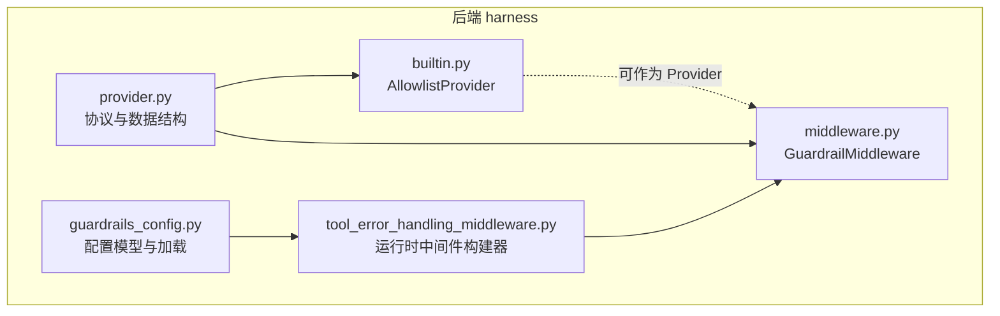
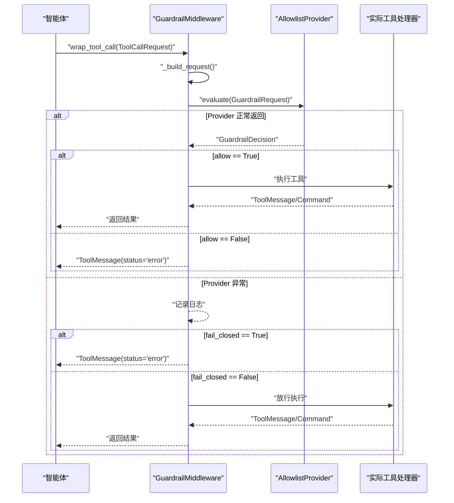
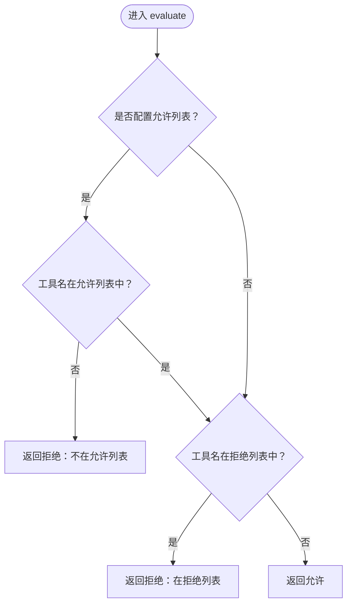
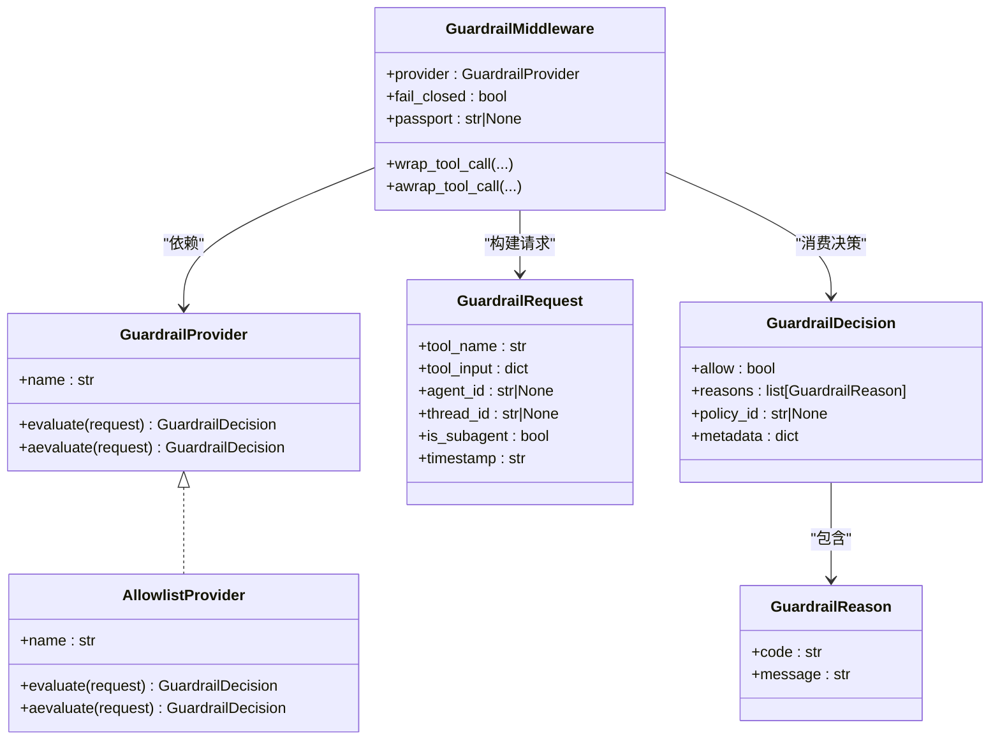

# 内置守卫

<cite>
**本文引用的文件**
- [builtin.py](file://backend/packages/harness/deerflow/guardrails/builtin.py)
- [provider.py](file://backend/packages/harness/deerflow/guardrails/provider.py)
- [middleware.py](file://backend/packages/harness/deerflow/guardrails/middleware.py)
- [guardrails_config.py](file://backend/packages/harness/deerflow/config/guardrails_config.py)
- [tool_error_handling_middleware.py](file://backend/packages/harness/deerflow/agents/middlewares/tool_error_handling_middleware.py)
- [GUARDRAILS.md](file://backend/docs/GUARDRAILS.md)
- [test_guardrail_middleware.py](file://backend/tests/test_guardrail_middleware.py)
- [config.example.yaml](file://config.example.yaml)
</cite>

## 目录
1. [简介](#简介)
2. [项目结构](#项目结构)
3. [核心组件](#核心组件)
4. [架构总览](#架构总览)
5. [详细组件分析](#详细组件分析)
6. [依赖关系分析](#依赖关系分析)
7. [性能考量](#性能考量)
8. [故障排查指南](#故障排查指南)
9. [结论](#结论)
10. [附录](#附录)

## 简介
本文件系统性阐述 DeerFlow 内置守卫（Guardrails）的实现与使用，重点围绕 AllowlistProvider 的工作原理、配置方式与决策流程，以及与中间件链路的集成方式。内容涵盖：
- 允许列表与拒绝列表的配置与优先级
- 守卫决策对象结构与返回码
- 请求评估流程与错误处理策略
- 在智能体中集成内置守卫进行工具访问控制
- 规则组合与 fail-closed/fail-open 行为

## 项目结构
内置守卫相关代码位于后端 harness 包内，主要由以下模块组成：
- provider：定义守卫协议、请求与决策数据结构
- builtin：内置 AllowlistProvider 实现
- middleware：守卫中间件，拦截工具调用并执行授权评估
- config：守卫配置模型与单例加载器
- 集成：运行时中间件构建器按配置自动注入 GuardrailMiddleware

图表来源
- [provider.py:1-57](file://backend/packages/harness/deerflow/guardrails/provider.py#L1-L57)
- [builtin.py:1-24](file://backend/packages/harness/deerflow/guardrails/builtin.py#L1-L24)
- [middleware.py:1-99](file://backend/packages/harness/deerflow/guardrails/middleware.py#L1-L99)
- [guardrails_config.py:1-49](file://backend/packages/harness/deerflow/config/guardrails_config.py#L1-L49)
- [tool_error_handling_middleware.py:68-119](file://backend/packages/harness/deerflow/agents/middlewares/tool_error_handling_middleware.py#L68-L119)

章节来源
- [GUARDRAILS.md:38-80](file://backend/docs/GUARDRAILS.md#L38-L80)
- [config.example.yaml:591-624](file://config.example.yaml#L591-L624)

## 核心组件
- GuardrailProvider 协议：定义 evaluate/aevaluate 接口，支持同步与异步评估
- GuardrailRequest：传递给 Provider 的上下文，包含工具名、参数、代理标识等
- GuardrailDecision：Provider 的授权决定，包含 allow 标志、原因列表、策略ID与元数据
- AllowlistProvider：零依赖的内置实现，基于允许/拒绝名单进行快速判定
- GuardrailMiddleware：在工具执行前进行授权评估，并根据结果返回错误消息或放行
- GuardrailsConfig：守卫配置模型，支持启用、fail-closed、passport 与 Provider 类路径

章节来源
- [provider.py:9-57](file://backend/packages/harness/deerflow/guardrails/provider.py#L9-L57)
- [builtin.py:6-24](file://backend/packages/harness/deerflow/guardrails/builtin.py#L6-L24)
- [middleware.py:20-99](file://backend/packages/harness/deerflow/guardrails/middleware.py#L20-L99)
- [guardrails_config.py:6-49](file://backend/packages/harness/deerflow/config/guardrails_config.py#L6-L49)

## 架构总览
内置守卫以中间件形式接入智能体执行链，在每个工具调用前进行授权评估。评估失败时返回错误消息，允许时继续执行；Provider 抛错时依据 fail-closed 策略决定阻断或放行。

图表来源
- [middleware.py:54-99](file://backend/packages/harness/deerflow/guardrails/middleware.py#L54-L99)
- [builtin.py:15-24](file://backend/packages/harness/deerflow/guardrails/builtin.py#L15-L24)
- [provider.py:9-57](file://backend/packages/harness/deerflow/guardrails/provider.py#L9-L57)

章节来源
- [GUARDRAILS.md:38-80](file://backend/docs/GUARDRAILS.md#L38-L80)
- [tool_error_handling_middleware.py:93-119](file://backend/packages/harness/deerflow/agents/middlewares/tool_error_handling_middleware.py#L93-L119)

## 详细组件分析

### AllowlistProvider 实现原理与使用方法
- 初始化参数
  - allowed_tools：允许列表（可选），未设置时表示不限制
  - denied_tools：拒绝列表（可选，默认空集）
- 评估逻辑
  - 若提供了允许列表且工具名不在其中，则直接拒绝
  - 否则检查是否在拒绝列表中，若在则拒绝
  - 否则允许通过
- 异步委托
  - aevaluate 默认委托给 evaluate，保持行为一致

图表来源
- [builtin.py:15-24](file://backend/packages/harness/deerflow/guardrails/builtin.py#L15-L24)

章节来源
- [builtin.py:6-24](file://backend/packages/harness/deerflow/guardrails/builtin.py#L6-L24)
- [test_guardrail_middleware.py:62-106](file://backend/tests/test_guardrail_middleware.py#L62-L106)

### 守卫决策机制与返回对象结构
- 决策对象 GuardrailDecision
  - allow：布尔值，true 表示允许，false 表示拒绝
  - reasons：原因列表，每项含 code 与 message
  - policy_id：策略标识（可选）
  - metadata：扩展元数据（可选）
- 原因对象 GuardrailReason
  - code：标准化原因码（如 oap.allowed、oap.tool_not_allowed 等）
  - message：人类可读的原因描述
- 中间件错误处理
  - Provider 抛出异常时，fail_closed=True 则拒绝并返回 oap.evaluator_error
  - fail_closed=False 则放行并记录警告

章节来源
- [provider.py:21-57](file://backend/packages/harness/deerflow/guardrails/provider.py#L21-L57)
- [middleware.py:66-98](file://backend/packages/harness/deerflow/guardrails/middleware.py#L66-L98)

### 请求评估流程与上下文
- 中间件从 ToolCallRequest 提取工具名、参数、调用ID等，构造 GuardrailRequest
- 将 agent_id 设置为 passport（若配置），timestamp 为当前 UTC 时间
- 调用 Provider.evaluate 或 Provider.aevaluate 获取决策
- 根据决策生成 ToolMessage（status="error"）或放行执行

章节来源
- [middleware.py:34-75](file://backend/packages/harness/deerflow/guardrails/middleware.py#L34-L75)

### 配置方式与示例
- 启用守卫
  - enabled: true/false
  - fail_closed: true/false（默认 true）
  - passport: 字符串或 null（传递给 Provider 的 agent_id）
  - provider.use: Provider 类路径（如 deerflow.guardrails.builtin:AllowlistProvider）
  - provider.config: Provider 构造参数字典
- 允许列表/拒绝列表示例
  - 拒绝列表：denied_tools: ["bash","write_file"]
  - 允许列表：allowed_tools: ["web_search","read_file","ls"]
- 运行时注入
  - 当配置启用且存在 provider.use 时，运行时中间件构建器会解析类路径并实例化 Provider，随后注入 GuardrailMiddleware

章节来源
- [guardrails_config.py:13-49](file://backend/packages/harness/deerflow/config/guardrails_config.py#L13-L49)
- [tool_error_handling_middleware.py:93-119](file://backend/packages/harness/deerflow/agents/middlewares/tool_error_handling_middleware.py#L93-L119)
- [GUARDRAILS.md:87-114](file://backend/docs/GUARDRAILS.md#L87-L114)
- [config.example.yaml:591-624](file://config.example.yaml#L591-L624)

### 使用场景与最佳实践
- 场景一：基础安全
  - 使用拒绝列表阻断高风险工具（如 bash、write_file），其余工具默认允许
- 场景二：最小权限
  - 使用允许列表仅开放必要工具（如 web_search、read_file、ls），其余一律拒绝
- 场景三：fail-closed 与 fail-open
  - 生产环境建议 fail_closed=True，确保 Provider 异常时不放行
  - 测试或调试阶段可临时设为 False，避免误伤
- 场景四：与 passport 集成
  - passport 作为 agent_id 传入，便于 Provider 做跨工具、跨策略的统一授权

章节来源
- [GUARDRAILS.md:83-114](file://backend/docs/GUARDRAILS.md#L83-L114)
- [middleware.py:29-33](file://backend/packages/harness/deerflow/guardrails/middleware.py#L29-L33)

### 规则优先级与组合使用
- 优先级
  - 若配置了允许列表：只有在允许列表中的工具才可能被允许
  - 若工具同时出现在允许列表与拒绝列表：拒绝列表优先于允许列表
- 组合使用
  - 仅使用允许列表：仅允许白名单内的工具
  - 仅使用拒绝列表：除黑名单外均允许
  - 同时使用：先做白名单筛选，再做黑名单过滤，最终以黑名单为准

章节来源
- [builtin.py:16-20](file://backend/packages/harness/deerflow/guardrails/builtin.py#L16-L20)
- [test_guardrail_middleware.py:94-100](file://backend/tests/test_guardrail_middleware.py#L94-L100)

### 在智能体中集成内置守卫
- 运行时中间件链
  - 工具错误处理中间件之前插入 GuardrailMiddleware（当配置启用）
  - Provider 通过 resolve_variable 动态加载，支持 framework 注入
- 集成要点
  - 配置 guardrails.enabled 与 provider.use
  - 可选配置 passport 与 fail_closed
  - Provider 构造参数通过 provider.config 传递

章节来源
- [tool_error_handling_middleware.py:93-119](file://backend/packages/harness/deerflow/agents/middlewares/tool_error_handling_middleware.py#L93-L119)
- [GUARDRAILS.md:38-80](file://backend/docs/GUARDRAILS.md#L38-L80)

## 依赖关系分析
- 组件耦合
  - AllowlistProvider 仅依赖 GuardrailRequest/Decision 数据结构，零外部依赖
  - GuardrailMiddleware 依赖 Provider 协议与 ToolCallRequest，解耦具体 Provider 实现
  - 运行时中间件构建器通过配置与反射机制动态装配 Provider
- 外部依赖
  - Provider 类路径解析使用 resolve_variable（与模型/工具/沙箱一致）
  - LangGraph GraphBubbleUp 异常需透传，不被中间件捕获

图表来源
- [provider.py:9-57](file://backend/packages/harness/deerflow/guardrails/provider.py#L9-L57)
- [builtin.py:6-24](file://backend/packages/harness/deerflow/guardrails/builtin.py#L6-L24)
- [middleware.py:20-99](file://backend/packages/harness/deerflow/guardrails/middleware.py#L20-L99)

章节来源
- [provider.py:39-57](file://backend/packages/harness/deerflow/guardrails/provider.py#L39-L57)
- [middleware.py:1-17](file://backend/packages/harness/deerflow/guardrails/middleware.py#L1-L17)

## 性能考量
- AllowlistProvider 采用集合查找，时间复杂度近似 O(1)，对大多数工具数量场景开销极低
- 中间件在每次工具调用前进行一次评估，建议合理控制允许/拒绝列表规模
- 异步路径与同步路径行为一致，避免额外调度成本

## 故障排查指南
- Provider 抛错
  - 若 fail_closed=True：将返回 oap.evaluator_error 的拒绝消息
  - 若 fail_closed=False：记录警告并放行
- GraphBubbleUp 控制信号
  - 中间件不会捕获并吞掉 GraphBubbleUp，确保中断/暂停/恢复语义正确传播
- 空工具名或空原因
  - 空工具名：中间件仍会尝试放行（无 Provider 评估）
  - 空原因列表：中间件使用回退文本填充拒绝消息
- 配置验证
  - 使用单例加载器与 Pydantic 校验，确保配置一致性

章节来源
- [middleware.py:66-98](file://backend/packages/harness/deerflow/guardrails/middleware.py#L66-L98)
- [test_guardrail_middleware.py:131-148](file://backend/tests/test_guardrail_middleware.py#L131-L148)
- [test_guardrail_middleware.py:174-191](file://backend/tests/test_guardrail_middleware.py#L174-L191)
- [test_guardrail_middleware.py:261-301](file://backend/tests/test_guardrail_middleware.py#L261-L301)

## 结论
AllowlistProvider 为 DeerFlow 提供了零依赖、易配置的工具访问控制能力。通过允许/拒绝列表的灵活组合与 fail-closed/fail-open 的策略选择，可在保证安全性的同时兼顾可用性。结合运行时中间件链与配置模型，开发者可以快速在智能体中集成内置守卫，实现确定性的预执行授权。

## 附录
- 工具名称参考（用于配置允许/拒绝列表）
  - bash、write_file、str_replace、read_file、ls、web_search、web_fetch、image_search、present_file、view_image、ask_clarification、task、mcp__*
- OAP 标准原因码参考
  - oap.allowed、oap.tool_not_allowed、oap.command_not_allowed、oap.blocked_pattern、oap.limit_exceeded、oap.passport_suspended、oap.evaluator_error

章节来源
- [GUARDRAILS.md:285-321](file://backend/docs/GUARDRAILS.md#L285-L321)
- [GUARDRAILS.md:305-318](file://backend/docs/GUARDRAILS.md#L305-L318)