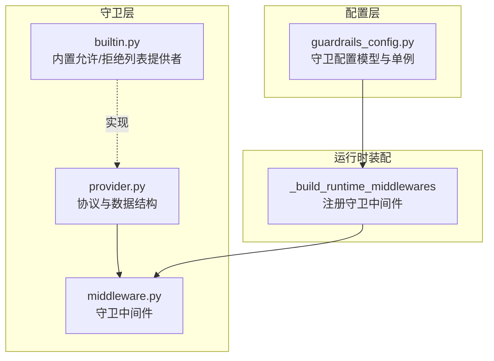
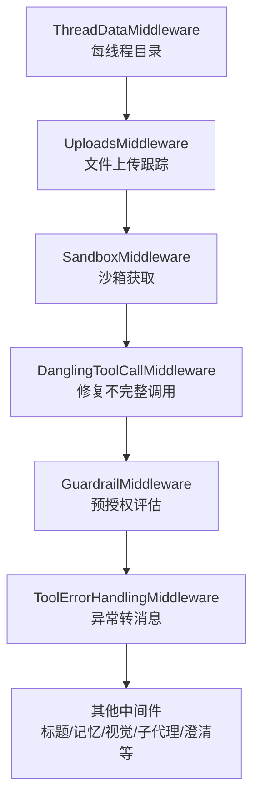
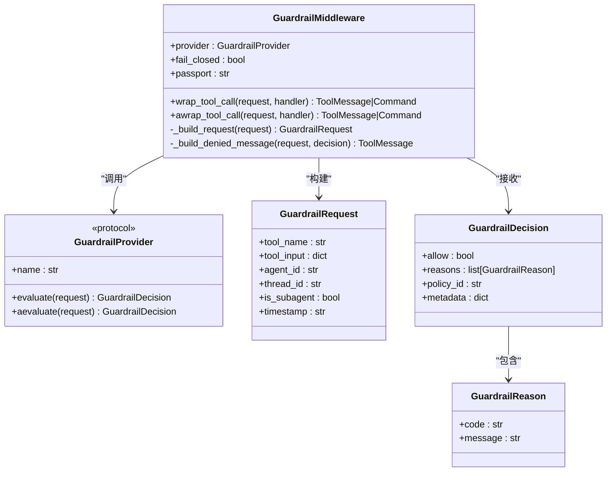
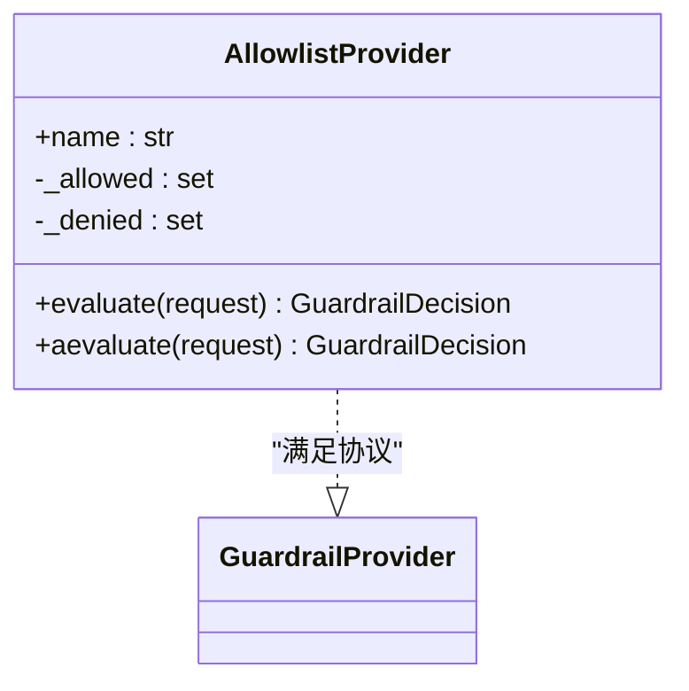
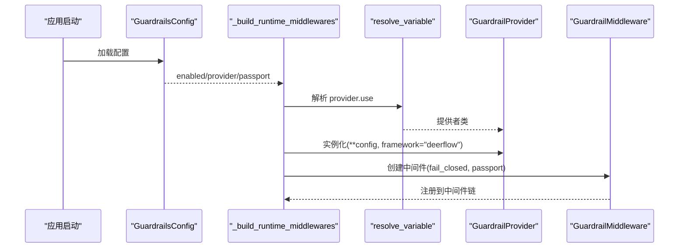
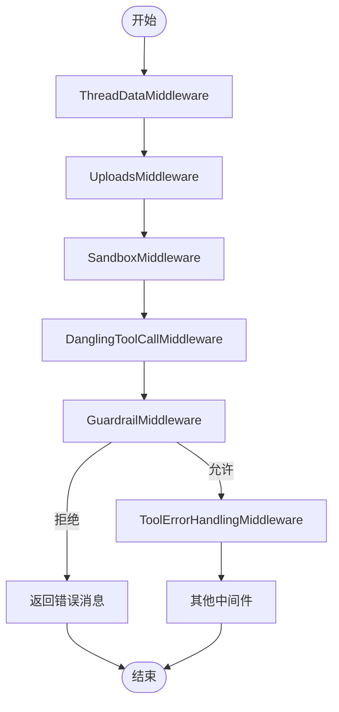
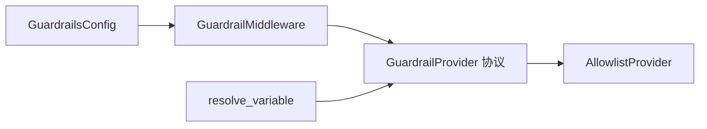

# 守卫中间件

<cite>
**本文引用的文件**
- [backend/packages/harness/deerflow/guardrails/middleware.py](file://backend/packages/harness/deerflow/guardrails/middleware.py)
- [backend/packages/harness/deerflow/guardrails/provider.py](file://backend/packages/harness/deerflow/guardrails/provider.py)
- [backend/packages/harness/deerflow/guardrails/builtin.py](file://backend/packages/harness/deerflow/guardrails/builtin.py)
- [backend/packages/harness/deerflow/config/guardrails_config.py](file://backend/packages/harness/deerflow/config/guardrails_config.py)
- [backend/packages/harness/deerflow/agents/middlewares/tool_error_handling_middleware.py](file://backend/packages/harness/deerflow/agents/middlewares/tool_error_handling_middleware.py)
- [backend/docs/GUARDRAILS.md](file://backend/docs/GUARDRAILS.md)
- [backend/tests/test_guardrail_middleware.py](file://backend/tests/test_guardrail_middleware.py)
- [backend/config.example.yaml](file://backend/config.example.yaml)
</cite>

## 目录
1. [简介](#简介)
2. [项目结构](#项目结构)
3. [核心组件](#核心组件)
4. [架构总览](#架构总览)
5. [详细组件分析](#详细组件分析)
6. [依赖分析](#依赖分析)
7. [性能考虑](#性能考虑)
8. [故障排查指南](#故障排查指南)
9. [结论](#结论)
10. [附录](#附录)

## 简介
本文件系统性阐述 DeerFlow 守卫中间件（GuardrailMiddleware）的设计与实现，重点说明其在智能体执行流程中的作用与位置、初始化与配置方式、拦截与评估机制、错误处理策略，以及与其它中间件的协作关系与执行顺序。同时提供配置示例、自定义中间件开发指南与常见问题排查建议。

## 项目结构
守卫中间件位于后端 harness 包中，围绕“协议-中间件-内置提供者-配置”四个层面组织，配合运行时中间件构建器完成注册与装配。

图表来源
- [backend/packages/harness/deerflow/guardrails/provider.py:1-57](file://backend/packages/harness/deerflow/guardrails/provider.py#L1-L57)
- [backend/packages/harness/deerflow/guardrails/middleware.py:1-99](file://backend/packages/harness/deerflow/guardrails/middleware.py#L1-L99)
- [backend/packages/harness/deerflow/guardrails/builtin.py:1-24](file://backend/packages/harness/deerflow/guardrails/builtin.py#L1-L24)
- [backend/packages/harness/deerflow/config/guardrails_config.py:1-49](file://backend/packages/harness/deerflow/config/guardrails_config.py#L1-L49)
- [backend/packages/harness/deerflow/agents/middlewares/tool_error_handling_middleware.py:68-138](file://backend/packages/harness/deerflow/agents/middlewares/tool_error_handling_middleware.py#L68-L138)

章节来源
- [backend/packages/harness/deerflow/guardrails/middleware.py:1-99](file://backend/packages/harness/deerflow/guardrails/middleware.py#L1-L99)
- [backend/packages/harness/deerflow/guardrails/provider.py:1-57](file://backend/packages/harness/deerflow/guardrails/provider.py#L1-L57)
- [backend/packages/harness/deerflow/guardrails/builtin.py:1-24](file://backend/packages/harness/deerflow/guardrails/builtin.py#L1-L24)
- [backend/packages/harness/deerflow/config/guardrails_config.py:1-49](file://backend/packages/harness/deerflow/config/guardrails_config.py#L1-L49)
- [backend/packages/harness/deerflow/agents/middlewares/tool_error_handling_middleware.py:68-138](file://backend/packages/harness/deerflow/agents/middlewares/tool_error_handling_middleware.py#L68-L138)

## 核心组件
- 协议与数据结构：定义守卫请求、原因与决策的数据结构，以及提供者协议，确保实现解耦与可插拔。
- 内置提供者：允许/拒绝列表提供者，零外部依赖，便于快速启用基础授权。
- 守卫中间件：实现 AgentMiddleware 接口，拦截工具调用请求，调用提供者进行评估，并根据决策决定放行或返回错误消息。
- 配置模型：提供守卫开关、失败闭合策略、护照引用与提供者类路径等配置项。
- 运行时装配：在中间件链中按序注册守卫中间件，支持同步与异步路径。

章节来源
- [backend/packages/harness/deerflow/guardrails/provider.py:9-57](file://backend/packages/harness/deerflow/guardrails/provider.py#L9-L57)
- [backend/packages/harness/deerflow/guardrails/builtin.py:6-24](file://backend/packages/harness/deerflow/guardrails/builtin.py#L6-L24)
- [backend/packages/harness/deerflow/guardrails/middleware.py:20-99](file://backend/packages/harness/deerflow/guardrails/middleware.py#L20-L99)
- [backend/packages/harness/deerflow/config/guardrails_config.py:6-49](file://backend/packages/harness/deerflow/config/guardrails_config.py#L6-L49)
- [backend/packages/harness/deerflow/agents/middlewares/tool_error_handling_middleware.py:68-138](file://backend/packages/harness/deerflow/agents/middlewares/tool_error_handling_middleware.py#L68-L138)

## 架构总览
下图展示守卫中间件在智能体执行链路中的位置与职责：它在上传与沙箱之后、工具错误处理之前，对每个工具调用进行预授权评估。

图表来源
- [backend/docs/GUARDRAILS.md:38-70](file://backend/docs/GUARDRAILS.md#L38-L70)
- [backend/packages/harness/deerflow/agents/middlewares/tool_error_handling_middleware.py:68-138](file://backend/packages/harness/deerflow/agents/middlewares/tool_error_handling_middleware.py#L68-L138)

章节来源
- [backend/docs/GUARDRAILS.md:38-70](file://backend/docs/GUARDRAILS.md#L38-L70)

## 详细组件分析

### 守卫中间件（GuardrailMiddleware）
- 职责：在工具调用执行前，基于 GuardrailProvider 的决策进行放行或阻断；在提供者异常时依据 fail_closed 策略决定是否阻断或放行；严格保留 LangGraph 控制信号（中断/暂停/恢复）。
- 关键流程：
  1) 将 ToolCallRequest 转换为 GuardrailRequest（包含工具名、参数、护照引用、时间戳等）。
  2) 同步/异步调用 provider.evaluate/aevaluate。
  3) 若决策不允许：构造 ToolMessage(status="error") 返回给上游，使智能体自适应调整。
  4) 若提供者抛出异常：按 fail_closed 决策；GraphBubbleUp 永远传播。
- 失败闭合与开放：
  - fail_closed=true：提供者异常时返回错误消息，阻断工具调用。
  - fail_closed=false：提供者异常时放行工具调用，并记录警告日志。
- 护照传递：passport 作为 agent_id 注入到请求中，供提供者使用。

图表来源
- [backend/packages/harness/deerflow/guardrails/middleware.py:20-99](file://backend/packages/harness/deerflow/guardrails/middleware.py#L20-L99)
- [backend/packages/harness/deerflow/guardrails/provider.py:9-57](file://backend/packages/harness/deerflow/guardrails/provider.py#L9-L57)

章节来源
- [backend/packages/harness/deerflow/guardrails/middleware.py:20-99](file://backend/packages/harness/deerflow/guardrails/middleware.py#L20-L99)
- [backend/packages/harness/deerflow/guardrails/provider.py:9-57](file://backend/packages/harness/deerflow/guardrails/provider.py#L9-L57)

### 提供者协议与内置提供者
- 协议：GuardrailProvider 为结构化协议，要求具备 name、evaluate、aevaluate 方法；无需继承基类。
- 内置允许/拒绝列表提供者：AllowlistProvider 支持仅允许某些工具（allowed_tools）或显式拒绝某些工具（denied_tools），默认无限制；异步路径委托至同步实现。

图表来源
- [backend/packages/harness/deerflow/guardrails/builtin.py:6-24](file://backend/packages/harness/deerflow/guardrails/builtin.py#L6-L24)
- [backend/packages/harness/deerflow/guardrails/provider.py:39-57](file://backend/packages/harness/deerflow/guardrails/provider.py#L39-L57)

章节来源
- [backend/packages/harness/deerflow/guardrails/builtin.py:6-24](file://backend/packages/harness/deerflow/guardrails/builtin.py#L6-L24)
- [backend/packages/harness/deerflow/guardrails/provider.py:39-57](file://backend/packages/harness/deerflow/guardrails/provider.py#L39-L57)

### 配置与运行时装配
- 配置模型：GuardrailsConfig 定义开关、失败闭合策略、护照引用与提供者类路径及参数。
- 单例加载：通过 get_guardrails_config/load_guardrails_config_from_dict/reset_guardrails_config 管理全局配置实例。
- 运行时装配：_build_runtime_middlewares 在中间件链中按序插入 GuardrailMiddleware；当配置启用且提供者存在时，通过 resolve_variable 动态加载提供者类，注入 framework 参数以兼容不同提供者发现机制。

图表来源
- [backend/packages/harness/deerflow/config/guardrails_config.py:6-49](file://backend/packages/harness/deerflow/config/guardrails_config.py#L6-L49)
- [backend/packages/harness/deerflow/agents/middlewares/tool_error_handling_middleware.py:68-138](file://backend/packages/harness/deerflow/agents/middlewares/tool_error_handling_middleware.py#L68-L138)

章节来源
- [backend/packages/harness/deerflow/config/guardrails_config.py:6-49](file://backend/packages/harness/deerflow/config/guardrails_config.py#L6-L49)
- [backend/packages/harness/deerflow/agents/middlewares/tool_error_handling_middleware.py:68-138](file://backend/packages/harness/deerflow/agents/middlewares/tool_error_handling_middleware.py#L68-L138)

### 执行顺序与协作关系
- 中间件链顺序（节选）：ThreadData → Uploads → Sandbox → DanglingToolCall → Guardrail → ToolErrorHandling → 其他（标题/记忆/视觉/子代理/澄清等）。
- 协作要点：
  - GuardrailMiddleware 位于工具执行前，负责预授权。
  - ToolErrorHandlingMiddleware 位于 GuardrailMiddleware 之后，统一捕获工具执行异常并转换为消息，保证会话继续。
  - GuardrailMiddleware 不应与 ToolErrorHandlingMiddleware 交换顺序，否则无法在执行前阻断危险调用。

图表来源
- [backend/docs/GUARDRAILS.md:38-70](file://backend/docs/GUARDRAILS.md#L38-L70)
- [backend/packages/harness/deerflow/agents/middlewares/tool_error_handling_middleware.py:68-138](file://backend/packages/harness/deerflow/agents/middlewares/tool_error_handling_middleware.py#L68-L138)

章节来源
- [backend/docs/GUARDRAILS.md:38-70](file://backend/docs/GUARDRAILS.md#L38-L70)

### 自定义中间件开发指南
- 开发步骤：
  1) 实现 GuardrailProvider 协议（name、evaluate、aevaluate），或遵循结构化协议即可。
  2) 在配置中通过 provider.use 指定类路径，必要时在 config 中传入关键字参数。
  3) 使用 resolve_variable 机制动态加载，框架自动注入 framework="deerflow"（若构造函数接受）。
  4) 测试：参考测试用例覆盖允许/拒绝、空理由回退、空工具名、GraphBubbleUp 传播、异步路径等场景。
- 最佳实践：
  - 明确决策码与消息，便于前端与日志统一处理。
  - 对外部依赖进行超时与重试控制，避免阻塞工具执行。
  - 保持 evaluate/aevaluate 一致性，异步实现可委托同步。

章节来源
- [backend/docs/GUARDRAILS.md:254-331](file://backend/docs/GUARDRAILS.md#L254-L331)
- [backend/tests/test_guardrail_middleware.py:1-345](file://backend/tests/test_guardrail_middleware.py#L1-L345)

## 依赖分析
- 组件内聚与耦合：
  - GuardrailMiddleware 与 GuardrailProvider 通过协议解耦，支持任意实现。
  - 内置 AllowlistProvider 与 GuardrailProvider 协议强关联，但无外部依赖。
  - 配置层通过字符串类路径与运行时解析器解耦具体实现。
- 外部依赖：
  - LangGraph 工具节点与消息类型用于请求/响应建模。
  - GraphBubbleUp 异常用于控制流信号传播。
- 循环依赖：
  - 未见循环导入；配置单例避免重复初始化。

图表来源
- [backend/packages/harness/deerflow/guardrails/middleware.py:15-16](file://backend/packages/harness/deerflow/guardrails/middleware.py#L15-L16)
- [backend/packages/harness/deerflow/guardrails/builtin.py](file://backend/packages/harness/deerflow/guardrails/builtin.py#L3)
- [backend/packages/harness/deerflow/config/guardrails_config.py:38-42](file://backend/packages/harness/deerflow/config/guardrails_config.py#L38-L42)
- [backend/packages/harness/deerflow/agents/middlewares/tool_error_handling_middleware.py:94-116](file://backend/packages/harness/deerflow/agents/middlewares/tool_error_handling_middleware.py#L94-L116)

章节来源
- [backend/packages/harness/deerflow/guardrails/middleware.py:1-99](file://backend/packages/harness/deerflow/guardrails/middleware.py#L1-L99)
- [backend/packages/harness/deerflow/guardrails/builtin.py:1-24](file://backend/packages/harness/deerflow/guardrails/builtin.py#L1-L24)
- [backend/packages/harness/deerflow/config/guardrails_config.py:1-49](file://backend/packages/harness/deerflow/config/guardrails_config.py#L1-L49)
- [backend/packages/harness/deerflow/agents/middlewares/tool_error_handling_middleware.py:68-138](file://backend/packages/harness/deerflow/agents/middlewares/tool_error_handling_middleware.py#L68-L138)

## 性能考虑
- 评估开销：内置允许/拒绝列表提供者为纯内存匹配，开销极低；外部提供者应尽量本地化评估以降低网络延迟。
- 异步路径：异步评估可减少阻塞，提升吞吐；但需确保提供者内部资源池与并发安全。
- 日志与可观测性：提供者异常与拒绝决策均记录日志，便于审计与定位问题。

## 故障排查指南
- 常见问题与对策：
  - 提供者抛出异常：检查 fail_closed 设置；若为 fail_closed=true，则会阻断调用；若为 fail_open，则放行并记录警告。
  - GraphBubbleUp 未被吞没：确认提供者未捕获 GraphBubbleUp；该异常必须透传以维持控制流。
  - 空理由列表：中间件会使用回退文本，确保错误消息可读。
  - 空工具名：中间件对空名称进行容错处理，避免崩溃。
  - 护照未生效：确认 passport 字段正确传入中间件构造参数，并在提供者实现中读取 agent_id。
- 参考测试用例：
  - 允许/拒绝、fail-closed/fail-open、异步路径、GraphBubbleUp 传播、空理由回退、空工具名、协议校验等。

章节来源
- [backend/tests/test_guardrail_middleware.py:111-301](file://backend/tests/test_guardrail_middleware.py#L111-L301)

## 结论
守卫中间件通过“协议-中间件-提供者-配置”的清晰分层，在工具执行前提供了可插拔、可扩展的授权能力。其与运行时中间件链的有序协作，既保障了安全性，又不影响会话连续性。通过内置提供者与开放的协议接口，用户可在零依赖与标准策略之间灵活选择，并轻松扩展自定义策略。

## 附录

### 配置示例与说明
- 内置允许/拒绝列表提供者（零依赖）
  - 在配置中启用守卫并指定 deerflow.guardrails.builtin:AllowlistProvider，通过 config.denied_tools 或 config.allowed_tools 控制。
- OAP 护照提供者（开放标准）
  - 通过第三方实现（如 APort）加载，支持本地或 API 评估模式；配置中仅需提供 provider.use 与必要参数。
- 自定义提供者
  - 实现 evaluate/aevaluate 并在配置中通过 provider.use 指定类路径；必要时在 config 中传参。

章节来源
- [backend/config.example.yaml:591-624](file://backend/config.example.yaml#L591-L624)
- [backend/docs/GUARDRAILS.md:82-247](file://backend/docs/GUARDRAILS.md#L82-L247)