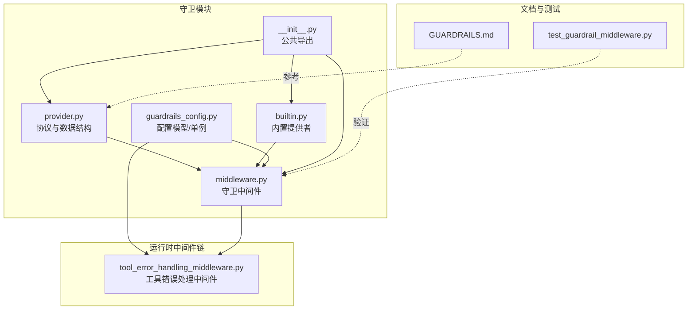
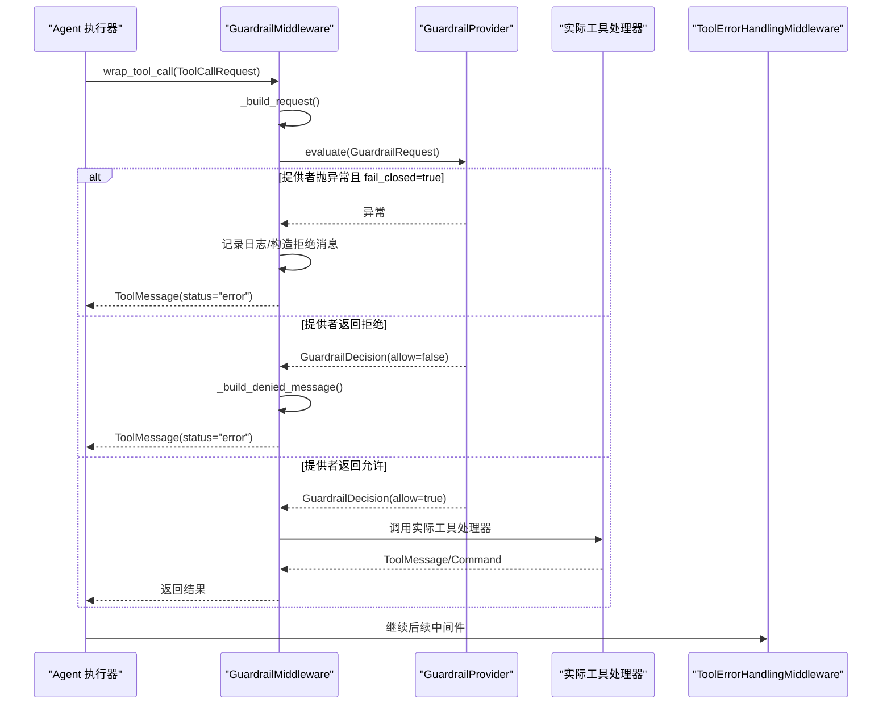
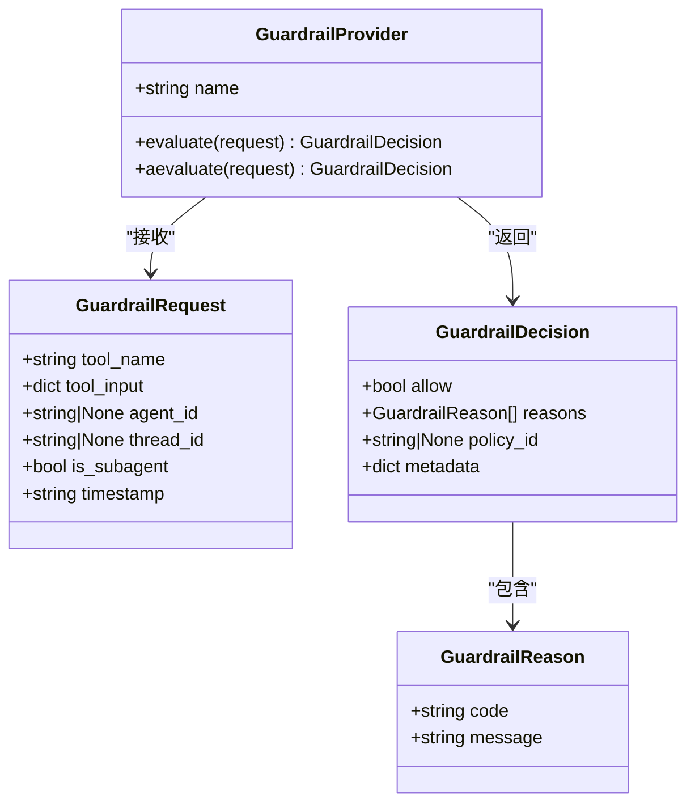
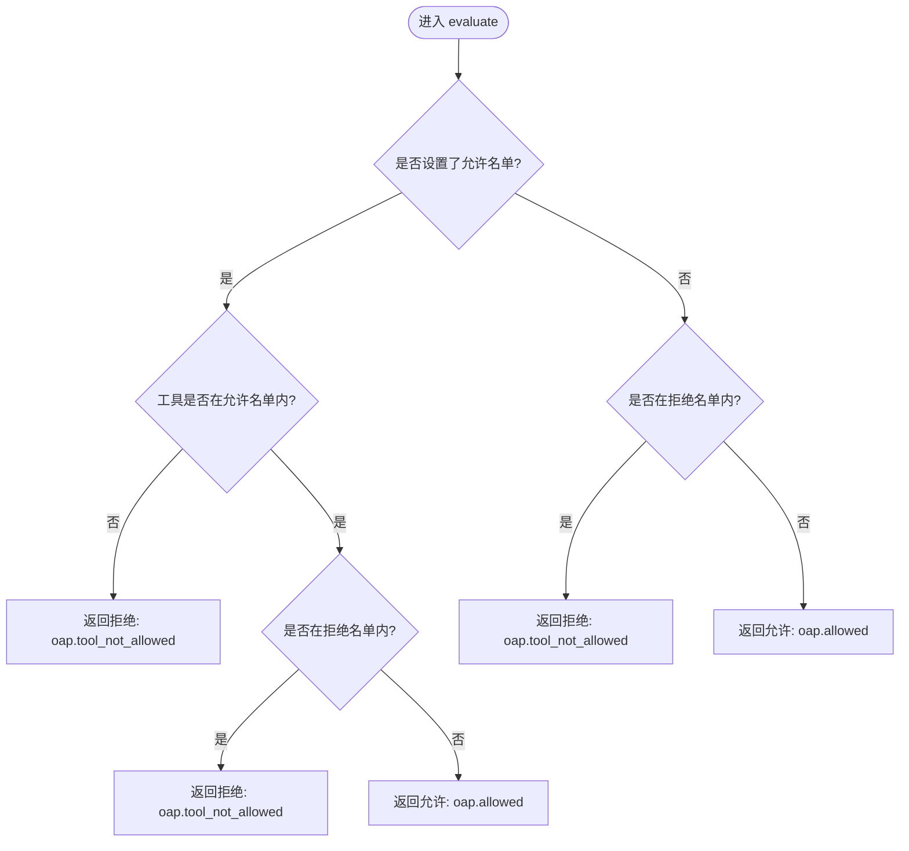
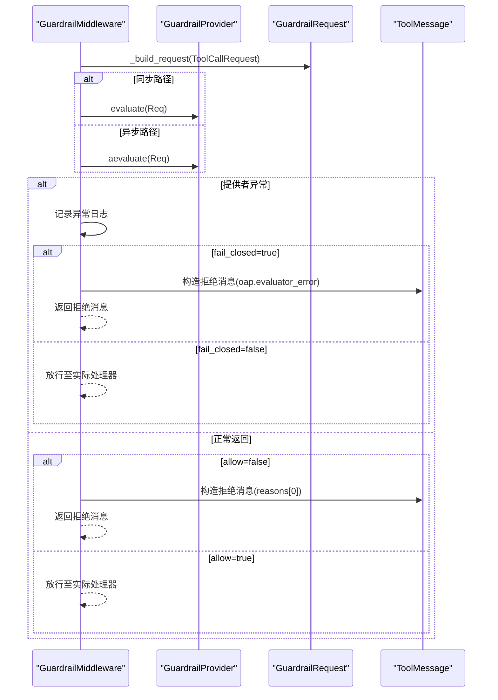
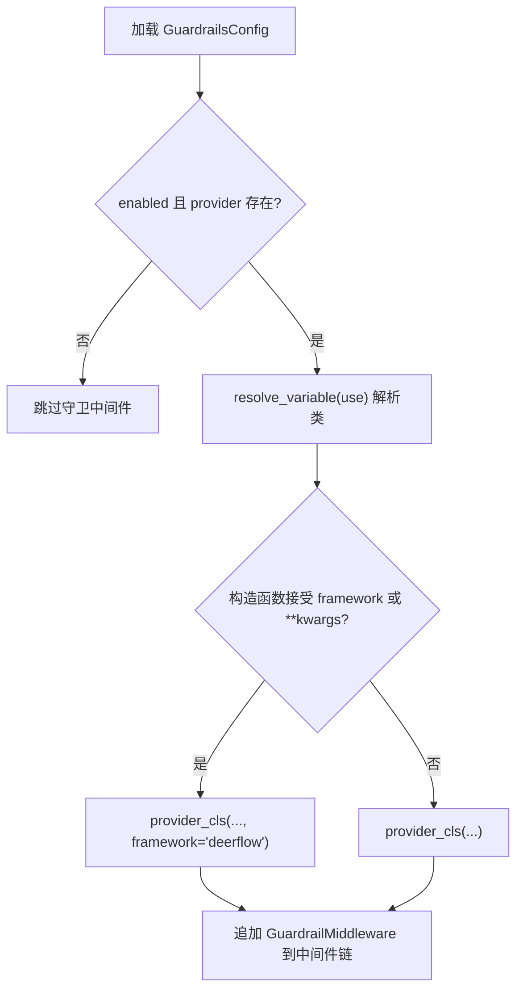
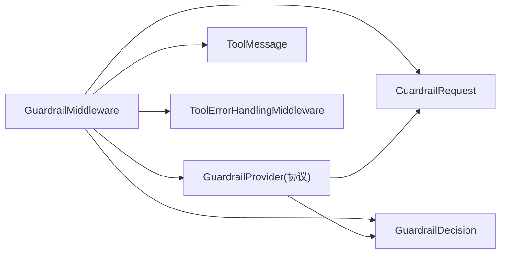

# 守卫提供者

<cite>
**本文引用的文件列表**
- [provider.py](file://backend/packages/harness/deerflow/guardrails/provider.py)
- [middleware.py](file://backend/packages/harness/deerflow/guardrails/middleware.py)
- [builtin.py](file://backend/packages/harness/deerflow/guardrails/builtin.py)
- [guardrails_config.py](file://backend/packages/harness/deerflow/config/guardrails_config.py)
- [tool_error_handling_middleware.py](file://backend/packages/harness/deerflow/agents/middlewares/tool_error_handling_middleware.py)
- [GUARDRAILS.md](file://backend/docs/GUARDRAILS.md)
- [test_guardrail_middleware.py](file://backend/tests/test_guardrail_middleware.py)
- [__init__.py](file://backend/packages/harness/deerflow/guardrails/__init__.py)
- [config.example.yaml](file://config.example.yaml)
</cite>

## 目录
1. [简介](#简介)
2. [项目结构](#项目结构)
3. [核心组件](#核心组件)
4. [架构总览](#架构总览)
5. [详细组件分析](#详细组件分析)
6. [依赖关系分析](#依赖关系分析)
7. [性能考量](#性能考量)
8. [故障排查指南](#故障排查指南)
9. [结论](#结论)
10. [附录](#附录)

## 简介
本文件面向 DeerFlow 守卫提供者（Guardrail Provider）的技术文档，系统阐述守卫提供者的接口设计与抽象协议、数据结构定义、评估方法签名、异步评估支持与错误处理机制，并给出自定义守卫提供者的开发指南、最佳实践与性能优化建议。同时，解释守卫提供者与守卫中间件的交互模式与生命周期管理，帮助开发者在不引入人类干预的前提下，对工具调用进行确定性的策略授权。

## 项目结构
守卫相关的核心代码位于后端 harness 包中，主要包含：
- 协议与数据结构：provider.py
- 中间件：middleware.py
- 内置提供者：builtin.py
- 配置模型与单例：guardrails_config.py
- 中间件链集成：agents/middlewares/tool_error_handling_middleware.py
- 文档与测试：docs/GUARDRAILS.md、tests/test_guardrail_middleware.py
- 公共导出：guardrails/__init__.py
- 示例配置：config.example.yaml

图表来源
- [provider.py:1-57](file://backend/packages/harness/deerflow/guardrails/provider.py#L1-L57)
- [middleware.py:1-99](file://backend/packages/harness/deerflow/guardrails/middleware.py#L1-L99)
- [builtin.py:1-24](file://backend/packages/harness/deerflow/guardrails/builtin.py#L1-L24)
- [guardrails_config.py:1-49](file://backend/packages/harness/deerflow/config/guardrails_config.py#L1-L49)
- [tool_error_handling_middleware.py:1-138](file://backend/packages/harness/deerflow/agents/middlewares/tool_error_handling_middleware.py#L1-L138)
- [GUARDRAILS.md:1-386](file://backend/docs/GUARDRAILS.md#L1-L386)
- [test_guardrail_middleware.py:1-345](file://backend/tests/test_guardrail_middleware.py#L1-L345)
- [__init__.py:1-15](file://backend/packages/harness/deerflow/guardrails/__init__.py#L1-L15)

章节来源
- [provider.py:1-57](file://backend/packages/harness/deerflow/guardrails/provider.py#L1-L57)
- [middleware.py:1-99](file://backend/packages/harness/deerflow/guardrails/middleware.py#L1-L99)
- [builtin.py:1-24](file://backend/packages/harness/deerflow/guardrails/builtin.py#L1-L24)
- [guardrails_config.py:1-49](file://backend/packages/harness/deerflow/config/guardrails_config.py#L1-L49)
- [tool_error_handling_middleware.py:1-138](file://backend/packages/harness/deerflow/agents/middlewares/tool_error_handling_middleware.py#L1-L138)
- [GUARDRAILS.md:1-386](file://backend/docs/GUARDRAILS.md#L1-L386)
- [test_guardrail_middleware.py:1-345](file://backend/tests/test_guardrail_middleware.py#L1-L345)
- [__init__.py:1-15](file://backend/packages/harness/deerflow/guardrails/__init__.py#L1-L15)

## 核心组件
- 协议与数据结构
  - GuardrailRequest：传递给提供者的上下文，包含工具名、参数、代理标识、线程标识、是否子代理、时间戳等。
  - GuardrailReason：结构化拒绝原因，包含代码与消息。
  - GuardrailDecision：提供者的允许/拒绝决定，包含 allow 标志、reasons 列表、policy_id、metadata 字典。
  - GuardrailProvider：可插拔的工具调用授权协议，要求实现 evaluate 与 aevaluate 方法，支持同步与异步评估。
- 内置提供者
  - AllowlistProvider：基于允许/拒绝名单的零依赖提供者，支持同步与异步评估。
- 中间件
  - GuardrailMiddleware：在工具执行前对每个工具调用进行评估；支持 fail-closed/fail-open 行为；保留 LangGraph 控制信号（GraphBubbleUp）。
- 配置
  - GuardrailsConfig：启用开关、fail-closed、passport 引用、提供者配置（use 与 config）。
- 运行时集成
  - 在共享中间件构建器中按需加载 GuardrailMiddleware，通过 resolve_variable 动态解析提供者类路径。

章节来源
- [provider.py:9-57](file://backend/packages/harness/deerflow/guardrails/provider.py#L9-L57)
- [builtin.py:6-24](file://backend/packages/harness/deerflow/guardrails/builtin.py#L6-L24)
- [middleware.py:20-99](file://backend/packages/harness/deerflow/guardrails/middleware.py#L20-L99)
- [guardrails_config.py:6-49](file://backend/packages/harness/deerflow/config/guardrails_config.py#L6-L49)
- [tool_error_handling_middleware.py:93-118](file://backend/packages/harness/deerflow/agents/middlewares/tool_error_handling_middleware.py#L93-L118)

## 架构总览
守卫中间件位于标准工具执行链路之前，对每个工具调用进行策略评估。其与运行时中间件链的关系如下：

图表来源
- [middleware.py:54-99](file://backend/packages/harness/deerflow/guardrails/middleware.py#L54-L99)
- [tool_error_handling_middleware.py:37-66](file://backend/packages/harness/deerflow/agents/middlewares/tool_error_handling_middleware.py#L37-L66)

章节来源
- [middleware.py:20-99](file://backend/packages/harness/deerflow/guardrails/middleware.py#L20-L99)
- [tool_error_handling_middleware.py:68-118](file://backend/packages/harness/deerflow/agents/middlewares/tool_error_handling_middleware.py#L68-L118)

## 详细组件分析

### 数据结构与协议
- GuardrailRequest
  - 字段：tool_name、tool_input、agent_id、thread_id、is_subagent、timestamp
  - 用途：作为评估输入，携带工具名称、参数以及上下文标识
- GuardrailReason
  - 字段：code、message
  - 用途：标准化拒绝原因，便于统一编码与日志记录
- GuardrailDecision
  - 字段：allow、reasons、policy_id、metadata
  - 用途：提供者返回的最终决策，包含多条原因与元信息
- GuardrailProvider（协议）
  - 成员：name（字符串）、evaluate(request) -> GuardrailDecision、aevaluate(request) -> GuardrailDecision
  - 特性：无强制继承，采用结构化协议（runtime_checkable），可通过 isinstance 检测

图表来源
- [provider.py:9-57](file://backend/packages/harness/deerflow/guardrails/provider.py#L9-L57)

章节来源
- [provider.py:9-57](file://backend/packages/harness/deerflow/guardrails/provider.py#L9-L57)

### 内置提供者：AllowlistProvider
- 功能：基于允许/拒绝名单的简单授权
- 行为：
  - 若仅设置 allowed_tools，则仅允许白名单内的工具
  - 若设置 denied_tools，则拒绝黑名单内的工具
  - 同步与异步评估均委托到同步 evaluate
- 适用场景：快速上线、零外部依赖、基础安全控制

图表来源
- [builtin.py:15-24](file://backend/packages/harness/deerflow/guardrails/builtin.py#L15-L24)

章节来源
- [builtin.py:6-24](file://backend/packages/harness/deerflow/guardrails/builtin.py#L6-L24)

### 中间件：GuardrailMiddleware
- 职责：在工具执行前进行策略评估，根据决策决定放行或返回错误消息
- 关键点：
  - _build_request：从 ToolCallRequest 构造 GuardrailRequest，填充 agent_id（passport）与时间戳
  - _build_denied_message：将拒绝原因封装为 ToolMessage，便于后续中间件处理
  - 同步与异步路径：分别调用 evaluate 与 aevaluate
  - 错误处理：
    - GraphBubbleUp：LangGraph 控制信号，直接传播，不捕获
    - 其他异常：根据 fail_closed 决定阻断或放行
  - 日志：记录拒绝原因与策略 ID，便于审计

图表来源
- [middleware.py:54-99](file://backend/packages/harness/deerflow/guardrails/middleware.py#L54-L99)

章节来源
- [middleware.py:20-99](file://backend/packages/harness/deerflow/guardrails/middleware.py#L20-L99)

### 配置与加载
- GuardrailsConfig
  - enabled：是否启用守卫中间件
  - fail_closed：提供者异常时是否阻断
  - passport：传递给提供者的代理标识（passport）
  - provider：提供者配置，包含 use（类路径）与 config（传入提供者构造函数的参数）
- 加载流程
  - 通过 _build_runtime_middlewares 动态加载 GuardrailMiddleware
  - 使用 resolve_variable 解析提供者类路径
  - 自动注入 framework="deerflow"（若提供者构造函数接受该参数）

图表来源
- [guardrails_config.py:13-49](file://backend/packages/harness/deerflow/config/guardrails_config.py#L13-L49)
- [tool_error_handling_middleware.py:93-118](file://backend/packages/harness/deerflow/agents/middlewares/tool_error_handling_middleware.py#L93-L118)

章节来源
- [guardrails_config.py:13-49](file://backend/packages/harness/deerflow/config/guardrails_config.py#L13-L49)
- [tool_error_handling_middleware.py:93-118](file://backend/packages/harness/deerflow/agents/middlewares/tool_error_handling_middleware.py#L93-L118)

### 测试覆盖要点
- AllowlistProvider：允许/拒绝、白名单/黑名单组合、异步委托
- GuardrailMiddleware：允许放行、拒绝消息、fail-closed/fail-open、passport 透传、空原因回退、空工具名、协议检测、异步路径、GraphBubbleUp 传播
- 配置：默认值、from_dict、单例加载/重置

章节来源
- [test_guardrail_middleware.py:62-345](file://backend/tests/test_guardrail_middleware.py#L62-L345)

## 依赖关系分析
- 组件耦合
  - GuardrailMiddleware 依赖 GuardrailProvider 协议，不依赖具体实现，耦合度低
  - GuardrailMiddleware 依赖 LangGraph 的 ToolCallRequest 与 ToolMessage 类型
  - GuardrailMiddleware 与 ToolErrorHandlingMiddleware 并列在中间件链上
- 外部依赖
  - resolve_variable：用于动态解析提供者类路径
  - LangGraph：AgentMiddleware 接口、ToolCallRequest、ToolMessage、GraphBubbleUp
- 可能的循环依赖
  - 当前模块间无循环导入迹象

图表来源
- [middleware.py:15-17](file://backend/packages/harness/deerflow/guardrails/middleware.py#L15-L17)
- [provider.py:39-57](file://backend/packages/harness/deerflow/guardrails/provider.py#L39-L57)

章节来源
- [middleware.py:15-17](file://backend/packages/harness/deerflow/guardrails/middleware.py#L15-L17)
- [provider.py:39-57](file://backend/packages/harness/deerflow/guardrails/provider.py#L39-L57)

## 性能考量
- 评估开销
  - 内置 AllowlistProvider 为 O(1) 查找，适合高频工具调用
  - 复杂策略（如网络请求、外部 API）应尽量缓存与批量化
- 异步评估
  - 提供者可实现 aevaluate 以避免阻塞事件循环
  - 对于 CPU 密集型逻辑，建议使用线程池或进程池
- 日志与可观测性
  - 拒绝与异常日志应适度采样，避免影响吞吐
- 中间件顺序
  - 守卫中间件位于工具执行前，应尽量轻量，避免成为瓶颈

[本节为通用指导，无需特定文件引用]

## 故障排查指南
- 常见问题
  - 提供者异常导致阻断：检查 fail_closed 设置；必要时开启 fail_open 以便降级
  - GraphBubbleUp 被吞掉：确保未在提供者内部捕获 GraphBubbleUp
  - 拒绝消息内容不明确：确保提供者返回非空 reasons 列表
  - passport 未生效：确认 passport 是否正确传入中间件构造函数
- 定位手段
  - 查看中间件日志：拒绝原因、策略 ID、工具名
  - 使用测试用例思路复现：模拟 ToolCallRequest、Provider 行为与异常
- 相关测试参考
  - Provider 异常与 fail-closed/fail-open 行为
  - GraphBubbleUp 传播
  - 空原因回退与空工具名处理

章节来源
- [middleware.py:61-98](file://backend/packages/harness/deerflow/guardrails/middleware.py#L61-L98)
- [test_guardrail_middleware.py:131-301](file://backend/tests/test_guardrail_middleware.py#L131-L301)

## 结论
DeerFlow 的守卫提供者体系通过协议化接口与中间件链路，实现了对工具调用的确定性策略授权。内置 AllowlistProvider 提供零依赖的基础能力，而 GuardrailMiddleware 则以最小侵入的方式接入现有执行链。通过合理的配置与自定义提供者实现，可在不引入人工干预的前提下，满足多样化的安全与合规需求。

[本节为总结，无需特定文件引用]

## 附录

### 开发自定义守卫提供者指南
- 实现要求
  - 必须实现 name 属性与 evaluate 与 aevaluate 方法
  - evaluate 与 aevaluate 应返回 GuardrailDecision
  - 建议在构造函数中接受 framework 与 **kwargs，以兼容未来扩展
- 最佳实践
  - 明确拒绝原因：使用标准化 code 与清晰 message
  - 缓存与去重：对外部依赖进行缓存与幂等处理
  - 异步优先：复杂逻辑尽量使用异步实现
  - 保持幂等：多次评估应得到一致结果
- 性能建议
  - 尽量减少网络与磁盘 IO
  - 对热点数据进行本地缓存
  - 合理拆分策略，避免单点瓶颈
- 配置与加载
  - 在配置文件中指定 use（类路径）与 config（构造参数）
  - 通过 resolve_variable 动态加载，无需硬编码导入

章节来源
- [provider.py:39-57](file://backend/packages/harness/deerflow/guardrails/provider.py#L39-L57)
- [GUARDRAILS.md:254-331](file://backend/docs/GUARDRAILS.md#L254-L331)
- [config.example.yaml:617-624](file://config.example.yaml#L617-L624)

### 工具名称与策略对照
- 工具名称参考：bash、write_file、str_replace、read_file、ls、web_search、web_fetch、image_search、present_file、view_image、ask_clarification、task、mcp__* 等
- 建议策略：针对高风险工具（如 bash、write_file）建立严格限制；对查询类工具（web_search、web_fetch）建立访问范围与频率限制

章节来源
- [GUARDRAILS.md:285-304](file://backend/docs/GUARDRAILS.md#L285-L304)

### OAP 标准与代码映射
- 标准代码：oap.allowed、oap.tool_not_allowed、oap.command_not_allowed、oap.blocked_pattern、oap.limit_exceeded、oap.passport_suspended、oap.evaluator_error
- 建议：自定义提供者遵循 OAP 代码规范，便于统一日志与审计

章节来源
- [GUARDRAILS.md:305-318](file://backend/docs/GUARDRAILS.md#L305-L318)