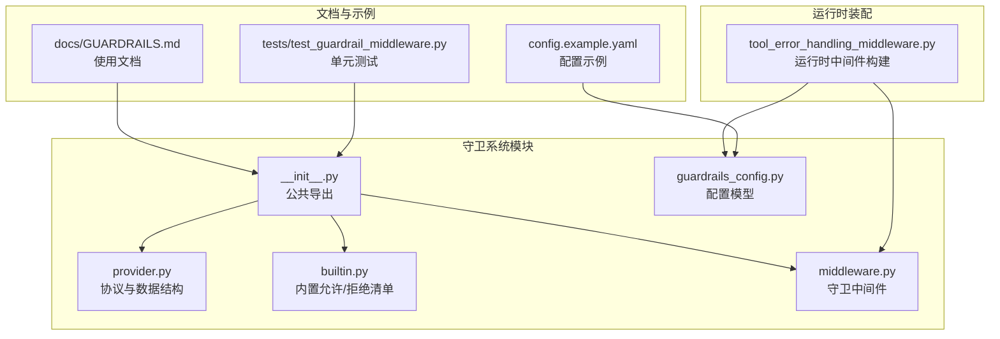
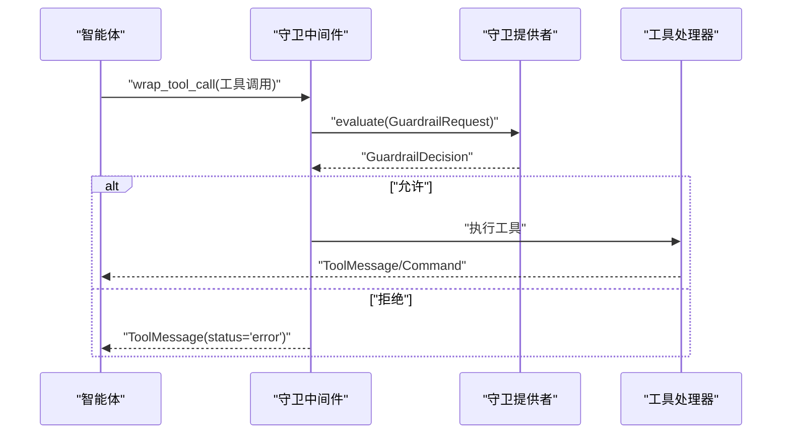
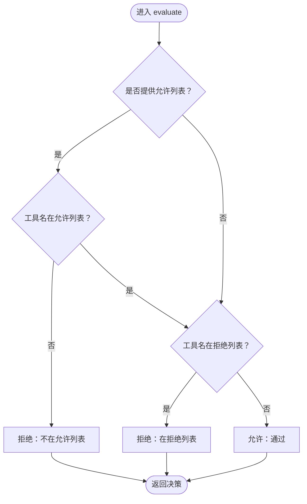
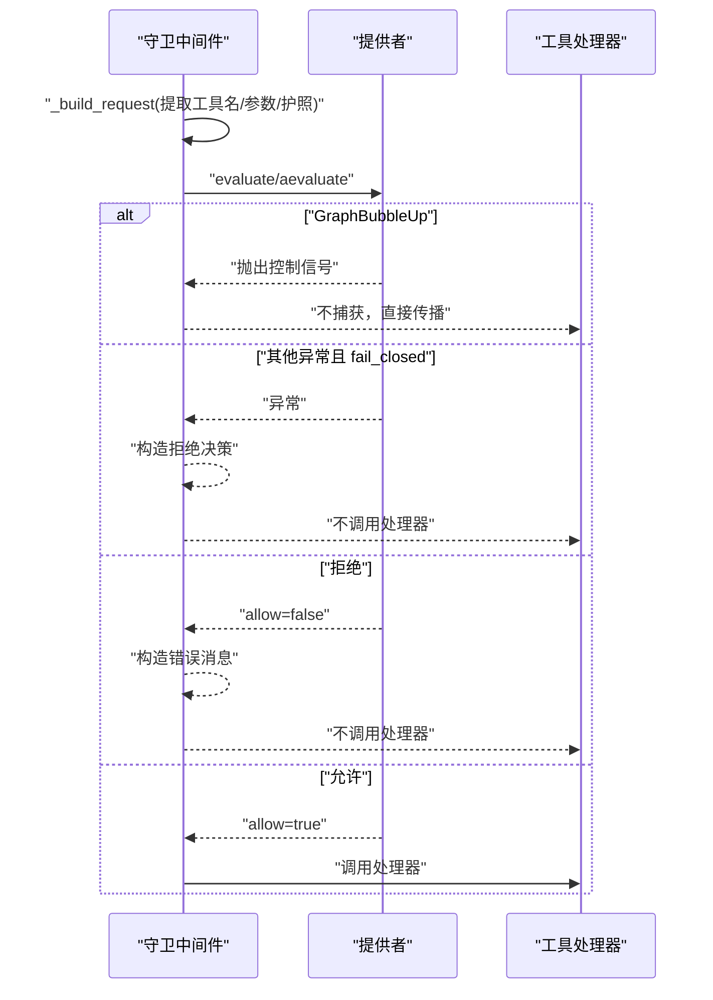
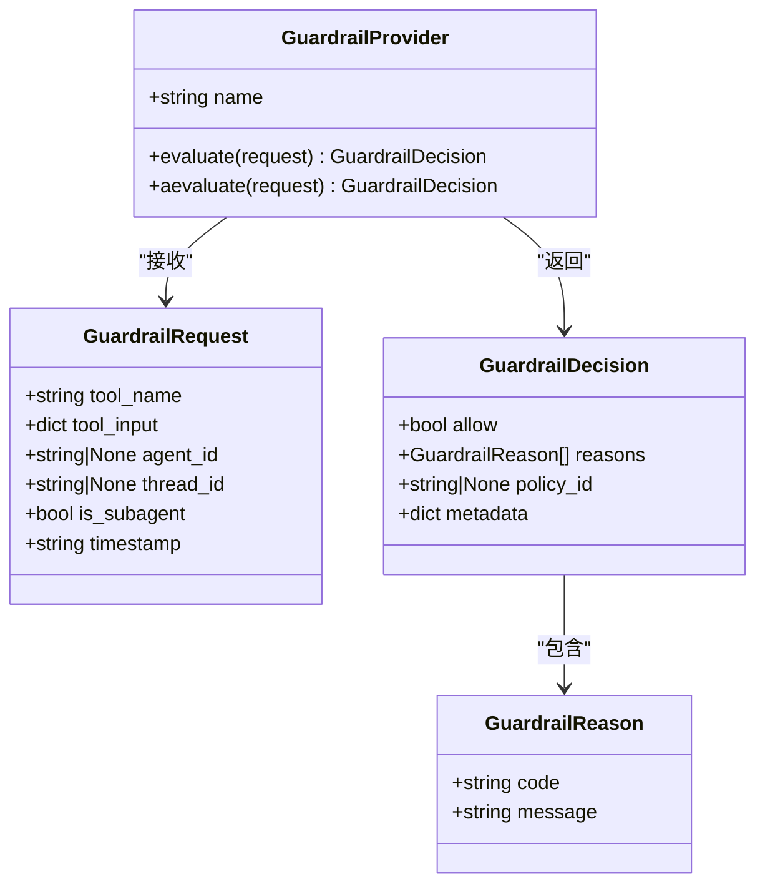
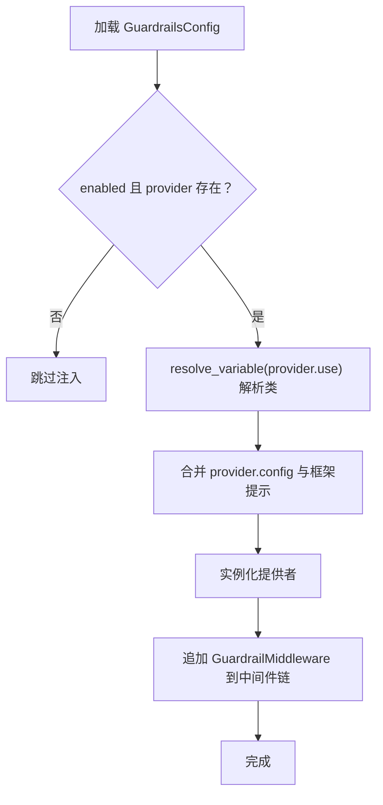
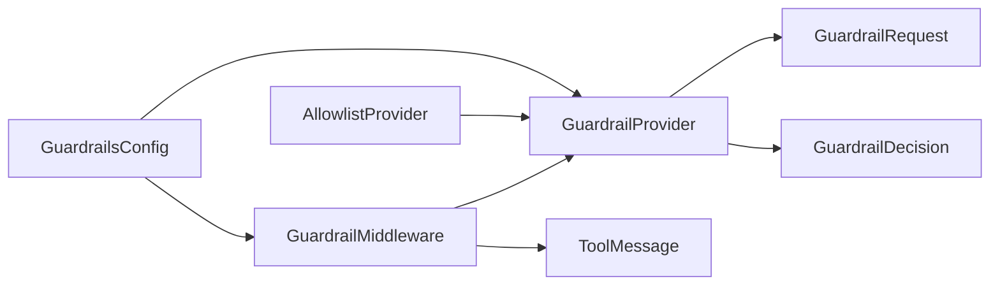

# 守卫系统

<cite>
**本文引用的文件**
- [backend/packages/harness/deerflow/guardrails/__init__.py](file://backend/packages/harness/deerflow/guardrails/__init__.py)
- [backend/packages/harness/deerflow/guardrails/provider.py](file://backend/packages/harness/deerflow/guardrails/provider.py)
- [backend/packages/harness/deerflow/guardrails/builtin.py](file://backend/packages/harness/deerflow/guardrails/builtin.py)
- [backend/packages/harness/deerflow/guardrails/middleware.py](file://backend/packages/harness/deerflow/guardrails/middleware.py)
- [backend/packages/harness/deerflow/config/guardrails_config.py](file://backend/packages/harness/deerflow/config/guardrails_config.py)
- [backend/packages/harness/deerflow/agents/middlewares/tool_error_handling_middleware.py](file://backend/packages/harness/deerflow/agents/middlewares/tool_error_handling_middleware.py)
- [backend/docs/GUARDRAILS.md](file://backend/docs/GUARDRAILS.md)
- [backend/tests/test_guardrail_middleware.py](file://backend/tests/test_guardrail_middleware.py)
- [config.example.yaml](file://config.example.yaml)
</cite>

## 目录
1. [简介](#简介)
2. [项目结构](#项目结构)
3. [核心组件](#核心组件)
4. [架构总览](#架构总览)
5. [详细组件分析](#详细组件分析)
6. [依赖分析](#依赖分析)
7. [性能考虑](#性能考虑)
8. [故障排查指南](#故障排查指南)
9. [结论](#结论)
10. [附录](#附录)

## 简介
本文件为 DeerFlow 守卫系统（Guardrails）提供完整技术文档，涵盖架构设计原理、内置守卫实现、守卫中间件机制、守卫提供者工作原理、策略配置与执行流程、规则定义、自定义守卫开发、性能优化建议、配置示例与安全策略最佳实践，并解释守卫系统与智能体、中间件的集成关系。

## 项目结构
守卫系统位于后端 harness 包中，核心模块包括：
- 提供者协议与数据结构：provider.py
- 内置允许/拒绝清单提供者：builtin.py
- 中间件：middleware.py
- 公共导出入口：__init__.py
- 配置模型：guardrails_config.py
- 运行时中间件装配：agents/middlewares/tool_error_handling_middleware.py
- 文档与示例：docs/GUARDRAILS.md、config.example.yaml、tests/test_guardrail_middleware.py

**图表来源**
- [backend/packages/harness/deerflow/guardrails/__init__.py:1-15](file://backend/packages/harness/deerflow/guardrails/__init__.py#L1-L15)
- [backend/packages/harness/deerflow/guardrails/provider.py:1-57](file://backend/packages/harness/deerflow/guardrails/provider.py#L1-L57)
- [backend/packages/harness/deerflow/guardrails/builtin.py:1-24](file://backend/packages/harness/deerflow/guardrails/builtin.py#L1-L24)
- [backend/packages/harness/deerflow/guardrails/middleware.py:1-99](file://backend/packages/harness/deerflow/guardrails/middleware.py#L1-L99)
- [backend/packages/harness/deerflow/config/guardrails_config.py:1-49](file://backend/packages/harness/deerflow/config/guardrails_config.py#L1-L49)
- [backend/packages/harness/deerflow/agents/middlewares/tool_error_handling_middleware.py:68-138](file://backend/packages/harness/deerflow/agents/middlewares/tool_error_handling_middleware.py#L68-L138)
- [backend/docs/GUARDRAILS.md:1-386](file://backend/docs/GUARDRAILS.md#L1-L386)
- [config.example.yaml:590-623](file://config.example.yaml#L590-L623)
- [backend/tests/test_guardrail_middleware.py:1-200](file://backend/tests/test_guardrail_middleware.py#L1-L200)

**章节来源**
- [backend/packages/harness/deerflow/guardrails/__init__.py:1-15](file://backend/packages/harness/deerflow/guardrails/__init__.py#L1-L15)
- [backend/docs/GUARDRAILS.md:38-70](file://backend/docs/GUARDRAILS.md#L38-L70)

## 核心组件
- GuardrailProvider 协议：定义 evaluate/aevaluate 接口，支持同步与异步决策。
- GuardrailRequest/GuardrailDecision：请求上下文与决策结果的数据结构。
- AllowlistProvider：零依赖的内置允许/拒绝清单提供者。
- GuardrailMiddleware：在工具调用前进行授权检查的中间件。
- GuardrailsConfig：守卫配置模型，支持启用、失败闭合策略、护照引用与提供者配置。
- 运行时装配：通过工具错误处理中间件构建器动态注入守卫中间件。

**章节来源**
- [backend/packages/harness/deerflow/guardrails/provider.py:9-57](file://backend/packages/harness/deerflow/guardrails/provider.py#L9-L57)
- [backend/packages/harness/deerflow/guardrails/builtin.py:6-24](file://backend/packages/harness/deerflow/guardrails/builtin.py#L6-L24)
- [backend/packages/harness/deerflow/guardrails/middleware.py:20-99](file://backend/packages/harness/deerflow/guardrails/middleware.py#L20-L99)
- [backend/packages/harness/deerflow/config/guardrails_config.py:6-49](file://backend/packages/harness/deerflow/config/guardrails_config.py#L6-L49)
- [backend/packages/harness/deerflow/agents/middlewares/tool_error_handling_middleware.py:68-138](file://backend/packages/harness/deerflow/agents/middlewares/tool_error_handling_middleware.py#L68-L138)

## 架构总览
守卫中间件作为“预执行授权层”，在每个工具调用进入实际执行之前进行策略评估。它与 LangGraph AgentMiddleware 模式对齐，遵循 wrap_tool_call/awrap_tool_call 生命周期，并与上传、沙箱、错误处理等中间件共同构成执行链。

**图表来源**
- [backend/packages/harness/deerflow/guardrails/middleware.py:54-76](file://backend/packages/harness/deerflow/guardrails/middleware.py#L54-L76)
- [backend/packages/harness/deerflow/guardrails/provider.py:40-57](file://backend/packages/harness/deerflow/guardrails/provider.py#L40-L57)

**章节来源**
- [backend/docs/GUARDRAILS.md:38-80](file://backend/docs/GUARDRAILS.md#L38-L80)

## 详细组件分析

### 组件A：内置允许/拒绝清单提供者（AllowlistProvider）
- 设计要点
  - 支持仅允许列表与仅拒绝列表两种模式；两者同时存在时，允许列表优先。
  - 同步/异步 evaluate/aevaluate 方法，异步默认委托到同步实现。
- 复杂度与性能
  - 列表查找为 O(n)（n 为工具名集合），允许/拒绝集合为哈希集合，查找近似 O(1)。
  - 适合小规模、静态策略场景，部署零外部依赖。
- 错误处理
  - 不抛异常，返回明确的拒绝决策与原因码。

**图表来源**
- [backend/packages/harness/deerflow/guardrails/builtin.py:15-24](file://backend/packages/harness/deerflow/guardrails/builtin.py#L15-L24)

**章节来源**
- [backend/packages/harness/deerflow/guardrails/builtin.py:6-24](file://backend/packages/harness/deerflow/guardrails/builtin.py#L6-L24)
- [backend/tests/test_guardrail_middleware.py:62-106](file://backend/tests/test_guardrail_middleware.py#L62-L106)

### 组件B：守卫中间件（GuardrailMiddleware）
- 职责
  - 将工具调用请求封装为 GuardrailRequest 并交由提供者评估。
  - 若提供者抛出 GraphBubbleUp 异常，则直接传播（保留 LangGraph 控制信号）。
  - 若提供者抛出其他异常且 fail_closed=true，则按拒绝处理；否则放行并记录警告。
  - 拒绝时构造状态为 error 的 ToolMessage，便于智能体自适应。
- 执行流程
  - 同步路径：wrap_tool_call
  - 异步路径：awrap_tool_call
- 与智能体集成
  - 作为 AgentMiddleware 注入执行链，紧邻工具错误处理中间件之前。

**图表来源**
- [backend/packages/harness/deerflow/guardrails/middleware.py:54-99](file://backend/packages/harness/deerflow/guardrails/middleware.py#L54-L99)

**章节来源**
- [backend/packages/harness/deerflow/guardrails/middleware.py:20-99](file://backend/packages/harness/deerflow/guardrails/middleware.py#L20-L99)
- [backend/tests/test_guardrail_middleware.py:111-200](file://backend/tests/test_guardrail_middleware.py#L111-L200)

### 组件C：提供者协议与数据结构（GuardrailProvider 协议）
- 协议接口
  - name: 字符串标识
  - evaluate(request): 同步决策
  - aevaluate(request): 异步决策
- 数据结构
  - GuardrailRequest：包含工具名、输入参数、代理/线程标识、是否子代理、时间戳等。
  - GuardrailReason：包含原因码与消息。
  - GuardrailDecision：包含 allow、reasons、policy_id、metadata。

**图表来源**
- [backend/packages/harness/deerflow/guardrails/provider.py:9-57](file://backend/packages/harness/deerflow/guardrails/provider.py#L9-L57)

**章节来源**
- [backend/packages/harness/deerflow/guardrails/provider.py:9-57](file://backend/packages/harness/deerflow/guardrails/provider.py#L9-L57)

### 组件D：配置与运行时装配
- 配置模型（GuardrailsConfig）
  - enabled/fail_closed/passport/provider.use/provider.config
- 运行时装配
  - 在构建运行时中间件时，根据配置加载提供者类并实例化，注入 GuardrailMiddleware。
  - 自动检测提供者构造函数签名，必要时注入 framework="deerflow" 参数。

**图表来源**
- [backend/packages/harness/deerflow/config/guardrails_config.py:13-49](file://backend/packages/harness/deerflow/config/guardrails_config.py#L13-L49)
- [backend/packages/harness/deerflow/agents/middlewares/tool_error_handling_middleware.py:93-119](file://backend/packages/harness/deerflow/agents/middlewares/tool_error_handling_middleware.py#L93-L119)

**章节来源**
- [backend/packages/harness/deerflow/config/guardrails_config.py:13-49](file://backend/packages/harness/deerflow/config/guardrails_config.py#L13-L49)
- [backend/packages/harness/deerflow/agents/middlewares/tool_error_handling_middleware.py:68-138](file://backend/packages/harness/deerflow/agents/middlewares/tool_error_handling_middleware.py#L68-L138)
- [config.example.yaml:590-623](file://config.example.yaml#L590-L623)

## 依赖分析
- 组件内聚与耦合
  - GuardrailMiddleware 与 GuardrailProvider 通过协议解耦，支持任意实现。
  - AllowlistProvider 与 GuardrailMiddleware 之间为弱耦合，便于替换。
- 外部依赖
  - 仅依赖 LangGraph AgentMiddleware 接口与 ToolMessage 类型。
  - 内置提供者零外部依赖，适合生产环境稳定运行。
- 循环依赖
  - 未发现循环导入或循环依赖。

**图表来源**
- [backend/packages/harness/deerflow/guardrails/provider.py:9-57](file://backend/packages/harness/deerflow/guardrails/provider.py#L9-L57)
- [backend/packages/harness/deerflow/guardrails/middleware.py:15-17](file://backend/packages/harness/deerflow/guardrails/middleware.py#L15-L17)
- [backend/packages/harness/deerflow/guardrails/builtin.py:3-4](file://backend/packages/harness/deerflow/guardrails/builtin.py#L3-L4)
- [backend/packages/harness/deerflow/config/guardrails_config.py:13-24](file://backend/packages/harness/deerflow/config/guardrails_config.py#L13-L24)

**章节来源**
- [backend/packages/harness/deerflow/guardrails/middleware.py:1-17](file://backend/packages/harness/deerflow/guardrails/middleware.py#L1-L17)
- [backend/packages/harness/deerflow/guardrails/builtin.py:1-4](file://backend/packages/harness/deerflow/guardrails/builtin.py#L1-L4)

## 性能考虑
- 决策延迟
  - 内置 AllowlistProvider 为 O(1) 查找，适合高频工具调用场景。
  - 自定义提供者应避免阻塞操作；若需网络访问，建议采用异步实现与缓存策略。
- 中间件链顺序
  - 守卫中间件位于工具错误处理之前，确保拒绝的工具调用不会触发后续昂贵操作。
- 日志与可观测性
  - 拒绝与异常会输出日志，便于审计与问题定位。
- 建议
  - 对高并发场景，优先选择本地快速决策的提供者实现。
  - 使用异步 aevaluate 以提升吞吐量。

[本节为通用性能指导，无需特定文件来源]

## 故障排查指南
- 常见问题
  - GraphBubbleUp 未被捕获：守卫中间件正确传播 LangGraph 控制信号，不应被吞掉。
  - 提供者异常：fail_closed=true 时会按拒绝处理；fail_closed=false 时会放行并记录警告。
  - 空理由列表：当提供者返回空 reasons 时，中间件会使用回退文本。
  - 工具名为空：中间件对空名称进行容错处理。
- 测试覆盖
  - 单元测试覆盖了允许/拒绝、异步路径、GraphBubbleUp、配置加载等关键行为。

**章节来源**
- [backend/tests/test_guardrail_middleware.py:111-200](file://backend/tests/test_guardrail_middleware.py#L111-L200)
- [backend/tests/test_guardrail_middleware.py:258-303](file://backend/tests/test_guardrail_middleware.py#L258-L303)

## 结论
 DeerFlow 守卫系统通过轻量、可插拔的中间件与协议化提供者，实现了对工具调用的确定性授权。内置允许/拒绝清单提供者满足基础需求，而协议与配置模型则支持接入 OAP 或自定义提供者，满足复杂策略场景。通过在中间件链中的合理位置插入，守卫系统与沙箱、上传、错误处理等中间件协同，形成安全可控的执行环境。

[本节为总结，无需特定文件来源]

## 附录

### 守卫规则定义与最佳实践
- 规则定义
  - 允许/拒绝清单：基于工具名的白名单/黑名单。
  - OAP 通行证：基于能力与限制的策略，支持命令允许列表与禁止模式匹配。
- 最佳实践
  - 默认启用 fail_closed，确保异常情况下拒绝调用。
  - 使用 passport 传递代理身份信息，便于策略差异化。
  - 将守卫中间件置于昂贵操作之前，减少资源浪费。
  - 对自定义提供者实现异步接口，提升并发性能。

**章节来源**
- [backend/docs/GUARDRAILS.md:186-210](file://backend/docs/GUARDRAILS.md#L186-L210)
- [backend/docs/GUARDRAILS.md:332-351](file://backend/docs/GUARDRAILS.md#L332-L351)

### 自定义守卫开发步骤
- 实现协议
  - 提供 evaluate/aevaluate 方法，返回 GuardrailDecision。
  - 可选：在构造函数中接受 framework 与自定义配置。
- 注册与配置
  - 将类路径写入配置的 provider.use，并在 provider.config 中传入所需参数。
  - 通过 resolve_variable 动态加载类。

**章节来源**
- [backend/docs/GUARDRAILS.md:212-247](file://backend/docs/GUARDRAILS.md#L212-L247)
- [backend/packages/harness/deerflow/agents/middlewares/tool_error_handling_middleware.py:93-119](file://backend/packages/harness/deerflow/agents/middlewares/tool_error_handling_middleware.py#L93-L119)

### 配置示例
- 内置允许/拒绝清单
  - 在配置中启用守卫并指定内置提供者与 denied_tools/allowed_tools。
- OAP 提供者
  - 指定 OAP 提供者类路径，并按需提供 passport 路径或配置。
- 自定义提供者
  - 指定自定义类路径并在 config 中传参。

**章节来源**
- [config.example.yaml:600-623](file://config.example.yaml#L600-L623)
- [backend/docs/GUARDRAILS.md:87-114](file://backend/docs/GUARDRAILS.md#L87-L114)
- [backend/docs/GUARDRAILS.md:166-183](file://backend/docs/GUARDRAILS.md#L166-L183)