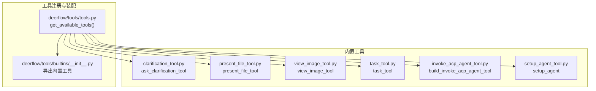
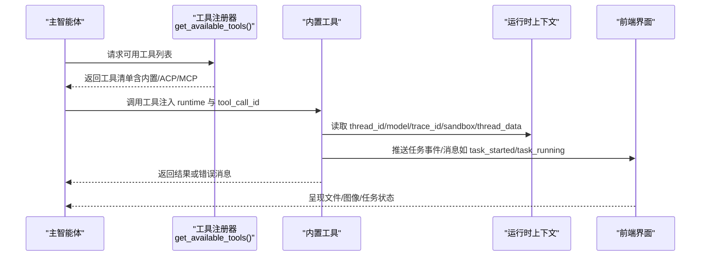
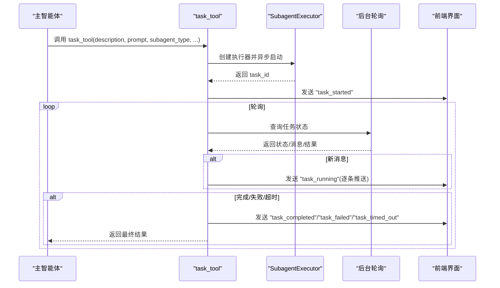
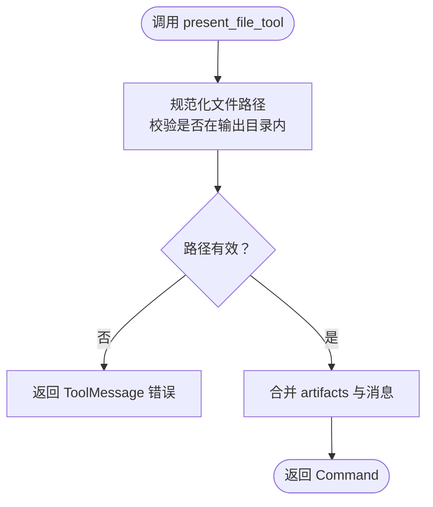
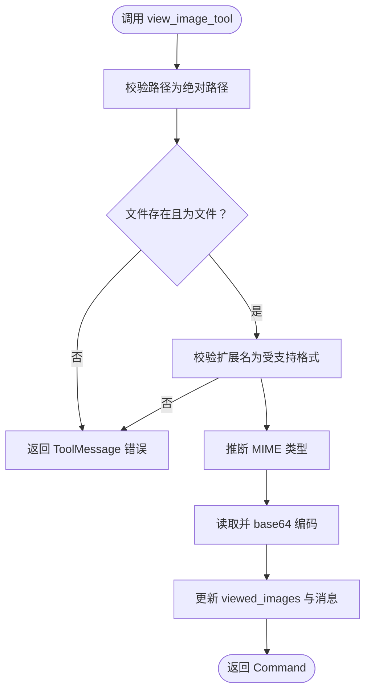
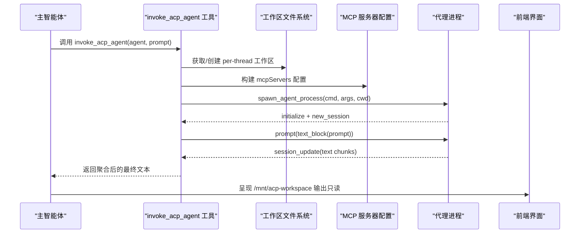
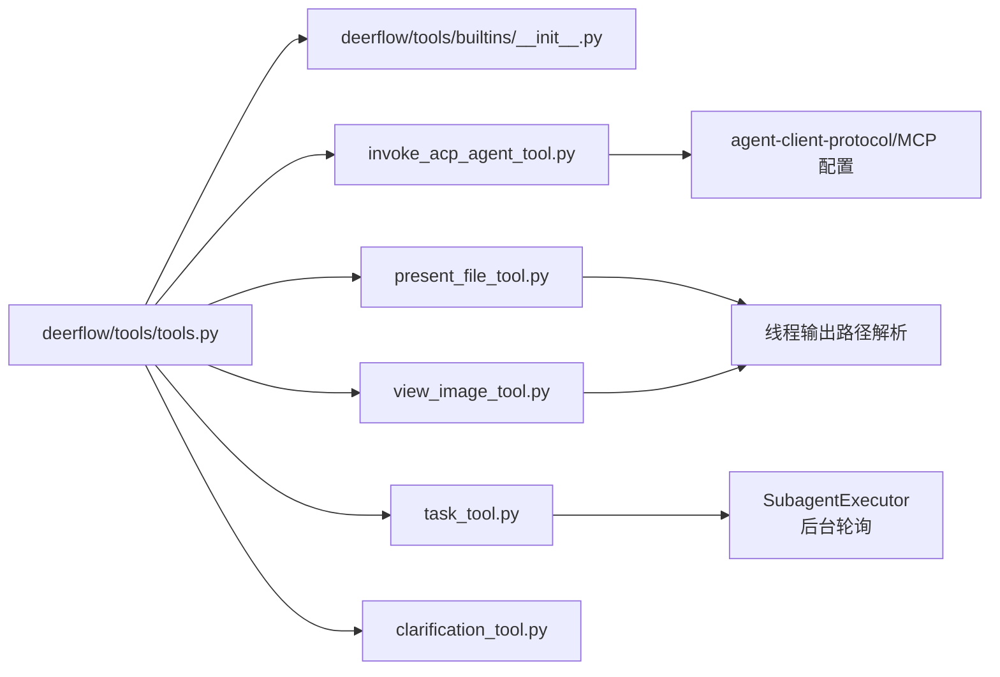

# 内置工具

<cite>
**本文引用的文件**
- [backend/packages/harness/deerflow/tools/builtins/__init__.py](file://backend/packages/harness/deerflow/tools/builtins/__init__.py)
- [backend/packages/harness/deerflow/tools/builtins/task_tool.py](file://backend/packages/harness/deerflow/tools/builtins/task_tool.py)
- [backend/packages/harness/deerflow/tools/builtins/present_file_tool.py](file://backend/packages/harness/deerflow/tools/builtins/present_file_tool.py)
- [backend/packages/harness/deerflow/tools/builtins/view_image_tool.py](file://backend/packages/harness/deerflow/tools/builtins/view_image_tool.py)
- [backend/packages/harness/deerflow/tools/builtins/invoke_acp_agent_tool.py](file://backend/packages/harness/deerflow/tools/builtins/invoke_acp_agent_tool.py)
- [backend/packages/harness/deerflow/tools/builtins/clarification_tool.py](file://backend/packages/harness/deerflow/tools/builtins/clarification_tool.py)
- [backend/packages/harness/deerflow/tools/builtins/setup_agent_tool.py](file://backend/packages/harness/deerflow/tools/builtins/setup_agent_tool.py)
- [backend/packages/harness/deerflow/tools/tools.py](file://backend/packages/harness/deerflow/tools/tools.py)
- [backend/tests/test_task_tool_core_logic.py](file://backend/tests/test_task_tool_core_logic.py)
- [backend/tests/test_present_file_tool_core_logic.py](file://backend/tests/test_present_file_tool_core_logic.py)
- [backend/tests/test_invoke_acp_agent_tool.py](file://backend/tests/test_invoke_acp_agent_tool.py)
</cite>

## 目录
1. [简介](#简介)
2. [项目结构](#项目结构)
3. [核心组件](#核心组件)
4. [架构总览](#架构总览)
5. [详细组件分析](#详细组件分析)
6. [依赖关系分析](#依赖关系分析)
7. [性能考量](#性能考量)
8. [故障排查指南](#故障排查指南)
9. [结论](#结论)
10. [附录](#附录)

## 简介
本文件系统性梳理 DeerFlow 的内置工具集，覆盖以下类型与职责：
- 用户明确信息类工具：用于向用户提问以获取必要信息或确认风险，确保在关键节点获得清晰决策输入。
- 任务工具：委托子智能体（Subagent）执行复杂、多步骤或需要隔离上下文的任务，并通过轮询反馈进度与结果。
- 文件展示工具：将生成的产物文件暴露给前端界面，便于用户查看、下载与交互。
- 图像查看工具：读取并编码指定图像文件，供前端渲染显示。
- ACP 代理调用工具：桥接外部 ACP 兼容智能体，实现跨智能体协作与独立工作区输出管理。

文档包含每类工具的参数定义、返回值格式、典型使用场景、最佳实践以及与后端控制流的集成要点，并提供可定位到源码的路径以便深入学习。

## 项目结构
内置工具集中于后端 harness 包下的 tools/builtins 目录，统一由工具注册入口导出；工具选择与装配逻辑位于 deerflow/tools/tools.py 中，依据配置动态组合内置、MCP、ACP 与加载的工具集合。

图表来源
- [backend/packages/harness/deerflow/tools/builtins/__init__.py:1-14](file://backend/packages/harness/deerflow/tools/builtins/__init__.py#L1-L14)
- [backend/packages/harness/deerflow/tools/tools.py:23-115](file://backend/packages/harness/deerflow/tools/tools.py#L23-L115)

章节来源
- [backend/packages/harness/deerflow/tools/builtins/__init__.py:1-14](file://backend/packages/harness/deerflow/tools/builtins/__init__.py#L1-L14)
- [backend/packages/harness/deerflow/tools/tools.py:23-115](file://backend/packages/harness/deerflow/tools/tools.py#L23-L115)

## 核心组件
- 用户明确信息类工具
  - ask_clarification_tool：在需要更多信息或确认时中断执行，向用户提出问题，支持多种澄清类型（缺失信息、歧义需求、方案选择、风险确认、建议）。
- 任务工具
  - task_tool：委托子智能体执行复杂任务，支持通用型与 Bash 子智能体，具备轮询状态、进度事件推送与超时保护。
- 文件展示工具
  - present_file_tool：将位于线程输出目录的文件暴露给前端，支持多文件一次性呈现。
- 图像查看工具
  - view_image_tool：读取指定绝对路径的图像文件，校验扩展名与存在性，编码为 base64 并返回 MIME 类型。
- ACP 代理调用工具
  - build_invoke_acp_agent_tool：根据配置动态生成可调用的 ACP 代理工具，自动构建工作区、MCP 服务器配置与权限响应策略。
- 设置工具
  - setup_agent：在运行时写入自定义 Agent 的 SOUL 与配置，支持清理失败时的回滚。

章节来源
- [backend/packages/harness/deerflow/tools/builtins/clarification_tool.py:6-56](file://backend/packages/harness/deerflow/tools/builtins/clarification_tool.py#L6-L56)
- [backend/packages/harness/deerflow/tools/builtins/task_tool.py:21-196](file://backend/packages/harness/deerflow/tools/builtins/task_tool.py#L21-L196)
- [backend/packages/harness/deerflow/tools/builtins/present_file_tool.py:62-101](file://backend/packages/harness/deerflow/tools/builtins/present_file_tool.py#L62-L101)
- [backend/packages/harness/deerflow/tools/builtins/view_image_tool.py:15-95](file://backend/packages/harness/deerflow/tools/builtins/view_image_tool.py#L15-L95)
- [backend/packages/harness/deerflow/tools/builtins/invoke_acp_agent_tool.py:101-209](file://backend/packages/harness/deerflow/tools/builtins/invoke_acp_agent_tool.py#L101-L209)
- [backend/packages/harness/deerflow/tools/builtins/setup_agent_tool.py:14-63](file://backend/packages/harness/deerflow/tools/builtins/setup_agent_tool.py#L14-L63)

## 架构总览
内置工具与后端运行时的交互遵循“工具注册—运行时注入—状态更新—事件流”的模式。工具通过装饰器声明并在运行时被注入上下文（如线程 ID、模型名称、追踪 ID），最终通过命令对象或消息更新状态，驱动前端渲染与后续流程。

图表来源
- [backend/packages/harness/deerflow/tools/tools.py:23-115](file://backend/packages/harness/deerflow/tools/tools.py#L23-L115)
- [backend/packages/harness/deerflow/tools/builtins/task_tool.py:78-130](file://backend/packages/harness/deerflow/tools/builtins/task_tool.py#L78-L130)
- [backend/packages/harness/deerflow/tools/builtins/present_file_tool.py:87-101](file://backend/packages/harness/deerflow/tools/builtins/present_file_tool.py#L87-L101)
- [backend/packages/harness/deerflow/tools/builtins/view_image_tool.py:35-95](file://backend/packages/harness/deerflow/tools/builtins/view_image_tool.py#L35-L95)

## 详细组件分析

### 用户明确信息工具：ask_clarification_tool
- 功能概述
  - 在需要更多信息或确认时中断执行，向用户提出问题，等待用户回复后再继续。
  - 支持多种澄清类型：缺失信息、歧义需求、方案选择、风险确认、建议。
- 参数定义
  - question: 明确具体的问题描述。
  - clarification_type: 澄清类型枚举。
  - context: 可选上下文，解释为何需要澄清。
  - options: 可选选项列表，适用于方案选择或建议类型。
- 返回值
  - 字符串占位返回，实际逻辑由中间件拦截并中断执行，向用户展示问题。
- 使用场景
  - 需要补充细节、确认风险、在多个可行方案中做选择、对可能破坏性操作进行确认。
- 最佳实践
  - 每次仅提一个问题，表述清晰，避免假设；对高风险操作必须要求确认。
- 集成要点
  - 工具注册时即包含在内置工具列表中，无需额外开关。

章节来源
- [backend/packages/harness/deerflow/tools/builtins/clarification_tool.py:6-56](file://backend/packages/harness/deerflow/tools/builtins/clarification_tool.py#L6-L56)
- [backend/packages/harness/deerflow/tools/tools.py:12-15](file://backend/packages/harness/deerflow/tools/tools.py#L12-L15)

### 任务工具：task_tool
- 功能概述
  - 将复杂或多步骤任务委托给专用子智能体（通用型或 Bash），在独立上下文中执行，避免主线程上下文污染。
  - 内部异步启动任务，轮询状态并通过事件流向前端推送进度。
- 参数定义
  - description: 任务简述（日志/展示用途，3–5 词）。
  - prompt: 子智能体任务描述，应具体明确。
  - subagent_type: 子智能体类型（general-purpose 或 bash）。
  - max_turns: 可选最大轮次，默认使用子智能体配置。
  - runtime: 运行时上下文（注入 tool_call_id、thread_id、trace_id、模型名、沙箱与线程数据）。
- 返回值
  - 成功：返回“任务成功”及结果摘要。
  - 失败：返回“任务失败”及错误信息。
  - 超时：返回“任务轮询超时”提示。
- 使用场景
  - 需要多步骤探索与执行、产生冗长输出、希望隔离上下文、并行研究或探索。
- 不适用场景
  - 单步简单操作、需要用户交互或澄清的任务。
- 最佳实践
  - 对复杂任务优先使用子智能体；合理设置 max_turns；避免嵌套调用（子智能体禁用自身子智能体工具）。
- 控制流与事件
  - 启动后发送“task_started”，期间按新消息推送“task_running”，完成后发送“task_completed”或“task_failed/timeout”。

图表来源
- [backend/packages/harness/deerflow/tools/builtins/task_tool.py:104-196](file://backend/packages/harness/deerflow/tools/builtins/task_tool.py#L104-L196)

章节来源
- [backend/packages/harness/deerflow/tools/builtins/task_tool.py:21-196](file://backend/packages/harness/deerflow/tools/builtins/task_tool.py#L21-L196)
- [backend/tests/test_task_tool_core_logic.py](file://backend/tests/test_task_tool_core_logic.py)

### 文件展示工具：present_file_tool
- 功能概述
  - 将位于线程输出目录的文件暴露给前端，支持多文件一次性呈现。
  - 自动规范化路径，确保只允许输出目录内的文件被呈现。
- 参数定义
  - filepaths: 绝对路径列表，仅限线程输出目录内文件。
  - runtime: 注入 tool_call_id 与运行时上下文。
- 返回值
  - Command 对象，包含 artifacts 更新与消息提示；异常时返回 ToolMessage 错误。
- 使用场景
  - 创建文件后向用户展示、批量呈现相关产物、允许用户下载与交互。
- 不适用场景
  - 仅需读取文件内容进行内部处理、临时中间文件不面向用户。
- 最佳实践
  - 文件创建完成后立即调用；路径规范化由工具完成，无需手动拼接虚拟路径前缀。
- 路径与安全
  - 仅允许输出目录内的文件；若路径不在当前线程输出目录则抛出错误。

图表来源
- [backend/packages/harness/deerflow/tools/builtins/present_file_tool.py:15-60](file://backend/packages/harness/deerflow/tools/builtins/present_file_tool.py#L15-L60)
- [backend/packages/harness/deerflow/tools/builtins/present_file_tool.py:87-101](file://backend/packages/harness/deerflow/tools/builtins/present_file_tool.py#L87-L101)

章节来源
- [backend/packages/harness/deerflow/tools/builtins/present_file_tool.py:62-101](file://backend/packages/harness/deerflow/tools/builtins/present_file_tool.py#L62-L101)
- [backend/tests/test_present_file_tool_core_logic.py](file://backend/tests/test_present_file_tool_core_logic.py)

### 图像查看工具：view_image_tool
- 功能概述
  - 读取指定绝对路径的图像文件，校验扩展名与存在性，检测 MIME 类型并编码为 base64，供前端渲染。
- 参数定义
  - image_path: 绝对路径，支持常见图像格式（jpg/jpeg/png/webp）。
  - runtime: 注入 tool_call_id 与运行时上下文。
- 返回值
  - Command 对象，包含 viewed_images 更新与消息提示；异常时返回 ToolMessage 错误。
- 使用场景
  - 需要在对话中展示图片、图表或可视化结果。
- 不适用场景
  - 非图像文件、多文件同时展示（请改用 present_files）。
- 最佳实践
  - 传入绝对路径；确保文件存在且扩展名为受支持格式；注意大文件的传输成本。
- 安全与校验
  - 路径必须为绝对路径且为文件；扩展名严格校验；读取异常时返回错误消息。

图表来源
- [backend/packages/harness/deerflow/tools/builtins/view_image_tool.py:35-95](file://backend/packages/harness/deerflow/tools/builtins/view_image_tool.py#L35-L95)

章节来源
- [backend/packages/harness/deerflow/tools/builtins/view_image_tool.py:15-95](file://backend/packages/harness/deerflow/tools/builtins/view_image_tool.py#L15-L95)

### ACP 代理调用工具：build_invoke_acp_agent_tool
- 功能概述
  - 根据配置动态生成可调用的 ACP 代理工具，支持自动批准权限、构建工作区与 MCP 服务器配置，并收集会话文本块作为最终结果。
- 参数定义
  - agent: ACP 代理名称（来自配置）。
  - prompt: 简洁的任务提示，代理在独立工作区中执行。
- 返回值
  - 字符串：代理最终响应文本；异常时返回可操作的错误信息（含安装/配置指引）。
- 使用场景
  - 跨智能体协作、外部 ACP 兼容工具集成、独立工作区输出访问。
- 不适用场景
  - 需要直接访问 /mnt/user-data 路径的任务（ACP 工作区为只读）。
- 最佳实践
  - 为代理提供自包含任务描述；启用 auto_approve_permissions 时谨慎使用；关注权限请求与 MCP 服务器配置。
- 关键流程
  - 构建 per-thread 工作区目录；解析 MCP 服务器配置；构造权限响应；启动代理进程并初始化会话；收集文本块并返回。

图表来源
- [backend/packages/harness/deerflow/tools/builtins/invoke_acp_agent_tool.py:19-48](file://backend/packages/harness/deerflow/tools/builtins/invoke_acp_agent_tool.py#L19-L48)
- [backend/packages/harness/deerflow/tools/builtins/invoke_acp_agent_tool.py:51-87](file://backend/packages/harness/deerflow/tools/builtins/invoke_acp_agent_tool.py#L51-L87)
- [backend/packages/harness/deerflow/tools/builtins/invoke_acp_agent_tool.py:127-202](file://backend/packages/harness/deerflow/tools/builtins/invoke_acp_agent_tool.py#L127-L202)

章节来源
- [backend/packages/harness/deerflow/tools/builtins/invoke_acp_agent_tool.py:101-209](file://backend/packages/harness/deerflow/tools/builtins/invoke_acp_agent_tool.py#L101-L209)
- [backend/tests/test_invoke_acp_agent_tool.py](file://backend/tests/test_invoke_acp_agent_tool.py)

### 设置工具：setup_agent
- 功能概述
  - 在运行时写入自定义 Agent 的 SOUL 与配置，支持失败时清理目录。
- 参数定义
  - soul: SOUL.md 内容（定义智能体个性与行为）。
  - description: 智能体功能的一行描述。
  - runtime: 注入 tool_call_id 与 agent_name（可选）。
- 返回值
  - Command 对象，包含 created_agent_name 与消息提示；异常时返回 ToolMessage 错误。
- 使用场景
  - 快速创建与部署自定义 Agent，便于个性化定制。
- 最佳实践
  - 提供完整的 SOUL.md 与可选描述；确保目标目录可写；注意异常回滚。

章节来源
- [backend/packages/harness/deerflow/tools/builtins/setup_agent_tool.py:14-63](file://backend/packages/harness/deerflow/tools/builtins/setup_agent_tool.py#L14-L63)

## 依赖关系分析
- 工具装配
  - deerflow/tools/tools.py 负责从配置加载工具、条件性加入内置/ACP/MCP 工具，并依据模型能力决定是否加入视图工具。
  - 内置工具统一在 deerflow/tools/builtins/__init__.py 导出，便于集中管理。
- 子智能体与任务工具
  - task_tool 依赖子智能体执行器与后台轮询机制，通过事件流向前端推送状态。
- ACP 工具
  - 依赖 ACP 客户端协议库与 MCP 服务器配置，动态构建工作区与权限响应。
- 文件与图像工具
  - 依赖线程输出路径解析与虚拟路径替换，确保安全与一致性。

图表来源
- [backend/packages/harness/deerflow/tools/tools.py:23-115](file://backend/packages/harness/deerflow/tools/tools.py#L23-L115)
- [backend/packages/harness/deerflow/tools/builtins/__init__.py:1-14](file://backend/packages/harness/deerflow/tools/builtins/__init__.py#L1-L14)
- [backend/packages/harness/deerflow/tools/builtins/task_tool.py:104-113](file://backend/packages/harness/deerflow/tools/builtins/task_tool.py#L104-L113)
- [backend/packages/harness/deerflow/tools/builtins/invoke_acp_agent_tool.py:51-57](file://backend/packages/harness/deerflow/tools/builtins/invoke_acp_agent_tool.py#L51-L57)

章节来源
- [backend/packages/harness/deerflow/tools/tools.py:23-115](file://backend/packages/harness/deerflow/tools/tools.py#L23-L115)
- [backend/packages/harness/deerflow/tools/builtins/__init__.py:1-14](file://backend/packages/harness/deerflow/tools/builtins/__init__.py#L1-L14)

## 性能考量
- 任务工具轮询
  - 采用固定间隔轮询（默认 5 秒），结合执行超时+缓冲时间作为安全网，避免线程池未捕获的卡死任务。
- 视图工具
  - 图像读取与 base64 编码可能带来带宽与内存压力，建议控制文件大小与数量。
- ACP 工具
  - 进程启动与会话初始化有开销，尽量复用已配置的 MCP 服务器与最小化权限请求。
- 路径解析与并发
  - 文件展示工具使用归一化路径与去重合并，减少状态冲突；图像工具对路径与扩展名严格校验，避免无效 IO。

## 故障排查指南
- 任务工具
  - 若出现“任务消失/轮询超时”，检查子智能体执行超时配置与后台任务健康状况；确认轮询上限与执行超时设置匹配。
  - 参考测试用例定位核心逻辑与边界条件。
- 文件展示工具
  - 若提示“仅允许输出目录内文件”，确认文件是否位于线程输出目录；检查路径是否正确规范化。
- 图像查看工具
  - 若提示“路径必须为绝对路径/文件不存在/非文件”，确认传入路径为绝对路径且文件存在；检查扩展名是否受支持。
  - 若读取异常，检查文件权限与磁盘空间。
- ACP 代理调用工具
  - 若提示“命令未找到”，检查配置中的命令与参数；对于特定适配器（如 codex-acp）按错误提示安装对应适配器。
  - 若缺少依赖包，按提示安装 agent-client-protocol。
- 设置工具
  - 若创建失败，检查目标目录权限与 SOUL 内容合法性；工具会在异常时清理已创建的目录。

章节来源
- [backend/tests/test_task_tool_core_logic.py](file://backend/tests/test_task_tool_core_logic.py)
- [backend/tests/test_present_file_tool_core_logic.py](file://backend/tests/test_present_file_tool_core_logic.py)
- [backend/tests/test_invoke_acp_agent_tool.py](file://backend/tests/test_invoke_acp_agent_tool.py)
- [backend/packages/harness/deerflow/tools/builtins/task_tool.py:132-196](file://backend/packages/harness/deerflow/tools/builtins/task_tool.py#L132-L196)
- [backend/packages/harness/deerflow/tools/builtins/present_file_tool.py:87-101](file://backend/packages/harness/deerflow/tools/builtins/present_file_tool.py#L87-L101)
- [backend/packages/harness/deerflow/tools/builtins/view_image_tool.py:40-86](file://backend/packages/harness/deerflow/tools/builtins/view_image_tool.py#L40-L86)
- [backend/packages/harness/deerflow/tools/builtins/invoke_acp_agent_tool.py:89-99](file://backend/packages/harness/deerflow/tools/builtins/invoke_acp_agent_tool.py#L89-L99)
- [backend/packages/harness/deerflow/tools/builtins/setup_agent_tool.py:55-62](file://backend/packages/harness/deerflow/tools/builtins/setup_agent_tool.py#L55-L62)

## 结论
DeerFlow 的内置工具围绕“明确信息—子任务—产物呈现—跨智能体协作”形成闭环：通过 ask_clarification_tool 确保关键决策输入，task_tool 解耦复杂任务执行，present_file_tool 与 view_image_tool 提升产物可见性与可交互性，ACP 工具打通外部生态。工具装配与运行时注入机制保证了灵活性与安全性，配合事件流与状态更新实现良好的可观测性与用户体验。

## 附录
- 工具注册与装配入口
  - [deerflow/tools/tools.py:23-115](file://backend/packages/harness/deerflow/tools/tools.py#L23-L115)
- 内置工具导出
  - [deerflow/tools/builtins/__init__.py:1-14](file://backend/packages/harness/deerflow/tools/builtins/__init__.py#L1-L14)
- 示例与测试参考
  - [test_task_tool_core_logic.py](file://backend/tests/test_task_tool_core_logic.py)
  - [test_present_file_tool_core_logic.py](file://backend/tests/test_present_file_tool_core_logic.py)
  - [test_invoke_acp_agent_tool.py](file://backend/tests/test_invoke_acp_agent_tool.py)