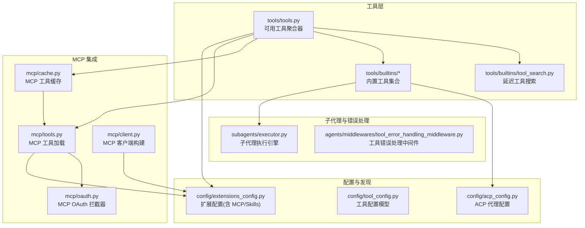
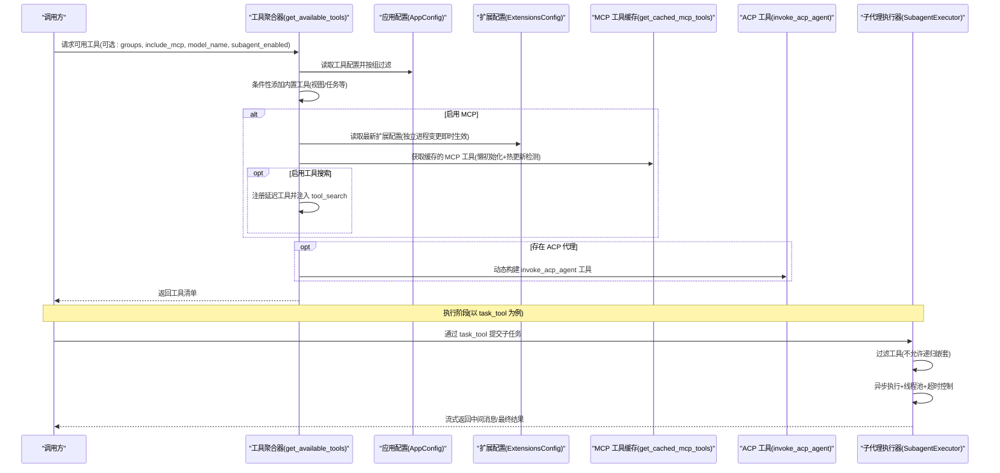
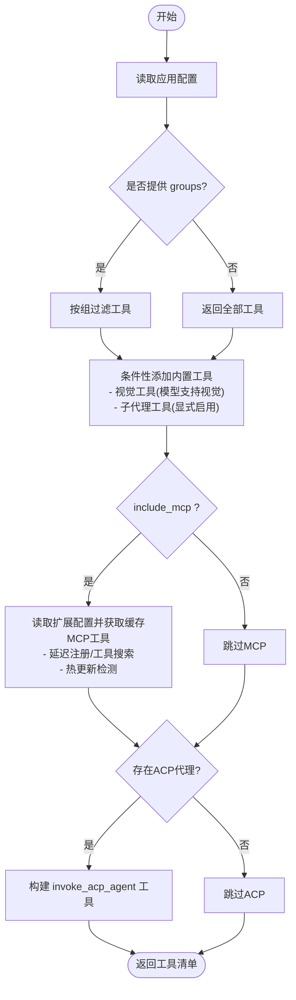
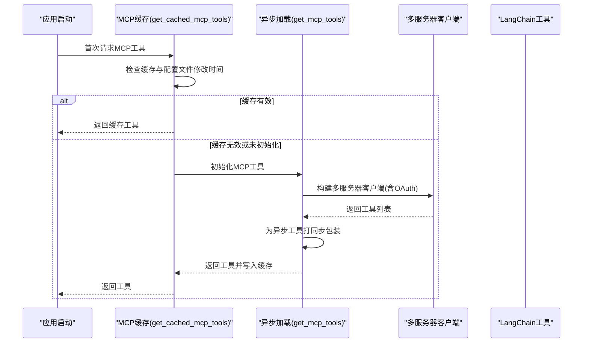
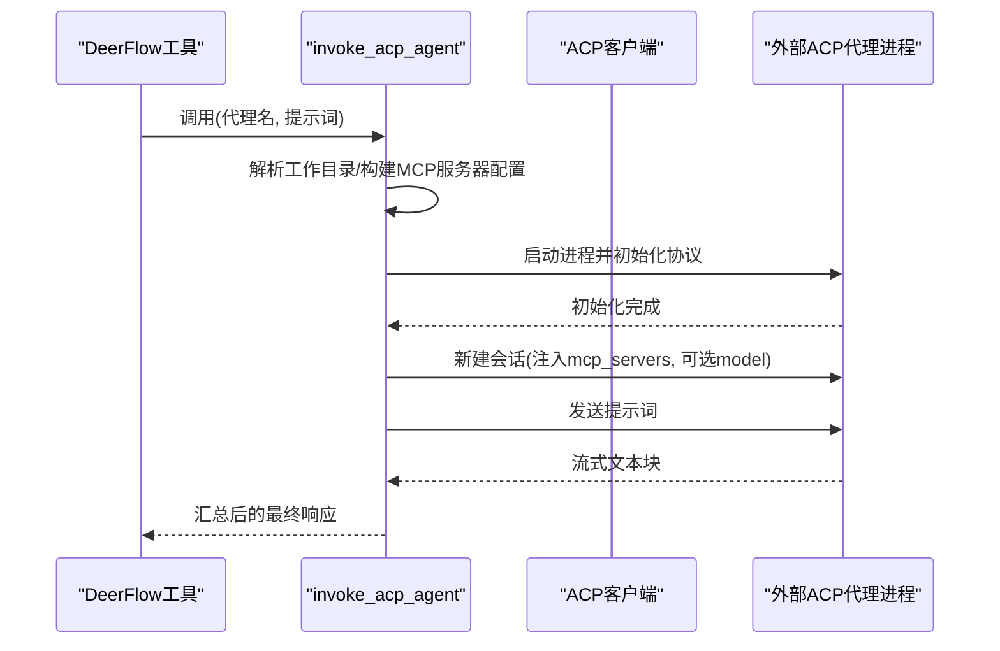
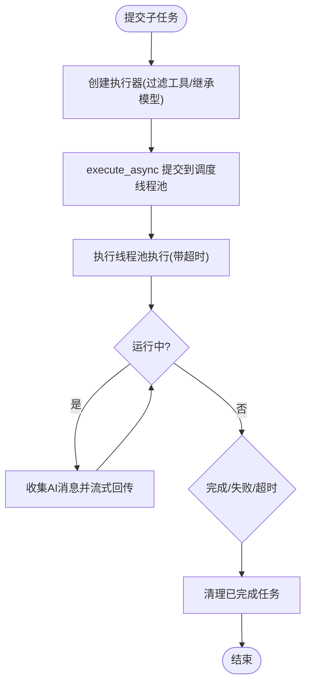
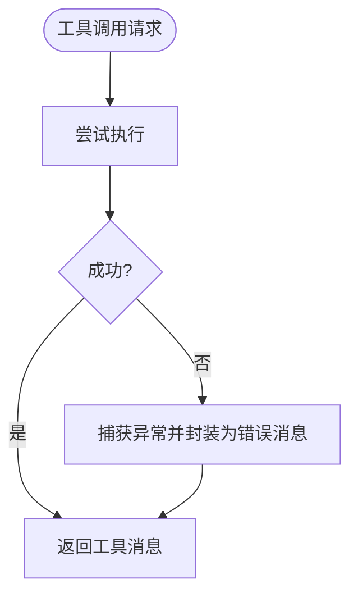
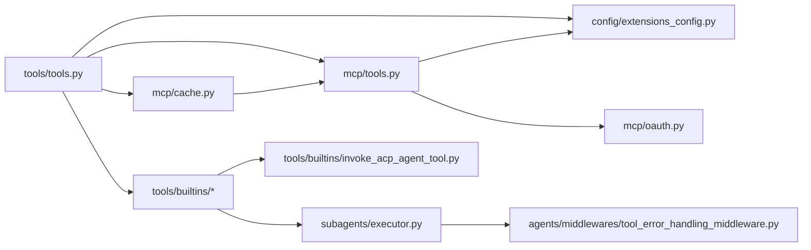

# 工具执行和调度

<cite>
**本文引用的文件**
- [tools/tools.py](file://backend/packages/harness/deerflow/tools/tools.py)
- [tools/__init__.py](file://backend/packages/harness/deerflow/tools/__init__.py)
- [tools/builtins/__init__.py](file://backend/packages/harness/deerflow/tools/builtins/__init__.py)
- [tools/builtins/task_tool.py](file://backend/packages/harness/deerflow/tools/builtins/task_tool.py)
- [tools/builtins/invoke_acp_agent_tool.py](file://backend/packages/harness/deerflow/tools/builtins/invoke_acp_agent_tool.py)
- [tools/builtins/tool_search.py](file://backend/packages/harness/deerflow/tools/builtins/tool_search.py)
- [mcp/tools.py](file://backend/packages/harness/deerflow/mcp/tools.py)
- [mcp/cache.py](file://backend/packages/harness/deerflow/mcp/cache.py)
- [mcp/client.py](file://backend/packages/harness/deerflow/mcp/client.py)
- [mcp/oauth.py](file://backend/packages/harness/deerflow/mcp/oauth.py)
- [config/extensions_config.py](file://backend/packages/harness/deerflow/config/extensions_config.py)
- [config/tool_config.py](file://backend/packages/harness/deerflow/config/tool_config.py)
- [config/acp_config.py](file://backend/packages/harness/deerflow/config/acp_config.py)
- [subagents/executor.py](file://backend/packages/harness/deerflow/subagents/executor.py)
- [agents/middlewares/tool_error_handling_middleware.py](file://backend/packages/harness/deerflow/agents/middlewares/tool_error_handling_middleware.py)
</cite>

## 目录
1. [简介](#简介)
2. [项目结构](#项目结构)
3. [核心组件](#核心组件)
4. [架构总览](#架构总览)
5. [详细组件分析](#详细组件分析)
6. [依赖分析](#依赖分析)
7. [性能考虑](#性能考虑)
8. [故障排查指南](#故障排查指南)
9. [结论](#结论)
10. [附录](#附录)

## 简介
本文件面向 DeerFlow 工具执行与调度系统，系统性阐述工具获取与筛选机制、工具配置加载过程、工具初始化流程；详解工具组过滤、条件性工具添加（如视觉工具）、MCP 工具集成与 ACP 工具调用；并覆盖工具执行的错误处理、超时控制与资源管理。文末提供工具配置示例、性能监控与调试技巧，帮助开发者在不同运行环境中稳定地使用与扩展工具链。

## 项目结构
本节聚焦与“工具执行与调度”直接相关的核心模块与文件组织方式，便于快速定位与理解。

**图示来源**
- [tools/tools.py:23-115](file://backend/packages/harness/deerflow/tools/tools.py#L23-L115)
- [mcp/tools.py:56-114](file://backend/packages/harness/deerflow/mcp/tools.py#L56-L114)
- [mcp/cache.py:56-139](file://backend/packages/harness/deerflow/mcp/cache.py#L56-L139)
- [config/extensions_config.py:119-259](file://backend/packages/harness/deerflow/config/extensions_config.py#L119-L259)
- [subagents/executor.py:123-517](file://backend/packages/harness/deerflow/subagents/executor.py#L123-L517)

**章节来源**
- [tools/tools.py:23-115](file://backend/packages/harness/deerflow/tools/tools.py#L23-L115)
- [mcp/tools.py:56-114](file://backend/packages/harness/deerflow/mcp/tools.py#L56-L114)
- [mcp/cache.py:56-139](file://backend/packages/harness/deerflow/mcp/cache.py#L56-L139)
- [config/extensions_config.py:119-259](file://backend/packages/harness/deerflow/config/extensions_config.py#L119-L259)
- [subagents/executor.py:123-517](file://backend/packages/harness/deerflow/subagents/executor.py#L123-L517)

## 核心组件
- 可用工具聚合器：负责从应用配置中加载工具、按组过滤、条件性添加内置工具（如视图工具）、MCP 工具缓存与延迟注册、以及 ACP 调用工具的动态装配。
- MCP 工具体系：包含异步加载、同步包装、OAuth 注入、全局缓存与懒初始化、配置热更新检测等能力。
- 子代理执行引擎：支持并发调度、线程池隔离、超时控制、状态轮询、消息流式回传与结果清理。
- 错误处理中间件：统一捕获工具异常，转换为可继续执行的工具消息，保障流程稳定性。
- 延迟工具搜索：在不暴露完整参数签名的前提下，先呈现可用工具列表，再按需拉取完整函数定义。

**章节来源**
- [tools/tools.py:23-115](file://backend/packages/harness/deerflow/tools/tools.py#L23-L115)
- [mcp/tools.py:56-114](file://backend/packages/harness/deerflow/mcp/tools.py#L56-L114)
- [mcp/cache.py:56-139](file://backend/packages/harness/deerflow/mcp/cache.py#L56-L139)
- [subagents/executor.py:123-517](file://backend/packages/harness/deerflow/subagents/executor.py#L123-L517)
- [agents/middlewares/tool_error_handling_middleware.py:19-138](file://backend/packages/harness/deerflow/agents/middlewares/tool_error_handling_middleware.py#L19-L138)
- [tools/builtins/tool_search.py:142-177](file://backend/packages/harness/deerflow/tools/builtins/tool_search.py#L142-L177)

## 架构总览
下图展示“工具获取—筛选—初始化—执行—错误处理—资源回收”的闭环流程，涵盖 MCP 与 ACP 的外部集成点。

**图示来源**
- [tools/tools.py:23-115](file://backend/packages/harness/deerflow/tools/tools.py#L23-L115)
- [mcp/cache.py:82-139](file://backend/packages/harness/deerflow/mcp/cache.py#L82-L139)
- [mcp/tools.py:56-114](file://backend/packages/harness/deerflow/mcp/tools.py#L56-L114)
- [tools/builtins/task_tool.py:21-196](file://backend/packages/harness/deerflow/tools/builtins/task_tool.py#L21-L196)
- [subagents/executor.py:391-517](file://backend/packages/harness/deerflow/subagents/executor.py#L391-L517)

## 详细组件分析

### 组件一：工具获取与筛选机制
- 配置来源与分组过滤：从应用配置中读取工具条目，按 groups 参数进行过滤；未提供则返回全部。
- 条件性内置工具：
  - 视觉工具仅在指定模型支持视觉时加入。
  - 子代理工具仅在运行时显式启用时加入，避免递归嵌套。
- MCP 工具：
  - 使用扩展配置的“从磁盘读取最新配置”策略，确保网关 API 在独立进程中修改后即时生效。
  - 支持延迟注册与工具搜索，仅在需要时拉取完整函数定义。
- ACP 工具：
  - 基于已配置的 ACP 代理动态生成工具描述与调用逻辑，隔离工作目录，自动注入 MCP 服务器配置。

**图示来源**
- [tools/tools.py:23-115](file://backend/packages/harness/deerflow/tools/tools.py#L23-L115)
- [config/extensions_config.py:119-259](file://backend/packages/harness/deerflow/config/extensions_config.py#L119-L259)
- [tools/builtins/tool_search.py:142-177](file://backend/packages/harness/deerflow/tools/builtins/tool_search.py#L142-L177)
- [tools/builtins/invoke_acp_agent_tool.py:101-209](file://backend/packages/harness/deerflow/tools/builtins/invoke_acp_agent_tool.py#L101-L209)

**章节来源**
- [tools/tools.py:23-115](file://backend/packages/harness/deerflow/tools/tools.py#L23-L115)
- [config/extensions_config.py:119-259](file://backend/packages/harness/deerflow/config/extensions_config.py#L119-L259)
- [tools/builtins/tool_search.py:142-177](file://backend/packages/harness/deerflow/tools/builtins/tool_search.py#L142-L177)
- [tools/builtins/invoke_acp_agent_tool.py:101-209](file://backend/packages/harness/deerflow/tools/builtins/invoke_acp_agent_tool.py#L101-L209)

### 组件二：MCP 工具集成与缓存
- 异步加载与同步包装：为适配同步流式客户端，对异步工具进行同步包装，避免嵌套事件循环问题。
- OAuth 注入：在 SSE/HTTP 传输中注入初始授权头，并支持工具级拦截器。
- 缓存与懒初始化：首次访问时初始化，记录配置文件修改时间，检测到变更后自动失效并重新初始化。
- 多服务器客户端：根据扩展配置构建多服务器客户端，统一获取工具并打补丁以支持同步调用。

**图示来源**
- [mcp/cache.py:56-139](file://backend/packages/harness/deerflow/mcp/cache.py#L56-L139)
- [mcp/tools.py:56-114](file://backend/packages/harness/deerflow/mcp/tools.py#L56-L114)
- [mcp/oauth.py](file://backend/packages/harness/deerflow/mcp/oauth.py)
- [mcp/client.py](file://backend/packages/harness/deerflow/mcp/client.py)

**章节来源**
- [mcp/cache.py:56-139](file://backend/packages/harness/deerflow/mcp/cache.py#L56-L139)
- [mcp/tools.py:56-114](file://backend/packages/harness/deerflow/mcp/tools.py#L56-L114)

### 组件三：ACP 工具调用
- 工作目录隔离：每个会话线程拥有独立工作目录，避免并发冲突。
- MCP 服务器注入：将当前启用的 MCP 服务器配置注入到 ACP 会话，使外部代理具备工具能力。
- 权限自动批准：可按配置自动批准“一次性允许/始终允许”，否则拒绝权限请求。
- 错误格式化：针对命令不存在等常见错误给出可操作的修复建议。

**图示来源**
- [tools/builtins/invoke_acp_agent_tool.py:127-209](file://backend/packages/harness/deerflow/tools/builtins/invoke_acp_agent_tool.py#L127-L209)
- [config/acp_config.py:31-51](file://backend/packages/harness/deerflow/config/acp_config.py#L31-L51)

**章节来源**
- [tools/builtins/invoke_acp_agent_tool.py:127-209](file://backend/packages/harness/deerflow/tools/builtins/invoke_acp_agent_tool.py#L127-L209)
- [config/acp_config.py:31-51](file://backend/packages/harness/deerflow/config/acp_config.py#L31-L51)

### 组件四：子代理执行与超时控制
- 工具过滤：支持允许/禁止白名单，避免子代理递归调用自身工具。
- 并发与线程池：调度线程池与执行线程池分离，避免阻塞；支持超时取消。
- 轮询与流式：后台任务轮询状态，实时推送新 AI 消息；超时与失败均以明确状态返回。
- 结果清理：完成后清理内存中的历史任务，防止泄漏。

**图示来源**
- [subagents/executor.py:391-517](file://backend/packages/harness/deerflow/subagents/executor.py#L391-L517)
- [tools/builtins/task_tool.py:120-196](file://backend/packages/harness/deerflow/tools/builtins/task_tool.py#L120-L196)

**章节来源**
- [subagents/executor.py:391-517](file://backend/packages/harness/deerflow/subagents/executor.py#L391-L517)
- [tools/builtins/task_tool.py:120-196](file://backend/packages/harness/deerflow/tools/builtins/task_tool.py#L120-L196)

### 组件五：错误处理与中间件
- 工具异常转消息：捕获工具执行异常，构造包含工具名、调用 ID 与简要错误信息的工具消息，保证流程继续。
- 控制流保留：对中断/暂停/恢复等信号保持透传，避免误处理。
- 中间件组合：统一注入线程数据、沙箱、上传、悬挂工具调用修复、守卫护栏与工具错误处理等中间件。

**图示来源**
- [agents/middlewares/tool_error_handling_middleware.py:19-138](file://backend/packages/harness/deerflow/agents/middlewares/tool_error_handling_middleware.py#L19-L138)

**章节来源**
- [agents/middlewares/tool_error_handling_middleware.py:19-138](file://backend/packages/harness/deerflow/agents/middlewares/tool_error_handling_middleware.py#L19-L138)

## 依赖分析
- 工具聚合器依赖应用配置与扩展配置，间接依赖模型配置以决定是否启用视觉工具。
- MCP 工具加载依赖扩展配置与 OAuth 模块，通过多服务器客户端统一获取工具并打补丁。
- 子代理执行器依赖模型工厂、中间件组合与线程池，确保并发与超时控制。
- 延迟工具搜索依赖上下文变量隔离不同请求的注册表，避免竞态。

**图示来源**
- [tools/tools.py:23-115](file://backend/packages/harness/deerflow/tools/tools.py#L23-L115)
- [mcp/tools.py:56-114](file://backend/packages/harness/deerflow/mcp/tools.py#L56-L114)
- [mcp/cache.py:56-139](file://backend/packages/harness/deerflow/mcp/cache.py#L56-L139)
- [subagents/executor.py:123-517](file://backend/packages/harness/deerflow/subagents/executor.py#L123-L517)
- [agents/middlewares/tool_error_handling_middleware.py:19-138](file://backend/packages/harness/deerflow/agents/middlewares/tool_error_handling_middleware.py#L19-L138)

**章节来源**
- [tools/tools.py:23-115](file://backend/packages/harness/deerflow/tools/tools.py#L23-L115)
- [mcp/tools.py:56-114](file://backend/packages/harness/deerflow/mcp/tools.py#L56-L114)
- [mcp/cache.py:56-139](file://backend/packages/harness/deerflow/mcp/cache.py#L56-L139)
- [subagents/executor.py:123-517](file://backend/packages/harness/deerflow/subagents/executor.py#L123-L517)
- [agents/middlewares/tool_error_handling_middleware.py:19-138](file://backend/packages/harness/deerflow/agents/middlewares/tool_error_handling_middleware.py#L19-L138)

## 性能考虑
- MCP 工具懒初始化与缓存：避免重复加载，降低冷启动开销；配置变更触发缓存失效，确保一致性。
- 线程池分离：调度线程池与执行线程池解耦，减少阻塞；合理设置最大并发数，避免资源争用。
- 事件循环兼容：同步包装避免嵌套事件循环，提升在同步流式客户端中的稳定性。
- 轮询与超时：子代理轮询间隔与超时阈值平衡实时性与资源占用；超时后及时取消任务并清理。
- 日志与可观测性：在关键路径输出日志（如工具数量、MCP 加载、任务状态变化），便于性能分析与问题定位。

## 故障排查指南
- MCP 工具不可用：
  - 确认扩展配置文件存在且可解析；检查独立进程修改是否被正确读取。
  - 若安装缺失，查看警告日志并安装所需适配包。
- ACP 工具调用失败：
  - 检查代理命令是否存在与可执行；若为 codex，确认安装了 ACP 适配器。
  - 查看权限请求是否被拒绝，必要时开启自动批准。
- 子代理任务卡住：
  - 关注轮询超时与线程池超时；检查任务状态与清理逻辑。
  - 留意工具过滤导致的死锁（避免递归调用自身工具）。
- 工具异常中断：
  - 中间件会将异常转换为错误消息，确保流程继续；关注日志中的工具名与调用 ID，定位具体问题。

**章节来源**
- [mcp/tools.py:64-66](file://backend/packages/harness/deerflow/mcp/tools.py#L64-L66)
- [tools/builtins/invoke_acp_agent_tool.py:89-99](file://backend/packages/harness/deerflow/tools/builtins/invoke_acp_agent_tool.py#L89-L99)
- [subagents/executor.py:437-451](file://backend/packages/harness/deerflow/subagents/executor.py#L437-L451)
- [agents/middlewares/tool_error_handling_middleware.py:48-50](file://backend/packages/harness/deerflow/agents/middlewares/tool_error_handling_middleware.py#L48-L50)

## 结论
DeerFlow 的工具执行与调度系统通过“配置驱动 + 条件性装配 + 外部集成 + 中间件兜底”的设计，在保证灵活性的同时兼顾稳定性与性能。MCP 与 ACP 的深度集成使得外部能力无缝接入；子代理执行引擎提供了可控的并发与超时策略；完善的错误处理与缓存机制提升了生产环境的可靠性。建议在实际部署中结合本文的配置示例与调试技巧，持续优化工具链与运行时表现。

## 附录

### 工具配置示例（要点）
- 工具组与工具条目：通过配置模型定义工具名称、所属组与提供者变量路径，支持额外字段扩展。
- 扩展配置（MCP/Skills）：支持从多个位置解析配置文件，兼容旧版文件名；可注入环境变量占位符。
- ACP 代理：定义命令、参数、描述与权限策略，动态生成调用工具。

**章节来源**
- [config/tool_config.py:4-21](file://backend/packages/harness/deerflow/config/tool_config.py#L4-L21)
- [config/extensions_config.py:69-176](file://backend/packages/harness/deerflow/config/extensions_config.py#L69-L176)
- [config/acp_config.py:11-51](file://backend/packages/harness/deerflow/config/acp_config.py#L11-L51)

### 性能监控与调试技巧
- 监控指标建议：工具总数、MCP 工具数量、子代理并发数、轮询频率与超时比例、错误率与重试次数。
- 调试步骤：启用详细日志，观察工具加载、MCP 初始化、ACP 会话建立、子代理状态变化；利用中间件日志定位异常来源。

[本节为通用指导，无需列出具体文件来源]