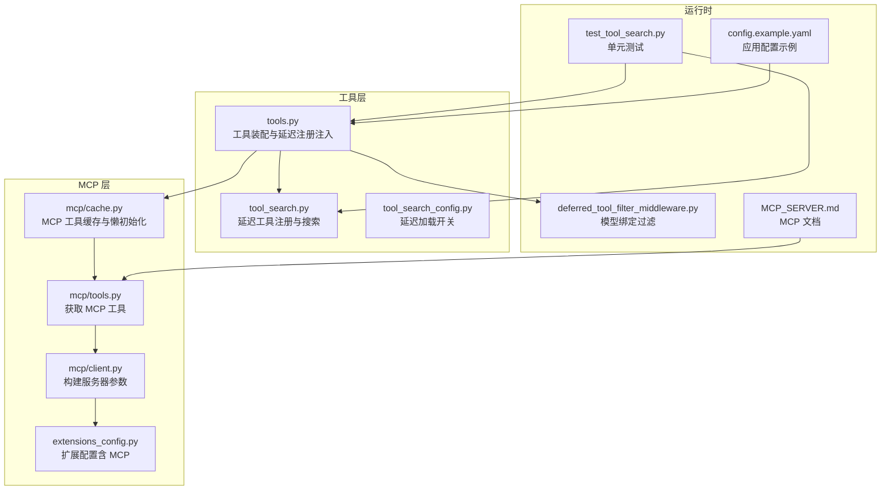
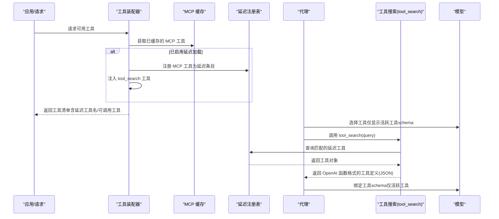
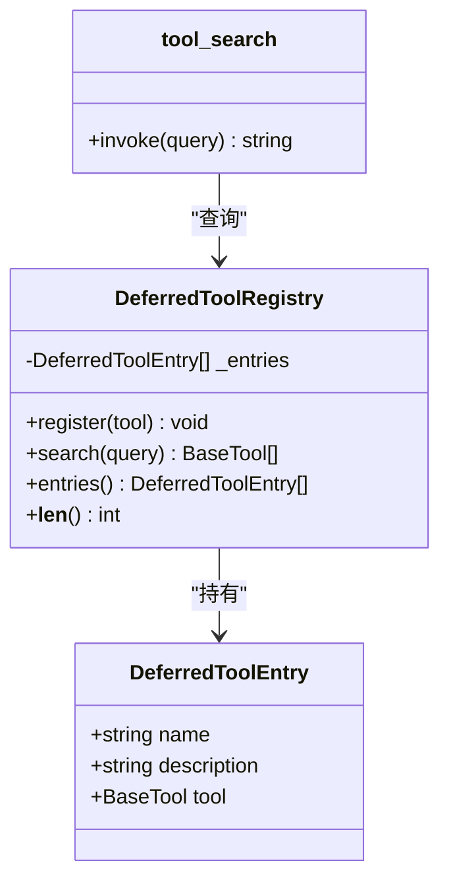
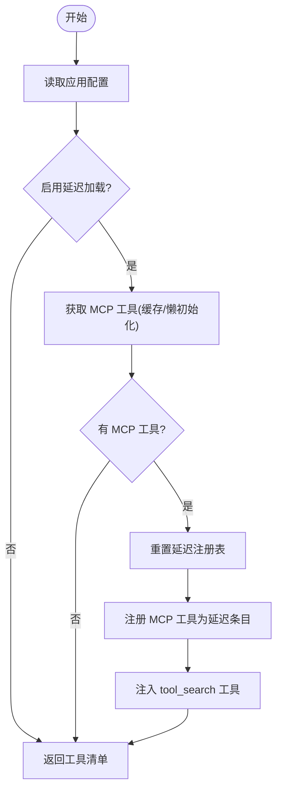
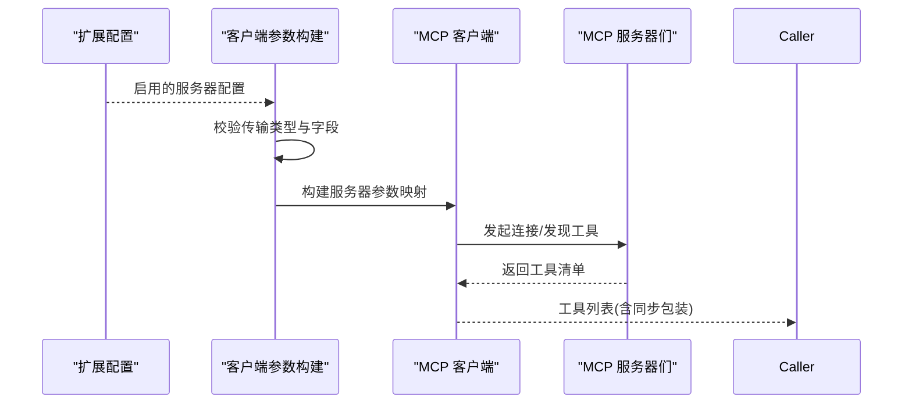
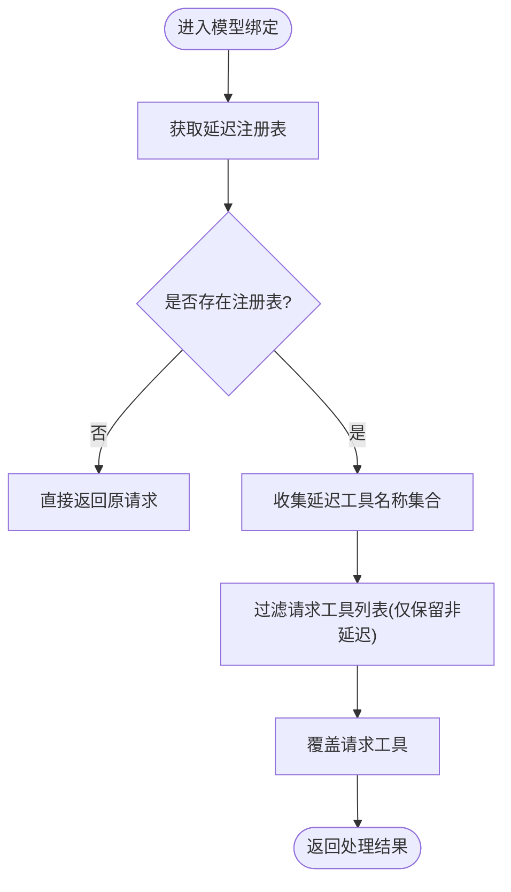
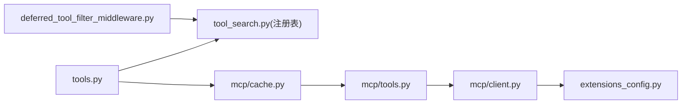

# 工具搜索机制

<cite>
**本文引用的文件**
- [tool_search.py](file://backend/packages/harness/deerflow/tools/builtins/tool_search.py)
- [tool_search_config.py](file://backend/packages/harness/deerflow/config/tool_search_config.py)
- [tools.py](file://backend/packages/harness/deerflow/tools/tools.py)
- [cache.py](file://backend/packages/harness/deerflow/mcp/cache.py)
- [mcp_tools.py](file://backend/packages/harness/deerflow/mcp/tools.py)
- [client.py](file://backend/packages/harness/deerflow/mcp/client.py)
- [extensions_config.py](file://backend/packages/harness/deerflow/config/extensions_config.py)
- [deferred_tool_filter_middleware.py](file://backend/packages/harness/deerflow/agents/middlewares/deferred_tool_filter_middleware.py)
- [test_tool_search.py](file://backend/tests/test_tool_search.py)
- [MCP_SERVER.md](file://backend/docs/MCP_SERVER.md)
- [config.example.yaml](file://config.example.yaml)
</cite>

## 目录
1. [简介](#简介)
2. [项目结构](#项目结构)
3. [核心组件](#核心组件)
4. [架构总览](#架构总览)
5. [详细组件分析](#详细组件分析)
6. [依赖关系分析](#依赖关系分析)
7. [性能考量](#性能考量)
8. [故障排除指南](#故障排除指南)
9. [结论](#结论)
10. [附录](#附录)

## 简介
本文件面向 DeerFlow 的“工具搜索”机制，系统性阐述其架构设计、搜索算法与索引机制、延迟注册系统、结果排序与过滤逻辑、配置项、性能优化与缓存策略，并提供使用示例、调试方法与故障排除指南，最后说明与 MCP 服务器的集成方式。

## 项目结构
与工具搜索直接相关的后端模块主要分布在以下路径：
- 工具内置实现：backend/packages/harness/deerflow/tools/builtins/tool_search.py
- 延迟加载配置：backend/packages/harness/deerflow/config/tool_search_config.py
- 工具装配入口：backend/packages/harness/deerflow/tools/tools.py
- MCP 缓存与懒初始化：backend/packages/harness/deerflow/mcp/cache.py
- MCP 工具加载：backend/packages/harness/deerflow/mcp/tools.py
- MCP 客户端参数构建：backend/packages/harness/deerflow/mcp/client.py
- 扩展配置（含 MCP 服务器）：backend/packages/harness/deerflow/config/extensions_config.py
- 模型绑定过滤中间件：backend/packages/harness/deerflow/agents/middlewares/deferred_tool_filter_middleware.py
- 测试用例：backend/tests/test_tool_search.py
- MCP 配置文档：backend/docs/MCP_SERVER.md
- 应用配置示例（包含 tool_search 开关）：config.example.yaml

**图表来源**
- [tool_search.py:1-177](file://backend/packages/harness/deerflow/tools/builtins/tool_search.py#L1-L177)
- [tool_search_config.py:1-36](file://backend/packages/harness/deerflow/config/tool_search_config.py#L1-L36)
- [tools.py:1-115](file://backend/packages/harness/deerflow/tools/tools.py#L1-L115)
- [cache.py:1-139](file://backend/packages/harness/deerflow/mcp/cache.py#L1-L139)
- [mcp_tools.py:1-114](file://backend/packages/harness/deerflow/mcp/tools.py#L1-L114)
- [client.py:1-69](file://backend/packages/harness/deerflow/mcp/client.py#L1-L69)
- [extensions_config.py:1-259](file://backend/packages/harness/deerflow/config/extensions_config.py#L1-L259)
- [deferred_tool_filter_middleware.py:1-61](file://backend/packages/harness/deerflow/agents/middlewares/deferred_tool_filter_middleware.py#L1-L61)
- [test_tool_search.py:1-395](file://backend/tests/test_tool_search.py#L1-L395)
- [MCP_SERVER.md:1-65](file://backend/docs/MCP_SERVER.md#L1-L65)
- [config.example.yaml:304-314](file://config.example.yaml#L304-L314)

**章节来源**
- [tool_search.py:1-177](file://backend/packages/harness/deerflow/tools/builtins/tool_search.py#L1-L177)
- [tools.py:1-115](file://backend/packages/harness/deerflow/tools/tools.py#L1-L115)
- [cache.py:1-139](file://backend/packages/harness/deerflow/mcp/cache.py#L1-L139)
- [mcp_tools.py:1-114](file://backend/packages/harness/deerflow/mcp/tools.py#L1-L114)
- [client.py:1-69](file://backend/packages/harness/deerflow/mcp/client.py#L1-L69)
- [extensions_config.py:1-259](file://backend/packages/harness/deerflow/config/extensions_config.py#L1-L259)
- [deferred_tool_filter_middleware.py:1-61](file://backend/packages/harness/deerflow/agents/middlewares/deferred_tool_filter_middleware.py#L1-L61)
- [test_tool_search.py:1-395](file://backend/tests/test_tool_search.py#L1-L395)
- [MCP_SERVER.md:1-65](file://backend/docs/MCP_SERVER.md#L1-L65)
- [config.example.yaml:304-314](file://config.example.yaml#L304-L314)

## 核心组件
- 延迟工具注册表（DeferredToolRegistry）
  - 存储延迟工具条目（名称、描述、完整工具对象），支持按正则表达式查询。
  - 查询模式：
    - select: 精确名称匹配
    - +keyword 剩余词：要求名称包含关键词，剩余词用于排序
    - 普通关键字：对 name+description 进行大小写不敏感正则匹配
  - 结果上限：最多返回固定数量（常量限制）。
- 工具搜索工具（tool_search）
  - 将查询交给注册表进行匹配，返回 OpenAI 函数格式的工具定义 JSON。
  - 仅在存在注册表上下文时生效；否则返回提示无可用延迟工具。
- 延迟加载配置（ToolSearchConfig）
  - 控制是否启用延迟加载与 tool_search 工具注入。
- 工具装配入口（get_available_tools）
  - 在启用延迟加载时，将 MCP 工具注册到延迟注册表，并注入 tool_search 工具。
  - 每次装配前重置延迟注册表，避免状态污染。
- MCP 工具缓存与懒初始化（get_cached_mcp_tools / initialize_mcp_tools）
  - 首次加载后缓存 MCP 工具列表，基于配置文件修改时间判断缓存是否陈旧。
  - 支持在无事件循环或已有事件循环环境中懒初始化。
- 模型绑定过滤中间件（DeferredToolFilterMiddleware）
  - 在模型绑定阶段移除延迟工具的 schema，仅保留活跃工具，避免占用上下文。
- 扩展配置（ExtensionsConfig）
  - 统一管理 MCP 服务器与技能配置，支持从文件加载、环境变量解析、启用状态筛选等。

**章节来源**
- [tool_search.py:30-177](file://backend/packages/harness/deerflow/tools/builtins/tool_search.py#L30-L177)
- [tool_search_config.py:6-36](file://backend/packages/harness/deerflow/config/tool_search_config.py#L6-L36)
- [tools.py:23-115](file://backend/packages/harness/deerflow/tools/tools.py#L23-L115)
- [cache.py:56-139](file://backend/packages/harness/deerflow/mcp/cache.py#L56-L139)
- [deferred_tool_filter_middleware.py:23-61](file://backend/packages/harness/deerflow/agents/middlewares/deferred_tool_filter_middleware.py#L23-L61)
- [extensions_config.py:55-259](file://backend/packages/harness/deerflow/config/extensions_config.py#L55-L259)

## 架构总览
工具搜索的整体流程如下：
- 应用启动或请求开始时，装配工具链路会读取配置，决定是否启用延迟加载。
- 若启用，先从缓存或懒初始化中获取 MCP 工具，然后将这些工具注册到延迟注册表，并注入 tool_search 工具。
- Agent 在系统提示词中看到“可延迟工具”的名称列表；当需要调用具体工具时，通过 tool_search 获取其完整 schema。
- 模型绑定阶段，过滤中间件确保仅向 LLM 提供活跃工具 schema，延迟工具 schema 不参与绑定，从而节省上下文。

**图表来源**
- [tools.py:70-95](file://backend/packages/harness/deerflow/tools/tools.py#L70-L95)
- [tool_search.py:142-177](file://backend/packages/harness/deerflow/tools/builtins/tool_search.py#L142-L177)
- [cache.py:82-127](file://backend/packages/harness/deerflow/mcp/cache.py#L82-L127)
- [deferred_tool_filter_middleware.py:31-44](file://backend/packages/harness/deerflow/agents/middlewares/deferred_tool_filter_middleware.py#L31-L44)

## 详细组件分析

### 延迟工具注册表与搜索算法
- 数据结构
  - 条目：包含名称、描述与完整工具对象。
  - 注册表：维护条目列表，提供注册与查询接口。
- 查询策略
  - 精确选择：以逗号分隔的名称集合，严格匹配。
  - 关键词前置：以加号开头，要求名称包含关键词；剩余词用于评分排序。
  - 普通关键字：对 name+description 进行大小写不敏感正则匹配；若正则非法，则转为字面量转义匹配。
  - 排序规则：名称命中计更高权重，随后按匹配次数降序；结果截断至最大返回数。
- 并发隔离
  - 使用 contextvar 上下文变量保存当前请求的注册表实例，避免并发请求互相干扰。

**图表来源**
- [tool_search.py:30-110](file://backend/packages/harness/deerflow/tools/builtins/tool_search.py#L30-L110)
- [tool_search.py:142-177](file://backend/packages/harness/deerflow/tools/builtins/tool_search.py#L142-L177)

**章节来源**
- [tool_search.py:30-110](file://backend/packages/harness/deerflow/tools/builtins/tool_search.py#L30-L110)
- [tool_search.py:112-137](file://backend/packages/harness/deerflow/tools/builtins/tool_search.py#L112-L137)

### 工具装配与延迟注册注入
- 装配流程
  - 读取应用配置，确定是否启用延迟加载。
  - 从扩展配置中读取已启用的 MCP 服务器，获取 MCP 工具列表。
  - 将 MCP 工具注册到延迟注册表，并注入 tool_search 工具。
  - 重置延迟注册表，防止状态泄漏。
- 与缓存协作
  - 优先使用缓存的 MCP 工具；若缓存陈旧则重新初始化。
  - 通过配置文件修改时间检测变更，保证网关 API 动态更新能被即时反映。

**图表来源**
- [tools.py:23-115](file://backend/packages/harness/deerflow/tools/tools.py#L23-L115)
- [cache.py:82-127](file://backend/packages/harness/deerflow/mcp/cache.py#L82-L127)

**章节来源**
- [tools.py:23-115](file://backend/packages/harness/deerflow/tools/tools.py#L23-L115)
- [cache.py:82-127](file://backend/packages/harness/deerflow/mcp/cache.py#L82-L127)

### MCP 工具加载与客户端参数构建
- 加载流程
  - 从扩展配置中筛选启用的 MCP 服务器，构建服务器参数映射。
  - 对 HTTP/SSE 服务器注入初始 OAuth 头部；对 SSE/HTTP 服务器注入 Authorization。
  - 创建多服务器 MCP 客户端并获取所有工具；为异步工具包装同步调用适配器。
- 参数构建
  - stdio：需提供命令与参数，可选环境变量。
  - http/sse：需提供 URL，可选自定义头部。
  - 其他传输类型将触发错误。

**图表来源**
- [client.py:11-69](file://backend/packages/harness/deerflow/mcp/client.py#L11-L69)
- [mcp_tools.py:56-114](file://backend/packages/harness/deerflow/mcp/tools.py#L56-L114)

**章节来源**
- [client.py:11-69](file://backend/packages/harness/deerflow/mcp/client.py#L11-L69)
- [mcp_tools.py:56-114](file://backend/packages/harness/deerflow/mcp/tools.py#L56-L114)

### 模型绑定过滤中间件
- 目标
  - 在模型绑定阶段移除延迟工具 schema，仅保留活跃工具 schema，减少上下文开销。
- 行为
  - 从上下文中获取延迟注册表，提取延迟工具名称集合。
  - 过滤请求中的工具列表，仅保留不在延迟集合内的工具。
  - 记录过滤日志，便于诊断。

**图表来源**
- [deferred_tool_filter_middleware.py:31-44](file://backend/packages/harness/deerflow/agents/middlewares/deferred_tool_filter_middleware.py#L31-L44)

**章节来源**
- [deferred_tool_filter_middleware.py:23-61](file://backend/packages/harness/deerflow/agents/middlewares/deferred_tool_filter_middleware.py#L23-L61)

### 配置与使用示例
- 延迟加载开关
  - 在应用配置中设置 tool_search.enabled 控制是否启用延迟加载。
- MCP 服务器配置
  - 在扩展配置文件中启用所需服务器，配置传输类型、命令/URL、头部、OAuth 等。
- 使用步骤
  - 启用延迟加载开关。
  - 配置并启用 MCP 服务器。
  - 启动应用或发起请求，Agent 将看到延迟工具名称列表；调用 tool_search 获取具体 schema 后方可执行。

**章节来源**
- [config.example.yaml:304-314](file://config.example.yaml#L304-L314)
- [MCP_SERVER.md:1-65](file://backend/docs/MCP_SERVER.md#L1-L65)

## 依赖关系分析
- 组件耦合
  - 工具装配器依赖延迟注册表与 MCP 缓存；延迟注册表与上下文变量耦合，确保并发安全。
  - MCP 工具加载依赖扩展配置与客户端参数构建；客户端参数构建依赖扩展配置。
  - 模型绑定过滤中间件依赖延迟注册表上下文。
- 外部依赖
  - MCP 工具加载依赖第三方适配包（未安装时记录警告）。
  - 工具搜索输出遵循 OpenAI 函数格式，便于跨模型兼容。

**图表来源**
- [tools.py:70-95](file://backend/packages/harness/deerflow/tools/tools.py#L70-L95)
- [tool_search.py:121-137](file://backend/packages/harness/deerflow/tools/builtins/tool_search.py#L121-L137)
- [cache.py:71-101](file://backend/packages/harness/deerflow/mcp/cache.py#L71-L101)
- [mcp_tools.py:62-101](file://backend/packages/harness/deerflow/mcp/tools.py#L62-L101)
- [client.py:54-68](file://backend/packages/harness/deerflow/mcp/client.py#L54-L68)
- [deferred_tool_filter_middleware.py:32-38](file://backend/packages/harness/deerflow/agents/middlewares/deferred_tool_filter_middleware.py#L32-L38)

**章节来源**
- [tools.py:70-95](file://backend/packages/harness/deerflow/tools/tools.py#L70-L95)
- [tool_search.py:121-137](file://backend/packages/harness/deerflow/tools/builtins/tool_search.py#L121-L137)
- [cache.py:71-101](file://backend/packages/harness/deerflow/mcp/cache.py#L71-L101)
- [mcp_tools.py:62-101](file://backend/packages/harness/deerflow/mcp/tools.py#L62-L101)
- [client.py:54-68](file://backend/packages/harness/deerflow/mcp/client.py#L54-L68)
- [deferred_tool_filter_middleware.py:32-38](file://backend/packages/harness/deerflow/agents/middlewares/deferred_tool_filter_middleware.py#L32-L38)

## 性能考量
- 上下文节省
  - 通过延迟注册与模型绑定过滤，仅向 LLM 提供活跃工具 schema，显著降低上下文占用。
- 缓存与懒初始化
  - MCP 工具首次加载后缓存，避免重复发现；基于配置文件修改时间检测变更，保证动态更新。
  - 在无事件循环或已有事件循环环境中均能正确初始化，提升兼容性。
- 查询效率
  - 正则编译失败自动回退为字面量匹配，避免异常导致的性能问题。
  - 名称命中优先级高于描述命中，减少无效匹配成本。
- 并发隔离
  - 使用 contextvar 隔离各请求的注册表实例，避免锁竞争与状态污染。

[本节为通用性能建议，无需特定文件引用]

## 故障排除指南
- 无延迟工具可用
  - 症状：tool_search 返回“无可用延迟工具”。
  - 可能原因：未启用延迟加载或未成功注入 tool_search。
  - 排查要点：确认配置开关已开启；检查工具装配日志；确认 MCP 工具已缓存并注入。
- 无匹配结果
  - 症状：tool_search 返回“未找到匹配工具”。
  - 可能原因：查询关键字不匹配或注册表为空。
  - 排查要点：验证查询格式（select:/+keyword/普通关键字）；检查注册表内容。
- 模型绑定仍包含延迟工具
  - 症状：模型绑定阶段出现延迟工具 schema。
  - 可能原因：过滤中间件未生效或注册表上下文未正确设置。
  - 排查要点：确认中间件已启用；检查上下文变量是否正确传递。
- MCP 工具未加载
  - 症状：MCP 工具未出现在可用工具列表。
  - 可能原因：适配包未安装、服务器未启用、参数缺失或 OAuth 失败。
  - 排查要点：安装适配包；检查扩展配置；核对传输类型与必要字段；查看日志错误。

**章节来源**
- [test_tool_search.py:206-251](file://backend/tests/test_tool_search.py#L206-L251)
- [deferred_tool_filter_middleware.py:31-44](file://backend/packages/harness/deerflow/agents/middlewares/deferred_tool_filter_middleware.py#L31-L44)
- [mcp_tools.py:62-114](file://backend/packages/harness/deerflow/mcp/tools.py#L62-L114)

## 结论
 DeerFlow 的工具搜索机制通过“延迟注册 + 模型绑定过滤 + 缓存与懒初始化”实现了高效、低上下文开销的工具发现与调用流程。配合灵活的查询语法与严格的并发隔离，能够在复杂场景下稳定运行。结合 MCP 服务器的统一配置与 OAuth 支持，进一步增强了系统的可扩展性与安全性。

[本节为总结性内容，无需特定文件引用]

## 附录

### 使用示例
- 启用延迟加载
  - 在应用配置中设置 tool_search.enabled 为 true。
- 配置 MCP 服务器
  - 在扩展配置文件中启用所需服务器，配置传输类型、命令/URL、头部、OAuth 等。
- 触发工具搜索
  - 在代理对话中调用 tool_search，传入查询字符串（支持 select:、+keyword 或普通关键字）。
- 验证结果
  - tool_search 返回 OpenAI 函数格式的工具定义 JSON；随后可在模型绑定中使用该工具。

**章节来源**
- [config.example.yaml:304-314](file://config.example.yaml#L304-L314)
- [MCP_SERVER.md:1-65](file://backend/docs/MCP_SERVER.md#L1-L65)
- [tool_search.py:142-177](file://backend/packages/harness/deerflow/tools/builtins/tool_search.py#L142-L177)

### 调试方法
- 日志级别
  - 提升 deerflow 模块日志级别以观察工具装配、MCP 加载与过滤中间件行为。
- 单元测试
  - 运行测试套件，覆盖查询语法、上下文隔离与过滤逻辑。
- 配置校验
  - 使用扩展配置的文件解析与环境变量替换功能，确保配置正确加载。

**章节来源**
- [test_tool_search.py:1-395](file://backend/tests/test_tool_search.py#L1-L395)
- [extensions_config.py:120-175](file://backend/packages/harness/deerflow/config/extensions_config.py#L120-L175)