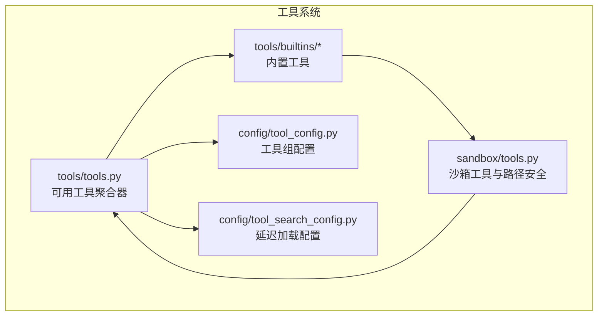
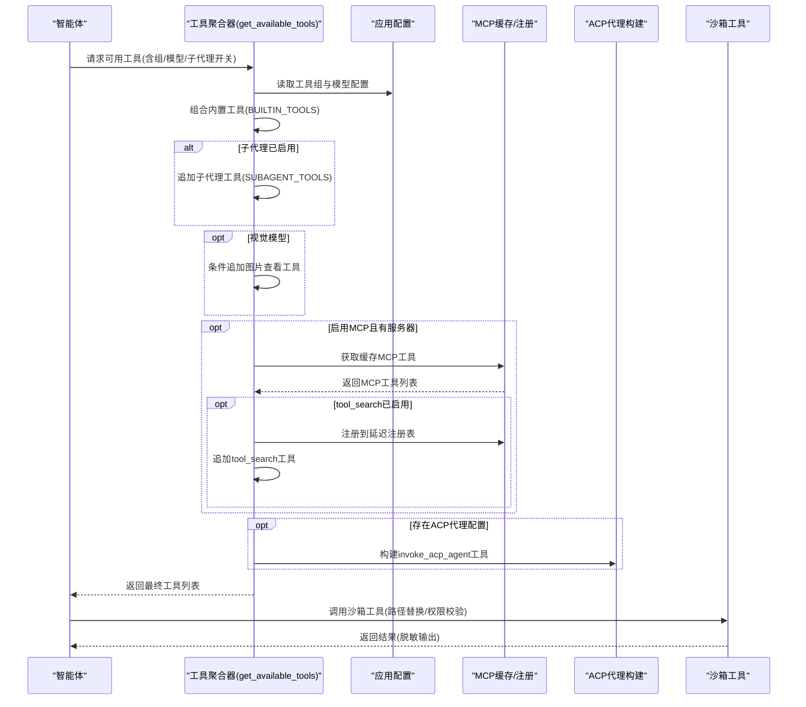
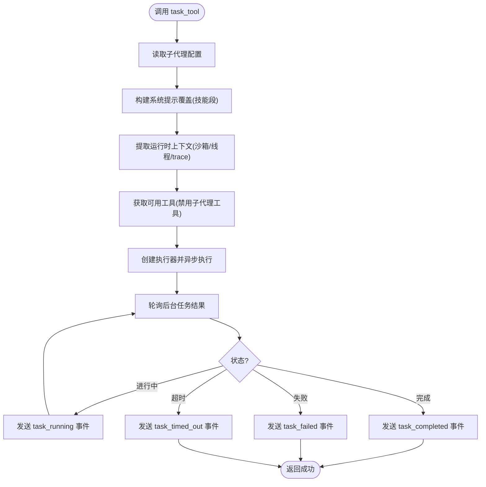
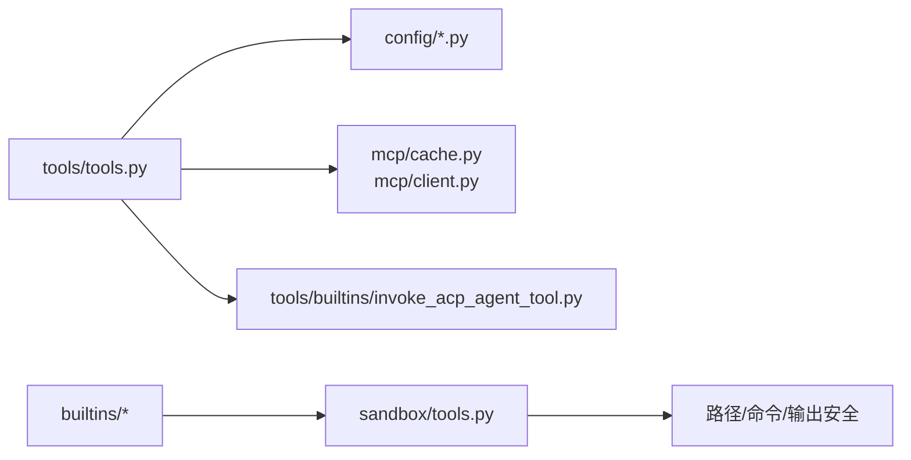

# 工具系统

<cite>
**本文引用的文件**
- [backend/packages/harness/deerflow/tools/__init__.py](file://backend/packages/harness/deerflow/tools/__init__.py)
- [backend/packages/harness/deerflow/tools/tools.py](file://backend/packages/harness/deerflow/tools/tools.py)
- [backend/packages/harness/deerflow/tools/builtins/__init__.py](file://backend/packages/harness/deerflow/tools/builtins/__init__.py)
- [backend/packages/harness/deerflow/tools/builtins/clarification_tool.py](file://backend/packages/harness/deerflow/tools/builtins/clarification_tool.py)
- [backend/packages/harness/deerflow/tools/builtins/task_tool.py](file://backend/packages/harness/deerflow/tools/builtins/task_tool.py)
- [backend/packages/harness/deerflow/tools/builtins/present_file_tool.py](file://backend/packages/harness/deerflow/tools/builtins/present_file_tool.py)
- [backend/packages/harness/deerflow/tools/builtins/view_image_tool.py](file://backend/packages/harness/deerflow/tools/builtins/view_image_tool.py)
- [backend/packages/harness/deerflow/tools/builtins/setup_agent_tool.py](file://backend/packages/harness/deerflow/tools/builtins/setup_agent_tool.py)
- [backend/packages/harness/deerflow/tools/builtins/tool_search.py](file://backend/packages/harness/deerflow/tools/builtins/tool_search.py)
- [backend/packages/harness/deerflow/tools/builtins/invoke_acp_agent_tool.py](file://backend/packages/harness/deerflow/tools/builtins/invoke_acp_agent_tool.py)
- [backend/packages/harness/deerflow/sandbox/tools.py](file://backend/packages/harness/deerflow/sandbox/tools.py)
- [backend/packages/harness/deerflow/config/tool_config.py](file://backend/packages/harness/deerflow/config/tool_config.py)
- [backend/packages/harness/deerflow/config/tool_search_config.py](file://backend/packages/harness/deerflow/config/tool_search_config.py)
</cite>

## 目录
1. [简介](#简介)
2. [项目结构](#项目结构)
3. [核心组件](#核心组件)
4. [架构总览](#架构总览)
5. [详细组件分析](#详细组件分析)
6. [依赖分析](#依赖分析)
7. [性能考虑](#性能考虑)
8. [故障排查指南](#故障排查指南)
9. [结论](#结论)
10. [附录](#附录)

## 简介
本文件系统性阐述 DeerFlow 的工具系统：包括架构设计原则、内置工具集合、工具执行机制、工具搜索与注册、动态加载策略、自定义工具开发指南、工具配置与集成方法，以及工具系统与智能体、沙箱的交互关系。目标是帮助开发者快速理解并扩展工具生态。

## 项目结构
工具系统主要分布在后端 harness 包中，核心入口位于 tools 模块，内置工具集中于 builtins 子模块；与沙箱能力紧密耦合的文件在 sandbox/tools.py 中；配置层面通过 tool_config.py 和 tool_search_config.py 提供工具组与延迟加载开关。

图表来源
- [backend/packages/harness/deerflow/tools/tools.py:23-115](file://backend/packages/harness/deerflow/tools/tools.py#L23-L115)
- [backend/packages/harness/deerflow/tools/builtins/__init__.py:1-14](file://backend/packages/harness/deerflow/tools/builtins/__init__.py#L1-L14)
- [backend/packages/harness/deerflow/sandbox/tools.py:684-800](file://backend/packages/harness/deerflow/sandbox/tools.py#L684-L800)
- [backend/packages/harness/deerflow/config/tool_config.py:1-21](file://backend/packages/harness/deerflow/config/tool_config.py#L1-L21)
- [backend/packages/harness/deerflow/config/tool_search_config.py:1-36](file://backend/packages/harness/deerflow/config/tool_search_config.py#L1-L36)

章节来源
- [backend/packages/harness/deerflow/tools/__init__.py:1-4](file://backend/packages/harness/deerflow/tools/__init__.py#L1-L4)
- [backend/packages/harness/deerflow/tools/tools.py:23-115](file://backend/packages/harness/deerflow/tools/tools.py#L23-L115)
- [backend/packages/harness/deerflow/tools/builtins/__init__.py:1-14](file://backend/packages/harness/deerflow/tools/builtins/__init__.py#L1-L14)
- [backend/packages/harness/deerflow/sandbox/tools.py:684-800](file://backend/packages/harness/deerflow/sandbox/tools.py#L684-L800)
- [backend/packages/harness/deerflow/config/tool_config.py:1-21](file://backend/packages/harness/deerflow/config/tool_config.py#L1-L21)
- [backend/packages/harness/deerflow/config/tool_search_config.py:1-36](file://backend/packages/harness/deerflow/config/tool_search_config.py#L1-L36)

## 核心组件
- 可用工具聚合器：根据应用配置、模型能力、MCP 延迟注册、ACP 外部代理等动态拼装工具列表。
- 内置工具集：澄清工具、任务工具、文件呈现工具、图片查看工具、代理设置工具、工具搜索工具、外部 ACP 代理调用工具。
- 沙箱工具与安全：提供 bash、ls、read_file、write_file 等，并实现虚拟路径映射、只读限制、路径穿越防护等。
- 配置体系：工具组配置（按组加载）、延迟加载开关（tool_search）。

章节来源
- [backend/packages/harness/deerflow/tools/tools.py:23-115](file://backend/packages/harness/deerflow/tools/tools.py#L23-L115)
- [backend/packages/harness/deerflow/tools/builtins/clarification_tool.py:6-56](file://backend/packages/harness/deerflow/tools/builtins/clarification_tool.py#L6-L56)
- [backend/packages/harness/deerflow/tools/builtins/task_tool.py:21-196](file://backend/packages/harness/deerflow/tools/builtins/task_tool.py#L21-L196)
- [backend/packages/harness/deerflow/tools/builtins/present_file_tool.py:62-101](file://backend/packages/harness/deerflow/tools/builtins/present_file_tool.py#L62-L101)
- [backend/packages/harness/deerflow/tools/builtins/view_image_tool.py:15-95](file://backend/packages/harness/deerflow/tools/builtins/view_image_tool.py#L15-L95)
- [backend/packages/harness/deerflow/tools/builtins/setup_agent_tool.py:14-63](file://backend/packages/harness/deerflow/tools/builtins/setup_agent_tool.py#L14-L63)
- [backend/packages/harness/deerflow/tools/builtins/tool_search.py:142-177](file://backend/packages/harness/deerflow/tools/builtins/tool_search.py#L142-L177)
- [backend/packages/harness/deerflow/tools/builtins/invoke_acp_agent_tool.py:101-209](file://backend/packages/harness/deerflow/tools/builtins/invoke_acp_agent_tool.py#L101-L209)
- [backend/packages/harness/deerflow/sandbox/tools.py:684-800](file://backend/packages/harness/deerflow/sandbox/tools.py#L684-L800)
- [backend/packages/harness/deerflow/config/tool_config.py:11-21](file://backend/packages/harness/deerflow/config/tool_config.py#L11-L21)
- [backend/packages/harness/deerflow/config/tool_search_config.py:6-36](file://backend/packages/harness/deerflow/config/tool_search_config.py#L6-L36)

## 架构总览
工具系统以“配置驱动 + 动态聚合 + 安全边界”为核心设计：
- 配置驱动：从应用配置解析工具组，支持按组过滤加载。
- 动态聚合：根据模型能力（如视觉支持）与运行时参数（如是否启用子代理）决定内置工具集合；MCP 工具可延迟注册并通过 tool_search 按需拉取完整 Schema。
- 安全边界：沙箱层统一处理虚拟路径映射、只读约束、命令路径校验与输出脱敏，避免宿主路径泄露。

图表来源
- [backend/packages/harness/deerflow/tools/tools.py:23-115](file://backend/packages/harness/deerflow/tools/tools.py#L23-L115)
- [backend/packages/harness/deerflow/tools/builtins/tool_search.py:142-177](file://backend/packages/harness/deerflow/tools/builtins/tool_search.py#L142-L177)
- [backend/packages/harness/deerflow/tools/builtins/invoke_acp_agent_tool.py:101-209](file://backend/packages/harness/deerflow/tools/builtins/invoke_acp_agent_tool.py#L101-L209)
- [backend/packages/harness/deerflow/sandbox/tools.py:684-800](file://backend/packages/harness/deerflow/sandbox/tools.py#L684-L800)

## 详细组件分析

### 工具聚合器：get_available_tools
- 职责：按组过滤、条件注入内置工具、动态加载 MCP 工具、构建 ACP 工具、汇总返回。
- 关键点：
  - 从应用配置解析工具组，支持 groups 参数过滤。
  - 根据 subagent_enabled 注入子代理工具。
  - 根据模型配置决定是否注入图片查看工具。
  - 通过 ExtensionsConfig.from_file() 读取最新扩展配置，确保 Gateway API 修改即时生效。
  - tool_search 启用时，将 MCP 工具注册到延迟注册表，并注入 tool_search 工具。
  - 构建并注入 invoke_acp_agent 工具，描述中包含可用代理清单。

章节来源
- [backend/packages/harness/deerflow/tools/tools.py:23-115](file://backend/packages/harness/deerflow/tools/tools.py#L23-L115)

### 内置工具：澄清工具 ask_clarification_tool
- 用途：在需要更多信息或用户确认时中断执行，交由中间件展示问题并等待回复。
- 行为：返回占位消息，实际逻辑由中间件接管。

章节来源
- [backend/packages/harness/deerflow/tools/builtins/clarification_tool.py:6-56](file://backend/packages/harness/deerflow/tools/builtins/clarification_tool.py#L6-L56)

### 内置工具：任务工具 task_tool
- 用途：委托复杂任务给子代理，在独立上下文中执行并轮询状态。
- 执行流程：
  - 解析子代理类型与配置，合并技能提示段落。
  - 从运行时提取沙箱状态、线程数据、trace_id 等上下文。
  - 排除自身以避免递归嵌套，获取可用工具列表。
  - 创建子代理执行器，异步启动后台任务。
  - 后台轮询任务状态，向流写入 task_started/task_running/task_completed/task_failed/task_timed_out 等事件。
  - 超时保护：基于超时+缓冲时间的轮询上限，防止卡死。

图表来源
- [backend/packages/harness/deerflow/tools/builtins/task_tool.py:21-196](file://backend/packages/harness/deerflow/tools/builtins/task_tool.py#L21-L196)

章节来源
- [backend/packages/harness/deerflow/tools/builtins/task_tool.py:21-196](file://backend/packages/harness/deerflow/tools/builtins/task_tool.py#L21-L196)

### 内置工具：文件呈现工具 present_file_tool
- 用途：将位于线程 outputs 目录下的文件暴露给前端展示。
- 安全与路径：
  - 将传入路径规范化为虚拟路径 /mnt/user-data/outputs/...，并校验仅允许该目录。
  - 使用 Command 更新 artifacts 并返回 ToolMessage。

章节来源
- [backend/packages/harness/deerflow/tools/builtins/present_file_tool.py:62-101](file://backend/packages/harness/deerflow/tools/builtins/present_file_tool.py#L62-L101)

### 内置工具：图片查看工具 view_image_tool
- 用途：读取图片并返回 base64 与 MIME 类型，便于前端渲染。
- 安全与路径：
  - 替换虚拟路径为宿主路径。
  - 校验绝对路径、存在性、文件类型与扩展名。
  - 使用 Command 更新 viewed_images 并返回 ToolMessage。

章节来源
- [backend/packages/harness/deerflow/tools/builtins/view_image_tool.py:15-95](file://backend/packages/harness/deerflow/tools/builtins/view_image_tool.py#L15-L95)

### 内置工具：代理设置工具 setup_agent
- 用途：在 agents 目录下创建自定义代理的配置与 SOUL 文件。
- 行为：写入 config.yaml 与 SOUL.md，返回创建结果或错误信息。

章节来源
- [backend/packages/harness/deerflow/tools/builtins/setup_agent_tool.py:14-63](file://backend/packages/harness/deerflow/tools/builtins/setup_agent_tool.py#L14-L63)

### 内置工具：工具搜索工具 tool_search
- 用途：对延迟注册的 MCP 工具进行按需检索，返回完整 Schema。
- 机制：
  - DeferredToolRegistry：维护轻量元数据，支持正则查询与选择查询。
  - 支持三种查询形式：select:、+keyword、通用正则。
  - 使用 convert_to_openai_function 序列化为标准函数格式返回。

章节来源
- [backend/packages/harness/deerflow/tools/builtins/tool_search.py:142-177](file://backend/packages/harness/deerflow/tools/builtins/tool_search.py#L142-L177)

### 内置工具：外部 ACP 代理调用工具 invoke_acp_agent
- 用途：调用外部 ACP 兼容代理，收集其文本输出并返回。
- 能力：
  - 自动构建 mcpServers 配置。
  - 自动批准/拒绝权限请求（可配置）。
  - 为每个线程提供隔离工作区，避免并发冲突。
  - 对不可用命令给出可操作的错误提示。

章节来源
- [backend/packages/harness/deerflow/tools/builtins/invoke_acp_agent_tool.py:101-209](file://backend/packages/harness/deerflow/tools/builtins/invoke_acp_agent_tool.py#L101-L209)

### 沙箱工具与安全
- 路径映射与校验：
  - replace_virtual_path：将 /mnt/user-data/* 映射到线程专属目录。
  - validate_local_tool_path：限制访问范围（/mnt/user-data 可读写；/mnt/skills 与 /mnt/acp-workspace 只读）。
  - _reject_path_traversal：拒绝路径穿越。
- 命令安全：
  - validate_local_bash_command_paths：校验命令中的绝对路径，仅允许虚拟路径与少量系统前缀白名单。
  - replace_virtual_paths_in_command：在命令中批量替换虚拟路径。
- 输出脱敏：
  - mask_local_paths_in_output：将宿主绝对路径掩蔽为虚拟路径，避免泄露。
- 核心工具：
  - bash_tool：在 Linux 环境执行命令，结合上述安全策略。
  - ls_tool：列出目录内容。
  - read_file_tool：读取文本文件，支持行区间。
  - write_file_tool：写入文件（在对应源文件中实现）。

章节来源
- [backend/packages/harness/deerflow/sandbox/tools.py:224-537](file://backend/packages/harness/deerflow/sandbox/tools.py#L224-L537)
- [backend/packages/harness/deerflow/sandbox/tools.py:684-800](file://backend/packages/harness/deerflow/sandbox/tools.py#L684-L800)

### 工具配置与延迟加载
- 工具组配置：ToolConfig 定义工具唯一名称、所属组与提供者变量名，用于从配置中解析具体工具。
- 延迟加载配置：ToolSearchConfig 控制是否启用 tool_search 与延迟注册，避免一次性加载过多外部工具导致上下文膨胀。

章节来源
- [backend/packages/harness/deerflow/config/tool_config.py:11-21](file://backend/packages/harness/deerflow/config/tool_config.py#L11-L21)
- [backend/packages/harness/deerflow/config/tool_search_config.py:6-36](file://backend/packages/harness/deerflow/config/tool_search_config.py#L6-L36)

## 依赖分析
- 工具聚合器依赖：
  - 应用配置：获取工具组与模型能力。
  - MCP 缓存与延迟注册：在 tool_search 启用时使用。
  - ACP 配置与客户端：按需构建外部代理工具。
- 内置工具依赖：
  - 任务工具依赖子代理执行器与状态轮询。
  - 文件/图片工具依赖沙箱路径解析与状态更新。
  - 工具搜索依赖延迟注册表与函数 Schema 序列化。
- 沙箱工具依赖：
  - 路径安全与命令校验贯穿所有文件/命令类工具。

图表来源
- [backend/packages/harness/deerflow/tools/tools.py:43-115](file://backend/packages/harness/deerflow/tools/tools.py#L43-L115)
- [backend/packages/harness/deerflow/tools/builtins/invoke_acp_agent_tool.py:101-209](file://backend/packages/harness/deerflow/tools/builtins/invoke_acp_agent_tool.py#L101-L209)
- [backend/packages/harness/deerflow/sandbox/tools.py:684-800](file://backend/packages/harness/deerflow/sandbox/tools.py#L684-L800)

章节来源
- [backend/packages/harness/deerflow/tools/tools.py:43-115](file://backend/packages/harness/deerflow/tools/tools.py#L43-L115)
- [backend/packages/harness/deerflow/tools/builtins/invoke_acp_agent_tool.py:101-209](file://backend/packages/harness/deerflow/tools/builtins/invoke_acp_agent_tool.py#L101-L209)
- [backend/packages/harness/deerflow/sandbox/tools.py:684-800](file://backend/packages/harness/deerflow/sandbox/tools.py#L684-L800)

## 性能考虑
- 工具加载：
  - 优先使用缓存的 MCP 工具，减少重复初始化开销。
  - 延迟注册配合 tool_search，避免一次性加载大量外部工具。
- 子代理任务：
  - 异步执行 + 后台轮询，避免阻塞主线程。
  - 轮询间隔与超时上限平衡实时性与资源占用。
- 沙箱安全检查：
  - 在本地模式下进行路径替换与命令扫描，尽量在工具入口处拦截风险，降低后续处理成本。

## 故障排查指南
- 工具加载失败：
  - 检查 ExtensionsConfig 是否正确读取，确认 MCP 服务器启用状态。
  - 若导入异常，确认安装了 langchain-mcp-adapters 或 agent-client-protocol。
- 图片工具报错：
  - 确认路径为绝对路径、文件存在、扩展名为受支持格式。
- 文件呈现失败：
  - 确认文件位于当前线程 outputs 目录，且未越权访问其他目录。
- 子代理任务卡住：
  - 查看轮询日志与状态变更，确认超时阈值与后台任务清理逻辑。
- ACP 代理调用失败：
  - 检查命令是否存在、配置路径是否正确；若为 codex，确认安装了 ACP 适配器。

章节来源
- [backend/packages/harness/deerflow/tools/tools.py:69-99](file://backend/packages/harness/deerflow/tools/tools.py#L69-L99)
- [backend/packages/harness/deerflow/tools/builtins/view_image_tool.py:35-64](file://backend/packages/harness/deerflow/tools/builtins/view_image_tool.py#L35-L64)
- [backend/packages/harness/deerflow/tools/builtins/present_file_tool.py:87-92](file://backend/packages/harness/deerflow/tools/builtins/present_file_tool.py#L87-L92)
- [backend/packages/harness/deerflow/tools/builtins/task_tool.py:126-196](file://backend/packages/harness/deerflow/tools/builtins/task_tool.py#L126-L196)
- [backend/packages/harness/deerflow/tools/builtins/invoke_acp_agent_tool.py:140-141](file://backend/packages/harness/deerflow/tools/builtins/invoke_acp_agent_tool.py#L140-L141)

## 结论
DeerFlow 工具系统通过“配置驱动 + 动态聚合 + 安全边界”的设计，实现了灵活、可扩展且安全的工具生态。内置工具覆盖澄清、任务委派、文件/图片呈现、代理设置、外部 ACP 调用与延迟工具发现；沙箱层提供统一的安全与路径管理。开发者可据此快速扩展自定义工具并安全地接入外部能力。

## 附录

### 自定义工具开发指南
- 工具定义：
  - 使用 @tool 装饰器声明工具名称与文档，遵循现有工具的参数顺序与注释风格。
  - 如需访问运行时上下文，使用 ToolRuntime 与 ThreadState。
- 安全实践：
  - 优先使用沙箱工具链（如 read_file/ls/bash），并在本地模式下进行路径与命令校验。
  - 对用户输入进行最小授权，必要时限制只读访问。
- 集成步骤：
  - 在配置中新增 ToolConfig 条目，指定唯一 name、group 与 use 提供者变量名。
  - 如需延迟加载，开启 tool_search 并在 MCP 侧注册工具，工具聚合器会自动注入 tool_search。
  - 如需外部代理能力，参考 invoke_acp_agent 的封装方式，构建 StructuredTool 并在描述中列举可用代理。

章节来源
- [backend/packages/harness/deerflow/config/tool_config.py:11-21](file://backend/packages/harness/deerflow/config/tool_config.py#L11-L21)
- [backend/packages/harness/deerflow/config/tool_search_config.py:6-36](file://backend/packages/harness/deerflow/config/tool_search_config.py#L6-L36)
- [backend/packages/harness/deerflow/tools/builtins/invoke_acp_agent_tool.py:101-209](file://backend/packages/harness/deerflow/tools/builtins/invoke_acp_agent_tool.py#L101-L209)
- [backend/packages/harness/deerflow/sandbox/tools.py:684-800](file://backend/packages/harness/deerflow/sandbox/tools.py#L684-L800)