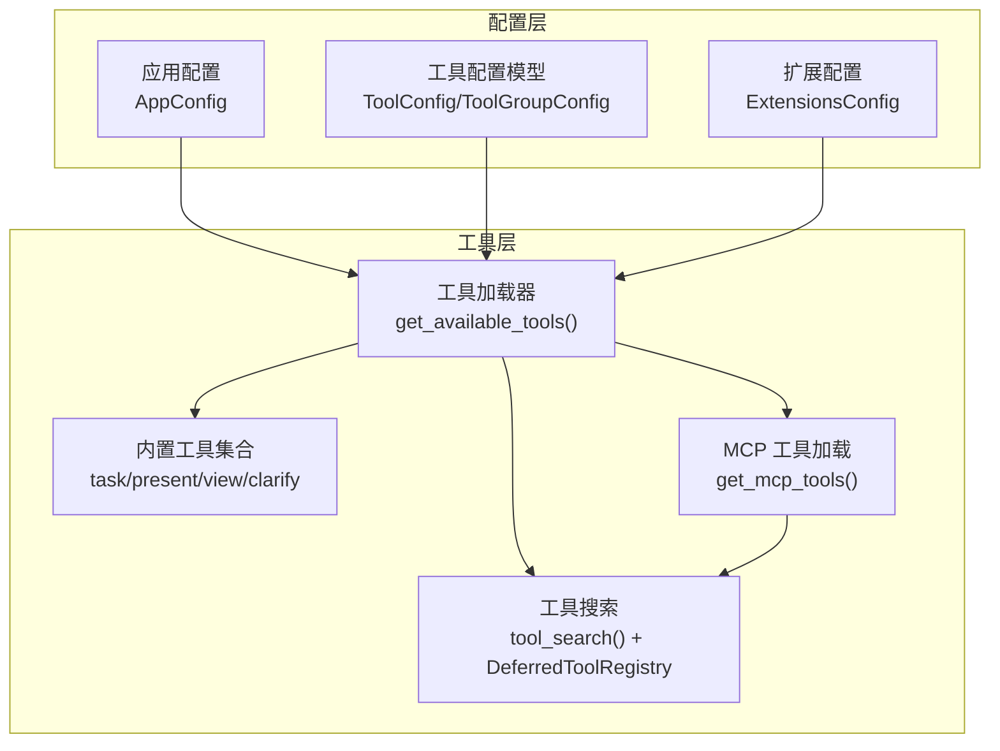
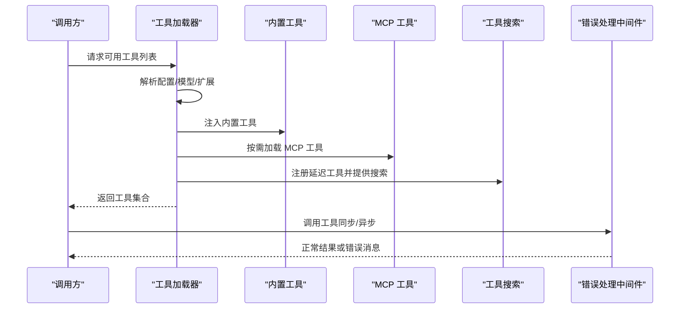
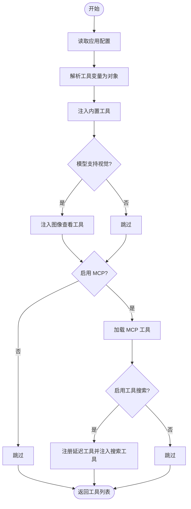
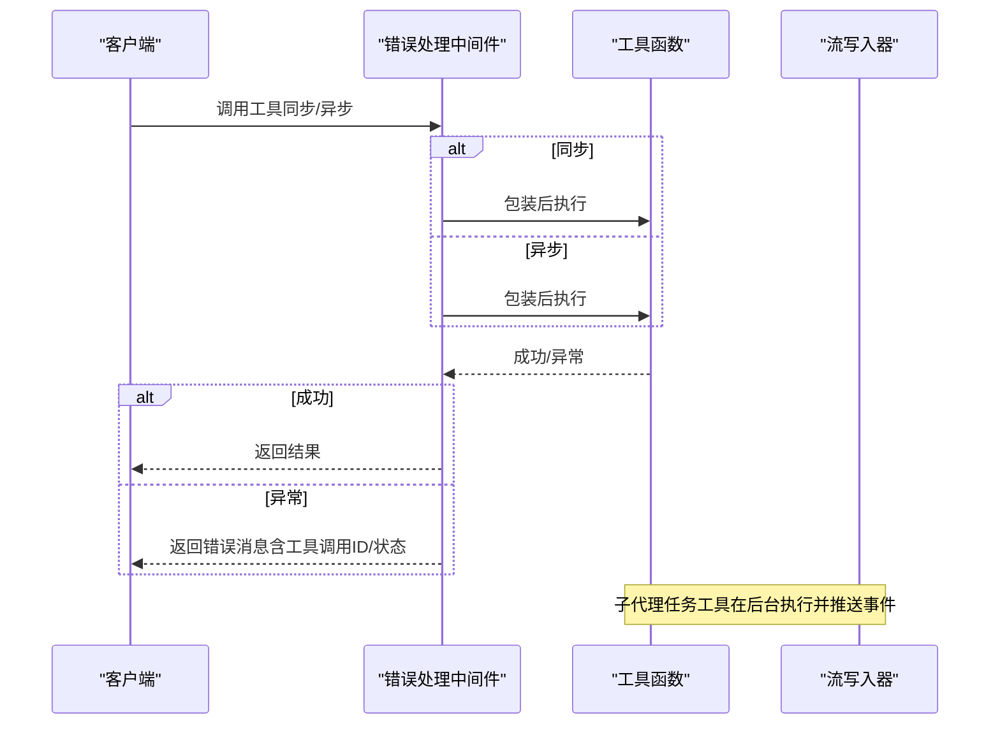
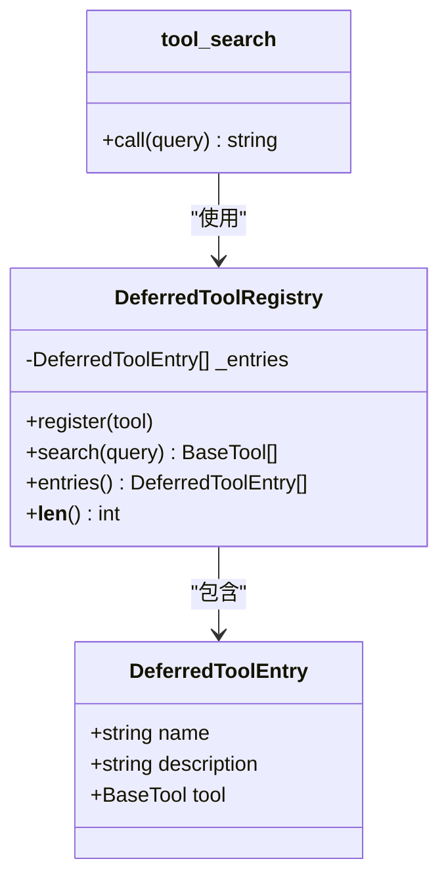
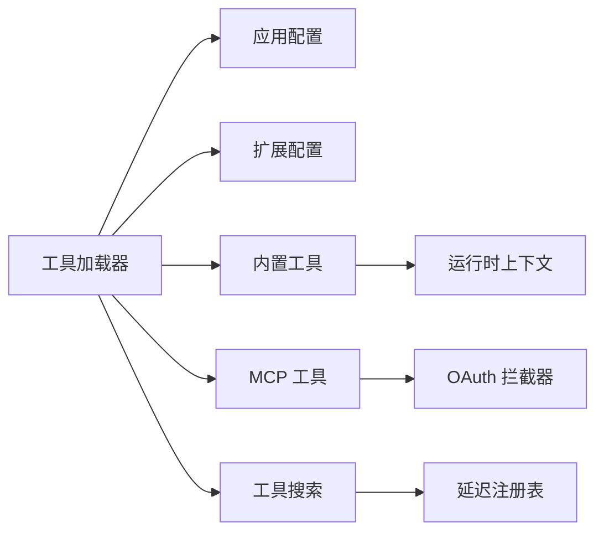

# 自定义工具开发

<cite>
**本文引用的文件**
- [tools.py](file://backend/packages/harness/deerflow/tools/tools.py)
- [__init__.py](file://backend/packages/harness/deerflow/tools/__init__.py)
- [tool_config.py](file://backend/packages/harness/deerflow/config/tool_config.py)
- [extensions_config.py](file://backend/packages/harness/deerflow/config/extensions_config.py)
- [tool_search.py](file://backend/packages/harness/deerflow/tools/builtins/tool_search.py)
- [task_tool.py](file://backend/packages/harness/deerflow/tools/builtins/task_tool.py)
- [clarification_tool.py](file://backend/packages/harness/deerflow/tools/builtins/clarification_tool.py)
- [present_file_tool.py](file://backend/packages/harness/deerflow/tools/builtins/present_file_tool.py)
- [view_image_tool.py](file://backend/packages/harness/deerflow/tools/builtins/view_image_tool.py)
- [tools.py](file://backend/packages/harness/deerflow/mcp/tools.py)
- [test_tool_error_handling_middleware.py](file://backend/tests/test_tool_error_handling_middleware.py)
- [tool-error-degradation-detection.sh](file://scripts/tool-error-degradation-detection.sh)
- [deploy.sh](file://scripts/deploy.sh)
- [serve.sh](file://scripts/serve.sh)
- [SETUP.md](file://backend/docs/SETUP.md)
</cite>

## 目录
1. [简介](#简介)
2. [项目结构](#项目结构)
3. [核心组件](#核心组件)
4. [架构总览](#架构总览)
5. [详细组件分析](#详细组件分析)
6. [依赖分析](#依赖分析)
7. [性能考虑](#性能考虑)
8. [故障排查指南](#故障排查指南)
9. [结论](#结论)
10. [附录](#附录)

## 简介
本指南面向希望在 DeerFlow 中开发与集成自定义工具的工程师，系统讲解如何基于现有框架创建自定义工具类、遵循 BaseTool 接口规范、实现工具方法、定义工具元数据、进行参数校验、处理错误与异常、支持同步与异步执行，并完成工具注册、配置文件设置、测试与部署。文档同时提供完整开发示例路径、最佳实践与常见问题解决方案。

## 项目结构
DeerFlow 的工具体系由“工具加载器”“内置工具集合”“可插拔 MCP 工具”“工具配置模型”等模块组成。工具加载器负责从应用配置中解析工具定义，按需注入内置工具（如任务委托、文件呈现、图像查看、澄清请求等），并在启用时加载 MCP 工具与延迟搜索能力。

图表来源
- [tools.py:23-115](file://backend/packages/harness/deerflow/tools/tools.py#L23-L115)
- [tool_config.py:4-21](file://backend/packages/harness/deerflow/config/tool_config.py#L4-L21)
- [extensions_config.py:55-68](file://backend/packages/harness/deerflow/config/extensions_config.py#L55-L68)
- [tool_search.py:142-177](file://backend/packages/harness/deerflow/tools/builtins/tool_search.py#L142-L177)
- [tools.py:56-114](file://backend/packages/harness/deerflow/mcp/tools.py#L56-L114)

章节来源
- [tools.py:1-115](file://backend/packages/harness/deerflow/tools/tools.py#L1-L115)
- [tool_config.py:1-21](file://backend/packages/harness/deerflow/config/tool_config.py#L1-L21)
- [extensions_config.py:1-200](file://backend/packages/harness/deerflow/config/extensions_config.py#L1-L200)

## 核心组件
- 工具加载器：根据应用配置与运行时参数动态聚合可用工具集，包含内置工具、MCP 工具与延迟搜索工具。
- 内置工具：提供任务委托、文件呈现、图像查看、澄清请求等通用能力。
- 工具搜索：对延迟注册的 MCP 工具进行按名称/关键词检索，返回标准函数签名以供调用。
- 配置模型：定义工具与工具组的结构化配置，支持从变量名解析具体工具对象。
- 扩展配置：统一管理 MCP 服务器与技能开关，支持环境变量解析与热更新。

章节来源
- [tools.py:23-115](file://backend/packages/harness/deerflow/tools/tools.py#L23-L115)
- [tool_search.py:1-177](file://backend/packages/harness/deerflow/tools/builtins/tool_search.py#L1-L177)
- [tool_config.py:1-21](file://backend/packages/harness/deerflow/config/tool_config.py#L1-L21)
- [extensions_config.py:55-200](file://backend/packages/harness/deerflow/config/extensions_config.py#L55-L200)

## 架构总览
下图展示工具从配置到运行时的装配与调用链路，涵盖同步/异步执行、错误包装与流式事件推送。

图表来源
- [tools.py:23-115](file://backend/packages/harness/deerflow/tools/tools.py#L23-L115)
- [tool_search.py:142-177](file://backend/packages/harness/deerflow/tools/builtins/tool_search.py#L142-L177)
- [tools.py:56-114](file://backend/packages/harness/deerflow/mcp/tools.py#L56-L114)
- [test_tool_error_handling_middleware.py:17-96](file://backend/tests/test_tool_error_handling_middleware.py#L17-L96)

## 详细组件分析

### 工具加载器与注册流程
- 功能要点
  - 从应用配置读取工具定义，按组过滤。
  - 条件注入内置工具（如任务委托、文件呈现、图像查看）。
  - 基于模型能力（是否支持视觉）决定是否注入图像查看工具。
  - 可选加载 MCP 工具并支持延迟注册与搜索。
  - 支持 ACP 工具注入。
- 关键行为
  - 使用上下文变量重置延迟注册表，避免并发污染。
  - 通过扩展配置读取最新 MCP 服务器状态，确保网关 API 修改即时生效。
  - 统计并记录各类工具数量，便于可观测性。

图表来源
- [tools.py:23-115](file://backend/packages/harness/deerflow/tools/tools.py#L23-L115)

章节来源
- [tools.py:23-115](file://backend/packages/harness/deerflow/tools/tools.py#L23-L115)

### 工具元数据与参数验证
- 元数据定义
  - 工具组与工具条目使用 Pydantic 模型定义，包含唯一名称、分组、变量定位字符串等字段。
  - 变量定位字符串指向具体工具提供者，例如“deerflow.sandbox.tools:bash_tool”，用于运行时解析。
- 参数验证
  - 内置工具普遍采用类型注解与可选参数，结合运行时上下文（线程 ID、输出目录等）进行路径与权限校验。
  - 图像查看工具对路径合法性、文件存在性、扩展名与 MIME 类型进行严格检查。
  - 文件呈现工具对虚拟路径与线程输出目录进行归一化与范围限制。

章节来源
- [tool_config.py:11-21](file://backend/packages/harness/deerflow/config/tool_config.py#L11-L21)
- [view_image_tool.py:15-95](file://backend/packages/harness/deerflow/tools/builtins/view_image_tool.py#L15-L95)
- [present_file_tool.py:62-101](file://backend/packages/harness/deerflow/tools/builtins/present_file_tool.py#L62-L101)

### 错误处理与异步执行支持
- 错误处理
  - 通过中间件将工具调用异常包装为标准工具消息，保留工具调用 ID 与状态，保证前端一致性。
  - 对缺失工具调用 ID 的场景提供回退策略；对中断类异常（如图中断）进行透传。
  - 提供同步与异步两种包装接口，覆盖不同运行时场景。
- 异步执行
  - MCP 工具加载器为异步协程，提供同步包装器以适配同步客户端流式调用。
  - 任务委托工具在后台异步执行子代理任务，定期轮询状态并通过流写入器推送事件。

图表来源
- [test_tool_error_handling_middleware.py:17-96](file://backend/tests/test_tool_error_handling_middleware.py#L17-L96)
- [tools.py:25-54](file://backend/packages/harness/deerflow/mcp/tools.py#L25-L54)
- [task_tool.py:115-196](file://backend/packages/harness/deerflow/tools/builtins/task_tool.py#L115-L196)

章节来源
- [test_tool_error_handling_middleware.py:1-97](file://backend/tests/test_tool_error_handling_middleware.py#L1-L97)
- [tools.py:1-114](file://backend/packages/harness/deerflow/mcp/tools.py#L1-L114)
- [task_tool.py:1-196](file://backend/packages/harness/deerflow/tools/builtins/task_tool.py#L1-L196)

### 工具搜索与延迟注册
- 延迟注册机制
  - 将 MCP 工具仅注册名称与描述，不立即暴露完整参数签名。
  - 通过工具搜索工具按查询匹配，返回 OpenAI 函数格式的工具定义，使 LLM 能够调用。
- 查询语法
  - 精确选择：select:name1,name2
  - 关键词匹配：+keyword rest 或普通正则
  - 结果上限：最多返回固定数量的最佳匹配。

图表来源
- [tool_search.py:30-102](file://backend/packages/harness/deerflow/tools/builtins/tool_search.py#L30-L102)
- [tool_search.py:142-177](file://backend/packages/harness/deerflow/tools/builtins/tool_search.py#L142-L177)

章节来源
- [tool_search.py:1-177](file://backend/packages/harness/deerflow/tools/builtins/tool_search.py#L1-L177)

### 内置工具示例与最佳实践
- 任务委托工具
  - 适用场景：复杂多步任务、需要隔离上下文或产生大量输出的任务。
  - 最佳实践：明确描述与提示词；控制最大轮次；利用流式事件向用户反馈进度。
- 文件呈现工具
  - 适用场景：将生成的文件暴露给用户查看与下载。
  - 最佳实践：确保文件位于限定输出目录；使用虚拟路径契约；避免并发状态冲突。
- 图像查看工具
  - 适用场景：读取并展示图像文件。
  - 最佳实践：严格校验路径、文件存在性与扩展名；正确推断 MIME 类型；安全地进行二进制编码。
- 澄清请求工具
  - 适用场景：需要用户补充信息或确认风险操作。
  - 最佳实践：一次只提一个问题；清晰表达背景与选项；交由中间件接管交互。

章节来源
- [task_tool.py:21-196](file://backend/packages/harness/deerflow/tools/builtins/task_tool.py#L21-L196)
- [present_file_tool.py:62-101](file://backend/packages/harness/deerflow/tools/builtins/present_file_tool.py#L62-L101)
- [view_image_tool.py:15-95](file://backend/packages/harness/deerflow/tools/builtins/view_image_tool.py#L15-L95)
- [clarification_tool.py:6-56](file://backend/packages/harness/deerflow/tools/builtins/clarification_tool.py#L6-L56)

## 依赖分析
- 工具加载器依赖应用配置与扩展配置，按需引入内置工具与 MCP 工具。
- 内置工具依赖运行时上下文（线程状态、沙箱状态、模型名称等）以实现上下文感知行为。
- 工具搜索依赖延迟注册表与查询算法，返回标准化函数签名。
- MCP 工具加载依赖多服务器客户端与 OAuth 拦截器，提供同步包装以兼容同步流式调用。

图表来源
- [tools.py:23-115](file://backend/packages/harness/deerflow/tools/tools.py#L23-L115)
- [extensions_config.py:55-200](file://backend/packages/harness/deerflow/config/extensions_config.py#L55-L200)
- [tool_search.py:121-137](file://backend/packages/harness/deerflow/tools/builtins/tool_search.py#L121-L137)
- [tools.py:93-114](file://backend/packages/harness/deerflow/mcp/tools.py#L93-L114)

章节来源
- [tools.py:1-115](file://backend/packages/harness/deerflow/tools/tools.py#L1-L115)
- [extensions_config.py:1-200](file://backend/packages/harness/deerflow/config/extensions_config.py#L1-L200)
- [tool_search.py:1-177](file://backend/packages/harness/deerflow/tools/builtins/tool_search.py#L1-L177)
- [tools.py:1-114](file://backend/packages/harness/deerflow/mcp/tools.py#L1-L114)

## 性能考虑
- 延迟注册与搜索：仅在需要时拉取工具完整定义，减少初始加载开销。
- 同步包装器：在异步环境中复用全局线程池，避免嵌套事件循环带来的阻塞。
- 轮询策略：子代理任务工具采用固定间隔轮询，结合超时保护，平衡实时性与资源占用。
- 缓存与热更新：扩展配置支持从文件热加载，确保网关 API 修改即时生效。

## 故障排查指南
- 工具调用异常包装
  - 若工具抛出异常，中间件会将其包装为工具消息并返回错误状态，同时保留工具调用 ID，便于端到端追踪。
  - 对缺失工具调用 ID 的场景，中间件会使用回退 ID，避免消息丢失。
  - 对图中断类异常，中间件会直接透传，避免被错误包装。
- MCP 工具加载失败
  - 当未安装相关适配包时，会记录警告并返回空列表；当配置无效或网络异常时，会记录错误日志并返回空列表。
- 工具降级检测脚本
  - 提供脚本用于验证工具链路在错误与成功场景下的稳定性，确保错误不会导致崩溃且输出被正确保留。

章节来源
- [test_tool_error_handling_middleware.py:1-97](file://backend/tests/test_tool_error_handling_middleware.py#L1-L97)
- [tools.py:64-114](file://backend/packages/harness/deerflow/mcp/tools.py#L64-L114)
- [tool-error-degradation-detection.sh:128-148](file://scripts/tool-error-degradation-detection.sh#L128-L148)

## 结论
通过遵循 DeerFlow 的工具开发范式，开发者可以快速构建与集成自定义工具：以配置驱动工具装配，以内置工具补齐通用能力，以 MCP 工具扩展外部能力，以延迟搜索提升发现效率，并以中间件保障错误处理与一致性。配合完善的测试与部署流程，可实现稳定、可观测、可扩展的工具生态。

## 附录

### 开发步骤清单
- 定义工具元数据
  - 在工具配置中添加条目，指定唯一名称、分组与变量定位字符串。
  - 参考路径：[tool_config.py:11-21](file://backend/packages/harness/deerflow/config/tool_config.py#L11-L21)
- 实现工具方法
  - 使用装饰器声明工具名称与文档解析；在函数签名中加入运行时上下文与工具调用 ID 注入。
  - 参考路径：[task_tool.py:21-59](file://backend/packages/harness/deerflow/tools/builtins/task_tool.py#L21-L59)
- 参数验证与错误处理
  - 对输入路径、文件存在性、类型与范围进行严格校验；必要时返回命令对象或工具消息。
  - 参考路径：[present_file_tool.py:87-101](file://backend/packages/harness/deerflow/tools/builtins/present_file_tool.py#L87-L101)、[view_image_tool.py:35-95](file://backend/packages/harness/deerflow/tools/builtins/view_image_tool.py#L35-L95)
- 注册与装配
  - 将工具纳入工具加载器的可用工具集合；若为 MCP 工具，确保在扩展配置中启用相应服务器。
  - 参考路径：[tools.py:23-115](file://backend/packages/harness/deerflow/tools/tools.py#L23-L115)、[extensions_config.py:177-183](file://backend/packages/harness/deerflow/config/extensions_config.py#L177-L183)
- 测试与验证
  - 编写单元测试覆盖正常与异常分支；使用降级检测脚本验证链路稳定性。
  - 参考路径：[test_tool_error_handling_middleware.py:1-97](file://backend/tests/test_tool_error_handling_middleware.py#L1-L97)、[tool-error-degradation-detection.sh:128-148](file://scripts/tool-error-degradation-detection.sh#L128-L148)
- 部署与运行
  - 设置配置文件路径与扩展配置路径；启动服务并验证工具可用性。
  - 参考路径：[deploy.sh:140-163](file://scripts/deploy.sh#L140-L163)、[serve.sh:73-92](file://scripts/serve.sh#L73-L92)、[SETUP.md:61-93](file://backend/docs/SETUP.md#L61-L93)