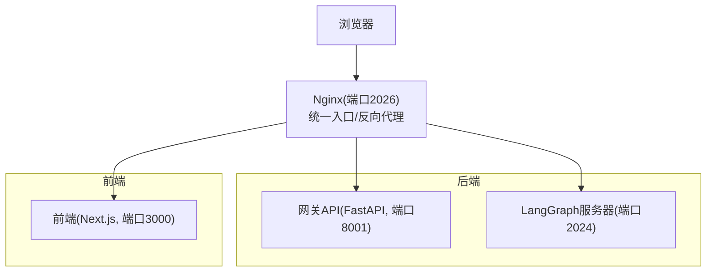
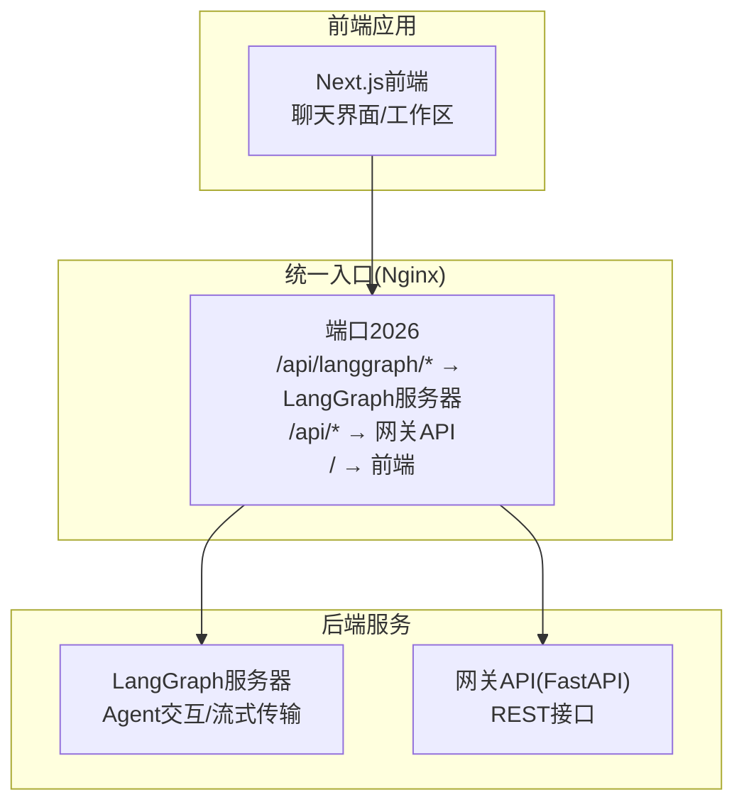
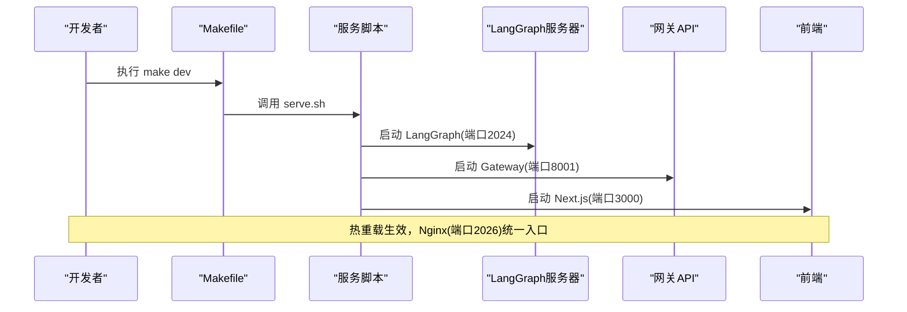
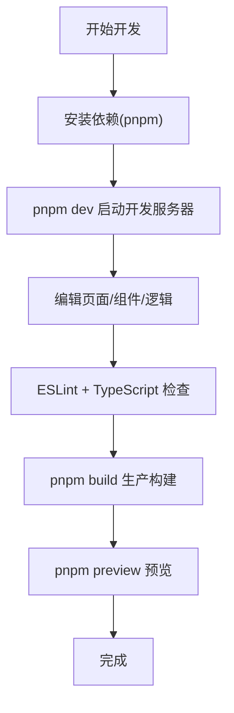
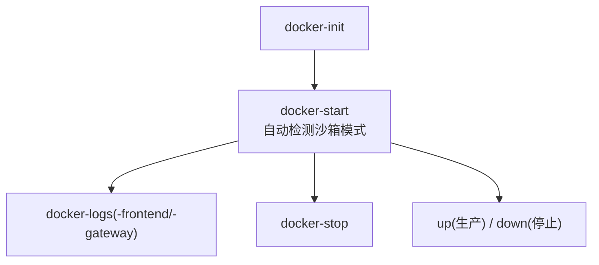
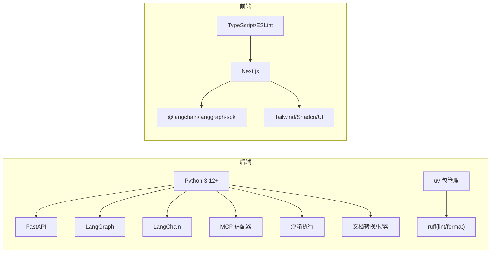

# 开发者指南

<cite>
**本文档引用的文件**
- [CONTRIBUTING.md](file://CONTRIBUTING.md)
- [backend/CONTRIBUTING.md](file://backend/CONTRIBUTING.md)
- [README.md](file://README.md)
- [backend/README.md](file://backend/README.md)
- [frontend/README.md](file://frontend/README.md)
- [backend/pyproject.toml](file://backend/pyproject.toml)
- [frontend/package.json](file://frontend/package.json)
- [Makefile](file://Makefile)
- [backend/Makefile](file://backend/Makefile)
- [frontend/Makefile](file://frontend/Makefile)
- [backend/ruff.toml](file://backend/ruff.toml)
- [frontend/eslint.config.js](file://frontend/eslint.config.js)
- [frontend/prettier.config.js](file://frontend/prettier.config.js)
- [backend/langgraph.json](file://backend/langgraph.json)
- [docker/docker-compose-dev.yaml](file://docker/docker-compose-dev.yaml)
- [docker/docker-compose.yaml](file://docker/docker-compose.yaml)
- [scripts/docker.sh](file://scripts/docker.sh)
- [scripts/serve.sh](file://scripts/serve.sh)
- [scripts/check.py](file://scripts/check.py)
- [scripts/configure.py](file://scripts/configure.py)
- [scripts/config-upgrade.sh](file://scripts/config-upgrade.sh)
- [scripts/deploy.sh](file://scripts/deploy.sh)
- [scripts/start-daemon.sh](file://scripts/start-daemon.sh)
- [scripts/wait-for-port.sh](file://scripts/wait-for-port.sh)
- [scripts/tool-error-degradation-detection.sh](file://scripts/tool-error-degradation-detection.sh)
- [scripts/export_claude_code_oauth.py](file://scripts/export_claude_code_oauth.py)
- [config.example.yaml](file://config.example.yaml)
- [extensions_config.example.json](file://extensions_config.example.json)
</cite>

## 目录
1. [简介](#简介)
2. [项目结构](#项目结构)
3. [核心组件](#核心组件)
4. [架构总览](#架构总览)
5. [详细组件分析](#详细组件分析)
6. [依赖关系分析](#依赖关系分析)
7. [性能考虑](#性能考虑)
8. [故障排除指南](#故障排除指南)
9. [结论](#结论)
10. [附录](#附录)

## 简介
本指南面向 DeerFlow 开发者，提供从环境搭建、开发流程、测试策略到代码风格与发布流程的完整开发手册。内容覆盖后端（Python/FastAPI/LangGraph）、前端（Next.js）以及 Docker 容器化部署，帮助贡献者快速上手并高质量交付功能。

## 项目结构
DeerFlow 采用前后端分离与容器化统一入口的架构：前端通过 Nginx 反向代理访问后端服务，后端由 LangGraph 服务器与 Gateway API 组成，提供多模型、工具、子代理、沙箱执行与持久化记忆等能力。

图表来源
- [backend/README.md:37-41](file://backend/README.md#L37-L41)
- [CONTRIBUTING.md:233-242](file://CONTRIBUTING.md#L233-L242)

章节来源
- [README.md:203-231](file://README.md#L203-L231)
- [CONTRIBUTING.md:203-242](file://CONTRIBUTING.md#L203-L242)

## 核心组件
- LangGraph 主智能体（Lead Agent）：负责动态模型选择、中间件链、工具系统、子代理委派与系统提示注入。
- 中间件链：按序执行的九类横切关注点，如线程数据隔离、上传注入、沙箱获取、标题生成、记忆队列、图像注入与澄清请求拦截。
- 沙箱系统：抽象接口与本地/容器提供者，支持虚拟路径映射与技能加载。
- 子代理系统：并发委派与后台执行，支持超时与状态跟踪。
- 记忆系统：LLM 驱动的跨会话持久化上下文，支持去重与批量更新。
- 工具生态：内置、社区、MCP 与技能工具的统一调度。
- 网关 API：FastAPI 提供模型、MCP、技能、内存、上传与工件管理等 REST 接口。
- IM 渠道：飞书、Slack、Telegram 的消息桥接与流式响应。

章节来源
- [backend/README.md:44-136](file://backend/README.md#L44-L136)

## 架构总览
下图展示请求在 Nginx 统一入口后的路由与各服务职责：

图表来源
- [backend/README.md:37-41](file://backend/README.md#L37-L41)
- [CONTRIBUTING.md:192-201](file://CONTRIBUTING.md#L192-L201)

## 详细组件分析

### 后端开发与测试流程
- 开发环境：推荐使用 Docker 开发模式，自动构建镜像、安装依赖并启用热重载；也可本地运行（需要 Node.js、pnpm、uv、nginx）。
- 启动方式：一键命令或分步启动（LangGraph 服务器、网关 API、前端、Nginx）。
- 测试策略：后端使用 pytest，覆盖模型工厂、沙箱、网关路由、工具与中间件等模块；PR 包含回归检查。
- 代码风格：Python 使用 ruff（lint/format），行宽 240，类型注解与导入分组遵循约定。

图表来源
- [Makefile:97-113](file://Makefile#L97-L113)
- [scripts/serve.sh](file://scripts/serve.sh)
- [backend/Makefile:4-8](file://backend/Makefile#L4-L8)

章节来源
- [CONTRIBUTING.md:56-103](file://CONTRIBUTING.md#L56-L103)
- [backend/CONTRIBUTING.md:34-64](file://backend/CONTRIBUTING.md#L34-L64)
- [backend/Makefile:10-17](file://backend/Makefile#L10-L17)

### 前端开发与构建
- 技术栈：Next.js App Router、React 19、Tailwind CSS 4、Shadcn UI、MagicUI 与 React Bits。
- 开发流程：安装依赖后启动 dev 服务器，默认访问 http://localhost:3000；可选配置后端 API 地址。
- 质量保障：ESLint + TypeScript 类型检查；Prettier 格式化；UI 组件库与样式工具链。

图表来源
- [frontend/README.md:18-52](file://frontend/README.md#L18-L52)
- [frontend/package.json:6-16](file://frontend/package.json#L6-L16)

章节来源
- [frontend/README.md:11-131](file://frontend/README.md#L11-L131)
- [frontend/package.json:17-111](file://frontend/package.json#L17-L111)

### Docker 开发与生产部署
- 开发模式：docker-init 初始化镜像与依赖，docker-start 启动所有服务并自动检测沙箱模式；日志查看与停止命令齐全。
- 生产模式：up 构建并启动生产服务，down 停止并移除容器；Nginx 配置集中于 docker/nginx。
- Compose 文件：docker-compose-dev.yaml 用于开发，docker-compose.yaml 用于生产。

图表来源
- [Makefile:147-179](file://Makefile#L147-L179)
- [scripts/docker.sh](file://scripts/docker.sh)
- [docker/docker-compose-dev.yaml](file://docker/docker-compose-dev.yaml)
- [docker/docker-compose.yaml](file://docker/docker-compose.yaml)

章节来源
- [CONTRIBUTING.md:56-103](file://CONTRIBUTING.md#L56-L103)
- [Makefile:147-179](file://Makefile#L147-L179)

### 配置与环境变量
- 主配置：config.yaml 放置于项目根目录，支持模型、工具、沙箱、技能、标题、摘要、子代理与记忆等配置项。
- 扩展配置：extensions_config.json 管理 MCP 服务器与技能状态。
- 环境变量：DEER_FLOW_CONFIG_PATH、DEER_FLOW_EXTENSIONS_CONFIG_PATH、各类 Provider API Key。

章节来源
- [backend/README.md:254-314](file://backend/README.md#L254-L314)
- [README.md:79-193](file://README.md#L79-L193)

### 代码风格与格式化
- Python：ruff 统一 lint 与 format，行宽 240，类型注解，导入分组，双引号，4 空格缩进。
- TypeScript/JavaScript：ESLint + TypeScript 推荐规则，导入顺序与忽略规则；Prettier + Tailwind 插件。

章节来源
- [backend/ruff.toml:1-14](file://backend/ruff.toml#L1-L14)
- [frontend/eslint.config.js:1-96](file://frontend/eslint.config.js#L1-L96)
- [frontend/prettier.config.js:1-5](file://frontend/prettier.config.js#L1-L5)

### 测试策略与编写方法
- 单元测试：后端使用 pytest，测试文件与源码结构对应；建议围绕模型工厂、沙箱、中间件、工具与配置变更进行覆盖。
- 集成测试：通过网关 API 路由与 LangGraph 交互验证端到端流程；注意沙箱模式与 MCP 配置对测试的影响。
- 端到端测试：结合前端交互与后端响应，验证聊天、上传、工件生成与记忆同步等场景。
- 回归检查：PR 自动运行后端回归任务，确保沙箱模式检测与 provisioner K8s 配置处理稳定。

章节来源
- [CONTRIBUTING.md:266-284](file://CONTRIBUTING.md#L266-L284)
- [backend/CONTRIBUTING.md:204-242](file://backend/CONTRIBUTING.md#L204-L242)

### 代码贡献规范与工作流程
- 分支命名：feature/、fix/、docs/、refactor/ 等清晰前缀。
- 提交信息：feat/、fix/、docs/、refactor/、test/、chore/ 前缀，描述“做了什么/为什么/如何实现/如何测试”。
- PR 流程：本地先通过测试与格式化，再提交 PR 并跟进评审反馈，确保 CI 通过后合并。

章节来源
- [backend/CONTRIBUTING.md:173-203](file://backend/CONTRIBUTING.md#L173-L203)
- [backend/CONTRIBUTING.md:243-267](file://backend/CONTRIBUTING.md#L243-L267)

### 发布流程
- 本地验证：make check 确认工具链，make install 安装依赖，make dev 启动服务验证。
- 生产构建：make up 构建并启动生产服务，make down 停止与清理。
- Docker 镜像：compose 文件定义镜像构建与运行参数，Nginx 提供统一入口与路由。

章节来源
- [README.md:212-224](file://README.md#L212-L224)
- [Makefile:173-179](file://Makefile#L173-L179)

## 依赖关系分析
- 后端依赖：FastAPI、LangGraph、LangChain、MCP 适配器、沙箱执行、文档转换与搜索工具等。
- 前端依赖：Next.js、@langchain/langgraph-sdk、AI 元素、Tailwind CSS、React 组件库与工具链。
- 开发工具：uv（Python 包管理）、pnpm（Node 包管理）、ruff（Python）、ESLint/TypeScript（前端）。

图表来源
- [backend/pyproject.toml:1-29](file://backend/pyproject.toml#L1-L29)
- [frontend/package.json:17-111](file://frontend/package.json#L17-L111)

章节来源
- [backend/pyproject.toml:1-29](file://backend/pyproject.toml#L1-L29)
- [frontend/package.json:17-111](file://frontend/package.json#L17-L111)

## 性能考虑
- 上下文压缩：在接近 token 限制时进行摘要，减少长对话开销。
- 子代理并发：每轮最多 3 个子代理并发执行，超时控制与状态跟踪降低资源占用。
- 沙箱隔离：容器化执行避免资源泄漏与相互影响，适合长时间运行的任务。
- 热重载与反向代理：开发阶段启用热重载与 Nginx 统一入口，提升迭代效率。

章节来源
- [backend/README.md:83-101](file://backend/README.md#L83-L101)
- [backend/README.md:84-90](file://backend/README.md#L84-L90)

## 故障排除指南
- Docker 权限问题（Linux）：将当前用户加入 docker 组并重新登录，验证 docker ps。
- 端口占用：使用 make stop 清理进程，确认端口释放；必要时使用 scripts/wait-for-port.sh 检查端口状态。
- 工具错误降级：使用 scripts/tool-error-degradation-detection.sh 快速定位工具异常。
- Claude Code OAuth：使用 scripts/export_claude_code_oauth.py 导出认证信息，确保环境变量正确。
- 配置升级：使用 make config-upgrade 将新字段合并到现有 config.yaml。

章节来源
- [CONTRIBUTING.md:73-105](file://CONTRIBUTING.md#L73-L105)
- [Makefile:120-141](file://Makefile#L120-L141)
- [scripts/wait-for-port.sh](file://scripts/wait-for-port.sh)
- [scripts/tool-error-degradation-detection.sh](file://scripts/tool-error-degradation-detection.sh)
- [scripts/export_claude_code_oauth.py](file://scripts/export_claude_code_oauth.py)
- [scripts/config-upgrade.sh](file://scripts/config-upgrade.sh)

## 结论
本指南提供了 DeerFlow 的开发全生命周期实践：从环境搭建、开发工作流、测试策略到代码风格与发布流程。建议贡献者优先采用 Docker 开发模式，严格遵循分支与提交规范，配合 pytest 与前端质量工具，确保代码质量与可维护性。

## 附录
- 关键脚本与命令
  - 后端：make install、make dev、make gateway、make test、make lint、make format
  - 前端：pnpm install、pnpm dev、pnpm build、pnpm lint、pnpm typecheck
  - 通用：make config、make check、make install、make dev、make start、make stop、make clean
  - Docker：make docker-init、make docker-start、make docker-stop、make docker-logs
- 配置模板
  - config.example.yaml：主配置模板
  - extensions_config.example.json：MCP 与技能配置模板

章节来源
- [backend/Makefile:1-18](file://backend/Makefile#L1-L18)
- [frontend/Makefile:1-15](file://frontend/Makefile#L1-L15)
- [Makefile:13-37](file://Makefile#L13-L37)
- [config.example.yaml](file://config.example.yaml)
- [extensions_config.example.json](file://extensions_config.example.json)