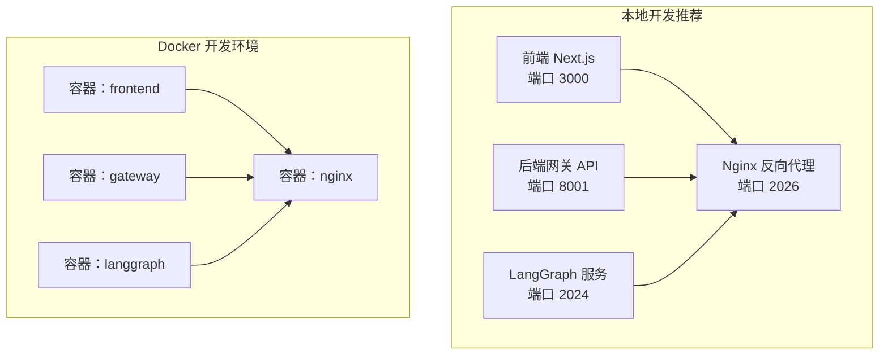
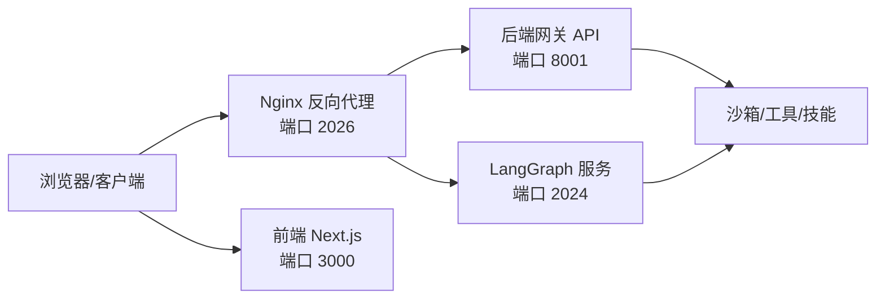
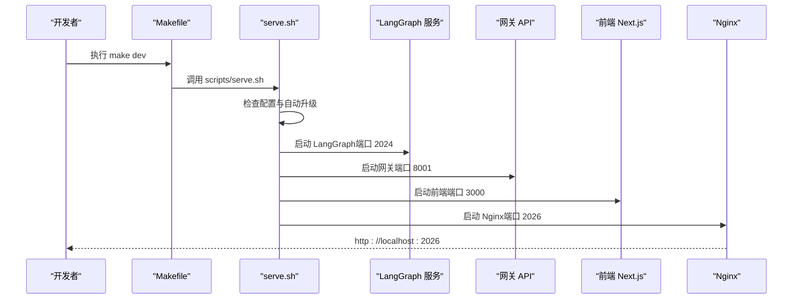
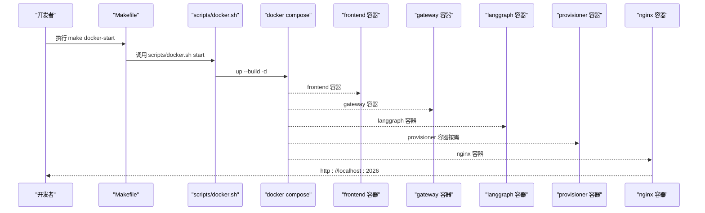

# 快速开始

<cite>
**本文引用的文件**
- [README.md](file://README.md)
- [backend/README.md](file://backend/README.md)
- [frontend/README.md](file://frontend/README.md)
- [Makefile](file://Makefile)
- [scripts/serve.sh](file://scripts/serve.sh)
- [scripts/docker.sh](file://scripts/docker.sh)
- [scripts/deploy.sh](file://scripts/deploy.sh)
- [scripts/check.py](file://scripts/check.py)
- [scripts/configure.py](file://scripts/configure.py)
- [docker/docker-compose-dev.yaml](file://docker/docker-compose-dev.yaml)
- [docker/docker-compose.yaml](file://docker/docker-compose.yaml)
- [config.example.yaml](file://config.example.yaml)
- [extensions_config.example.json](file://extensions_config.example.json)
- [backend/pyproject.toml](file://backend/pyproject.toml)
- [frontend/package.json](file://frontend/package.json)
</cite>

## 目录
1. [简介](#简介)
2. [项目结构](#项目结构)
3. [核心组件](#核心组件)
4. [架构总览](#架构总览)
5. [详细组件分析](#详细组件分析)
6. [依赖分析](#依赖分析)
7. [性能考虑](#性能考虑)
8. [故障排除指南](#故障排除指南)
9. [结论](#结论)
10. [附录](#附录)

## 简介
本指南面向首次接触 DeerFlow 的用户，帮助你在最短时间内完成环境准备、依赖安装、配置与启动，并掌握 Docker 开发环境与本地开发环境两种启动方式。你将获得：
- 完整的环境要求与依赖安装步骤
- 配置文件生成、编辑与参数说明
- 启动命令与访问方式
- 常见问题与故障排除建议

## 项目结构
DeerFlow 采用前后端分离与多服务协同的架构：前端使用 Next.js，后端基于 FastAPI 提供网关 API，LangGraph 负责代理与流式交互，Nginx 作为统一反向代理。生产与开发模式通过 Docker Compose 或本地脚本进行编排。

图表来源
- [backend/README.md:37-41](file://backend/README.md#L37-L41)
- [docker/docker-compose-dev.yaml:58-76](file://docker/docker-compose-dev.yaml#L58-L76)

章节来源
- [backend/README.md:7-41](file://backend/README.md#L7-L41)
- [docker/docker-compose-dev.yaml:1-216](file://docker/docker-compose-dev.yaml#L1-L216)

## 核心组件
- 前端（Next.js）：提供聊天界面与工作区管理，开发时热更新，生产时静态构建。
- 后端网关（FastAPI）：提供模型、技能、内存、上传、工件等 REST 接口。
- LangGraph 服务：负责多智能体对话、线程管理与流式输出。
- Nginx：统一入口，将 /api/langgraph/* 转发到 LangGraph，其他 /api/* 转发到网关，非 API 请求转发到前端。
- 沙箱系统：支持本地执行与容器执行，隔离代码运行与文件系统。
- 工具与技能：内置工具与社区工具，以及可扩展的技能系统。

章节来源
- [backend/README.md:44-136](file://backend/README.md#L44-L136)
- [README.md:77-225](file://README.md#L77-L225)

## 架构总览
下图展示了请求在各服务间的路由关系与默认端口映射。

图表来源
- [backend/README.md:37-41](file://backend/README.md#L37-L41)
- [docker/docker-compose-dev.yaml:58-76](file://docker/docker-compose-dev.yaml#L58-L76)

章节来源
- [backend/README.md:37-41](file://backend/README.md#L37-L41)

## 详细组件分析

### 环境要求与依赖安装
- 后端：Python 3.12+，uv 包管理器
- 前端：Node.js 22+，pnpm
- 可选：nginx（本地开发），Docker（Docker 开发/生产）

安装与检查命令
- 检查依赖：make check
- 安装依赖：make install
- 生成配置：make config

章节来源
- [scripts/check.py:1-133](file://scripts/check.py#L1-L133)
- [Makefile:13-54](file://Makefile#L13-L54)
- [backend/pyproject.toml:6](file://backend/pyproject.toml#L6)
- [frontend/package.json:109](file://frontend/package.json#L109)

### 配置文件生成与模板
- 生成配置文件：make config
  - 复制 config.example.yaml 为 config.yaml
  - 复制 .env.example 为 .env
  - 复制 frontend/.env.example 为 frontend/.env
- 编辑 config.yaml 设置模型与工具
- 编辑 .env 设置 API 密钥

章节来源
- [scripts/configure.py:1-59](file://scripts/configure.py#L1-L59)
- [README.md:79-193](file://README.md#L79-L193)
- [config.example.yaml:1-15](file://config.example.yaml#L1-L15)

### 配置文件参数说明与最佳实践
- config_version：用于检测配置版本，升级时使用 make config-upgrade 合并新字段
- log_level：日志级别（debug/info/warning/error）
- token_usage.enabled：是否记录令牌用量
- models：至少配置一个模型，推荐使用 OpenAI 兼容或原生 SDK；可通过 base_url 指定兼容网关
- tools/tool_groups：工具分组与可用工具清单
- sandbox：选择本地执行或容器执行；容器模式需 Docker/Apple Container
- skills：技能目录路径与容器挂载路径
- title/summarization/memory：标题自动生成、上下文摘要与长期记忆策略
- checkpointer：嵌入式客户端状态持久化（memory/sqlite/postgres）
- channels：IM 渠道（Telegram/Slack/Feishu）配置
- guardrails：工具调用前授权（允许列表/OAP/自定义）

章节来源
- [config.example.yaml:10-624](file://config.example.yaml#L10-L624)
- [README.md:255-381](file://README.md#L255-L381)

### Docker 开发环境启动
- 初始化沙箱镜像（可选）：make docker-init
- 启动服务：make docker-start
  - 自动检测 config.yaml 中的沙箱模式（local/aio/provisioner）
  - 若未找到配置，自动从示例复制一份
  - 支持查看日志与停止服务
- 访问地址：http://localhost:2026

章节来源
- [scripts/docker.sh:18-61](file://scripts/docker.sh#L18-L61)
- [scripts/docker.sh:150-230](file://scripts/docker.sh#L150-L230)
- [docker/docker-compose-dev.yaml:16-216](file://docker/docker-compose-dev.yaml#L16-L216)

### 本地开发环境启动
- 生成配置与安装依赖：make config && make install
- 启动服务：make dev
  - 后台启动 LangGraph（2024）、网关（8001）、前端（3000）、Nginx（2026）
  - 自动等待端口就绪，失败时打印日志定位
- 访问地址：http://localhost:2026

章节来源
- [scripts/serve.sh:71-204](file://scripts/serve.sh#L71-L204)
- [Makefile:97-114](file://Makefile#L97-L114)

### 生产环境（Docker）
- 构建并启动：make up
- 停止与清理：make down
- 访问地址：http://localhost:${PORT:-2026}

章节来源
- [scripts/deploy.sh:138-213](file://scripts/deploy.sh#L138-L213)
- [docker/docker-compose.yaml:1-183](file://docker/docker-compose.yaml#L1-L183)

### 启动流程时序图（本地开发）

图表来源
- [scripts/serve.sh:131-178](file://scripts/serve.sh#L131-L178)
- [backend/README.md:37-41](file://backend/README.md#L37-L41)

### 启动流程时序图（Docker 开发）

图表来源
- [scripts/docker.sh:150-230](file://scripts/docker.sh#L150-L230)
- [docker/docker-compose-dev.yaml:16-216](file://docker/docker-compose-dev.yaml#L16-L216)

## 依赖分析
- 后端技术栈：LangGraph、LangChain、FastAPI、uv
- 前端技术栈：Next.js、React 19、Tailwind CSS 4、Shadcn UI
- 运行时依赖：Node.js 22+、pnpm、uv、nginx（本地开发）
- Docker 依赖：Docker/Apple Container（容器沙箱模式）

章节来源
- [backend/README.md:345-354](file://backend/README.md#L345-L354)
- [frontend/README.md:5-10](file://frontend/README.md#L5-L10)
- [scripts/check.py:39-108](file://scripts/check.py#L39-L108)

## 性能考虑
- 上下文压缩：当接近模型最大输入时自动触发摘要，减少令牌占用
- 内存去抖：记忆更新批量处理，降低 LLM 调用频率
- 并行子代理：并发执行多个子任务，缩短长流程耗时
- 沙箱隔离：容器沙箱提升安全性与稳定性，避免资源争用

章节来源
- [config.example.yaml:446-487](file://config.example.yaml#L446-L487)
- [config.example.yaml:493-501](file://config.example.yaml#L493-L501)
- [backend/README.md:83-91](file://backend/README.md#L83-L91)

## 故障排除指南
- 依赖缺失
  - 使用 make check 检查 Node.js、pnpm、uv、nginx 是否满足要求
- Docker 权限问题（Linux）
  - 将当前用户加入 docker 组并重新登录
- 配置文件错误
  - 使用 make config-upgrade 合并新字段
  - 查看日志文件定位具体字段缺失或格式错误
- 端口占用
  - 停止已有服务后再启动
  - 使用 make stop 或对应停止命令
- 容器沙箱镜像拉取失败
  - 在 macOS 可尝试 Apple Container；或手动拉取镜像后重试
- IM 渠道无法连接
  - 检查 .env 中对应渠道的密钥是否正确
  - 确认 config.yaml 中渠道已启用且参数无误

章节来源
- [scripts/check.py:111-128](file://scripts/check.py#L111-L128)
- [README.md:209-211](file://README.md#L209-L211)
- [scripts/serve.sh:136-144](file://scripts/serve.sh#L136-L144)
- [scripts/docker.sh:119-148](file://scripts/docker.sh#L119-L148)
- [README.md:333-367](file://README.md#L333-L367)

## 结论
通过本快速开始指南，你可以：
- 明确环境要求与依赖
- 成功生成并配置 DeerFlow 的核心配置文件
- 以 Docker 或本地方式启动完整应用
- 在遇到问题时快速定位与解决

建议在本地开发完成后，再根据需要切换到 Docker 生产模式部署。

## 附录

### 常用命令速查
- 生成配置：make config
- 检查依赖：make check
- 安装依赖：make install
- 预拉取沙箱镜像：make setup-sandbox
- 本地开发启动：make dev
- Docker 开发启动：make docker-start
- 生产构建与启动：make up
- 停止与清理：make stop / make down

章节来源
- [Makefile:13-180](file://Makefile#L13-L180)

### 配置文件模板与示例
- 主配置模板：config.example.yaml
- 扩展配置模板：extensions_config.example.json
- 前端环境变量模板：frontend/.env.example

章节来源
- [config.example.yaml:1-15](file://config.example.yaml#L1-L15)
- [extensions_config.example.json:1-42](file://extensions_config.example.json#L1-L42)
- [frontend/README.md:24-27](file://frontend/README.md#L24-L27)