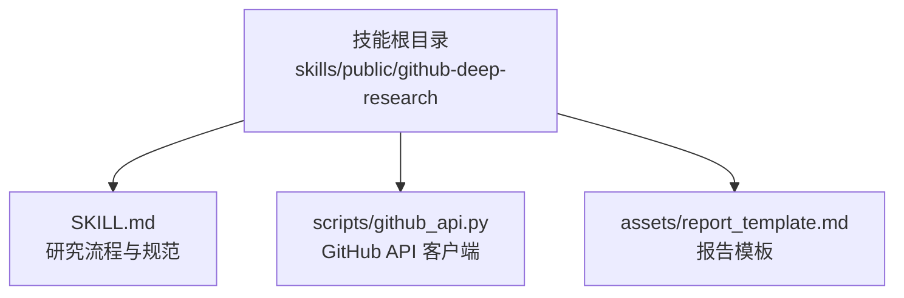
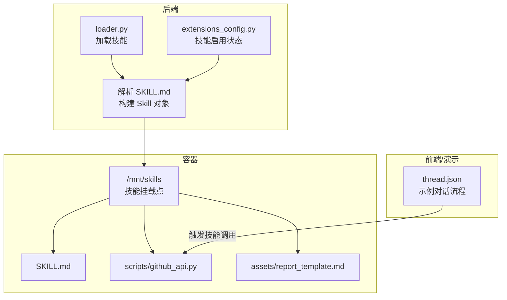
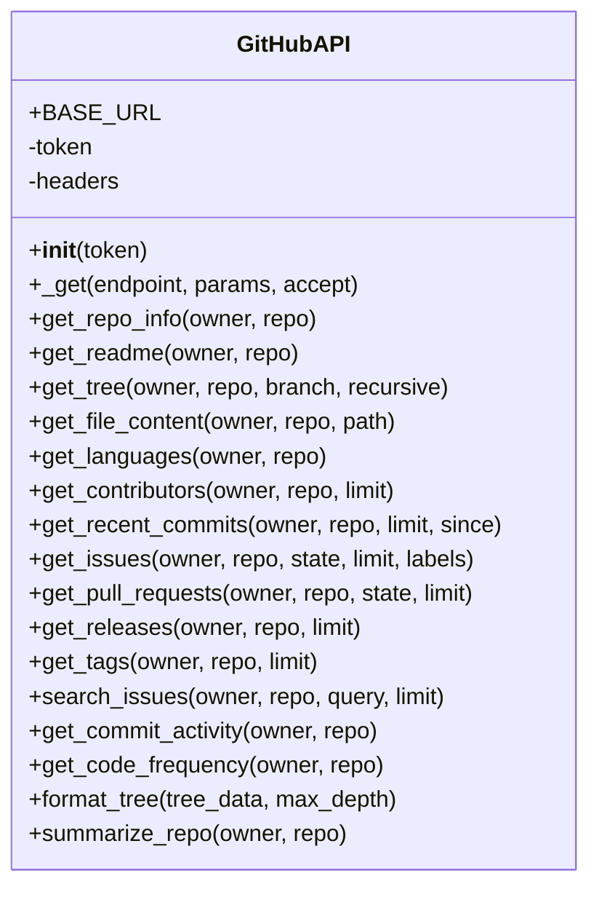
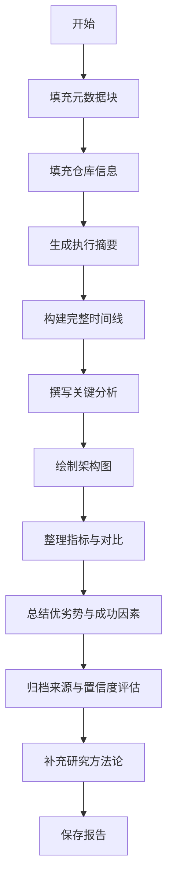
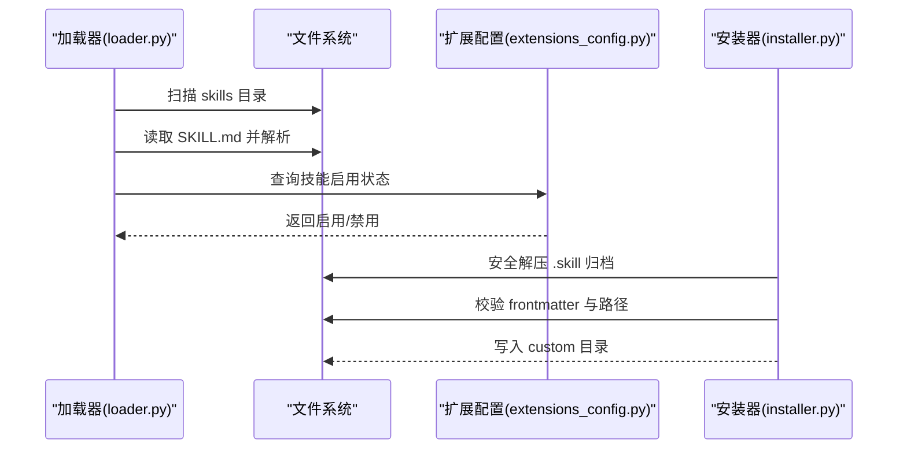
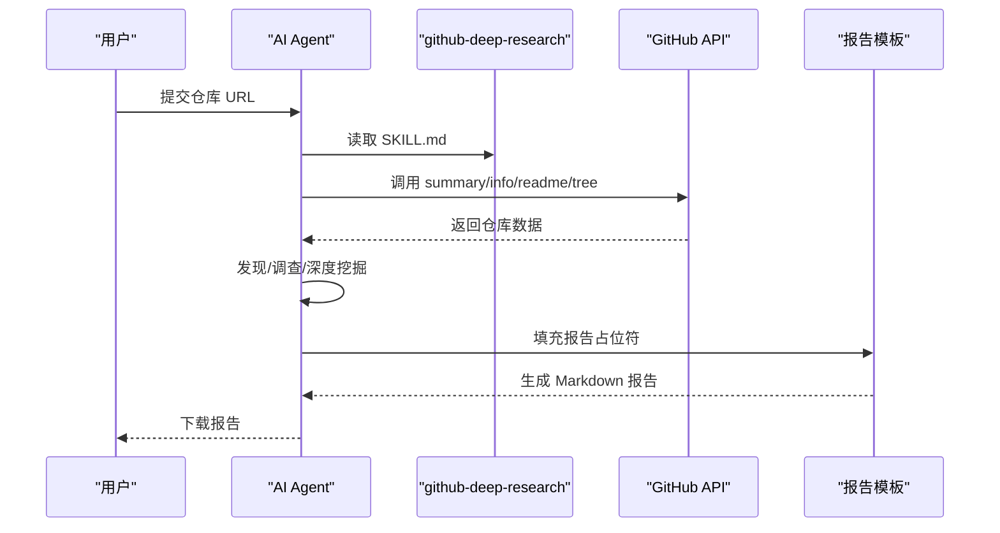
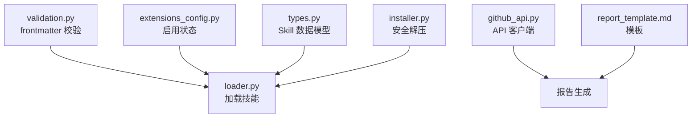

# GitHub 深度研究技能

<cite>
**本文引用的文件**
- [SKILL.md](file://skills/public/github-deep-research/SKILL.md)
- [github_api.py](file://skills/public/github-deep-research/scripts/github_api.py)
- [report_template.md](file://skills/public/github-deep-research/assets/report_template.md)
- [loader.py](file://backend/packages/harness/deerflow/skills/loader.py)
- [installer.py](file://backend/packages/harness/deerflow/skills/installer.py)
- [types.py](file://backend/packages/harness/deerflow/skills/types.py)
- [validation.py](file://backend/packages/harness/deerflow/skills/validation.py)
- [extensions_config.py](file://backend/packages/harness/deerflow/config/extensions_config.py)
- [ARCHITECTURE.md](file://backend/docs/ARCHITECTURE.md)
- [thread.json](file://frontend/public/demo/threads/fe3f7974-1bcb-4a01-a950-79673baafefd/thread.json)
</cite>

## 目录
1. [简介](#简介)
2. [项目结构](#项目结构)
3. [核心组件](#核心组件)
4. [架构总览](#架构总览)
5. [详细组件分析](#详细组件分析)
6. [依赖分析](#依赖分析)
7. [性能考虑](#性能考虑)
8. [故障排查指南](#故障排查指南)
9. [结论](#结论)
10. [附录](#附录)

## 简介
GitHub 深度研究技能用于对任意 GitHub 仓库进行多轮次综合研究，覆盖仓库元数据、代码结构、贡献者与提交历史、问题与拉取请求、发布与标签等，并结合网络搜索与内容提取，生成结构化的 Markdown 报告。该技能支持：
- 多轮研究流程：GitHub API → 发现 → 深入调查 → 深度挖掘
- 结构化报告模板：包含元数据块、执行摘要、时间线、关键分析、指标对比、优劣势、来源、置信度评估与方法论
- 可视化图表：甘特图、流程图、饼图等（Mermaid）
- 置信度评分与引文规范，确保可追溯性与可信度

## 项目结构
该技能位于公共技能目录下，包含技能描述文件、Python 脚本与报告模板：
- 技能根目录：skills/public/github-deep-research
- 技能描述：SKILL.md（定义研究流程、查询策略、报告结构、Mermaid 图表示例、置信度评分与最佳实践）
- 数据获取脚本：scripts/github_api.py（封装 GitHub API 客户端，提供仓库信息、README、树形结构、语言分布、贡献者、最近提交、问题、PR、发布、标签、活动统计等接口）
- 报告模板：assets/report_template.md（占位符驱动的报告模板，支持多段落、表格、Mermaid 图）

**图表来源**
- [SKILL.md:1-167](file://skills/public/github-deep-research/SKILL.md#L1-L167)
- [github_api.py:1-329](file://skills/public/github-deep-research/scripts/github_api.py#L1-L329)
- [report_template.md:1-193](file://skills/public/github-deep-research/assets/report_template.md#L1-L193)

**章节来源**
- [SKILL.md:1-167](file://skills/public/github-deep-research/SKILL.md#L1-L167)

## 核心组件
- GitHub API 客户端（GitHubAPI 类）：封装基础请求、认证头、分支回退、内容解析与错误处理，提供仓库信息、README、树形结构、语言分布、贡献者、最近提交、问题、PR、发布、标签、活动统计等方法。
- CLI 接口：通过命令行参数选择 owner、repo 与命令（如 summary、info、readme、tree、languages、contributors、commits、issues、prs、releases），直接输出 JSON 或文本结果。
- 报告模板：以占位符形式组织报告结构，支持分阶段内容填充与图表嵌入。

**章节来源**
- [github_api.py:50-329](file://skills/public/github-deep-research/scripts/github_api.py#L50-L329)
- [report_template.md:1-193](file://skills/public/github-deep-research/assets/report_template.md#L1-L193)

## 架构总览
该技能在 DeerFlow 生态中的集成路径如下：
- 技能加载：后端通过 loader 从 skills 目录扫描并解析 SKILL.md，读取 enabled 状态（来自扩展配置）。
- 执行环境：容器内挂载 skills 目录，技能文件可通过 /mnt/skills 访问。
- 工具调用：AI Agent 通过工具链读取 SKILL.md、列出脚本目录、执行 github_api.py 获取数据、填充报告模板并生成最终报告。

**图表来源**
- [loader.py:22-99](file://backend/packages/harness/deerflow/skills/loader.py#L22-L99)
- [extensions_config.py:185-199](file://backend/packages/harness/deerflow/config/extensions_config.py#L185-L199)
- [types.py:18-54](file://backend/packages/harness/deerflow/skills/types.py#L18-L54)
- [thread.json:1-107](file://frontend/public/demo/threads/fe3f7974-1bcb-4a01-a950-79673baafefd/thread.json#L1-L107)

## 详细组件分析

### GitHub API 客户端（GitHubAPI 类）
- 功能要点
  - 基础请求：统一的 _get 方法，设置 Accept、User-Agent、可选 Authorization 头，支持 raw 内容返回。
  - 仓库信息：get_repo_info、get_readme、get_tree、get_file_content。
  - 统计与活动：get_languages、get_contributors、get_recent_commits、get_issues、get_pull_requests、get_releases、get_tags、search_issues、get_commit_activity、get_code_frequency。
  - 树形结构格式化：format_tree 将树形数据转为文本目录结构，限制输出长度。
  - 综合摘要：summarize_repo 聚合仓库信息、语言、贡献者数量、最新发布等。
- 错误处理
  - README 与文件读取失败时返回提示信息而非抛出异常。
  - 分支回退：当默认分支 main 失败时尝试 master。
  - 请求超时：统一 30 秒超时。
- 认证与速率限制
  - 支持 PAT（Personal Access Token）提升速率限制。
  - 当未安装 requests 时，内置 urllib 回退实现最小接口。

**图表来源**
- [github_api.py:50-329](file://skills/public/github-deep-research/scripts/github_api.py#L50-L329)

**章节来源**
- [github_api.py:50-329](file://skills/public/github-deep-research/scripts/github_api.py#L50-L329)

### 报告模板（report_template.md）
- 报告结构
  - 元数据块：日期、置信度、主题描述
  - 仓库信息：名称、描述、URL、星标数、fork 数、开放 issue 数、语言、许可证、创建/更新/推送时间、主题
  - 执行摘要：2-3 句概述与关键指标
  - 完整时间线：按阶段划分的时间轴
  - 关键分析：专题深入分析
  - 架构/系统概览：Mermaid 流程图 + 文字描述
  - 指标与影响分析：增长轨迹、关键指标表
  - 对比分析：功能对比、市场定位
  - 优劣势：优势与改进点
  - 关键成功因素
  - 来源：按类别分类的参考文献
  - 置信度评估：高/中/低置信度声明
  - 研究方法论：研究深度、时间范围、地理范围
- 可视化建议
  - 时间线：甘特图
  - 架构：流程图
  - 对比：饼图/柱状图

**图表来源**
- [report_template.md:1-193](file://skills/public/github-deep-research/assets/report_template.md#L1-L193)

**章节来源**
- [report_template.md:1-193](file://skills/public/github-deep-research/assets/report_template.md#L1-L193)

### 技能加载与启用（loader、installer、validation、extensions_config）
- 加载器（loader.py）
  - 解析 skills 根目录，扫描 public 与 custom 两类目录，遍历子目录查找 SKILL.md 并解析元数据。
  - 读取扩展配置（extensions_config.json）决定技能启用状态，默认公开与自定义技能启用。
  - 返回排序后的技能列表。
- 安装器（installer.py）
  - 提供从 .skill 归档安全解压、校验 frontmatter、检测路径穿越与符号链接、大小限制等。
  - 若目标目录已存在同名技能则抛出异常。
- 校验器（validation.py）
  - 校验 SKILL.md 的 YAML frontmatter，检查允许字段、必填项、命名规范与长度限制。
- 扩展配置（extensions_config.py）
  - 统一管理 MCP 服务器与技能启用状态，提供从文件加载、环境变量解析、启用判断等。

**图表来源**
- [loader.py:22-99](file://backend/packages/harness/deerflow/skills/loader.py#L22-L99)
- [extensions_config.py:185-199](file://backend/packages/harness/deerflow/config/extensions_config.py#L185-L199)
- [installer.py:110-177](file://backend/packages/harness/deerflow/skills/installer.py#L110-L177)
- [validation.py:15-86](file://backend/packages/harness/deerflow/skills/validation.py#L15-L86)

**章节来源**
- [loader.py:22-99](file://backend/packages/harness/deerflow/skills/loader.py#L22-L99)
- [installer.py:110-177](file://backend/packages/harness/deerflow/skills/installer.py#L110-L177)
- [validation.py:15-86](file://backend/packages/harness/deerflow/skills/validation.py#L15-L86)
- [extensions_config.py:185-199](file://backend/packages/harness/deerflow/config/extensions_config.py#L185-L199)

### 使用案例与工作流

#### 案例一：对 DeerFlow 仓库进行深度分析
- 输入：GitHub 仓库 URL（例如 bytedance/deer-flow）
- 步骤：
  1) 解析 URL 获取 owner 与 repo。
  2) 读取 SKILL.md 了解研究流程与查询策略。
  3) Round 1：调用 github_api.py summary/info/readme/tree 获取仓库基本信息、README 与树形结构。
  4) Round 2：基于主题进行发现式搜索，识别官网/仓库、主要玩家与竞品。
  5) Round 3：深入调查技术架构、关键事件时间线与社区情绪，必要时抓取全文。
  6) Round 4：基于提交历史、问题/PR 与贡献者活跃度进行深度挖掘。
  7) 填充报告模板，生成最终 Markdown 报告。
- 输出：research_{subject}_{YYYYMMDD}.md，包含元数据、摘要、时间线、分析、图表与来源。

**图表来源**
- [SKILL.md:10-74](file://skills/public/github-deep-research/SKILL.md#L10-L74)
- [github_api.py:286-329](file://skills/public/github-deep-research/scripts/github_api.py#L286-L329)
- [report_template.md:1-193](file://skills/public/github-deep-research/assets/report_template.md#L1-L193)
- [thread.json:1-107](file://frontend/public/demo/threads/fe3f7974-1bcb-4a01-a950-79673baafefd/thread.json#L1-L107)

**章节来源**
- [SKILL.md:10-74](file://skills/public/github-deep-research/SKILL.md#L10-L74)
- [github_api.py:286-329](file://skills/public/github-deep-research/scripts/github_api.py#L286-L329)
- [report_template.md:1-193](file://skills/public/github-deep-research/assets/report_template.md#L1-L193)
- [thread.json:1-107](file://frontend/public/demo/threads/fe3f7974-1bcb-4a01-a950-79673baafefd/thread.json#L1-L107)

## 依赖分析
- 技能加载依赖
  - loader 依赖 validation 进行 frontmatter 校验，依赖 extensions_config 判断启用状态。
  - types 提供 Skill 数据模型，便于容器路径计算与统一管理。
- 执行依赖
  - github_api.py 依赖 requests（若不可用则回退 urllib）。
  - 报告模板独立于数据获取逻辑，通过占位符解耦。
- 安全与稳定性
  - installer 对 zip 成员进行路径穿越检测、符号链接跳过与大小限制，防止 zip bomb 与路径逃逸。
  - extensions_config 支持环境变量解析，避免明文存储密钥。

**图表来源**
- [validation.py:15-86](file://backend/packages/harness/deerflow/skills/validation.py#L15-L86)
- [loader.py:22-99](file://backend/packages/harness/deerflow/skills/loader.py#L22-L99)
- [extensions_config.py:185-199](file://backend/packages/harness/deerflow/config/extensions_config.py#L185-L199)
- [types.py:5-54](file://backend/packages/harness/deerflow/skills/types.py#L5-L54)
- [installer.py:67-108](file://backend/packages/harness/deerflow/skills/installer.py#L67-L108)
- [github_api.py:11-47](file://skills/public/github-deep-research/scripts/github_api.py#L11-L47)
- [report_template.md:1-193](file://skills/public/github-deep-research/assets/report_template.md#L1-L193)

**章节来源**
- [validation.py:15-86](file://backend/packages/harness/deerflow/skills/validation.py#L15-L86)
- [loader.py:22-99](file://backend/packages/harness/deerflow/skills/loader.py#L22-L99)
- [extensions_config.py:185-199](file://backend/packages/harness/deerflow/config/extensions_config.py#L185-L199)
- [types.py:5-54](file://backend/packages/harness/deerflow/skills/types.py#L5-L54)
- [installer.py:67-108](file://backend/packages/harness/deerflow/skills/installer.py#L67-L108)
- [github_api.py:11-47](file://skills/public/github-deep-research/scripts/github_api.py#L11-L47)
- [report_template.md:1-193](file://skills/public/github-deep-research/assets/report_template.md#L1-L193)

## 性能考虑
- 缓存与重用
  - 后端文档指出：MCP 工具以文件 mtime 作为失效依据；配置按需重新加载；技能解析一次性完成并缓存。
  - 建议：在本地或网关侧对 GitHub API 响应进行短期缓存，减少重复请求。
- 流式传输
  - SSE 用于实时响应流式输出，降低首 token 延迟，长操作时提供进度可见性。
- 上下文管理
  - 在接近上下文上限时，采用摘要中间件减少上下文占用，保留近期消息并摘要旧消息。

**章节来源**
- [ARCHITECTURE.md:466-485](file://backend/docs/ARCHITECTURE.md#L466-L485)

## 故障排查指南
- GitHub API 速率限制
  - 使用 PAT 提升配额；合理控制并发与频率；在请求前检查响应头中的速率限制信息。
- README 或文件读取失败
  - README 与文件读取失败会返回提示信息，确认路径与权限；必要时切换到 raw 内容接口。
- 分支回退
  - 默认分支 main 失败时自动尝试 master；若仍失败，请确认仓库实际默认分支。
- 报告生成异常
  - 确认 report_template.md 占位符齐全；Mermaid 图语法正确；引文格式符合要求。
- 技能安装失败
  - 检查 .skill 归档是否损坏、frontmatter 是否合法、目标目录是否存在同名技能。
- 安全警告
  - 安装器会拒绝绝对路径与目录穿越成员；跳过符号链接；超过大小限制将报错。

**章节来源**
- [github_api.py:90-120](file://skills/public/github-deep-research/scripts/github_api.py#L90-L120)
- [github_api.py:104-110](file://skills/public/github-deep-research/scripts/github_api.py#L104-L110)
- [report_template.md:1-193](file://skills/public/github-deep-research/assets/report_template.md#L1-L193)
- [installer.py:24-108](file://backend/packages/harness/deerflow/skills/installer.py#L24-L108)
- [validation.py:15-86](file://backend/packages/harness/deerflow/skills/validation.py#L15-L86)

## 结论
GitHub 深度研究技能通过严谨的研究流程、可靠的 GitHub API 数据获取与结构化报告模板，实现了对开源项目的系统性评估与可视化呈现。结合后端的缓存、流式传输与安全机制，能够在保证性能与安全的前提下，持续产出高质量的研究报告。建议在实际使用中优先采用官方来源、交叉验证与严格的引文规范，以提升报告的可信度与可追溯性。

## 附录
- 报告输出命名：research_{subject}_{YYYYMMDD}.md
- 最佳实践清单
  - 优先使用官方来源（仓库、文档、公司博客）
  - 用提交/PR 日期验证时间线
  - 至少两个相互独立的来源交叉验证
  - 明确标注矛盾信息与推测
  - 始终包含内联引文（citation: 标题）与 URL
  - 从搜索结果中提取 URL 字段
  - 边收集边合成，避免最后阶段才汇总

**章节来源**
- [SKILL.md:131-167](file://skills/public/github-deep-research/SKILL.md#L131-L167)