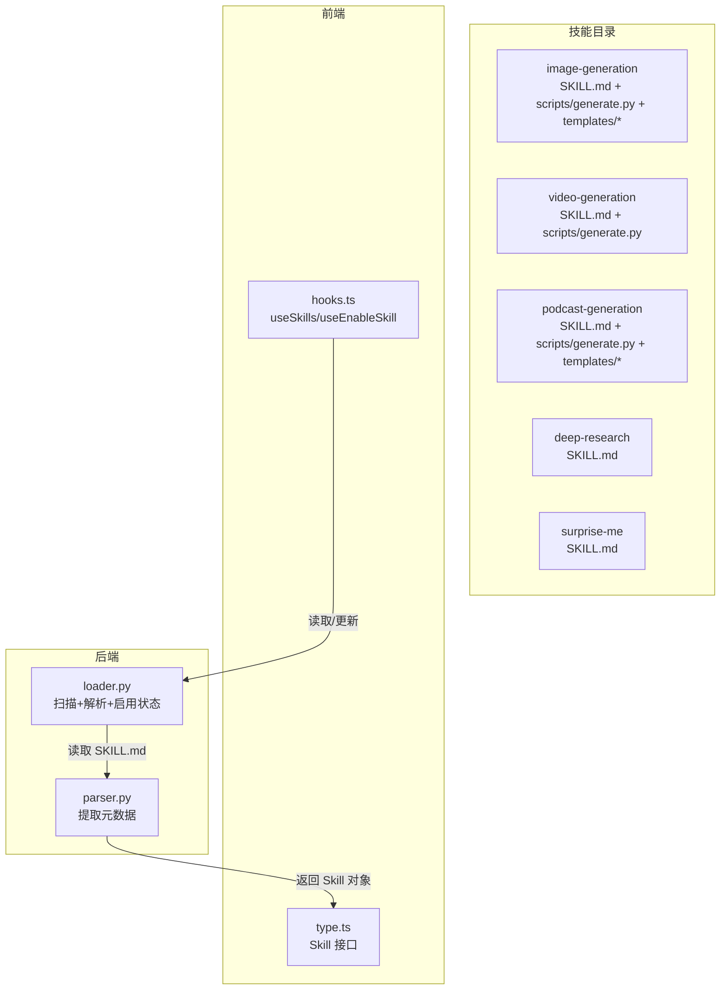
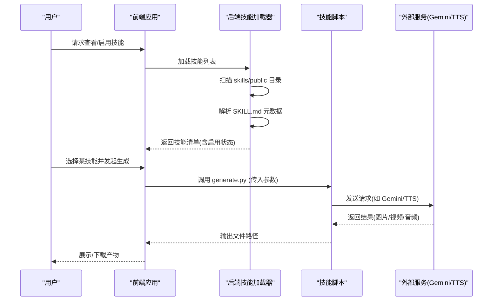
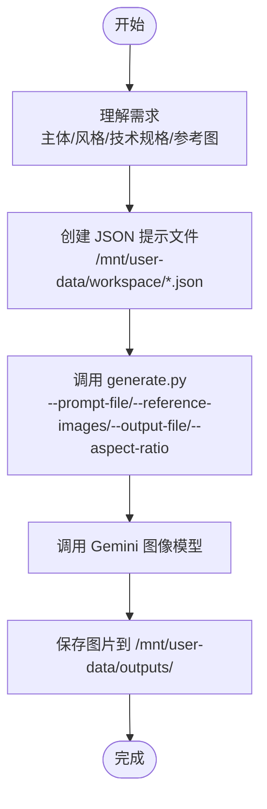
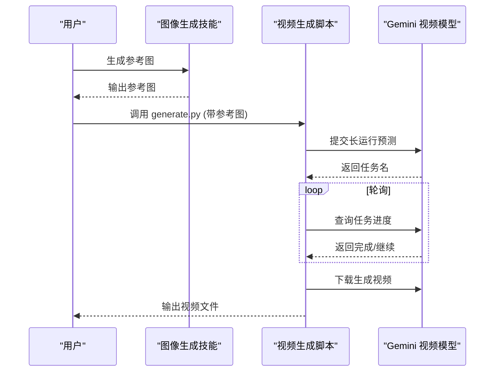
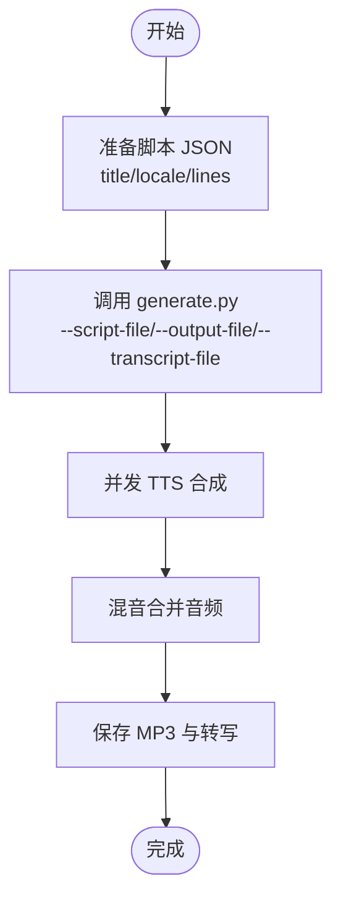
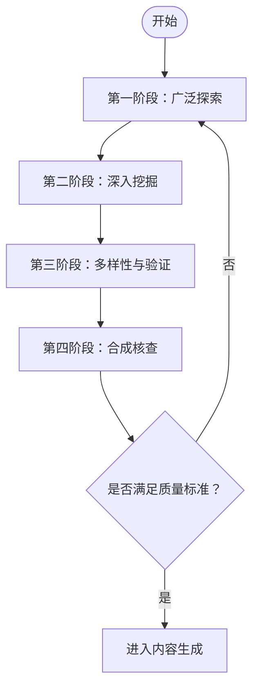
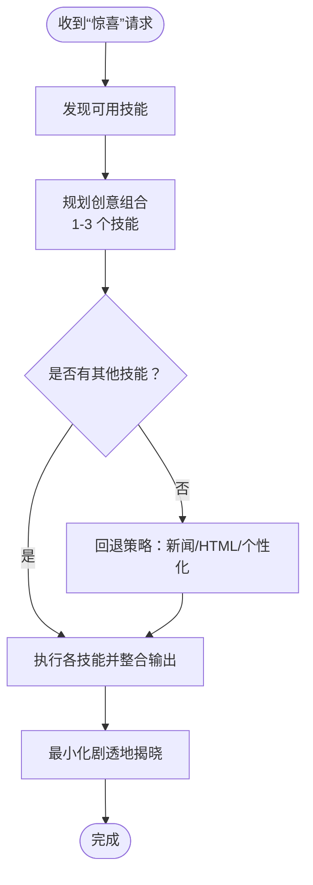
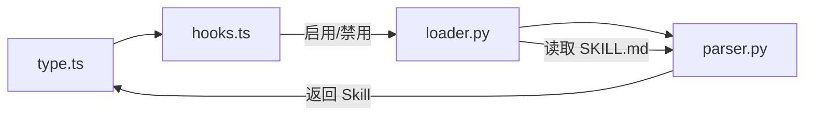

# 其他专业技能

<cite>
**本文引用的文件**
- [skills\public\image-generation\SKILL.md](file://skills/public/image-generation/SKILL.md)
- [skills\public\image-generation\scripts\generate.py](file://skills/public/image-generation/scripts/generate.py)
- [skills\public\image-generation\templates\doraemon.md](file://skills/public/image-generation/templates/doraemon.md)
- [skills\public\video-generation\SKILL.md](file://skills/public/video-generation/SKILL.md)
- [skills\public\video-generation\scripts\generate.py](file://skills/public/video-generation/scripts/generate.py)
- [skills\public\podcast-generation\SKILL.md](file://skills/public/podcast-generation/SKILL.md)
- [skills\public\podcast-generation\scripts\generate.py](file://skills/public/podcast-generation/scripts/generate.py)
- [skills\public\podcast-generation\templates\tech-explainer.md](file://skills/public/podcast-generation/templates/tech-explainer.md)
- [skills\public\deep-research\SKILL.md](file://skills/public/deep-research/SKILL.md)
- [skills\public\surprise-me\SKILL.md](file://skills/public/surprise-me/SKILL.md)
- [backend\packages\harness\deerflow\skills\loader.py](file://backend/packages/harness/deerflow/skills/loader.py)
- [backend\packages\harness\deerflow\skills\parser.py](file://backend/packages/harness/deerflow/skills/parser.py)
- [frontend\src\core\skills\type.ts](file://frontend/src/core/skills/type.ts)
- [frontend\src\core\skills\hooks.ts](file://frontend/src/core/skills/hooks.ts)
</cite>

## 目录
1. [简介](#简介)
2. [项目结构](#项目结构)
3. [核心组件](#核心组件)
4. [架构总览](#架构总览)
5. [详细组件分析](#详细组件分析)
6. [依赖关系分析](#依赖关系分析)
7. [性能考量](#性能考量)
8. [故障排查指南](#故障排查指南)
9. [结论](#结论)
10. [附录](#附录)

## 简介
本章节面向“其他专业技能”的使用与集成，覆盖以下能力：图像生成、视频生成、播客制作、深度研究与惊喜功能。文档从使用者视角出发，说明各技能的功能特性、适用场景、输入要求、配置项、执行流程与输出质量控制，并提供创意写作与内容优化建议及常见问题解决方案。

## 项目结构
技能以“公共技能”形式组织在 deer-flow/skills/public 下，每个技能包含：
- SKILL.md：技能元信息与使用说明（名称、描述、工作流、参数、示例、注意事项）
- scripts/generate.py：可直接调用的执行脚本（命令行参数驱动）
- templates/*：特定场景的提示模板（如漫画分镜、技术讲解）

前端通过 hooks 与类型定义管理技能列表与启用状态；后端通过 loader/parser 解析技能目录中的 SKILL.md 并加载到运行时。

图表来源
- [backend\packages\harness\deerflow\skills\loader.py:22-99](file://backend/packages/harness/deerflow/skills/loader.py#L22-L99)
- [backend\packages\harness\deerflow\skills\parser.py:7-66](file://backend/packages/harness/deerflow/skills/parser.py#L7-L66)
- [frontend\src\core\skills\type.ts:1-7](file://frontend/src/core/skills/type.ts#L1-L7)
- [frontend\src\core\skills\hooks.ts:1-31](file://frontend/src/core/skills/hooks.ts#L1-L31)

章节来源
- [backend\packages\harness\deerflow\skills\loader.py:8-99](file://backend/packages/harness/deerflow/skills/loader.py#L8-L99)
- [backend\packages\harness\deerflow\skills\parser.py:7-66](file://backend/packages/harness/deerflow/skills/parser.py#L7-L66)
- [frontend\src\core\skills\type.ts:1-7](file://frontend/src/core/skills/type.ts#L1-L7)
- [frontend\src\core\skills\hooks.ts:1-31](file://frontend/src/core/skills/hooks.ts#L1-L31)

## 核心组件
- 图像生成（image-generation）：基于结构化 JSON 提示与参考图，调用 Gemini API 生成图片，支持多参考图与指定宽高比。
- 视频生成（video-generation）：基于结构化 JSON 提示与参考图，调用长运行预测接口生成视频，自动轮询结果并下载。
- 播客制作（podcast-generation）：将结构化脚本 JSON 转换为双主持对话式音频，内置并发 TTS 与混音，支持英文/中文与可选转写。
- 深度研究（deep-research）：系统化网络研究方法论，强调多角度、深挖、多样性与验证，前置用于高质量内容生产。
- 惊喜功能（surprise-me）：动态组合可用技能，产出令人耳目一新的单一交付物，或回退到新闻可视化/交互体验/个性化产物。

章节来源
- [skills\public\image-generation\SKILL.md:1-188](file://skills/public/image-generation/SKILL.md#L1-L188)
- [skills\public\video-generation\SKILL.md:1-140](file://skills/public/video-generation/SKILL.md#L1-L140)
- [skills\public\podcast-generation\SKILL.md:1-186](file://skills/public/podcast-generation/SKILL.md#L1-L186)
- [skills\public\deep-research\SKILL.md:1-199](file://skills/public/deep-research/SKILL.md#L1-L199)
- [skills\public\surprise-me\SKILL.md:1-54](file://skills/public/surprise-me/SKILL.md#L1-L54)

## 架构总览
下图展示技能系统在前端、后端与外部服务之间的交互关系。

图表来源
- [backend\packages\harness\deerflow\skills\loader.py:22-99](file://backend/packages/harness/deerflow/skills/loader.py#L22-L99)
- [backend\packages\harness\deerflow\skills\parser.py:7-66](file://backend/packages/harness/deerflow/skills/parser.py#L7-L66)
- [skills\public\image-generation\scripts\generate.py:65-91](file://skills/public/image-generation/scripts/generate.py#L65-L91)
- [skills\public\video-generation\scripts\generate.py:33-60](file://skills/public/video-generation/scripts/generate.py#L33-L60)
- [skills\public\podcast-generation\scripts\generate.py:42-99](file://skills/public/podcast-generation/scripts/generate.py#L42-L99)

## 详细组件分析

### 图像生成（image-generation）
- 功能特性
  - 结构化 JSON 提示：支持角色、场景、产品等多场景提示字段
  - 参考图增强：可传入 0 至多张参考图，提升风格/构图一致性
  - 宽高比控制：默认 16:9，可按需调整
  - 输出位置：统一保存至 /mnt/user-data/outputs/
- 适用场景
  - 角色设计、街拍人像、产品展示、插画/漫画分镜
- 使用方法
  - 步骤 1：理解需求（主体、风格、技术规格、参考图）
  - 步骤 2：在 /mnt/user-data/workspace/ 创建 JSON 提示文件
  - 步骤 3：调用 generate.py，传入 --prompt-file、--reference-images、--output-file、--aspect-ratio
- 输入要求
  - 必填：--prompt-file（绝对路径）
  - 可选：--reference-images（多图空格分隔）、--output-file、--aspect-ratio
- 输出质量控制
  - 建议先用 image_search 工具寻找参考图，再调用脚本
  - 迭代优化：根据初稿微调提示词与参考图
- 实际案例
  - 东京街头 1990 年代女性角色：提供角色属性、风格、构图、灯光、色彩等 JSON 提示，必要时附加参考图
  - 星战风格场景：结合人物与载具参考图，生成符合设定的场景图
- 创意写作技巧
  - 将复杂场景拆解为环境、时间、氛围、焦点等维度
  - 使用电影摄影术语提升画面质感描述
- 内容优化建议
  - 避免过度饱和与人工感，偏向胶片质感与自然光
  - 保持提示词简洁明确，突出关键特征
- 常见问题
  - GEMINI_API_KEY 未设置：脚本报错提示，请检查环境变量
  - 参考图损坏：脚本会跳过无效图片并提示数量差异
  - 输出尺寸不符：确认 --aspect-ratio 设置是否与预期一致

图表来源
- [skills\public\image-generation\SKILL.md:19-54](file://skills/public/image-generation/SKILL.md#L19-L54)
- [skills\public\image-generation\scripts\generate.py:30-91](file://skills/public/image-generation/scripts/generate.py#L30-L91)

章节来源
- [skills\public\image-generation\SKILL.md:1-188](file://skills/public/image-generation/SKILL.md#L1-L188)
- [skills\public\image-generation\scripts\generate.py:1-133](file://skills/public/image-generation/scripts/generate.py#L1-L133)
- [skills\public\image-generation\templates\doraemon.md:1-113](file://skills/public/image-generation/templates/doraemon.md#L1-L113)

### 视频生成（video-generation）
- 功能特性
  - 结构化 JSON 提示：背景、角色、镜头运动、对白、音效等
  - 参考图引导：可选单张参考图作为首帧/引导帧
  - 自动轮询：长运行任务完成后自动下载视频
- 适用场景
  - 短视频开场、剧情片段重现、动画预演
- 使用方法
  - 步骤 1：理解需求（主题、风格、技术规格、参考图）
  - 步骤 2：创建 JSON 提示文件
  - 步骤 3：可选使用图像生成技能产出参考图
  - 步骤 4：调用 generate.py，传入 --prompt-file、--reference-images、--output-file、--aspect-ratio
- 输入要求
  - 必填：--prompt-file、--output-file
  - 可选：--reference-images、--aspect-ratio
- 输出质量控制
  - 参考图有助于稳定视觉风格与构图
  - 视频生成为长运行任务，注意等待与重试策略
- 实际案例
  - 《纳尼亚传奇》火车站告别场景：先搜索参考图，再生成参考图，最后生成视频
- 创意写作技巧
  - 用电影语言描述镜头运动与焦点变化
  - 对白与音效配合画面节奏
- 内容优化建议
  - 提示中明确时代背景与地点，增强真实感
  - 控制对白长度，避免过长导致合成不连贯
- 常见问题
  - GEMINI_API_KEY 未设置：请检查环境变量
  - 任务长时间未完成：脚本会轮询进度，可稍后再查

图表来源
- [skills\public\video-generation\SKILL.md:18-123](file://skills/public/video-generation/SKILL.md#L18-L123)
- [skills\public\video-generation\scripts\generate.py:8-60](file://skills/public/video-generation/scripts/generate.py#L8-L60)

章节来源
- [skills\public\video-generation\SKILL.md:1-140](file://skills/public/video-generation/SKILL.md#L1-L140)
- [skills\public\video-generation\scripts\generate.py:1-117](file://skills/public/video-generation/scripts/generate.py#L1-L117)

### 播客制作（podcast-generation）
- 功能特性
  - 结构化脚本 JSON：双主持（男/女）交替对话
  - 多线程 TTS：并发合成音频片段，再混音输出
  - 可选转写：生成可读 Markdown 脚本
  - 支持语言：英文 en / 中文 zh
- 适用场景
  - 技术讲解、知识分享、播客节目
- 使用方法
  - 步骤 1：理解需求（源内容、语言、输出位置）
  - 步骤 2：创建脚本 JSON 文件（包含 title、locale、lines）
  - 步骤 3：调用 generate.py，传入 --script-file、--output-file、--transcript-file
- 输入要求
  - 必填：--script-file、--output-file
  - 可选：--transcript-file
  - 环境变量：VOLCENGINE_TTS_APPID、VOLCENGINE_TTS_ACCESS_TOKEN、VOLCENGINE_TTS_CLUSTER（可选）
- 输出质量控制
  - 严格遵循脚本格式，确保 lines 数组非空
  - 优先生成转写，便于校对与迭代
- 实际案例
  - 人工智能历史：创建标题、语言与对话段落，生成播客与转写
- 创意写作技巧
  - 采用“你好 Deer”开场，营造亲切感
  - 用口语化表达替代公式/代码，提升可听性
- 内容优化建议
  - 控制每句长度，避免过长导致 TTS 吞字
  - 交替自然，避免单人独白过长
- 常见问题
  - 缺少 TTS 凭据：请设置 VOLCENGINE_TTS_* 环境变量
  - 脚本为空：确保 lines 包含至少一条记录
  - 全部失败：检查网络与凭据，重试生成

图表来源
- [skills\public\podcast-generation\SKILL.md:20-66](file://skills/public/podcast-generation/SKILL.md#L20-L66)
- [skills\public\podcast-generation\scripts\generate.py:204-251](file://skills/public/podcast-generation/scripts/generate.py#L204-L251)

章节来源
- [skills\public\podcast-generation\SKILL.md:1-186](file://skills/public/podcast-generation/SKILL.md#L1-L186)
- [skills\public\podcast-generation\scripts\generate.py:1-285](file://skills/public/podcast-generation/scripts/generate.py#L1-L285)
- [skills\public\podcast-generation\templates\tech-explainer.md:1-64](file://skills/public/podcast-generation/templates/tech-explainer.md#L1-L64)

### 深度研究（deep-research）
- 核心原则
  - 不要仅凭通用知识生成内容；必须通过系统化研究获得足够且权威的信息
- 方法论
  - 第一阶段：广泛探索（初始搜索、识别维度、地图化视角）
  - 第二阶段：深入挖掘（精准查询、多表述尝试、全文抓取、追踪引用）
  - 第三阶段：多样性与验证（事实/案例/专家/趋势/对比/挑战）
  - 第四阶段：合成核查（多角度覆盖、权威来源、正反面平衡、时效性）
- 何时使用
  - 用户询问“什么是 X”“解释 X”“比较 X 和 Y”
  - 内容生成前的预研（PPT、UI 设计、文章、视频、多媒体）
- 搜索策略要点
  - 具体化上下文、包含权威来源提示、限定内容类型、使用实时日期
  - 在需要“当日/刚发布”时，使用月日年精确匹配
- 常见误区
  - 浅尝辄止、仅看摘要、只看单一面向、忽略矛盾观点、使用过时信息、研究未完成即生成
- 输出期望
  - 多角度理解、具体事实与数据、真实案例、专家观点、当前趋势与相关背景
  - 仅在具备上述条件后，方可进入内容生成阶段

图表来源
- [skills\public\deep-research\SKILL.md:33-106](file://skills/public/deep-research/SKILL.md#L33-L106)

章节来源
- [skills\public\deep-research\SKILL.md:1-199](file://skills/public/deep-research/SKILL.md#L1-L199)

### 惊喜功能（surprise-me）
- 目标
  - 动态发现可用技能，创造性组合，产出令人耳目一新的单一交付物
- 工作流
  - 发现可用技能 → 规划惊喜（1-3 个技能，主题自定）→ 回退策略（无其他技能时的备选）→ 执行并整合 → 揭晓
- 创意组合原则
  - 出其不意的技能拼接（如算法艺术展、研究报告转幻灯、数据+设计的艺术品）
  - 结合用户兴趣/上下文（若存在记忆）
  - 注重视觉冲击与情感愉悦
- 回退策略
  - 新闻可视化：抓取当日新闻，设计 HTML 展示
  - 交互式 HTML：生成生成艺术、小游戏、动画信息图、互动故事
  - 个性化产物：利用已知用户上下文创造专属惊喜
- 揭晓技巧
  - 最小化剧透，先抛出短 teaser，再呈现完整作品

图表来源
- [skills\public\surprise-me\SKILL.md:10-54](file://skills/public/surprise-me/SKILL.md#L10-L54)

章节来源
- [skills\public\surprise-me\SKILL.md:1-54](file://skills/public/surprise-me/SKILL.md#L1-L54)

## 依赖关系分析
- 前端依赖
  - type.ts 定义 Skill 接口，hooks.ts 提供技能列表与启用/禁用的变更机制
- 后端依赖
  - loader.py 扫描 skills/public 与 skills/custom，解析 SKILL.md，读取扩展配置决定启用状态
  - parser.py 从 YAML Front Matter 提取元数据，构建 Skill 对象
- 外部依赖
  - 图像/视频生成依赖 Gemini API（需设置 GEMINI_API_KEY）
  - 播客制作依赖火山引擎 TTS（需设置 VOLCENGINE_TTS_* 环境变量）

图表来源
- [frontend\src\core\skills\type.ts:1-7](file://frontend/src/core/skills/type.ts#L1-L7)
- [frontend\src\core\skills\hooks.ts:1-31](file://frontend/src/core/skills/hooks.ts#L1-L31)
- [backend\packages\harness\deerflow\skills\loader.py:22-99](file://backend/packages/harness/deerflow/skills/loader.py#L22-L99)
- [backend\packages\harness\deerflow\skills\parser.py:7-66](file://backend/packages/harness/deerflow/skills/parser.py#L7-L66)

章节来源
- [frontend\src\core\skills\type.ts:1-7](file://frontend/src/core/skills/type.ts#L1-L7)
- [frontend\src\core\skills\hooks.ts:1-31](file://frontend/src/core/skills/hooks.ts#L1-L31)
- [backend\packages\harness\deerflow\skills\loader.py:22-99](file://backend/packages/harness/deerflow/skills/loader.py#L22-L99)
- [backend\packages\harness\deerflow\skills\parser.py:7-66](file://backend/packages/harness/deerflow/skills/parser.py#L7-L66)

## 性能考量
- 图像/视频生成
  - 参考图数量与质量直接影响生成稳定性与速度，建议控制在合理范围并提前校验有效性
  - 宽高比与分辨率影响生成时长，建议按需设置
- 播客制作
  - 并发 TTS 可显著缩短总时长，但受网络与服务限流影响，建议在稳定环境下批量执行
  - 音频混音为纯内存操作，注意大体量时的内存占用
- 深度研究
  - 搜索与抓取应遵循“迭代细化”，避免一次性大量请求导致超时或封禁
- 惊喜功能
  - 组合多个技能可能带来较长执行时间，建议在用户同意的情况下异步执行并提供进度反馈

## 故障排查指南
- 环境变量缺失
  - 图像/视频：GEMINI_API_KEY 未设置
  - 播客：VOLCENGINE_TTS_APPID/VOLCENGINE_TTS_ACCESS_TOKEN 未设置
- 参考图问题
  - 图片损坏或无法打开：脚本会跳过并提示数量差异
- 输出异常
  - 图像/视频未生成：检查任务状态与网络，必要时重试
  - 播客为空：确认脚本 JSON 的 lines 字段非空
- 技能不可用
  - 检查后端是否正确解析 SKILL.md，以及扩展配置是否启用该技能
- 交互体验
  - 前端可通过 hooks.ts 的 mutation 更新技能启用状态，并即时刷新列表

章节来源
- [skills\public\image-generation\scripts\generate.py:65-91](file://skills/public/image-generation/scripts/generate.py#L65-L91)
- [skills\public\video-generation\scripts\generate.py:33-60](file://skills/public/video-generation/scripts/generate.py#L33-L60)
- [skills\public\podcast-generation\scripts\generate.py:42-99](file://skills/public/podcast-generation/scripts/generate.py#L42-L99)
- [backend\packages\harness\deerflow\skills\loader.py:76-98](file://backend/packages/harness/deerflow/skills/loader.py#L76-L98)
- [frontend\src\core\skills\hooks.ts:15-31](file://frontend/src/core/skills/hooks.ts#L15-L31)

## 结论
“其他专业技能”围绕内容生产的五大环节展开：高质量素材（图像/视频）、声音内容（播客）、系统化信息（深度研究）与创意组合（惊喜）。通过规范化的输入、严谨的流程与质量控制，可在保证效率的同时提升创意产出的深度与美感。建议在内容生成前优先进行深度研究，并结合参考素材与模板，以获得更稳定、更可控的结果。

## 附录
- 技能启用/禁用
  - 前端通过 useEnableSkill 变更技能启用状态，后端通过扩展配置文件持久化
- 模板与示例
  - 图像生成提供漫画分镜模板，播客提供技术讲解模板，便于快速上手
- 最佳实践
  - 以“先研究、后生成”的原则贯穿全流程
  - 使用参考图与结构化提示提升一致性与可复现性
  - 保留转写与中间产物，便于迭代优化