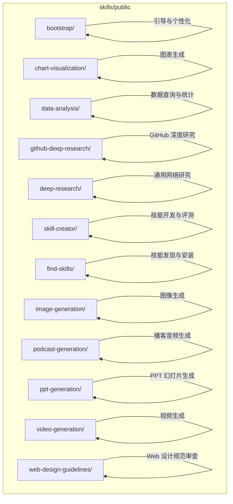
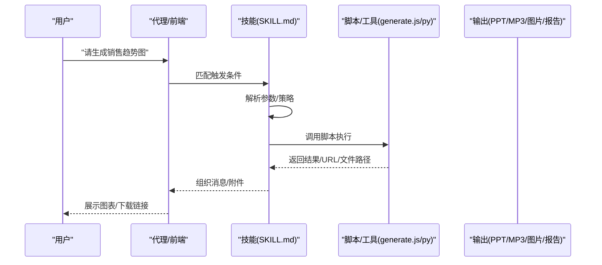
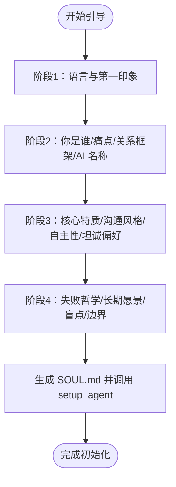
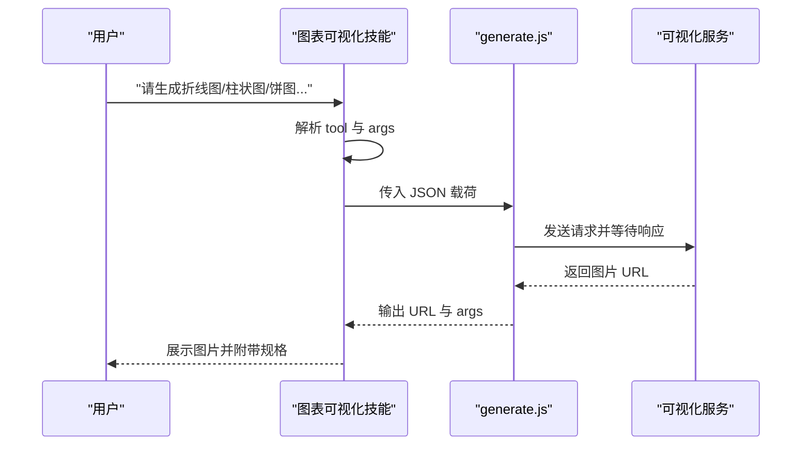
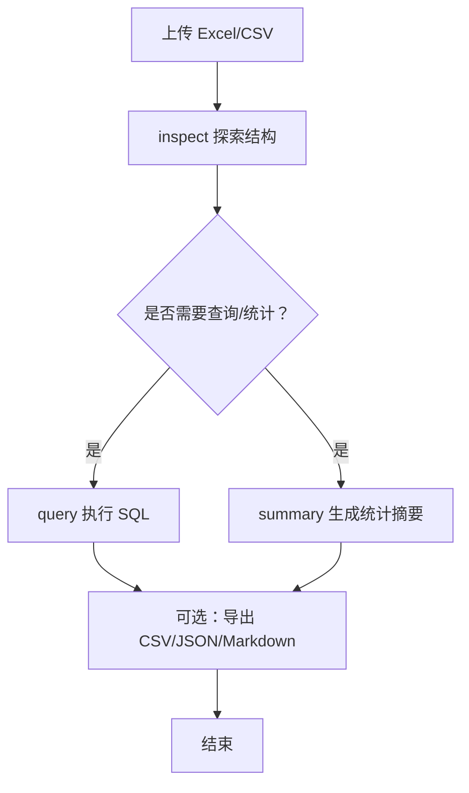
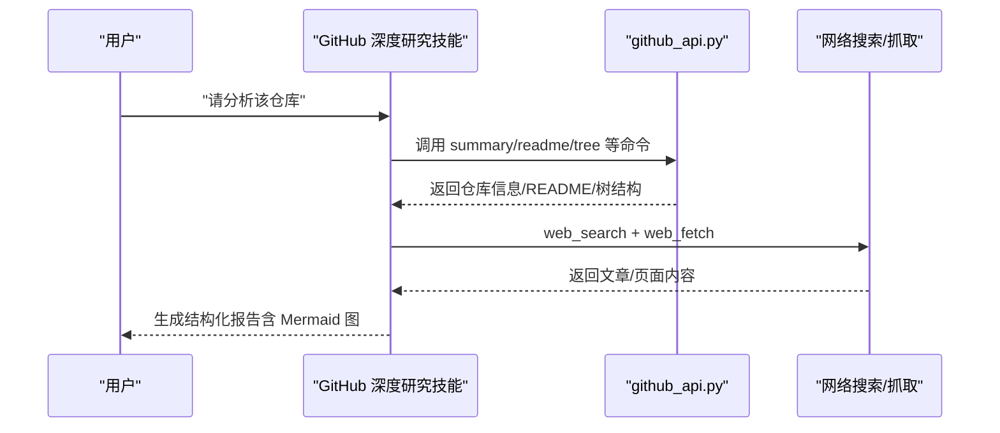
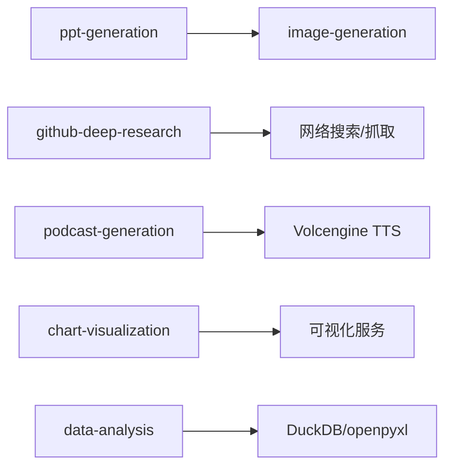

# 内置技能

<cite>
**本文引用的文件**
- [bootstrap/SKILL.md](file://skills/public/bootstrap/SKILL.md)
- [chart-visualization/SKILL.md](file://skills/public/chart-visualization/SKILL.md)
- [chart-visualization/scripts/generate.js](file://skills/public/chart-visualization/scripts/generate.js)
- [data-analysis/SKILL.md](file://skills/public/data-analysis/SKILL.md)
- [data-analysis/scripts/analyze.py](file://skills/public/data-analysis/scripts/analyze.py)
- [github-deep-research/SKILL.md](file://skills/public/github-deep-research/SKILL.md)
- [github-deep-research/scripts/github_api.py](file://skills/public/github-deep-research/scripts/github_api.py)
- [deep-research/SKILL.md](file://skills/public/deep-research/SKILL.md)
- [skill-creator/SKILL.md](file://skills/public/skill-creator/SKILL.md)
- [find-skills/SKILL.md](file://skills/public/find-skills/SKILL.md)
- [image-generation/SKILL.md](file://skills/public/image-generation/SKILL.md)
- [image-generation/scripts/generate.py](file://skills/public/image-generation/scripts/generate.py)
- [podcast-generation/SKILL.md](file://skills/public/podcast-generation/SKILL.md)
- [podcast-generation/scripts/generate.py](file://skills/public/podcast-generation/scripts/generate.py)
- [ppt-generation/SKILL.md](file://skills/public/ppt-generation/SKILL.md)
- [ppt-generation/scripts/generate.py](file://skills/public/ppt-generation/scripts/generate.py)
- [video-generation/SKILL.md](file://skills/public/video-generation/SKILL.md)
- [web-design-guidelines/SKILL.md](file://skills/public/web-design-guidelines/SKILL.md)
</cite>

## 目录
1. [简介](#简介)
2. [项目结构](#项目结构)
3. [核心组件](#核心组件)
4. [架构总览](#架构总览)
5. [详细组件分析](#详细组件分析)
6. [依赖关系分析](#依赖关系分析)
7. [性能考虑](#性能考虑)
8. [故障排查指南](#故障排查指南)
9. [结论](#结论)
10. [附录](#附录)

## 简介
本文件面向 DeerFlow 内置技能的使用者与维护者，系统性梳理仓库中已实现的内置技能，覆盖引导类、可视化图表、数据分析、深度研究、多媒体生成、演示文稿、视频生成、Web 设计规范审查等能力。文档从“技能目标与适用场景”“输入参数与输出格式”“执行流程与关键步骤”“组合使用与工作流”“性能优化与常见问题”五个维度展开，帮助用户高效选择与组合技能，稳定产出高质量结果。

## 项目结构
内置技能集中于 skills/public 目录下，每个技能以独立子目录组织，包含：
- SKILL.md：技能说明、触发条件、工作流、参数与示例
- scripts/：可执行的辅助脚本（如 generate.js、generate.py）
- references/：参考材料（图表类型说明、模板等）
- assets/：报告模板、图标等资源文件

图示来源
- [bootstrap/SKILL.md](file://skills/public/bootstrap/SKILL.md)
- [chart-visualization/SKILL.md](file://skills/public/chart-visualization/SKILL.md)
- [data-analysis/SKILL.md](file://skills/public/data-analysis/SKILL.md)
- [github-deep-research/SKILL.md](file://skills/public/github-deep-research/SKILL.md)
- [deep-research/SKILL.md](file://skills/public/deep-research/SKILL.md)
- [skill-creator/SKILL.md](file://skills/public/skill-creator/SKILL.md)
- [find-skills/SKILL.md](file://skills/public/find-skills/SKILL.md)
- [image-generation/SKILL.md](file://skills/public/image-generation/SKILL.md)
- [podcast-generation/SKILL.md](file://skills/public/podcast-generation/SKILL.md)
- [ppt-generation/SKILL.md](file://skills/public/ppt-generation/SKILL.md)
- [video-generation/SKILL.md](file://skills/public/video-generation/SKILL.md)
- [web-design-guidelines/SKILL.md](file://skills/public/web-design-guidelines/SKILL.md)

章节来源
- [bootstrap/SKILL.md](file://skills/public/bootstrap/SKILL.md)
- [chart-visualization/SKILL.md](file://skills/public/chart-visualization/SKILL.md)
- [data-analysis/SKILL.md](file://skills/public/data-analysis/SKILL.md)
- [github-deep-research/SKILL.md](file://skills/public/github-deep-research/SKILL.md)
- [deep-research/SKILL.md](file://skills/public/deep-research/SKILL.md)
- [skill-creator/SKILL.md](file://skills/public/skill-creator/SKILL.md)
- [find-skills/SKILL.md](file://skills/public/find-skills/SKILL.md)
- [image-generation/SKILL.md](file://skills/public/image-generation/SKILL.md)
- [podcast-generation/SKILL.md](file://skills/public/podcast-generation/SKILL.md)
- [ppt-generation/SKILL.md](file://skills/public/ppt-generation/SKILL.md)
- [video-generation/SKILL.md](file://skills/public/video-generation/SKILL.md)
- [web-design-guidelines/SKILL.md](file://skills/public/web-design-guidelines/SKILL.md)

## 核心组件
- 引导技能（bootstrap）：通过多轮对话抽取用户身份、需求与偏好，生成 SOUL.md 并调用 setup_agent 完成智能体初始化。
- 图表可视化（chart-visualization）：根据数据特征自动选择图表类型，解析参数并调用 generate.js 生成图片链接。
- 数据分析（data-analysis）：基于 DuckDB 对 Excel/CSV 执行结构化查询、统计摘要与结果导出，支持缓存加速。
- GitHub 深度研究（github-deep-research）：结合 GitHub API、网络搜索与网页抓取，按阶段产出结构化报告。
- 深度研究（deep-research）：提供系统化多角度研究方法论，指导内容生成前的信息收集。
- 技能创建器（skill-creator）：支持从零到一创建技能、迭代优化、评测对比与描述优化。
- 技能发现（find-skills）：帮助用户在开放生态中搜索、安装与扩展技能。
- 图像生成（image-generation）：通过结构化 JSON 提示与参考图生成高质量图像。
- 播客生成（podcast-generation）：将文本脚本转换为双主持人的自然对话式播客音频与可读转录。
- PPT 生成（ppt-generation）：按统一视觉风格生成幻灯片并合成 PPTX 文件。
- 视频生成（video-generation）：基于结构化提示与参考帧生成视频片段。
- Web 设计规范（web-design-guidelines）：对 UI 代码进行最佳实践合规性审查。

章节来源
- [bootstrap/SKILL.md](file://skills/public/bootstrap/SKILL.md)
- [chart-visualization/SKILL.md](file://skills/public/chart-visualization/SKILL.md)
- [data-analysis/SKILL.md](file://skills/public/data-analysis/SKILL.md)
- [github-deep-research/SKILL.md](file://skills/public/github-deep-research/SKILL.md)
- [deep-research/SKILL.md](file://skills/public/deep-research/SKILL.md)
- [skill-creator/SKILL.md](file://skills/public/skill-creator/SKILL.md)
- [find-skills/SKILL.md](file://skills/public/find-skills/SKILL.md)
- [image-generation/SKILL.md](file://skills/public/image-generation/SKILL.md)
- [podcast-generation/SKILL.md](file://skills/public/podcast-generation/SKILL.md)
- [ppt-generation/SKILL.md](file://skills/public/ppt-generation/SKILL.md)
- [video-generation/SKILL.md](file://skills/public/video-generation/SKILL.md)
- [web-design-guidelines/SKILL.md](file://skills/public/web-design-guidelines/SKILL.md)

## 架构总览
内置技能围绕“意图识别—技能触发—参数解析—工具执行—结果呈现”的闭环工作流运行。前端或代理根据用户请求判断是否满足某技能的触发条件；技能加载其 SKILL.md 与必要资源后，调用对应脚本完成计算或外部服务请求，并通过工具链返回结果给用户。

图示来源
- [chart-visualization/SKILL.md](file://skills/public/chart-visualization/SKILL.md)
- [chart-visualization/scripts/generate.js](file://skills/public/chart-visualization/scripts/generate.js)
- [data-analysis/SKILL.md](file://skills/public/data-analysis/SKILL.md)
- [data-analysis/scripts/analyze.py](file://skills/public/data-analysis/scripts/analyze.py)
- [github-deep-research/SKILL.md](file://skills/public/github-deep-research/SKILL.md)
- [github-deep-research/scripts/github_api.py](file://skills/public/github-deep-research/scripts/github_api.py)
- [image-generation/SKILL.md](file://skills/public/image-generation/SKILL.md)
- [image-generation/scripts/generate.py](file://skills/public/image-generation/scripts/generate.py)
- [podcast-generation/SKILL.md](file://skills/public/podcast-generation/SKILL.md)
- [podcast-generation/scripts/generate.py](file://skills/public/podcast-generation/scripts/generate.py)
- [ppt-generation/SKILL.md](file://skills/public/ppt-generation/SKILL.md)
- [ppt-generation/scripts/generate.py](file://skills/public/ppt-generation/scripts/generate.py)
- [video-generation/SKILL.md](file://skills/public/video-generation/SKILL.md)
- [web-design-guidelines/SKILL.md](file://skills/public/web-design-guidelines/SKILL.md)

## 详细组件分析

### 引导技能（bootstrap）
- 适用场景
  - 首次使用需要建立 AI 合伙人身份与人格设定
  - 更新现有 SOUL.md 或调整 AI 的行为边界
- 输入参数
  - 无固定 CLI 参数；通过多轮对话抽取信息
- 输出结果
  - 结构化的 SOUL.md 文档；随后调用 setup_agent 工具完成持久化
- 关键流程
  - 分阶段对话（问候、自我认知、个性、深度），逐步提取字段
  - 严格遵循生成规则（英文输出、可追溯性、密度优先、必须调用工具）
- 使用建议
  - 在首次启动或更换角色时优先使用，确保后续交互一致性

图示来源
- [bootstrap/SKILL.md](file://skills/public/bootstrap/SKILL.md)

章节来源
- [bootstrap/SKILL.md](file://skills/public/bootstrap/SKILL.md)

### 图表可视化技能（chart-visualization）
- 适用场景
  - 用户上传数据后要求生成可视化图表，支持多种图表类型与主题
- 输入参数
  - tool：图表类型（如 generate_line_chart 等）
  - args：包含 data、title、theme、style 等字段
- 输出结果
  - 图表图片 URL；完整 args 规格
- 关键流程
  - 基于数据特征选择图表类型
  - 读取对应参考文件确定参数
  - 调用 generate.js 生成并返回 URL
- 使用建议
  - 明确数据结构与业务语义，避免过度复杂；优先选择“时间序列/比较/部分-整体/关系/地图/层级/专业图表”等分类下的合适类型

图示来源
- [chart-visualization/SKILL.md](file://skills/public/chart-visualization/SKILL.md)
- [chart-visualization/scripts/generate.js](file://skills/public/chart-visualization/scripts/generate.js)

章节来源
- [chart-visualization/SKILL.md](file://skills/public/chart-visualization/SKILL.md)
- [chart-visualization/scripts/generate.js](file://skills/public/chart-visualization/scripts/generate.js)

### 数据分析技能（data-analysis）
- 适用场景
  - 对 Excel/CSV 进行结构化探索、SQL 查询、统计摘要与结果导出
- 输入参数
  - --files：文件路径列表
  - --action：inspect/query/summary
  - --sql/--table/--output-file：按需提供
- 输出结果
  - 控制台表格/统计摘要/导出文件（CSV/JSON/Markdown）
- 关键流程
  - 计算文件哈希作为缓存键，首次加载持久化 DuckDB 数据库
  - 支持跨文件联接与复杂 SQL（含窗口函数、CTE、子查询）
- 使用建议
  - 先 inspect 探索结构，再 query 与 summary，最后导出结果
  - 大文件建议分步查询并导出，避免一次性处理

图示来源
- [data-analysis/SKILL.md](file://skills/public/data-analysis/SKILL.md)
- [data-analysis/scripts/analyze.py](file://skills/public/data-analysis/scripts/analyze.py)

章节来源
- [data-analysis/SKILL.md](file://skills/public/data-analysis/SKILL.md)
- [data-analysis/scripts/analyze.py](file://skills/public/data-analysis/scripts/analyze.py)

### GitHub 深度研究技能（github-deep-research）
- 适用场景
  - 对任意 GitHub 仓库进行多轮深度研究，生成结构化报告（含时间线、架构图、对比分析）
- 输入参数
  - owner/repo：仓库标识
  - 命令：summary/info/readme/tree/languages/contributors/commits/issues/prs/releases
- 输出结果
  - 结构化报告（Markdown），包含元数据、摘要、时间线、分析章节、指标与来源
- 关键流程
  - Round 1：GitHub API 直取仓库信息、README、树形结构
  - Round 2：概览与关键词发现
  - Round 3：技术细节、事件时间线、社区情绪
  - Round 4：提交历史、议题/PR、贡献者活动
- 使用建议
  - 优先使用官方文档与仓库信息，交叉验证来源质量，标注内联引用

图示来源
- [github-deep-research/SKILL.md](file://skills/public/github-deep-research/SKILL.md)
- [github-deep-research/scripts/github_api.py](file://skills/public/github-deep-research/scripts/github_api.py)

章节来源
- [github-deep-research/SKILL.md](file://skills/public/github-deep-research/SKILL.md)
- [github-deep-research/scripts/github_api.py](file://skills/public/github-deep-research/scripts/github_api.py)

### 深度研究技能（deep-research）
- 适用场景
  - 任何需要综合信息与多角度验证的问题；在内容生成前进行充分研究
- 输入参数
  - 无固定 CLI 参数；通过多轮搜索与抓取完成信息收集
- 输出结果
  - 全面的研究成果（事实、案例、专家观点、趋势、挑战/局限）
- 关键流程
  - 广度探索 → 深度挖掘 → 多样性与验证 → 合成检查
  - 使用 temporal awareness 与有效查询模式提升时效性
- 使用建议
  - 在生成文章、设计、报告前先加载此技能，确保信息权威、全面且可溯源

章节来源
- [deep-research/SKILL.md](file://skills/public/deep-research/SKILL.md)

### 技能创建器（skill-creator）
- 适用场景
  - 创建新技能、改进现有技能、评测与基准分析、优化触发描述
- 输入参数
  - 测试集、断言、迭代工作区、基准聚合、评测查看器
- 输出结果
  - 可复用的 .skill 包装文件、评测报告、对比分析
- 关键流程
  - 草案 → 测试 → 评审 → 改进 → 扩大规模 → 打包发布
  - 支持量化评测与可视化评审
- 使用建议
  - 采用并行子代理对比 with-skill 与 baseline，保证公平评估

章节来源
- [skill-creator/SKILL.md](file://skills/public/skill-creator/SKILL.md)

### 技能发现（find-skills）
- 适用场景
  - 用户希望扩展能力但不知道具体技能名称或来源
- 输入参数
  - npx skills find [关键词] / check / update
- 输出结果
  - 可安装的技能列表与安装命令
- 使用建议
  - 使用具体关键词（如 react 性能、测试、部署）提高命中率

章节来源
- [find-skills/SKILL.md](file://skills/public/find-skills/SKILL.md)

### 图像生成（image-generation）
- 适用场景
  - 生成角色、场景、产品等视觉内容，支持参考图引导
- 输入参数
  - --prompt-file：结构化 JSON 提示
  - --reference-images：参考图路径（可选）
  - --output-file：输出图像路径
  - --aspect-ratio：宽高比（默认 16:9）
- 输出结果
  - 生成的图像文件；可通过 present_files 工具分享
- 关键流程
  - 读取 JSON 提示，调用 Gemini API 生成图像
  - 可选使用 image_search 获取参考图
- 使用建议
  - 为关键场景使用 image_search 获取参考图，显著提升质量

章节来源
- [image-generation/SKILL.md](file://skills/public/image-generation/SKILL.md)
- [image-generation/scripts/generate.py](file://skills/public/image-generation/scripts/generate.py)

### 播客生成（podcast-generation）
- 适用场景
  - 将文本内容转换为双主持人自然对话式播客音频与可读转录
- 输入参数
  - --script-file：脚本 JSON（包含 locale 与 lines）
  - --output-file：播客 MP3 输出路径
  - --transcript-file：转录 Markdown 输出路径（建议开启）
- 输出结果
  - MP3 音频文件与 Markdown 转录
- 关键流程
  - 语音合成（Volcengine TTS）并多线程拼接
  - 自动校验环境变量与错误日志
- 使用建议
  - 严格遵守脚本 JSON 结构与语言规范，确保可读性与流畅度

章节来源
- [podcast-generation/SKILL.md](file://skills/public/podcast-generation/SKILL.md)
- [podcast-generation/scripts/generate.py](file://skills/public/podcast-generation/scripts/generate.py)

### PPT 生成（ppt-generation）
- 适用场景
  - 生成具有统一视觉风格的专业演示文稿
- 输入参数
  - --plan-file：包含标题、风格、幻灯片计划的 JSON
  - --slide-images：按顺序排列的幻灯片图像路径
  - --output-file：输出 PPTX 路径
- 输出结果
  - PPTX 文件与可选单张幻灯片
- 关键流程
  - 逐张生成并以前一张为参考保持风格一致
  - 读取 plan 中的样式指南与布局约束
- 使用建议
  - 必须按顺序生成，严禁并发；首张奠定风格基调

章节来源
- [ppt-generation/SKILL.md](file://skills/public/ppt-generation/SKILL.md)
- [ppt-generation/scripts/generate.py](file://skills/public/ppt-generation/scripts/generate.py)

### 视频生成（video-generation）
- 适用场景
  - 基于结构化提示与参考帧生成视频片段
- 输入参数
  - --prompt-file：结构化 JSON 提示
  - --reference-images：参考帧（可选）
  - --output-file：输出视频路径
  - --aspect-ratio：宽高比（默认 16:9）
- 输出结果
  - 视频文件与可选参考图像
- 关键流程
  - 可选先用 image-generation 生成参考帧，再调用 generate.py 生成视频
- 使用建议
  - 使用 image-generation 生成高质量参考帧以提升视频一致性

章节来源
- [video-generation/SKILL.md](file://skills/public/video-generation/SKILL.md)

### Web 设计规范（web-design-guidelines）
- 适用场景
  - 审查 UI 代码是否符合 Web Interface Guidelines
- 输入参数
  - 文件或匹配模式（由用户指定）
- 输出结果
  - 违规项清单（file:line 格式）
- 关键流程
  - 动态拉取最新规范 → 读取指定文件 → 应用全部规则 → 输出格式化结果
- 使用建议
  - 若未指定文件，按提示提供文件或模式

章节来源
- [web-design-guidelines/SKILL.md](file://skills/public/web-design-guidelines/SKILL.md)

## 依赖关系分析
- 技能间依赖
  - ppt-generation 依赖 image-generation 的图像生成能力
  - github-deep-research 依赖网络搜索与网页抓取工具
  - podcast-generation 依赖 Volcengine TTS 服务
  - chart-visualization 依赖可视化服务（generate.js）
  - data-analysis 依赖 DuckDB 与 openpyxl
- 外部依赖
  - Node.js（图表可视化）
  - Python 生态（DuckDB、openpyxl、Pillow、python-pptx、requests）
  - 云服务（Gemini API、TTS 服务、可视化服务）

图示来源
- [ppt-generation/SKILL.md](file://skills/public/ppt-generation/SKILL.md)
- [image-generation/SKILL.md](file://skills/public/image-generation/SKILL.md)
- [github-deep-research/SKILL.md](file://skills/public/github-deep-research/SKILL.md)
- [podcast-generation/SKILL.md](file://skills/public/podcast-generation/SKILL.md)
- [chart-visualization/SKILL.md](file://skills/public/chart-visualization/SKILL.md)
- [data-analysis/SKILL.md](file://skills/public/data-analysis/SKILL.md)

章节来源
- [ppt-generation/SKILL.md](file://skills/public/ppt-generation/SKILL.md)
- [image-generation/SKILL.md](file://skills/public/image-generation/SKILL.md)
- [github-deep-research/SKILL.md](file://skills/public/github-deep-research/SKILL.md)
- [podcast-generation/SKILL.md](file://skills/public/podcast-generation/SKILL.md)
- [chart-visualization/SKILL.md](file://skills/public/chart-visualization/SKILL.md)
- [data-analysis/SKILL.md](file://skills/public/data-analysis/SKILL.md)

## 性能考虑
- 缓存与复用
  - data-analysis 使用文件哈希作为缓存键，首次加载后持久化 DuckDB，后续调用直接复用，显著降低重复分析成本
- 串行与一致性
  - ppt-generation 严格按顺序生成幻灯片并以前一张为参考，避免并发导致的风格漂移
- 并行与容错
  - podcast-generation 使用多线程并行 TTS，失败行单独记录并跳过，保证整体进度
- 网络与超时
  - chart-visualization 与 github-deep-research 的外部请求需关注超时与重试策略
- 资源限制
  - 大型图像/视频生成需合理设置宽高比与分辨率，避免内存与磁盘压力过大

## 故障排查指南
- 环境变量缺失
  - podcast-generation：缺少 VOLCENGINE_TTS_APPID/VOLCENGINE_TTS_ACCESS_TOKEN 会报错；请按要求配置
  - image-generation：缺少 GEMINI_API_KEY 会导致生成失败
- 外部服务异常
  - chart-visualization：可视化服务不可达或返回错误时，检查 VIS_REQUEST_SERVER 与 SERVICE_ID
  - github-deep-research：网络不稳定或 GitHub API 限流时，适当增加延时或重试
- 文件路径与权限
  - data-analysis：确保上传文件存在且可读；导出路径需具备写权限
  - ppt-generation：确认每张幻灯片图像存在且可打开
- 输出格式不兼容
  - data-analysis：仅支持 .csv/.json/.md 导出；其他扩展名会被拒绝
  - podcast-generation：脚本 JSON 缺少 lines 字段或环境变量未设置会报错

章节来源
- [podcast-generation/SKILL.md](file://skills/public/podcast-generation/SKILL.md)
- [podcast-generation/scripts/generate.py](file://skills/public/podcast-generation/scripts/generate.py)
- [image-generation/SKILL.md](file://skills/public/image-generation/SKILL.md)
- [image-generation/scripts/generate.py](file://skills/public/image-generation/scripts/generate.py)
- [chart-visualization/SKILL.md](file://skills/public/chart-visualization/SKILL.md)
- [chart-visualization/scripts/generate.js](file://skills/public/chart-visualization/scripts/generate.js)
- [github-deep-research/SKILL.md](file://skills/public/github-deep-research/SKILL.md)
- [github-deep-research/scripts/github_api.py](file://skills/public/github-deep-research/scripts/github_api.py)
- [data-analysis/SKILL.md](file://skills/public/data-analysis/SKILL.md)
- [data-analysis/scripts/analyze.py](file://skills/public/data-analysis/scripts/analyze.py)
- [ppt-generation/SKILL.md](file://skills/public/ppt-generation/SKILL.md)
- [ppt-generation/scripts/generate.py](file://skills/public/ppt-generation/scripts/generate.py)

## 结论
DeerFlow 内置技能体系覆盖从“引导与个性化”到“可视化、分析、研究、生成与展示”的全链路能力。通过明确的触发条件、严谨的参数规范与稳定的脚本执行，用户可以快速构建高质量工作流。建议在内容生成前先进行深度研究与数据分析，在需要统一风格时采用 PPT 生成与图像生成，并借助技能发现与技能创建器持续扩展与优化能力。

## 附录
- 最佳实践清单
  - 先深挖后创作：使用 deep-research 与 github-deep-research 为内容提供权威依据
  - 先分析后可视化：用 data-analysis 探索数据，再用 chart-visualization 生成图表
  - 先画像后生成：用 bootstrap 建立 AI 人格，再用 image-generation/podcast-generation/ppt-generation 等生成内容
  - 保持一致性：PPT 生成严格串行，图像生成使用参考图
  - 可观测与可回溯：保留脚本 JSON、导出中间产物与日志
- 常见组合工作流
  - 数据洞察 → 图表生成 → 报告撰写 → 演示文稿 → 发布
  - 仓库研究 → 结构化报告 → 概念图/时间线 → PPT 汇报
  - 文章素材 → 播客脚本 → 音频生成 → 转录审阅 → 发布