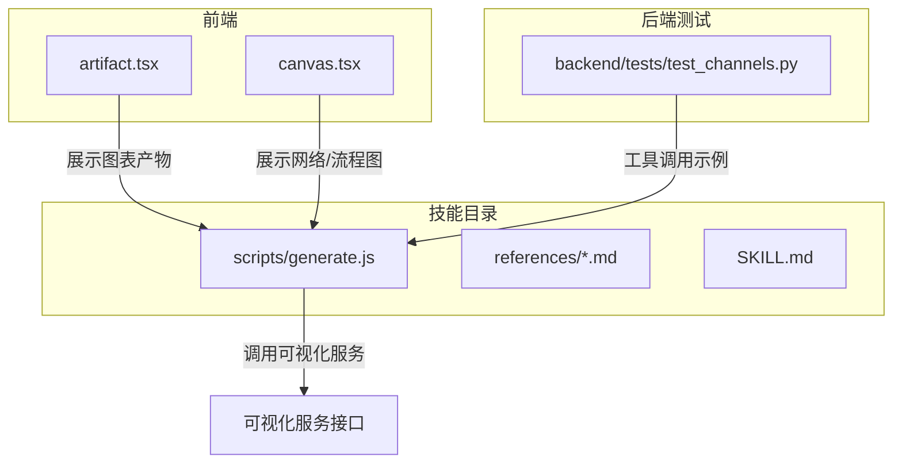
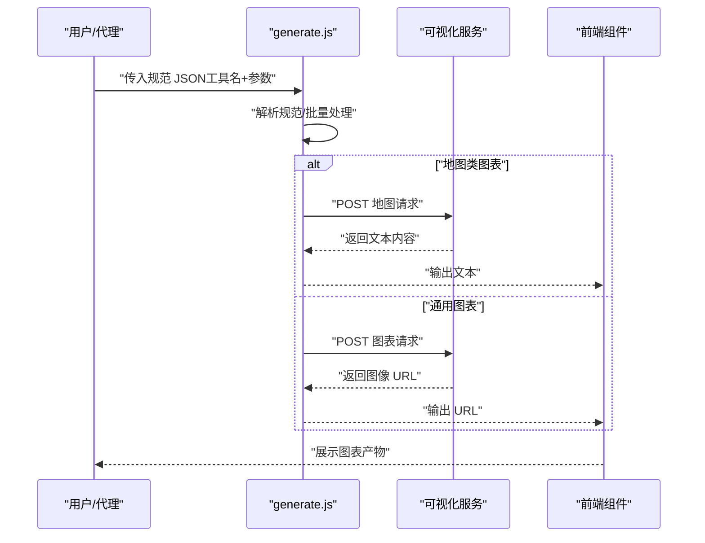
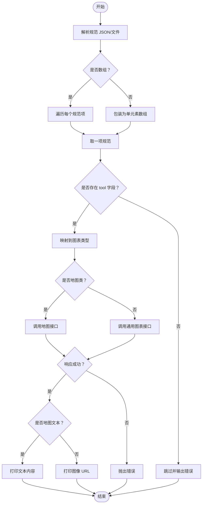
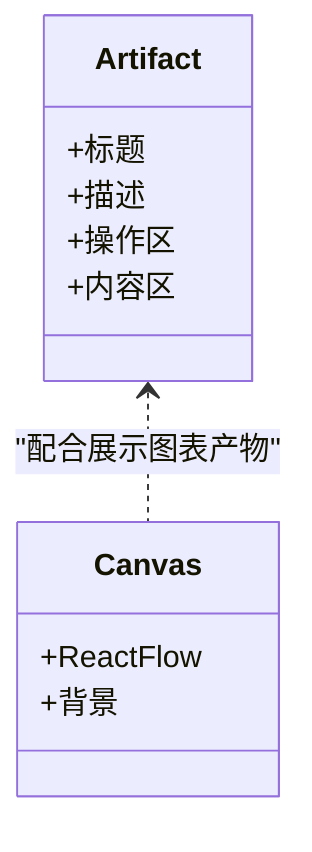
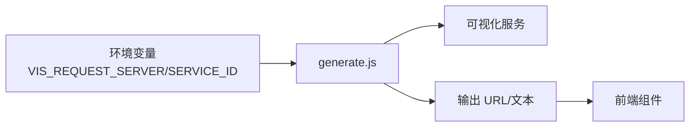

# 图表可视化技能

<cite>
**本文引用的文件**
- [skills/public/chart-visualization/scripts/generate.js](file://skills/public/chart-visualization/scripts/generate.js)
- [skills/public/chart-visualization/SKILL.md](file://skills/public/chart-visualization/SKILL.md)
- [skills/public/chart-visualization/references/generate_pie_chart.md](file://skills/public/chart-visualization/references/generate_pie_chart.md)
- [skills/public/chart-visualization/references/generate_network_graph.md](file://skills/public/chart-visualization/references/generate_network_graph.md)
- [skills/public/chart-visualization/references/generate_line_chart.md](file://skills/public/chart-visualization/references/generate_line_chart.md)
- [skills/public/chart-visualization/references/generate_bar_chart.md](file://skills/public/chart-visualization/references/generate_bar_chart.md)
- [skills/public/chart-visualization/references/generate_histogram_chart.md](file://skills/public/chart-visualization/references/generate_histogram_chart.md)
- [skills/public/chart-visualization/references/generate_sankey_chart.md](file://skills/public/chart-visualization/references/generate_sankey_chart.md)
- [skills/public/chart-visualization/references/generate_venn_chart.md](file://skills/public/chart-visualization/references/generate_venn_chart.md)
- [skills/public/chart-visualization/references/generate_treemap_chart.md](file://skills/public/chart-visualization/references/generate_treemap_chart.md)
- [frontend/src/components/ai-elements/artifact.tsx](file://frontend/src/components/ai-elements/artifact.tsx)
- [frontend/src/components/ai-elements/canvas.tsx](file://frontend/src/components/ai-elements/canvas.tsx)
- [backend/tests/test_channels.py](file://backend/tests/test_channels.py)
</cite>

## 目录
1. [简介](#简介)
2. [项目结构](#项目结构)
3. [核心组件](#核心组件)
4. [架构总览](#架构总览)
5. [详细组件分析](#详细组件分析)
6. [依赖分析](#依赖分析)
7. [性能考虑](#性能考虑)
8. [故障排查指南](#故障排查指南)
9. [结论](#结论)
10. [附录](#附录)

## 简介
本技能提供从数据到图表图像的自动化生成能力，覆盖饼图、柱状图、折线图、网络图、桑基图、维恩图、直方图、矩形树图等多种图表类型。其工作流程包括：智能图表类型选择、参数提取与校验、调用可视化服务生成图表图像链接，并在前端以可交互方式呈现。技能通过 Node.js 脚本与可视化服务进行通信，支持主题、样式、尺寸等定制化选项，并提供丰富的参考规范帮助正确构造输入参数。

## 项目结构
图表可视化技能位于公共技能目录下，主要由以下部分组成：
- 脚本层：Node.js 生成脚本负责解析输入规范、调用可视化服务、输出图表链接。
- 规范层：每个图表类型的参考文档定义了必填/可选字段、使用建议与返回结果约定。
- 前端集成：前端组件用于承载与展示生成的图表产物，支持工具调用与文件呈现。

**图表来源**
- [skills/public/chart-visualization/scripts/generate.js:1-174](file://skills/public/chart-visualization/scripts/generate.js#L1-L174)
- [skills/public/chart-visualization/SKILL.md:1-73](file://skills/public/chart-visualization/SKILL.md#L1-L73)
- [frontend/src/components/ai-elements/artifact.tsx:1-151](file://frontend/src/components/ai-elements/artifact.tsx#L1-L151)
- [frontend/src/components/ai-elements/canvas.tsx:1-23](file://frontend/src/components/ai-elements/canvas.tsx#L1-L23)
- [backend/tests/test_channels.py:1407-1415](file://backend/tests/test_channels.py#L1407-L1415)

**章节来源**
- [skills/public/chart-visualization/SKILL.md:1-73](file://skills/public/chart-visualization/SKILL.md#L1-L73)

## 核心组件
- 生成脚本 generate.js
  - 负责解析命令行参数中的规范 JSON 或文件，支持批量处理。
  - 将工具名映射为可视化服务所需的图表类型标识。
  - 区分地图类图表与通用图表，分别调用不同的服务接口。
  - 输出图表图像 URL 或文本内容（地图类）。
  - 支持通过环境变量配置可视化服务地址与服务标识。
- 参考规范 references/*.md
  - 每个图表类型提供字段定义、使用建议与返回约定，指导正确构造输入参数。
- 前端组件
  - artifact.tsx 提供图表产物容器与操作按钮。
  - canvas.tsx 提供网络/流程图的画布与交互能力。
- 后端测试
  - 展示工具调用与产物呈现的典型流程，作为集成参考。

**章节来源**
- [skills/public/chart-visualization/scripts/generate.js:1-174](file://skills/public/chart-visualization/scripts/generate.js#L1-L174)
- [skills/public/chart-visualization/SKILL.md:1-73](file://skills/public/chart-visualization/SKILL.md#L1-L73)
- [frontend/src/components/ai-elements/artifact.tsx:1-151](file://frontend/src/components/ai-elements/artifact.tsx#L1-L151)
- [frontend/src/components/ai-elements/canvas.tsx:1-23](file://frontend/src/components/ai-elements/canvas.tsx#L1-L23)
- [backend/tests/test_channels.py:1407-1415](file://backend/tests/test_channels.py#L1407-L1415)

## 架构总览
图表生成的整体流程如下：
- 用户或代理准备规范 JSON，包含工具名与参数。
- 调用 generate.js 执行，解析规范并进行类型映射。
- 对于通用图表，向可视化服务发起请求并返回图像 URL。
- 对于地图类图表，返回文本内容（如路径规划说明）。
- 前端接收 URL 或文本，渲染为可交互的图表产物。

**图表来源**
- [skills/public/chart-visualization/scripts/generate.js:97-163](file://skills/public/chart-visualization/scripts/generate.js#L97-L163)
- [skills/public/chart-visualization/SKILL.md:40-66](file://skills/public/chart-visualization/SKILL.md#L40-L66)

## 详细组件分析

### 生成脚本 generate.js
- 工具名到图表类型的映射：确保与前端工具调用保持一致。
- 请求服务地址与服务标识：优先使用环境变量，否则采用默认地址。
- HTTP 请求封装：统一错误处理，失败时抛出可诊断的错误信息。
- 规范解析与批量执行：支持传入 JSON 字符串或文件路径，自动判断并解析。
- 地图类与通用图表分支：地图类图表返回文本内容，通用图表返回图像 URL。
- 导出函数：便于单元测试与模块化复用。

**图表来源**
- [skills/public/chart-visualization/scripts/generate.js:97-163](file://skills/public/chart-visualization/scripts/generate.js#L97-L163)

**章节来源**
- [skills/public/chart-visualization/scripts/generate.js:1-174](file://skills/public/chart-visualization/scripts/generate.js#L1-L174)

### 图表类型与参数规范

#### 饼图（generate_pie_chart）
- 适用场景：整体与部分占比，支持环图。
- 必填字段：数据数组，每条记录包含分类与数值。
- 可选字段：内半径、主题、样式（背景色、配色、纹理）、尺寸、标题。
- 使用建议：类别数量建议不超过 6；数值单位统一；必要时在标题说明基数。

**章节来源**
- [skills/public/chart-visualization/references/generate_pie_chart.md:1-24](file://skills/public/chart-visualization/references/generate_pie_chart.md#L1-L24)

#### 网络图（generate_network_graph）
- 适用场景：节点与连线表示实体间的连接关系。
- 必填字段：节点数组与连线数组，连线包含源节点与目标节点。
- 可选字段：主题、样式纹理、尺寸。
- 使用建议：节点数量控制在 10~50；连线的源/目标必须对应已存在节点；可在标签中注明关系含义。

**章节来源**
- [skills/public/chart-visualization/references/generate_network_graph.md:1-22](file://skills/public/chart-visualization/references/generate_network_graph.md#L1-L22)

#### 折线图（generate_line_chart）
- 适用场景：时间或连续自变量的趋势，支持多系列对比。
- 必填字段：数据数组，每条包含时间与数值；多系列时附加分组字段。
- 可选字段：线宽、主题、样式（背景色、配色、纹理）、尺寸、标题、坐标轴标题。
- 使用建议：时间对齐；建议使用标准日期格式；高频数据可聚合降低密度。

**章节来源**
- [skills/public/chart-visualization/references/generate_line_chart.md:1-26](file://skills/public/chart-visualization/references/generate_line_chart.md#L1-L26)

#### 条形图（generate_bar_chart）
- 适用场景：横向条形比较不同类别或分组的指标表现。
- 必填字段：数据数组，每条至少包含分类与数值；分组或堆叠需提供分组字段。
- 可选字段：分组/堆叠开关、主题、样式（背景色、配色、纹理）、尺寸、标题、坐标轴标题。
- 使用建议：类别名称简短；系列数较多时采用堆叠或筛选重点。

**章节来源**
- [skills/public/chart-visualization/references/generate_bar_chart.md:1-27](file://skills/public/chart-visualization/references/generate_bar_chart.md#L1-L27)

#### 直方图（generate_histogram_chart）
- 适用场景：连续数值的频数或概率分布。
- 必填字段：数值数组。
- 可选字段：分箱数量、主题、样式（背景色、配色、纹理）、尺寸、标题、坐标轴标题。
- 使用建议：先清理空值/异常；样本量建议不小于 30；根据业务调整分箱数量。

**章节来源**
- [skills/public/chart-visualization/references/generate_histogram_chart.md:1-26](file://skills/public/chart-visualization/references/generate_histogram_chart.md#L1-L26)

#### 桑基图（generate_sankey_chart）
- 适用场景：资源、能量或用户流在不同节点之间的流向与数量。
- 必填字段：数据数组，每条包含源节点、目标节点与数值。
- 可选字段：节点对齐方式、主题、样式（背景色、配色、纹理）、尺寸、标题。
- 使用建议：节点名称唯一；避免过多交叉；如存在环路需打平；可按阈值过滤小流量。

**章节来源**
- [skills/public/chart-visualization/references/generate_sankey_chart.md:1-24](file://skills/public/chart-visualization/references/generate_sankey_chart.md#L1-L24)

#### 维恩图（generate_venn_chart）
- 适用场景：多个集合之间的交集、并集与差异。
- 必填字段：数据数组，每条包含数值与集合列表，可选标签。
- 可选字段：主题、样式（背景色、配色、纹理）、尺寸、标题。
- 使用建议：集合数量建议不超过 4；集合命名简洁明确。

**章节来源**
- [skills/public/chart-visualization/references/generate_venn_chart.md:1-23](file://skills/public/chart-visualization/references/generate_venn_chart.md#L1-L23)

#### 矩形树图（generate_treemap_chart）
- 适用场景：嵌套矩形展示层级结构及各节点权重。
- 必填字段：节点数组，每条包含名称与数值，可递归嵌套子节点。
- 可选字段：主题、样式（背景色、配色、纹理）、尺寸、标题。
- 使用建议：确保每个节点数值非负且与子节点之和一致；树层级不宜过深；可为节点名添加数值单位提升可读性。

**章节来源**
- [skills/public/chart-visualization/references/generate_treemap_chart.md:1-23](file://skills/public/chart-visualization/references/generate_treemap_chart.md#L1-L23)

### 前端集成与展示
- 图表产物容器：artifact.tsx 提供标题、描述、操作区与内容区，便于在对话中展示与操作。
- 网络/流程图画布：canvas.tsx 基于 ReactFlow 提供缩放、滚动、选择等交互能力，适配网络图与流程图。
- 工具调用示例：后端测试展示了工具调用与产物呈现的典型流程，可作为集成参考。

**图表来源**
- [frontend/src/components/ai-elements/artifact.tsx:1-151](file://frontend/src/components/ai-elements/artifact.tsx#L1-L151)
- [frontend/src/components/ai-elements/canvas.tsx:1-23](file://frontend/src/components/ai-elements/canvas.tsx#L1-L23)

**章节来源**
- [frontend/src/components/ai-elements/artifact.tsx:1-151](file://frontend/src/components/ai-elements/artifact.tsx#L1-L151)
- [frontend/src/components/ai-elements/canvas.tsx:1-23](file://frontend/src/components/ai-elements/canvas.tsx#L1-L23)
- [backend/tests/test_channels.py:1407-1415](file://backend/tests/test_channels.py#L1407-L1415)

## 依赖分析
- generate.js 依赖 Node.js 运行时与 fetch API（Node 18+ 内置）。
- 通过环境变量 VIS_REQUEST_SERVER 与 SERVICE_ID 控制可视化服务地址与服务标识。
- 与前端组件通过 URL 或文本内容进行解耦，前端负责渲染与交互。
- 后端测试用例展示了工具调用与产物呈现的集成路径。

**图表来源**
- [skills/public/chart-visualization/scripts/generate.js:34-43](file://skills/public/chart-visualization/scripts/generate.js#L34-L43)
- [skills/public/chart-visualization/scripts/generate.js:97-163](file://skills/public/chart-visualization/scripts/generate.js#L97-L163)

**章节来源**
- [skills/public/chart-visualization/scripts/generate.js:34-43](file://skills/public/chart-visualization/scripts/generate.js#L34-L43)
- [skills/public/chart-visualization/scripts/generate.js:97-163](file://skills/public/chart-visualization/scripts/generate.js#L97-L163)

## 性能考虑
- 数据规模控制
  - 网络图节点数量建议控制在 10~50 之间，避免布局拥挤与渲染卡顿。
  - 直方图样本量建议不小于 30，以获得更稳定的分布形态。
- 时间序列数据
  - 折线图高频数据建议先聚合到日/周粒度，减少点位数量，提升渲染效率。
- 主题与样式
  - 合理使用主题与配色，避免过度复杂纹理影响加载与渲染性能。
- 并发与批处理
  - generate.js 支持批量处理，可在保证服务端吞吐的前提下提高吞吐量。

[本节为通用性能建议，无需特定文件来源]

## 故障排查指南
- 规范解析错误
  - 症状：提示无法解析规范。
  - 处理：确认传入的是有效 JSON 字符串或存在的文件路径；检查 JSON 语法。
- 缺少工具字段
  - 症状：输出工具缺失错误。
  - 处理：确保规范包含 tool 字段，且与支持的工具名一致。
- 未知工具名
  - 症状：输出未知工具错误。
  - 处理：核对工具名是否在映射表中；与前端工具调用保持一致。
- 服务端错误
  - 症状：HTTP 错误或响应失败。
  - 处理：检查 VIS_REQUEST_SERVER 与 SERVICE_ID；查看服务端返回的错误信息；确认网络连通性。
- 地图类输出
  - 症状：期望图像 URL 实际得到文本内容。
  - 处理：地图类图表返回文本内容属预期行为，前端应按文本内容进行展示。

**章节来源**
- [skills/public/chart-visualization/scripts/generate.js:97-163](file://skills/public/chart-visualization/scripts/generate.js#L97-L163)

## 结论
图表可视化技能通过标准化的规范与参考文档，实现了从数据到图像的高效转换。结合前端组件与后端测试用例，能够快速集成并稳定运行。遵循各图表类型的参数规范与使用建议，可显著提升图表质量与用户体验。

[本节为总结性内容，无需特定文件来源]

## 附录

### 使用步骤与最佳实践
- 智能图表选择
  - 时间序列：折线图/面积图；双轴图用于不同尺度。
  - 比较：条形图/柱状图；直方图用于频率分布。
  - 部分到整体：饼图/矩形树图（层级）。
  - 关系与流程：散点图（相关性）、桑基图（流向）、维恩图（重叠）。
  - 地图：区域图/点图/路径图。
  - 层级与树：组织结构图/思维导图。
  - 专业图表：雷达图、漏斗图、液体图、词云、箱线图/小提琴图、网络图、鱼骨图、流程图。
- 参数提取与校验
  - 依据对应参考文档提取必填与可选字段，确保数据结构与类型匹配。
- 执行与结果
  - 使用 generate.js 传入规范 JSON；输出图像 URL 或文本内容；在前端展示并提供操作入口。

**章节来源**
- [skills/public/chart-visualization/SKILL.md:16-66](file://skills/public/chart-visualization/SKILL.md#L16-L66)