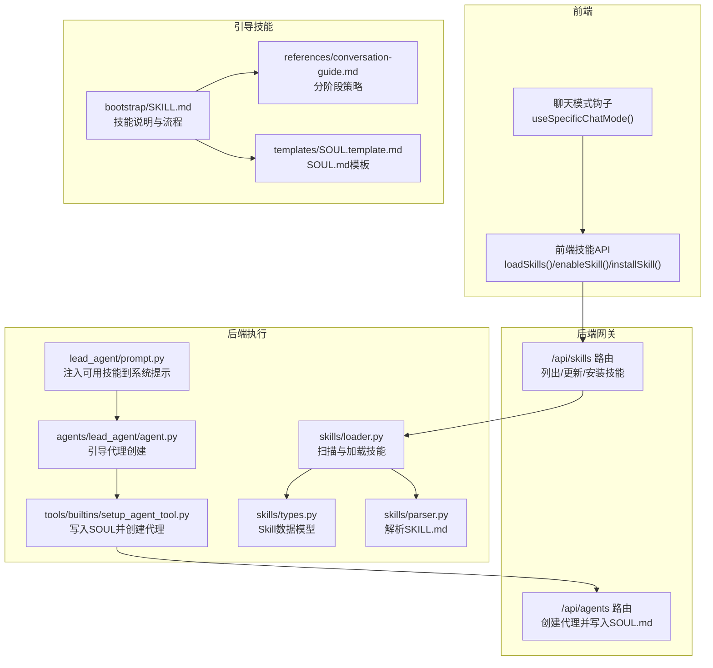
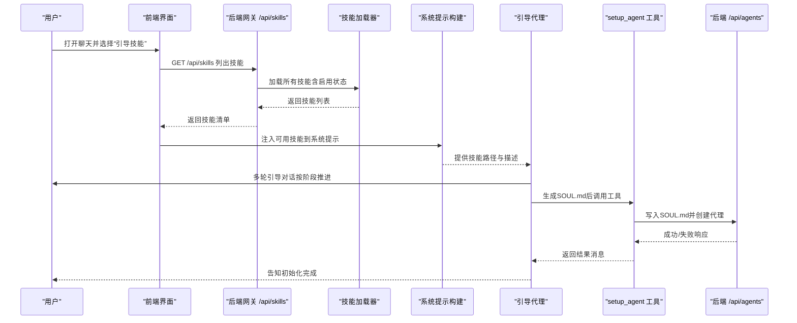
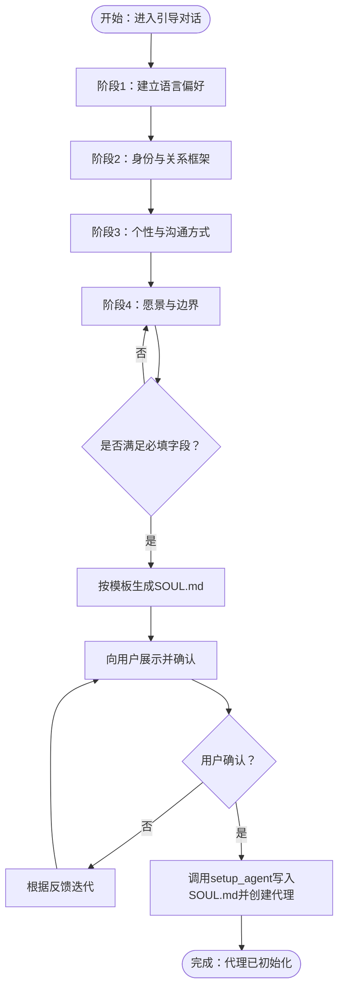
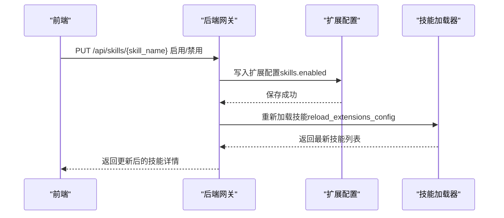
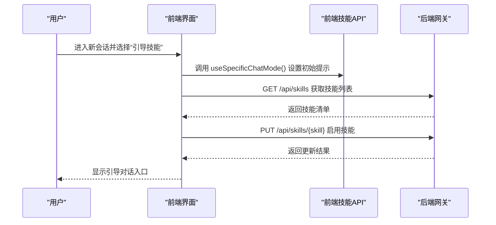
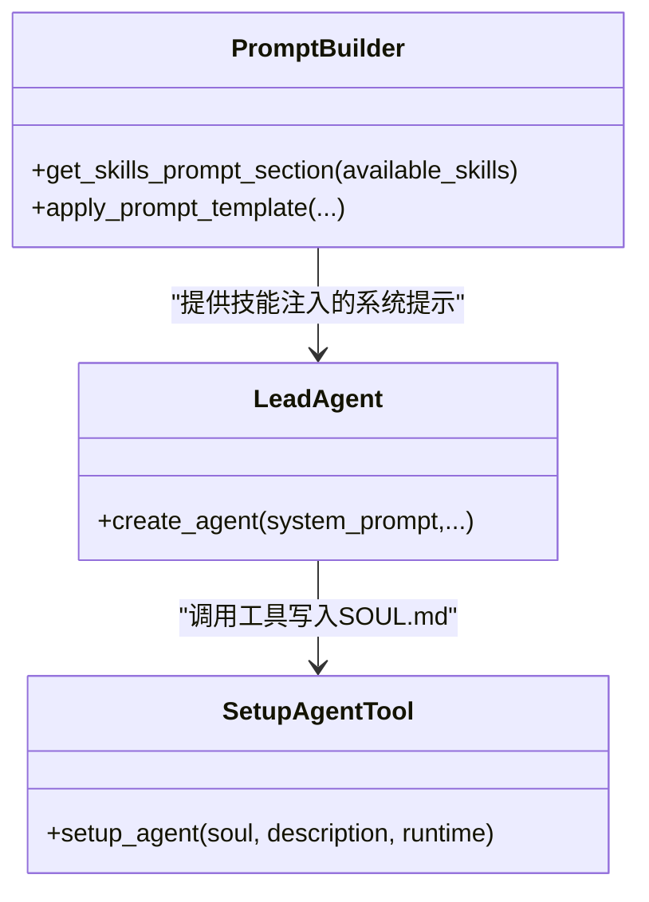
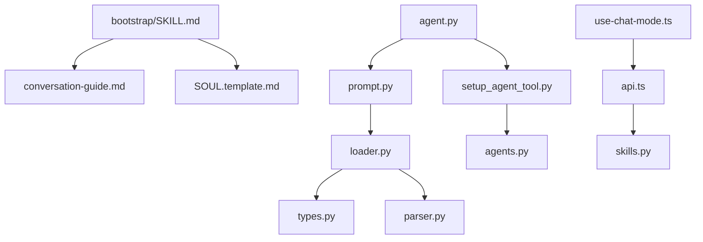

# 引导技能

<cite>
**本文引用的文件**
- [bootstrap/SKILL.md](file://skills/public/bootstrap/SKILL.md)
- [conversation-guide.md](file://skills/public/bootstrap/references/conversation-guide.md)
- [SOUL.template.md](file://skills/public/bootstrap/templates/SOUL.template.md)
- [skills.py](file://backend/app/gateway/routers/skills.py)
- [types.py](file://backend/packages/harness/deerflow/skills/types.py)
- [loader.py](file://backend/packages/harness/deerflow/skills/loader.py)
- [parser.py](file://backend/packages/harness/deerflow/skills/parser.py)
- [setup_agent_tool.py](file://backend/packages/harness/deerflow/tools/builtins/setup_agent_tool.py)
- [agent.py](file://backend/packages/harness/deerflow/agents/lead_agent/agent.py)
- [prompt.py](file://backend/packages/harness/deerflow/agents/lead_agent/prompt.py)
- [api.ts](file://frontend/src/core/skills/api.ts)
- [use-chat-mode.ts](file://frontend/src/components/workspace/chats/use-chat-mode.ts)
- [agents.py](file://backend/app/gateway/routers/agents.py)
- [API.md](file://backend/docs/API.md)
</cite>

## 目录
1. [简介](#简介)
2. [项目结构](#项目结构)
3. [核心组件](#核心组件)
4. [架构总览](#架构总览)
5. [详细组件分析](#详细组件分析)
6. [依赖分析](#依赖分析)
7. [性能考虑](#性能考虑)
8. [故障排查指南](#故障排查指南)
9. [结论](#结论)
10. [附录](#附录)

## 简介
本文件面向“引导技能”（Bootstrap Soul），系统性阐述其设计理念、会话初始化流程、对话引导策略与用户体验优化方法，并提供模板使用、自定义选项、配置参数、协作机制与最佳实践。引导技能通过多轮渐进式对话，帮助用户生成个性化且可执行的“SOUL.md”，作为智能体的人格与行为基线，最终由内置工具完成智能体的持久化与初始化。

## 项目结构
引导技能位于公共技能目录中，包含技能元数据文件、对话策略参考与输出模板；后端提供技能发现、启用/禁用与安装能力；前端提供技能列表与安装入口；引导流程在后端通过引导代理与工具链完成最终落地。

图表来源
- [skills.py:1-174](file://backend/app/gateway/routers/skills.py#L1-L174)
- [loader.py:1-99](file://backend/packages/harness/deerflow/skills/loader.py#L1-L99)
- [parser.py:1-66](file://backend/packages/harness/deerflow/skills/parser.py#L1-L66)
- [types.py:1-54](file://backend/packages/harness/deerflow/skills/types.py#L1-L54)
- [prompt.py:371-413](file://backend/packages/harness/deerflow/agents/lead_agent/prompt.py#L371-L413)
- [agent.py:326-334](file://backend/packages/harness/deerflow/agents/lead_agent/agent.py#L326-L334)
- [setup_agent_tool.py:1-63](file://backend/packages/harness/deerflow/tools/builtins/setup_agent_tool.py#L1-L63)
- [agents.py:189-224](file://backend/app/gateway/routers/agents.py#L189-L224)
- [bootstrap/SKILL.md:1-89](file://skills/public/bootstrap/SKILL.md#L1-L89)
- [conversation-guide.md:1-83](file://skills/public/bootstrap/references/conversation-guide.md#L1-L83)
- [SOUL.template.md:1-44](file://skills/public/bootstrap/templates/SOUL.template.md#L1-L44)

章节来源
- [bootstrap/SKILL.md:1-89](file://skills/public/bootstrap/SKILL.md#L1-L89)
- [conversation-guide.md:1-83](file://skills/public/bootstrap/references/conversation-guide.md#L1-L83)
- [SOUL.template.md:1-44](file://skills/public/bootstrap/templates/SOUL.template.md#L1-L44)
- [skills.py:1-174](file://backend/app/gateway/routers/skills.py#L1-L174)
- [loader.py:1-99](file://backend/packages/harness/deerflow/skills/loader.py#L1-L99)
- [parser.py:1-66](file://backend/packages/harness/deerflow/skills/parser.py#L1-L66)
- [types.py:1-54](file://backend/packages/harness/deerflow/skills/types.py#L1-L54)
- [prompt.py:371-413](file://backend/packages/harness/deerflow/agents/lead_agent/prompt.py#L371-L413)
- [agent.py:326-334](file://backend/packages/harness/deerflow/agents/lead_agent/agent.py#L326-L334)
- [setup_agent_tool.py:1-63](file://backend/packages/harness/deerflow/tools/builtins/setup_agent_tool.py#L1-L63)
- [agents.py:189-224](file://backend/app/gateway/routers/agents.py#L189-L224)
- [api.ts:1-62](file://frontend/src/core/skills/api.ts#L1-L62)
- [use-chat-mode.ts:1-41](file://frontend/src/components/workspace/chats/use-chat-mode.ts#L1-L41)

## 核心组件
- 技能元数据与流程：bootstrap/SKILL.md 定义了引导技能的目标、阶段划分、提取追踪表与生成规则。
- 对话策略：references/conversation-guide.md 提供四阶段具体策略与技巧，指导如何推进对话、观察用户风格并进行适配。
- 输出模板：templates/SOUL.template.md 规定了最终 SOUL.md 的结构与约束，确保生成内容可被后续工具消费。
- 后端技能发现与管理：后端通过路由与加载器扫描 skills 目录，解析 SKILL.md 元数据，支持启用/禁用与安装。
- 引导代理与工具：引导代理在启动时注入可用技能列表；生成完成后调用 setup_agent 工具写入 SOUL.md 并创建代理配置。
- 前端集成：前端提供技能列表、启用/禁用与安装接口；聊天模式钩子可在特定场景预填初始提示。

章节来源
- [bootstrap/SKILL.md:10-89](file://skills/public/bootstrap/SKILL.md#L10-L89)
- [conversation-guide.md:1-83](file://skills/public/bootstrap/references/conversation-guide.md#L1-L83)
- [SOUL.template.md:1-44](file://skills/public/bootstrap/templates/SOUL.template.md#L1-L44)
- [skills.py:66-174](file://backend/app/gateway/routers/skills.py#L66-L174)
- [loader.py:22-99](file://backend/packages/harness/deerflow/skills/loader.py#L22-L99)
- [parser.py:7-66](file://backend/packages/harness/deerflow/skills/parser.py#L7-L66)
- [prompt.py:371-413](file://backend/packages/harness/deerflow/agents/lead_agent/prompt.py#L371-L413)
- [agent.py:326-334](file://backend/packages/harness/deerflow/agents/lead_agent/agent.py#L326-L334)
- [setup_agent_tool.py:14-63](file://backend/packages/harness/deerflow/tools/builtins/setup_agent_tool.py#L14-L63)
- [api.ts:1-62](file://frontend/src/core/skills/api.ts#L1-L62)
- [use-chat-mode.ts:10-41](file://frontend/src/components/workspace/chats/use-chat-mode.ts#L10-L41)

## 架构总览
下图展示了从用户触发引导技能到最终生成并初始化智能体的端到端流程。

图表来源
- [skills.py:66-174](file://backend/app/gateway/routers/skills.py#L66-L174)
- [loader.py:22-99](file://backend/packages/harness/deerflow/skills/loader.py#L22-L99)
- [prompt.py:371-413](file://backend/packages/harness/deerflow/agents/lead_agent/prompt.py#L371-L413)
- [agent.py:326-334](file://backend/packages/harness/deerflow/agents/lead_agent/agent.py#L326-L334)
- [setup_agent_tool.py:14-63](file://backend/packages/harness/deerflow/tools/builtins/setup_agent_tool.py#L14-L63)
- [agents.py:189-224](file://backend/app/gateway/routers/agents.py#L189-L224)

## 详细组件分析

### 组件A：引导技能模板与生成流程
- 阶段目标与提取项：技能文档定义四阶段目标与关键提取字段，确保生成前具备必要上下文。
- 生成规则：严格遵循模板结构，语言与风格需与用户一致，最终以英文呈现，且必须调用工具写入而非手工创建。
- 与工具协作：生成完成后调用 setup_agent，传入完整 SOUL.md 与简要描述，工具负责创建代理并持久化。

图表来源
- [bootstrap/SKILL.md:31-89](file://skills/public/bootstrap/SKILL.md#L31-L89)
- [SOUL.template.md:1-44](file://skills/public/bootstrap/templates/SOUL.template.md#L1-L44)
- [setup_agent_tool.py:14-63](file://backend/packages/harness/deerflow/tools/builtins/setup_agent_tool.py#L14-L63)

章节来源
- [bootstrap/SKILL.md:31-89](file://skills/public/bootstrap/SKILL.md#L31-L89)
- [SOUL.template.md:1-44](file://skills/public/bootstrap/templates/SOUL.template.md#L1-L44)
- [setup_agent_tool.py:14-63](file://backend/packages/harness/deerflow/tools/builtins/setup_agent_tool.py#L14-L63)

### 组件B：后端技能发现与启用/禁用
- 发现机制：扫描 skills/public 与 skills/custom 下的 SKILL.md，解析元数据并合并启用状态。
- 启用/禁用：通过 PUT /api/skills/{skill_name} 更新扩展配置并重载，确保即时生效。
- 安装：POST /api/skills/install 从线程的 user-data 目录读取 .skill 归档并安装。

图表来源
- [skills.py:103-149](file://backend/app/gateway/routers/skills.py#L103-L149)
- [loader.py:76-98](file://backend/packages/harness/deerflow/skills/loader.py#L76-L98)

章节来源
- [skills.py:66-174](file://backend/app/gateway/routers/skills.py#L66-L174)
- [loader.py:22-99](file://backend/packages/harness/deerflow/skills/loader.py#L22-L99)

### 组件C：前端技能集成与聊天模式
- 技能列表与操作：前端通过 API 获取技能列表、启用/禁用与安装技能，便于在工作区统一管理。
- 聊天模式：当路径参数指示“技能模式”时，自动填充初始提示，提升引导技能的入口体验。

图表来源
- [api.ts:1-62](file://frontend/src/core/skills/api.ts#L1-L62)
- [use-chat-mode.ts:10-41](file://frontend/src/components/workspace/chats/use-chat-mode.ts#L10-L41)
- [skills.py:66-149](file://backend/app/gateway/routers/skills.py#L66-L149)

章节来源
- [api.ts:1-62](file://frontend/src/core/skills/api.ts#L1-L62)
- [use-chat-mode.ts:1-41](file://frontend/src/components/workspace/chats/use-chat-mode.ts#L1-L41)
- [skills.py:66-149](file://backend/app/gateway/routers/skills.py#L66-L149)

### 组件D：系统提示中的技能注入与引导代理
- 技能注入：系统提示构建模块动态注入可用技能列表及其容器内路径，引导代理可按需读取技能主文件并执行。
- 引导代理：当检测到 is_bootstrap 模式时，仅注入引导所需最小系统提示与 setup_agent 工具，避免干扰。

图表来源
- [prompt.py:371-413](file://backend/packages/harness/deerflow/agents/lead_agent/prompt.py#L371-L413)
- [agent.py:326-334](file://backend/packages/harness/deerflow/agents/lead_agent/agent.py#L326-L334)
- [setup_agent_tool.py:14-63](file://backend/packages/harness/deerflow/tools/builtins/setup_agent_tool.py#L14-L63)

章节来源
- [prompt.py:371-413](file://backend/packages/harness/deerflow/agents/lead_agent/prompt.py#L371-L413)
- [agent.py:326-334](file://backend/packages/harness/deerflow/agents/lead_agent/agent.py#L326-L334)
- [setup_agent_tool.py:14-63](file://backend/packages/harness/deerflow/tools/builtins/setup_agent_tool.py#L14-L63)

## 依赖分析
- 技能元数据与模板：bootstrap/SKILL.md 依赖 conversation-guide.md 与 SOUL.template.md 的约定，形成“策略—模板—产物”的闭环。
- 后端耦合：系统提示构建依赖技能加载器提供的技能列表；引导代理依赖系统提示中的技能注入；工具依赖后端路由写入 SOUL.md。
- 前端耦合：前端通过 API 与后端网关交互，实现技能管理与安装；聊天模式钩子提升用户体验。

图表来源
- [bootstrap/SKILL.md:1-89](file://skills/public/bootstrap/SKILL.md#L1-L89)
- [conversation-guide.md:1-83](file://skills/public/bootstrap/references/conversation-guide.md#L1-L83)
- [SOUL.template.md:1-44](file://skills/public/bootstrap/templates/SOUL.template.md#L1-L44)
- [prompt.py:371-413](file://backend/packages/harness/deerflow/agents/lead_agent/prompt.py#L371-L413)
- [loader.py:22-99](file://backend/packages/harness/deerflow/skills/loader.py#L22-L99)
- [types.py:1-54](file://backend/packages/harness/deerflow/skills/types.py#L1-L54)
- [parser.py:7-66](file://backend/packages/harness/deerflow/skills/parser.py#L7-L66)
- [agent.py:326-334](file://backend/packages/harness/deerflow/agents/lead_agent/agent.py#L326-L334)
- [setup_agent_tool.py:14-63](file://backend/packages/harness/deerflow/tools/builtins/setup_agent_tool.py#L14-L63)
- [agents.py:189-224](file://backend/app/gateway/routers/agents.py#L189-L224)
- [api.ts:1-62](file://frontend/src/core/skills/api.ts#L1-L62)
- [use-chat-mode.ts:1-41](file://frontend/src/components/workspace/chats/use-chat-mode.ts#L1-L41)

章节来源
- [bootstrap/SKILL.md:1-89](file://skills/public/bootstrap/SKILL.md#L1-L89)
- [prompt.py:371-413](file://backend/packages/harness/deerflow/agents/lead_agent/prompt.py#L371-L413)
- [loader.py:22-99](file://backend/packages/harness/deerflow/skills/loader.py#L22-L99)
- [agent.py:326-334](file://backend/packages/harness/deerflow/agents/lead_agent/agent.py#L326-L334)
- [setup_agent_tool.py:14-63](file://backend/packages/harness/deerflow/tools/builtins/setup_agent_tool.py#L14-L63)
- [api.ts:1-62](file://frontend/src/core/skills/api.ts#L1-L62)
- [use-chat-mode.ts:1-41](file://frontend/src/components/workspace/chats/use-chat-mode.ts#L1-L41)

## 性能考虑
- 渐进式加载：系统提示采用“按需读取技能主文件”的渐进加载模式，减少一次性资源占用。
- 并行工具调用：在允许的情况下，合理利用并行工具调用提升整体吞吐。
- 会话节奏控制：引导对话遵循“每轮少量问题、逐步深入”的原则，降低认知负担，提高转化效率。
- 文件与路径：SOUL.md 与输出文件均位于受控的工作空间路径，便于缓存与清理。

## 故障排查指南
- 技能未显示或不可用
  - 检查是否正确启用：通过 /api/skills/{skill_name} 的 PUT 接口更新 enabled 状态。
  - 确认扩展配置已保存并重载：后端会在更新后重新加载配置。
- 安装 .skill 归档失败
  - 确认归档路径存在于线程的 user-data 目录，且路径与请求一致。
  - 查看错误码：404 表示文件不存在，409 表示已存在，400 表示参数无效。
- 生成 SOUL.md 后无法创建代理
  - 确认调用 setup_agent 工具时提供了完整的 soul 与 description。
  - 检查后端 /api/agents 创建逻辑是否返回成功；若失败，工具会清理临时目录并返回错误消息。
- 前端技能列表为空
  - 确认后端已正确扫描 skills/public 与 skills/custom 目录。
  - 检查 SKILL.md 是否包含合法的 YAML front matter（name/description 必填）。

章节来源
- [skills.py:103-174](file://backend/app/gateway/routers/skills.py#L103-L174)
- [setup_agent_tool.py:55-63](file://backend/packages/harness/deerflow/tools/builtins/setup_agent_tool.py#L55-L63)
- [agents.py:189-224](file://backend/app/gateway/routers/agents.py#L189-L224)
- [loader.py:22-99](file://backend/packages/harness/deerflow/skills/loader.py#L22-L99)
- [parser.py:7-66](file://backend/packages/harness/deerflow/skills/parser.py#L7-L66)

## 结论
引导技能通过明确的阶段化对话策略与严格的模板约束，将抽象的“智能体人格”转化为可执行的 SOUL.md，并借助后端工具链完成智能体的初始化与持久化。前后端协同实现了从技能发现、启用、安装到引导生成与代理创建的完整闭环，既保证了用户体验，也确保了系统的可维护性与可扩展性。

## 附录
- 使用案例
  - 新用户首次接入：通过引导技能快速建立对智能体的期望与信任，缩短上手时间。
  - 个性化定制：在已有智能体基础上，使用引导技能调整个性、沟通风格与边界。
  - 团队协作：为不同角色（如产品经理、工程师）分别创建专属智能体，提升协作效率。
- 最佳实践
  - 严格遵循“一阶段一推进”的节奏，避免一次性抛出过多问题。
  - 善用镜像与观察技巧，基于用户表达提炼其真实需求与偏好。
  - 保持 SOUL.md 的可追溯性，确保每句话都能回溯到用户的原话或明确含义。
  - 在生成后务必调用工具写入，避免手工修改导致状态不一致。