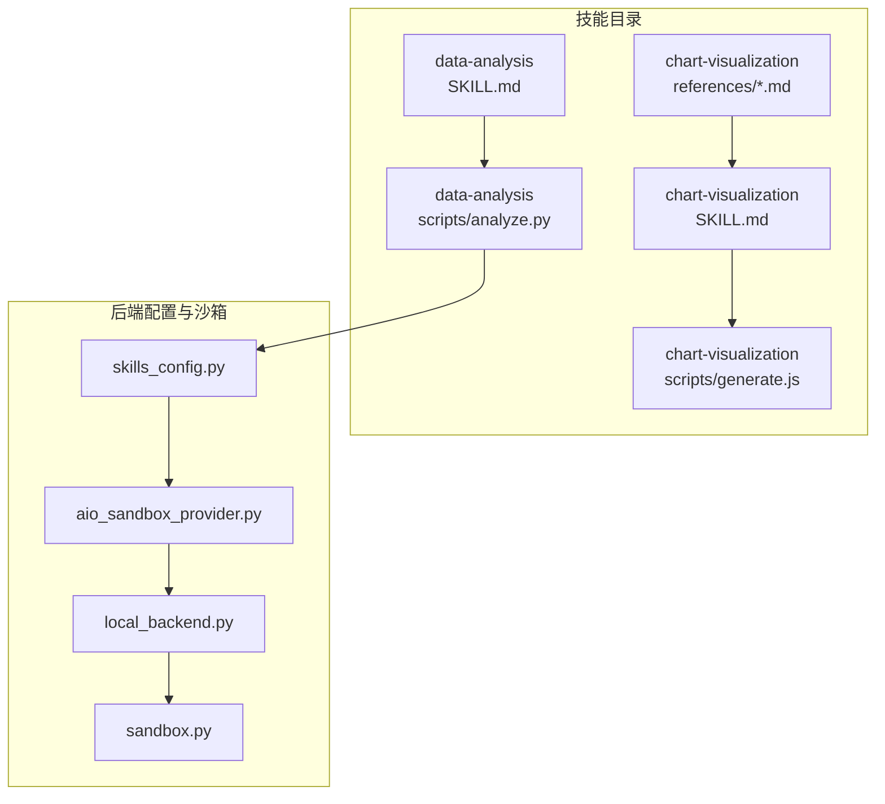
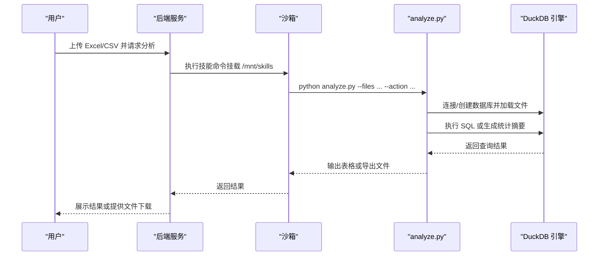
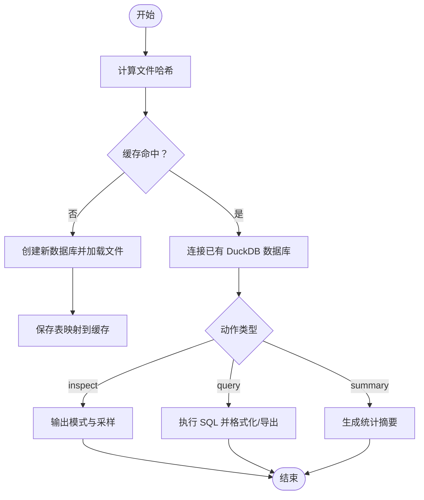
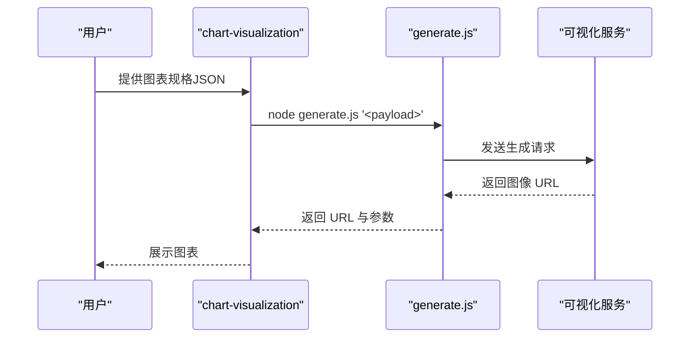
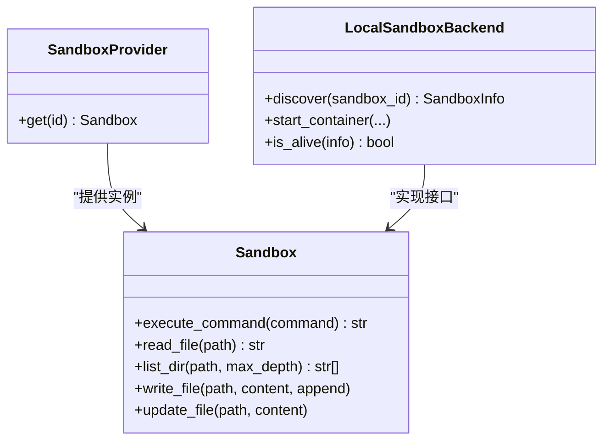
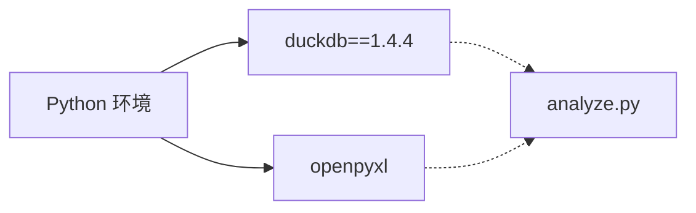

# 数据分析技能

<cite>
**本文引用的文件**
- [analyze.py](file://skills/public/data-analysis/scripts/analyze.py)
- [SKILL.md](file://skills/public/data-analysis/SKILL.md)
- [SKILL.md（图表可视化）](file://skills/public/chart-visualization/SKILL.md)
- [generate_histogram_chart.md](file://skills/public/chart-visualization/references/generate_histogram_chart.md)
- [generate.js](file://skills/public/chart-visualization/scripts/generate.js)
- [skills_config.py](file://backend/packages/harness/deerflow/config/skills_config.py)
- [sandbox.py](file://backend/packages/harness/deerflow/sandbox/sandbox.py)
- [aio_sandbox_provider.py](file://backend/packages/harness/deerflow/community/aio_sandbox/aio_sandbox_provider.py)
- [local_backend.py](file://backend/packages/harness/deerflow/community/aio_sandbox/local_backend.py)
- [uv.lock](file://backend/uv.lock)
</cite>

## 目录
1. [简介](#简介)
2. [项目结构](#项目结构)
3. [核心组件](#核心组件)
4. [架构总览](#架构总览)
5. [详细组件分析](#详细组件分析)
6. [依赖分析](#依赖分析)
7. [性能考虑](#性能考虑)
8. [故障排查指南](#故障排查指南)
9. [结论](#结论)
10. [附录](#附录)

## 简介
本文件为 DeerFlow 数据分析技能的详细使用文档，聚焦于对用户上传的 Excel（.xlsx/.xls）与 CSV 文件进行结构化数据探索、SQL 查询、统计摘要与结果导出。该技能基于 DuckDB 的本地化分析引擎，支持多工作表 Excel 工作簿、跨文件连接、窗口函数与高级聚合，并提供缓存机制以提升重复查询效率。同时，结合图表可视化技能，可将分析结果以多种图表形式直观呈现。

## 项目结构
数据分析技能位于公共技能目录下，核心由一个 Python 脚本与技能说明组成；图表可视化技能提供图表生成能力；后端沙箱与技能配置负责在容器环境中执行技能脚本并挂载技能路径。

**图表来源**
- [SKILL.md](file://skills/public/data-analysis/SKILL.md)
- [SKILL.md（图表可视化）](file://skills/public/chart-visualization/SKILL.md)
- [generate.js](file://skills/public/chart-visualization/scripts/generate.js)
- [skills_config.py](file://backend/packages/harness/deerflow/config/skills_config.py)
- [aio_sandbox_provider.py](file://backend/packages/harness/deerflow/community/aio_sandbox/aio_sandbox_provider.py)
- [local_backend.py](file://backend/packages/harness/deerflow/community/aio_sandbox/local_backend.py)

**章节来源**
- [SKILL.md](file://skills/public/data-analysis/SKILL.md)
- [SKILL.md（图表可视化）](file://skills/public/chart-visualization/SKILL.md)

## 核心组件
- 分析脚本：提供文件加载、模式检查、SQL 查询、统计摘要与结果导出能力，内置缓存以避免重复解析。
- 技能说明：定义参数、命名规则、分析模式与完整示例，指导如何调用脚本完成从探索到总结的全流程。
- 图表可视化：提供 26 种图表类型选择与参数规范，配合分析结果生成可视化图像链接。
- 后端沙箱与技能挂载：确保在容器中正确挂载技能目录并执行脚本命令。

**章节来源**
- [analyze.py](file://skills/public/data-analysis/scripts/analyze.py)
- [SKILL.md](file://skills/public/data-analysis/SKILL.md)
- [SKILL.md（图表可视化）](file://skills/public/chart-visualization/SKILL.md)

## 架构总览
数据分析技能在后端沙箱中运行，通过命令行参数调用分析脚本，脚本读取用户上传的 Excel/CSV 文件，建立 DuckDB 表并执行 SQL 查询，随后将结果以表格或文件形式返回。图表可视化技能在需要时被调用，将分析结果转换为图表。

**图表来源**
- [analyze.py](file://skills/public/data-analysis/scripts/analyze.py)
- [SKILL.md](file://skills/public/data-analysis/SKILL.md)
- [sandbox.py](file://backend/packages/harness/deerflow/sandbox/sandbox.py)
- [aio_sandbox_provider.py](file://backend/packages/harness/deerflow/community/aio_sandbox/aio_sandbox_provider.py)

## 详细组件分析

### 分析脚本（analyze.py）
- 文件加载与缓存
  - 支持 Excel（含多工作表）与 CSV 文件，自动安装 DuckDB 与 openpyxl 依赖。
  - 首次加载将文件解析为 DuckDB 表，并持久化数据库与表映射，后续同文件集合直接复用缓存。
- 模式检查（inspect）
  - 输出每张表的行数、列名、类型、非空计数与前 5 行示例。
- SQL 查询（query）
  - 自动将原始表名替换为清洗后的 SQL 名称，支持任意 DuckDB SQL（含窗口函数、CTE、子查询等）。
  - 可直接打印表格或导出为 CSV/JSON/Markdown。
- 统计摘要（summary）
  - 对数值列计算计数、均值、标准差、最小/中位数/最大、分位数与空值数；对文本列计算唯一值、众数与前 5 常见值占比。
- 参数与调用
  - --files：一个或多个 Excel/CSV 路径。
  - --action：inspect/query/summary。
  - --sql：仅 query 必需，SQL 查询语句。
  - --table：仅 summary 必需，目标表名。
  - --output-file：可选，导出路径（.csv/.json/.md）。

**图表来源**
- [analyze.py](file://skills/public/data-analysis/scripts/analyze.py)

**章节来源**
- [analyze.py](file://skills/public/data-analysis/scripts/analyze.py)
- [SKILL.md](file://skills/public/data-analysis/SKILL.md)

### 技能说明（SKILL.md）
- 核心能力
  - 结构检查、SQL 查询、统计摘要、多工作表支持、结果导出、大文件高效处理。
- 工作流
  - 明确“理解需求—检查结构—执行分析—输出处理”的步骤与参数说明。
- 表命名规则
  - Excel 每个工作表成为一张表；CSV 以文件名为表名；特殊字符自动清洗；名称以数字开头或含特殊字符需加双引号。
- 分析模式
  - 提供基础探索、聚合分组、跨文件连接、窗口函数与透视风格分析的 SQL 示例。
- 完整示例
  - 多工作表销售数据的“按产品收入排行”“月度趋势”“统计摘要”三步法。
- 多文件示例
  - 跨 CSV 与 Excel 的连接查询示例。
- 输出处理
  - 交互中直接展示表格，大结果导出并通过工具分享。
- 缓存机制
  - 首次加载持久化 DuckDB 数据库与表映射，后续透明复用。

**章节来源**
- [SKILL.md](file://skills/public/data-analysis/SKILL.md)

### 图表可视化技能
- 能力概述
  - 基于 26 种图表类型智能选择，参数抽取与生成流程清晰，支持时间序列、对比、部分-整体、关系与地图等场景。
- 工作流
  - 1）根据数据特征选择图表类型；2）从 references 中读取参数规范；3）调用 generate.js 生成图像 URL。
- 直方图参考
  - 提供直方图的输入字段、可选样式与返回结果说明。

**图表来源**
- [SKILL.md（图表可视化）](file://skills/public/chart-visualization/SKILL.md)
- [generate.js](file://skills/public/chart-visualization/scripts/generate.js)

**章节来源**
- [SKILL.md（图表可视化）](file://skills/public/chart-visualization/SKILL.md)
- [generate_histogram_chart.md](file://skills/public/chart-visualization/references/generate_histogram_chart.md)

### 后端沙箱与技能挂载
- 技能路径配置
  - skills_config.py 提供技能目录解析与容器内挂载路径（默认 /mnt/skills），确保脚本可在沙箱中访问。
- 沙箱抽象
  - sandbox.py 定义沙箱命令执行、文件读写与目录遍历等接口。
- 沙箱提供者
  - aio_sandbox_provider.py 决定使用远程或本地后端，并加载配置。
- 本地后端
  - local_backend.py 实现容器发现、健康检查与启动逻辑，保证沙箱可用性。

**图表来源**
- [sandbox.py](file://backend/packages/harness/deerflow/sandbox/sandbox.py)
- [aio_sandbox_provider.py](file://backend/packages/harness/deerflow/community/aio_sandbox/aio_sandbox_provider.py)
- [local_backend.py](file://backend/packages/harness/deerflow/community/aio_sandbox/local_backend.py)

**章节来源**
- [skills_config.py](file://backend/packages/harness/deerflow/config/skills_config.py)
- [sandbox.py](file://backend/packages/harness/deerflow/sandbox/sandbox.py)
- [aio_sandbox_provider.py](file://backend/packages/harness/deerflow/community/aio_sandbox/aio_sandbox_provider.py)
- [local_backend.py](file://backend/packages/harness/deerflow/community/aio_sandbox/local_backend.py)

## 依赖分析
- DuckDB 版本
  - 后端 uv.lock 指明 duckdb 版本为 1.4.4，满足分析脚本对 DuckDB 的依赖要求。
- 依赖安装
  - 分析脚本在首次运行时自动安装 duckdb 与 openpyxl，确保 Excel 读取与 DuckDB 使用。

**图表来源**
- [uv.lock](file://backend/uv.lock)
- [analyze.py](file://skills/public/data-analysis/scripts/analyze.py)

**章节来源**
- [uv.lock](file://backend/uv.lock)
- [analyze.py](file://skills/public/data-analysis/scripts/analyze.py)

## 性能考虑
- 缓存策略
  - 首次加载后持久化 DuckDB 数据库与表映射，后续相同文件集合直接复用，显著降低重复查询启动时间。
- 列式存储与向量化
  - DuckDB 的列式引擎适合大规模结构化数据的扫描与聚合，无需将全量数据载入内存。
- SQL 优化建议
  - 在 SQL 中尽早过滤与限制（如 WHERE、LIMIT），减少中间结果集大小。
  - 对日期/字符串列使用索引友好的表达式（例如 DATE_TRUNC、EXTRACT）以提升查询效率。
- 导出性能
  - 大结果优先导出为 CSV/JSON，避免在终端渲染超长表格导致卡顿。

[本节为通用性能建议，不直接分析具体文件]

## 故障排查指南
- 依赖缺失
  - 现象：首次运行提示缺少 duckdb/openpyxl。
  - 处理：脚本会自动安装依赖；若失败，请确认网络可达与 pip 权限。
- 文件不可读/格式不支持
  - 现象：日志报错“文件未找到”或“不支持的文件格式”。
  - 处理：检查文件路径是否存在于容器挂载点，确认扩展名为 .xlsx/.xls/.csv。
- SQL 错误
  - 现象：返回 SQL 错误并列出可用表与列。
  - 处理：对照可用表名修正查询；注意表名可能已被清洗或带双引号。
- 缓存问题
  - 现象：更新文件后仍使用旧缓存。
  - 处理：删除缓存目录下的 .duckdb 与 .table_map.json 文件，重新执行分析。
- 大文件与内存
  - 现象：查询缓慢或内存占用高。
  - 处理：拆分子查询、使用 LIMIT、导出中间结果、避免一次性读取全部列。

**章节来源**
- [analyze.py](file://skills/public/data-analysis/scripts/analyze.py)
- [SKILL.md](file://skills/public/data-analysis/SKILL.md)

## 结论
数据分析技能通过 DuckDB 提供高性能、易用的结构化数据探索与统计能力，结合缓存机制与灵活的 SQL 查询，能够覆盖从基础探索到复杂聚合的广泛场景。配合图表可视化技能，可将分析结果以直观图表呈现，帮助用户快速理解数据并做出决策。建议在实际使用中遵循参数规范、合理设计 SQL、利用缓存与导出能力，以获得最佳体验与性能。

[本节为总结性内容，不直接分析具体文件]

## 附录

### 使用步骤与最佳实践
- 步骤
  - 上传文件至 /mnt/user-data/uploads/。
  - 先 inspect 了解结构，再编写 query 或 summary，最后按需导出。
- 最佳实践
  - 先小范围验证 SQL，再扩大范围。
  - 对数值列优先使用统计摘要，对分类列关注唯一值与众数。
  - 大结果导出为 CSV/JSON，便于二次处理与分享。

**章节来源**
- [SKILL.md](file://skills/public/data-analysis/SKILL.md)