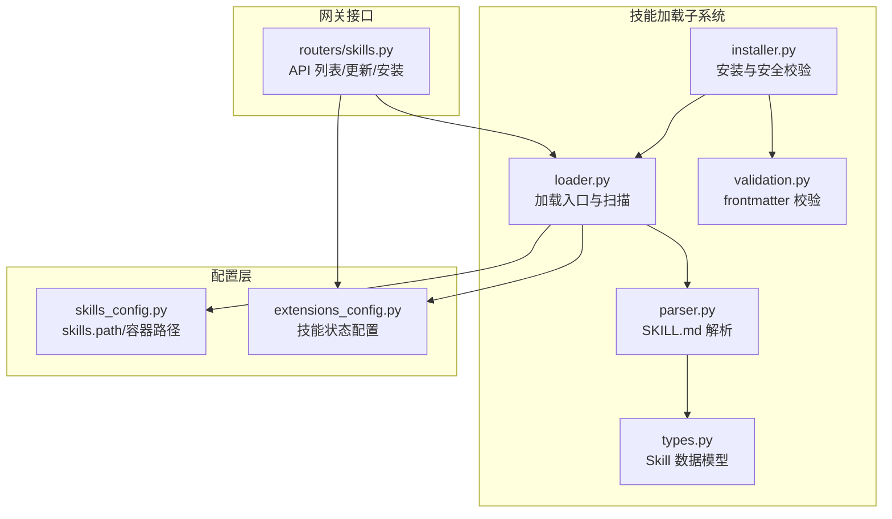
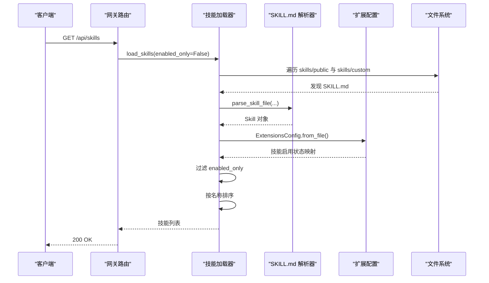
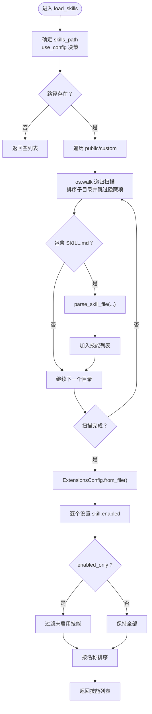
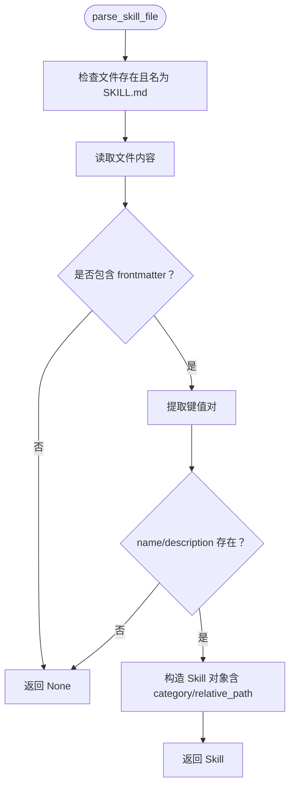
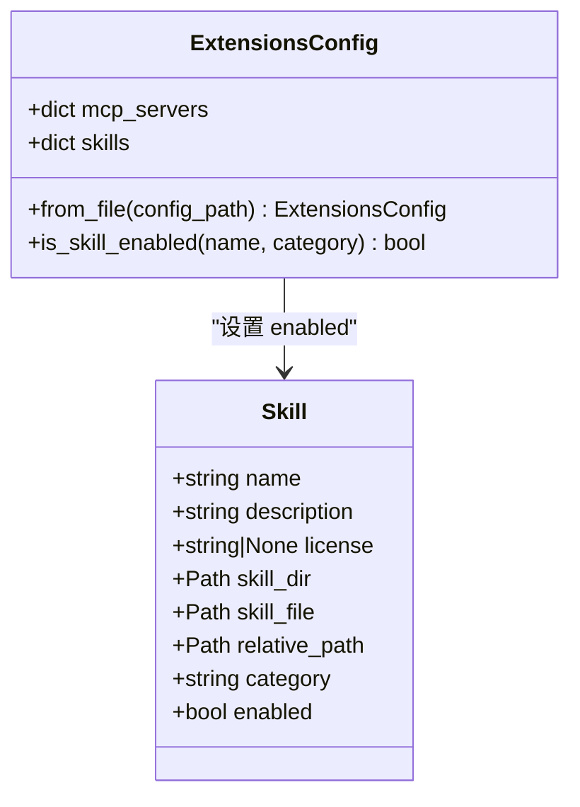
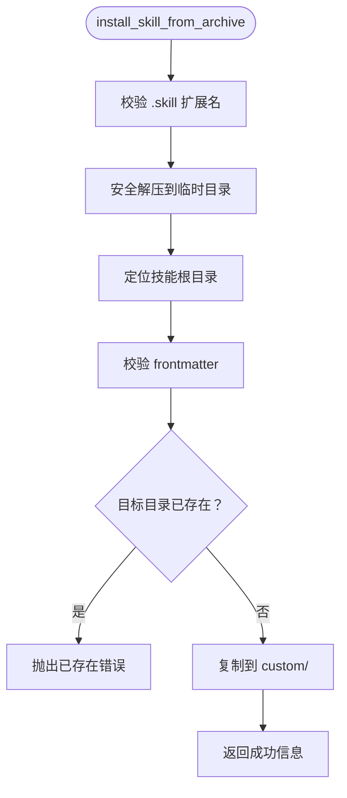
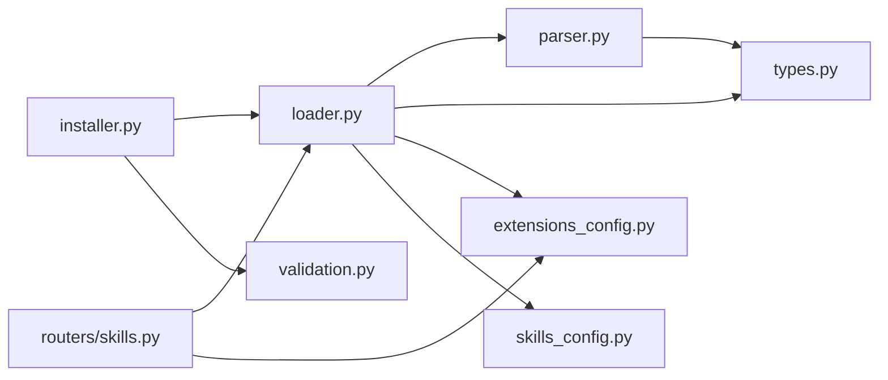

# 技能加载器

<cite>
**本文引用的文件**
- [backend/packages/harness/deerflow/skills/loader.py](file://backend/packages/harness/deerflow/skills/loader.py)
- [backend/packages/harness/deerflow/skills/parser.py](file://backend/packages/harness/deerflow/skills/parser.py)
- [backend/packages/harness/deerflow/skills/types.py](file://backend/packages/harness/deerflow/skills/types.py)
- [backend/packages/harness/deerflow/skills/validation.py](file://backend/packages/harness/deerflow/skills/validation.py)
- [backend/packages/harness/deerflow/skills/installer.py](file://backend/packages/harness/deerflow/skills/installer.py)
- [backend/packages/harness/deerflow/config/skills_config.py](file://backend/packages/harness/deerflow/config/skills_config.py)
- [backend/packages/harness/deerflow/config/extensions_config.py](file://backend/packages/harness/deerflow/config/extensions_config.py)
- [backend/app/gateway/routers/skills.py](file://backend/app/gateway/routers/skills.py)
- [backend/tests/test_skills_loader.py](file://backend/tests/test_skills_loader.py)
- [backend/tests/test_skills_parser.py](file://backend/tests/test_skills_parser.py)
- [skills/public/bootstrap/SKILL.md](file://skills/public/bootstrap/SKILL.md)
- [skills/public/chart-visualization/SKILL.md](file://skills/public/chart-visualization/SKILL.md)
- [config.example.yaml](file://config.example.yaml)
</cite>

## 目录
1. [简介](#简介)
2. [项目结构](#项目结构)
3. [核心组件](#核心组件)
4. [架构总览](#架构总览)
5. [详细组件分析](#详细组件分析)
6. [依赖关系分析](#依赖关系分析)
7. [性能考量](#性能考量)
8. [故障排查指南](#故障排查指南)
9. [结论](#结论)
10. [附录：使用示例与工作流程](#附录使用示例与工作流程)

## 简介
本文件系统性阐述 DeerFlow 技能加载器的设计与实现，覆盖以下关键主题：
- 技能目录扫描机制：如何递归扫描公共与自定义两类技能目录，识别并解析 SKILL.md。
- 公共与自定义技能分类处理：两类目录的遍历策略与相对路径计算。
- SKILL.md 文件解析流程：从 YAML 前言元数据到 Skill 数据模型的映射。
- 路径解析逻辑：get_skills_root_path() 的定位策略与配置驱动的路径来源。
- 参数配置选项：load_skills() 的 use_config、enabled_only 行为与默认值。
- 技能状态配置加载与应用：extensions_config.json 的读取、缓存与即时生效策略。
- 排序与过滤逻辑：按名称排序与仅启用过滤。
- 完整工作流程图与实际使用示例。

## 项目结构
技能加载器位于后端 harness 包中，围绕 loader、parser、types、validation、installer 五个模块协同工作，并通过配置模块与网关路由对外提供能力。

图表来源
- [backend/packages/harness/deerflow/skills/loader.py:1-99](file://backend/packages/harness/deerflow/skills/loader.py#L1-L99)
- [backend/packages/harness/deerflow/skills/parser.py:1-66](file://backend/packages/harness/deerflow/skills/parser.py#L1-L66)
- [backend/packages/harness/deerflow/skills/types.py:1-54](file://backend/packages/harness/deerflow/skills/types.py#L1-L54)
- [backend/packages/harness/deerflow/skills/validation.py:1-86](file://backend/packages/harness/deerflow/skills/validation.py#L1-L86)
- [backend/packages/harness/deerflow/skills/installer.py:1-177](file://backend/packages/harness/deerflow/skills/installer.py#L1-L177)
- [backend/packages/harness/deerflow/config/skills_config.py:1-50](file://backend/packages/harness/deerflow/config/skills_config.py#L1-L50)
- [backend/packages/harness/deerflow/config/extensions_config.py:1-259](file://backend/packages/harness/deerflow/config/extensions_config.py#L1-L259)
- [backend/app/gateway/routers/skills.py:1-174](file://backend/app/gateway/routers/skills.py#L1-L174)

章节来源
- [backend/packages/harness/deerflow/skills/loader.py:1-99](file://backend/packages/harness/deerflow/skills/loader.py#L1-L99)
- [backend/packages/harness/deerflow/skills/parser.py:1-66](file://backend/packages/harness/deerflow/skills/parser.py#L1-L66)
- [backend/packages/harness/deerflow/skills/types.py:1-54](file://backend/packages/harness/deerflow/skills/types.py#L1-L54)
- [backend/packages/harness/deerflow/skills/validation.py:1-86](file://backend/packages/harness/deerflow/skills/validation.py#L1-L86)
- [backend/packages/harness/deerflow/skills/installer.py:1-177](file://backend/packages/harness/deerflow/skills/installer.py#L1-L177)
- [backend/packages/harness/deerflow/config/skills_config.py:1-50](file://backend/packages/harness/deerflow/config/skills_config.py#L1-L50)
- [backend/packages/harness/deerflow/config/extensions_config.py:1-259](file://backend/packages/harness/deerflow/config/extensions_config.py#L1-L259)
- [backend/app/gateway/routers/skills.py:1-174](file://backend/app/gateway/routers/skills.py#L1-L174)

## 核心组件
- loader 模块
  - get_skills_root_path()：基于当前文件位置上溯定位 skills 目录，确保指向项目根下 deer-flow/skills。
  - load_skills()：扫描 public/custom 目录，递归遍历并解析 SKILL.md，合并状态配置，按名称排序，支持仅返回启用项。
- parser 模块
  - parse_skill_file()：提取 YAML frontmatter，构建 Skill 对象，缺失必要字段时返回空。
- types 模块
  - Skill 数据类：包含名称、描述、许可证、目录路径、类别、启用状态等字段及容器路径计算方法。
- validation 模块
  - _validate_skill_frontmatter()：对 frontmatter 进行严格校验（键名、类型、命名规范、长度限制等）。
- installer 模块
  - install_skill_from_archive()：安全解压 .skill 归档，校验 frontmatter，写入 custom 目录。
- 配置模块
  - skills_config.SkillsConfig：解析 skills.path 并提供容器路径计算。
  - extensions_config.ExtensionsConfig：解析 extensions_config.json/mcp_config.json，提供 is_skill_enabled() 查询。

章节来源
- [backend/packages/harness/deerflow/skills/loader.py:8-99](file://backend/packages/harness/deerflow/skills/loader.py#L8-L99)
- [backend/packages/harness/deerflow/skills/parser.py:7-66](file://backend/packages/harness/deerflow/skills/parser.py#L7-L66)
- [backend/packages/harness/deerflow/skills/types.py:5-54](file://backend/packages/harness/deerflow/skills/types.py#L5-L54)
- [backend/packages/harness/deerflow/skills/validation.py:15-86](file://backend/packages/harness/deerflow/skills/validation.py#L15-L86)
- [backend/packages/harness/deerflow/skills/installer.py:110-177](file://backend/packages/harness/deerflow/skills/installer.py#L110-L177)
- [backend/packages/harness/deerflow/config/skills_config.py:6-50](file://backend/packages/harness/deerflow/config/skills_config.py#L6-L50)
- [backend/packages/harness/deerflow/config/extensions_config.py:55-200](file://backend/packages/harness/deerflow/config/extensions_config.py#L55-L200)

## 架构总览
技能加载器在“扫描—解析—配置—排序”的主干流程之上，通过配置模块与网关路由形成闭环：网关调用加载器获取技能列表，更新技能启用状态时写回配置文件并重新加载，确保实时生效。

图表来源
- [backend/app/gateway/routers/skills.py:72-78](file://backend/app/gateway/routers/skills.py#L72-L78)
- [backend/packages/harness/deerflow/skills/loader.py:22-99](file://backend/packages/harness/deerflow/skills/loader.py#L22-L99)
- [backend/packages/harness/deerflow/skills/parser.py:7-66](file://backend/packages/harness/deerflow/skills/parser.py#L7-L66)
- [backend/packages/harness/deerflow/config/extensions_config.py:119-144](file://backend/packages/harness/deerflow/config/extensions_config.py#L119-L144)

## 详细组件分析

### 组件一：路径解析与目录扫描（get_skills_root_path 与 load_skills）
- get_skills_root_path()
  - 依据 loader.py 的相对路径上溯五级父目录，定位 backend，再指向同级的 skills 目录，确保始终指向 deer-flow/skills。
  - 该设计避免了硬编码路径，保证在不同部署环境下的一致性。
- load_skills()
  - 支持三种路径来源：
    - 显式传入 skills_path；
    - use_config=True 时，优先从应用配置（SkillsConfig）解析；
    - 否则回退到 get_skills_root_path()。
  - 扫描策略：
    - 遍历 category in ["public","custom"]；
    - 使用 os.walk 并开启 followlinks，同时对子目录进行排序并跳过以点开头的隐藏目录；
    - 仅当目录包含 SKILL.md 时才解析。
  - 解析与合并：
    - parse_skill_file() 返回 Skill 对象；
    - 通过 ExtensionsConfig.from_file() 读取最新配置，逐个设置 skill.enabled；
    - 若配置读取失败，打印警告并默认启用所有技能。
  - 过滤与排序：
    - enabled_only=True 时仅保留已启用技能；
    - 最终按名称排序返回。

图表来源
- [backend/packages/harness/deerflow/skills/loader.py:22-99](file://backend/packages/harness/deerflow/skills/loader.py#L22-L99)
- [backend/packages/harness/deerflow/skills/parser.py:7-66](file://backend/packages/harness/deerflow/skills/parser.py#L7-L66)
- [backend/packages/harness/deerflow/config/extensions_config.py:119-144](file://backend/packages/harness/deerflow/config/extensions_config.py#L119-L144)

章节来源
- [backend/packages/harness/deerflow/skills/loader.py:8-99](file://backend/packages/harness/deerflow/skills/loader.py#L8-L99)
- [backend/packages/harness/deerflow/config/skills_config.py:18-37](file://backend/packages/harness/deerflow/config/skills_config.py#L18-L37)
- [backend/tests/test_skills_loader.py:15-65](file://backend/tests/test_skills_loader.py#L15-L65)

### 组件二：SKILL.md 解析流程（parse_skill_file）
- 输入约束：仅处理名为 SKILL.md 的文件；不存在或文件名不符直接返回空。
- 解析步骤：
  - 读取全文并匹配 YAML frontmatter（三短划线包裹）；
  - 提取键值对，简单分号分割解析；
  - 必填字段：name、description；可选字段：license 等；
  - 构造 Skill 对象，relative_path 默认为目录名，category 来自扫描上下文。
- 错误处理：异常捕获并返回空，避免中断整体扫描。

图表来源
- [backend/packages/harness/deerflow/skills/parser.py:7-66](file://backend/packages/harness/deerflow/skills/parser.py#L7-L66)
- [backend/packages/harness/deerflow/skills/types.py:5-54](file://backend/packages/harness/deerflow/skills/types.py#L5-L54)

章节来源
- [backend/packages/harness/deerflow/skills/parser.py:7-66](file://backend/packages/harness/deerflow/skills/parser.py#L7-L66)
- [backend/tests/test_skills_parser.py:15-99](file://backend/tests/test_skills_parser.py#L15-L99)

### 组件三：技能状态配置加载与应用（ExtensionsConfig）
- 配置文件解析：
  - 支持 extensions_config.json 或向后兼容的 mcp_config.json；
  - 支持环境变量占位符解析；
  - 未找到时返回空配置对象。
- 启用查询：
  - is_skill_enabled(skill_name, skill_category)：
    - 若未配置，默认对 public/custom 类型启用；
    - 否则以配置为准。
- 加载策略：
  - load_skills() 中使用 from_file() 直接读取最新磁盘配置，确保与独立进程的网关 API 变更即时同步。

图表来源
- [backend/packages/harness/deerflow/config/extensions_config.py:55-200](file://backend/packages/harness/deerflow/config/extensions_config.py#L55-L200)
- [backend/packages/harness/deerflow/skills/types.py:5-54](file://backend/packages/harness/deerflow/skills/types.py#L5-L54)

章节来源
- [backend/packages/harness/deerflow/config/extensions_config.py:119-200](file://backend/packages/harness/deerflow/config/extensions_config.py#L119-L200)
- [backend/packages/harness/deerflow/skills/loader.py:76-90](file://backend/packages/harness/deerflow/skills/loader.py#L76-L90)

### 组件四：安装与安全校验（installer）
- 安全策略：
  - 拒绝绝对路径与目录穿越（..）；
  - 跳过符号链接；
  - 总解压大小上限防御“zip bomb”。
- 安装流程：
  - 解析 .skill 归档，定位技能根目录（过滤 macOS 元数据与点文件）；
  - 校验 frontmatter（validation._validate_skill_frontmatter）；
  - 写入 custom/<name> 目录，避免重复安装。

图表来源
- [backend/packages/harness/deerflow/skills/installer.py:110-177](file://backend/packages/harness/deerflow/skills/installer.py#L110-L177)
- [backend/packages/harness/deerflow/skills/validation.py:15-86](file://backend/packages/harness/deerflow/skills/validation.py#L15-L86)

章节来源
- [backend/packages/harness/deerflow/skills/installer.py:1-177](file://backend/packages/harness/deerflow/skills/installer.py#L1-L177)
- [backend/packages/harness/deerflow/skills/validation.py:1-86](file://backend/packages/harness/deerflow/skills/validation.py#L1-L86)

### 组件五：数据模型与容器路径（types）
- Skill 数据类包含：
  - 名称、描述、许可证、目录路径、文件路径、相对路径、类别、启用状态；
  - 提供容器路径计算方法，便于在沙箱环境中定位技能文件。

章节来源
- [backend/packages/harness/deerflow/skills/types.py:5-54](file://backend/packages/harness/deerflow/skills/types.py#L5-L54)

## 依赖关系分析
- loader 依赖 parser 与 types，间接依赖配置模块（通过 SkillsConfig 与 ExtensionsConfig）。
- parser 依赖 types。
- installer 依赖 loader（获取默认 skills_root）与 validation。
- 网关路由依赖 loader 与 ExtensionsConfig，用于列出、查询、更新技能状态与安装新技能。

图表来源
- [backend/packages/harness/deerflow/skills/loader.py:1-99](file://backend/packages/harness/deerflow/skills/loader.py#L1-L99)
- [backend/packages/harness/deerflow/skills/parser.py:1-66](file://backend/packages/harness/deerflow/skills/parser.py#L1-L66)
- [backend/packages/harness/deerflow/skills/types.py:1-54](file://backend/packages/harness/deerflow/skills/types.py#L1-L54)
- [backend/packages/harness/deerflow/skills/installer.py:1-177](file://backend/packages/harness/deerflow/skills/installer.py#L1-L177)
- [backend/packages/harness/deerflow/skills/validation.py:1-86](file://backend/packages/harness/deerflow/skills/validation.py#L1-L86)
- [backend/packages/harness/deerflow/config/skills_config.py:1-50](file://backend/packages/harness/deerflow/config/skills_config.py#L1-L50)
- [backend/packages/harness/deerflow/config/extensions_config.py:1-259](file://backend/packages/harness/deerflow/config/extensions_config.py#L1-L259)
- [backend/app/gateway/routers/skills.py:1-174](file://backend/app/gateway/routers/skills.py#L1-L174)

章节来源
- [backend/packages/harness/deerflow/skills/loader.py:1-99](file://backend/packages/harness/deerflow/skills/loader.py#L1-L99)
- [backend/packages/harness/deerflow/skills/installer.py:1-177](file://backend/packages/harness/deerflow/skills/installer.py#L1-L177)
- [backend/app/gateway/routers/skills.py:1-174](file://backend/app/gateway/routers/skills.py#L1-L174)

## 性能考量
- 递归扫描复杂度：O(N) 遍历所有目录，N 为目录数量；排序成本 O(M log M)，M 为发现的技能数。
- I/O 优化建议：
  - 尽量减少不必要的磁盘访问，如在批量操作中复用同一份配置；
  - 在高并发场景下，考虑对配置读取进行缓存（当前 is_skill_enabled 使用 from_file 直读，确保实时性但可能增加 I/O）。
- 安全解压：
  - 通过大小限制与路径校验有效防止 zip bomb 与路径逃逸攻击，降低运行时风险。

## 故障排查指南
- get_skills_root_path 无法定位 skills 目录
  - 确认 loader.py 的相对路径上溯逻辑未被修改；
  - 检查项目结构中 deer-flow/skills 是否存在。
- load_skills 返回空列表
  - 检查 skills_path 是否正确（显式传参、use_config、默认路径）；
  - 确认 public/custom 目录存在且包含 SKILL.md。
- SKILL.md 解析失败
  - 检查 frontmatter 是否以三短划线包裹；
  - 确保包含 name 与 description 字段；
  - 使用 validation._validate_skill_frontmatter() 进行前置校验。
- 启用状态不生效
  - 确认 extensions_config.json/mcp_config.json 存在且格式正确；
  - 网关更新后需重新加载配置（from_file 直读），避免缓存导致的状态滞后。
- 安装 .skill 失败
  - 检查 .skill 文件扩展名与有效性；
  - 关注 zip bomb 防护与符号链接跳过提示；
  - 确保目标目录未重复安装。

章节来源
- [backend/packages/harness/deerflow/skills/loader.py:39-53](file://backend/packages/harness/deerflow/skills/loader.py#L39-L53)
- [backend/packages/harness/deerflow/skills/parser.py:18-29](file://backend/packages/harness/deerflow/skills/parser.py#L18-L29)
- [backend/packages/harness/deerflow/config/extensions_config.py:119-144](file://backend/packages/harness/deerflow/config/extensions_config.py#L119-L144)
- [backend/packages/harness/deerflow/skills/installer.py:130-177](file://backend/packages/harness/deerflow/skills/installer.py#L130-L177)

## 结论
技能加载器通过清晰的职责划分与严格的配置/安全策略，实现了对公共与自定义技能的稳定扫描、解析与状态管理。其设计兼顾易用性与安全性，适合在多租户与容器化环境中部署。建议在生产环境中：
- 明确 skills.path 与容器挂载路径；
- 使用 extensions_config.json 精细控制技能启用状态；
- 对 .skill 安装流程进行审计与监控。

## 附录：使用示例与工作流程

### 实际使用示例
- 列出所有技能（包含禁用项）
  - 调用网关路由 GET /api/skills，内部通过 load_skills(enabled_only=False) 获取完整列表。
- 仅列出启用的技能
  - 调用 GET /api/skills，内部通过 load_skills(enabled_only=True) 过滤。
- 更新技能启用状态
  - PUT /api/skills/{skill_name}，写入 extensions_config.json 并调用 reload_extensions_config() 使变更立即生效。
- 安装自定义技能
  - POST /api/skills/install，从 thread 的虚拟路径解析 .skill 文件并安装至 custom/<name>。

章节来源
- [backend/app/gateway/routers/skills.py:72-174](file://backend/app/gateway/routers/skills.py#L72-L174)
- [backend/packages/harness/deerflow/skills/loader.py:22-99](file://backend/packages/harness/deerflow/skills/loader.py#L22-L99)
- [backend/packages/harness/deerflow/config/extensions_config.py:220-235](file://backend/packages/harness/deerflow/config/extensions_config.py#L220-L235)

### SKILL.md 示例参考
- bootstrap：展示完整的对话引导与生成流程，包含模板与参考材料。
- chart-visualization：展示图表选择、参数提取与脚本执行的完整工作流。

章节来源
- [skills/public/bootstrap/SKILL.md:1-89](file://skills/public/bootstrap/SKILL.md#L1-L89)
- [skills/public/chart-visualization/SKILL.md:1-73](file://skills/public/chart-visualization/SKILL.md#L1-L73)

### 配置参考
- skills.path 与 container_path 的默认值与解析逻辑。
- extensions_config.json/mcp_config.json 的查找顺序与环境变量解析。

章节来源
- [config.example.yaml:418-428](file://config.example.yaml#L418-L428)
- [backend/packages/harness/deerflow/config/skills_config.py:18-37](file://backend/packages/harness/deerflow/config/skills_config.py#L18-L37)
- [backend/packages/harness/deerflow/config/extensions_config.py:70-117](file://backend/packages/harness/deerflow/config/extensions_config.py#L70-L117)