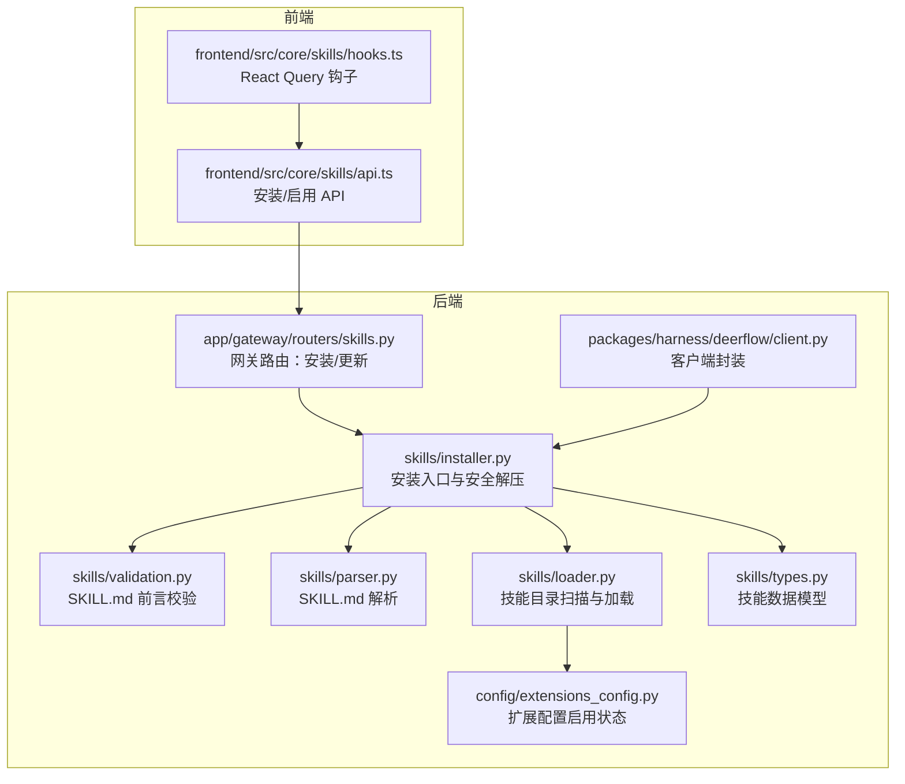
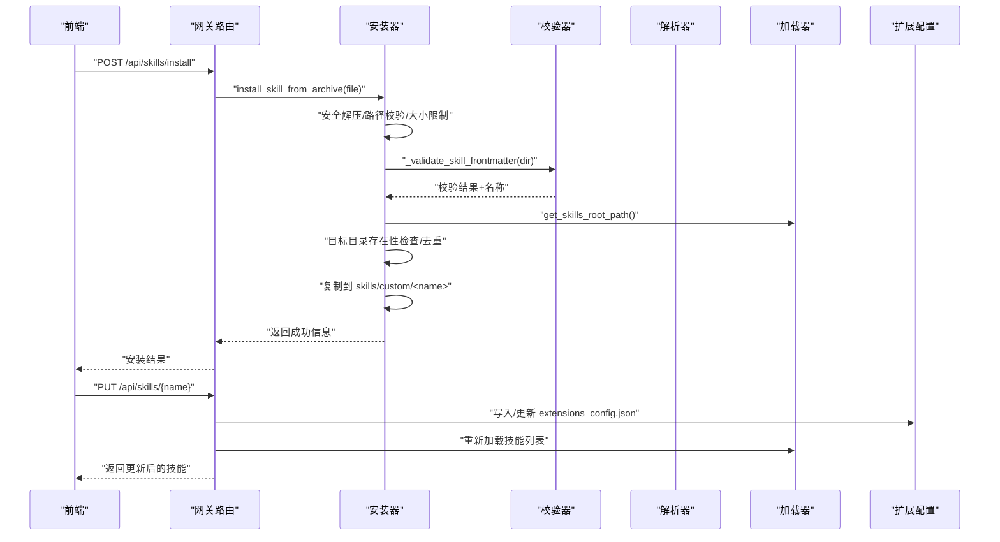
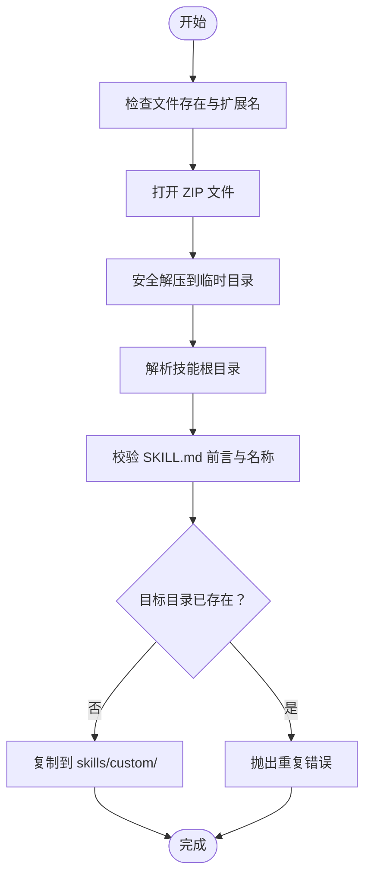
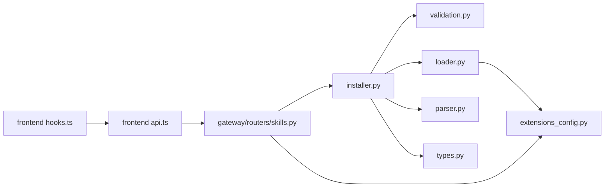

# 技能安装器

<cite>
**本文引用的文件**
- [backend/packages/harness/deerflow/skills/installer.py](file://backend/packages/harness/deerflow/skills/installer.py)
- [backend/packages/harness/deerflow/skills/loader.py](file://backend/packages/harness/deerflow/skills/loader.py)
- [backend/packages/harness/deerflow/skills/parser.py](file://backend/packages/harness/deerflow/skills/parser.py)
- [backend/packages/harness/deerflow/skills/validation.py](file://backend/packages/harness/deerflow/skills/validation.py)
- [backend/packages/harness/deerflow/skills/types.py](file://backend/packages/harness/deerflow/skills/types.py)
- [backend/app/gateway/routers/skills.py](file://backend/app/gateway/routers/skills.py)
- [backend/packages/harness/deerflow/client.py](file://backend/packages/harness/deerflow/client.py)
- [backend/packages/harness/deerflow/config/extensions_config.py](file://backend/packages/harness/deerflow/config/extensions_config.py)
- [backend/tests/test_skills_installer.py](file://backend/tests/test_skills_installer.py)
- [backend/tests/test_client.py](file://backend/tests/test_client.py)
- [frontend/src/core/skills/api.ts](file://frontend/src/core/skills/api.ts)
- [frontend/src/core/skills/hooks.ts](file://frontend/src/core/skills/hooks.ts)
- [skills/public/bootstrap/SKILL.md](file://skills/public/bootstrap/SKILL.md)
- [skills/public/chart-visualization/SKILL.md](file://skills/public/chart-visualization/SKILL.md)
</cite>

## 目录
1. [简介](#简介)
2. [项目结构](#项目结构)
3. [核心组件](#核心组件)
4. [架构总览](#架构总览)
5. [详细组件分析](#详细组件分析)
6. [依赖关系分析](#依赖关系分析)
7. [性能考量](#性能考量)
8. [故障排除指南](#故障排除指南)
9. [结论](#结论)
10. [附录](#附录)

## 简介
本文件面向 DeerFlow 技能安装器，系统性阐述技能包的安装流程与管理机制，覆盖从下载、解压、文件复制到配置更新的完整链路；并深入解析权限管理、依赖解析与冲突处理策略；同时给出卸载、更新与回滚的可操作流程建议，并提供自动化脚本与手动安装指南，以及错误处理、日志记录与故障排除方法。

## 项目结构
技能安装器位于后端“harness”包内，采用纯逻辑模块化设计，不依赖 HTTP/FastAPI，便于在网关与客户端之间复用。前端通过 API 调用网关路由实现安装与启用控制。

图表来源
- [backend/packages/harness/deerflow/skills/installer.py:110-177](file://backend/packages/harness/deerflow/skills/installer.py#L110-L177)
- [backend/packages/harness/deerflow/skills/validation.py:15-86](file://backend/packages/harness/deerflow/skills/validation.py#L15-L86)
- [backend/packages/harness/deerflow/skills/parser.py:7-66](file://backend/packages/harness/deerflow/skills/parser.py#L7-L66)
- [backend/packages/harness/deerflow/skills/loader.py:22-99](file://backend/packages/harness/deerflow/skills/loader.py#L22-L99)
- [backend/packages/harness/deerflow/skills/types.py:5-54](file://backend/packages/harness/deerflow/skills/types.py#L5-L54)
- [backend/app/gateway/routers/skills.py:103-173](file://backend/app/gateway/routers/skills.py#L103-L173)
- [backend/packages/harness/deerflow/client.py:42-42](file://backend/packages/harness/deerflow/client.py#L42-L42)
- [backend/packages/harness/deerflow/config/extensions_config.py:55-200](file://backend/packages/harness/deerflow/config/extensions_config.py#L55-L200)
- [frontend/src/core/skills/api.ts:27-62](file://frontend/src/core/skills/api.ts#L27-L62)
- [frontend/src/core/skills/hooks.ts:15-31](file://frontend/src/core/skills/hooks.ts#L15-L31)

章节来源
- [backend/packages/harness/deerflow/skills/installer.py:1-177](file://backend/packages/harness/deerflow/skills/installer.py#L1-L177)
- [backend/app/gateway/routers/skills.py:103-173](file://backend/app/gateway/routers/skills.py#L103-L173)
- [frontend/src/core/skills/api.ts:1-62](file://frontend/src/core/skills/api.ts#L1-L62)

## 核心组件
- 安装器（installer）
  - 安全解压与路径校验、大小限制、跳过符号链接、过滤 macOS 元数据
  - 从归档中定位技能根目录、校验 SKILL.md 前言、重名检测、复制到 custom 目录
- 校验器（validation）
  - YAML 前言解析、字段白名单、必填项校验、命名规范与长度限制
- 解析器（parser）
  - 提取 name/description/license 等元数据，构建 Skill 对象
- 加载器（loader）
  - 扫描 public/custom 目录，按类别与相对路径组织，读取启用状态
- 类型定义（types）
  - Skill 数据类，容器内路径计算等
- 网关路由（gateway/routers/skills.py）
  - 提供安装与更新接口，调用安装器与扩展配置写入
- 客户端（client.py）
  - 封装安装器调用，支持线程隔离与上传路径解析
- 扩展配置（extensions_config.py）
  - 统一管理 MCP 与技能启用状态，提供默认启用策略

章节来源
- [backend/packages/harness/deerflow/skills/installer.py:24-177](file://backend/packages/harness/deerflow/skills/installer.py#L24-L177)
- [backend/packages/harness/deerflow/skills/validation.py:15-86](file://backend/packages/harness/deerflow/skills/validation.py#L15-L86)
- [backend/packages/harness/deerflow/skills/parser.py:7-66](file://backend/packages/harness/deerflow/skills/parser.py#L7-L66)
- [backend/packages/harness/deerflow/skills/loader.py:22-99](file://backend/packages/harness/deerflow/skills/loader.py#L22-L99)
- [backend/packages/harness/deerflow/skills/types.py:5-54](file://backend/packages/harness/deerflow/skills/types.py#L5-L54)
- [backend/app/gateway/routers/skills.py:103-173](file://backend/app/gateway/routers/skills.py#L103-L173)
- [backend/packages/harness/deerflow/client.py:42-42](file://backend/packages/harness/deerflow/client.py#L42-L42)
- [backend/packages/harness/deerflow/config/extensions_config.py:55-200](file://backend/packages/harness/deerflow/config/extensions_config.py#L55-L200)

## 架构总览
技能安装器遵循“纯业务逻辑 + 路由/客户端适配”的分层设计。安装流程在后端纯逻辑模块完成，网关负责暴露 HTTP 接口，前端通过 API 触发安装与启用。

图表来源
- [backend/app/gateway/routers/skills.py:103-173](file://backend/app/gateway/routers/skills.py#L103-L173)
- [backend/packages/harness/deerflow/skills/installer.py:110-177](file://backend/packages/harness/deerflow/skills/installer.py#L110-L177)
- [backend/packages/harness/deerflow/skills/validation.py:15-86](file://backend/packages/harness/deerflow/skills/validation.py#L15-L86)
- [backend/packages/harness/deerflow/skills/loader.py:22-99](file://backend/packages/harness/deerflow/skills/loader.py#L22-L99)
- [backend/packages/harness/deerflow/config/extensions_config.py:119-200](file://backend/packages/harness/deerflow/config/extensions_config.py#L119-L200)

## 详细组件分析

### 安装器（installer）
- 安全性
  - 拒绝绝对路径与目录穿越成员
  - 跳过符号链接条目
  - 流式写入并累计真实字节数，限制总解压体积以防御压缩炸弹
- 归档解析
  - 自动进入单层目录，过滤 macOS 元数据与隐藏文件
- 安装主流程
  - 校验文件类型与存在性
  - 安全解压至临时目录
  - 解析技能根目录
  - 校验 SKILL.md 前言与名称合法性
  - 检查重名冲突
  - 复制到 skills/custom/<name>

图表来源
- [backend/packages/harness/deerflow/skills/installer.py:110-177](file://backend/packages/harness/deerflow/skills/installer.py#L110-L177)

章节来源
- [backend/packages/harness/deerflow/skills/installer.py:24-177](file://backend/packages/harness/deerflow/skills/installer.py#L24-L177)
- [backend/tests/test_skills_installer.py:103-224](file://backend/tests/test_skills_installer.py#L103-L224)

### 校验器（validation）
- 前言格式与字段白名单
- 必填字段 name/description
- 命名规则（仅小写字母、数字、连字符，长度限制）
- 描述长度与非法字符限制

章节来源
- [backend/packages/harness/deerflow/skills/validation.py:15-86](file://backend/packages/harness/deerflow/skills/validation.py#L15-L86)

### 解析器（parser）
- 从 SKILL.md 中提取 YAML 前言，构造 Skill 对象
- 缺失或格式错误时返回空

章节来源
- [backend/packages/harness/deerflow/skills/parser.py:7-66](file://backend/packages/harness/deerflow/skills/parser.py#L7-L66)

### 加载器（loader）
- 扫描 public/custom 目录，遍历子目录查找 SKILL.md
- 使用解析器生成 Skill 列表
- 读取扩展配置，设置 enabled 字段
- 可按需仅返回启用的技能

章节来源
- [backend/packages/harness/deerflow/skills/loader.py:22-99](file://backend/packages/harness/deerflow/skills/loader.py#L22-L99)
- [backend/packages/harness/deerflow/config/extensions_config.py:185-200](file://backend/packages/harness/deerflow/config/extensions_config.py#L185-L200)

### 类型定义（types）
- Skill 数据类，包含名称、描述、许可证、路径、分类、启用状态等
- 提供容器内路径计算方法

章节来源
- [backend/packages/harness/deerflow/skills/types.py:5-54](file://backend/packages/harness/deerflow/skills/types.py#L5-L54)

### 网关路由（gateway/routers/skills.py）
- 安装接口：接收线程内虚拟路径，解析为真实文件路径，调用安装器
- 更新接口：修改扩展配置文件，刷新启用状态，重新加载技能

章节来源
- [backend/app/gateway/routers/skills.py:103-173](file://backend/app/gateway/routers/skills.py#L103-L173)

### 客户端（client.py）
- 在嵌入式客户端中直接调用安装器，支持线程隔离与上传路径解析
- 与扩展配置交互，确保安装后生效

章节来源
- [backend/packages/harness/deerflow/client.py:42-42](file://backend/packages/harness/deerflow/client.py#L42-L42)

### 扩展配置（extensions_config.py）
- 统一管理 MCP 与技能启用状态
- 默认策略：未配置时对 public/custom 技能启用
- 支持环境变量注入与 JSON 解析

章节来源
- [backend/packages/harness/deerflow/config/extensions_config.py:55-200](file://backend/packages/harness/deerflow/config/extensions_config.py#L55-L200)

## 依赖关系分析
- 安装器依赖校验器与加载器提供的路径解析能力
- 网关路由依赖安装器与扩展配置
- 前端通过 API 间接依赖网关路由与安装器
- 加载器依赖扩展配置决定启用状态

图表来源
- [backend/packages/harness/deerflow/skills/installer.py:14-15](file://backend/packages/harness/deerflow/skills/installer.py#L14-L15)
- [backend/packages/harness/deerflow/skills/loader.py:4-5](file://backend/packages/harness/deerflow/skills/loader.py#L4-L5)
- [backend/app/gateway/routers/skills.py:103-173](file://backend/app/gateway/routers/skills.py#L103-L173)
- [backend/packages/harness/deerflow/config/extensions_config.py:55-200](file://backend/packages/harness/deerflow/config/extensions_config.py#L55-L200)
- [frontend/src/core/skills/api.ts:1-62](file://frontend/src/core/skills/api.ts#L1-L62)
- [frontend/src/core/skills/hooks.ts:1-31](file://frontend/src/core/skills/hooks.ts#L1-L31)

章节来源
- [backend/packages/harness/deerflow/skills/installer.py:14-15](file://backend/packages/harness/deerflow/skills/installer.py#L14-L15)
- [backend/packages/harness/deerflow/skills/loader.py:4-5](file://backend/packages/harness/deerflow/skills/loader.py#L4-L5)
- [backend/app/gateway/routers/skills.py:103-173](file://backend/app/gateway/routers/skills.py#L103-L173)
- [frontend/src/core/skills/api.ts:1-62](file://frontend/src/core/skills/api.ts#L1-L62)

## 性能考量
- 安全解压采用流式写入与累计真实字节，避免一次性内存压力
- 过滤 macOS 元数据与隐藏文件减少无效 IO
- 临时目录使用系统临时空间，安装完成后自动清理
- 扩展配置按需读取，启用状态变更后即时生效

[本节为通用指导，无需列出具体文件来源]

## 故障排除指南
- 安装失败（文件不存在/非 ZIP/扩展名错误）
  - 现象：HTTP 404/400
  - 处理：确认 .skill 文件存在且扩展名为 .skill，文件为有效 ZIP
- 安全性拒绝（绝对路径/目录穿越/符号链接）
  - 现象：抛出异常，记录警告
  - 处理：修正归档内容，移除危险路径与符号链接
- 压缩炸弹防护触发
  - 现象：超过总解压体积阈值
  - 处理：减小归档或拆分子目录
- 重复安装
  - 现象：抛出重复错误
  - 处理：删除已有同名技能或更换名称
- SKILL.md 前言校验失败
  - 现象：校验失败或缺少必要字段
  - 处理：补齐 name/description，符合命名规范
- 启用状态更新失败
  - 现象：写入配置失败或重启后未生效
  - 处理：检查配置文件路径与权限，确认扩展配置已刷新

章节来源
- [backend/tests/test_skills_installer.py:103-224](file://backend/tests/test_skills_installer.py#L103-L224)
- [backend/tests/test_client.py:1754-1811](file://backend/tests/test_client.py#L1754-L1811)
- [backend/app/gateway/routers/skills.py:158-173](file://backend/app/gateway/routers/skills.py#L158-L173)

## 结论
 DeerFlow 技能安装器以纯逻辑模块为核心，结合安全解压、严格校验与启用配置，形成稳定可靠的安装与管理闭环。通过网关与前端的配合，用户可以便捷地安装、启用与管理技能；测试用例覆盖关键安全与边界场景，保障系统稳健运行。

[本节为总结性内容，无需列出具体文件来源]

## 附录

### 技能安装流程（自动化脚本与手动指南）
- 自动化脚本（概念流程）
  - 步骤
    1) 准备 .skill 归档（包含 SKILL.md 与所需资源）
    2) 通过前端界面选择线程与归档路径，调用安装接口
    3) 安装成功后，前往技能列表启用该技能
  - 注意事项
    - 确保归档中 SKILL.md 符合前言规范
    - 若存在依赖（如 Node.js），请在运行环境中满足版本要求
- 手动安装指南（概念步骤）
  - 将 .skill 文件放置于后端可访问位置
  - 通过网关安装接口提交线程 ID 与文件路径
  - 检查 skills/custom 下是否生成对应目录
  - 在前端技能面板启用该技能

[本节为操作性说明，不直接分析具体代码文件，故不附加来源]

### 权限管理、依赖解析与冲突处理
- 权限管理
  - 安装器仅在 skills/custom 下进行写操作，避免越权
  - 安全解压与路径校验防止任意路径写入
- 依赖解析
  - 通过 SKILL.md 的依赖声明（如 Node.js 版本）提示运行环境需求
  - 安装器不自动安装依赖，需用户自行满足
- 冲突处理
  - 同名冲突直接拒绝安装
  - 启用状态通过扩展配置统一管理，避免并发写冲突

章节来源
- [skills/public/chart-visualization/SKILL.md:4-6](file://skills/public/chart-visualization/SKILL.md#L4-L6)
- [backend/packages/harness/deerflow/skills/installer.py:162-168](file://backend/packages/harness/deerflow/skills/installer.py#L162-L168)
- [backend/packages/harness/deerflow/config/extensions_config.py:185-200](file://backend/packages/harness/deerflow/config/extensions_config.py#L185-L200)

### 卸载、更新与回滚建议
- 卸载
  - 删除 skills/custom/<name> 目录
  - 如需保留历史，先备份再删除
- 更新
  - 重新安装新版本 .skill（会覆盖旧文件）
  - 或在前端技能面板切换启用状态
- 回滚
  - 通过备份目录恢复旧版本
  - 或使用版本控制工具管理 skills/custom 目录

[本节为通用实践建议，无需列出具体文件来源]

### 错误处理、日志记录与故障排除
- 错误处理
  - 安装器与网关路由均捕获并转换为标准 HTTP 错误码
  - 客户端与前端对 4xx/5xx 做友好提示
- 日志记录
  - 安装器使用标准日志模块输出关键事件与警告
  - 网关路由记录请求处理与错误堆栈
- 故障排除
  - 检查归档完整性与前言格式
  - 确认目标目录权限与磁盘空间
  - 查看后端日志定位异常

章节来源
- [backend/packages/harness/deerflow/skills/installer.py:130-131](file://backend/packages/harness/deerflow/skills/installer.py#L130-L131)
- [backend/app/gateway/routers/skills.py:167-173](file://backend/app/gateway/routers/skills.py#L167-L173)
- [frontend/src/core/skills/api.ts:49-61](file://frontend/src/core/skills/api.ts#L49-L61)