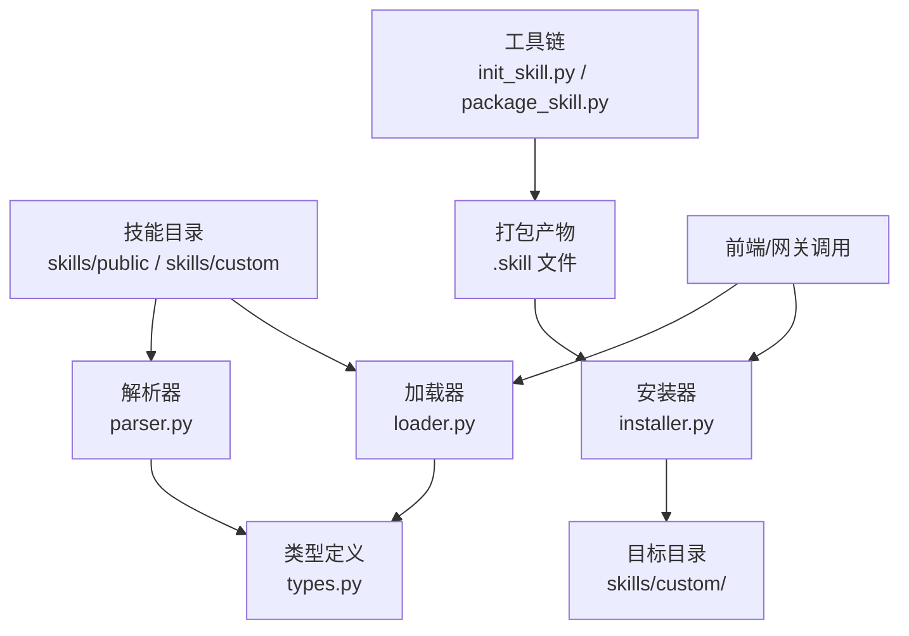
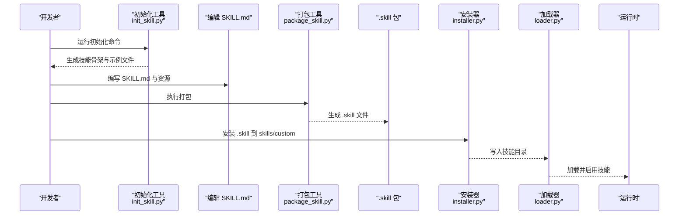
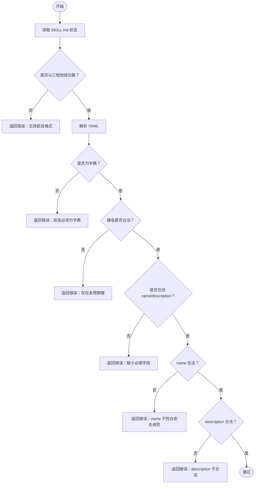
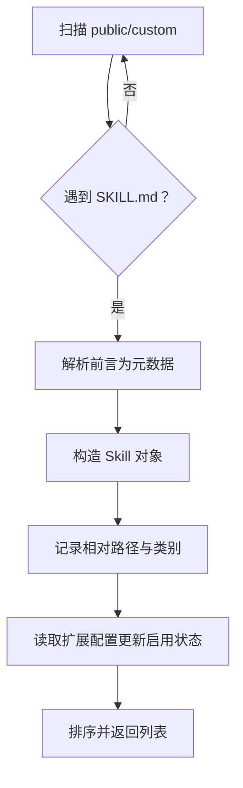
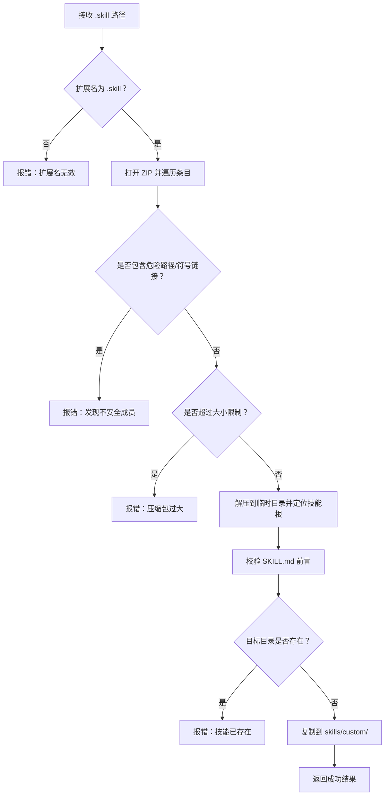
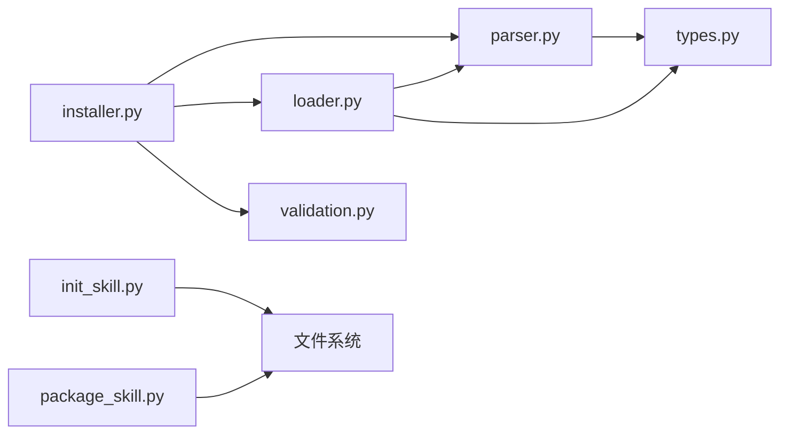

# 技能开发指南

<cite>
**本文引用的文件**
- [skills/public/bootstrap/SKILL.md](file://skills/public/bootstrap/SKILL.md)
- [skills/public/chart-visualization/SKILL.md](file://skills/public/chart-visualization/SKILL.md)
- [skills/public/data-analysis/SKILL.md](file://skills/public/data-analysis/SKILL.md)
- [skills/public/skill-creator/scripts/init_skill.py](file://skills/public/skill-creator/scripts/init_skill.py)
- [skills/public/skill-creator/scripts/package_skill.py](file://skills/public/skill-creator/scripts/package_skill.py)
- [backend/packages/harness/deerflow/skills/__init__.py](file://backend/packages/harness/deerflow/skills/__init__.py)
- [backend/packages/harness/deerflow/skills/types.py](file://backend/packages/harness/deerflow/skills/types.py)
- [backend/packages/harness/deerflow/skills/parser.py](file://backend/packages/harness/deerflow/skills/parser.py)
- [backend/packages/harness/deerflow/skills/validation.py](file://backend/packages/harness/deerflow/skills/validation.py)
- [backend/packages/harness/deerflow/skills/installer.py](file://backend/packages/harness/deerflow/skills/installer.py)
- [backend/packages/harness/deerflow/skills/loader.py](file://backend/packages/harness/deerflow/skills/loader.py)
- [backend/tests/test_skills_parser.py](file://backend/tests/test_skills_parser.py)
- [backend/tests/test_skills_loader.py](file://backend/tests/test_skills_loader.py)
- [backend/tests/test_skills_installer.py](file://backend/tests/test_skills_installer.py)
</cite>

## 目录
1. [简介](#简介)
2. [项目结构](#项目结构)
3. [核心组件](#核心组件)
4. [架构总览](#架构总览)
5. [详细组件分析](#详细组件分析)
6. [依赖分析](#依赖分析)
7. [性能考虑](#性能考虑)
8. [故障排查指南](#故障排查指南)
9. [结论](#结论)
10. [附录](#附录)

## 简介
本指南面向希望在 DeerFlow 平台上开发“技能”的开发者，系统讲解如何从零创建一个可分发、可安装、可启用的技能。内容涵盖：
- 技能项目的初始化与目录结构
- SKILL.md 的编写规范与元数据校验
- 脚本与资源的组织方式
- 最佳实践、代码规范与测试方法
- 完整工作流程：从概念设计到发布部署
- 技能的打包、分发与版本管理
- 开发工具使用与调试技巧
- 模板与示例参考路径

## 项目结构
DeerFlow 的技能体系由“技能目录 + 核心解析/加载/安装逻辑 + 工具链”构成：
- 技能目录位于仓库根下的 skills/public 与 skills/custom（公共与私有）
- 核心逻辑位于 backend/packages/harness/deerflow/skills 下，负责解析 SKILL.md、加载技能、安装 .skill 包等
- 工具链位于 skills/public/skill-creator/scripts，提供初始化、打包、快速验证等能力

图表来源
- [backend/packages/harness/deerflow/skills/parser.py:1-66](file://backend/packages/harness/deerflow/skills/parser.py#L1-L66)
- [backend/packages/harness/deerflow/skills/loader.py:1-99](file://backend/packages/harness/deerflow/skills/loader.py#L1-L99)
- [backend/packages/harness/deerflow/skills/installer.py:1-177](file://backend/packages/harness/deerflow/skills/installer.py#L1-L177)
- [skills/public/skill-creator/scripts/init_skill.py:1-304](file://skills/public/skill-creator/scripts/init_skill.py#L1-L304)
- [skills/public/skill-creator/scripts/package_skill.py:1-137](file://skills/public/skill-creator/scripts/package_skill.py#L1-L137)

章节来源
- [backend/packages/harness/deerflow/skills/__init__.py:1-15](file://backend/packages/harness/deerflow/skills/__init__.py#L1-L15)
- [backend/packages/harness/deerflow/skills/loader.py:1-99](file://backend/packages/harness/deerflow/skills/loader.py#L1-L99)

## 核心组件
- 类型与容器路径：Skill 数据类承载技能元信息与容器内路径计算
- 解析器：从 SKILL.md 提取 YAML 前言元数据，生成 Skill 对象
- 校验器：对 SKILL.md 前言字段进行严格校验（键名、类型、命名规范、长度限制等）
- 加载器：递归扫描 public/custom 目录，结合扩展配置确定启用状态
- 安装器：安全解压 .skill 包，校验前言，写入 skills/custom
- 初始化工具：按模板生成新技能骨架
- 打包工具：将技能目录打包为 .skill 文件，过滤构建产物与元数据

章节来源
- [backend/packages/harness/deerflow/skills/types.py:1-54](file://backend/packages/harness/deerflow/skills/types.py#L1-L54)
- [backend/packages/harness/deerflow/skills/parser.py:1-66](file://backend/packages/harness/deerflow/skills/parser.py#L1-L66)
- [backend/packages/harness/deerflow/skills/validation.py:1-86](file://backend/packages/harness/deerflow/skills/validation.py#L1-L86)
- [backend/packages/harness/deerflow/skills/loader.py:1-99](file://backend/packages/harness/deerflow/skills/loader.py#L1-L99)
- [backend/packages/harness/deerflow/skills/installer.py:1-177](file://backend/packages/harness/deerflow/skills/installer.py#L1-L177)
- [skills/public/skill-creator/scripts/init_skill.py:1-304](file://skills/public/skill-creator/scripts/init_skill.py#L1-L304)
- [skills/public/skill-creator/scripts/package_skill.py:1-137](file://skills/public/skill-creator/scripts/package_skill.py#L1-L137)

## 架构总览
下图展示从“创建技能”到“运行时加载”的端到端流程。

图表来源
- [skills/public/skill-creator/scripts/init_skill.py:1-304](file://skills/public/skill-creator/scripts/init_skill.py#L1-L304)
- [skills/public/skill-creator/scripts/package_skill.py:1-137](file://skills/public/skill-creator/scripts/package_skill.py#L1-L137)
- [backend/packages/harness/deerflow/skills/installer.py:1-177](file://backend/packages/harness/deerflow/skills/installer.py#L1-L177)
- [backend/packages/harness/deerflow/skills/loader.py:1-99](file://backend/packages/harness/deerflow/skills/loader.py#L1-L99)

## 详细组件分析

### 组件一：SKILL.md 编写规范与元数据校验
- 必填字段：name、description
- 允许字段：license、allowed-tools、metadata、compatibility、version、author 等
- 命名约定：仅允许小写字母、数字、连字符；不可以连字符开头或结尾，不可含连续连字符；最大长度限制
- 描述长度与字符限制：描述不可为空，且不得包含尖括号，最大长度限制
- 前言格式：必须以三短划线包裹的 YAML 字典作为前言

图表来源
- [backend/packages/harness/deerflow/skills/validation.py:1-86](file://backend/packages/harness/deerflow/skills/validation.py#L1-L86)

章节来源
- [backend/packages/harness/deerflow/skills/validation.py:1-86](file://backend/packages/harness/deerflow/skills/validation.py#L1-L86)

### 组件二：技能初始化与模板
- 使用 init_skill.py 可一键生成技能骨架，包含：
  - SKILL.md（含占位 TODO）
  - scripts/ 示例脚本
  - references/ 示例参考文档
  - assets/ 示例资产占位
- 生成后需完成 TODO、清理不需要的资源目录，并运行验证

章节来源
- [skills/public/skill-creator/scripts/init_skill.py:1-304](file://skills/public/skill-creator/scripts/init_skill.py#L1-L304)

### 组件三：脚本与资源组织结构
- scripts/：可执行脚本（Python/Shell 等），用于自动化处理、数据转换、调用外部工具
- references/：深度文档、API 参考、流程指南等，适合加载到上下文辅助思考
- assets/：模板、图标、字体、样本数据等，不直接加载到上下文，用于输出阶段使用
- 示例参考：
  - bootstrap：对话式引导，强调“渐进式温暖”与“逐步提取”
  - chart-visualization：图表类型选择、参数提取、JS 生成脚本
  - data-analysis：DuckDB SQL 分析、多表连接、缓存策略

章节来源
- [skills/public/bootstrap/SKILL.md:1-89](file://skills/public/bootstrap/SKILL.md#L1-L89)
- [skills/public/chart-visualization/SKILL.md:1-73](file://skills/public/chart-visualization/SKILL.md#L1-L73)
- [skills/public/data-analysis/SKILL.md:1-249](file://skills/public/data-analysis/SKILL.md#L1-L249)

### 组件四：解析与加载
- 解析：从 SKILL.md 读取前言，构造 Skill 对象（含相对路径、类别、启用状态占位）
- 加载：递归扫描 public/custom，过滤隐藏目录，匹配 SKILL.md，结合扩展配置更新启用状态，最终排序返回

图表来源
- [backend/packages/harness/deerflow/skills/parser.py:1-66](file://backend/packages/harness/deerflow/skills/parser.py#L1-L66)
- [backend/packages/harness/deerflow/skills/loader.py:1-99](file://backend/packages/harness/deerflow/skills/loader.py#L1-L99)

章节来源
- [backend/packages/harness/deerflow/skills/parser.py:1-66](file://backend/packages/harness/deerflow/skills/parser.py#L1-L66)
- [backend/packages/harness/deerflow/skills/loader.py:1-99](file://backend/packages/harness/deerflow/skills/loader.py#L1-L99)

### 组件五：安装与安全校验
- 安全性：拒绝绝对路径与目录穿越、跳过符号链接、限制总解压大小、过滤 macOS 元数据
- 安装流程：校验 .skill 扩展名、解压、定位技能根目录、校验前言、检查重复名称、复制到 skills/custom

图表来源
- [backend/packages/harness/deerflow/skills/installer.py:1-177](file://backend/packages/harness/deerflow/skills/installer.py#L1-L177)

章节来源
- [backend/packages/harness/deerflow/skills/installer.py:1-177](file://backend/packages/harness/deerflow/skills/installer.py#L1-L177)

### 组件六：打包与分发
- 打包工具会：
  - 校验技能目录与 SKILL.md
  - 排除构建产物与元数据（如 __pycache__、node_modules、.DS_Store、*.pyc、evals 等）
  - 将技能目录压缩为 .skill 文件
- 分发建议：
  - 在版本控制中标注版本号，配合 CI 生成 .skill
  - 发布到制品库或内部共享存储，供安装器消费

章节来源
- [skills/public/skill-creator/scripts/package_skill.py:1-137](file://skills/public/skill-creator/scripts/package_skill.py#L1-L137)

## 依赖分析
- 组件内聚与耦合
  - 解析器与校验器紧密协作，前者提取元数据，后者保证合法性
  - 加载器依赖解析器与扩展配置，统一管理启用状态
  - 安装器依赖校验器与加载器提供的根路径，确保安装一致性
- 外部依赖
  - YAML 解析（校验器）
  - ZIP 解压与安全策略（安装器）
  - 文件系统与路径操作（解析器/加载器/安装器）

图表来源
- [backend/packages/harness/deerflow/skills/parser.py:1-66](file://backend/packages/harness/deerflow/skills/parser.py#L1-L66)
- [backend/packages/harness/deerflow/skills/loader.py:1-99](file://backend/packages/harness/deerflow/skills/loader.py#L1-L99)
- [backend/packages/harness/deerflow/skills/installer.py:1-177](file://backend/packages/harness/deerflow/skills/installer.py#L1-L177)
- [backend/packages/harness/deerflow/skills/validation.py:1-86](file://backend/packages/harness/deerflow/skills/validation.py#L1-L86)
- [skills/public/skill-creator/scripts/init_skill.py:1-304](file://skills/public/skill-creator/scripts/init_skill.py#L1-L304)
- [skills/public/skill-creator/scripts/package_skill.py:1-137](file://skills/public/skill-creator/scripts/package_skill.py#L1-L137)

章节来源
- [backend/packages/harness/deerflow/skills/__init__.py:1-15](file://backend/packages/harness/deerflow/skills/__init__.py#L1-L15)

## 性能考虑
- 加载性能
  - 递归扫描时跳过隐藏目录，减少 IO
  - 仅在存在 SKILL.md 时才解析，避免无效遍历
- 安装性能
  - 安全解压采用分块读取，避免内存峰值
  - 通过总大小限制抵御“zip 炸弹”
- 运行时性能
  - 引导类技能强调“渐进式温暖”，减少一次性信息量
  - 分析类技能通过缓存数据库降低重复解析成本

## 故障排查指南
- 解析失败
  - 症状：解析返回空对象
  - 排查：确认 SKILL.md 是否存在、前言是否为合法 YAML、是否包含 name/description
- 校验失败
  - 症状：安装时报“无效技能”
  - 排查：检查 name 是否符合命名规范、description 是否包含非法字符或超长
- 安装失败
  - 症状：报“扩展名无效/不存在/已存在/不安全成员/过大”
  - 排查：确认 .skill 文件、路径安全、目标目录是否已有同名技能
- 加载异常
  - 症状：技能未出现在列表中
  - 排查：确认目录未被隐藏、SKILL.md 存在、启用状态由扩展配置决定

章节来源
- [backend/tests/test_skills_parser.py:1-99](file://backend/tests/test_skills_parser.py#L1-L99)
- [backend/tests/test_skills_loader.py:1-65](file://backend/tests/test_skills_loader.py#L1-L65)
- [backend/tests/test_skills_installer.py:1-224](file://backend/tests/test_skills_installer.py#L1-L224)

## 结论
通过标准化的 SKILL.md 元数据、严格的校验与安全安装流程、清晰的脚本与资源组织，DeerFlow 为技能开发提供了高内聚、低耦合、可扩展的基础设施。遵循本文档的工作流与最佳实践，可高效产出高质量、可复用、可分发的技能模块。

## 附录

### A. 技能开发工作流程（从概念到发布）
- 设计阶段
  - 明确技能目标、触发条件、输出形态
  - 规划目录结构：scripts/references/assets
- 初始化与编写
  - 使用初始化工具生成骨架
  - 完成 SKILL.md 前言与正文
  - 编写脚本与参考材料
- 测试与验证
  - 使用解析/加载/安装相关测试思路进行单元验证
  - 在本地运行安装器验证安全性与正确性
- 打包与分发
  - 使用打包工具生成 .skill
  - 版本化管理与发布
- 集成与启用
  - 通过安装器部署至 skills/custom
  - 在扩展配置中启用技能

章节来源
- [skills/public/skill-creator/scripts/init_skill.py:1-304](file://skills/public/skill-creator/scripts/init_skill.py#L1-L304)
- [skills/public/skill-creator/scripts/package_skill.py:1-137](file://skills/public/skill-creator/scripts/package_skill.py#L1-L137)
- [backend/packages/harness/deerflow/skills/installer.py:1-177](file://backend/packages/harness/deerflow/skills/installer.py#L1-L177)

### B. 示例参考路径
- 对话式引导：bootstrap
  - [skills/public/bootstrap/SKILL.md:1-89](file://skills/public/bootstrap/SKILL.md#L1-L89)
- 图表可视化：chart-visualization
  - [skills/public/chart-visualization/SKILL.md:1-73](file://skills/public/chart-visualization/SKILL.md#L1-L73)
- 数据分析：data-analysis
  - [skills/public/data-analysis/SKILL.md:1-249](file://skills/public/data-analysis/SKILL.md#L1-L249)