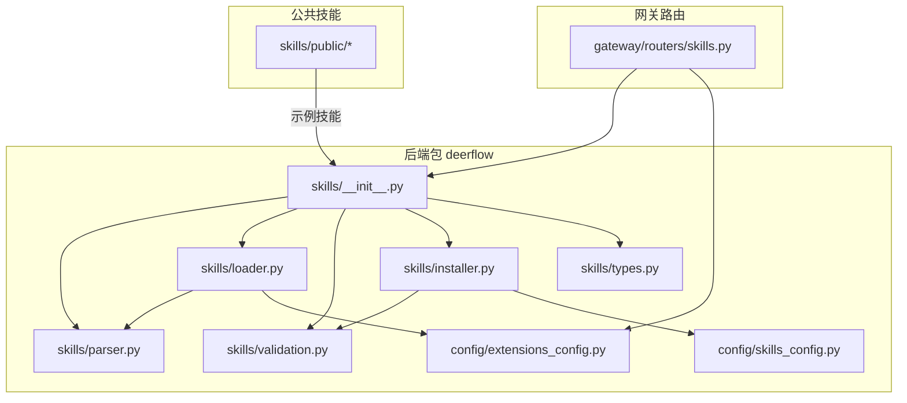
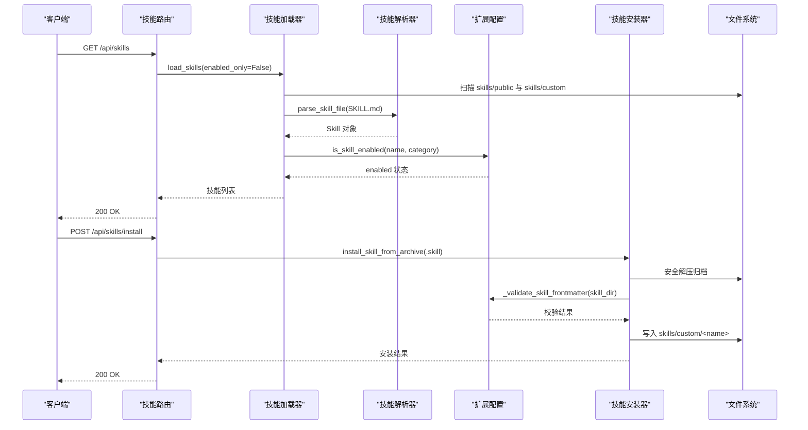
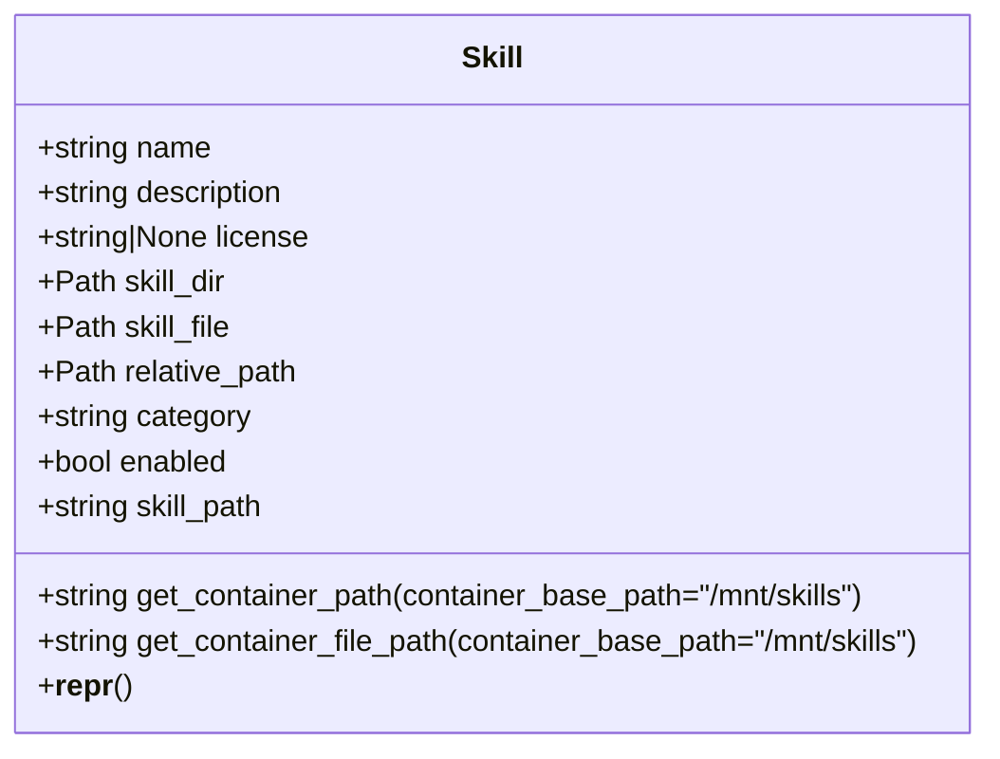
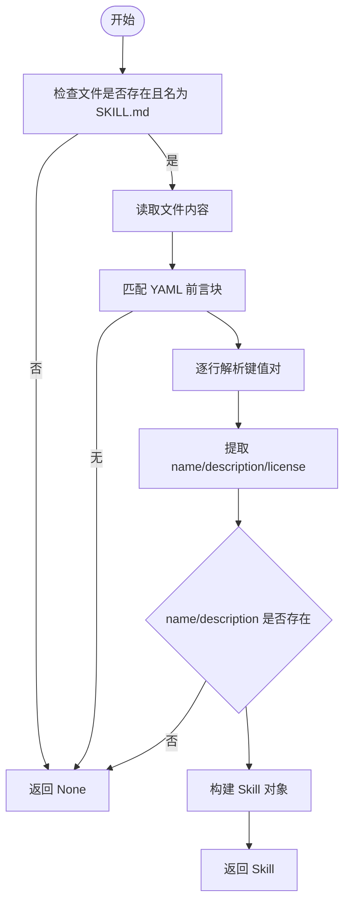
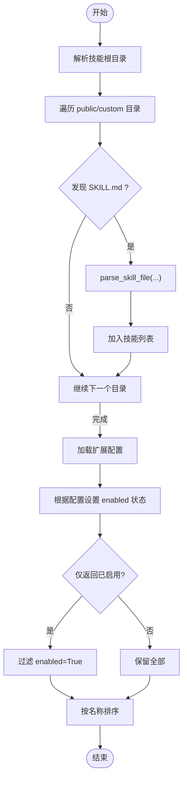
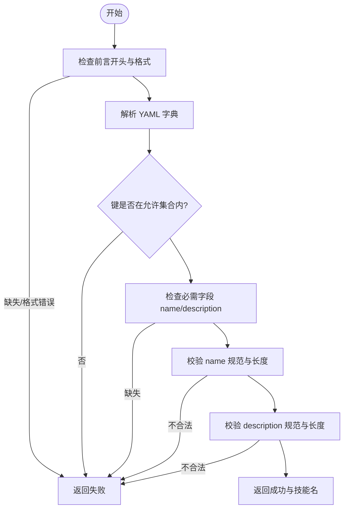
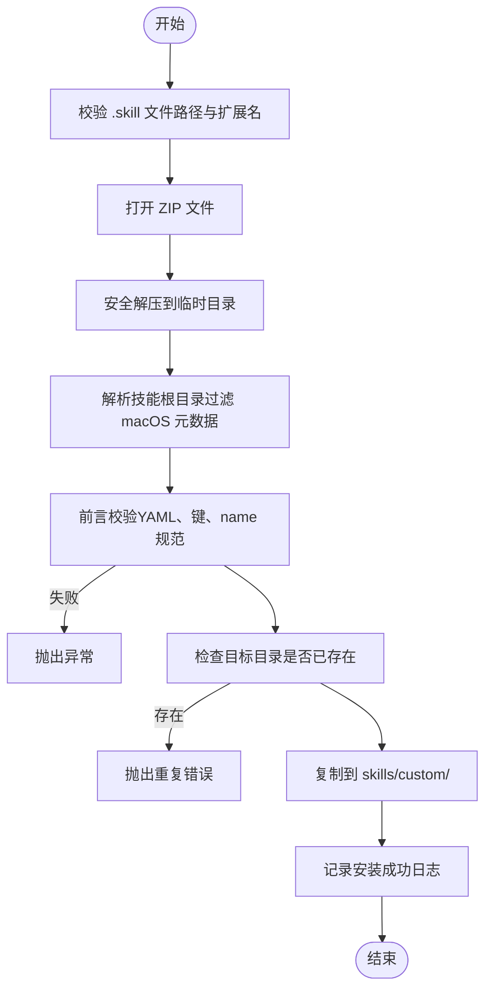
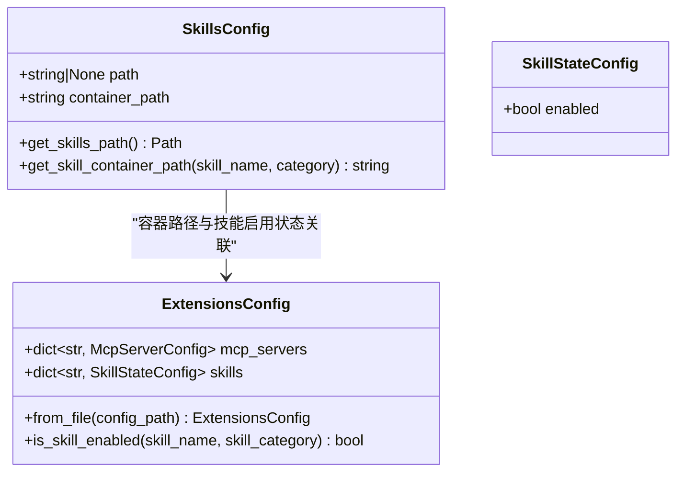
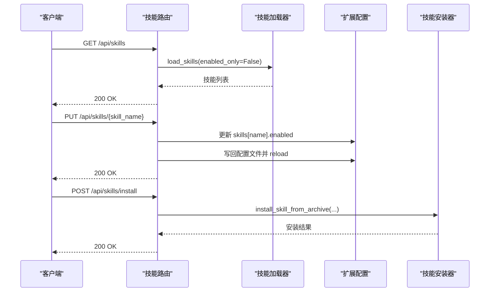
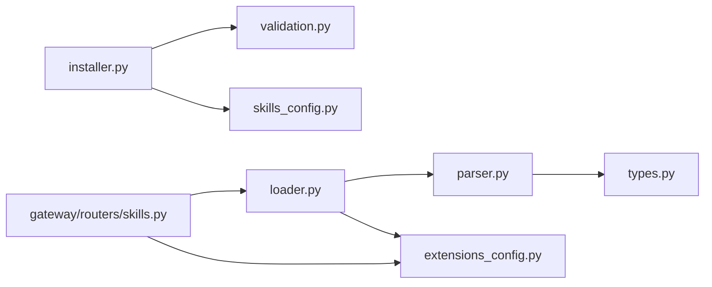

# 技能系统

<cite>
**本文引用的文件**
- [skills/__init__.py](file://backend/packages/harness/deerflow/skills/__init__.py)
- [skills/parser.py](file://backend/packages/harness/deerflow/skills/parser.py)
- [skills/loader.py](file://backend/packages/harness/deerflow/skills/loader.py)
- [skills/validation.py](file://backend/packages/harness/deerflow/skills/validation.py)
- [skills/installer.py](file://backend/packages/harness/deerflow/skills/installer.py)
- [skills/types.py](file://backend/packages/harness/deerflow/skills/types.py)
- [skills_config.py](file://backend/packages/harness/deerflow/config/skills_config.py)
- [extensions_config.py](file://backend/packages/harness/deerflow/config/extensions_config.py)
- [skills 路由器](file://backend/app/gateway/routers/skills.py)
- [bootstrap SKILL.md](file://skills/public/bootstrap/SKILL.md)
- [chart-visualization SKILL.md](file://skills/public/chart-visualization/SKILL.md)
- [data-analysis SKILL.md](file://skills/public/data-analysis/SKILL.md)
- [测试：skills 解析器](file://backend/tests/test_skills_parser.py)
- [测试：skills 加载器](file://backend/tests/test_skills_loader.py)
- [测试：skills 安装器](file://backend/tests/test_skills_installer.py)
</cite>

## 目录
1. [简介](#简介)
2. [项目结构](#项目结构)
3. [核心组件](#核心组件)
4. [架构总览](#架构总览)
5. [组件详解](#组件详解)
6. [依赖关系分析](#依赖关系分析)
7. [性能考量](#性能考量)
8. [故障排查指南](#故障排查指南)
9. [结论](#结论)
10. [附录](#附录)

## 简介
本文件系统性阐述 DeerFlow 技能系统的架构设计、加载机制与生命周期管理，覆盖技能解析器、技能加载器、技能验证器的工作原理与实现细节；同时提供技能开发指南、打包格式与分发机制说明，并给出内置技能使用示例与自定义技能开发教程，最后解释技能与智能体、工具系统的集成关系与调用机制。

## 项目结构
技能系统位于后端包 deerflow 的 skills 子模块中，配合配置模块与网关路由共同构成完整的技能生命周期管理链路。公共技能目录位于仓库根目录下的 skills/public，自定义技能目录位于 skills/custom。

**图表来源**
- [skills/__init__.py:1-15](file://backend/packages/harness/deerflow/skills/__init__.py#L1-L15)
- [skills/loader.py:1-99](file://backend/packages/harness/deerflow/skills/loader.py#L1-L99)
- [skills/installer.py:1-177](file://backend/packages/harness/deerflow/skills/installer.py#L1-L177)
- [skills/validation.py:1-86](file://backend/packages/harness/deerflow/skills/validation.py#L1-L86)
- [skills/types.py:1-54](file://backend/packages/harness/deerflow/skills/types.py#L1-L54)
- [config/skills_config.py:1-50](file://backend/packages/harness/deerflow/config/skills_config.py#L1-L50)
- [config/extensions_config.py:1-259](file://backend/packages/harness/deerflow/config/extensions_config.py#L1-L259)
- [gateway/routers/skills.py:1-174](file://backend/app/gateway/routers/skills.py#L1-L174)

**章节来源**
- [skills/__init__.py:1-15](file://backend/packages/harness/deerflow/skills/__init__.py#L1-L15)
- [skills/loader.py:1-99](file://backend/packages/harness/deerflow/skills/loader.py#L1-L99)
- [skills/installer.py:1-177](file://backend/packages/harness/deerflow/skills/installer.py#L1-L177)
- [skills/validation.py:1-86](file://backend/packages/harness/deerflow/skills/validation.py#L1-L86)
- [skills/types.py:1-54](file://backend/packages/harness/deerflow/skills/types.py#L1-L54)
- [config/skills_config.py:1-50](file://backend/packages/harness/deerflow/config/skills_config.py#L1-L50)
- [config/extensions_config.py:1-259](file://backend/packages/harness/deerflow/config/extensions_config.py#L1-L259)
- [gateway/routers/skills.py:1-174](file://backend/app/gateway/routers/skills.py#L1-L174)

## 核心组件
- 技能数据模型：Skill 数据类封装技能元数据与容器路径计算方法。
- 技能解析器：从 SKILL.md 提取 YAML 前言元数据，构建 Skill 对象。
- 技能加载器：扫描公共与自定义技能目录，解析并应用启用状态配置。
- 技能验证器：校验 SKILL.md 前言字段合法性与命名规范。
- 技能安装器：安全解压 .skill 归档，执行前言校验与重复名检测，写入自定义技能目录。
- 配置模块：SkillsConfig 提供技能目录与容器挂载路径解析；ExtensionsConfig 统一管理 MCP 与技能启用状态。
- 网关路由：提供列出、查询、更新技能启用状态与安装技能的 API。

**章节来源**
- [skills/types.py:1-54](file://backend/packages/harness/deerflow/skills/types.py#L1-L54)
- [skills/parser.py:1-66](file://backend/packages/harness/deerflow/skills/parser.py#L1-L66)
- [skills/loader.py:1-99](file://backend/packages/harness/deerflow/skills/loader.py#L1-L99)
- [skills/validation.py:1-86](file://backend/packages/harness/deerflow/skills/validation.py#L1-L86)
- [skills/installer.py:1-177](file://backend/packages/harness/deerflow/skills/installer.py#L1-L177)
- [config/skills_config.py:1-50](file://backend/packages/harness/deerflow/config/skills_config.py#L1-L50)
- [config/extensions_config.py:1-259](file://backend/packages/harness/deerflow/config/extensions_config.py#L1-L259)
- [gateway/routers/skills.py:1-174](file://backend/app/gateway/routers/skills.py#L1-L174)

## 架构总览
技能系统围绕“配置驱动 + 文件扫描 + 安全安装”的模式工作。加载阶段通过扫描公共与自定义技能目录，解析 SKILL.md 前言元数据，结合扩展配置决定启用状态；安装阶段通过安全解压 .skill 归档，校验前言并写入自定义目录，随后可立即在服务端生效。

**图表来源**
- [gateway/routers/skills.py:66-174](file://backend/app/gateway/routers/skills.py#L66-L174)
- [skills/loader.py:22-99](file://backend/packages/harness/deerflow/skills/loader.py#L22-L99)
- [skills/parser.py:7-66](file://backend/packages/harness/deerflow/skills/parser.py#L7-L66)
- [skills/installer.py:110-177](file://backend/packages/harness/deerflow/skills/installer.py#L110-L177)
- [config/extensions_config.py:185-199](file://backend/packages/harness/deerflow/config/extensions_config.py#L185-L199)

## 组件详解

### 技能数据模型（Skill）
Skill 是技能的核心数据载体，包含名称、描述、许可证、目录路径、相对路径、分类与启用状态等字段，并提供容器内路径计算方法，便于在沙箱或容器环境中定位技能文件。

**图表来源**
- [skills/types.py:5-54](file://backend/packages/harness/deerflow/skills/types.py#L5-L54)

**章节来源**
- [skills/types.py:1-54](file://backend/packages/harness/deerflow/skills/types.py#L1-L54)

### 技能解析器（parse_skill_file）
解析 SKILL.md 中的 YAML 前言元数据，提取 name 与 description 等必要字段，构造 Skill 对象。若缺少必要字段或文件名不为 SKILL.md，则返回空值。

**图表来源**
- [skills/parser.py:7-66](file://backend/packages/harness/deerflow/skills/parser.py#L7-L66)

**章节来源**
- [skills/parser.py:1-66](file://backend/packages/harness/deerflow/skills/parser.py#L1-L66)

### 技能加载器（load_skills）
扫描公共与自定义技能目录，递归遍历并解析 SKILL.md；随后读取扩展配置文件，按技能名称与分类设置启用状态；最终按名称排序返回技能列表。

**图表来源**
- [skills/loader.py:22-99](file://backend/packages/harness/deerflow/skills/loader.py#L22-L99)
- [skills/parser.py:7-66](file://backend/packages/harness/deerflow/skills/parser.py#L7-L66)
- [config/extensions_config.py:185-199](file://backend/packages/harness/deerflow/config/extensions_config.py#L185-L199)

**章节来源**
- [skills/loader.py:1-99](file://backend/packages/harness/deerflow/skills/loader.py#L1-L99)
- [config/extensions_config.py:1-259](file://backend/packages/harness/deerflow/config/extensions_config.py#L1-L259)

### 技能验证器（_validate_skill_frontmatter）
对 SKILL.md 前言进行严格校验：要求存在 YAML 前言、键值为字典、不允许意外键、必须包含 name 与 description；对 name 进行命名规范校验（hyphen-case、长度限制等）；对 description 进行长度与字符限制。

**图表来源**
- [skills/validation.py:15-86](file://backend/packages/harness/deerflow/skills/validation.py#L15-L86)

**章节来源**
- [skills/validation.py:1-86](file://backend/packages/harness/deerflow/skills/validation.py#L1-L86)

### 技能安装器（install_skill_from_archive）
支持从 .skill 归档安全安装技能：校验扩展名、打开 ZIP、安全解压（拒绝绝对路径/穿越、跳过符号链接、限制总大小）、解析技能目录、执行前言校验、检测重复名、复制到 skills/custom 并记录日志。

**图表来源**
- [skills/installer.py:110-177](file://backend/packages/harness/deerflow/skills/installer.py#L110-L177)
- [skills/validation.py:15-86](file://backend/packages/harness/deerflow/skills/validation.py#L15-L86)

**章节来源**
- [skills/installer.py:1-177](file://backend/packages/harness/deerflow/skills/installer.py#L1-L177)

### 配置模块
- SkillsConfig：提供技能目录路径解析与容器内路径拼接能力，默认相对路径指向后端同级的 skills 目录。
- ExtensionsConfig：统一管理 MCP 服务器与技能启用状态，支持从多个位置解析配置文件，提供 is_skill_enabled 判定逻辑。

**图表来源**
- [config/skills_config.py:6-50](file://backend/packages/harness/deerflow/config/skills_config.py#L6-L50)
- [config/extensions_config.py:49-259](file://backend/packages/harness/deerflow/config/extensions_config.py#L49-L259)

**章节来源**
- [config/skills_config.py:1-50](file://backend/packages/harness/deerflow/config/skills_config.py#L1-L50)
- [config/extensions_config.py:1-259](file://backend/packages/harness/deerflow/config/extensions_config.py#L1-L259)

### 网关路由（技能 API）
提供以下接口：
- GET /api/skills：列出所有技能（可选仅启用）。
- GET /api/skills/{skill_name}：按名称获取技能详情。
- PUT /api/skills/{skill_name}：更新技能启用状态，写回扩展配置文件并重载缓存。
- POST /api/skills/install：从线程上下文中的 .skill 文件安装技能。

**图表来源**
- [gateway/routers/skills.py:66-174](file://backend/app/gateway/routers/skills.py#L66-L174)
- [skills/loader.py:22-99](file://backend/packages/harness/deerflow/skills/loader.py#L22-L99)
- [skills/installer.py:110-177](file://backend/packages/harness/deerflow/skills/installer.py#L110-L177)
- [config/extensions_config.py:220-236](file://backend/packages/harness/deerflow/config/extensions_config.py#L220-L236)

**章节来源**
- [gateway/routers/skills.py:1-174](file://backend/app/gateway/routers/skills.py#L1-L174)

## 依赖关系分析
- 模块内聚与耦合
  - skills 模块内部以 loader 为核心协调 parser、validation、installer 与 types，形成清晰的职责边界。
  - loader 依赖 parser 与扩展配置；installer 依赖 validation 与 SkillsConfig；路由依赖 skills 包与扩展配置。
- 外部依赖
  - 使用 pathlib、yaml、zipfile、logging 等标准库；FastAPI 用于路由层。
- 循环依赖
  - 未见循环导入迹象；loader 与 installer 通过函数调用而非直接导入彼此实现细节。

**图表来源**
- [skills/loader.py:1-99](file://backend/packages/harness/deerflow/skills/loader.py#L1-L99)
- [skills/installer.py:1-177](file://backend/packages/harness/deerflow/skills/installer.py#L1-L177)
- [skills/parser.py:1-66](file://backend/packages/harness/deerflow/skills/parser.py#L1-L66)
- [skills/validation.py:1-86](file://backend/packages/harness/deerflow/skills/validation.py#L1-L86)
- [skills/types.py:1-54](file://backend/packages/harness/deerflow/skills/types.py#L1-L54)
- [config/skills_config.py:1-50](file://backend/packages/harness/deerflow/config/skills_config.py#L1-L50)
- [config/extensions_config.py:1-259](file://backend/packages/harness/deerflow/config/extensions_config.py#L1-L259)
- [gateway/routers/skills.py:1-174](file://backend/app/gateway/routers/skills.py#L1-L174)

**章节来源**
- [skills/loader.py:1-99](file://backend/packages/harness/deerflow/skills/loader.py#L1-L99)
- [skills/installer.py:1-177](file://backend/packages/harness/deerflow/skills/installer.py#L1-L177)
- [skills/parser.py:1-66](file://backend/packages/harness/deerflow/skills/parser.py#L1-L66)
- [skills/validation.py:1-86](file://backend/packages/harness/deerflow/skills/validation.py#L1-L86)
- [skills/types.py:1-54](file://backend/packages/harness/deerflow/skills/types.py#L1-L54)
- [config/skills_config.py:1-50](file://backend/packages/harness/deerflow/config/skills_config.py#L1-L50)
- [config/extensions_config.py:1-259](file://backend/packages/harness/deerflow/config/extensions_config.py#L1-L259)
- [gateway/routers/skills.py:1-174](file://backend/app/gateway/routers/skills.py#L1-L174)

## 性能考量
- 加载性能
  - 递归扫描采用固定顺序与隐藏目录过滤，避免不必要的 IO 开销。
  - 启用状态读取使用独立配置文件，避免每次请求都解析大量技能文件。
- 安装性能
  - 安全解压过程限制总写入量，防止 zip bomb；跳过符号链接减少无效写入。
- 缓存策略
  - 扩展配置提供缓存实例与重载机制，便于在配置变更后快速生效。

[本节为通用指导，无需特定文件来源]

## 故障排查指南
- 常见问题与处理
  - SKILL.md 缺失或格式错误：解析器会返回空值，需确保前言以 YAML 格式包裹。
  - 命名不合规：name 必须符合 hyphen-case 且长度限制，否则验证失败。
  - 安装重复：目标目录已存在同名技能时抛出重复错误，请修改名称或删除旧版本。
  - 安全风险：安装器拒绝绝对路径、目录穿越与符号链接，遇到异常请检查归档内容。
  - 配置未生效：更新技能启用状态后需写回扩展配置并重载缓存。
- 单元测试参考
  - 解析器测试覆盖了缺失字段、无前言、错误文件名等情况。
  - 加载器测试验证了嵌套目录发现与容器路径计算。
  - 安装器测试覆盖了 zip bomb、绝对路径、符号链接、macOS 元数据过滤等场景。

**章节来源**
- [测试：skills 解析器:1-99](file://backend/tests/test_skills_parser.py#L1-L99)
- [测试：skills 加载器:1-65](file://backend/tests/test_skills_loader.py#L1-L65)
- [测试：skills 安装器:1-224](file://backend/tests/test_skills_installer.py#L1-L224)

## 结论
 DeerFlow 技能系统通过“配置驱动 + 文件扫描 + 安全安装”实现了可扩展、可审计、可运维的技能生命周期管理。解析器、加载器、验证器与安装器各司其职，配合扩展配置与网关路由，既满足内置技能的即插即用，也支持自定义技能的安全分发与动态启用。

[本节为总结，无需特定文件来源]

## 附录

### 技能开发指南
- 目录结构
  - 在 skills/public 或 skills/custom 下创建以技能名命名的目录，并在其中放置 SKILL.md。
- SKILL.md 前言字段
  - 必填：name、description；可选：license、allowed-tools、metadata、compatibility、version、author。
  - 命名规范：hyphen-case（小写字母、数字、连字符），长度不超过 64，不可以连字符开头或结尾，不可包含连续连字符。
- 示例参考
  - bootstrap：交互式引导生成 SOUL.md 的完整流程与工具调用示例。
  - chart-visualization：基于 Node.js 的图表生成工作流与参数规范。
  - data-analysis：基于 DuckDB 的数据分析脚本与 SQL 查询模式。

**章节来源**
- [bootstrap SKILL.md:1-89](file://skills/public/bootstrap/SKILL.md#L1-L89)
- [chart-visualization SKILL.md:1-73](file://skills/public/chart-visualization/SKILL.md#L1-L73)
- [data-analysis SKILL.md:1-249](file://skills/public/data-analysis/SKILL.md#L1-L249)

### 技能打包与分发
- 打包格式
  - .skill 归档：ZIP 格式，顶层可为技能目录或单个技能目录；归档中应包含 SKILL.md 与相关资源文件。
- 安全要求
  - 安装器会拒绝绝对路径、目录穿越、符号链接与 macOS 元数据目录；限制总解压大小以防御 zip bomb。
- 分发方式
  - 将 .skill 文件上传至线程的用户输出目录，通过网关 API 的安装接口进行安装。

**章节来源**
- [skills/installer.py:67-177](file://backend/packages/harness/deerflow/skills/installer.py#L67-L177)
- [gateway/routers/skills.py:152-174](file://backend/app/gateway/routers/skills.py#L152-L174)

### 技能与智能体、工具系统的集成
- 容器路径映射
  - SkillsConfig 提供容器内挂载路径拼接方法，便于在沙箱中定位技能文件。
- 工具调用
  - 内置技能示例中展示了如何调用工具（如 setup_agent）完成后续动作，开发者可在技能脚本中按需调用工具系统提供的工具。
- 生命周期管理
  - 通过扩展配置控制技能启用状态；安装后可立即在服务端生效；更新启用状态需写回配置并重载缓存。

**章节来源**
- [config/skills_config.py:38-50](file://backend/packages/harness/deerflow/config/skills_config.py#L38-L50)
- [config/extensions_config.py:185-199](file://backend/packages/harness/deerflow/config/extensions_config.py#L185-L199)
- [bootstrap SKILL.md:73-78](file://skills/public/bootstrap/SKILL.md#L73-L78)