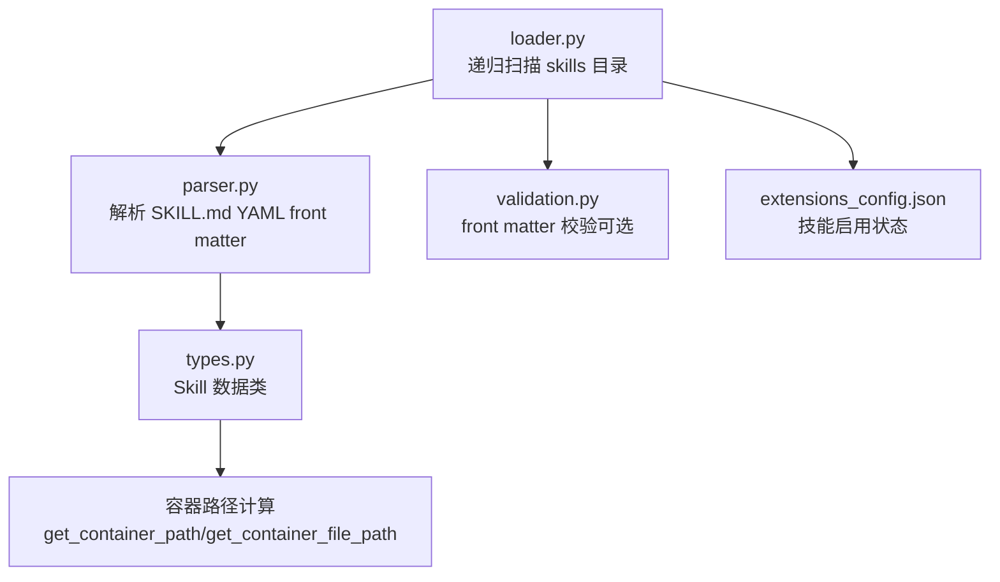
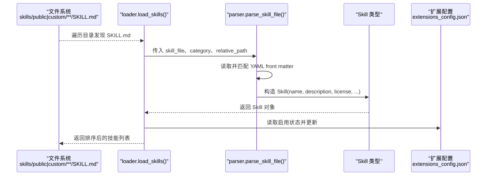
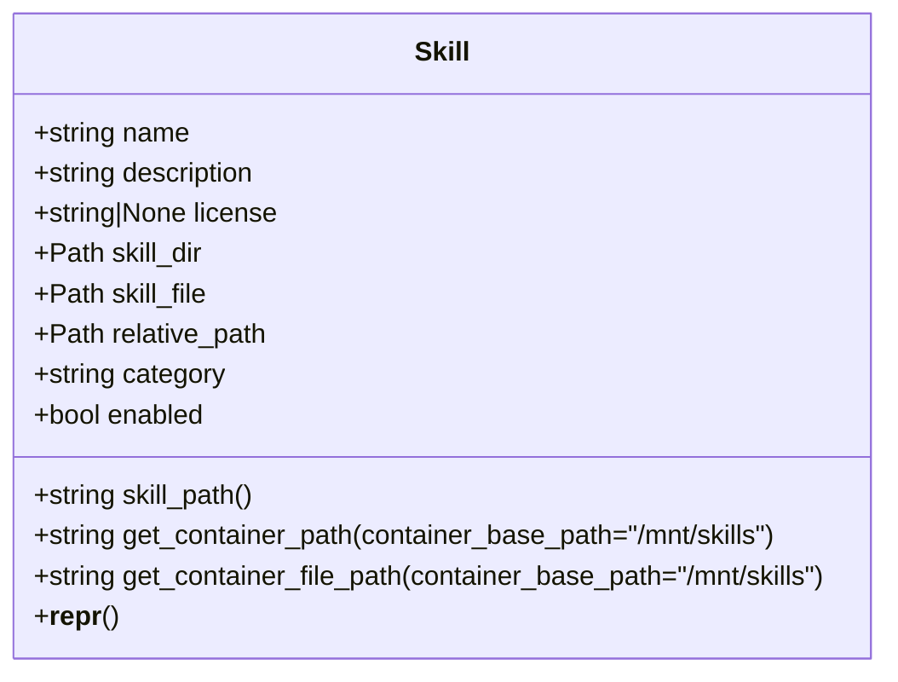
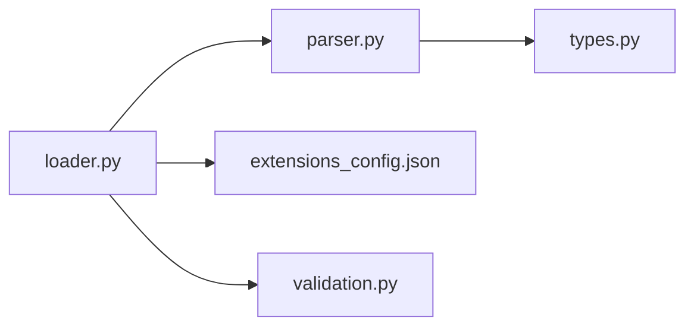
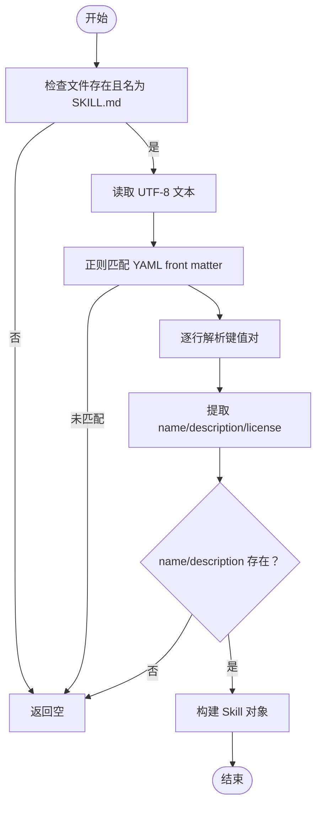
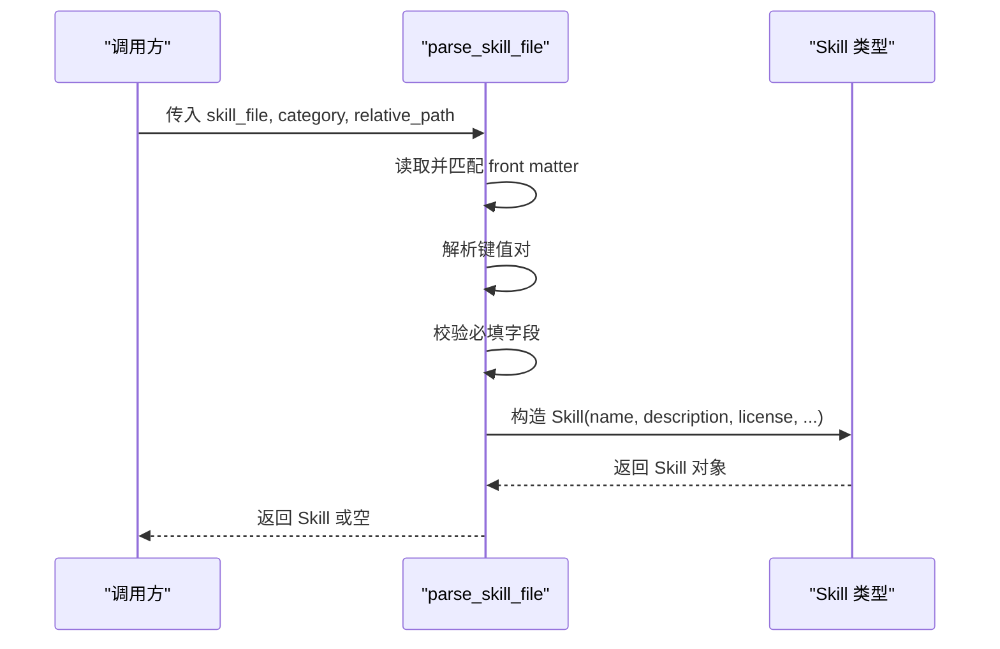

# 技能解析器

<cite>
**本文引用的文件**
- [parser.py](file://backend/packages/harness/deerflow/skills/parser.py)
- [loader.py](file://backend/packages/harness/deerflow/skills/loader.py)
- [validation.py](file://backend/packages/harness/deerflow/skills/validation.py)
- [types.py](file://backend/packages/harness/deerflow/skills/types.py)
- [test_skills_parser.py](file://backend/tests/test_skills_parser.py)
- [test_skills_loader.py](file://backend/tests/test_skills_loader.py)
- [SKILL.md（bootstrap）](file://skills/public/bootstrap/SKILL.md)
- [SKILL.md（chart-visualization）](file://skills/public/chart-visualization/SKILL.md)
- [SKILL.md（data-analysis）](file://skills/public/data-analysis/SKILL.md)
- [SKILL.md（skill-creator）](file://skills/public/skill-creator/SKILL.md)
</cite>

## 目录
1. [简介](#简介)
2. [项目结构](#项目结构)
3. [核心组件](#核心组件)
4. [架构总览](#架构总览)
5. [详细组件分析](#详细组件分析)
6. [依赖关系分析](#依赖关系分析)
7. [性能考量](#性能考量)
8. [故障排查指南](#故障排查指南)
9. [结论](#结论)
10. [附录](#附录)

## 简介
本文件面向 DeerFlow 技能解析器，系统化阐述其从 SKILL.md 文件中提取技能元数据的完整流程与规则，覆盖以下方面：
- 元数据字段：名称、描述、许可证、兼容性、版本、作者等的提取与校验策略
- Markdown 语法与 YAML front matter 规范
- 解析算法与错误处理机制
- 对不同技能格式的兼容性与边界条件
- 标准 SKILL.md 示例与调试方法

## 项目结构
技能解析器位于后端 Python 包 deerflow.skills 下，主要由以下模块组成：
- parser.py：负责读取 SKILL.md 并解析 YAML front matter，生成 Skill 数据对象
- loader.py：递归扫描 skills 目录，调用解析器加载所有技能，并结合扩展配置更新启用状态
- validation.py：对 SKILL.md front matter 进行严格校验（纯逻辑，无 HTTP 依赖）
- types.py：定义 Skill 数据模型及其容器路径计算方法
- tests：单元测试覆盖解析器与加载器的行为边界

图表来源
- [loader.py:22-99](file://backend/packages/harness/deerflow/skills/loader.py#L22-L99)
- [parser.py:7-66](file://backend/packages/harness/deerflow/skills/parser.py#L7-L66)
- [validation.py:15-86](file://backend/packages/harness/deerflow/skills/validation.py#L15-L86)
- [types.py:5-54](file://backend/packages/harness/deerflow/skills/types.py#L5-L54)

章节来源
- [loader.py:8-99](file://backend/packages/harness/deerflow/skills/loader.py#L8-L99)
- [parser.py:1-66](file://backend/packages/harness/deerflow/skills/parser.py#L1-L66)
- [validation.py:1-86](file://backend/packages/harness/deerflow/skills/validation.py#L1-L86)
- [types.py:1-54](file://backend/packages/harness/deerflow/skills/types.py#L1-L54)

## 核心组件
- Skill 数据模型：包含名称、描述、许可证、技能目录路径、相对路径、分类（public/custom）、启用状态等
- 解析器：从 SKILL.md 中抽取 YAML front matter，构造 Skill 对象；缺失必要字段或文件名不匹配时返回空
- 加载器：遍历 skills/public 与 skills/custom，发现 SKILL.md 后调用解析器；随后读取扩展配置更新启用状态
- 校验器：对 front matter 字段进行更严格的类型、长度、命名规范与内容限制检查

章节来源
- [types.py:5-54](file://backend/packages/harness/deerflow/skills/types.py#L5-L54)
- [parser.py:7-66](file://backend/packages/harness/deerflow/skills/parser.py#L7-L66)
- [loader.py:22-99](file://backend/packages/harness/deerflow/skills/loader.py#L22-L99)
- [validation.py:15-86](file://backend/packages/harness/deerflow/skills/validation.py#L15-L86)

## 架构总览
下图展示从文件系统到 Skill 对象的端到端流程：

图表来源
- [loader.py:22-99](file://backend/packages/harness/deerflow/skills/loader.py#L22-L99)
- [parser.py:7-66](file://backend/packages/harness/deerflow/skills/parser.py#L7-L66)
- [types.py:5-54](file://backend/packages/harness/deerflow/skills/types.py#L5-L54)

## 详细组件分析

### 解析器（parser.py）
职责与行为
- 输入：SKILL.md 文件路径、分类（public/custom）、可选相对路径
- 输出：Skill 对象或空值
- 关键步骤：
  - 校验文件存在且名为 SKILL.md
  - 读取 UTF-8 文本
  - 使用正则匹配 YAML front matter（三短划线包裹）
  - 简单键值解析（按行拆分，冒号分割键值），忽略空行
  - 提取必需字段：name、description；可选字段：license
  - 构造 Skill 对象，设置默认启用状态与相对路径

错误处理
- 缺少 front matter 或格式不正确：返回空
- 必需字段缺失：返回空
- 其他异常：打印错误并返回空

复杂度与性能
- 时间复杂度：O(n)，n 为 front matter 行数
- 空间复杂度：O(n)
- I/O：单次读取 SKILL.md，常量级内存

兼容性
- 支持任意顺序的 front matter 键值
- 支持描述中包含冒号字符
- 不强制要求 license 存在

章节来源
- [parser.py:7-66](file://backend/packages/harness/deerflow/skills/parser.py#L7-L66)

### 加载器（loader.py）
职责与行为
- 获取 skills 根目录（与 backend 同级）
- 递归扫描 public 与 custom 两类目录，跳过隐藏目录
- 发现 SKILL.md 即调用解析器
- 读取扩展配置（ExtensionsConfig）更新每个技能的启用状态
- 可按启用状态过滤结果
- 最终按名称排序返回

边界与健壮性
- 路径不存在时返回空列表
- 配置读取失败时回退为全部启用
- 目录遍历保持确定性（排序隐藏目录）

章节来源
- [loader.py:22-99](file://backend/packages/harness/deerflow/skills/loader.py#L22-L99)

### 校验器（validation.py）
职责与行为
- 纯逻辑校验，不依赖 HTTP 或框架
- 支持的 front matter 键集合：name、description、license、allowed-tools、metadata、compatibility、version、author
- 校验项：
  - 必须存在 front matter（三短划线开头）
  - front matter 必须是合法 YAML 字典
  - 不允许出现未支持的键
  - 必填键：name、description
  - name：字符串、非空、仅小写字母、数字、连字符；不可以连字符开头/结尾或包含连续连字符；长度不超过 64
  - description：字符串、可选角括号限制、长度不超过 1024
- 返回：是否有效、消息、技能名

章节来源
- [validation.py:15-86](file://backend/packages/harness/deerflow/skills/validation.py#L15-L86)

### 数据模型（types.py）
职责与行为
- 定义 Skill 数据类，包含：
  - 基础元数据：name、description、license
  - 路径信息：skill_dir、skill_file、relative_path、category
  - 启用状态：enabled
  - 工具方法：
    - skill_path：从 category 根到技能目录的相对路径
    - get_container_path：容器内挂载路径
    - get_container_file_path：容器内 SKILL.md 路径

章节来源
- [types.py:5-54](file://backend/packages/harness/deerflow/skills/types.py#L5-L54)

### 类关系图（代码级）

图表来源
- [types.py:5-54](file://backend/packages/harness/deerflow/skills/types.py#L5-L54)

## 依赖关系分析
- loader 依赖 parser 与 types
- loader 依赖扩展配置（ExtensionsConfig）以决定启用状态
- parser 依赖 types
- validation 独立于 HTTP 层，可被上层选择性调用

图表来源
- [loader.py:22-99](file://backend/packages/harness/deerflow/skills/loader.py#L22-L99)
- [parser.py:7-66](file://backend/packages/harness/deerflow/skills/parser.py#L7-L66)
- [validation.py:15-86](file://backend/packages/harness/deerflow/skills/validation.py#L15-L86)
- [types.py:5-54](file://backend/packages/harness/deerflow/skills/types.py#L5-L54)

章节来源
- [loader.py:22-99](file://backend/packages/harness/deerflow/skills/loader.py#L22-L99)
- [parser.py:7-66](file://backend/packages/harness/deerflow/skills/parser.py#L7-L66)
- [validation.py:15-86](file://backend/packages/harness/deerflow/skills/validation.py#L15-L86)
- [types.py:5-54](file://backend/packages/harness/deerflow/skills/types.py#L5-L54)

## 性能考量
- 解析器对 front matter 的逐行扫描为 O(n)，通常 SKILL.md 的 front matter 很短，开销可忽略
- 加载器遍历目录树，时间复杂度近似 O(N)，其中 N 为发现的 SKILL.md 数量
- 建议：
  - 控制 front matter 字段数量与长度，避免冗余
  - 在 CI 中使用 validation.py 做前置校验，减少运行期失败
  - 对大型 skills 目录，可考虑缓存已解析的技能列表（视具体部署场景）

## 故障排查指南
常见问题与定位方法
- 解析返回空
  - 检查文件名是否为 SKILL.md
  - 检查 front matter 是否以三短划线包裹且存在 name 与 description
  - 检查编码是否为 UTF-8
- 加载不到技能
  - 确认 skills 根目录存在且包含 public/custom
  - 排查隐藏目录导致的遗漏
- 启用状态异常
  - 检查扩展配置文件是否存在且可读
  - 若配置读取失败，加载器会回退为全部启用
- 校验失败
  - 使用 validation.py 的校验函数获取明确错误信息
  - 特别关注 name 的命名规范与 description 的长度与字符限制

调试建议
- 使用最小 front matter 示例进行回归测试
- 在 CI 中加入 validation 步骤
- 通过单元测试覆盖边界情况（如空 front matter、缺少必填字段、错误文件名等）

章节来源
- [parser.py:63-66](file://backend/packages/harness/deerflow/skills/parser.py#L63-L66)
- [loader.py:81-90](file://backend/packages/harness/deerflow/skills/loader.py#L81-L90)
- [validation.py:15-86](file://backend/packages/harness/deerflow/skills/validation.py#L15-L86)
- [test_skills_parser.py:15-99](file://backend/tests/test_skills_parser.py#L15-L99)
- [test_skills_loader.py:15-65](file://backend/tests/test_skills_loader.py#L15-L65)

## 结论
技能解析器以简洁稳健的方式实现了从 SKILL.md 到 Skill 对象的映射，具备良好的可维护性与可扩展性。通过 loader 的递归扫描与扩展配置集成，系统能够稳定地管理大量技能资源。建议在开发与发布流程中引入 validation.py 的校验，确保 front matter 的一致性与合规性。

## 附录

### SKILL.md 标准格式与字段说明
- 必填字段
  - name：技能标识符，采用“连字符式”命名（小写、数字、连字符，不含连续连字符，长度≤64）
  - description：触发与能力描述，长度≤1024，禁止包含角括号
- 可选字段
  - license：许可证文本
  - compatibility：工具/依赖兼容性声明（可选）
  - version：版本号（可选）
  - author：作者信息（可选）
  - allowed-tools、metadata：保留供扩展使用（见校验白名单）

示例参考
- [SKILL.md（bootstrap）](file://skills/public/bootstrap/SKILL.md)
- [SKILL.md（chart-visualization）](file://skills/public/chart-visualization/SKILL.md)
- [SKILL.md（data-analysis）](file://skills/public/data-analysis/SKILL.md)
- [SKILL.md（skill-creator）](file://skills/public/skill-creator/SKILL.md)

章节来源
- [validation.py:11-12](file://backend/packages/harness/deerflow/skills/validation.py#L11-L12)
- [validation.py:52-84](file://backend/packages/harness/deerflow/skills/validation.py#L52-L84)
- [parser.py:44-50](file://backend/packages/harness/deerflow/skills/parser.py#L44-L50)

### 解析算法流程图

图表来源
- [parser.py:18-61](file://backend/packages/harness/deerflow/skills/parser.py#L18-L61)

### 解析器调用序列图

图表来源
- [parser.py:7-66](file://backend/packages/harness/deerflow/skills/parser.py#L7-L66)
- [types.py:5-54](file://backend/packages/harness/deerflow/skills/types.py#L5-L54)