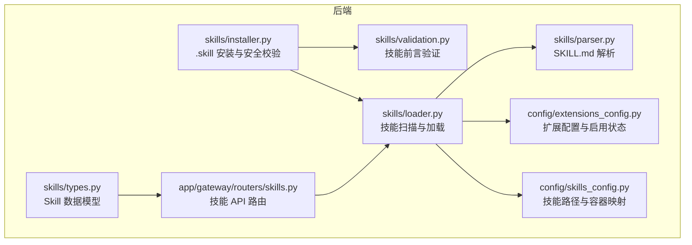
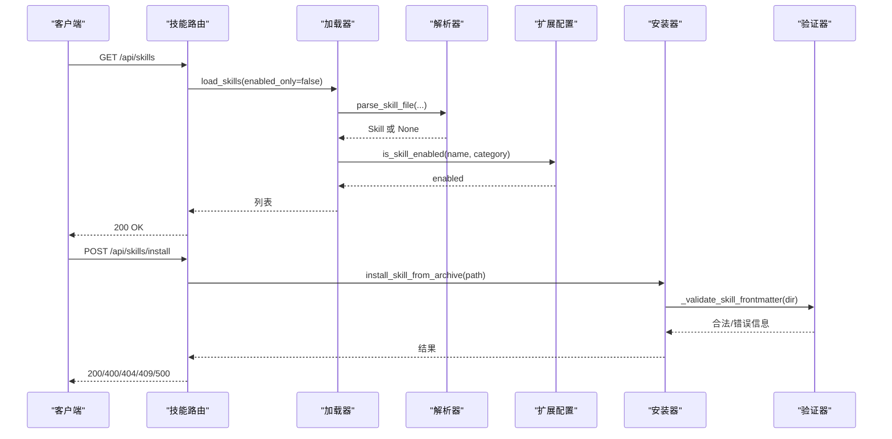
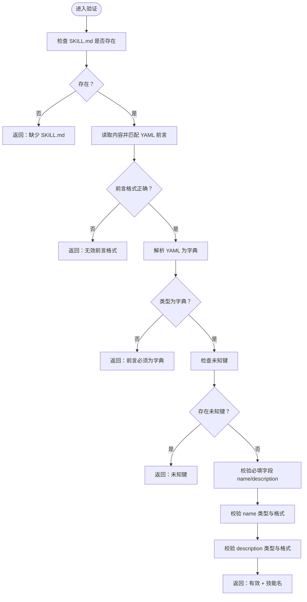
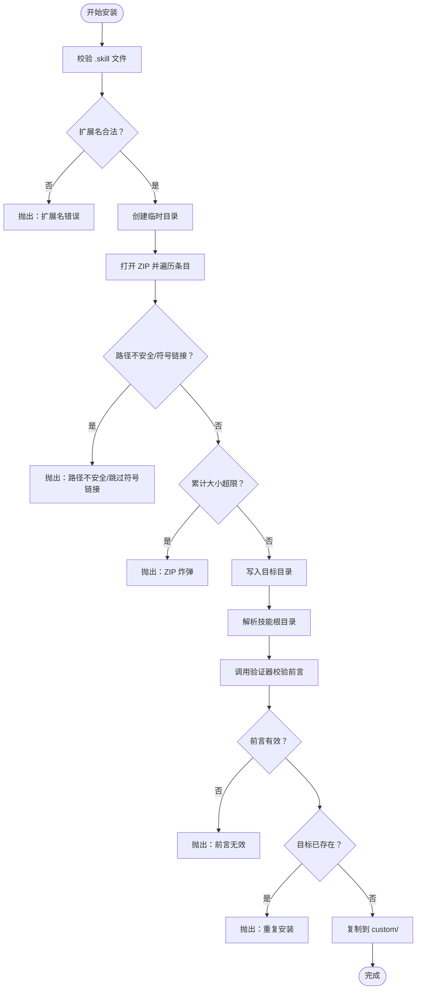
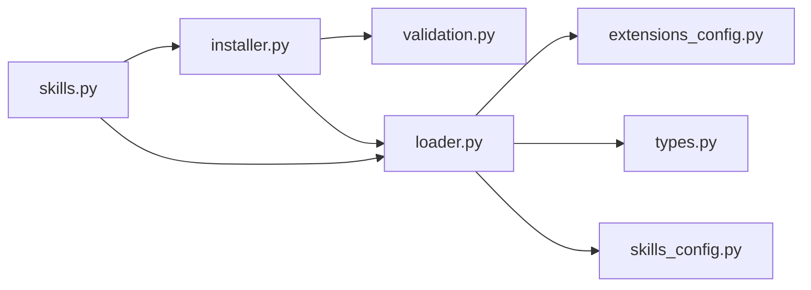

# 技能验证器

<cite>
**本文引用的文件**
- [validation.py](file://backend/packages/harness/deerflow/skills/validation.py)
- [parser.py](file://backend/packages/harness/deerflow/skills/parser.py)
- [loader.py](file://backend/packages/harness/deerflow/skills/loader.py)
- [installer.py](file://backend/packages/harness/deerflow/skills/installer.py)
- [types.py](file://backend/packages/harness/deerflow/skills/types.py)
- [skills.py](file://backend/app/gateway/routers/skills.py)
- [skills_config.py](file://backend/packages/harness/deerflow/config/skills_config.py)
- [extensions_config.py](file://backend/packages/harness/deerflow/config/extensions_config.py)
- [test_skills_installer.py](file://backend/tests/test_skills_installer.py)
- [SKILL.md（bootstrap）](file://skills/public/bootstrap/SKILL.md)
- [SKILL.md（chart-visualization）](file://skills/public/chart-visualization/SKILL.md)
</cite>

## 目录
1. [简介](#简介)
2. [项目结构](#项目结构)
3. [核心组件](#核心组件)
4. [架构总览](#架构总览)
5. [详细组件分析](#详细组件分析)
6. [依赖分析](#依赖分析)
7. [性能考量](#性能考量)
8. [故障排查指南](#故障排查指南)
9. [结论](#结论)
10. [附录](#附录)

## 简介
本文件面向 DeerFlow 技能验证器，系统化阐述技能验证规则与检查机制，覆盖以下方面：
- 技能元数据完整性验证：基于 SKILL.md 的 YAML 前言字段校验
- 文件存在性与路径合法性检查：安装与加载过程中的路径与归档安全校验
- 权限与容器路径映射：技能在沙箱容器内的挂载路径计算
- 依赖关系检查：示例技能中对运行时依赖的声明与约束
- 验证失败处理策略与错误报告机制：HTTP 层统一异常转换与日志记录
- 安装与验证流程：从 .skill 归档到目标目录的全流程安全校验
- 配置项与可扩展点：技能启用状态、容器挂载路径、扩展配置解析
- 常见错误诊断与解决方案：结合测试用例与实际错误类型进行定位

## 项目结构
技能验证器位于后端 Python 包 deerflow 中，围绕 skills 子模块构建，配合网关路由与配置模块协同工作。

图表来源
- [validation.py:15-85](file://backend/packages/harness/deerflow/skills/validation.py#L15-L85)
- [parser.py:7-65](file://backend/packages/harness/deerflow/skills/parser.py#L7-L65)
- [loader.py:22-98](file://backend/packages/harness/deerflow/skills/loader.py#L22-L98)
- [installer.py:110-176](file://backend/packages/harness/deerflow/skills/installer.py#L110-L176)
- [types.py:5-54](file://backend/packages/harness/deerflow/skills/types.py#L5-L54)
- [skills.py:66-173](file://backend/app/gateway/routers/skills.py#L66-L173)
- [skills_config.py:6-49](file://backend/packages/harness/deerflow/config/skills_config.py#L6-L49)
- [extensions_config.py:55-199](file://backend/packages/harness/deerflow/config/extensions_config.py#L55-L199)

章节来源
- [validation.py:1-86](file://backend/packages/harness/deerflow/skills/validation.py#L1-L86)
- [parser.py:1-66](file://backend/packages/harness/deerflow/skills/parser.py#L1-L66)
- [loader.py:1-99](file://backend/packages/harness/deerflow/skills/loader.py#L1-L99)
- [installer.py:1-177](file://backend/packages/harness/deerflow/skills/installer.py#L1-L177)
- [types.py:1-54](file://backend/packages/harness/deerflow/skills/types.py#L1-L54)
- [skills.py:1-174](file://backend/app/gateway/routers/skills.py#L1-L174)
- [skills_config.py:1-50](file://backend/packages/harness/deerflow/config/skills_config.py#L1-L50)
- [extensions_config.py:1-259](file://backend/packages/harness/deerflow/config/extensions_config.py#L1-L259)

## 核心组件
- 技能数据模型：Skill 类封装名称、描述、许可证、分类、启用状态及容器路径计算
- 前言验证器：对 SKILL.md 的 YAML 前言进行严格字段与格式校验
- 解析器：提取 SKILL.md 中的元数据，生成 Skill 对象
- 加载器：扫描公共与自定义技能目录，解析并应用启用状态配置
- 安装器：从 .skill 归档安全解压、校验前言、重名检测与复制
- 网关路由：对外暴露技能列表、详情、启用状态更新与安装接口
- 配置模块：技能根路径解析、容器挂载路径、扩展配置（含技能启用状态）

章节来源
- [types.py:5-54](file://backend/packages/harness/deerflow/skills/types.py#L5-L54)
- [validation.py:15-85](file://backend/packages/harness/deerflow/skills/validation.py#L15-L85)
- [parser.py:7-65](file://backend/packages/harness/deerflow/skills/parser.py#L7-L65)
- [loader.py:22-98](file://backend/packages/harness/deerflow/skills/loader.py#L22-L98)
- [installer.py:110-176](file://backend/packages/harness/deerflow/skills/installer.py#L110-L176)
- [skills.py:66-173](file://backend/app/gateway/routers/skills.py#L66-L173)
- [skills_config.py:6-49](file://backend/packages/harness/deerflow/config/skills_config.py#L6-L49)
- [extensions_config.py:55-199](file://backend/packages/harness/deerflow/config/extensions_config.py#L55-L199)

## 架构总览
技能验证器贯穿“发现—解析—验证—加载—安装”的完整链路，并通过网关路由对外提供能力。

图表来源
- [skills.py:66-173](file://backend/app/gateway/routers/skills.py#L66-L173)
- [loader.py:22-98](file://backend/packages/harness/deerflow/skills/loader.py#L22-L98)
- [parser.py:7-65](file://backend/packages/harness/deerflow/skills/parser.py#L7-L65)
- [extensions_config.py:185-199](file://backend/packages/harness/deerflow/config/extensions_config.py#L185-L199)
- [installer.py:110-176](file://backend/packages/harness/deerflow/skills/installer.py#L110-L176)
- [validation.py:15-85](file://backend/packages/harness/deerflow/skills/validation.py#L15-L85)

## 详细组件分析

### 组件一：技能元数据完整性验证（validation.py）
- 允许的前言键集合限定，拒绝未知键
- 必填字段校验：name、description
- 字段类型与内容约束：
  - name：字符串、去空白、仅允许小写字母、数字与连字符、不可以连字符开头或结尾、不可包含连续连字符、长度不超过 64
  - description：字符串、去空白、不允许出现尖括号、长度不超过 1024
- 返回三元组：是否有效、消息、技能名（用于后续安装命名）

图表来源
- [validation.py:15-85](file://backend/packages/harness/deerflow/skills/validation.py#L15-L85)

章节来源
- [validation.py:11-85](file://backend/packages/harness/deerflow/skills/validation.py#L11-L85)

### 组件二：SKILL.md 解析（parser.py）
- 仅当文件名为 SKILL.md 且存在时解析
- 使用正则提取 YAML 前言块，再按行解析键值对
- 提取 name、description、license 等基础元数据
- 生成 Skill 对象（默认 enabled=True，最终启用状态由扩展配置决定）

章节来源
- [parser.py:7-65](file://backend/packages/harness/deerflow/skills/parser.py#L7-L65)

### 组件三：技能扫描与加载（loader.py）
- 默认技能根路径解析：相对于当前文件向上回溯定位 backend，再指向同级 skills 目录
- 扫描 public 与 custom 两类目录，遍历所有包含 SKILL.md 的子目录
- 使用解析器生成 Skill 列表
- 读取扩展配置（ExtensionsConfig），按技能名与分类设置 enabled 状态
- 可按需仅返回启用的技能，并按名称排序

章节来源
- [loader.py:8-98](file://backend/packages/harness/deerflow/skills/loader.py#L8-L98)
- [extensions_config.py:185-199](file://backend/packages/harness/deerflow/config/extensions_config.py#L185-L199)

### 组件四：安装器与安全校验（installer.py）
- 安全解压策略：
  - 拒绝绝对路径与目录穿越（..）
  - 跳过符号链接（避免写入任意路径）
  - 总写入大小限制，防御 ZIP 炸弹
- 归档入口解析：过滤 macOS 元数据与隐藏文件，定位技能根目录
- 安装流程：
  - 校验 .skill 扩展名与文件存在性
  - 解压至临时目录
  - 调用验证器校验前言
  - 检查技能名合法性与重名冲突
  - 复制到 skills/custom/<name> 目标目录
- 错误类型：
  - FileNotFoundError：文件不存在
  - ValueError：扩展名不合法、ZIP 不合法、前言无效、大小超限、路径不安全、重复安装
  - 自定义异常：SkillAlreadyExistsError

图表来源
- [installer.py:67-176](file://backend/packages/harness/deerflow/skills/installer.py#L67-L176)
- [validation.py:15-85](file://backend/packages/harness/deerflow/skills/validation.py#L15-L85)

章节来源
- [installer.py:24-176](file://backend/packages/harness/deerflow/skills/installer.py#L24-L176)
- [test_skills_installer.py:103-224](file://backend/tests/test_skills_installer.py#L103-L224)

### 组件五：网关路由与错误处理（skills.py）
- 列表与详情：调用加载器获取技能列表，转换为响应模型
- 更新启用状态：写入扩展配置文件，刷新缓存，重新加载技能并返回最新状态
- 安装接口：解析虚拟路径，调用安装器，捕获并转换异常为 HTTP 状态码
- 异常映射：
  - 404：文件未找到
  - 409：技能已存在
  - 400：参数或归档/前言校验失败
  - 500：其他内部错误

章节来源
- [skills.py:66-173](file://backend/app/gateway/routers/skills.py#L66-L173)

### 组件六：配置与容器路径（skills_config.py、extensions_config.py）
- SkillsConfig：解析技能根路径与容器挂载路径，提供容器内技能路径拼接
- ExtensionsConfig：统一管理 MCP 服务器与技能启用状态；支持从多处解析配置文件，兼容旧版文件名；提供 is_skill_enabled 查询逻辑

章节来源
- [skills_config.py:6-49](file://backend/packages/harness/deerflow/config/skills_config.py#L6-L49)
- [extensions_config.py:55-199](file://backend/packages/harness/deerflow/config/extensions_config.py#L55-L199)

### 组件七：数据模型（types.py）
- Skill：封装技能元数据与容器路径计算方法（技能目录与主文件路径）

章节来源
- [types.py:5-54](file://backend/packages/harness/deerflow/skills/types.py#L5-L54)

## 依赖分析
- 内聚性：各模块职责清晰，验证、解析、加载、安装、路由与配置相互独立
- 耦合度：
  - 安装器依赖验证器与加载器的默认路径解析
  - 加载器依赖扩展配置模块以确定启用状态
  - 路由层依赖加载器与安装器
  - 容器路径计算依赖 SkillsConfig
- 外部依赖：FastAPI（路由）、Pydantic（配置模型）、YAML（解析）、zipfile（归档）

图表来源
- [installer.py:14-15](file://backend/packages/harness/deerflow/skills/installer.py#L14-L15)
- [loader.py:82-84](file://backend/packages/harness/deerflow/skills/loader.py#L82-L84)
- [skills.py:9-11](file://backend/app/gateway/routers/skills.py#L9-L11)

章节来源
- [installer.py:1-177](file://backend/packages/harness/deerflow/skills/installer.py#L1-L177)
- [loader.py:1-99](file://backend/packages/harness/deerflow/skills/loader.py#L1-L99)
- [skills.py:1-174](file://backend/app/gateway/routers/skills.py#L1-L174)

## 性能考量
- 加载性能：遍历目录与解析 YAML 的时间复杂度与技能数量、层级深度成正比；可通过缓存启用状态与延迟解析减少开销
- 安装性能：解压阶段采用分块读写，避免一次性占用内存；总大小限制可防止高压缩率归档导致的内存峰值
- I/O 优化：批量写入与目录创建合并，减少系统调用次数

## 故障排查指南
- 常见错误与定位
  - 缺少 SKILL.md 或前言格式错误：检查 SKILL.md 是否存在且以 YAML 块开头
  - 未知键或键类型不符：确认使用允许的键集合，确保 name/description 为字符串
  - 名称非法：检查是否符合 hyphen-case 规则、长度限制与边界条件
  - 描述非法：检查是否包含尖括号或长度超限
  - 安装失败（400）：归档扩展名不正确、ZIP 不合法、前言无效、大小超限、路径不安全
  - 已存在（409）：目标目录已存在同名技能
  - 文件未找到（404）：虚拟路径解析或源文件不存在
- 诊断步骤
  - 查看网关日志中的异常堆栈
  - 在安装前先执行前言验证，确认 name 与 description 合法
  - 使用测试用例思路构造最小复现：不安全路径、符号链接、ZIP 炸弹、空目录等
- 参考测试
  - 安全解压与路径安全：断言绝对路径与目录穿越被拒绝，符号链接被跳过
  - 归档入口解析：过滤 macOS 元数据后仍能正确识别技能根目录
  - 安装集成：重复安装、无效扩展名、前言缺失均触发相应错误

章节来源
- [test_skills_installer.py:23-224](file://backend/tests/test_skills_installer.py#L23-L224)
- [installer.py:67-176](file://backend/packages/harness/deerflow/skills/installer.py#L67-L176)
- [validation.py:15-85](file://backend/packages/harness/deerflow/skills/validation.py#L15-L85)

## 结论
技能验证器通过严格的前言字段校验、安装期的安全归档解压与路径合法性检查，以及启用状态的集中配置管理，确保了技能系统的安全性与一致性。结合网关路由的统一异常处理与日志记录，能够快速定位问题并提供明确的错误反馈。建议在生产环境中：
- 将扩展配置文件置于受控位置并开启只读权限
- 对安装归档进行预检（如哈希校验）以进一步提升可信度
- 在 CI 中加入前言与安装安全的自动化测试

## 附录

### 配置选项与扩展点
- 技能根路径与容器挂载路径
  - 可通过配置对象解析技能根路径，支持相对路径与绝对路径
  - 容器内路径拼接遵循固定模式：/mnt/skills/{category}/{skill_name}
- 扩展配置（Skills/ MCP）
  - 支持从多个位置解析配置文件，兼容旧版文件名
  - 技能启用状态查询默认对 public/custom 技能启用，未显式配置时生效
- 自定义验证规则
  - 可在验证器中增加新的键校验或业务规则，保持返回三元组格式
  - 安装器可扩展为支持签名验证与哈希校验（当前未实现，但具备扩展空间）

章节来源
- [skills_config.py:18-49](file://backend/packages/harness/deerflow/config/skills_config.py#L18-L49)
- [extensions_config.py:70-199](file://backend/packages/harness/deerflow/config/extensions_config.py#L70-L199)

### 示例技能依赖声明
- 图表可视化技能在前言中声明运行时依赖（如 Node.js 版本要求），用于运行环境准备与兼容性提示

章节来源
- [SKILL.md（chart-visualization）:4-6](file://skills/public/chart-visualization/SKILL.md#L4-L6)