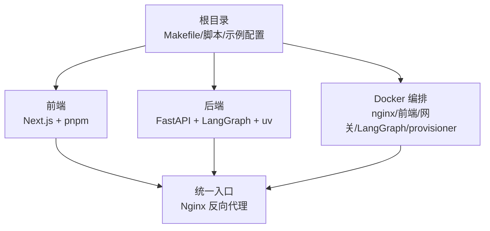
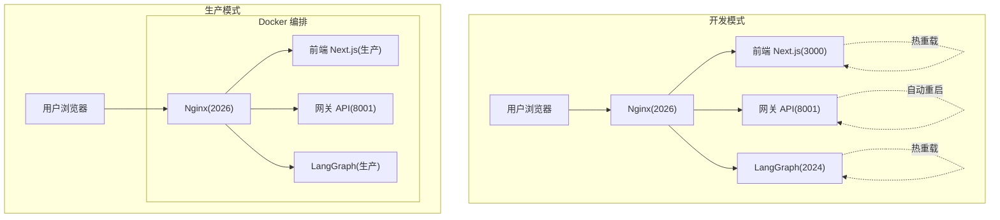
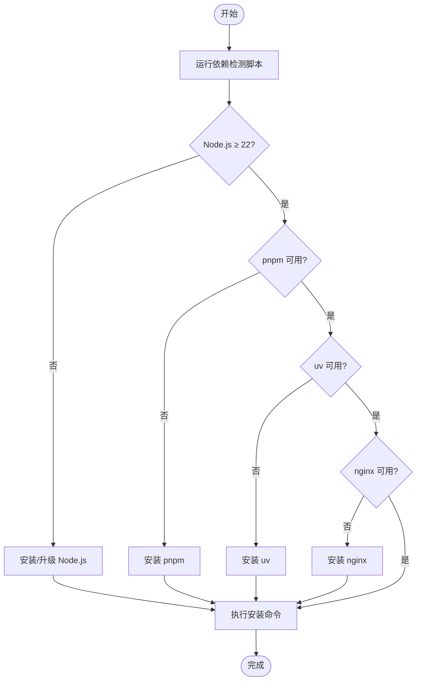
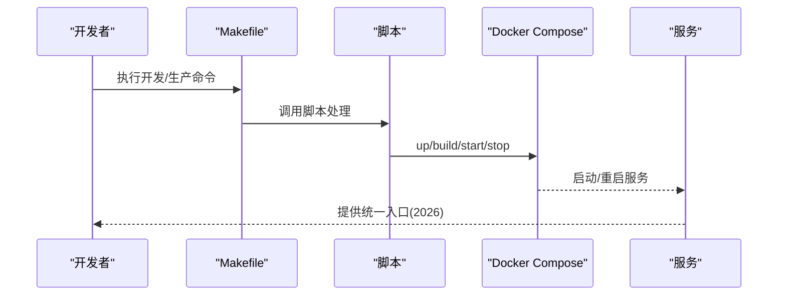
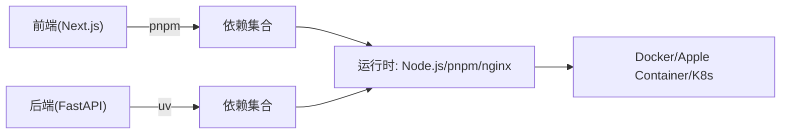

# 安装问题

<cite>
**本文引用的文件**
- [README.md](file://README.md)
- [CONTRIBUTING.md](file://CONTRIBUTING.md)
- [Makefile](file://Makefile)
- [scripts/check.py](file://scripts/check.py)
- [scripts/configure.py](file://scripts/configure.py)
- [scripts/docker.sh](file://scripts/docker.sh)
- [scripts/deploy.sh](file://scripts/deploy.sh)
- [docker/docker-compose-dev.yaml](file://docker/docker-compose-dev.yaml)
- [docker/docker-compose.yaml](file://docker/docker-compose.yaml)
- [backend/README.md](file://backend/README.md)
- [backend/pyproject.toml](file://backend/pyproject.toml)
- [frontend/README.md](file://frontend/README.md)
- [frontend/package.json](file://frontend/package.json)
- [config.example.yaml](file://config.example.yaml)
- [frontend/.env.example](file://frontend/.env.example)
</cite>

## 目录
1. [简介](#简介)
2. [项目结构](#项目结构)
3. [核心组件](#核心组件)
4. [架构总览](#架构总览)
5. [详细组件分析](#详细组件分析)
6. [依赖关系分析](#依赖关系分析)
7. [性能考虑](#性能考虑)
8. [故障排除指南](#故障排除指南)
9. [结论](#结论)
10. [附录](#附录)

## 简介
本指南聚焦于 DeerFlow 的安装与运行问题，覆盖 Docker 安装失败、依赖缺失、权限问题（尤其是 Linux 用户组权限与 Docker 守护进程访问）、Node.js 与 pnpm 版本不兼容、Python 与 uv 工具链不匹配等常见障碍，并提供系统化的排查步骤与命令行解决方案。内容基于仓库中的安装脚本、配置模板与文档，确保可操作性强且与实际代码实现一致。

## 项目结构
DeerFlow 采用前后端分离与多服务编排的结构：前端使用 Next.js，后端基于 FastAPI 与 LangGraph，通过 Nginx 统一反向代理；同时提供 Docker 开发与生产编排方案。关键目录与文件如下：
- 根目录：顶层 Makefile、安装检查脚本、部署脚本与示例配置
- 前端：Next.js 应用，使用 pnpm 管理依赖
- 后端：Python 应用，使用 uv 管理依赖与打包
- Docker：开发与生产环境的 Compose 配置，包含 Nginx、前端、网关、LangGraph 与可选的 provisioner

图示来源
- [Makefile:1-180](file://Makefile#L1-L180)
- [docker/docker-compose-dev.yaml:1-216](file://docker/docker-compose-dev.yaml#L1-L216)
- [docker/docker-compose.yaml:1-183](file://docker/docker-compose.yaml#L1-L183)

章节来源
- [README.md:196-225](file://README.md#L196-L225)
- [Makefile:1-180](file://Makefile#L1-L180)

## 核心组件
- Node.js 与 pnpm：前端开发与构建依赖，要求 Node.js 22+、pnpm 10.26.2+
- Python 与 uv：后端依赖管理与包安装，要求 Python 3.12+
- Nginx：统一入口与路由转发（开发与生产）
- Docker：容器化运行与沙箱执行（本地/容器/AIO/Provisioner 模式）

章节来源
- [frontend/README.md:13-17](file://frontend/README.md#L13-L17)
- [backend/pyproject.toml:6-19](file://backend/pyproject.toml#L6-L19)
- [scripts/check.py:31-128](file://scripts/check.py#L31-L128)

## 架构总览
下图展示开发与生产两种模式下的服务关系与数据流：

图示来源
- [backend/README.md:7-41](file://backend/README.md#L7-L41)
- [docker/docker-compose-dev.yaml:58-202](file://docker/docker-compose-dev.yaml#L58-L202)
- [docker/docker-compose.yaml:24-148](file://docker/docker-compose.yaml#L24-L148)

章节来源
- [backend/README.md:7-41](file://backend/README.md#L7-L41)
- [docker/docker-compose-dev.yaml:58-202](file://docker/docker-compose-dev.yaml#L58-L202)
- [docker/docker-compose.yaml:24-148](file://docker/docker-compose.yaml#L24-L148)

## 详细组件分析

### 依赖检测与安装流程
- 依赖检测：脚本会校验 Node.js（≥22）、pnpm、uv、nginx 是否存在并输出版本信息
- 安装流程：通过 Makefile 调用 uv 与 pnpm 安装后端与前端依赖
- 预拉取沙箱镜像：在需要容器沙箱时建议预拉取以加速首次启动

图示来源
- [scripts/check.py:31-128](file://scripts/check.py#L31-L128)
- [Makefile:44-54](file://Makefile#L44-L54)

章节来源
- [scripts/check.py:31-128](file://scripts/check.py#L31-L128)
- [Makefile:44-54](file://Makefile#L44-L54)

### Docker 开发与生产编排
- 开发编排：支持前端热重载、后端自动重启、LangGraph 热重载；可按配置启用 provisioner（Kubernetes 沙箱模式）
- 生产编排：构建镜像并启动服务，挂载配置与数据目录，暴露统一端口
- 权限与守护进程：生产模式下需确保 Docker socket 可用；Linux 用户需加入 docker 组

图示来源
- [scripts/docker.sh:150-230](file://scripts/docker.sh#L150-L230)
- [scripts/deploy.sh:194-212](file://scripts/deploy.sh#L194-L212)
- [docker/docker-compose-dev.yaml:16-216](file://docker/docker-compose-dev.yaml#L16-L216)
- [docker/docker-compose.yaml:24-183](file://docker/docker-compose.yaml#L24-L183)

章节来源
- [scripts/docker.sh:150-230](file://scripts/docker.sh#L150-L230)
- [scripts/deploy.sh:194-212](file://scripts/deploy.sh#L194-L212)
- [docker/docker-compose-dev.yaml:16-216](file://docker/docker-compose-dev.yaml#L16-L216)
- [docker/docker-compose.yaml:24-183](file://docker/docker-compose.yaml#L24-L183)

### 配置生成与升级
- 配置生成：从示例模板复制 config.yaml、.env 与前端 .env
- 升级机制：提供配置升级脚本，合并新字段到现有配置
- 示例配置：包含模型、工具、沙箱、技能、记忆、标题生成等完整模板

章节来源
- [scripts/configure.py:20-54](file://scripts/configure.py#L20-L54)
- [Makefile:38-43](file://Makefile#L38-L43)
- [config.example.yaml:1-624](file://config.example.yaml#L1-L624)

## 依赖关系分析
- 前端依赖：Next.js 16、React 19、Tailwind CSS 4、pnpm 工作区
- 后端依赖：FastAPI、LangGraph、LangChain、uv 管理器
- 运行时依赖：Docker（容器沙箱）、Apple Container（macOS 可选）、Kubernetes（可选 provisioner）

图示来源
- [frontend/package.json:17-87](file://frontend/package.json#L17-L87)
- [backend/pyproject.toml:1-29](file://backend/pyproject.toml#L1-L29)
- [docker/docker-compose-dev.yaml:16-216](file://docker/docker-compose-dev.yaml#L16-L216)
- [docker/docker-compose.yaml:24-183](file://docker/docker-compose.yaml#L24-L183)

章节来源
- [frontend/package.json:17-87](file://frontend/package.json#L17-L87)
- [backend/pyproject.toml:1-29](file://backend/pyproject.toml#L1-L29)

## 性能考虑
- 预拉取沙箱镜像：减少首次容器启动等待时间
- pnpm 缓存挂载：提升前端依赖安装速度
- uv 缓存挂载：提升后端依赖安装速度
- 热重载与自动重启：开发阶段提升迭代效率

章节来源
- [Makefile:65-95](file://Makefile#L65-L95)
- [docker/docker-compose-dev.yaml:84-94](file://docker/docker-compose-dev.yaml#L84-L94)
- [docker/docker-compose-dev.yaml:172-174](file://docker/docker-compose-dev.yaml#L172-L174)

## 故障排除指南

### 一、Docker 安装失败
- 现象
  - Linux 下执行 make docker-init/ docker-start/ docker-stop 报错，提示无法连接 Docker 守护进程
  - 生产模式下提示 Docker socket 不存在或不可用
- 根因
  - 当前用户未加入 docker 组，或 Docker 守护进程未运行
  - 生产模式下未正确挂载 Docker socket
- 解决步骤
  1) 在 Linux 上将当前用户添加到 docker 组并重新登录
     - 检查 docker 组是否存在：getent group docker
     - 添加用户到 docker 组：sudo usermod -aG docker $USER
     - 刷新组成员：newgrp docker 或完全登出后重新登录
     - 验证：docker ps
  2) 再次执行 DeerFlow 命令：make docker-start 或 make up
  3) 生产模式确认 DEER_FLOW_DOCKER_SOCKET 挂载路径有效（默认 /var/run/docker.sock）
- 参考
  - Linux 权限修复说明与步骤见贡献指南
  - 生产脚本对 Docker socket 的检测逻辑

章节来源
- [CONTRIBUTING.md:73-106](file://CONTRIBUTING.md#L73-L106)
- [scripts/deploy.sh:180-188](file://scripts/deploy.sh#L180-L188)

### 二、依赖缺失与版本不兼容
- 现象
  - make check 报告缺少 Node.js、pnpm、uv、nginx
  - Node.js 版本过低（<22），pnpm 版本过旧
- 根因
  - 系统未安装所需工具或版本不符合要求
- 解决步骤
  1) 安装/升级 Node.js 至 22+（官方下载）
  2) 安装 pnpm（参考官方安装指引）
  3) 安装 uv（官方安装指南）
  4) 安装 nginx（各平台官方包）
  5) 再次运行 make check 确认通过
- 参考
  - 依赖检测脚本对 Node.js/pnpm/uv/nginx 的版本与可用性检查
  - 前端与后端的版本要求

章节来源
- [scripts/check.py:39-108](file://scripts/check.py#L39-L108)
- [frontend/README.md:13-17](file://frontend/README.md#L13-L17)
- [backend/pyproject.toml:6-19](file://backend/pyproject.toml#L6-L19)

### 三、Linux 用户组权限配置
- 现象
  - 使用 sudo 才能执行 Docker 命令，普通用户无权限
- 根因
  - 用户未加入 docker 组
- 解决步骤
  - 添加用户到 docker 组并重新登录
  - 验证：docker ps
- 参考
  - 贡献指南中 Linux Docker 权限修复章节

章节来源
- [CONTRIBUTING.md:73-106](file://CONTRIBUTING.md#L73-L106)

### 四、Docker 守护进程访问问题
- 现象
  - “permission denied while trying to connect to the Docker daemon socket”
- 根因
  - Docker 守护进程未运行或 socket 权限不足
- 解决步骤
  - 确保 Docker 服务已启动
  - 检查 /var/run/docker.sock 存在且可读
  - 将用户加入 docker 组并重新登录
- 参考
  - 生产部署脚本对 Docker socket 的检测与报错

章节来源
- [scripts/deploy.sh:180-188](file://scripts/deploy.sh#L180-L188)
- [CONTRIBUTING.md:73-106](file://CONTRIBUTING.md#L73-L106)

### 五、Node.js 与 pnpm 版本兼容性
- 现象
  - 前端安装失败或构建异常
- 根因
  - Node.js 版本低于 22，pnpm 版本过旧
- 解决步骤
  1) 安装 Node.js 22+（官方下载）
  2) 安装 pnpm（推荐使用官方安装方式）
  3) 清理缓存后重新安装依赖
- 参考
  - 前端 README 中的版本要求
  - 依赖检测脚本对 pnpm 的可用性检查

章节来源
- [frontend/README.md:13-17](file://frontend/README.md#L13-L17)
- [scripts/check.py:63-75](file://scripts/check.py#L63-L75)

### 六、Python 与 uv 工具链问题
- 现象
  - 后端依赖安装失败或 uv 命令不可用
- 根因
  - 未安装 uv 或 Python 版本不满足要求
- 解决步骤
  1) 安装 uv（官方安装指南）
  2) 确认 Python 版本 ≥ 3.12
  3) 使用 uv 同步安装后端依赖
- 参考
  - 后端 pyproject.toml 对 Python 版本的要求
  - 依赖检测脚本对 uv 的检查

章节来源
- [backend/pyproject.toml:6-6](file://backend/pyproject.toml#L6-L6)
- [scripts/check.py:78-91](file://scripts/check.py#L78-L91)

### 七、Nginx 未安装或配置错误
- 现象
  - 访问 http://localhost:2026 无响应或 502
- 根因
  - 未安装 nginx 或未正确启动
- 解决步骤
  1) 安装 nginx（各平台官方包）
  2) 使用 make nginx 或直接启动 nginx 指向示例配置
  3) 检查端口占用与防火墙设置
- 参考
  - 依赖检测脚本对 nginx 的检查
  - 贡献指南中 Nginx 配置说明

章节来源
- [scripts/check.py:94-108](file://scripts/check.py#L94-L108)
- [CONTRIBUTING.md:192-202](file://CONTRIBUTING.md#L192-L202)

### 八、配置文件缺失或不完整
- 现象
  - 启动时报错找不到 config.yaml 或 extensions_config.json
- 根因
  - 未生成本地配置文件或文件被意外删除
- 解决步骤
  1) 生成配置文件：make config 或手动复制示例模板
  2) 设置必要的 API 密钥与模型配置
  3) 如需 MCP/技能扩展，准备 extensions_config.json
- 参考
  - 配置生成脚本与示例模板
  - 部署脚本对配置文件的处理逻辑

章节来源
- [scripts/configure.py:20-54](file://scripts/configure.py#L20-L54)
- [scripts/deploy.sh:43-81](file://scripts/deploy.sh#L43-L81)
- [config.example.yaml:1-624](file://config.example.yaml#L1-L624)

### 九、沙箱模式相关问题
- 现象
  - 容器沙箱启动失败或超时
- 根因
  - 未预拉取沙箱镜像或容器运行环境异常
- 解决步骤
  1) 预拉取沙箱镜像：make setup-sandbox
  2) 检查 Docker 可用性与网络访问
  3) 如使用 Apple Container（macOS），确认其可用性
- 参考
  - 预拉取脚本与沙箱模式检测逻辑

章节来源
- [Makefile:65-95](file://Makefile#L65-L95)
- [scripts/docker.sh:87-148](file://scripts/docker.sh#L87-L148)

### 十、开发与生产模式切换问题
- 现象
  - 开发模式热重载无效或生产模式端口冲突
- 根因
  - 端口占用或编排参数不正确
- 解决步骤
  1) 开发模式：make dev 或 make docker-start
  2) 生产模式：make up，确认端口映射与环境变量
  3) 若端口冲突，修改 PORT 或停止占用进程
- 参考
  - 开发/生产命令定义与日志查看

章节来源
- [Makefile:97-179](file://Makefile#L97-L179)
- [scripts/docker.sh:150-230](file://scripts/docker.sh#L150-L230)
- [scripts/deploy.sh:194-212](file://scripts/deploy.sh#L194-L212)

## 结论
通过系统化的依赖检测、正确的权限配置与编排参数设置，大多数 DeerFlow 安装问题均可快速定位与解决。建议优先使用 Docker 开发模式以获得最一致的环境体验；若选择本地模式，请严格遵循 Node.js、pnpm、uv、nginx 的版本要求，并确保 Docker socket 权限正确。遇到问题时，结合本文提供的排查步骤与命令即可高效恢复服务。

## 附录
- 快速检查清单
  - Node.js ≥ 22、pnpm 已安装
  - uv 已安装且可用
  - nginx 已安装
  - Docker 已安装且守护进程运行
  - 用户已加入 docker 组（Linux）
  - 已生成 config.yaml 与 .env
  - 生产模式已正确挂载 Docker socket
- 常用命令
  - make check：检查依赖
  - make install：安装后端与前端依赖
  - make config：生成配置文件
  - make docker-init / docker-start / docker-stop：Docker 开发模式
  - make up / down：生产模式
  - make setup-sandbox：预拉取沙箱镜像