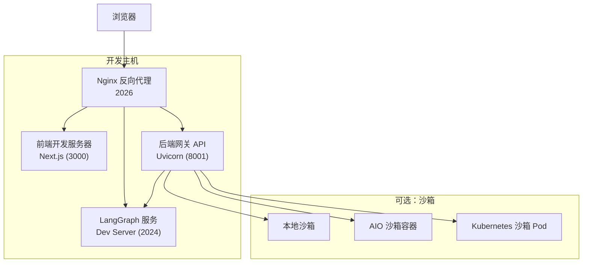
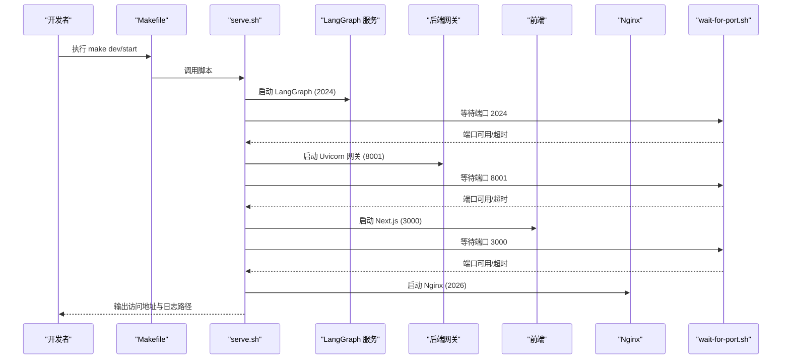
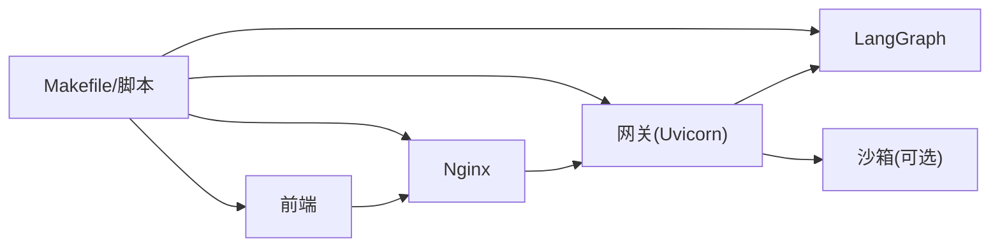

# 开发调试

<cite>
**本文引用的文件**
- [backend/debug.py](file://backend/debug.py)
- [Makefile](file://Makefile)
- [scripts/serve.sh](file://scripts/serve.sh)
- [scripts/docker.sh](file://scripts/docker.sh)
- [scripts/wait-for-port.sh](file://scripts/wait-for-port.sh)
- [docker/docker-compose-dev.yaml](file://docker/docker-compose-dev.yaml)
- [backend/Dockerfile](file://backend/Dockerfile)
- [frontend/Dockerfile](file://frontend/Dockerfile)
- [frontend/package.json](file://frontend/package.json)
- [frontend/next.config.js](file://frontend/next.config.js)
- [backend/app/gateway/config.py](file://backend/app/gateway/config.py)
- [backend/packages/harness/deerflow/mcp/client.py](file://backend/packages/harness/deerflow/mcp/client.py)
- [backend/packages/harness/deerflow/sandbox/exceptions.py](file://backend/packages/harness/deerflow/sandbox/exceptions.py)
- [backend/packages/harness/deerflow/agents/middlewares/tool_error_handling_middleware.py](file://backend/packages/harness/deerflow/agents/middlewares/tool_error_handling_middleware.py)
- [backend/tests/test_tool_error_handling_middleware.py](file://backend/tests/test_tool_error_handling_middleware.py)
</cite>

## 目录
1. [简介](#简介)
2. [项目结构](#项目结构)
3. [核心组件](#核心组件)
4. [架构总览](#架构总览)
5. [详细组件分析](#详细组件分析)
6. [依赖分析](#依赖分析)
7. [性能考虑](#性能考虑)
8. [故障排除指南](#故障排除指南)
9. [结论](#结论)
10. [附录](#附录)

## 简介
本指南面向 DeerFlow 团队开发者，聚焦于开发阶段的调试与排障，覆盖以下主题：
- 前端开发服务器问题定位与热重载调试
- 后端服务启动与重启问题排查（LangGraph、Uvicorn）
- Docker 开发环境调试（容器日志、端口等待、健康检查）
- 调试工具与日志级别配置、错误追踪与最佳实践
- 团队协作中的调试流程与问题定位方法

目标是帮助你在本地或 Docker 环境中快速定位并解决问题，缩短从“发现问题”到“修复验证”的周期。

## 项目结构
DeerFlow 采用前后端分离与多服务组合的开发模式：
- 前端：Next.js 应用，开发时通过本地或容器内的 dev 服务运行
- 后端：FastAPI + Uvicorn 提供网关 API；LangGraph 提供图执行服务
- 反向代理：Nginx 将请求路由至前端、网关与 LangGraph
- 可选：沙箱容器（AIO 或 Kubernetes）用于安全执行工具调用
- 工具链：Makefile、Shell 脚本、Docker Compose 统一管理服务生命周期

图表来源
- [docker/docker-compose-dev.yaml:16-216](file://docker/docker-compose-dev.yaml#L16-L216)
- [scripts/serve.sh:123-178](file://scripts/serve.sh#L123-L178)
- [frontend/Dockerfile:16-36](file://frontend/Dockerfile#L16-L36)
- [backend/Dockerfile:35-40](file://backend/Dockerfile#L35-L40)

章节来源
- [Makefile:13-37](file://Makefile#L13-L37)
- [scripts/serve.sh:123-178](file://scripts/serve.sh#L123-L178)
- [docker/docker-compose-dev.yaml:16-216](file://docker/docker-compose-dev.yaml#L16-L216)

## 核心组件
- 前端开发服务器：Next.js，支持热重载与类型检查；在本地或容器内运行
- 后端网关：Uvicorn + FastAPI，提供统一 API 入口，支持热重载监听配置文件
- LangGraph 服务：LangGraph Dev Server，提供图执行与调试能力
- Nginx 反向代理：统一入口，将前端、网关、LangGraph 请求路由到对应服务
- Docker 开发编排：Compose 文件定义服务、网络、卷与健康检查
- 调试脚本与工具：等待端口脚本、日志输出、错误处理中间件

章节来源
- [frontend/package.json:6-16](file://frontend/package.json#L6-L16)
- [frontend/next.config.js:1-13](file://frontend/next.config.js#L1-L13)
- [backend/app/gateway/config.py:6-27](file://backend/app/gateway/config.py#L6-L27)
- [scripts/wait-for-port.sh:1-62](file://scripts/wait-for-port.sh#L1-L62)
- [backend/packages/harness/deerflow/agents/middlewares/tool_error_handling_middleware.py:1-35](file://backend/packages/harness/deerflow/agents/middlewares/tool_error_handling_middleware.py#L1-L35)

## 架构总览
下图展示开发环境启动顺序与依赖关系，以及关键的调试关注点（端口、日志、健康检查）：

图表来源
- [scripts/serve.sh:131-178](file://scripts/serve.sh#L131-L178)
- [scripts/wait-for-port.sh:23-62](file://scripts/wait-for-port.sh#L23-L62)
- [Makefile:97-114](file://Makefile#L97-L114)

章节来源
- [scripts/serve.sh:131-178](file://scripts/serve.sh#L131-L178)
- [scripts/wait-for-port.sh:1-62](file://scripts/wait-for-port.sh#L1-L62)
- [Makefile:97-114](file://Makefile#L97-L114)

## 详细组件分析

### 前端开发服务器调试
- 热重载与端口
  - 本地：使用 Next.js dev 模式，端口 3000
  - 容器：Dockerfile 的 dev 目标，端口 3000，命令由 compose 注入
- 常见问题
  - 端口占用：确认 3000 未被占用，或调整端口映射
  - 环境变量：SKIP_ENV_VALIDATION 可跳过环境校验，便于容器构建
  - 类型检查与 ESLint：在本地开发前先运行类型检查与 Lint
- 调试建议
  - 使用浏览器开发者工具 Network/Console 定位资源加载与请求失败
  - 查看 logs/frontend.log 获取启动与错误信息
  - 若容器内热重载异常，检查卷挂载与文件系统事件（如 Watchpack Polling）

章节来源
- [frontend/package.json:6-16](file://frontend/package.json#L6-L16)
- [frontend/next.config.js:1-13](file://frontend/next.config.js#L1-L13)
- [frontend/Dockerfile:16-20](file://frontend/Dockerfile#L16-L20)
- [scripts/serve.sh:161-168](file://scripts/serve.sh#L161-L168)

### 后端网关与 LangGraph 调试
- 网关（Uvicorn）
  - 默认绑定 0.0.0.0:8001，支持热重载监听 .yaml 与 .env
  - 日志级别可通过环境变量或配置文件传入 LangGraph
- LangGraph
  - 默认绑定 0.0.0.0:2024，支持 Dev Server 与阻塞模式
  - 支持通过配置文件设置日志级别
- 常见问题
  - 配置文件缺失或字段不完整导致启动失败
  - 端口冲突或进程残留导致无法启动
  - 网关跨域配置不正确导致前端请求失败
- 调试建议
  - 使用 logs/gateway.log 与 logs/langgraph.log 对比分析
  - 通过 make stop 清理残留进程后再启动
  - 检查 CORS 配置是否包含前端地址

章节来源
- [scripts/serve.sh:123-159](file://scripts/serve.sh#L123-L159)
- [backend/app/gateway/config.py:6-27](file://backend/app/gateway/config.py#L6-L27)
- [backend/Dockerfile:35-40](file://backend/Dockerfile#L35-L40)

### Docker 开发环境调试
- 服务编排
  - 前端、网关、LangGraph、Nginx、可选 provisioner
  - 网络隔离与卷挂载，持久化虚拟环境与日志
- 健康检查与端口
  - provisioner 健康检查端口 8002
  - 通过 wait-for-port.sh 等待端口可用，避免误判
- 常见问题
  - Docker 守护进程不可达或镜像拉取失败
  - 卷权限或路径不正确导致源码不同步
  - 端口映射冲突或容器间网络不通
- 调试建议
  - 使用 make docker-logs 查看各服务日志
  - 使用 make docker-stop 后再 make docker-start 重置
  - 在 compose 中启用 extra_hosts 以解决 host.docker.internal 解析问题

章节来源
- [docker/docker-compose-dev.yaml:16-216](file://docker/docker-compose-dev.yaml#L16-L216)
- [scripts/docker.sh:150-230](file://scripts/docker.sh#L150-L230)
- [scripts/wait-for-port.sh:1-62](file://scripts/wait-for-port.sh#L1-L62)

### 调试脚本与工具
- 等待端口脚本
  - 多种探测方式（lsof/ss/netstat/timeout），支持超时与服务名提示
- 启动脚本
  - 自动清理旧进程、等待端口、输出日志路径、捕获错误并提示升级配置
- 错误处理中间件
  - 将工具调用异常转换为 ToolMessage，避免中断执行流
  - 单元测试覆盖同步/异步异常与中断场景

章节来源
- [scripts/wait-for-port.sh:23-62](file://scripts/wait-for-port.sh#L23-L62)
- [scripts/serve.sh:94-159](file://scripts/serve.sh#L94-L159)
- [backend/packages/harness/deerflow/agents/middlewares/tool_error_handling_middleware.py:1-35](file://backend/packages/harness/deerflow/agents/middlewares/tool_error_handling_middleware.py#L1-L35)
- [backend/tests/test_tool_error_handling_middleware.py:1-96](file://backend/tests/test_tool_error_handling_middleware.py#L1-L96)

### MCP 与沙箱错误处理
- MCP 客户端
  - 从扩展配置构建服务器参数，记录配置成功/失败信息
- 沙箱异常
  - 结构化异常类，便于统一捕获与上报
- 调试建议
  - 关注 MCP 初始化日志与错误详情
  - 沙箱相关错误优先检查容器/节点可达性与权限

章节来源
- [backend/packages/harness/deerflow/mcp/client.py:45-68](file://backend/packages/harness/deerflow/mcp/client.py#L45-L68)
- [backend/packages/harness/deerflow/sandbox/exceptions.py:1-35](file://backend/packages/harness/deerflow/sandbox/exceptions.py#L1-L35)

## 依赖分析
- 组件耦合
  - 前端依赖后端 API；后端依赖 LangGraph；Nginx 作为统一入口
  - Docker 编排将上述组件解耦，便于独立调试与扩展
- 外部依赖
  - Docker、Node.js、Python 运行时、uv、pnpm
  - 可选：Kubernetes（provisioner）、Docker 守护进程（沙箱）

图表来源
- [docker/docker-compose-dev.yaml:16-216](file://docker/docker-compose-dev.yaml#L16-L216)
- [scripts/serve.sh:123-178](file://scripts/serve.sh#L123-L178)

章节来源
- [docker/docker-compose-dev.yaml:16-216](file://docker/docker-compose-dev.yaml#L16-L216)
- [scripts/serve.sh:123-178](file://scripts/serve.sh#L123-L178)

## 性能考虑
- 热重载与端口等待
  - 本地开发启用热重载，但注意端口等待超时与日志轮转
- 容器缓存
  - uv 与 pnpm 缓存卷提升安装速度
- 并发与 I/O
  - 沙箱执行可能成为瓶颈，建议预拉取镜像与合理配置资源限制

## 故障排除指南

### 通用调试流程
- 明确症状：页面空白、接口 502、热重载无效、工具调用失败
- 定位层级：前端 → Nginx → 网关 → LangGraph → 沙箱
- 收集证据：日志文件、端口状态、容器健康检查、环境变量
- 快速验证：最小化复现、关闭无关服务、切换到生产模式对比

### 前端开发服务器问题
- 症状
  - 页面 3000 无法访问、热重载不生效、静态资源 404
- 排查步骤
  - 检查端口占用与映射：确认 3000 未被占用
  - 查看日志：logs/frontend.log
  - 环境变量：确认 SKIP_ENV_VALIDATION 是否按需启用
  - 卷挂载：容器内源码同步是否正常
- 建议
  - 优先在本地直接运行 next dev 验证，再迁移至容器
  - 使用浏览器 Network 面板观察资源加载与跨域情况

章节来源
- [frontend/package.json:6-16](file://frontend/package.json#L6-L16)
- [frontend/next.config.js:1-13](file://frontend/next.config.js#L1-L13)
- [scripts/serve.sh:161-168](file://scripts/serve.sh#L161-L168)

### 后端服务重启问题
- 症状
  - 网关或 LangGraph 启动失败、端口占用、进程残留
- 排查步骤
  - 使用 make stop 清理所有相关进程
  - 检查 logs/gateway.log 与 logs/langgraph.log
  - 确认配置文件存在且字段完整（尤其是模型与密钥）
- 建议
  - 生产模式禁用热重载，减少不必要的重启
  - 使用 wait-for-port.sh 与健康检查辅助判断服务就绪

章节来源
- [scripts/serve.sh:94-159](file://scripts/serve.sh#L94-L159)
- [scripts/wait-for-port.sh:1-62](file://scripts/wait-for-port.sh#L1-L62)

### Docker 开发环境调试
- 症状
  - 容器启动后立即退出、端口不可达、日志为空
- 排查步骤
  - 使用 make docker-logs 查看具体服务日志
  - 检查 DEER_FLOW_ROOT、卷挂载路径与权限
  - 确认 Docker 守护进程可达，必要时预拉取沙箱镜像
- 建议
  - 使用 make docker-stop 再 make docker-start 重置
  - 如需 Kubernetes 模式，确保 kubeconfig 权限与 API 地址可达

章节来源
- [scripts/docker.sh:150-230](file://scripts/docker.sh#L150-L230)
- [docker/docker-compose-dev.yaml:16-216](file://docker/docker-compose-dev.yaml#L16-L216)

### 热重载问题排查
- 症状
  - 修改代码后页面未刷新、控制台报错、样式不更新
- 排查步骤
  - 检查文件系统事件与 Watchpack Polling 设置
  - 确认 .env 与配置文件变更被监听（后端已配置监听）
  - 容器内热重载可能受文件系统差异影响，建议使用本地开发验证
- 建议
  - 本地开发优先，容器内仅做最终验证
  - 使用浏览器强制刷新与禁用缓存

章节来源
- [scripts/serve.sh:123-129](file://scripts/serve.sh#L123-L129)
- [frontend/package.json:6-16](file://frontend/package.json#L6-L16)

### 断点调试方法
- 后端本地断点
  - 使用 Python 调试器在后端设置断点，运行 debug.py 与 make dev
  - 通过日志与终端交互输入消息进行调试
- 前端断点
  - 在浏览器开发者工具 Sources 中设置断点
  - 在组件与 API Hook 中定位逻辑分支与错误抛出点
- 建议
  - 优先在最小可复现场景中设置断点，逐步缩小范围

章节来源
- [backend/debug.py:1-92](file://backend/debug.py#L1-L92)
- [scripts/serve.sh:123-129](file://scripts/serve.sh#L123-L129)

### 调试工具与日志级别
- 工具
  - 浏览器开发者工具、curl/HTTP 客户端、日志文件
- 日志级别
  - LangGraph 日志级别可从配置文件读取，未指定则使用默认值
  - 后端网关支持通过环境变量或配置文件调整
- 建议
  - 本地开发使用 info 级别，问题定位时临时提升到 debug
  - 容器内日志集中到 logs 目录，便于收集与分析

章节来源
- [scripts/serve.sh:132-134](file://scripts/serve.sh#L132-L134)
- [backend/Dockerfile:35-40](file://backend/Dockerfile#L35-L40)

### 错误追踪与中间件
- 工具调用异常
  - 使用工具错误处理中间件将异常转换为 ToolMessage，避免中断
  - 单元测试覆盖同步/异步异常与中断场景
- 沙箱错误
  - 使用结构化异常类，便于统一捕获与上报
- 建议
  - 在关键工具调用处增加日志与上下文信息
  - 对外部服务调用增加超时与重试策略

章节来源
- [backend/packages/harness/deerflow/agents/middlewares/tool_error_handling_middleware.py:1-35](file://backend/packages/harness/deerflow/agents/middlewares/tool_error_handling_middleware.py#L1-L35)
- [backend/tests/test_tool_error_handling_middleware.py:1-96](file://backend/tests/test_tool_error_handling_middleware.py#L1-L96)
- [backend/packages/harness/deerflow/sandbox/exceptions.py:1-35](file://backend/packages/harness/deerflow/sandbox/exceptions.py#L1-L35)

### 团队协作中的调试流程
- 规范
  - 统一使用 Makefile 与脚本启动/停止服务，避免手工操作差异
  - 所有服务日志集中到 logs 目录，便于共享与归档
  - 配置文件变更必须通过 make config-upgrade 合并新字段
- 流程
  - 发现问题 → 定位服务 → 查看日志 → 复现最小场景 → 提交 Issue/PR
  - 复核时要求提供日志片段、环境信息与复现步骤
- 建议
  - 为常见问题建立“FAQ/排查清单”，减少重复工作

章节来源
- [Makefile:38-47](file://Makefile#L38-L47)
- [scripts/serve.sh:88-91](file://scripts/serve.sh#L88-L91)

## 结论
通过统一的调试工具链（日志、端口等待、错误处理中间件）与规范化的启动/停止流程（Makefile、脚本、Docker Compose），可以显著提升 DeerFlow 开发阶段的问题定位效率。建议在日常工作中坚持“先本地、后容器”的原则，并结合最小化复现与日志分析，快速闭环问题。

## 附录

### 常用命令与入口
- 本地开发：make dev → 访问 http://localhost:2026
- 生产模式：make start
- Docker 开发：make docker-start → 日志查看 make docker-logs
- 停止服务：make stop 或 make docker-stop

章节来源
- [Makefile:97-114](file://Makefile#L97-L114)
- [scripts/docker.sh:150-230](file://scripts/docker.sh#L150-L230)