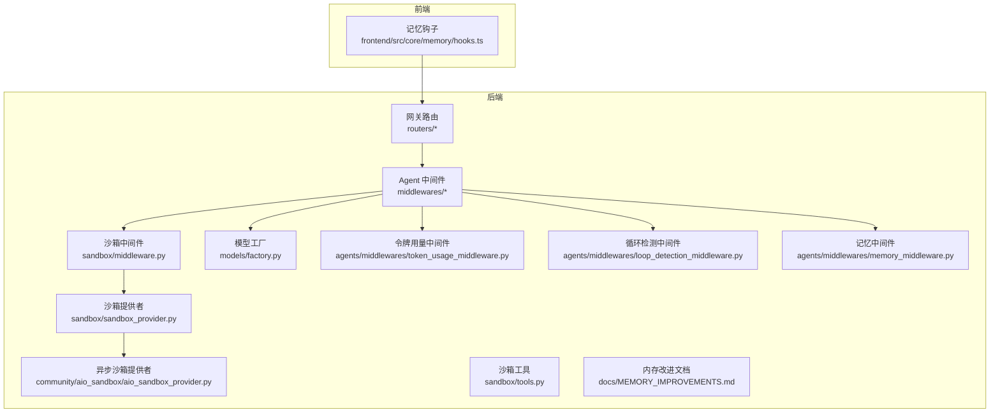
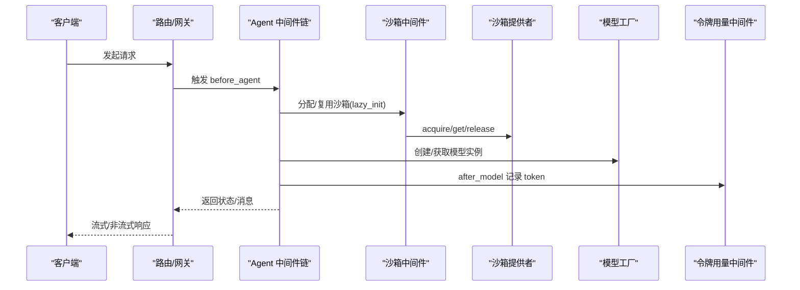
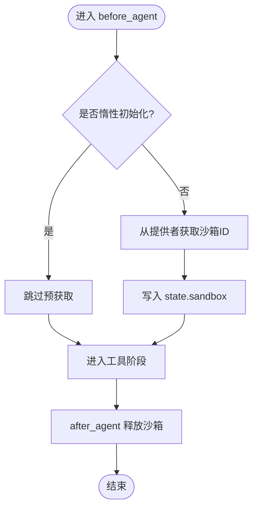
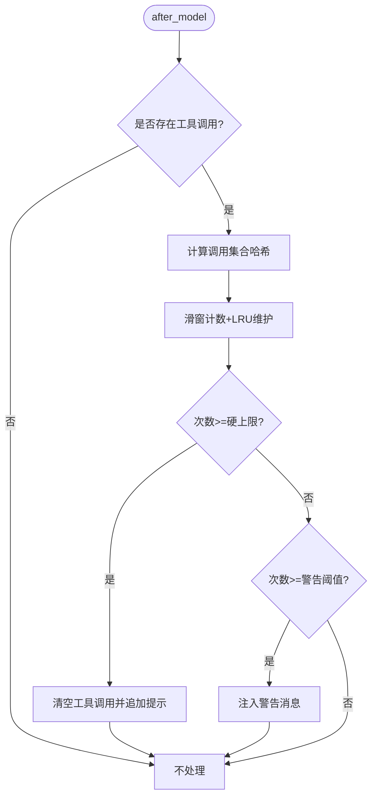
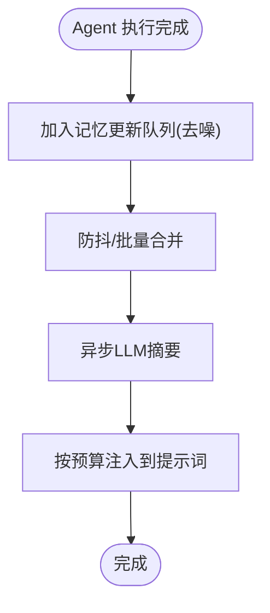
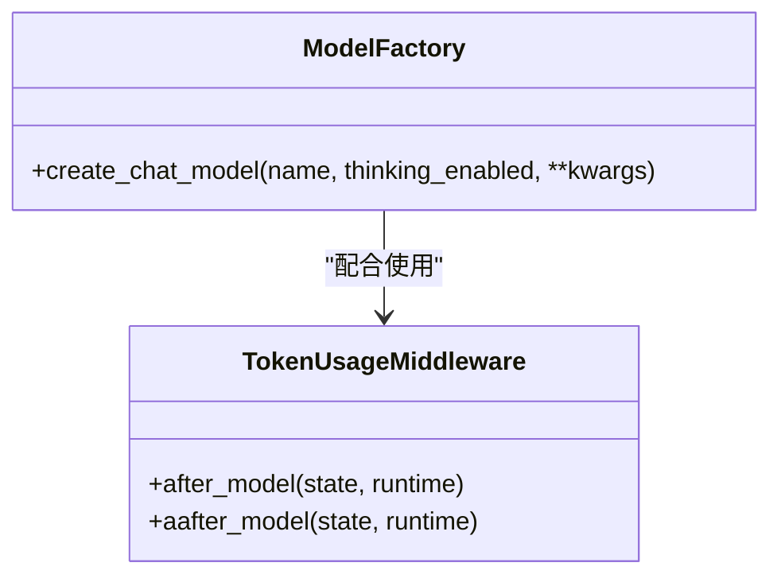
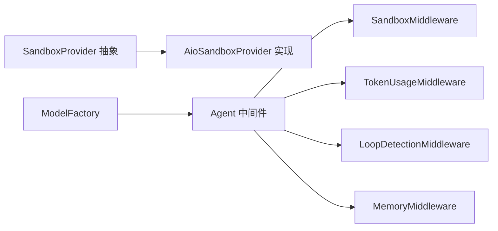

# 性能问题

<cite>
**本文引用的文件**
- [sandbox/middleware.py](file://backend/packages/harness/deerflow/sandbox/middleware.py)
- [sandbox/sandbox_provider.py](file://backend/packages/harness/deerflow/sandbox/sandbox_provider.py)
- [aio_sandbox/aio_sandbox_provider.py](file://backend/packages/harness/deerflow/community/aio_sandbox/aio_sandbox_provider.py)
- [sandbox/tools.py](file://backend/packages/harness/deerflow/sandbox/tools.py)
- [agents/middlewares/loop_detection_middleware.py](file://backend/packages/harness/deerflow/agents/middlewares/loop_detection_middleware.py)
- [agents/middlewares/memory_middleware.py](file://backend/packages/harness/deerflow/agents/middlewares/memory_middleware.py)
- [models/factory.py](file://backend/packages/harness/deerflow/models/factory.py)
- [agents/middlewares/token_usage_middleware.py](file://backend/packages/harness/deerflow/agents/middlewares/token_usage_middleware.py)
- [docs/MEMORY_IMPROVEMENTS.md](file://backend/docs/MEMORY_IMPROVEMENTS.md)
- [frontend/src/core/memory/hooks.ts](file://frontend/src/core/memory/hooks.ts)
- [utils/readability.py](file://backend/packages/harness/deerflow/utils/readability.py)
- [skills/public/skill-creator/scripts/run_eval.py](file://skills/public/skill-creator/scripts/run_eval.py)
- [skills/public/skill-creator/eval-viewer/viewer.html](file://skills/public/skill-creator/eval-viewer/viewer.html)
</cite>

## 目录
1. [简介](#简介)
2. [项目结构](#项目结构)
3. [核心组件](#核心组件)
4. [架构总览](#架构总览)
5. [详细组件分析](#详细组件分析)
6. [依赖分析](#依赖分析)
7. [性能考量](#性能考量)
8. [故障排除指南](#故障排除指南)
9. [结论](#结论)
10. [附录](#附录)

## 简介
本指南聚焦 DeerFlow 的性能问题与优化实践，覆盖智能体响应缓慢、内存使用过高、CPU 占用异常、沙箱执行效率低、模型调用延迟、并发处理能力不足等问题。文档基于仓库中的实际实现，提供可操作的定位方法、优化策略与基准测试流程，帮助快速识别瓶颈并实施改进。

## 项目结构
DeerFlow 后端采用“Harness + 多子系统”的模块化组织方式：LangGraph 运行时作为执行引擎，Agent 中间件负责生命周期管理（如循环检测、内存注入、沙箱分配），模型工厂统一创建与配置 LLM；前端通过 React Query 调用后端接口获取状态。性能相关的关键路径集中在中间件、沙箱提供者、模型工厂与工具链。

图示来源
- [sandbox/middleware.py:21-84](file://backend/packages/harness/deerflow/sandbox/middleware.py#L21-L84)
- [sandbox/sandbox_provider.py:8-97](file://backend/packages/harness/deerflow/sandbox/sandbox_provider.py#L8-L97)
- [aio_sandbox/aio_sandbox_provider.py:352-539](file://backend/packages/harness/deerflow/community/aio_sandbox/aio_sandbox_provider.py#L352-L539)
- [sandbox/tools.py:570-636](file://backend/packages/harness/deerflow/sandbox/tools.py#L570-L636)
- [models/factory.py:11-96](file://backend/packages/harness/deerflow/models/factory.py#L11-L96)
- [agents/middlewares/token_usage_middleware.py:13-38](file://backend/packages/harness/deerflow/agents/middlewares/token_usage_middleware.py#L13-L38)
- [agents/middlewares/loop_detection_middleware.py:69-228](file://backend/packages/harness/deerflow/agents/middlewares/loop_detection_middleware.py#L69-L228)
- [agents/middlewares/memory_middleware.py:86-105](file://backend/packages/harness/deerflow/agents/middlewares/memory_middleware.py#L86-L105)
- [docs/MEMORY_IMPROVEMENTS.md:1-66](file://backend/docs/MEMORY_IMPROVEMENTS.md#L1-L66)
- [frontend/src/core/memory/hooks.ts:1-11](file://frontend/src/core/memory/hooks.ts#L1-L11)

章节来源
- [sandbox/middleware.py:1-84](file://backend/packages/harness/deerflow/sandbox/middleware.py#L1-L84)
- [sandbox/sandbox_provider.py:1-97](file://backend/packages/harness/deerflow/sandbox/sandbox_provider.py#L1-L97)
- [aio_sandbox/aio_sandbox_provider.py:352-539](file://backend/packages/harness/deerflow/community/aio_sandbox/aio_sandbox_provider.py#L352-L539)
- [sandbox/tools.py:570-636](file://backend/packages/harness/deerflow/sandbox/tools.py#L570-L636)
- [models/factory.py:1-96](file://backend/packages/harness/deerflow/models/factory.py#L1-L96)
- [agents/middlewares/token_usage_middleware.py:1-38](file://backend/packages/harness/deerflow/agents/middlewares/token_usage_middleware.py#L1-L38)
- [agents/middlewares/loop_detection_middleware.py:1-228](file://backend/packages/harness/deerflow/agents/middlewares/loop_detection_middleware.py#L1-L228)
- [agents/middlewares/memory_middleware.py:86-105](file://backend/packages/harness/deerflow/agents/middlewares/memory_middleware.py#L86-L105)
- [docs/MEMORY_IMPROVEMENTS.md:1-66](file://backend/docs/MEMORY_IMPROVEMENTS.md#L1-L66)
- [frontend/src/core/memory/hooks.ts:1-11](file://frontend/src/core/memory/hooks.ts#L1-L11)

## 核心组件
- 沙箱中间件与提供者：负责在运行时按需分配/复用沙箱，避免频繁冷启动，降低 CPU 与容器资源占用。
- 循环检测中间件：防止重复工具调用导致的 CPU 飙升与线程阻塞。
- 记忆中间件：对对话进行去噪与节流，减少不必要的 LLM 注入与总结开销。
- 模型工厂：集中管理模型实例创建、思考模式与推理强度参数，避免每次调用重复构造。
- 令牌用量中间件：记录输入/输出/总计 token，辅助成本与延迟分析。
- 内存改进文档：定义当前记忆注入行为与未来优化方向，指导性能回归验证。
- 前端记忆钩子：以查询方式加载记忆状态，避免不必要的渲染与网络抖动。

章节来源
- [sandbox/middleware.py:21-84](file://backend/packages/harness/deerflow/sandbox/middleware.py#L21-L84)
- [aio_sandbox/aio_sandbox_provider.py:352-539](file://backend/packages/harness/deerflow/community/aio_sandbox/aio_sandbox_provider.py#L352-L539)
- [agents/middlewares/loop_detection_middleware.py:69-228](file://backend/packages/harness/deerflow/agents/middlewares/loop_detection_middleware.py#L69-L228)
- [agents/middlewares/memory_middleware.py:86-105](file://backend/packages/harness/deerflow/agents/middlewares/memory_middleware.py#L86-L105)
- [models/factory.py:11-96](file://backend/packages/harness/deerflow/models/factory.py#L11-L96)
- [agents/middlewares/token_usage_middleware.py:13-38](file://backend/packages/harness/deerflow/agents/middlewares/token_usage_middleware.py#L13-L38)
- [docs/MEMORY_IMPROVEMENTS.md:1-66](file://backend/docs/MEMORY_IMPROVEMENTS.md#L1-L66)
- [frontend/src/core/memory/hooks.ts:1-11](file://frontend/src/core/memory/hooks.ts#L1-L11)

## 架构总览
下图展示一次典型 Agent 执行的性能相关关键节点：中间件链路、沙箱生命周期、模型调用与日志统计。

图示来源
- [sandbox/middleware.py:51-83](file://backend/packages/harness/deerflow/sandbox/middleware.py#L51-L83)
- [aio_sandbox/aio_sandbox_provider.py:352-539](file://backend/packages/harness/deerflow/community/aio_sandbox/aio_sandbox_provider.py#L352-L539)
- [models/factory.py:11-96](file://backend/packages/harness/deerflow/models/factory.py#L11-L96)
- [agents/middlewares/token_usage_middleware.py:17-37](file://backend/packages/harness/deerflow/agents/middlewares/token_usage_middleware.py#L17-L37)

## 详细组件分析

### 沙箱中间件与提供者
- 生命周期策略
  - 默认惰性初始化（lazy_init=True）：仅在首次工具调用时获取沙箱，避免空转消耗。
  - 复用策略：同一 thread_id 在多轮对话中复用同一沙箱，释放时进入“热池”，下次命中概率高。
  - 清理策略：应用关闭时由提供者统一回收，避免资源泄露。
- 关键实现要点
  - 获取/释放：通过提供者接口完成，支持锁保护与 LRU 活跃时间更新。
  - 异常处理：缺失上下文或状态时抛出明确错误，便于上层捕获与降级。
  - 工具侧保障：确保工具运行前具备可用沙箱，失败即刻返回。

图示来源
- [sandbox/middleware.py:51-83](file://backend/packages/harness/deerflow/sandbox/middleware.py#L51-L83)
- [aio_sandbox/aio_sandbox_provider.py:352-539](file://backend/packages/harness/deerflow/community/aio_sandbox/aio_sandbox_provider.py#L352-L539)
- [sandbox/tools.py:592-636](file://backend/packages/harness/deerflow/sandbox/tools.py#L592-L636)

章节来源
- [sandbox/middleware.py:21-84](file://backend/packages/harness/deerflow/sandbox/middleware.py#L21-L84)
- [aio_sandbox/aio_sandbox_provider.py:352-539](file://backend/packages/harness/deerflow/community/aio_sandbox/aio_sandbox_provider.py#L352-L539)
- [sandbox/sandbox_provider.py:8-97](file://backend/packages/harness/deerflow/sandbox/sandbox_provider.py#L8-L97)
- [sandbox/tools.py:570-636](file://backend/packages/harness/deerflow/sandbox/tools.py#L570-L636)

### 循环检测中间件
- 功能目标：防止相同工具调用序列反复触发，避免 CPU 占用飙升与线程卡死。
- 实现机制
  - 对每轮 AI 输出的工具调用集合做确定性哈希，维护滑动窗口计数。
  - 达到阈值时先注入“警告”消息，再次达到硬上限则强制清空工具调用并生成最终文本。
  - 支持多线程追踪，带 LRU 线程历史淘汰与锁保护。
- 参数与默认值
  - 警告阈值、硬上限、窗口大小、最大跟踪线程数均可配置。

图示来源
- [agents/middlewares/loop_detection_middleware.py:185-217](file://backend/packages/harness/deerflow/agents/middlewares/loop_detection_middleware.py#L185-L217)

章节来源
- [agents/middlewares/loop_detection_middleware.py:69-228](file://backend/packages/harness/deerflow/agents/middlewares/loop_detection_middleware.py#L69-L228)

### 记忆中间件与内存注入
- 作用：在 Agent 执行后排队更新记忆，过滤掉工具消息与中间 AI 消息，仅保留用户输入与最终助手回复，降低注入开销。
- 特性
  - 去噪与节流：通过队列与防抖合并多次更新。
  - 异步总结：使用 LLM 对话摘要，避免阻塞主流程。
  - 注入预算：基于 tiktoken 的准确计数，严格控制注入 token 上限。
- 文档指引：当前已实现事实排序、置信度优先与预算注入；后续计划引入 TF-IDF 与上下文感知打分。

图示来源
- [agents/middlewares/memory_middleware.py:86-105](file://backend/packages/harness/deerflow/agents/middlewares/memory_middleware.py#L86-L105)
- [docs/MEMORY_IMPROVEMENTS.md:19-66](file://backend/docs/MEMORY_IMPROVEMENTS.md#L19-L66)

章节来源
- [agents/middlewares/memory_middleware.py:86-105](file://backend/packages/harness/deerflow/agents/middlewares/memory_middleware.py#L86-L105)
- [docs/MEMORY_IMPROVEMENTS.md:1-66](file://backend/docs/MEMORY_IMPROVEMENTS.md#L1-L66)

### 模型工厂与令牌用量
- 模型工厂
  - 统一解析配置、合并思考模式与推理强度参数，必要时禁用不支持的字段。
  - 支持链路追踪附加（调试期），生产环境注意开启成本。
- 令牌用量中间件
  - 在模型回调后读取 usage_metadata 并记录输入/输出/总计 token，便于成本与延迟分析。

图示来源
- [models/factory.py:11-96](file://backend/packages/harness/deerflow/models/factory.py#L11-L96)
- [agents/middlewares/token_usage_middleware.py:13-38](file://backend/packages/harness/deerflow/agents/middlewares/token_usage_middleware.py#L13-L38)

章节来源
- [models/factory.py:1-96](file://backend/packages/harness/deerflow/models/factory.py#L1-L96)
- [agents/middlewares/token_usage_middleware.py:1-38](file://backend/packages/harness/deerflow/agents/middlewares/token_usage_middleware.py#L1-L38)

### 前端记忆加载与性能
- 前端使用 React Query 查询记忆数据，避免重复拉取与无谓渲染。
- 建议：合理设置查询键与缓存时间，结合增量更新策略减少网络压力。

章节来源
- [frontend/src/core/memory/hooks.ts:1-11](file://frontend/src/core/memory/hooks.ts#L1-L11)

## 依赖分析
- 沙箱提供者抽象与实现解耦，异步沙箱提供者实现两层一致性（进程内缓存 + 容器发现），提升获取命中率。
- 中间件链路之间松耦合，通过状态与上下文传递信息，便于按需启用/禁用中间件以降低开销。
- 模型工厂与令牌中间件形成观测闭环，便于定位高 token 使用场景。

图示来源
- [sandbox/sandbox_provider.py:8-97](file://backend/packages/harness/deerflow/sandbox/sandbox_provider.py#L8-L97)
- [aio_sandbox/aio_sandbox_provider.py:352-539](file://backend/packages/harness/deerflow/community/aio_sandbox/aio_sandbox_provider.py#L352-L539)
- [sandbox/middleware.py:21-84](file://backend/packages/harness/deerflow/sandbox/middleware.py#L21-L84)
- [agents/middlewares/token_usage_middleware.py:13-38](file://backend/packages/harness/deerflow/agents/middlewares/token_usage_middleware.py#L13-L38)
- [agents/middlewares/loop_detection_middleware.py:69-228](file://backend/packages/harness/deerflow/agents/middlewares/loop_detection_middleware.py#L69-L228)
- [agents/middlewares/memory_middleware.py:86-105](file://backend/packages/harness/deerflow/agents/middlewares/memory_middleware.py#L86-L105)
- [models/factory.py:11-96](file://backend/packages/harness/deerflow/models/factory.py#L11-L96)

章节来源
- [sandbox/sandbox_provider.py:1-97](file://backend/packages/harness/deerflow/sandbox/sandbox_provider.py#L1-L97)
- [aio_sandbox/aio_sandbox_provider.py:352-539](file://backend/packages/harness/deerflow/community/aio_sandbox/aio_sandbox_provider.py#L352-L539)
- [sandbox/middleware.py:1-84](file://backend/packages/harness/deerflow/sandbox/middleware.py#L1-L84)
- [agents/middlewares/token_usage_middleware.py:1-38](file://backend/packages/harness/deerflow/agents/middlewares/token_usage_middleware.py#L1-L38)
- [agents/middlewares/loop_detection_middleware.py:1-228](file://backend/packages/harness/deerflow/agents/middlewares/loop_detection_middleware.py#L1-L228)
- [agents/middlewares/memory_middleware.py:86-105](file://backend/packages/harness/deerflow/agents/middlewares/memory_middleware.py#L86-L105)
- [models/factory.py:1-96](file://backend/packages/harness/deerflow/models/factory.py#L1-L96)

## 性能考量
- 沙箱冷启动与容器管理
  - 惰性初始化可显著降低空闲线程的资源占用；若存在大量短对话，可评估将 lazy_init 调整为预获取以消除首调延迟。
  - 热池容量与 LRU 淘汰策略需结合并发峰值与容器资源限制调整。
- 循环检测阈值
  - 警告阈值过低易误报，过高则无法及时止损；建议按业务场景动态调整并观察日志。
- 记忆注入预算
  - tiktoken 计数更精确但有额外开销；在高吞吐场景可考虑放宽预算或缩短摘要长度。
- 模型参数
  - 禁用不支持的思考/推理参数可避免无效重试；链路追踪仅在诊断时开启。
- 前端查询缓存
  - 合理设置查询键与失效策略，避免频繁重复请求。

## 故障排除指南

### 智能体响应缓慢
- 排查步骤
  - 检查是否出现重复工具调用：查看循环检测中间件日志与注入的警告消息。
  - 核对模型调用耗时：结合令牌用量中间件记录的 token 与响应时间，定位长尾请求。
  - 评估沙箱获取耗时：确认是否因首次获取而产生延迟，必要时调整惰性初始化策略。
- 优化建议
  - 调整循环检测阈值，避免过度注入警告。
  - 对高 token 请求启用更短的提示词或减少记忆注入量。
  - 将惰性初始化改为预获取，减少首调延迟。

章节来源
- [agents/middlewares/loop_detection_middleware.py:69-228](file://backend/packages/harness/deerflow/agents/middlewares/loop_detection_middleware.py#L69-L228)
- [agents/middlewares/token_usage_middleware.py:13-38](file://backend/packages/harness/deerflow/agents/middlewares/token_usage_middleware.py#L13-L38)
- [sandbox/middleware.py:34-43](file://backend/packages/harness/deerflow/sandbox/middleware.py#L34-L43)

### 内存使用过高
- 排查步骤
  - 检查记忆中间件的去噪与节流是否生效，确认队列与防抖配置。
  - 查看内存注入预算与事实数量，避免超预算导致的内存膨胀。
  - 关注前端查询频率与缓存策略，避免重复拉取造成内存抖动。
- 优化建议
  - 缩短记忆注入窗口与降低事实数量上限。
  - 优化摘要长度与注入格式，减少冗余内容。
  - 前端增加查询去重与缓存失效策略。

章节来源
- [agents/middlewares/memory_middleware.py:86-105](file://backend/packages/harness/deerflow/agents/middlewares/memory_middleware.py#L86-L105)
- [docs/MEMORY_IMPROVEMENTS.md:19-66](file://backend/docs/MEMORY_IMPROVEMENTS.md#L19-L66)
- [frontend/src/core/memory/hooks.ts:1-11](file://frontend/src/core/memory/hooks.ts#L1-L11)

### CPU 占用异常
- 排查步骤
  - 检查循环检测中间件是否频繁注入警告或强制停止，确认阈值设置。
  - 观察沙箱获取与释放是否成对出现，避免未释放导致的资源争用。
  - 分析模型调用是否包含不必要的思考/推理参数。
- 优化建议
  - 提高警告阈值或扩大窗口，减少误报。
  - 确保 after_agent 正确释放沙箱，必要时在应用退出时调用提供者 shutdown。
  - 禁用不支持的思考/推理参数，减少模型侧开销。

章节来源
- [agents/middlewares/loop_detection_middleware.py:69-228](file://backend/packages/harness/deerflow/agents/middlewares/loop_detection_middleware.py#L69-L228)
- [sandbox/middleware.py:67-83](file://backend/packages/harness/deerflow/sandbox/middleware.py#L67-L83)
- [models/factory.py:48-62](file://backend/packages/harness/deerflow/models/factory.py#L48-L62)

### 沙箱执行效率问题
- 排查步骤
  - 确认惰性初始化是否按预期工作，避免不必要的预获取。
  - 检查热池容量与 LRU 淘汰是否导致频繁重建。
  - 核对工具侧沙箱初始化逻辑，确保异常路径正确抛错与回退。
- 优化建议
  - 保持惰性初始化，仅在需要时获取沙箱。
  - 增大热池容量或延长空闲回收时间，提高复用率。
  - 在工具侧增加重试与降级策略，避免单点失败影响整体吞吐。

章节来源
- [sandbox/middleware.py:34-43](file://backend/packages/harness/deerflow/sandbox/middleware.py#L34-L43)
- [aio_sandbox/aio_sandbox_provider.py:352-539](file://backend/packages/harness/deerflow/community/aio_sandbox/aio_sandbox_provider.py#L352-L539)
- [sandbox/tools.py:592-636](file://backend/packages/harness/deerflow/sandbox/tools.py#L592-L636)

### 模型调用延迟
- 排查步骤
  - 使用令牌用量中间件记录输入/输出/总计 token，定位高 token 场景。
  - 检查模型工厂参数合并逻辑，确认是否启用了不必要的思考/推理参数。
  - 结合链路追踪（调试期）定位具体慢点。
- 优化建议
  - 禁用不支持的思考/推理参数，减少模型侧处理时间。
  - 缩短提示词与摘要长度，降低 token 输入。
  - 在高延迟模型上启用更短的 max tokens 或 reasoning_effort。

章节来源
- [agents/middlewares/token_usage_middleware.py:13-38](file://backend/packages/harness/deerflow/agents/middlewares/token_usage_middleware.py#L13-L38)
- [models/factory.py:48-78](file://backend/packages/harness/deerflow/models/factory.py#L48-L78)

### 并发处理能力不足
- 排查步骤
  - 检查沙箱提供者的锁与线程安全实现，确认是否存在热点竞争。
  - 观察循环检测中间件的锁使用与 LRU 维护是否成为瓶颈。
  - 评估前端并发请求与缓存策略，避免重复请求放大后端压力。
- 优化建议
  - 优化锁粒度与批处理策略，减少临界区持有时间。
  - 调整循环检测中间件的窗口与线程上限，避免历史过长导致的维护成本。
  - 前端增加请求合并与缓存，降低瞬时并发。

章节来源
- [aio_sandbox/aio_sandbox_provider.py:352-539](file://backend/packages/harness/deerflow/community/aio_sandbox/aio_sandbox_provider.py#L352-L539)
- [agents/middlewares/loop_detection_middleware.py:95-115](file://backend/packages/harness/deerflow/agents/middlewares/loop_detection_middleware.py#L95-L115)
- [frontend/src/core/memory/hooks.ts:1-11](file://frontend/src/core/memory/hooks.ts#L1-L11)

### 性能基准测试方法
- 使用技能触发评估脚本
  - 通过命令行参数控制并行 worker 数、超时、每查询运行次数与阈值，输出通过/失败统计与摘要。
  - 可用于对比不同配置下的触发稳定性与时延表现。
- 基准报告可视化
  - 评估结果可在 HTML 报告中查看平均通过率、时间与断言细节，便于横向对比。
- 建议流程
  - 固定一组查询集，分别在不同配置（如思考模式开关、推理强度、沙箱初始化策略）下运行。
  - 记录通过率、平均时间与崩溃次数，结合日志与指标进行根因分析。

章节来源
- [skills/public/skill-creator/scripts/run_eval.py:184-311](file://skills/public/skill-creator/scripts/run_eval.py#L184-L311)
- [skills/public/skill-creator/eval-viewer/viewer.html:1206-1325](file://skills/public/skill-creator/eval-viewer/viewer.html#L1206-L1325)

## 结论
通过对沙箱生命周期、中间件链路、模型工厂与前端查询策略的系统性排查与优化，可有效缓解 DeerFlow 的性能瓶颈。建议优先解决循环调用、沙箱冷启动与记忆注入预算三大问题，并结合基准测试持续验证优化效果。

## 附录
- 相关实现文件路径与关键行号已在各章节中给出，便于快速定位与修改。
- 若需进一步定位模型侧性能，可在模型工厂中开启链路追踪（调试期），并结合令牌用量中间件输出进行分析。