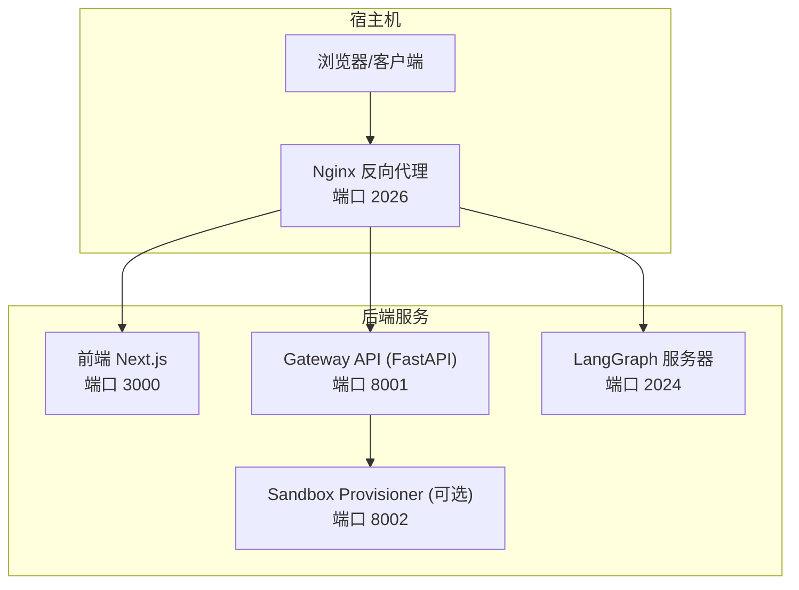
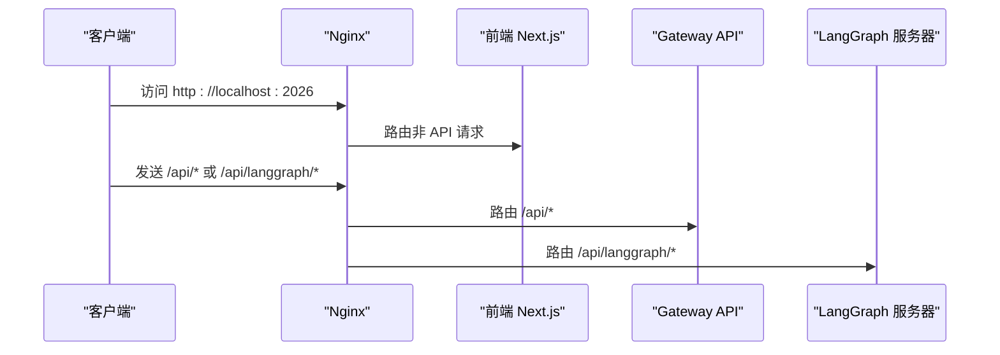
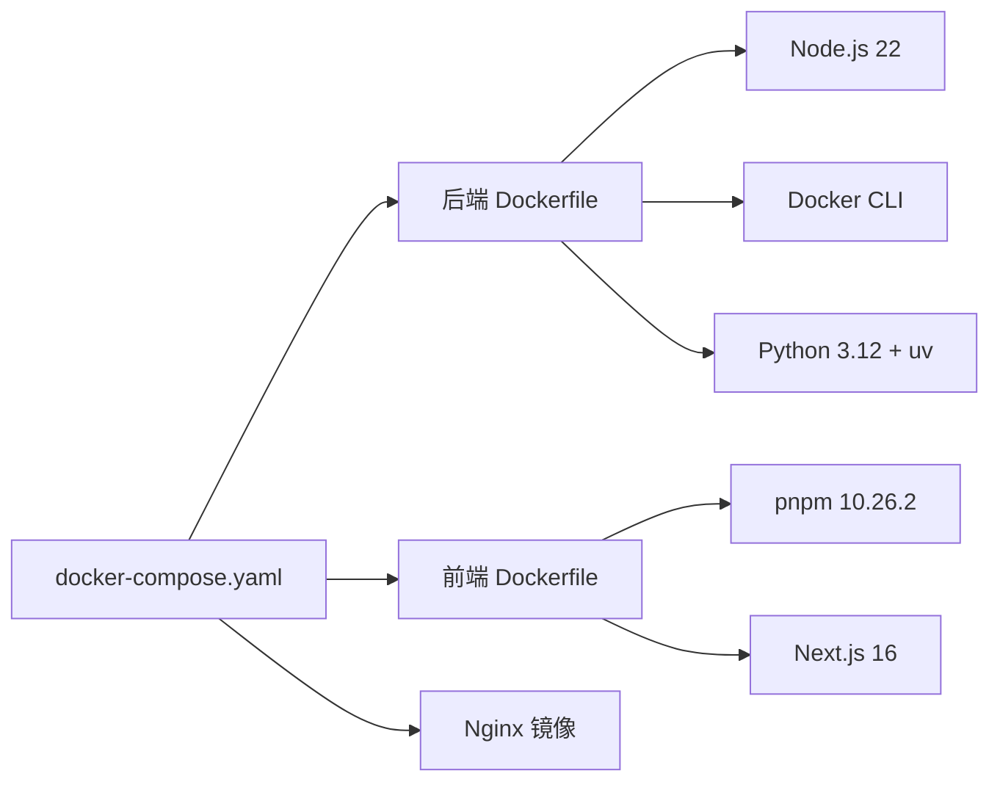

# 故障排除指南

<cite>
**本文档引用的文件**
- [README.md](file://README.md)
- [backend/README.md](file://backend/README.md)
- [frontend/README.md](file://frontend/README.md)
- [docker/docker-compose.yaml](file://docker/docker-compose.yaml)
- [docker/docker-compose-dev.yaml](file://docker/docker-compose-dev.yaml)
- [config.example.yaml](file://config.example.yaml)
- [backend/Dockerfile](file://backend/Dockerfile)
- [frontend/Dockerfile](file://frontend/Dockerfile)
- [CONTRIBUTING.md](file://CONTRIBUTING.md)
- [backend/docs/CONFIGURATION.md](file://backend/docs/CONFIGURATION.md)
- [backend/docs/SETUP.md](file://backend/docs/SETUP.md)
</cite>

## 目录
1. [简介](#简介)
2. [项目结构](#项目结构)
3. [核心组件](#核心组件)
4. [架构总览](#架构总览)
5. [详细组件分析](#详细组件分析)
6. [依赖关系分析](#依赖关系分析)
7. [性能考虑](#性能考虑)
8. [故障排除指南](#故障排除指南)
9. [结论](#结论)
10. [附录](#附录)

## 简介
本指南面向 DeerFlow 用户与维护者，提供系统化的故障排除方法与调试策略，覆盖安装问题、配置错误、运行时异常、日志分析、性能瓶颈识别、网络连接排查、Docker 相关问题、模型连接问题以及前端构建问题的解决方案，并给出社区支持渠道与问题反馈流程。

## 项目结构
DeerFlow 采用多服务分层架构：前端（Next.js）、网关（FastAPI）、LangGraph 服务器、反向代理（Nginx）与可选的沙箱容器或本地执行环境。开发与生产均通过 Docker Compose 编排，支持热重载与隔离的沙箱执行模式。



图表来源
- [docker/docker-compose.yaml:24-183](file://docker/docker-compose.yaml#L24-L183)
- [docker/docker-compose-dev.yaml:16-216](file://docker/docker-compose-dev.yaml#L16-L216)

章节来源
- [README.md:194-254](file://README.md#L194-L254)
- [backend/README.md:7-41](file://backend/README.md#L7-L41)
- [docker/docker-compose.yaml:1-183](file://docker/docker-compose.yaml#L1-L183)
- [docker/docker-compose-dev.yaml:1-216](file://docker/docker-compose-dev.yaml#L1-L216)

## 核心组件
- 前端（Next.js）：提供 Web 界面与 API 客户端，支持开发与生产两种镜像目标。
- 网关（FastAPI）：提供模型、MCP、技能、内存、上传、工件等 REST 接口。
- LangGraph 服务器：负责多智能体交互、线程管理与流式响应。
- 沙箱系统：提供本地或容器化隔离执行环境，支持路径映射与工具集。
- 反向代理（Nginx）：统一入口，路由到前端、网关与 LangGraph，处理跨域与长连接。

章节来源
- [backend/README.md:112-136](file://backend/README.md#L112-L136)
- [frontend/README.md:1-131](file://frontend/README.md#L1-L131)
- [docker/docker-compose.yaml:24-183](file://docker/docker-compose.yaml#L24-L183)

## 架构总览
请求在 Nginx 统一入口后，根据路径前缀路由至不同后端服务：
- `/api/langgraph/*` → LangGraph 服务器
- `/api/*`（其他）→ 网关 API
- 非 API 请求 → 前端静态资源



图表来源
- [backend/README.md:37-41](file://backend/README.md#L37-L41)
- [docker/docker-compose.yaml:26-39](file://docker/docker-compose.yaml#L26-L39)

章节来源
- [backend/README.md:37-41](file://backend/README.md#L37-L41)
- [docker/docker-compose.yaml:26-39](file://docker/docker-compose.yaml#L26-L39)

## 详细组件分析

### 网关 API（Gateway）
- 提供模型列表、MCP 配置、技能管理、内存读取与重载、线程上传与工件访问等接口。
- 支持删除线程本地数据（LangGraph 线程删除后清理）。

```mermaid
flowchart TD
Start(["请求进入 Gateway"]) --> Route{"路由匹配"}
Route --> |/api/models| ListModels["返回可用模型列表"]
Route --> |/api/mcp/config| MCPConfig["获取/更新 MCP 配置"]
Route --> |/api/skills| Skills["列出/启用/禁用技能"]
Route --> |/api/memory| Memory["读取/重载内存"]
Route --> |/api/threads/{id}/uploads| Uploads["上传/列举文件"]
Route --> |/api/threads/{id}| Cleanup["删除线程本地数据"]
Route --> |/api/threads/{id}/artifacts| Artifacts["提供生成工件"]
Route --> |其他| NotFound["404 未实现"]
```

图表来源
- [backend/README.md:112-130](file://backend/README.md#L112-L130)

章节来源
- [backend/README.md:112-130](file://backend/README.md#L112-L130)

### LangGraph 服务器
- 多智能体运行时，负责线程创建、消息流式传输与状态管理。
- 开发模式下使用 `langgraph dev`，生产镜像中同样基于该命令。

章节来源
- [backend/README.md:10-35](file://backend/README.md#L10-L35)
- [docker/docker-compose.yaml:104-148](file://docker/docker-compose.yaml#L104-L148)

### 沙箱系统
- 支持本地执行与容器执行（Docker/Apple Container/Kubernetes）。
- 虚拟路径映射到线程专属工作目录，自动挂载技能目录与 Docker Socket（DooD）。

章节来源
- [backend/README.md:72-82](file://backend/README.md#L72-L82)
- [config.example.yaml:316-371](file://config.example.yaml#L316-L371)
- [docker/docker-compose.yaml:65-99](file://docker/docker-compose.yaml#L65-L99)

### 前端（Next.js）
- 开发镜像仅安装依赖并启动 dev 服务；生产镜像预构建并运行。
- 支持环境变量注入与跳过环境校验（Docker 场景）。

章节来源
- [frontend/README.md:18-52](file://frontend/README.md#L18-L52)
- [frontend/Dockerfile:1-36](file://frontend/Dockerfile#L1-L36)

## 依赖关系分析
- 后端镜像同时安装 Node.js 与 Docker CLI，便于在容器内拉起沙箱容器（DooD）。
- 前端镜像使用 pnpm 并支持缓存复用。
- 生产编排通过卷挂载配置文件、技能目录与运行时数据目录。



图表来源
- [backend/Dockerfile:1-40](file://backend/Dockerfile#L1-L40)
- [frontend/Dockerfile:1-36](file://frontend/Dockerfile#L1-L36)
- [docker/docker-compose.yaml:24-183](file://docker/docker-compose.yaml#L24-L183)

章节来源
- [backend/Dockerfile:1-40](file://backend/Dockerfile#L1-L40)
- [frontend/Dockerfile:1-36](file://frontend/Dockerfile#L1-L36)
- [docker/docker-compose.yaml:1-183](file://docker/docker-compose.yaml#L1-L183)

## 性能考虑
- 上下文压缩与标题自动生成：在接近令牌上限时触发摘要，保留最近消息以维持长对话性能。
- 内存去抖动：批量处理记忆更新，降低 LLM 调用频率。
- 沙箱并发限制：默认最多 3 个子代理并发，超时时间可配置，避免资源争用。
- 前端构建优化：pnpm store 缓存与 SKIP_ENV_VALIDATION 在 Docker 中减少启动开销。

章节来源
- [config.example.yaml:441-487](file://config.example.yaml#L441-L487)
- [config.example.yaml:489-501](file://config.example.yaml#L489-L501)
- [config.example.yaml:373-387](file://config.example.yaml#L373-L387)
- [frontend/Dockerfile:24-25](file://frontend/Dockerfile#L24-L25)

## 故障排除指南

### 一、安装与环境准备

- 必备工具检查
  - 使用 `make check` 检查 Node.js 22+、pnpm、uv、nginx 是否就绪。
  - 若使用 Docker 开发，确保 Docker 已安装且用户具备访问权限。

- Docker 权限问题（Linux）
  - 症状：执行 `make docker-init/start/stop` 报“无法连接 Docker 守护进程”。
  - 解决：将当前用户加入 `docker` 组并重新登录；验证 `docker ps` 可用后再试。

- 前端依赖安装失败
  - 症状：pnpm 安装卡住或失败。
  - 解决：确认 pnpm 版本与缓存路径设置；必要时清理缓存后重试。

章节来源
- [README.md:226-254](file://README.md#L226-L254)
- [CONTRIBUTING.md:73-106](file://CONTRIBUTING.md#L73-L106)
- [frontend/README.md:18-27](file://frontend/README.md#L18-L27)

### 二、配置错误

- 配置文件位置与优先级
  - 建议放置于项目根目录 `deer-flow/config.yaml`。
  - 加载顺序：代码指定路径 > 环境变量 `DEER_FLOW_CONFIG_PATH` > 当前目录 backend/config.yaml > 父目录 config.yaml（推荐）。

- 配置版本不匹配
  - 症状：启动时提示配置版本过低。
  - 解决：运行 `make config-upgrade` 合并新字段，保留现有配置并生成备份。

- 环境变量未生效
  - 症状：模型 API Key 未被读取。
  - 解决：确认配置中使用 `$ENV_VAR_NAME` 形式；或直接在 `.env` 文件中导出。

- 技能未加载
  - 症状：技能目录为空或 SKILL.md 缺失。
  - 解决：检查 `skills.path` 与容器挂载路径；确保每个技能包含有效元数据文件。

章节来源
- [backend/docs/SETUP.md:42-51](file://backend/docs/SETUP.md#L42-L51)
- [backend/docs/CONFIGURATION.md:5-16](file://backend/docs/CONFIGURATION.md#L5-L16)
- [backend/docs/CONFIGURATION.md:326-341](file://backend/docs/CONFIGURATION.md#L326-L341)

### 三、运行时异常

- 端口冲突
  - 症状：Nginx/前端/网关/LangGraph 端口占用。
  - 解决：修改 `docker-compose.yaml` 中的端口映射或释放对应端口。

- 服务启动失败
  - 前端/网关/LangGraph 日志查看：使用 `make docker-logs[-frontend|-gateway]`。
  - 常见原因：依赖未安装、配置文件缺失、DooD 挂载失败。

- 前端无法访问
  - 症状：打开 http://localhost:2026 显示 404 或空白。
  - 解决：确认 Nginx 正常运行并正确路由到前端；检查前端镜像构建与启动参数。

章节来源
- [docker/docker-compose.yaml:26-39](file://docker/docker-compose.yaml#L26-L39)
- [docker/docker-compose-dev.yaml:63-76](file://docker/docker-compose-dev.yaml#L63-L76)
- [CONTRIBUTING.md:65-71](file://CONTRIBUTING.md#L65-L71)

### 四、日志分析技巧

- 日志位置
  - 开发模式：容器标准输出重定向到 `/app/logs`（frontend/gateway/langgraph）。
  - 生产模式：容器内应用日志输出到 stdout/stderr，建议结合 Docker 日志驱动集中收集。

- 关键日志点
  - 配置加载：确认 `config.yaml` 成功解析与版本检查。
  - 模型调用：开启令牌用量统计（如需）以定位耗时与成本异常。
  - 沙箱执行：观察容器启动、挂载与权限问题；DooD 模式下检查 Docker Socket 权限。

- 建议的日志级别
  - 常规排查：info
  - 深入分析：debug（注意日志量增大）

章节来源
- [config.example.yaml:18-30](file://config.example.yaml#L18-L30)
- [docker/docker-compose-dev.yaml:87-92](file://docker/docker-compose-dev.yaml#L87-L92)
- [docker/docker-compose-dev.yaml:113-122](file://docker/docker-compose-dev.yaml#L113-L122)

### 五、性能瓶颈识别

- 上下文膨胀
  - 症状：响应变慢、频繁触发摘要。
  - 解决：调整摘要阈值与保留策略；减少不必要的历史消息注入。

- 子代理并发过高
  - 症状：CPU/内存飙升。
  - 解决：降低并发数或延长超时；对耗时任务拆分步骤。

- 前端构建缓慢
  - 症状：首次启动慢、热更新延迟。
  - 解决：启用 pnpm store 缓存；在 Docker 中使用 SKIP_ENV_VALIDATION 减少校验。

章节来源
- [config.example.yaml:441-487](file://config.example.yaml#L441-L487)
- [config.example.yaml:373-387](file://config.example.yaml#L373-L387)
- [frontend/Dockerfile:24-25](file://frontend/Dockerfile#L24-L25)

### 六、网络连接问题排查

- 反向代理路由错误
  - 症状：部分 API 返回 404 或跨域失败。
  - 解决：核对 Nginx 配置中的路由规则与上游服务端口。

- MCP 服务器连接失败
  - 症状：MCP 工具不可用或超时。
  - 解决：确认 MCP 服务器可达、认证配置正确（OAuth/Token）；检查扩展配置文件。

- 沙箱容器网络
  - 症状：容器无法访问外部网络或挂载失败。
  - 解决：检查宿主机 Docker 网络、防火墙与代理设置；确认容器网络与宿主机映射。

章节来源
- [backend/README.md:37-41](file://backend/README.md#L37-L41)
- [docker/docker-compose.yaml:150-183](file://docker/docker-compose.yaml#L150-L183)

### 七、Docker 相关问题

- 镜像构建失败
  - 症状：uv/pnpm 安装依赖超时。
  - 解决：配置缓存卷（如 `~/.cache/uv`、pnpm store），在网络稳定环境下重试。

- 容器无法启动
  - 症状：容器反复重启或健康检查失败。
  - 解决：查看健康检查脚本与服务依赖；确认端口未被占用。

- DooD（在容器内拉起容器）失败
  - 症状：沙箱容器无法启动。
  - 解决：确认 `/var/run/docker.sock` 已正确挂载；Linux 下检查用户组权限。

章节来源
- [docker/docker-compose.yaml:65-99](file://docker/docker-compose.yaml#L65-L99)
- [backend/Dockerfile:19-23](file://backend/Dockerfile#L19-L23)

### 八、模型连接问题

- API Key 无效
  - 症状：模型调用返回鉴权错误。
  - 解决：确认环境变量已导出或配置文件中使用了正确的 `$VAR` 引用。

- OpenAI 兼容网关
  - 症状：使用 OpenRouter/Minimax 等网关时行为异常。
  - 解决：保持使用 `langchain_openai:ChatOpenAI` 并设置 `base_url`；对于需要思考签名的场景，使用补丁适配器。

- CLI 背书模型（Codex/Claude Code）
  - 症状：认证失败或无响应。
  - 解决：按文档准备认证文件或环境变量；macOS 下可使用提供的导出脚本。

章节来源
- [backend/docs/CONFIGURATION.md:62-66](file://backend/docs/CONFIGURATION.md#L62-L66)
- [backend/docs/CONFIGURATION.md:81-124](file://backend/docs/CONFIGURATION.md#L81-L124)
- [backend/docs/CONFIGURATION.md:126-167](file://backend/docs/CONFIGURATION.md#L126-L167)

### 九、前端构建问题

- 开发模式无法热更新
  - 症状：修改源码后页面不刷新。
  - 解决：确认前端容器使用 dev 目标并挂载源码目录；检查文件监听与缓存。

- 生产构建失败
  - 症状：pnpm build 报错。
  - 解决：先执行类型检查与 ESLint；确认 SKIP_ENV_VALIDATION 已在构建阶段设置。

- 环境变量注入问题
  - 症状：运行时变量未生效。
  - 解决：在 Docker 中通过环境变量注入；或在 Nginx 层转发到前端。

章节来源
- [frontend/README.md:28-52](file://frontend/README.md#L28-L52)
- [frontend/Dockerfile:16-35](file://frontend/Dockerfile#L16-L35)

### 十、社区支持与问题反馈

- 获取帮助
  - 查看现有 Issues 与 Discussions。
  - 阅读官方文档与贡献指南。

- 提交问题
  - 准备最小可复现示例与完整日志。
  - 附上环境信息（操作系统、Docker 版本、Node/Python 版本）。

章节来源
- [CONTRIBUTING.md:296-301](file://CONTRIBUTING.md#L296-L301)

## 结论
通过系统化的配置管理、日志分析与性能优化策略，大多数安装与运行时问题均可快速定位与解决。建议在生产环境中优先使用 Docker 沙箱模式以获得更好的隔离性与安全性，并结合 Nginx 的统一路由与健康检查机制提升稳定性。

## 附录

### 常见问题速查表
- 配置文件找不到：确认位于项目根目录或设置 `DEER_FLOW_CONFIG_PATH`。
- Docker 权限不足：将用户加入 `docker` 组并重新登录。
- 端口冲突：修改 `docker-compose.yaml` 中的端口映射。
- MCP 连接失败：检查服务器可达性与认证配置。
- 沙箱容器启动失败：确认 Docker Socket 挂载与网络连通。
- 前端构建失败：启用 pnpm store 缓存与跳过环境校验。

### 关键命令清单
- 开发环境：`make docker-start`、`make docker-logs`、`make docker-stop`
- 本地开发：`make dev`、`make install`、`make check`
- 生产部署：`make up`、`make down`
- 配置升级：`make config-upgrade`
- 沙箱预拉取：`make setup-sandbox`