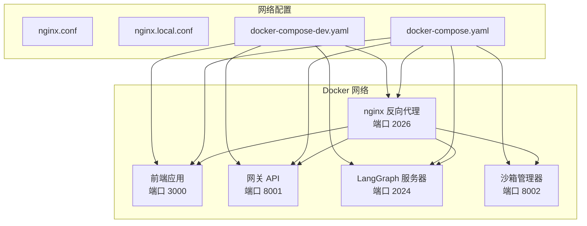
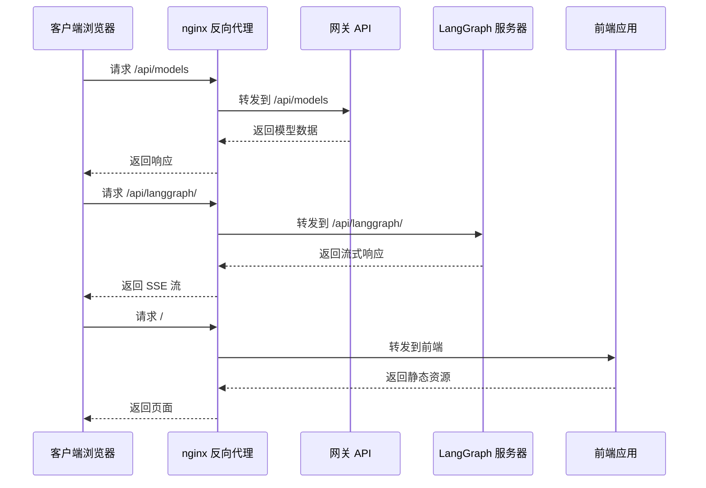
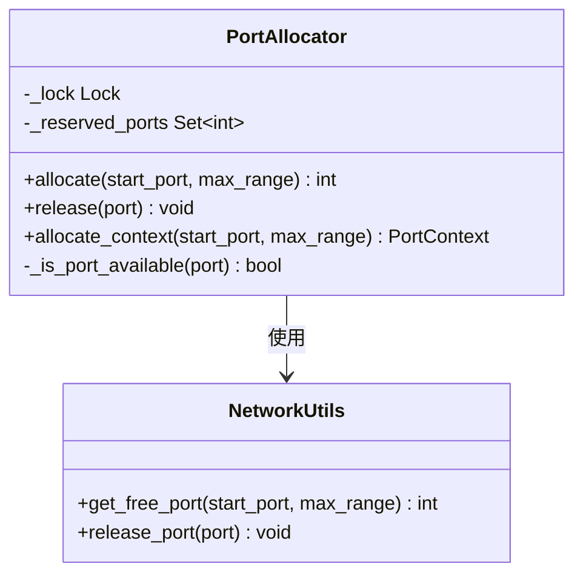
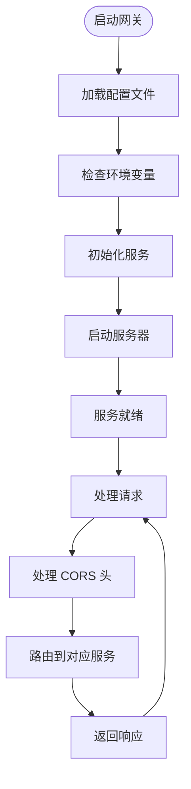
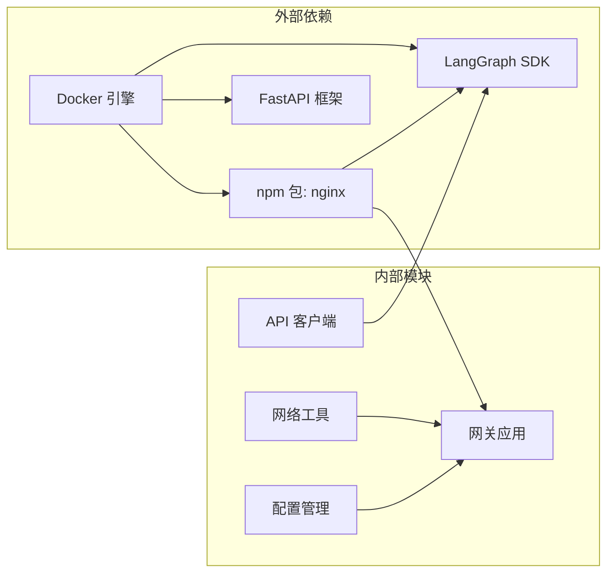

# 网络连接问题

<cite>
**本文档引用的文件**
- [nginx.conf](file://docker/nginx/nginx.conf)
- [nginx.local.conf](file://docker/nginx/nginx.local.conf)
- [docker-compose.yaml](file://docker/docker-compose.yaml)
- [docker-compose-dev.yaml](file://docker/docker-compose-dev.yaml)
- [app.py](file://backend/app/gateway/app.py)
- [config.py](file://backend/app/gateway/config.py)
- [network.py](file://backend/packages/harness/deerflow/utils/network.py)
- [wait-for-port.sh](file://scripts/wait-for-port.sh)
- [config.example.yaml](file://config.example.yaml)
- [extensions_config.example.json](file://extensions_config.example.json)
- [api-client.ts](file://frontend/src/core/api/api-client.ts)
</cite>

## 目录
1. [简介](#简介)
2. [项目结构](#项目结构)
3. [核心组件](#核心组件)
4. [架构概览](#架构概览)
5. [详细组件分析](#详细组件分析)
6. [依赖关系分析](#依赖关系分析)
7. [性能考虑](#性能考虑)
8. [故障排除指南](#故障排除指南)
9. [结论](#结论)

## 简介

DeerFlow 是一个基于 LangGraph 的 AI 代理后端系统，采用 Docker 容器化部署。本指南专注于解决网络连接相关的问题，包括端口冲突、反向代理配置错误、跨域问题等。文档涵盖了 Docker 容器网络通信问题、nginx 配置问题的诊断和修复，以及 API 网关路由错误、LangGraph 服务器连接失败等问题的解决方案。

## 项目结构

DeerFlow 采用多容器架构，包含以下关键服务：



**图表来源**
- [docker-compose.yaml:24-183](file://docker/docker-compose.yaml#L24-L183)
- [docker-compose-dev.yaml:16-216](file://docker/docker-compose-dev.yaml#L16-L216)

**章节来源**
- [docker-compose.yaml:1-183](file://docker/docker-compose.yaml#L1-L183)
- [docker-compose-dev.yaml:1-216](file://docker/docker-compose-dev.yaml#L1-L216)

## 核心组件

### 反向代理配置

nginx 作为系统的统一入口点，负责请求路由和负载均衡：

| 组件 | 作用 | 默认端口 |
|------|------|----------|
| nginx | 反向代理和请求路由 | 2026 |
| 前端应用 | Next.js 生产服务器 | 3000 |
| 网关 API | FastAPI 网关 | 8001 |
| LangGraph 服务器 | LangGraph 生产服务器 | 2024 |
| 沙箱管理器 | 可选的 Kubernetes 模式 | 8002 |

### 网络配置文件

系统提供了两种 nginx 配置模式：

1. **生产环境配置** (`nginx.conf`)
   - 使用 Docker 内部 DNS 解析
   - 支持沙箱管理器路由
   - 适用于 k3s 集群环境

2. **开发环境配置** (`nginx.local.conf`)
   - 使用 127.0.0.1 直接连接
   - 本地开发模式专用
   - 简化了网络配置

**章节来源**
- [nginx.conf:1-231](file://docker/nginx/nginx.conf#L1-L231)
- [nginx.local.conf:1-214](file://docker/nginx/nginx.local.conf#L1-L214)

## 架构概览



**图表来源**
- [nginx.conf:34-229](file://docker/nginx/nginx.conf#L34-L229)
- [app.py:73-196](file://backend/app/gateway/app.py#L73-L196)

## 详细组件分析

### 端口分配机制

系统实现了线程安全的端口分配机制，防止端口冲突：



**图表来源**
- [network.py:8-140](file://backend/packages/harness/deerflow/utils/network.py#L8-L140)

### 网关配置管理

网关支持动态配置加载和 CORS 设置：



**图表来源**
- [app.py:32-71](file://backend/app/gateway/app.py#L32-L71)
- [config.py:17-28](file://backend/app/gateway/config.py#L17-L28)

**章节来源**
- [network.py:1-140](file://backend/packages/harness/deerflow/utils/network.py#L1-L140)
- [app.py:1-201](file://backend/app/gateway/app.py#L1-L201)
- [config.py:1-28](file://backend/app/gateway/config.py#L1-L28)

## 依赖关系分析



**图表来源**
- [docker-compose.yaml:24-183](file://docker/docker-compose.yaml#L24-L183)
- [api-client.ts:1-37](file://frontend/src/core/api/api-client.ts#L1-L37)

**章节来源**
- [docker-compose.yaml:1-183](file://docker/docker-compose.yaml#L1-L183)
- [api-client.ts:1-37](file://frontend/src/core/api/api-client.ts#L1-L37)

## 性能考虑

### 连接超时设置

nginx 配置了合理的超时参数以支持长连接：

| 参数 | 生产环境 | 开发环境 | 说明 |
|------|----------|----------|------|
| proxy_connect_timeout | 600s | 600s | 连接超时 |
| proxy_send_timeout | 600s | 600s | 发送超时 |
| proxy_read_timeout | 600s | 600s | 读取超时 |

### 流式传输优化

LangGraph SSE 流式传输配置：
- 禁用代理缓冲：`proxy_buffering off`
- 禁用代理缓存：`proxy_cache off`
- 设置 X-Accel-Buffering：`X-Accel-Buffering no`

## 故障排除指南

### 端口冲突问题

#### 问题症状
- 容器启动失败，显示端口已被占用
- 日志中出现 "Address already in use" 错误
- Docker 端口映射冲突

#### 诊断步骤
1. **检查端口占用情况**：
   ```bash
   # 检查 2026 端口
   sudo lsof -i :2026
   
   # 检查 8001 端口
   sudo lsof -i :8001
   
   # 检查 2024 端口
   sudo lsof -i :2024
   ```

2. **查看 Docker 端口映射**：
   ```bash
   docker ps
   docker port deer-flow-nginx
   ```

3. **修改端口配置**：
   在 `.env` 文件中修改 PORT 变量：
   ```
   PORT=2027
   ```

#### 解决方案
1. **停止占用端口的服务**：
   ```bash
   sudo kill -9 $(sudo lsof -t -i :2026)
   ```

2. **使用不同的端口号**：
   修改 `docker-compose.yaml` 中的端口映射：
   ```yaml
   ports:
     - "${PORT:-2027}:2026"  # 修改为 2027
   ```

3. **重启服务**：
   ```bash
   docker-compose down
   docker-compose up -d
   ```

**章节来源**
- [wait-for-port.sh:1-62](file://scripts/wait-for-port.sh#L1-L62)
- [network.py:58-80](file://backend/packages/harness/deerflow/utils/network.py#L58-L80)

### 反向代理配置错误

#### 问题症状
- 访问 API 时出现 502 Bad Gateway
- 页面无法加载或加载缓慢
- CORS 相关错误

#### 诊断步骤
1. **检查 nginx 配置语法**：
   ```bash
   docker exec deer-flow-nginx nginx -t
   ```

2. **查看 nginx 错误日志**：
   ```bash
   docker logs deer-flow-nginx
   ```

3. **验证上游服务器状态**：
   ```bash
   # 检查网关服务
   curl http://localhost:8001/health
   
   # 检查 LangGraph 服务
   curl http://localhost:2024/health
   
   # 检查前端服务
   curl http://localhost:3000
   ```

#### 常见配置问题

1. **上游服务器地址错误**：
   ```nginx
   # 生产环境 (使用 Docker 服务名)
   upstream gateway {
       server gateway:8001;
   }
   
   # 开发环境 (使用 127.0.0.1)
   upstream gateway {
       server 127.0.0.1:8001;
   }
   ```

2. **CORS 配置问题**：
   ```nginx
   # 隐藏上游的 CORS 头
   proxy_hide_header 'Access-Control-Allow-Origin';
   proxy_hide_header 'Access-Control-Allow-Methods';
   
   # 添加中心化的 CORS 头
   add_header 'Access-Control-Allow-Origin' '*' always;
   add_header 'Access-Control-Allow-Methods' 'GET, POST, PUT, DELETE, PATCH, OPTIONS' always;
   add_header 'Access-Control-Allow-Headers' '*' always;
   ```

3. **路径重写问题**：
   ```nginx
   # LangGraph 路径重写
   location /api/langgraph/ {
       rewrite ^/api/langgraph/(.*) /$1 break;
       proxy_pass http://langgraph;
   }
   ```

**章节来源**
- [nginx.conf:34-229](file://docker/nginx/nginx.conf#L34-L229)
- [nginx.local.conf:30-212](file://docker/nginx/nginx.local.conf#L30-L212)

### 跨域问题 (CORS)

#### 问题症状
- 浏览器控制台出现 CORS 错误
- API 请求被阻止
- 预检请求失败

#### 解决方案
1. **检查 CORS 配置**：
   ```nginx
   # 隐藏上游的 CORS 头
   proxy_hide_header 'Access-Control-Allow-Origin';
   proxy_hide_header 'Access-Control-Allow-Methods';
   proxy_hide_header 'Access-Control-Allow-Headers';
   
   # 添加中心化的 CORS 头
   add_header 'Access-Control-Allow-Origin' '*' always;
   add_header 'Access-Control-Allow-Methods' 'GET, POST, PUT, DELETE, PATCH, OPTIONS' always;
   add_header 'Access-Control-Allow-Headers' '*' always;
   
   # 处理 OPTIONS 预检请求
   if ($request_method = 'OPTIONS') {
       return 204;
   }
   ```

2. **验证网关 CORS 设置**：
   ```python
   # 网关配置中的 CORS 设置
   class GatewayConfig(BaseModel):
       cors_origins: list[str] = Field(default_factory=lambda: ["http://localhost:3000"])
   ```

3. **检查前端请求头**：
   ```typescript
   // API 客户端配置
   const client = new LangGraphClient({
       apiUrl: getLangGraphBaseURL(isMock),
   });
   ```

**章节来源**
- [nginx.conf:39-53](file://docker/nginx/nginx.conf#L39-L53)
- [config.py:11](file://backend/app/gateway/config.py#L11)
- [api-client.ts:9-37](file://frontend/src/core/api/api-client.ts#L9-L37)

### Docker 容器网络通信问题

#### 问题症状
- 容器间无法通信
- DNS 解析失败
- 服务启动超时

#### 诊断步骤
1. **检查 Docker 网络**：
   ```bash
   # 查看网络配置
   docker network ls
   
   # 检查容器网络连接
   docker network inspect deer-flow
   
   # 查看容器 IP 地址
   docker inspect deer-flow-nginx | grep IPAddress
   ```

2. **测试容器间通信**：
   ```bash
   # 从 nginx 测试到网关的连接
   docker exec deer-flow-nginx curl http://gateway:8001/health
   
   # 从 nginx 测试到 LangGraph 的连接
   docker exec deer-flow-nginx curl http://langgraph:2024/health
   ```

3. **检查 DNS 配置**：
   ```nginx
   # 生产环境使用 Docker 内部 DNS
   resolver 127.0.0.11 valid=10s ipv6=off;
   
   # 开发环境使用本地 DNS
   resolver 127.0.0.11 valid=10s ipv6=off;
   ```

#### 解决方案
1. **确保所有容器都在同一网络**：
   ```yaml
   networks:
     - deer-flow  # 或 deer-flow-dev
   
   # 在每个服务中指定相同的网络
   networks:
     deer-flow:
       driver: bridge
   ```

2. **检查容器健康检查**：
   ```yaml
   # 网关健康检查
   healthcheck:
     test: ["CMD", "curl", "-f", "http://localhost:8001/health"]
   
   # LangGraph 健康检查
   healthcheck:
     test: ["CMD", "curl", "-f", "http://localhost:2024/health"]
   ```

3. **验证服务依赖关系**：
   ```yaml
   depends_on:
     frontend:
       condition: service_started
     gateway:
       condition: service_started
     langgraph:
       condition: service_started
   ```

**章节来源**
- [docker-compose.yaml:37-38](file://docker/docker-compose.yaml#L37-L38)
- [docker-compose-dev.yaml:70-73](file://docker/docker-compose-dev.yaml#L70-L73)

### nginx 配置问题诊断

#### 问题症状
- nginx 启动失败
- 配置语法错误
- 服务无法访问

#### 诊断步骤
1. **验证配置文件语法**：
   ```bash
   # 检查生产配置
   docker exec deer-flow-nginx nginx -t -c /etc/nginx/nginx.conf
   
   # 检查开发配置
   docker exec deer-flow-nginx nginx -t -c /etc/nginx/nginx.local.conf
   ```

2. **查看详细错误信息**：
   ```bash
   # 查看错误日志
   docker exec deer-flow-nginx cat /var/log/nginx/error.log
   
   # 查看访问日志
   docker exec deer-flow-nginx cat /var/log/nginx/access.log
   ```

3. **测试特定路由**：
   ```bash
   # 测试 API 路由
   curl -I http://localhost:2026/api/models
   
   # 测试 LangGraph 路由
   curl -I http://localhost:2026/api/langgraph/
   
   # 测试健康检查
   curl -I http://localhost:2026/health
   ```

#### 常见配置错误

1. **路径匹配问题**：
   ```nginx
   # 正确的正则表达式语法
   location ~ ^/api/threads/[^/]+/uploads {
       proxy_pass http://gateway;
   }
   
   # 错误的语法（缺少转义）
   # location ~ ^/api/threads/[^/]+/uploads {
   ```

2. **代理头设置问题**：
   ```nginx
   # 必需的代理头
   proxy_set_header Host $host;
   proxy_set_header X-Real-IP $remote_addr;
   proxy_set_header X-Forwarded-For $proxy_add_x_forwarded_for;
   proxy_set_header X-Forwarded-Proto $scheme;
   
   # WebSocket 支持
   proxy_set_header Upgrade $http_upgrade;
   proxy_set_header Connection 'upgrade';
   ```

3. **超时设置问题**：
   ```nginx
   # LangGraph 流式传输超时
   proxy_connect_timeout 600s;
   proxy_send_timeout 600s;
   proxy_read_timeout 600s;
   
   # 代理缓冲设置
   proxy_buffering off;
   proxy_cache off;
   proxy_set_header X-Accel-Buffering no;
   ```

**章节来源**
- [nginx.conf:55-81](file://docker/nginx/nginx.conf#L55-L81)
- [nginx.conf:133-155](file://docker/nginx/nginx.conf#L133-L155)
- [nginx.local.conf:51-77](file://docker/nginx/nginx.local.conf#L51-L77)

### API 网关路由错误

#### 问题症状
- API 请求返回 404 Not Found
- 路由不匹配
- 请求被错误地转发

#### 诊断步骤
1. **检查路由注册**：
   ```python
   # 网关应用中的路由注册
   app.include_router(models.router)      # /api/models
   app.include_router(mcp.router)        # /api/mcp
   app.include_router(memory.router)     # /api/memory
   app.include_router(skills.router)     # /api/skills
   app.include_router(artifacts.router)  # /api/threads/{thread_id}/artifacts
   ```

2. **验证请求路径**：
   ```bash
   # 测试正确的路由
   curl http://localhost:2026/api/models
   curl http://localhost:2026/api/memory
   curl http://localhost:2026/api/skills
   ```

3. **检查 nginx 路由配置**：
   ```nginx
   # 网关路由映射
   location /api/models {
       proxy_pass http://gateway;
   }
   
   location /api/memory {
       proxy_pass http://gateway;
   }
   
   location /api/skills {
       proxy_pass http://gateway;
   }
   ```

#### 解决方案
1. **更新路由配置**：
   ```python
   # 确保所有路由都正确注册
   app.include_router(models.router)
   app.include_router(mcp.router)
   app.include_router(memory.router)
   app.include_router(skills.router)
   app.include_router(artifacts.router)
   app.include_router(uploads.router)
   app.include_router(threads.router)
   app.include_router(agents.router)
   app.include_router(suggestions.router)
   app.include_router(channels.router)
   ```

2. **验证路由优先级**：
   ```nginx
   # 特殊路由优先于通用路由
   location ~ ^/api/threads/[^/]+/uploads {
       proxy_pass http://gateway;
   }
   
   location ~ ^/api/threads {
       proxy_pass http://gateway;
   }
   ```

**章节来源**
- [app.py:156-185](file://backend/app/gateway/app.py#L156-L185)
- [nginx.conf:83-155](file://docker/nginx/nginx.conf#L83-L155)

### LangGraph 服务器连接失败

#### 问题症状
- LangGraph 服务无法启动
- 连接超时错误
- SSE 流式传输失败

#### 诊断步骤
1. **检查 LangGraph 服务状态**：
   ```bash
   # 查看容器日志
   docker logs deer-flow-langgraph
   
   # 检查服务健康
   curl http://localhost:2024/health
   ```

2. **验证配置文件**：
   ```bash
   # 检查 config.yaml 是否存在
   docker exec deer-flow-langgraph ls /app/config.yaml
   
   # 检查扩展配置
   docker exec deer-flow-langgraph ls /app/extensions_config.json
   ```

3. **测试端口连通性**：
   ```bash
   # 从 nginx 测试连接
   docker exec deer-flow-nginx curl http://langgraph:2024/health
   
   # 从网关测试连接
   docker exec deer-flow-gateway curl http://localhost:2024/health
   ```

#### 解决方案
1. **检查配置文件权限**：
   ```yaml
   # 确保配置文件可读
   volumes:
     - ${DEER_FLOW_CONFIG_PATH}:/app/backend/config.yaml:ro
     - ${DEER_FLOW_EXTENSIONS_CONFIG_PATH}:/app/backend/extensions_config.json:ro
   ```

2. **验证环境变量**：
   ```bash
   # 检查必需的环境变量
   DEER_FLOW_HOME
   DEER_FLOW_CONFIG_PATH
   DEER_FLOW_EXTENSIONS_CONFIG_PATH
   ```

3. **调整超时设置**：
   ```nginx
   # LangGraph 流式传输超时
   location /api/langgraph/ {
       proxy_pass http://langgraph;
       proxy_connect_timeout 600s;
       proxy_send_timeout 600s;
       proxy_read_timeout 600s;
   }
   ```

**章节来源**
- [docker-compose.yaml:104-148](file://docker/docker-compose.yaml#L104-L148)
- [nginx.conf:55-81](file://docker/nginx/nginx.conf#L55-L81)

### 网络连通性测试工具

#### 端口等待脚本
系统提供了专门的端口等待工具：

```bash
#!/bin/bash
# wait-for-port.sh - 等待 TCP 端口变为可用

# 使用示例
./scripts/wait-for-port.sh 2024 60 "LangGraph"

# 参数说明
# $1: 端口号 (必需)
# $2: 超时秒数 (默认: 60)
# $3: 服务名称 (默认: "Service")
```

#### 配置验证方法

1. **检查配置文件**：
   ```bash
   # 验证 YAML 语法
   python -m yaml config.yaml
   
   # 检查必需字段
   grep -E "(models|tools|sandbox)" config.yaml
   ```

2. **验证扩展配置**：
   ```bash
   # 检查 MCP 服务器配置
   jq '.mcpServers' extensions_config.json
   
   # 验证端点配置
   grep -E "(enabled|type|command)" extensions_config.json
   ```

3. **测试 API 连通性**：
   ```bash
   # 健康检查
   curl -f http://localhost:2026/health
   
   # 模型列表
   curl http://localhost:2026/api/models
   
   # 文档接口
   curl http://localhost:2026/openapi.json
   ```

**章节来源**
- [wait-for-port.sh:16-62](file://scripts/wait-for-port.sh#L16-L62)
- [config.example.yaml:1-624](file://config.example.yaml#L1-L624)
- [extensions_config.example.json:1-42](file://extensions_config.example.json#L1-L42)

## 结论

DeerFlow 的网络连接问题通常源于端口冲突、反向代理配置错误或容器网络通信问题。通过理解系统的多容器架构和网络配置，可以有效地诊断和解决这些问题。

关键要点：
- 使用端口分配机制避免端口冲突
- 正确配置 nginx 反向代理和 CORS 头
- 确保容器间的网络连通性和 DNS 解析
- 实施适当的超时和缓冲配置
- 利用提供的诊断工具进行问题排查

建议在部署前进行完整的网络连通性测试，并建立监控机制来及时发现和解决网络问题。