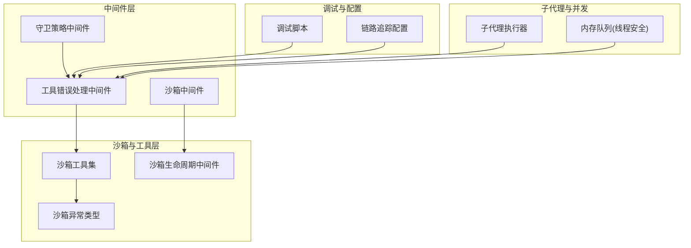
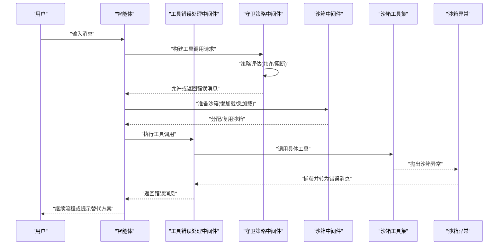
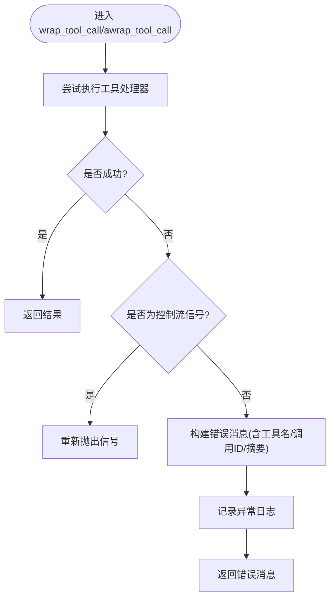
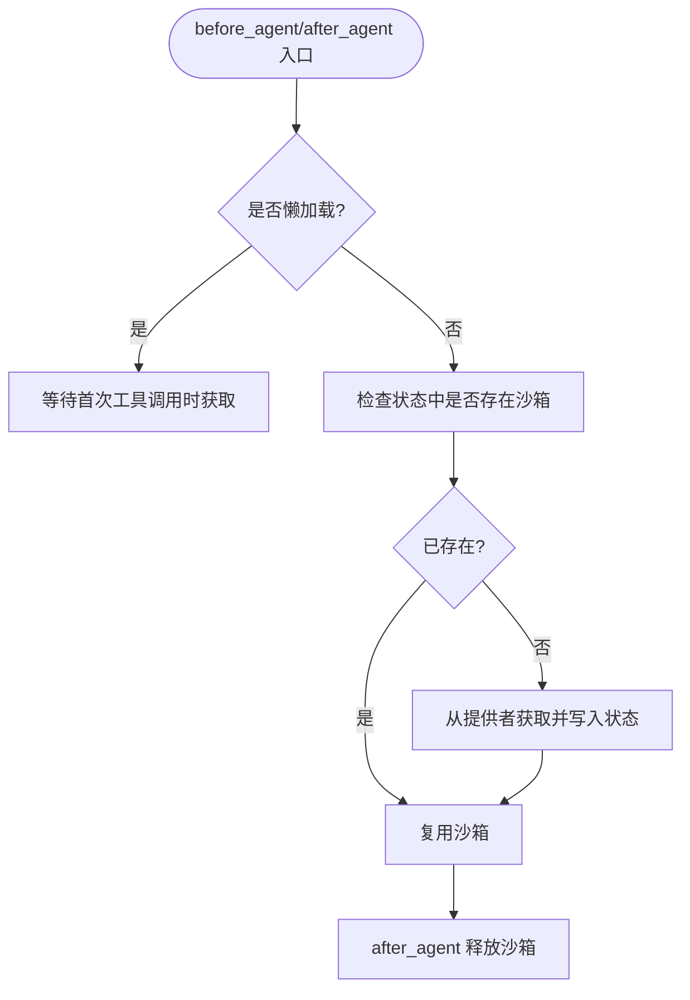
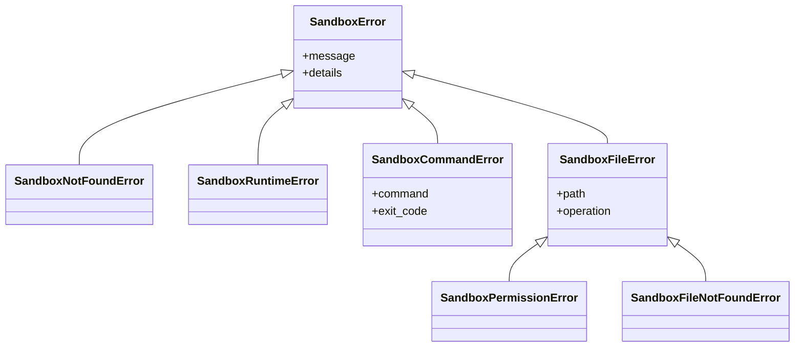
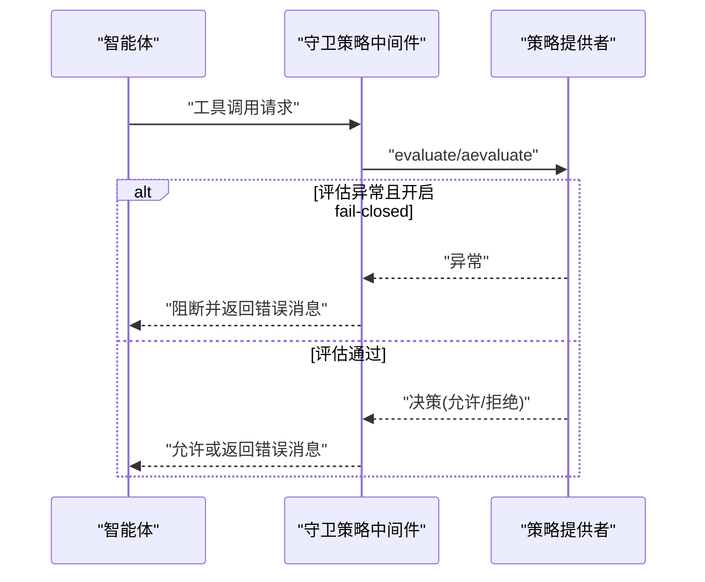
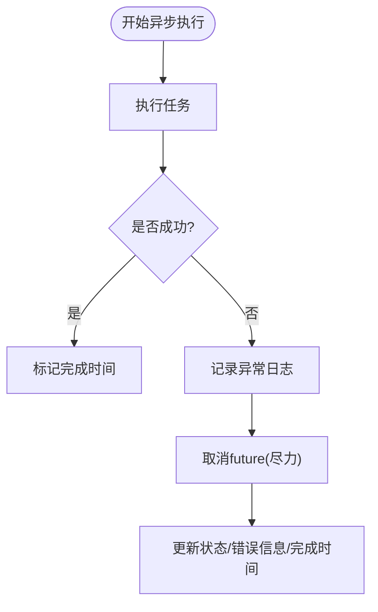
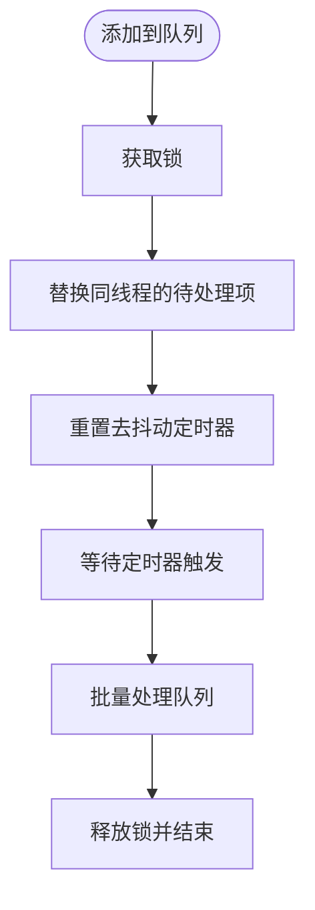
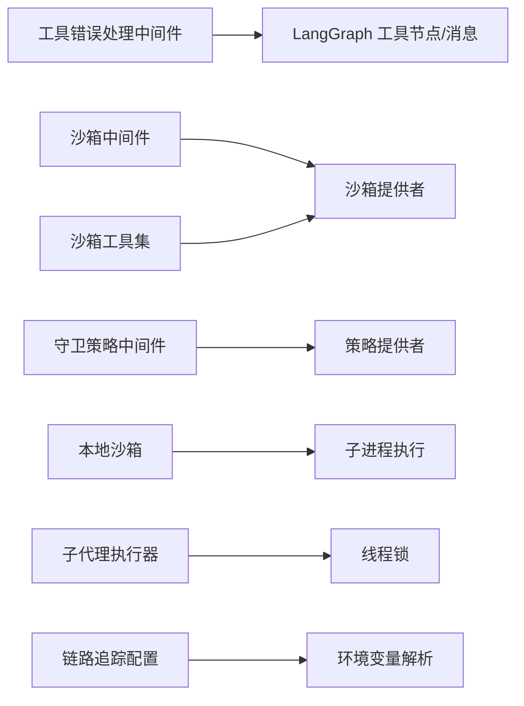

# 运行时异常

<cite>
**本文引用的文件**
- [backend/packages/harness/deerflow/sandbox/exceptions.py](file://backend/packages/harness/deerflow/sandbox/exceptions.py)
- [backend/packages/harness/deerflow/sandbox/tools.py](file://backend/packages/harness/deerflow/sandbox/tools.py)
- [backend/packages/harness/deerflow/sandbox/middleware.py](file://backend/packages/harness/deerflow/sandbox/middleware.py)
- [backend/packages/harness/deerflow/agents/middlewares/tool_error_handling_middleware.py](file://backend/packages/harness/deerflow/agents/middlewares/tool_error_handling_middleware.py)
- [backend/packages/harness/deerflow/guardrails/middleware.py](file://backend/packages/harness/deerflow/guardrails/middleware.py)
- [backend/packages/harness/deerflow/subagents/executor.py](file://backend/packages/harness/deerflow/subagents/executor.py)
- [backend/debug.py](file://backend/debug.py)
- [backend/packages/harness/deerflow/config/tracing_config.py](file://backend/packages/harness/deerflow/config/tracing_config.py)
- [backend/tests/test_tool_error_handling_middleware.py](file://backend/tests/test_tool_error_handling_middleware.py)
- [backend/packages/harness/deerflow/models/claude_provider.py](file://backend/packages/harness/deerflow/models/claude_provider.py)
- [backend/packages/harness/deerflow/agents/memory/queue.py](file://backend/packages/harness/deerflow/agents/memory/queue.py)
</cite>

## 目录
1. [简介](#简介)
2. [项目结构](#项目结构)
3. [核心组件](#核心组件)
4. [架构总览](#架构总览)
5. [详细组件分析](#详细组件分析)
6. [依赖分析](#依赖分析)
7. [性能考量](#性能考量)
8. [故障排除指南](#故障排除指南)
9. [结论](#结论)
10. [附录](#附录)

## 简介
本指南聚焦 DeerFlow 在运行时可能遇到的异常场景，覆盖智能体执行错误、中间件异常、沙箱执行失败、并发问题（内存溢出、死锁、资源竞争）以及调试与日志分析方法。文档基于仓库中实际实现，提供可操作的定位步骤、堆栈分析要点与修复建议。

## 项目结构
围绕“运行时异常”的关键模块分布如下：
- 沙箱与工具层：负责命令执行、路径解析、文件读写与异常封装
- 中间件层：统一捕获工具调用异常、沙箱生命周期管理、守卫策略评估
- 子代理与并发：后台任务执行、超时与取消、状态追踪
- 调试与配置：本地调试脚本、链路追踪开关、环境变量优先级

图示来源
- [backend/packages/harness/deerflow/agents/middlewares/tool_error_handling_middleware.py:1-138](file://backend/packages/harness/deerflow/agents/middlewares/tool_error_handling_middleware.py#L1-L138)
- [backend/packages/harness/deerflow/guardrails/middleware.py:1-99](file://backend/packages/harness/deerflow/guardrails/middleware.py#L1-L99)
- [backend/packages/harness/deerflow/sandbox/middleware.py:1-84](file://backend/packages/harness/deerflow/sandbox/middleware.py#L1-L84)
- [backend/packages/harness/deerflow/sandbox/tools.py:560-759](file://backend/packages/harness/deerflow/sandbox/tools.py#L560-L759)
- [backend/packages/harness/deerflow/sandbox/exceptions.py:1-72](file://backend/packages/harness/deerflow/sandbox/exceptions.py#L1-L72)
- [backend/packages/harness/deerflow/subagents/executor.py:442-450](file://backend/packages/harness/deerflow/subagents/executor.py#L442-L450)
- [backend/packages/harness/deerflow/agents/memory/queue.py:1-93](file://backend/packages/harness/deerflow/agents/memory/queue.py#L1-L93)
- [backend/debug.py:1-92](file://backend/debug.py#L1-L92)
- [backend/packages/harness/deerflow/config/tracing_config.py:1-95](file://backend/packages/harness/deerflow/config/tracing_config.py#L1-L95)

章节来源
- [backend/packages/harness/deerflow/agents/middlewares/tool_error_handling_middleware.py:1-138](file://backend/packages/harness/deerflow/agents/middlewares/tool_error_handling_middleware.py#L1-L138)
- [backend/packages/harness/deerflow/sandbox/middleware.py:1-84](file://backend/packages/harness/deerflow/sandbox/middleware.py#L1-L84)
- [backend/packages/harness/deerflow/sandbox/tools.py:560-759](file://backend/packages/harness/deerflow/sandbox/tools.py#L560-L759)
- [backend/packages/harness/deerflow/sandbox/exceptions.py:1-72](file://backend/packages/harness/deerflow/sandbox/exceptions.py#L1-L72)
- [backend/packages/harness/deerflow/subagents/executor.py:442-450](file://backend/packages/harness/deerflow/subagents/executor.py#L442-L450)
- [backend/packages/harness/deerflow/agents/memory/queue.py:1-93](file://backend/packages/harness/deerflow/agents/memory/queue.py#L1-L93)
- [backend/debug.py:1-92](file://backend/debug.py#L1-L92)
- [backend/packages/harness/deerflow/config/tracing_config.py:1-95](file://backend/packages/harness/deerflow/config/tracing_config.py#L1-L95)

## 核心组件
- 工具错误处理中间件：将工具调用异常转换为错误消息，保证流程继续；保留中断/暂停/恢复信号
- 沙箱中间件：按需获取/释放沙箱，支持懒加载与急加载两种模式
- 沙箱异常体系：统一的异常基类与细分类型（未找到、运行时错误、命令错误、文件错误、权限错误、文件未找到）
- 沙箱工具集：命令执行、目录列举、文件读写等，对异常进行分类与包装
- 守卫策略中间件：在工具调用前进行策略评估，失败时返回错误消息或根据配置阻断
- 子代理执行器：异步任务执行失败时记录日志并更新状态
- 内存队列：带去抖动的线程安全队列，避免重复处理与竞态
- 调试脚本与链路追踪：本地调试入口、日志格式化、链路追踪开关

章节来源
- [backend/packages/harness/deerflow/agents/middlewares/tool_error_handling_middleware.py:1-138](file://backend/packages/harness/deerflow/agents/middlewares/tool_error_handling_middleware.py#L1-L138)
- [backend/packages/harness/deerflow/sandbox/middleware.py:1-84](file://backend/packages/harness/deerflow/sandbox/middleware.py#L1-L84)
- [backend/packages/harness/deerflow/sandbox/exceptions.py:1-72](file://backend/packages/harness/deerflow/sandbox/exceptions.py#L1-L72)
- [backend/packages/harness/deerflow/sandbox/tools.py:560-759](file://backend/packages/harness/deerflow/sandbox/tools.py#L560-L759)
- [backend/packages/harness/deerflow/guardrails/middleware.py:1-99](file://backend/packages/harness/deerflow/guardrails/middleware.py#L1-L99)
- [backend/packages/harness/deerflow/subagents/executor.py:442-450](file://backend/packages/harness/deerflow/subagents/executor.py#L442-L450)
- [backend/packages/harness/deerflow/agents/memory/queue.py:1-93](file://backend/packages/harness/deerflow/agents/memory/queue.py#L1-L93)
- [backend/debug.py:1-92](file://backend/debug.py#L1-L92)
- [backend/packages/harness/deerflow/config/tracing_config.py:1-95](file://backend/packages/harness/deerflow/config/tracing_config.py#L1-L95)

## 架构总览
下图展示从用户输入到工具执行、异常捕获与恢复的整体流程，以及关键异常类型的落点。

图示来源
- [backend/packages/harness/deerflow/agents/middlewares/tool_error_handling_middleware.py:1-138](file://backend/packages/harness/deerflow/agents/middlewares/tool_error_handling_middleware.py#L1-L138)
- [backend/packages/harness/deerflow/guardrails/middleware.py:1-99](file://backend/packages/harness/deerflow/guardrails/middleware.py#L1-L99)
- [backend/packages/harness/deerflow/sandbox/middleware.py:1-84](file://backend/packages/harness/deerflow/sandbox/middleware.py#L1-L84)
- [backend/packages/harness/deerflow/sandbox/tools.py:560-759](file://backend/packages/harness/deerflow/sandbox/tools.py#L560-L759)
- [backend/packages/harness/deerflow/sandbox/exceptions.py:1-72](file://backend/packages/harness/deerflow/sandbox/exceptions.py#L1-L72)

## 详细组件分析

### 组件A：工具错误处理中间件
- 功能要点
  - 将同步/异步工具调用中的异常转换为错误消息，携带工具名、调用ID与异常摘要
  - 对中断/暂停/恢复信号保持透传，不被吞掉
  - 日志记录异常详情，便于定位
- 关键行为
  - 包装工具调用：捕获异常并构造错误消息
  - 异常摘要长度限制，避免过长内容
  - 丢失调用ID时使用占位符，确保消息可追踪

图示来源
- [backend/packages/harness/deerflow/agents/middlewares/tool_error_handling_middleware.py:1-138](file://backend/packages/harness/deerflow/agents/middlewares/tool_error_handling_middleware.py#L1-L138)

章节来源
- [backend/packages/harness/deerflow/agents/middlewares/tool_error_handling_middleware.py:1-138](file://backend/packages/harness/deerflow/agents/middlewares/tool_error_handling_middleware.py#L1-L138)
- [backend/tests/test_tool_error_handling_middleware.py:1-97](file://backend/tests/test_tool_error_handling_middleware.py#L1-L97)

### 组件B：沙箱中间件与生命周期
- 功能要点
  - 支持懒加载与急加载两种模式，减少不必要的初始化开销
  - 在 before_agent/after_agent 阶段完成沙箱分配与释放
  - 复用同一线程内的沙箱实例，避免频繁重建
- 关键行为
  - 懒加载：首次工具调用时获取沙箱
  - 急加载：首次代理调用时获取沙箱
  - 释放策略：在 after_agent 或上下文中释放

图示来源
- [backend/packages/harness/deerflow/sandbox/middleware.py:1-84](file://backend/packages/harness/deerflow/sandbox/middleware.py#L1-L84)

章节来源
- [backend/packages/harness/deerflow/sandbox/middleware.py:1-84](file://backend/packages/harness/deerflow/sandbox/middleware.py#L1-L84)

### 组件C：沙箱异常体系与工具集
- 异常类型
  - 基类：包含消息与结构化细节
  - 未找到：找不到沙箱或资源
  - 运行时错误：运行时不可用或状态缺失
  - 命令错误：命令执行失败，携带命令与退出码
  - 文件错误：文件/目录操作失败，携带路径与操作
  - 权限错误：文件操作权限不足
  - 文件未找到：文件或目录不存在
- 工具集行为
  - 命令执行：本地沙箱会解析容器路径到宿主路径，执行后反向映射输出路径
  - 列举目录：支持最大深度限制
  - 读写文件：对底层异常重抛，保留原始路径以便清晰报错
  - 错误包装：捕获沙箱异常与通用异常，统一包装为“Error: ...”字符串返回

图示来源
- [backend/packages/harness/deerflow/sandbox/exceptions.py:1-72](file://backend/packages/harness/deerflow/sandbox/exceptions.py#L1-L72)

章节来源
- [backend/packages/harness/deerflow/sandbox/exceptions.py:1-72](file://backend/packages/harness/deerflow/sandbox/exceptions.py#L1-L72)
- [backend/packages/harness/deerflow/sandbox/tools.py:560-759](file://backend/packages/harness/deerflow/sandbox/tools.py#L560-L759)

### 组件D：守卫策略中间件
- 功能要点
  - 在工具调用前进行策略评估
  - 提供 fail-closed/fail-open 两种行为
  - 记录拒绝原因与策略编号，便于审计
- 关键行为
  - 同步/异步评估，异常时按配置决定阻断或放行
  - 构造错误消息并返回，让智能体选择替代方案

图示来源
- [backend/packages/harness/deerflow/guardrails/middleware.py:1-99](file://backend/packages/harness/deerflow/guardrails/middleware.py#L1-L99)

章节来源
- [backend/packages/harness/deerflow/guardrails/middleware.py:1-99](file://backend/packages/harness/deerflow/guardrails/middleware.py#L1-L99)

### 组件E：子代理执行器与并发问题
- 行为要点
  - 异步任务执行失败时记录日志并更新任务状态
  - 取消执行 future（尽力而为），避免僵尸任务
- 并发注意
  - 使用锁保护后台任务字典，避免竞态
  - 任务状态字段包含错误信息与完成时间

图示来源
- [backend/packages/harness/deerflow/subagents/executor.py:442-450](file://backend/packages/harness/deerflow/subagents/executor.py#L442-L450)

章节来源
- [backend/packages/harness/deerflow/subagents/executor.py:442-450](file://backend/packages/harness/deerflow/subagents/executor.py#L442-L450)

### 组件F：内存队列与资源竞争
- 行为要点
  - 去抖动定时器批量处理，避免高频更新
  - 线程安全：使用锁与 Timer，防止重复处理与竞态
  - 已处理标志避免重复创建目录等冗余操作
- 并发注意
  - 处理中再次触发会重置定时器，避免丢失事件
  - 定时器设置为守护线程，避免阻塞进程退出

图示来源
- [backend/packages/harness/deerflow/agents/memory/queue.py:1-93](file://backend/packages/harness/deerflow/agents/memory/queue.py#L1-L93)

章节来源
- [backend/packages/harness/deerflow/agents/memory/queue.py:1-93](file://backend/packages/harness/deerflow/agents/memory/queue.py#L1-L93)

## 依赖分析
- 中间件依赖
  - 工具错误处理中间件依赖 LangGraph 的工具节点与消息模型
  - 沙箱中间件依赖沙箱提供者接口与线程状态
  - 守卫策略中间件依赖策略提供者接口与决策模型
- 工具集依赖
  - 沙箱工具集依赖沙箱提供者与线程数据路径
  - 本地沙箱依赖子进程执行与路径映射
- 并发与配置
  - 子代理执行器依赖线程锁与后台任务字典
  - 链路追踪配置通过环境变量优先级解析

图示来源
- [backend/packages/harness/deerflow/agents/middlewares/tool_error_handling_middleware.py:1-138](file://backend/packages/harness/deerflow/agents/middlewares/tool_error_handling_middleware.py#L1-L138)
- [backend/packages/harness/deerflow/sandbox/middleware.py:1-84](file://backend/packages/harness/deerflow/sandbox/middleware.py#L1-L84)
- [backend/packages/harness/deerflow/guardrails/middleware.py:1-99](file://backend/packages/harness/deerflow/guardrails/middleware.py#L1-L99)
- [backend/packages/harness/deerflow/sandbox/tools.py:560-759](file://backend/packages/harness/deerflow/sandbox/tools.py#L560-L759)
- [backend/packages/harness/deerflow/sandbox/local/local_sandbox.py:1-200](file://backend/packages/harness/deerflow/sandbox/local/local_sandbox.py#L1-L200)
- [backend/packages/harness/deerflow/subagents/executor.py:442-450](file://backend/packages/harness/deerflow/subagents/executor.py#L442-L450)
- [backend/packages/harness/deerflow/config/tracing_config.py:1-95](file://backend/packages/harness/deerflow/config/tracing_config.py#L1-L95)

章节来源
- [backend/packages/harness/deerflow/agents/middlewares/tool_error_handling_middleware.py:1-138](file://backend/packages/harness/deerflow/agents/middlewares/tool_error_handling_middleware.py#L1-L138)
- [backend/packages/harness/deerflow/sandbox/middleware.py:1-84](file://backend/packages/harness/deerflow/sandbox/middleware.py#L1-L84)
- [backend/packages/harness/deerflow/guardrails/middleware.py:1-99](file://backend/packages/harness/deerflow/guardrails/middleware.py#L1-L99)
- [backend/packages/harness/deerflow/sandbox/tools.py:560-759](file://backend/packages/harness/deerflow/sandbox/tools.py#L560-L759)
- [backend/packages/harness/deerflow/sandbox/local/local_sandbox.py:1-200](file://backend/packages/harness/deerflow/sandbox/local/local_sandbox.py#L1-L200)
- [backend/packages/harness/deerflow/subagents/executor.py:442-450](file://backend/packages/harness/deerflow/subagents/executor.py#L442-L450)
- [backend/packages/harness/deerflow/config/tracing_config.py:1-95](file://backend/packages/harness/deerflow/config/tracing_config.py#L1-L95)

## 性能考量
- 懒加载沙箱：减少冷启动成本，仅在首次工具调用时获取
- 去抖动内存更新：合并高频更新，降低写放大
- 异步执行与取消：及时释放资源，避免长时间悬挂任务
- 重试与退避：模型提供者采用指数退避与抖动，提升稳定性

章节来源
- [backend/packages/harness/deerflow/sandbox/middleware.py:1-84](file://backend/packages/harness/deerflow/sandbox/middleware.py#L1-L84)
- [backend/packages/harness/deerflow/agents/memory/queue.py:1-93](file://backend/packages/harness/deerflow/agents/memory/queue.py#L1-L93)
- [backend/packages/harness/deerflow/models/claude_provider.py:247-262](file://backend/packages/harness/deerflow/models/claude_provider.py#L247-L262)

## 故障排除指南

### 一、智能体执行错误
- 现象
  - 工具调用抛出异常，流程中断或返回错误消息
- 定位步骤
  - 查看工具错误处理中间件的日志，确认工具名、调用ID与异常摘要
  - 若为中断/暂停/恢复信号，确认上游逻辑是否正确透传
- 修复建议
  - 在工具实现中增加更细粒度的异常捕获与上下文补充
  - 对于可恢复错误，考虑重试或降级策略

章节来源
- [backend/packages/harness/deerflow/agents/middlewares/tool_error_handling_middleware.py:1-138](file://backend/packages/harness/deerflow/agents/middlewares/tool_error_handling_middleware.py#L1-L138)
- [backend/tests/test_tool_error_handling_middleware.py:1-97](file://backend/tests/test_tool_error_handling_middleware.py#L1-L97)

### 二、中间件异常
- 现象
  - 守卫策略评估异常导致阻断或放行
- 定位步骤
  - 检查策略提供者的 evaluate/aevaluate 是否抛出异常
  - 根据 fail-closed 配置判断行为差异
- 修复建议
  - 为策略提供者增加异常兜底，必要时启用 fail-open 以保障可用性
  - 记录拒绝原因与策略编号，便于审计与回溯

章节来源
- [backend/packages/harness/deerflow/guardrails/middleware.py:1-99](file://backend/packages/harness/deerflow/guardrails/middleware.py#L1-L99)

### 三、沙箱执行失败
- 现象
  - 命令执行失败、文件访问异常、权限不足、资源未找到
- 定位步骤
  - 检查沙箱异常类型：命令错误（含命令与退出码）、文件错误（含路径与操作）、权限错误、文件未找到
  - 本地沙箱会进行路径映射与反向映射，确认容器路径与宿主路径对应关系
- 修复建议
  - 对命令执行增加超时与重试策略
  - 严格校验文件路径与权限，避免越权访问
  - 对于文件读写异常，保留原始路径以便用户定位

章节来源
- [backend/packages/harness/deerflow/sandbox/exceptions.py:1-72](file://backend/packages/harness/deerflow/sandbox/exceptions.py#L1-L72)
- [backend/packages/harness/deerflow/sandbox/tools.py:560-759](file://backend/packages/harness/deerflow/sandbox/tools.py#L560-L759)
- [backend/packages/harness/deerflow/sandbox/local/local_sandbox.py:1-200](file://backend/packages/harness/deerflow/sandbox/local/local_sandbox.py#L1-L200)

### 四、并发问题诊断
- 内存溢出
  - 观察内存队列是否频繁触发批量处理，检查去抖动参数是否合理
  - 确认线程锁使用是否正确，避免长时间持有锁
- 死锁
  - 检查子代理执行器的锁范围与调用链，避免在回调中再次加锁
  - 确保定时器与主线程不会互相等待
- 资源竞争
  - 确认后台任务字典的并发访问是否受锁保护
  - 检查文件系统操作是否在本地沙箱中正确映射与反向映射

章节来源
- [backend/packages/harness/deerflow/agents/memory/queue.py:1-93](file://backend/packages/harness/deerflow/agents/memory/queue.py#L1-L93)
- [backend/packages/harness/deerflow/subagents/executor.py:442-450](file://backend/packages/harness/deerflow/subagents/executor.py#L442-L450)

### 五、调试工具与日志分析
- 本地调试
  - 使用调试脚本在 VS Code 中设置断点，交互式输入消息观察响应
  - 注意日志级别与格式，确保异常堆栈完整输出
- 日志分析
  - 工具错误处理中间件会在异常时记录详细日志，包含工具名与调用ID
  - 子代理执行器在异步执行失败时记录异常日志与任务状态
- 链路追踪
  - 通过环境变量控制链路追踪开关，结合后端日志定位端到端调用链

章节来源
- [backend/debug.py:1-92](file://backend/debug.py#L1-L92)
- [backend/packages/harness/deerflow/agents/middlewares/tool_error_handling_middleware.py:1-138](file://backend/packages/harness/deerflow/agents/middlewares/tool_error_handling_middleware.py#L1-L138)
- [backend/packages/harness/deerflow/subagents/executor.py:442-450](file://backend/packages/harness/deerflow/subagents/executor.py#L442-L450)
- [backend/packages/harness/deerflow/config/tracing_config.py:1-95](file://backend/packages/harness/deerflow/config/tracing_config.py#L1-L95)

## 结论
本指南提供了从异常类型、中间件行为到并发与调试的全链路排障思路。建议在生产环境中：
- 明确 fail-closed/fail-open 策略，完善异常兜底
- 合理使用懒加载与去抖动，平衡性能与实时性
- 加强日志与链路追踪，确保异常可追溯
- 对并发组件进行压力测试，提前发现死锁与资源竞争

## 附录
- 快速定位清单
  - 工具异常：查看工具错误处理中间件日志与错误消息
  - 沙箱异常：区分命令/文件/权限错误，核对路径映射
  - 并发问题：检查锁使用、定时器与后台任务状态
  - 调试入口：使用调试脚本与链路追踪配置