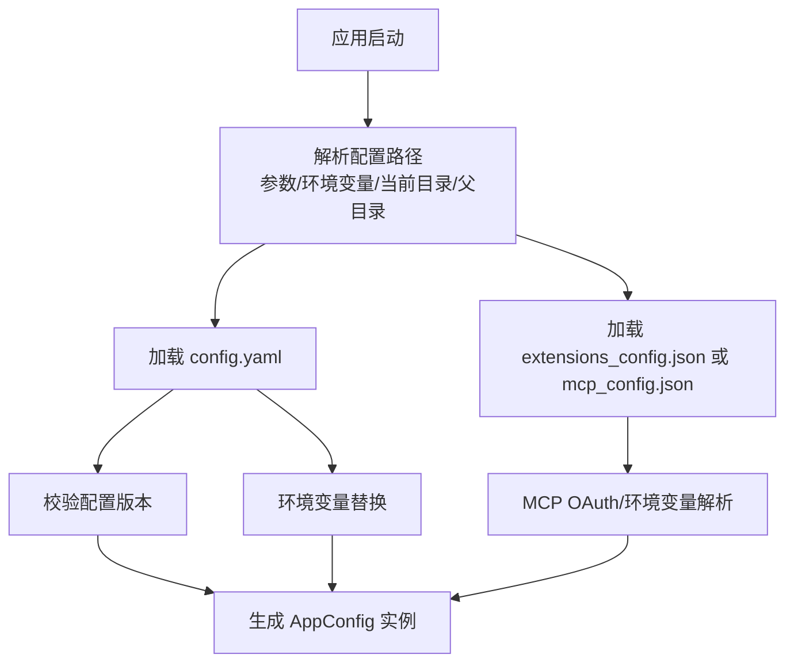
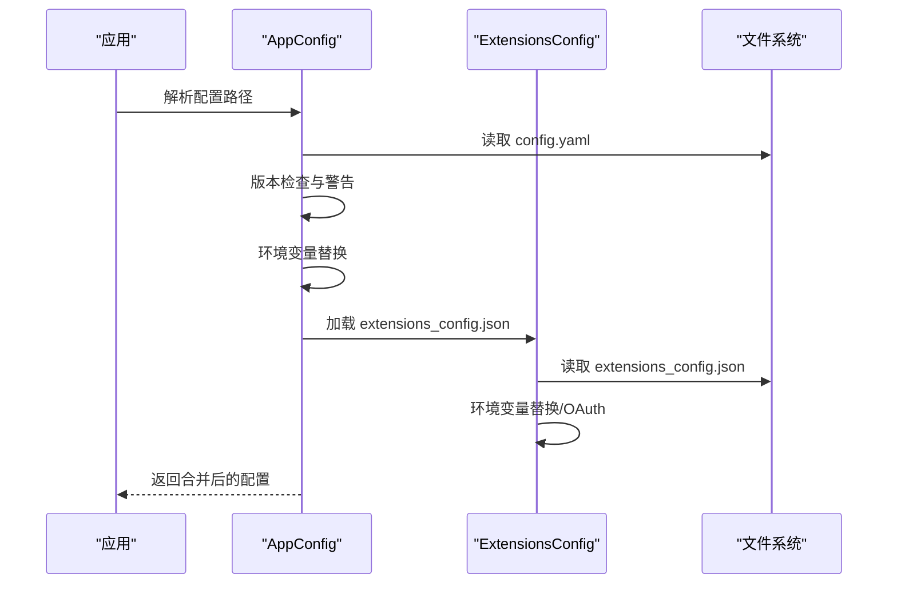
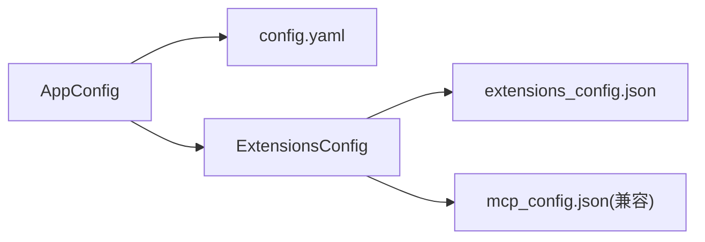

# 配置错误

<cite>
**本文引用的文件**
- [CONFIGURATION.md](file://backend/docs/CONFIGURATION.md)
- [MCP_SERVER.md](file://backend/docs/MCP_SERVER.md)
- [app_config.py](file://backend/packages/harness/deerflow/config/app_config.py)
- [extensions_config.py](file://backend/packages/harness/deerflow/config/extensions_config.py)
- [config.example.yaml](file://config.example.yaml)
- [extensions_config.example.json](file://extensions_config.example.json)
- [test_config_version.py](file://backend/tests/test_config_version.py)
- [test_app_config_reload.py](file://backend/tests/test_app_config_reload.py)
- [config.py](file://backend/app/gateway/config.py)
</cite>

## 目录
1. [简介](#简介)
2. [项目结构与定位](#项目结构与定位)
3. [核心组件与配置体系](#核心组件与配置体系)
4. [架构总览](#架构总览)
5. [详细组件分析与故障排除](#详细组件分析与故障排除)
6. [依赖关系分析](#依赖关系分析)
7. [性能与稳定性建议](#性能与稳定性建议)
8. [故障排除指南](#故障排除指南)
9. [结论](#结论)
10. [附录：配置项与示例路径](#附录配置项与示例路径)

## 简介
本指南聚焦于 DeerFlow 的配置错误排查，覆盖以下方面：
- 配置文件格式错误（YAML/JSON）与字段缺失
- API 密钥与环境变量解析失败
- 配置版本不匹配与升级流程
- MCP 服务器与技能配置问题
- 技能目录与容器挂载路径异常
- 配置热重载与缓存一致性
- 常见错误日志与修复步骤

## 项目结构与定位
- 应用配置主入口位于项目根目录的 config.yaml；后端在默认情况下会优先搜索当前目录与父目录的 config.yaml。
- MCP 扩展配置位于项目根目录的 extensions_config.json（或历史兼容文件 mcp_config.json）。
- 配置加载采用“参数 > 环境变量 > 当前目录 > 父目录”的优先级策略。

图表来源
- [app_config.py:46-72](file://backend/packages/harness/deerflow/config/app_config.py#L46-L72)
- [extensions_config.py:70-117](file://backend/packages/harness/deerflow/config/extensions_config.py#L70-L117)

章节来源
- [CONFIGURATION.md:304-325](file://backend/docs/CONFIGURATION.md#L304-L325)
- [app_config.py:46-72](file://backend/packages/harness/deerflow/config/app_config.py#L46-L72)
- [extensions_config.py:70-117](file://backend/packages/harness/deerflow/config/extensions_config.py#L70-L117)

## 核心组件与配置体系
- 应用配置（AppConfig）
  - 负责解析 config.yaml、版本检查、环境变量替换、子模块配置加载（记忆、摘要、守卫等）、扩展配置合并。
- 扩展配置（ExtensionsConfig）
  - 负责解析 extensions_config.json，支持 MCP 服务器与技能状态管理，含 OAuth 支持与环境变量解析。
- 网关配置（GatewayConfig）
  - 提供网关主机、端口与 CORS 源的环境变量注入。

章节来源
- [app_config.py:30-131](file://backend/packages/harness/deerflow/config/app_config.py#L30-L131)
- [extensions_config.py:55-144](file://backend/packages/harness/deerflow/config/extensions_config.py#L55-L144)
- [config.py:6-27](file://backend/app/gateway/config.py#L6-L27)

## 架构总览
下图展示配置加载与校验的关键流程，以及与 MCP 扩展的关系。

图表来源
- [app_config.py:75-131](file://backend/packages/harness/deerflow/config/app_config.py#L75-L131)
- [extensions_config.py:120-144](file://backend/packages/harness/deerflow/config/extensions_config.py#L120-L144)

## 详细组件分析与故障排除

### 1) 配置文件格式错误与字段缺失
- 常见问题
  - YAML 语法错误（缩进、特殊字符、非法键名）
  - 缺少必填字段（如 sandbox.use）
  - 字段类型不匹配（字符串与数字混用）
- 定位与修复
  - 使用示例文件作为对照：参考项目根目录的 config.example.yaml，确保字段齐全且类型正确。
  - 关注版本字段 config_version，若低于示例版本，启动时会发出“过期”警告，并提示执行升级脚本。
  - 若找不到 config.yaml，检查配置路径解析顺序：参数 > 环境变量 > 当前目录 > 父目录。
- 验证方法
  - 运行配置加载单元测试，观察版本比较逻辑是否触发警告或异常。
  - 修改配置后，通过热重载测试验证变更生效。

章节来源
- [CONFIGURATION.md:5-16](file://backend/docs/CONFIGURATION.md#L5-L16)
- [CONFIGURATION.md:326-350](file://backend/docs/CONFIGURATION.md#L326-L350)
- [app_config.py:46-72](file://backend/packages/harness/deerflow/config/app_config.py#L46-L72)
- [test_config_version.py:35-126](file://backend/tests/test_config_version.py#L35-L126)

### 2) API 密钥与环境变量解析失败
- 常见问题
  - 环境变量未设置或名称拼写错误
  - 在配置中使用 $VAR 形式但未导出到进程环境
  - 批量密钥（如多个模型 API Key）未统一命名
- 定位与修复
  - 确认所有以 $ 开头的占位符都能被 os.getenv 正确解析。
  - 对于 MCP 的 OAuth，确保 client_id/client_secret 等值来自环境变量而非明文硬编码。
  - 参考示例文件中的环境变量命名规范。
- 验证方法
  - 在 shell 中先导出环境变量，再运行后端服务进行验证。
  - 对于 MCP OAuth，检查 token 获取与刷新流程是否成功。

章节来源
- [CONFIGURATION.md:287-303](file://backend/docs/CONFIGURATION.md#L287-L303)
- [app_config.py:179-201](file://backend/packages/harness/deerflow/config/app_config.py#L179-L201)
- [extensions_config.py:147-175](file://backend/packages/harness/deerflow/config/extensions_config.py#L147-L175)
- [MCP_SERVER.md:17-46](file://backend/docs/MCP_SERVER.md#L17-L46)

### 3) 配置版本不匹配与升级流程
- 现象
  - 启动日志出现“config.yaml 已过期，最新版本是 X，请执行升级”警告。
- 原因
  - 用户配置的 config_version 小于 config.example.yaml 中的版本。
- 处理步骤
  - 执行项目提供的升级脚本，自动合并新字段，保留现有配置并生成备份。
  - 升级后重启服务，确认不再出现版本警告。
- 测试保障
  - 单元测试覆盖了“缺失版本视为 0”、“匹配版本无警告”、“字符串版本号安全比较”等边界场景。

章节来源
- [CONFIGURATION.md:5-16](file://backend/docs/CONFIGURATION.md#L5-L16)
- [app_config.py:134-177](file://backend/packages/harness/deerflow/config/app_config.py#L134-L177)
- [test_config_version.py:35-126](file://backend/tests/test_config_version.py#L35-L126)

### 4) MCP 服务器与技能配置问题
- 常见问题
  - MCP 服务器未启用或命令/参数错误
  - HTTP/SSE 服务器缺少 OAuth 配置或凭据无效
  - 技能未启用或路径映射错误
- 定位与修复
  - 将 extensions_config.example.json 复制为 extensions_config.json，按需启用对应服务器或技能。
  - 对于 HTTP/SSE 服务器，配置 oauth 块并确保环境变量可用。
  - 确保 MCP 服务器可执行文件存在且可执行权限正确。
- 验证方法
  - 启动后端，观察 MCP 工具是否出现在可用工具列表中。
  - 对于 OAuth，检查令牌获取与刷新日志。

章节来源
- [MCP_SERVER.md:1-65](file://backend/docs/MCP_SERVER.md#L1-L65)
- [extensions_config.py:55-144](file://backend/packages/harness/deerflow/config/extensions_config.py#L55-L144)
- [extensions_config.example.json:1-42](file://extensions_config.example.json#L1-L42)

### 5) 技能配置与容器挂载路径
- 常见问题
  - 自定义 skills.path 未设置或路径不存在
  - 容器内挂载路径 skills.container_path 与实际访问路径不一致
- 定位与修复
  - 若未指定 skills.path，默认从 backend 目录相对路径 ../skills 解析。
  - 确保容器内挂载路径与 agent 访问路径一致。
- 验证方法
  - 在本地与 Docker 环境分别验证技能可见性与调用结果。

章节来源
- [CONFIGURATION.md:256-274](file://backend/docs/CONFIGURATION.md#L256-L274)
- [skills_config.py:18-37](file://backend/packages/harness/deerflow/config/skills_config.py#L18-L37)

### 6) 配置热重载与缓存一致性
- 现象
  - 修改 config.yaml 后未立即生效，或切换 DEER_FLOW_CONFIG_PATH 后仍读取旧配置。
- 原因
  - 配置缓存命中导致未重新加载。
- 处理步骤
  - 使用重载接口强制刷新，或重置缓存后再次加载。
  - 单元测试验证了文件修改时间变化与路径变化均能触发重载。
- 注意事项
  - 扩展配置（extensions_config.json）同样支持热重载。

章节来源
- [app_config.py:263-305](file://backend/packages/harness/deerflow/config/app_config.py#L263-L305)
- [extensions_config.py:220-235](file://backend/packages/harness/deerflow/config/extensions_config.py#L220-L235)
- [test_app_config_reload.py:35-82](file://backend/tests/test_app_config_reload.py#L35-L82)

### 7) 网关配置与跨域问题
- 常见问题
  - CORS 源未包含前端地址，导致跨域请求失败。
- 定位与修复
  - 通过环境变量设置网关主机、端口与允许的 CORS 源。
- 验证方法
  - 在浏览器控制台查看网络请求的 CORS 错误，调整后端 CORS 设置。

章节来源
- [config.py:6-27](file://backend/app/gateway/config.py#L6-L27)

## 依赖关系分析
- 配置加载链路
  - AppConfig 依赖 dotenv 加载环境变量，随后解析 config.yaml 并进行版本检查与环境变量替换。
  - ExtensionsConfig 独立于 AppConfig，负责 MCP 与技能配置的加载与校验。
- 兼容性与回退
  - extensions_config.json 不存在时，系统返回空配置（非致命），保持向后兼容。
  - 兼容历史文件 mcp_config.json，避免迁移期间中断。

图表来源
- [app_config.py:126-131](file://backend/packages/harness/deerflow/config/app_config.py#L126-L131)
- [extensions_config.py:119-144](file://backend/packages/harness/deerflow/config/extensions_config.py#L119-L144)

章节来源
- [extensions_config.py:70-117](file://backend/packages/harness/deerflow/config/extensions_config.py#L70-L117)

## 性能与稳定性建议
- 避免在配置中放置大量一次性工具或过多 MCP 服务器，减少启动与运行时开销。
- 对于高并发场景，优先使用 Docker/AIO 沙箱隔离，降低资源争用风险。
- 合理设置记忆与摘要阈值，避免长对话导致上下文膨胀。

## 故障排除指南

### 常见错误与处理清单
- “配置文件未找到”
  - 确认 config.yaml 位于项目根目录或通过 DEER_FLOW_CONFIG_PATH 指定。
  - 检查当前工作目录与父目录是否存在 config.yaml。
- “配置版本过期”
  - 执行升级脚本，合并新字段并保留现有配置。
  - 升级后重启服务，确认不再出现版本警告。
- “API 密钥无效”
  - 检查环境变量是否已导出，确认 $VAR 引用是否正确。
  - 对于 MCP OAuth，检查 token_url、grant_type、client_id/client_secret 是否正确。
- “MCP 服务器无法启动/工具不可用”
  - 确认服务器已启用且命令/参数正确。
  - 对于 HTTP/SSE，检查 OAuth 配置与令牌获取日志。
- “技能未加载”
  - 检查 skills.path 与 skills.container_path 是否正确。
  - 确认技能目录存在且包含有效元数据文件。
- “配置修改未生效”
  - 使用重载接口或重置缓存后再次加载。
  - 确认 DEER_FLOW_CONFIG_PATH 或工作目录已切换。

章节来源
- [CONFIGURATION.md:326-350](file://backend/docs/CONFIGURATION.md#L326-L350)
- [app_config.py:134-177](file://backend/packages/harness/deerflow/config/app_config.py#L134-L177)
- [extensions_config.py:147-175](file://backend/packages/harness/deerflow/config/extensions_config.py#L147-L175)
- [test_app_config_reload.py:35-82](file://backend/tests/test_app_config_reload.py#L35-L82)

## 结论
- 配置错误多源于路径、版本、环境变量与格式三类问题。
- 建议以示例配置为基准核对字段与类型，严格遵循版本升级流程。
- 利用热重载与单元测试验证配置变更，结合日志快速定位 MCP 与技能加载问题。

## 附录：配置项与示例路径
- 应用配置（config.yaml）
  - 示例路径：[config.example.yaml](file://config.example.yaml)
  - 关键字段：models、tools、tool_groups、sandbox、skills、title、summarization、memory、checkpointer、channels、guardrails
- 扩展配置（extensions_config.json）
  - 示例路径：[extensions_config.example.json](file://extensions_config.example.json)
  - 关键字段：mcpServers、skills
- 网关配置（环境变量）
  - 示例路径：[config.py](file://backend/app/gateway/config.py)
  - 关键变量：GATEWAY_HOST、GATEWAY_PORT、CORS_ORIGINS